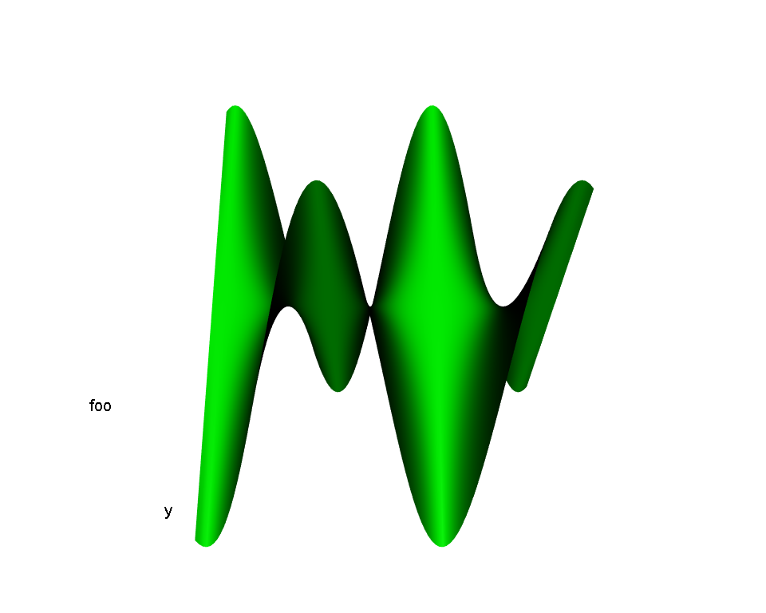

Simple R Presentation
========================================================
title: "Simple R Presentation"
author: John Doe
date: 10/04/2015
width: 1900
height: 1000


My First Slide
========================================================
Hello World!  
Creating Rpresentations isn't difficult at all!  


***

The Cauchy-Schwarz Inequality:  

$$
\left( \sum_{k=1}^n a_k b_k \right)^2 
\leq 
\left( \sum_{k=1}^n a_k^2 \right) 
\left( \sum_{k=1}^n b_k^2 \right) 
$$


Slide With R Code Chunk and Output in Two Columns
========================================================

First column contains simple R code that returns the summary of the cars data frame:  

```r
> summary(cars)
```

***

Second column contains the output of the code in the first column:  

```
     speed           dist    
 Min.   : 4.0   Min.   :  2  
 1st Qu.:12.0   1st Qu.: 26  
 Median :15.0   Median : 36  
 Mean   :15.4   Mean   : 43  
 3rd Qu.:19.0   3rd Qu.: 56  
 Max.   :25.0   Max.   :120  
```


Slide With Plot
========================================================

First column with R code:  

```r
> plot(cars)
```

***

Second column with plot:  
 


Slide with Interactive 3d Surface Plot
========================================================

First column with R code:  

```r
> library(rgl)  # load rgl
> knit_hooks$set(webgl=hook_webgl)
> # define function of two variables
> foo <- function(x, y) y*sin(x)
> # draw 3d surface plot of function
> persp3d(x=foo, xlim=c(-5, 5), ylim=c(-5, 5), col="green", axes=FALSE)
```

***

Second column with plot:  
<script src="CanvasMatrix.js" type="text/javascript"></script>
<canvas id="rgl_surf3dtextureCanvas" style="display: none;" width="256" height="256">
<br>
Your browser does not support the HTML5 canvas element.</canvas>
<!-- ****** surface object 7 ****** -->
<script id="rgl_surf3dvshader7" type="x-shader/x-vertex">
attribute vec3 aPos;
attribute vec4 aCol;
uniform mat4 mvMatrix;
uniform mat4 prMatrix;
varying vec4 vCol;
varying vec4 vPosition;
attribute vec3 aNorm;
uniform mat4 normMatrix;
varying vec3 vNormal;
void main(void) {
vPosition = mvMatrix * vec4(aPos, 1.);
gl_Position = prMatrix * vPosition;
vCol = aCol;
vNormal = normalize((normMatrix * vec4(aNorm, 1.)).xyz);
}
</script>
<script id="rgl_surf3dfshader7" type="x-shader/x-fragment"> 
#ifdef GL_ES
precision highp float;
#endif
varying vec4 vCol; // carries alpha
varying vec4 vPosition;
varying vec3 vNormal;
void main(void) {
vec3 eye = normalize(-vPosition.xyz);
const vec3 emission = vec3(0., 0., 0.);
const vec3 ambient1 = vec3(0., 0., 0.);
const vec3 specular1 = vec3(1., 1., 1.);// light*material
const float shininess1 = 50.;
vec4 colDiff1 = vec4(vCol.rgb * vec3(1., 1., 1.), vCol.a);
const vec3 lightDir1 = vec3(0., 0., 1.);
vec3 halfVec1 = normalize(lightDir1 + eye);
vec4 lighteffect = vec4(emission, 0.);
vec3 n = normalize(vNormal);
n = -faceforward(n, n, eye);
vec3 col1 = ambient1;
float nDotL1 = dot(n, lightDir1);
col1 = col1 + max(nDotL1, 0.) * colDiff1.rgb;
col1 = col1 + pow(max(dot(halfVec1, n), 0.), shininess1) * specular1;
lighteffect = lighteffect + vec4(col1, colDiff1.a);
gl_FragColor = lighteffect;
}
</script> 
<!-- ****** text object 8 ****** -->
<script id="rgl_surf3dvshader8" type="x-shader/x-vertex">
attribute vec3 aPos;
attribute vec4 aCol;
uniform mat4 mvMatrix;
uniform mat4 prMatrix;
varying vec4 vCol;
varying vec4 vPosition;
attribute vec2 aTexcoord;
varying vec2 vTexcoord;
uniform vec2 textScale;
attribute vec2 aOfs;
void main(void) {
vCol = aCol;
vTexcoord = aTexcoord;
vec4 pos = prMatrix * mvMatrix * vec4(aPos, 1.);
pos = pos/pos.w;
gl_Position = pos + vec4(aOfs*textScale, 0.,0.);
}
</script>
<script id="rgl_surf3dfshader8" type="x-shader/x-fragment"> 
#ifdef GL_ES
precision highp float;
#endif
varying vec4 vCol; // carries alpha
varying vec4 vPosition;
varying vec2 vTexcoord;
uniform sampler2D uSampler;
void main(void) {
vec4 colDiff = vCol;
vec4 lighteffect = colDiff;
vec4 textureColor = lighteffect*texture2D(uSampler, vTexcoord);
if (textureColor.a < 0.1)
discard;
else
gl_FragColor = textureColor;
}
</script> 
<!-- ****** text object 9 ****** -->
<script id="rgl_surf3dvshader9" type="x-shader/x-vertex">
attribute vec3 aPos;
attribute vec4 aCol;
uniform mat4 mvMatrix;
uniform mat4 prMatrix;
varying vec4 vCol;
varying vec4 vPosition;
attribute vec2 aTexcoord;
varying vec2 vTexcoord;
uniform vec2 textScale;
attribute vec2 aOfs;
void main(void) {
vCol = aCol;
vTexcoord = aTexcoord;
vec4 pos = prMatrix * mvMatrix * vec4(aPos, 1.);
pos = pos/pos.w;
gl_Position = pos + vec4(aOfs*textScale, 0.,0.);
}
</script>
<script id="rgl_surf3dfshader9" type="x-shader/x-fragment"> 
#ifdef GL_ES
precision highp float;
#endif
varying vec4 vCol; // carries alpha
varying vec4 vPosition;
varying vec2 vTexcoord;
uniform sampler2D uSampler;
void main(void) {
vec4 colDiff = vCol;
vec4 lighteffect = colDiff;
vec4 textureColor = lighteffect*texture2D(uSampler, vTexcoord);
if (textureColor.a < 0.1)
discard;
else
gl_FragColor = textureColor;
}
</script> 
<!-- ****** text object 10 ****** -->
<script id="rgl_surf3dvshader10" type="x-shader/x-vertex">
attribute vec3 aPos;
attribute vec4 aCol;
uniform mat4 mvMatrix;
uniform mat4 prMatrix;
varying vec4 vCol;
varying vec4 vPosition;
attribute vec2 aTexcoord;
varying vec2 vTexcoord;
uniform vec2 textScale;
attribute vec2 aOfs;
void main(void) {
vCol = aCol;
vTexcoord = aTexcoord;
vec4 pos = prMatrix * mvMatrix * vec4(aPos, 1.);
pos = pos/pos.w;
gl_Position = pos + vec4(aOfs*textScale, 0.,0.);
}
</script>
<script id="rgl_surf3dfshader10" type="x-shader/x-fragment"> 
#ifdef GL_ES
precision highp float;
#endif
varying vec4 vCol; // carries alpha
varying vec4 vPosition;
varying vec2 vTexcoord;
uniform sampler2D uSampler;
void main(void) {
vec4 colDiff = vCol;
vec4 lighteffect = colDiff;
vec4 textureColor = lighteffect*texture2D(uSampler, vTexcoord);
if (textureColor.a < 0.1)
discard;
else
gl_FragColor = textureColor;
}
</script> 
<script type="text/javascript">
var min = Math.min;
var max = Math.max;
var sqrt = Math.sqrt;
var sin = Math.sin;
var acos = Math.acos;
var tan = Math.tan;
var SQRT2 = Math.SQRT2;
var PI = Math.PI;
var log = Math.log;
var exp = Math.exp;
var rglClass = function() {
this.zoom = new Array();
this.FOV  = new Array();
this.userMatrix = new CanvasMatrix4();
this.viewport = new Array();
this.listeners = new Array();
this.clipplanes = new Array();
this.opaque = new Array();
this.transparent = new Array();
this.subscenes = new Array();
this.flags = new Array();
this.prog = new Array();
this.ofsLoc = new Array();
this.origLoc = new Array();
this.sizeLoc = new Array();
this.usermatLoc = new Array();
this.vClipplane = new Array();
this.texture = new Array();
this.texLoc = new Array();
this.sampler = new Array();
this.origsize = new Array();
this.values = new Array();
this.offsets = new Array();
this.normLoc = new Array();
this.clipLoc = new Array();
this.centers = new Array();
this.f = new Array();
this.buf = new Array();
this.ibuf = new Array();
this.mvMatLoc = new Array();
this.prMatLoc = new Array();
this.textScaleLoc = new Array();
this.normMatLoc = new Array();
this.IMVClip = new Array();
this.drawFns = new Array();
this.clipFns = new Array();
this.prMatrix = new CanvasMatrix4();
this.mvMatrix = new CanvasMatrix4();
this.vp = null;
this.prmvMatrix = null;
this.origs = null;
this.gl = null;
};
(function() {
this.getShader = function( gl, id ){
var shaderScript = document.getElementById ( id );
var str = "";
var k = shaderScript.firstChild;
while ( k ){
if ( k.nodeType == 3 ) str += k.textContent;
k = k.nextSibling;
}
var shader;
if ( shaderScript.type == "x-shader/x-fragment" )
shader = gl.createShader ( gl.FRAGMENT_SHADER );
else if ( shaderScript.type == "x-shader/x-vertex" )
shader = gl.createShader(gl.VERTEX_SHADER);
else return null;
gl.shaderSource(shader, str);
gl.compileShader(shader);
if (gl.getShaderParameter(shader, gl.COMPILE_STATUS) == 0)
alert(gl.getShaderInfoLog(shader));
return shader;
}
this.multMV = function(M, v) {
return [M.m11*v[0] + M.m12*v[1] + M.m13*v[2] + M.m14*v[3],
M.m21*v[0] + M.m22*v[1] + M.m23*v[2] + M.m24*v[3],
M.m31*v[0] + M.m32*v[1] + M.m33*v[2] + M.m34*v[3],
M.m41*v[0] + M.m42*v[1] + M.m43*v[2] + M.m44*v[3]];
}
this.f_is_lit = 1;
this.f_is_smooth = 2;
this.f_has_texture = 4;
this.f_is_indexed = 8;
this.f_depth_sort = 16;
this.f_fixed_quads = 32;
this.f_is_transparent = 64;
this.f_is_lines = 128;
this.f_sprites_3d = 256;
this.f_sprite_3d = 512;
this.f_is_subscene = 1024;
this.f_is_clipplanes = 2048;
this.f_reuse = 4096;
this.whichList = function(id) {
if (this.flags[id] & this.f_is_subscene)
return "subscenes";
else if (this.flags[id] & this.f_is_clipplanes)
return "clipplanes";
else if (this.flags[id] & this.f_is_transparent)
return "transparent";
else
return "opaque"; 
}
this.inSubscene = function(id, subscene) {
var thelist = this.whichList(id);
return this[thelist][subscene].indexOf(id) > -1;
}
this.addToSubscene = function(id, subscene) {
var thelist = this.whichList(id);
if (this[thelist][subscene].indexOf(id) == -1)
this[thelist][subscene].push(id);
}
this.delFromSubscene = function(id, subscene) {
var thelist = this.whichList(id);
var i = this[thelist][subscene].indexOf(id);
if (i > -1)
this[thelist][subscene].splice(i, 1);
}
this.setSubsceneEntries = function(ids, subscene) {
this.subscenes[subscene] = [];
this.clipplanes[subscene] = [];
this.transparent[subscene] = [];
this.opaque[subscene] = [];
for (var i = 0; i < ids.length; i++)
this.addToSubscene(ids[i], subscene);
}
this.getSubsceneEntries = function(subscene) {
return(this.subscenes[subscene].concat(this.clipplanes[subscene]).
concat(this.transparent[subscene]).concat(this.opaque[subscene]));
}
}).call(rglClass.prototype);
var rgl_surf3drgl = new rglClass();
rgl_surf3drgl.start = function() {
var debug = function(msg) {
document.getElementById("rgl_surf3ddebug").innerHTML = msg;
}
debug("");
var canvas = document.getElementById("rgl_surf3dcanvas");
if (!window.WebGLRenderingContext){
debug("<br> Your browser does not support WebGL. See <a href=\"http://get.webgl.org\">http://get.webgl.org</a>");
return;
}
try {
// Try to grab the standard context. If it fails, fallback to experimental.
this.gl = canvas.getContext("webgl") 
|| canvas.getContext("experimental-webgl");
}
catch(e) {}
if ( !this.gl ) {
debug("<br> Your browser appears to support WebGL, but did not create a WebGL context.  See <a href=\"http://get.webgl.org\">http://get.webgl.org</a>");
return;
}
var gl = this.gl;
var width = 721;  var height = 577;
canvas.width = width;   canvas.height = height;
var normMatrix = new CanvasMatrix4();
var saveMat = new Object();
var distance;
var posLoc = 0;
var colLoc = 1;
var activeSubscene = 1;
this.flags[1] = 1067;
this.zoom[1] = 1;
this.FOV[1] = 30;
this.viewport[1] = [0, 0, 720, 576];
this.userMatrix[1] = new CanvasMatrix4();
this.userMatrix[1].load([
1, 0, 0, 0,
0, 0.3420201, -0.9396926, 0,
0, 0.9396926, 0.3420201, 0,
0, 0, 0, 1
]);
this.clipplanes[1] = [];
this.opaque[1] = [7,8,9,10];
this.transparent[1] = [];
this.subscenes[1] = [];
function getPowerOfTwo(value) {
var pow = 1;
while(pow<value) {
pow *= 2;
}
return pow;
}
function handleLoadedTexture(texture, textureCanvas) {
gl.pixelStorei(gl.UNPACK_FLIP_Y_WEBGL, true);
gl.bindTexture(gl.TEXTURE_2D, texture);
gl.texImage2D(gl.TEXTURE_2D, 0, gl.RGBA, gl.RGBA, gl.UNSIGNED_BYTE, textureCanvas);
gl.texParameteri(gl.TEXTURE_2D, gl.TEXTURE_MAG_FILTER, gl.LINEAR);
gl.texParameteri(gl.TEXTURE_2D, gl.TEXTURE_MIN_FILTER, gl.LINEAR_MIPMAP_NEAREST);
gl.generateMipmap(gl.TEXTURE_2D);
gl.bindTexture(gl.TEXTURE_2D, null);
}
function loadImageToTexture(filename, texture) {   
var canvas = document.getElementById("rgl_surf3dtextureCanvas");
var ctx = canvas.getContext("2d");
var image = new Image();
image.onload = function() {
var w = image.width;
var h = image.height;
var canvasX = getPowerOfTwo(w);
var canvasY = getPowerOfTwo(h);
canvas.width = canvasX;
canvas.height = canvasY;
ctx.imageSmoothingEnabled = true;
ctx.drawImage(image, 0, 0, canvasX, canvasY);
handleLoadedTexture(texture, canvas);
rgl_surf3drgl.drawScene();
}
image.src = filename;
}  	   
function drawTextToCanvas(text, cex) {
var canvasX, canvasY;
var textX, textY;
var textHeight = 20 * cex;
var textColour = "white";
var fontFamily = "Arial";
var backgroundColour = "rgba(0,0,0,0)";
var canvas = document.getElementById("rgl_surf3dtextureCanvas");
var ctx = canvas.getContext("2d");
ctx.font = textHeight+"px "+fontFamily;
canvasX = 1;
var widths = [];
for (var i = 0; i < text.length; i++)  {
widths[i] = ctx.measureText(text[i]).width;
canvasX = (widths[i] > canvasX) ? widths[i] : canvasX;
}	  
canvasX = getPowerOfTwo(canvasX);
var offset = 2*textHeight; // offset to first baseline
var skip = 2*textHeight;   // skip between baselines	  
canvasY = getPowerOfTwo(offset + text.length*skip);
canvas.width = canvasX;
canvas.height = canvasY;
ctx.fillStyle = backgroundColour;
ctx.fillRect(0, 0, ctx.canvas.width, ctx.canvas.height);
ctx.fillStyle = textColour;
ctx.textAlign = "left";
ctx.textBaseline = "alphabetic";
ctx.font = textHeight+"px "+fontFamily;
for(var i = 0; i < text.length; i++) {
textY = i*skip + offset;
ctx.fillText(text[i], 0,  textY);
}
return {canvasX:canvasX, canvasY:canvasY,
widths:widths, textHeight:textHeight,
offset:offset, skip:skip};
}
// ****** surface object 7 ******
this.flags[7] = 11;
this.prog[7]  = gl.createProgram();
gl.attachShader(this.prog[7], this.getShader( gl, "rgl_surf3dvshader7" ));
gl.attachShader(this.prog[7], this.getShader( gl, "rgl_surf3dfshader7" ));
//  Force aPos to location 0, aCol to location 1 
gl.bindAttribLocation(this.prog[7], 0, "aPos");
gl.bindAttribLocation(this.prog[7], 1, "aCol");
gl.linkProgram(this.prog[7]);
this.offsets[7]={vofs:0, cofs:-1, nofs:3, radofs:-1, oofs:-1, tofs:-1, stride:6};
var v=new Float32Array([
-5, -5, -4.794621, 0.6412388, -0.5344375, 0.5506264,
-4.9, -5, -4.912263, 0.5420208, -0.5884057, 0.5999936,
-4.8, -5, -4.980823, 0.2861915, -0.6754453, 0.6796089,
-4.7, -5, -4.999616, -0.04207553, -0.7055705, 0.7073897,
-4.6, -5, -4.968455, -0.3583423, -0.6573299, 0.6629542,
-4.5, -5, -4.88765, -0.5906149, -0.5636003, 0.5775194,
-4.4, -5, -4.75801, -0.7359414, -0.4664266, 0.4907509,
-4.3, -5, -4.58083, -0.8229306, -0.3836013, 0.4190886,
-4.2, -5, -4.357879, -0.8759886, -0.3167825, 0.363721,
-4.1, -5, -4.091385, -0.9096457, -0.2629636, 0.3215503,
-4, -5, -3.784013, -0.9318745, -0.2188574, 0.289329,
-3.9, -5, -3.438831, -0.9470721, -0.1818626, 0.2645379,
-3.8, -5, -3.059289, -0.9577424, -0.1500751, 0.2453713,
-3.7, -5, -2.649181, -0.9653648, -0.1221166, 0.2305607,
-3.6, -5, -2.212602, -0.9708446, -0.0969765, 0.2192175,
-3.5, -5, -1.753916, -0.9747496, -0.07389419, 0.21072,
-3.4, -5, -1.277706, -0.9774407, -0.05227791, 0.2046379,
-3.3, -5, -0.7887285, -0.9791453, -0.03164745, 0.200681,
-3.2, -5, -0.2918707, -0.979998, -0.01159385, 0.1986697,
-3.1, -5, 0.2079033, -0.9800631, 0.008252014, 0.1985151,
-3, -5, 0.7056, -0.9793457, 0.02824551, 0.2002101,
-2.9, -5, 1.196247, -0.9777917, 0.0487518, 0.20383,
-2.8, -5, 1.674941, -0.9752795, 0.07017119, 0.209538,
-2.7, -5, 2.136899, -0.9715994, 0.09296938, 0.2176035,
-2.6, -5, 2.577507, -0.9664173, 0.1177158, 0.2284306,
-2.5, -5, 2.992361, -0.9592071, 0.1451375, 0.2426042,
-2.4, -5, 3.377316, -0.949133, 0.1761968, 0.2609621,
-2.3, -5, 3.728526, -0.934836, 0.2121994, 0.2846982,
-2.2, -5, 4.042482, -0.9140301, 0.2549488, 0.3155154,
-2.1, -5, 4.316047, -0.8827258, 0.3069198, 0.3558024,
-2, -5, 4.546487, -0.8337203, 0.3713088, 0.4087055,
-1.9, -5, 4.731501, -0.7538499, 0.4513342, 0.4775015,
-1.8, -5, 4.869238, -0.6204501, 0.5467048, 0.5622771,
-1.7, -5, 4.958324, -0.4041567, 0.6433865, 0.6501625,
-1.6, -5, 4.997868, -0.09881075, 0.7026238, 0.7046674,
-1.5, -5, 4.987475, 0.2344004, 0.6857288, 0.6890808,
-1.4, -5, 4.927248, 0.5057451, 0.6049417, 0.6150346,
-1.3, -5, 4.817791, 0.6843287, 0.5055814, 0.5254347,
-1.2, -5, 4.660195, 0.7920241, 0.4160094, 0.4468043,
-1.1, -5, 4.456037, 0.8569194, 0.3427931, 0.3849443,
-1, -5, 4.207355, 0.8973851, 0.2839929, 0.3377098,
-0.9, -5, 3.916635, 0.9236786, 0.236207, 0.3017018,
-0.8, -5, 3.586781, 0.9414144, 0.1965219, 0.2740767,
-0.7, -5, 3.221088, 0.9537427, 0.1627619, 0.2527514,
-0.6, -5, 2.823212, 0.9624971, 0.1333516, 0.2362557,
-0.5, -5, 2.397128, 0.9687836, 0.1071439, 0.2235591,
-0.4, -5, 1.947092, 0.9732898, 0.08328588, 0.21394,
-0.3, -5, 1.477601, 0.9764519, 0.0611234, 0.2068956,
-0.2, -5, 0.9933466, 0.9785458, 0.04013577, 0.2020824,
-0.1, -5, 0.4991671, 0.9797412, 0.01988882, 0.1992775,
0, -5, -0, 0.98013, -0, 0.1983561,
0.1, -5, -0.4991671, 0.9797413, -0.01988883, 0.1992776,
0.2, -5, -0.9933466, 0.9785458, -0.04013579, 0.2020824,
0.3, -5, -1.477601, 0.9764519, -0.0611234, 0.2068956,
0.4, -5, -1.947092, 0.9732898, -0.08328589, 0.21394,
0.5, -5, -2.397128, 0.9687835, -0.1071439, 0.2235591,
0.6, -5, -2.823212, 0.9624971, -0.1333516, 0.2362557,
0.7, -5, -3.221088, 0.9537427, -0.1627619, 0.2527515,
0.8, -5, -3.586781, 0.9414144, -0.1965219, 0.2740767,
0.9, -5, -3.916635, 0.9236786, -0.236207, 0.3017018,
1, -5, -4.207355, 0.8973851, -0.2839929, 0.3377098,
1.1, -5, -4.456037, 0.8569194, -0.3427931, 0.3849443,
1.2, -5, -4.660195, 0.7920241, -0.4160093, 0.4468043,
1.3, -5, -4.817791, 0.6843287, -0.5055814, 0.5254347,
1.4, -5, -4.927248, 0.5057451, -0.6049417, 0.6150346,
1.5, -5, -4.987475, 0.2344004, -0.6857287, 0.6890809,
1.6, -5, -4.997868, -0.09881075, -0.7026238, 0.7046674,
1.7, -5, -4.958324, -0.4041567, -0.6433864, 0.6501625,
1.8, -5, -4.869238, -0.6204501, -0.5467049, 0.5622771,
1.9, -5, -4.731501, -0.75385, -0.4513342, 0.4775016,
2, -5, -4.546487, -0.8337203, -0.3713088, 0.4087055,
2.1, -5, -4.316047, -0.8827258, -0.3069198, 0.3558023,
2.2, -5, -4.042482, -0.9140302, -0.2549488, 0.3155155,
2.3, -5, -3.728526, -0.934836, -0.2121994, 0.2846982,
2.4, -5, -3.377316, -0.949133, -0.1761968, 0.2609621,
2.5, -5, -2.992361, -0.9592071, -0.1451376, 0.2426042,
2.6, -5, -2.577507, -0.9664173, -0.1177158, 0.2284306,
2.7, -5, -2.136899, -0.9715995, -0.09296939, 0.2176035,
2.8, -5, -1.674941, -0.9752795, -0.07017119, 0.209538,
2.9, -5, -1.196247, -0.9777917, -0.04875181, 0.20383,
3, -5, -0.7056, -0.9793457, -0.02824551, 0.20021,
3.1, -5, -0.2079033, -0.9800631, -0.008252021, 0.1985151,
3.2, -5, 0.2918707, -0.979998, 0.01159384, 0.1986698,
3.3, -5, 0.7887285, -0.9791453, 0.03164746, 0.2006811,
3.4, -5, 1.277706, -0.9774407, 0.05227792, 0.2046379,
3.5, -5, 1.753916, -0.9747496, 0.07389417, 0.21072,
3.6, -5, 2.212602, -0.9708446, 0.09697649, 0.2192175,
3.7, -5, 2.649181, -0.9653648, 0.1221166, 0.2305607,
3.8, -5, 3.059289, -0.9577424, 0.1500751, 0.2453713,
3.9, -5, 3.438831, -0.9470721, 0.1818626, 0.2645379,
4, -5, 3.784013, -0.9318746, 0.2188574, 0.289329,
4.1, -5, 4.091385, -0.9096457, 0.2629637, 0.3215503,
4.2, -5, 4.357879, -0.8759886, 0.3167825, 0.363721,
4.3, -5, 4.58083, -0.8229306, 0.3836012, 0.4190887,
4.4, -5, 4.75801, -0.7359415, 0.4664266, 0.4907509,
4.5, -5, 4.88765, -0.5906149, 0.5636004, 0.5775194,
4.6, -5, 4.968455, -0.3583423, 0.6573299, 0.6629542,
4.7, -5, 4.999616, -0.04207553, 0.7055705, 0.7073897,
4.8, -5, 4.980823, 0.2861915, 0.6754452, 0.6796089,
4.9, -5, 4.912263, 0.5420207, 0.5884057, 0.5999935,
5, -5, 4.794621, 0.6412388, 0.5344376, 0.5506264,
-5, -4.9, -4.698729, 0.6373889, -0.5366806, 0.5529099,
-4.9, -4.9, -4.814018, 0.5382441, -0.5900948, 0.6017321,
-4.8, -4.9, -4.881207, 0.283659, -0.6759724, 0.6801462,
-4.7, -4.9, -4.899624, -0.04167453, -0.705582, 0.7074019,
-4.6, -4.9, -4.869086, -0.3553156, -0.6581391, 0.6637799,
-4.5, -4.9, -4.789897, -0.5867999, -0.5655324, 0.5795162,
-4.4, -4.9, -4.66285, -0.7325378, -0.4689545, 0.4934268,
-4.3, -4.9, -4.489213, -0.8202237, -0.3862287, 0.421972,
-4.2, -4.9, -4.270721, -0.8738998, -0.3192563, 0.3665711,
-4.1, -4.9, -4.009558, -0.9080318, -0.265186, 0.3242756,
-4, -4.9, -3.708332, -0.9306106, -0.2208029, 0.2919074,
-3.9, -4.9, -3.370054, -0.9460649, -0.183535, 0.2669759,
-3.8, -4.9, -2.998104, -0.9569238, -0.151488, 0.2476857,
-3.7, -4.9, -2.596197, -0.9646854, -0.1232857, 0.2327714,
-3.6, -4.9, -2.16835, -0.9702675, -0.09791601, 0.2213443,
-3.5, -4.9, -1.718838, -0.9742466, -0.07461601, 0.2127813,
-3.4, -4.9, -1.252151, -0.9769895, -0.05279147, 0.2066513,
-3.3, -4.9, -0.7729539, -0.978727, -0.03195947, 0.2026626,
-3.2, -4.9, -0.2860333, -0.9795961, -0.01170837, 0.2006349,
-3.1, -4.9, 0.2037452, -0.9796625, 0.008333556, 0.200479,
-3, -4.9, 0.691488, -0.9789314, 0.02852411, 0.2021878,
-2.9, -4.9, 1.172322, -0.9773472, 0.04923109, 0.2058369,
-2.8, -4.9, 1.641442, -0.9747866, 0.07085743, 0.2115901,
-2.7, -4.9, 2.094162, -0.9710367, 0.09387146, 0.219718,
-2.6, -4.9, 2.525957, -0.9657575, 0.1188451, 0.2306259,
-2.5, -4.9, 2.932513, -0.958415, 0.1465081, 0.2448998,
-2.4, -4.9, 3.30977, -0.9481617, 0.1778244, 0.263378,
-2.3, -4.9, 3.653955, -0.933621, 0.2140982, 0.287252,
-2.2, -4.9, 3.961632, -0.9124828, 0.2571253, 0.3182165,
-2.1, -4.9, 4.229726, -0.8807271, 0.309355, 0.3586354,
-2, -4.9, 4.455557, -0.8311273, 0.3739215, 0.4115949,
-1.9, -4.9, 4.63687, -0.75056, 0.4539055, 0.4802391,
-1.8, -4.9, 4.771853, -0.616652, 0.5487802, 0.5644294,
-1.7, -4.9, 4.859158, -0.4008667, 0.6443982, 0.6511965,
-1.6, -4.9, 4.897911, -0.09787586, 0.7026884, 0.7047336,
-1.5, -4.9, 4.887725, 0.2322719, 0.6860868, 0.6894452,
-1.4, -4.9, 4.828704, 0.5020458, 0.6064478, 0.6165801,
-1.3, -4.9, 4.721435, 0.6806801, 0.5079349, 0.5278983,
-1.2, -4.9, 4.566991, 0.7890267, 0.4186383, 0.449643,
-1.1, -4.9, 4.366916, 0.8545907, 0.3453491, 0.3878256,
-1, -4.9, 4.123208, 0.8955905, 0.286326, 0.3404924,
-0.9, -4.9, 3.838302, 0.9222821, 0.2382684, 0.3043416,
-0.8, -4.9, 3.515045, 0.9403099, 0.1983066, 0.2765714,
-0.7, -4.9, 3.156667, 0.9528525, 0.164281, 0.2551149,
-0.6, -4.9, 2.766748, 0.9617648, 0.1346204, 0.2385071,
-0.5, -4.9, 2.349185, 0.9681678, 0.1081773, 0.2257185,
-0.4, -4.9, 1.90815, 0.9727592, 0.08409683, 0.2160264,
-0.3, -4.9, 1.448049, 0.9759815, 0.06172263, 0.2089269,
-0.2, -4.9, 0.9734797, 0.9781159, 0.04053106, 0.2040752,
-0.1, -4.9, 0.4891838, 0.9793345, 0.02008519, 0.2012477,
0, -4.9, -0, 0.9797308, -0, 0.2003188,
0.1, -4.9, -0.4891838, 0.9793345, -0.02008521, 0.2012477,
0.2, -4.9, -0.9734797, 0.9781159, -0.04053107, 0.2040752,
0.3, -4.9, -1.448049, 0.9759815, -0.06172264, 0.2089269,
0.4, -4.9, -1.90815, 0.9727592, -0.08409683, 0.2160264,
0.5, -4.9, -2.349185, 0.9681678, -0.1081773, 0.2257185,
0.6, -4.9, -2.766748, 0.9617648, -0.1346204, 0.2385072,
0.7, -4.9, -3.156667, 0.9528525, -0.164281, 0.2551149,
0.8, -4.9, -3.515045, 0.9403099, -0.1983066, 0.2765714,
0.9, -4.9, -3.838302, 0.9222822, -0.2382685, 0.3043416,
1, -4.9, -4.123208, 0.8955905, -0.2863261, 0.3404924,
1.1, -4.9, -4.366916, 0.8545907, -0.3453491, 0.3878256,
1.2, -4.9, -4.566991, 0.7890267, -0.4186383, 0.449643,
1.3, -4.9, -4.721435, 0.6806802, -0.507935, 0.5278983,
1.4, -4.9, -4.828704, 0.5020458, -0.6064477, 0.6165802,
1.5, -4.9, -4.887725, 0.2322719, -0.6860868, 0.6894452,
1.6, -4.9, -4.897911, -0.09787583, -0.7026883, 0.7047336,
1.7, -4.9, -4.859158, -0.4008667, -0.6443983, 0.6511964,
1.8, -4.9, -4.771853, -0.6166521, -0.5487803, 0.5644294,
1.9, -4.9, -4.63687, -0.75056, -0.4539055, 0.4802391,
2, -4.9, -4.455557, -0.8311273, -0.3739214, 0.4115949,
2.1, -4.9, -4.229726, -0.8807271, -0.309355, 0.3586354,
2.2, -4.9, -3.961632, -0.9124828, -0.2571253, 0.3182165,
2.3, -4.9, -3.653955, -0.933621, -0.2140982, 0.287252,
2.4, -4.9, -3.30977, -0.9481617, -0.1778244, 0.263378,
2.5, -4.9, -2.932513, -0.958415, -0.1465081, 0.2448998,
2.6, -4.9, -2.525957, -0.9657575, -0.1188451, 0.2306259,
2.7, -4.9, -2.094162, -0.9710366, -0.09387144, 0.219718,
2.8, -4.9, -1.641442, -0.9747866, -0.07085742, 0.2115901,
2.9, -4.9, -1.172322, -0.9773472, -0.04923111, 0.2058369,
3, -4.9, -0.691488, -0.9789313, -0.02852411, 0.2021878,
3.1, -4.9, -0.2037452, -0.9796625, -0.008333547, 0.200479,
3.2, -4.9, 0.2860333, -0.9795961, 0.0117084, 0.2006349,
3.3, -4.9, 0.7729539, -0.978727, 0.03195948, 0.2026626,
3.4, -4.9, 1.252151, -0.9769894, 0.05279147, 0.2066512,
3.5, -4.9, 1.718838, -0.9742467, 0.074616, 0.2127813,
3.6, -4.9, 2.16835, -0.9702676, 0.09791601, 0.2213443,
3.7, -4.9, 2.596197, -0.9646854, 0.1232857, 0.2327714,
3.8, -4.9, 2.998104, -0.9569237, 0.151488, 0.2476857,
3.9, -4.9, 3.370054, -0.9460649, 0.183535, 0.2669759,
4, -4.9, 3.708332, -0.9306107, 0.2208029, 0.2919074,
4.1, -4.9, 4.009558, -0.9080318, 0.2651861, 0.3242756,
4.2, -4.9, 4.270721, -0.8738998, 0.3192563, 0.3665712,
4.3, -4.9, 4.489213, -0.8202237, 0.3862287, 0.4219721,
4.4, -4.9, 4.66285, -0.7325379, 0.4689545, 0.4934268,
4.5, -4.9, 4.789897, -0.5867999, 0.5655324, 0.5795162,
4.6, -4.9, 4.869086, -0.3553157, 0.6581391, 0.6637799,
4.7, -4.9, 4.899624, -0.04167452, 0.7055819, 0.7074018,
4.8, -4.9, 4.881207, 0.283659, 0.6759724, 0.6801463,
4.9, -4.9, 4.814018, 0.5382441, 0.5900947, 0.601732,
5, -4.9, 4.698729, 0.6373889, 0.5366806, 0.5529099,
-5, -4.8, -4.602837, 0.6295692, -0.5411388, 0.5575046,
-4.9, -4.8, -4.715773, 0.530606, -0.5934691, 0.6051874,
-4.8, -4.8, -4.78159, 0.2785807, -0.6770177, 0.6812047,
-4.7, -4.8, -4.799632, -0.04087301, -0.7056044, 0.7074261,
-4.6, -4.8, -4.769717, -0.3492348, -0.659746, 0.6654099,
-4.5, -4.8, -4.692144, -0.5790675, -0.5693991, 0.5834939,
-4.4, -4.8, -4.56769, -0.7255886, -0.4740465, 0.4987997,
-4.3, -4.8, -4.397596, -0.8146695, -0.3915447, 0.4277922,
-4.2, -4.8, -4.183564, -0.8696005, -0.3242759, 0.3723439,
-4.1, -4.8, -3.92773, -0.9047027, -0.2697038, 0.3298076,
-4, -4.8, -3.632652, -0.9280002, -0.2247628, 0.2971486,
-3.9, -4.8, -3.301278, -0.9439827, -0.1869416, 0.2719367,
-3.8, -4.8, -2.936918, -0.9552306, -0.1543675, 0.2523985,
-3.7, -4.8, -2.543213, -0.9632797, -0.125669, 0.2372754,
-3.6, -4.8, -2.124098, -0.9690731, -0.0998318, 0.2256787,
-3.5, -4.8, -1.683759, -0.9732054, -0.07608844, 0.2169835,
-3.4, -4.8, -1.226597, -0.9760548, -0.05383935, 0.2107562,
-3.3, -4.8, -0.7571793, -0.9778606, -0.0325962, 0.2067032,
-3.2, -4.8, -0.2801959, -0.9787639, -0.01194206, 0.2046425,
-3.1, -4.8, 0.1995872, -0.978833, 0.008499913, 0.204484,
-3, -4.8, 0.677376, -0.978073, 0.0290926, 0.2062207,
-2.9, -4.8, 1.148397, -0.9764265, 0.050209, 0.2099288,
-2.8, -4.8, 1.607943, -0.9737662, 0.07225733, 0.2157736,
-2.7, -4.8, 2.051423, -0.9698716, 0.09571119, 0.2240276,
-2.6, -4.8, 2.474406, -0.9643919, 0.1211479, 0.2350986,
-2.5, -4.8, 2.872666, -0.9567765, 0.1493022, 0.2495747,
-2.4, -4.8, 3.242223, -0.9461533, 0.1811404, 0.2682945,
-2.3, -4.8, 3.579385, -0.9311111, 0.2179639, 0.2924445,
-2.2, -4.8, 3.880783, -0.9092905, 0.2615508, 0.3237007,
-2.1, -4.8, 4.143405, -0.8766109, 0.3142985, 0.3643757,
-2, -4.8, 4.364628, -0.8258021, 0.3792125, 0.417431,
-1.9, -4.8, 4.542241, -0.7438353, 0.4590913, 0.4857408,
-1.8, -4.8, 4.674469, -0.6089431, 0.5529392, 0.5687235,
-1.7, -4.8, 4.759991, -0.3942477, 0.6464096, 0.6532406,
-1.6, -4.8, 4.797953, -0.09600656, 0.7028152, 0.7048641,
-1.5, -4.8, 4.787976, 0.2280091, 0.6867952, 0.6901624,
-1.4, -4.8, 4.730159, 0.4945759, 0.6094519, 0.6196476,
-1.3, -4.8, 4.625079, 0.6732505, 0.5126654, 0.5328301,
-1.2, -4.8, 4.473788, 0.7828869, 0.4239502, 0.4553617,
-1.1, -4.8, 4.277795, 0.849803, 0.3505301, 0.393654,
-1, -4.8, 4.039061, 0.8918918, 0.2910649, 0.3461361,
-0.9, -4.8, 3.759969, 0.9193993, 0.242462, 0.3097049,
-0.8, -4.8, 3.443309, 0.9380274, 0.2019409, 0.2816456,
-0.7, -4.8, 3.092245, 0.9510119, 0.1673762, 0.2599263,
-0.6, -4.8, 2.710284, 0.96025, 0.1372065, 0.2430931,
-0.5, -4.8, 2.301243, 0.9668934, 0.1102845, 0.2301188,
-0.4, -4.8, 1.869208, 0.9716603, 0.08575114, 0.2202792,
-0.3, -4.8, 1.418497, 0.9750077, 0.06294515, 0.2130683,
-0.2, -4.8, 0.9536128, 0.9772254, 0.04133752, 0.2081387,
-0.1, -4.8, 0.4792004, 0.978492, 0.02048589, 0.2052653,
0, -4.8, -0, 0.9789039, -0, 0.2043212,
0.1, -4.8, -0.4792004, 0.978492, -0.02048589, 0.2052653,
0.2, -4.8, -0.9536128, 0.9772254, -0.04133754, 0.2081387,
0.3, -4.8, -1.418497, 0.9750077, -0.06294516, 0.2130683,
0.4, -4.8, -1.869208, 0.9716603, -0.08575115, 0.2202792,
0.5, -4.8, -2.301243, 0.9668933, -0.1102845, 0.2301188,
0.6, -4.8, -2.710284, 0.96025, -0.1372065, 0.2430931,
0.7, -4.8, -3.092245, 0.9510119, -0.1673762, 0.2599263,
0.8, -4.8, -3.443309, 0.9380274, -0.2019409, 0.2816456,
0.9, -4.8, -3.759969, 0.9193992, -0.242462, 0.3097049,
1, -4.8, -4.039061, 0.8918918, -0.291065, 0.3461361,
1.1, -4.8, -4.277795, 0.849803, -0.3505301, 0.393654,
1.2, -4.8, -4.473788, 0.7828869, -0.4239502, 0.4553617,
1.3, -4.8, -4.625079, 0.6732505, -0.5126655, 0.5328301,
1.4, -4.8, -4.730159, 0.4945759, -0.6094519, 0.6196476,
1.5, -4.8, -4.787976, 0.2280091, -0.6867952, 0.6901624,
1.6, -4.8, -4.797953, -0.09600657, -0.7028153, 0.7048641,
1.7, -4.8, -4.759991, -0.3942477, -0.6464096, 0.6532406,
1.8, -4.8, -4.674469, -0.608943, -0.5529392, 0.5687236,
1.9, -4.8, -4.542241, -0.7438353, -0.4590914, 0.4857409,
2, -4.8, -4.364628, -0.8258021, -0.3792125, 0.417431,
2.1, -4.8, -4.143405, -0.8766109, -0.3142985, 0.3643757,
2.2, -4.8, -3.880783, -0.9092904, -0.2615508, 0.3237006,
2.3, -4.8, -3.579385, -0.9311111, -0.2179639, 0.2924445,
2.4, -4.8, -3.242223, -0.9461533, -0.1811404, 0.2682945,
2.5, -4.8, -2.872666, -0.9567765, -0.1493022, 0.2495747,
2.6, -4.8, -2.474406, -0.9643919, -0.121148, 0.2350986,
2.7, -4.8, -2.051423, -0.9698716, -0.0957112, 0.2240276,
2.8, -4.8, -1.607943, -0.9737661, -0.07225733, 0.2157736,
2.9, -4.8, -1.148397, -0.9764266, -0.050209, 0.2099288,
3, -4.8, -0.677376, -0.978073, -0.02909261, 0.2062207,
3.1, -4.8, -0.1995872, -0.978833, -0.008499896, 0.204484,
3.2, -4.8, 0.2801959, -0.9787639, 0.01194206, 0.2046425,
3.3, -4.8, 0.7571793, -0.9778606, 0.0325962, 0.2067032,
3.4, -4.8, 1.226597, -0.9760549, 0.05383934, 0.2107563,
3.5, -4.8, 1.683759, -0.9732053, 0.07608841, 0.2169835,
3.6, -4.8, 2.124098, -0.9690731, 0.09983181, 0.2256787,
3.7, -4.8, 2.543213, -0.9632796, 0.125669, 0.2372754,
3.8, -4.8, 2.936918, -0.9552306, 0.1543675, 0.2523986,
3.9, -4.8, 3.301278, -0.9439827, 0.1869417, 0.2719367,
4, -4.8, 3.632652, -0.9280002, 0.2247628, 0.2971486,
4.1, -4.8, 3.92773, -0.9047027, 0.2697038, 0.3298076,
4.2, -4.8, 4.183564, -0.8696006, 0.3242759, 0.3723439,
4.3, -4.8, 4.397596, -0.8146696, 0.3915447, 0.4277922,
4.4, -4.8, 4.56769, -0.7255886, 0.4740465, 0.4987997,
4.5, -4.8, 4.692144, -0.5790675, 0.5693991, 0.5834939,
4.6, -4.8, 4.769717, -0.3492348, 0.6597459, 0.6654099,
4.7, -4.8, 4.799632, -0.04087299, 0.7056044, 0.7074262,
4.8, -4.8, 4.78159, 0.2785807, 0.6770176, 0.6812047,
4.9, -4.8, 4.715773, 0.530606, 0.593469, 0.6051874,
5, -4.8, 4.602837, 0.6295694, 0.5411388, 0.5575047,
-5, -4.7, -4.506944, 0.6215525, -0.5456161, 0.5621171,
-4.9, -4.7, -4.617527, 0.5228271, -0.5968374, 0.6086352,
-4.8, -4.7, -4.681973, 0.273465, -0.6780505, 0.6822495,
-4.7, -4.7, -4.699639, -0.04006889, -0.7056272, 0.7074494,
-4.6, -4.7, -4.670348, -0.3430948, -0.6613371, 0.6670225,
-4.5, -4.7, -4.594391, -0.5711686, -0.5732701, 0.5874758,
-4.4, -4.7, -4.47253, -0.7184081, -0.479201, 0.5042381,
-4.3, -4.7, -4.30598, -0.8088815, -0.3969713, 0.4337334,
-4.2, -4.7, -4.096406, -0.8650941, -0.3294291, 0.3782708,
-4.1, -4.7, -3.845902, -0.901199, -0.2743605, 0.3355095,
-4, -4.7, -3.556972, -0.9252455, -0.2288557, 0.3025656,
-3.9, -4.7, -3.232501, -0.9417811, -0.1904695, 0.2770735,
-3.8, -4.7, -2.875732, -0.9534381, -0.1573535, 0.2572851,
-3.7, -4.7, -2.49023, -0.9617898, -0.1281427, 0.2419499,
-3.6, -4.7, -2.079846, -0.9678064, -0.1018216, 0.2301804,
-3.5, -4.7, -1.648681, -0.9721006, -0.07761854, 0.2213502,
-3.4, -4.7, -1.201043, -0.975063, -0.05492864, 0.2150234,
-3.3, -4.7, -0.7414048, -0.9769409, -0.03325826, 0.2109044,
-3.2, -4.7, -0.2743585, -0.9778805, -0.01218509, 0.2088097,
-3.1, -4.7, 0.1954291, -0.9779522, 0.008672896, 0.2086486,
-3, -4.7, 0.663264, -0.9771616, 0.02968377, 0.2104139,
-2.9, -4.7, 1.124472, -0.9754495, 0.05122571, 0.2141826,
-2.8, -4.7, 1.574444, -0.9726836, 0.07371213, 0.2201212,
-2.7, -4.7, 2.008685, -0.9686362, 0.09762206, 0.2285041,
-2.6, -4.7, 2.422856, -0.9629446, 0.1235383, 0.2397413,
-2.5, -4.7, 2.812819, -0.9550413, 0.1522, 0.2544228,
-2.4, -4.7, 3.174677, -0.9440296, 0.1845752, 0.2733867,
-2.3, -4.7, 3.504814, -0.9284615, 0.2219608, 0.297813,
-2.2, -4.7, 3.799933, -0.9059289, 0.2661149, 0.3293563,
-2.1, -4.7, 4.057084, -0.8722928, 0.3193785, 0.3702737,
-2, -4.7, 4.273698, -0.8202463, 0.3846202, 0.4233951,
-1.9, -4.7, 4.44761, -0.7368752, 0.4643498, 0.4913188,
-1.8, -4.7, 4.577084, -0.6010508, 0.5571125, 0.5730302,
-1.7, -4.7, 4.660825, -0.3875527, 0.6484056, 0.6552658,
-1.6, -4.7, 4.697996, -0.09413033, 0.7029415, 0.7049913,
-1.5, -4.7, 4.688226, 0.2237211, 0.6874943, 0.6908694,
-1.4, -4.7, 4.631614, 0.4869843, 0.6124439, 0.6227028,
-1.3, -4.7, 4.528723, 0.6656075, 0.5174332, 0.5378007,
-1.2, -4.7, 4.380584, 0.7765087, 0.4293557, 0.4611808,
-1.1, -4.7, 4.188674, 0.844795, 0.3558378, 0.3996257,
-1, -4.7, 3.954914, 0.8880051, 0.2959422, 0.3519449,
-0.9, -4.7, 3.681637, 0.9163602, 0.246792, 0.3152422,
-0.8, -4.7, 3.371574, 0.9356159, 0.2057019, 0.2868962,
-0.7, -4.7, 3.027823, 0.949064, 0.1705841, 0.2649125,
-0.6, -4.7, 2.65382, 0.9586453, 0.1398896, 0.247851,
-0.5, -4.7, 2.2533, 0.9655423, 0.1124723, 0.2346877,
-0.4, -4.7, 1.830266, 0.9704947, 0.0874699, 0.2246976,
-0.3, -4.7, 1.388945, 0.973974, 0.06421586, 0.2173726,
-0.2, -4.7, 0.9337459, 0.9762802, 0.04217598, 0.2123633,
-0.1, -4.7, 0.4692171, 0.9775975, 0.02090252, 0.2094427,
0, -4.7, -0, 0.978026, -0, 0.208483,
0.1, -4.7, -0.4692171, 0.9775975, -0.02090252, 0.2094427,
0.2, -4.7, -0.9337459, 0.9762802, -0.04217598, 0.2123633,
0.3, -4.7, -1.388945, 0.973974, -0.06421586, 0.2173726,
0.4, -4.7, -1.830266, 0.9704947, -0.08746989, 0.2246976,
0.5, -4.7, -2.2533, 0.9655423, -0.1124723, 0.2346877,
0.6, -4.7, -2.65382, 0.9586452, -0.1398896, 0.247851,
0.7, -4.7, -3.027823, 0.949064, -0.1705841, 0.2649124,
0.8, -4.7, -3.371574, 0.935616, -0.2057019, 0.2868962,
0.9, -4.7, -3.681637, 0.9163603, -0.246792, 0.3152422,
1, -4.7, -3.954914, 0.8880051, -0.2959422, 0.3519449,
1.1, -4.7, -4.188674, 0.844795, -0.3558378, 0.3996257,
1.2, -4.7, -4.380584, 0.7765087, -0.4293557, 0.4611808,
1.3, -4.7, -4.528723, 0.6656075, -0.5174332, 0.5378008,
1.4, -4.7, -4.631614, 0.4869843, -0.6124439, 0.6227027,
1.5, -4.7, -4.688226, 0.2237211, -0.6874943, 0.6908694,
1.6, -4.7, -4.697996, -0.09413032, -0.7029415, 0.7049914,
1.7, -4.7, -4.660825, -0.3875526, -0.6484055, 0.6552658,
1.8, -4.7, -4.577084, -0.6010508, -0.5571125, 0.5730302,
1.9, -4.7, -4.44761, -0.7368752, -0.4643498, 0.4913188,
2, -4.7, -4.273698, -0.8202463, -0.3846202, 0.423395,
2.1, -4.7, -4.057084, -0.8722928, -0.3193785, 0.3702737,
2.2, -4.7, -3.799933, -0.9059289, -0.2661149, 0.3293563,
2.3, -4.7, -3.504814, -0.9284615, -0.2219608, 0.2978129,
2.4, -4.7, -3.174677, -0.9440296, -0.1845752, 0.2733867,
2.5, -4.7, -2.812819, -0.9550413, -0.1522, 0.2544228,
2.6, -4.7, -2.422856, -0.9629446, -0.1235383, 0.2397413,
2.7, -4.7, -2.008685, -0.9686362, -0.09762206, 0.2285041,
2.8, -4.7, -1.574444, -0.9726836, -0.07371214, 0.2201212,
2.9, -4.7, -1.124472, -0.9754495, -0.0512257, 0.2141826,
3, -4.7, -0.663264, -0.9771617, -0.02968377, 0.2104139,
3.1, -4.7, -0.1954291, -0.9779522, -0.008672897, 0.2086486,
3.2, -4.7, 0.2743585, -0.9778805, 0.01218509, 0.2088097,
3.3, -4.7, 0.7414048, -0.9769408, 0.03325827, 0.2109043,
3.4, -4.7, 1.201043, -0.975063, 0.05492865, 0.2150234,
3.5, -4.7, 1.648681, -0.9721005, 0.07761853, 0.2213502,
3.6, -4.7, 2.079846, -0.9678064, 0.1018216, 0.2301804,
3.7, -4.7, 2.49023, -0.9617898, 0.1281427, 0.2419499,
3.8, -4.7, 2.875732, -0.953438, 0.1573535, 0.257285,
3.9, -4.7, 3.232501, -0.9417811, 0.1904695, 0.2770735,
4, -4.7, 3.556972, -0.9252455, 0.2288557, 0.3025656,
4.1, -4.7, 3.845902, -0.901199, 0.2743605, 0.3355095,
4.2, -4.7, 4.096406, -0.8650941, 0.3294291, 0.3782708,
4.3, -4.7, 4.30598, -0.8088815, 0.3969713, 0.4337334,
4.4, -4.7, 4.47253, -0.7184082, 0.4792011, 0.5042381,
4.5, -4.7, 4.594391, -0.5711687, 0.5732701, 0.5874757,
4.6, -4.7, 4.670348, -0.3430949, 0.6613371, 0.6670225,
4.7, -4.7, 4.699639, -0.04006888, 0.7056271, 0.7074494,
4.8, -4.7, 4.681973, 0.273465, 0.6780506, 0.6822495,
4.9, -4.7, 4.617527, 0.5228271, 0.5968374, 0.6086352,
5, -4.7, 4.506944, 0.6215526, 0.5456161, 0.562117,
-5, -4.6, -4.411052, 0.613335, -0.5501093, 0.5667451,
-4.9, -4.6, -4.519282, 0.5149061, -0.6001977, 0.6120738,
-4.8, -4.6, -4.582357, 0.268312, -0.679071, 0.6832798,
-4.7, -4.6, -4.599647, -0.03926231, -0.7056506, 0.7074714,
-4.6, -4.6, -4.570979, -0.3368956, -0.6629123, 0.6686171,
-4.5, -4.6, -4.496639, -0.5630996, -0.5771442, 0.5914588,
-4.4, -4.6, -4.377369, -0.710988, -0.4844173, 0.509741,
-4.3, -4.6, -4.214363, -0.8028474, -0.4025101, 0.4397972,
-4.2, -4.6, -4.009249, -0.8603676, -0.3347207, 0.3843562,
-4.1, -4.6, -3.764075, -0.8975093, -0.279162, 0.341388,
-4, -4.6, -3.481292, -0.922336, -0.2330877, 0.3081661,
-3.9, -4.6, -3.163724, -0.9394513, -0.1941245, 0.2823949,
-3.8, -4.6, -2.814546, -0.9515383, -0.1604518, 0.2623545,
-3.7, -4.6, -2.437246, -0.9602094, -0.1307122, 0.2468044,
-3.6, -4.6, -2.035594, -0.9664617, -0.1038901, 0.2348589,
-3.5, -4.6, -1.613603, -0.9709269, -0.07920985, 0.2258908,
-3.4, -4.6, -1.175489, -0.9740089, -0.05606186, 0.2194621,
-3.3, -4.6, -0.7256302, -0.9759632, -0.03394714, 0.2152755,
-3.2, -4.6, -0.2685211, -0.9769412, -0.012438, 0.2131461,
-3.1, -4.6, 0.1912711, -0.9770159, 0.008852934, 0.2129823,
-3, -4.6, 0.649152, -0.9761931, 0.03029897, 0.2147769,
-2.9, -4.6, 1.100547, -0.9744112, 0.05228349, 0.2186076,
-2.8, -4.6, 1.540946, -0.9715333, 0.0752252, 0.2246421,
-2.7, -4.6, 1.965947, -0.9673242, 0.09960854, 0.2331568,
-2.6, -4.6, 2.371306, -0.961409, 0.1260215, 0.2445635,
-2.5, -4.6, 2.752972, -0.9532022, 0.1552071, 0.2594535,
-2.4, -4.6, 3.107131, -0.9417813, 0.1881345, 0.2786634,
-2.3, -4.6, 3.430244, -0.9256621, 0.2260949, 0.3033656,
-2.2, -4.6, 3.719084, -0.9023869, 0.2708233, 0.3351906,
-2.1, -4.6, 3.970763, -0.8677604, 0.3245987, 0.3763345,
-2, -4.6, 4.182768, -0.8144476, 0.3901462, 0.4294893,
-1.9, -4.6, 4.352981, -0.7296705, 0.4696805, 0.4969721,
-1.8, -4.6, 4.479699, -0.5929717, 0.5612973, 0.5773473,
-1.7, -4.6, 4.561658, -0.3807816, 0.6503838, 0.6572718,
-1.6, -4.6, 4.598039, -0.09224749, 0.7030668, 0.7051152,
-1.5, -4.6, 4.588477, 0.2194065, 0.6881851, 0.6915649,
-1.4, -4.6, 4.533069, 0.4792693, 0.6154236, 0.6257433,
-1.3, -4.6, 4.432368, 0.6577451, 0.5222368, 0.5428075,
-1.2, -4.6, 4.28738, 0.7698816, 0.4348553, 0.4671007,
-1.1, -4.6, 4.099554, 0.8395542, 0.3612766, 0.4057436,
-1, -4.6, 3.870767, 0.8839179, 0.3009638, 0.3579244,
-0.9, -4.6, 3.603304, 0.9131539, 0.2512645, 0.3209612,
-0.8, -4.6, 3.299838, 0.933066, 0.2095954, 0.2923315,
-0.7, -4.6, 2.963401, 0.9470009, 0.1739106, 0.2700826,
-0.6, -4.6, 2.597355, 0.9569435, 0.1426753, 0.2527902,
-0.5, -4.6, 2.205358, 0.9641081, 0.1147458, 0.2394346,
-0.4, -4.6, 1.791324, 0.9692568, 0.08925696, 0.2292911,
-0.3, -4.6, 1.359393, 0.972876, 0.06553771, 0.2218495,
-0.2, -4.6, 0.9138789, 0.9752756, 0.04304843, 0.2167585,
-0.1, -4.6, 0.4592337, 0.9766467, 0.02133612, 0.2137897,
0, -4.6, -0, 0.9770928, -0, 0.2128139,
0.1, -4.6, -0.4592337, 0.9766467, -0.02133612, 0.2137897,
0.2, -4.6, -0.9138789, 0.9752756, -0.04304843, 0.2167585,
0.3, -4.6, -1.359393, 0.972876, -0.0655377, 0.2218495,
0.4, -4.6, -1.791324, 0.9692568, -0.08925697, 0.2292911,
0.5, -4.6, -2.205358, 0.9641081, -0.1147458, 0.2394347,
0.6, -4.6, -2.597355, 0.9569435, -0.1426753, 0.2527902,
0.7, -4.6, -2.963401, 0.9470008, -0.1739106, 0.2700826,
0.8, -4.6, -3.299838, 0.933066, -0.2095954, 0.2923315,
0.9, -4.6, -3.603304, 0.9131539, -0.2512645, 0.3209612,
1, -4.6, -3.870767, 0.8839179, -0.3009639, 0.3579243,
1.1, -4.6, -4.099554, 0.8395543, -0.3612766, 0.4057436,
1.2, -4.6, -4.28738, 0.7698817, -0.4348553, 0.4671007,
1.3, -4.6, -4.432368, 0.6577451, -0.5222368, 0.5428075,
1.4, -4.6, -4.533069, 0.4792693, -0.6154236, 0.6257433,
1.5, -4.6, -4.588477, 0.2194065, -0.6881851, 0.691565,
1.6, -4.6, -4.598039, -0.09224746, -0.7030668, 0.7051151,
1.7, -4.6, -4.561658, -0.3807816, -0.6503839, 0.6572719,
1.8, -4.6, -4.479699, -0.5929717, -0.5612972, 0.5773473,
1.9, -4.6, -4.352981, -0.7296705, -0.4696804, 0.4969721,
2, -4.6, -4.182768, -0.8144476, -0.3901462, 0.4294893,
2.1, -4.6, -3.970763, -0.8677604, -0.3245987, 0.3763345,
2.2, -4.6, -3.719084, -0.9023868, -0.2708233, 0.3351905,
2.3, -4.6, -3.430244, -0.9256622, -0.2260949, 0.3033656,
2.4, -4.6, -3.107131, -0.9417814, -0.1881345, 0.2786634,
2.5, -4.6, -2.752972, -0.9532023, -0.1552071, 0.2594535,
2.6, -4.6, -2.371306, -0.961409, -0.1260215, 0.2445635,
2.7, -4.6, -1.965947, -0.9673242, -0.09960855, 0.2331568,
2.8, -4.6, -1.540946, -0.9715333, -0.07522522, 0.2246421,
2.9, -4.6, -1.100547, -0.9744111, -0.05228348, 0.2186076,
3, -4.6, -0.649152, -0.976193, -0.03029897, 0.2147769,
3.1, -4.6, -0.1912711, -0.977016, -0.008852953, 0.2129823,
3.2, -4.6, 0.2685211, -0.9769412, 0.012438, 0.2131461,
3.3, -4.6, 0.7256302, -0.9759632, 0.03394714, 0.2152755,
3.4, -4.6, 1.175489, -0.974009, 0.05606185, 0.2194621,
3.5, -4.6, 1.613603, -0.9709269, 0.07920985, 0.2258908,
3.6, -4.6, 2.035594, -0.9664617, 0.1038901, 0.234859,
3.7, -4.6, 2.437246, -0.9602094, 0.1307122, 0.2468044,
3.8, -4.6, 2.814546, -0.9515383, 0.1604518, 0.2623545,
3.9, -4.6, 3.163724, -0.9394513, 0.1941245, 0.2823949,
4, -4.6, 3.481292, -0.922336, 0.2330876, 0.3081662,
4.1, -4.6, 3.764075, -0.8975093, 0.279162, 0.341388,
4.2, -4.6, 4.009249, -0.8603677, 0.3347207, 0.3843562,
4.3, -4.6, 4.214363, -0.8028474, 0.4025101, 0.4397971,
4.4, -4.6, 4.377369, -0.710988, 0.4844173, 0.5097409,
4.5, -4.6, 4.496639, -0.5630995, 0.5771443, 0.5914587,
4.6, -4.6, 4.570979, -0.3368955, 0.6629122, 0.668617,
4.7, -4.6, 4.599647, -0.03926231, 0.7056506, 0.7074714,
4.8, -4.6, 4.582357, 0.268312, 0.6790711, 0.6832798,
4.9, -4.6, 4.519282, 0.5149061, 0.6001977, 0.6120738,
5, -4.6, 4.411052, 0.613335, 0.5501093, 0.5667451,
-5, -4.5, -4.315159, 0.6049145, -0.5546134, 0.5713865,
-4.9, -4.5, -4.421037, 0.5068414, -0.6035464, 0.6155027,
-4.8, -4.5, -4.482741, 0.263122, -0.6800771, 0.6842966,
-4.7, -4.5, -4.499655, -0.03845255, -0.705673, 0.7074935,
-4.6, -4.5, -4.47161, -0.3306383, -0.6644686, 0.6701939,
-4.5, -4.5, -4.398886, -0.5548587, -0.5810171, 0.5954417,
-4.4, -4.5, -4.282209, -0.7033204, -0.4896926, 0.5153072,
-4.3, -4.5, -4.122747, -0.7965561, -0.4081616, 0.445985,
-4.2, -4.5, -3.922091, -0.8554083, -0.3401536, 0.3906047,
-4.1, -4.5, -3.682247, -0.893621, -0.2841126, 0.3474502,
-4, -4.5, -3.405611, -0.919261, -0.237464, 0.3139589,
-3.9, -4.5, -3.094948, -0.9369837, -0.1979121, 0.2879104,
-3.8, -4.5, -2.753361, -0.9495233, -0.1636671, 0.2676167,
-3.7, -4.5, -2.384263, -0.958531, -0.1333816, 0.2518489,
-3.6, -4.5, -1.991342, -0.9650323, -0.1060406, 0.2397245,
-3.5, -4.5, -1.578524, -0.9696789, -0.08086537, 0.2306156,
-3.4, -4.5, -1.149935, -0.9728876, -0.05724138, 0.2240827,
-3.3, -4.5, -0.7098556, -0.9749228, -0.03466436, 0.2198268,
-3.2, -4.5, -0.2626837, -0.9759417, -0.01270133, 0.2176618,
-3.1, -4.5, 0.187113, -0.9760196, 0.00904041, 0.2174953,
-3, -4.5, 0.63504, -0.9751623, 0.03093941, 0.2193199,
-2.9, -4.5, 1.076622, -0.9733065, 0.05338443, 0.2232142,
-2.8, -4.5, 1.507447, -0.9703102, 0.07679951, 0.2293469,
-2.7, -4.5, 1.923209, -0.9659297, 0.1016744, 0.237996,
-2.6, -4.5, 2.319756, -0.9597779, 0.128602, 0.2495753,
-2.5, -4.5, 2.693125, -0.9512509, 0.1583287, 0.2646765,
-2.4, -4.5, 3.039584, -0.9393994, 0.1918243, 0.2841342,
-2.3, -4.5, 3.355674, -0.9227021, 0.2303722, 0.309111,
-2.2, -4.5, 3.638234, -0.8986521, 0.2756806, 0.3412104,
-2.1, -4.5, 3.884442, -0.8630008, 0.3299622, 0.3825632,
-2, -4.5, 4.091838, -0.8083944, 0.3957907, 0.4357159,
-1.9, -4.5, 4.25835, -0.7222131, 0.4750795, 0.5027004,
-1.8, -4.5, 4.382314, -0.5847044, 0.5654877, 0.5816739,
-1.7, -4.5, 4.462492, -0.3739352, 0.652341, 0.6592599,
-1.6, -4.5, 4.498081, -0.0903568, 0.7031888, 0.7052383,
-1.5, -4.5, 4.488728, 0.2150659, 0.688865, 0.6922512,
-1.4, -4.5, 4.434524, 0.4714307, 0.6183872, 0.6287689,
-1.3, -4.5, 4.336012, 0.6496584, 0.5270724, 0.5478492,
-1.2, -4.5, 4.194176, 0.7629953, 0.4404475, 0.4731218,
-1.1, -4.5, 4.010433, 0.8340684, 0.3668472, 0.4120111,
-1, -4.5, 3.786619, 0.8796179, 0.3061331, 0.364081,
-0.9, -4.5, 3.524971, 0.9097689, 0.2558841, 0.3268699,
-0.8, -4.5, 3.228102, 0.9303672, 0.2136268, 0.2979606,
-0.7, -4.5, 2.89898, 0.9448134, 0.177361, 0.2754462,
-0.6, -4.5, 2.540891, 0.955137, 0.1455685, 0.2579207,
-0.5, -4.5, 2.157415, 0.9625845, 0.1171092, 0.24437,
-0.4, -4.5, 1.752383, 0.9679406, 0.09111588, 0.2340699,
-0.3, -4.5, 1.329841, 0.9717079, 0.06691322, 0.2265091,
-0.2, -4.5, 0.894012, 0.9742067, 0.04395657, 0.2213346,
-0.1, -4.5, 0.4492504, 0.9756349, 0.02178755, 0.2183162,
0, -4.5, -0, 0.9760995, 2.328593e-10, 0.2173241,
0.1, -4.5, -0.4492504, 0.9756349, -0.02178755, 0.2183162,
0.2, -4.5, -0.894012, 0.9742067, -0.04395659, 0.2213346,
0.3, -4.5, -1.329841, 0.9717079, -0.06691321, 0.2265091,
0.4, -4.5, -1.752383, 0.9679406, -0.09111587, 0.2340699,
0.5, -4.5, -2.157415, 0.9625844, -0.1171091, 0.24437,
0.6, -4.5, -2.540891, 0.955137, -0.1455685, 0.2579207,
0.7, -4.5, -2.89898, 0.9448135, -0.177361, 0.2754462,
0.8, -4.5, -3.228102, 0.9303672, -0.2136268, 0.2979605,
0.9, -4.5, -3.524971, 0.9097689, -0.2558841, 0.3268699,
1, -4.5, -3.786619, 0.8796179, -0.3061331, 0.364081,
1.1, -4.5, -4.010433, 0.8340684, -0.3668471, 0.4120111,
1.2, -4.5, -4.194176, 0.7629954, -0.4404475, 0.4731218,
1.3, -4.5, -4.336012, 0.6496584, -0.5270724, 0.5478492,
1.4, -4.5, -4.434524, 0.4714307, -0.6183872, 0.6287689,
1.5, -4.5, -4.488728, 0.2150659, -0.688865, 0.6922512,
1.6, -4.5, -4.498081, -0.09035681, -0.7031889, 0.7052383,
1.7, -4.5, -4.462492, -0.3739352, -0.6523409, 0.6592599,
1.8, -4.5, -4.382314, -0.5847044, -0.5654877, 0.5816739,
1.9, -4.5, -4.25835, -0.7222131, -0.4750795, 0.5027004,
2, -4.5, -4.091838, -0.8083943, -0.3957907, 0.4357159,
2.1, -4.5, -3.884442, -0.8630008, -0.3299622, 0.3825632,
2.2, -4.5, -3.638234, -0.8986521, -0.2756806, 0.3412104,
2.3, -4.5, -3.355674, -0.9227021, -0.2303722, 0.309111,
2.4, -4.5, -3.039584, -0.9393994, -0.1918243, 0.2841341,
2.5, -4.5, -2.693125, -0.9512509, -0.1583287, 0.2646765,
2.6, -4.5, -2.319756, -0.9597779, -0.128602, 0.2495753,
2.7, -4.5, -1.923209, -0.9659297, -0.1016744, 0.237996,
2.8, -4.5, -1.507447, -0.9703102, -0.0767995, 0.2293469,
2.9, -4.5, -1.076622, -0.9733065, -0.05338444, 0.2232143,
3, -4.5, -0.63504, -0.9751623, -0.03093942, 0.2193199,
3.1, -4.5, -0.187113, -0.9760195, -0.009040409, 0.2174953,
3.2, -4.5, 0.2626837, -0.9759416, 0.01270133, 0.2176618,
3.3, -4.5, 0.7098556, -0.9749228, 0.03466437, 0.2198268,
3.4, -4.5, 1.149935, -0.9728876, 0.0572414, 0.2240827,
3.5, -4.5, 1.578524, -0.9696789, 0.08086538, 0.2306156,
3.6, -4.5, 1.991342, -0.9650323, 0.1060406, 0.2397245,
3.7, -4.5, 2.384263, -0.958531, 0.1333816, 0.2518489,
3.8, -4.5, 2.753361, -0.9495233, 0.1636671, 0.2676167,
3.9, -4.5, 3.094948, -0.9369837, 0.1979121, 0.2879104,
4, -4.5, 3.405611, -0.919261, 0.237464, 0.3139589,
4.1, -4.5, 3.682247, -0.893621, 0.2841126, 0.3474502,
4.2, -4.5, 3.922091, -0.8554083, 0.3401536, 0.3906048,
4.3, -4.5, 4.122747, -0.7965561, 0.4081616, 0.445985,
4.4, -4.5, 4.282209, -0.7033204, 0.4896927, 0.5153072,
4.5, -4.5, 4.398886, -0.5548587, 0.5810172, 0.5954417,
4.6, -4.5, 4.47161, -0.3306383, 0.6644686, 0.6701938,
4.7, -4.5, 4.499655, -0.03845255, 0.705673, 0.7074936,
4.8, -4.5, 4.482741, 0.263122, 0.6800771, 0.6842966,
4.9, -4.5, 4.421037, 0.5068413, 0.6035464, 0.6155027,
5, -4.5, 4.315159, 0.6049145, 0.5546134, 0.5713865,
-5, -4.4, -4.219267, 0.5962862, -0.5591274, 0.5760375,
-4.9, -4.4, -4.322792, 0.4986307, -0.6068829, 0.618919,
-4.8, -4.4, -4.383124, 0.257895, -0.6810688, 0.6852995,
-4.7, -4.4, -4.399662, -0.03763956, -0.7056947, 0.7075155,
-4.6, -4.4, -4.372241, -0.3243232, -0.666006, 0.6717519,
-4.5, -4.4, -4.301133, -0.5464434, -0.5848867, 0.5994222,
-4.4, -4.4, -4.187049, -0.6953967, -0.4950257, 0.5209348,
-4.3, -4.4, -4.03113, -0.7899941, -0.4139272, 0.452298,
-4.2, -4.4, -3.834933, -0.8502021, -0.3457317, 0.3970212,
-4.1, -4.4, -3.600419, -0.8895206, -0.289218, 0.3537032,
-4, -4.4, -3.329931, -0.9160079, -0.2419915, 0.3199524,
-3.9, -4.4, -3.026171, -0.9343674, -0.2018394, 0.2936297,
-3.8, -4.4, -2.692175, -0.9473832, -0.1670063, 0.2730822,
-3.7, -4.4, -2.331279, -0.9567465, -0.136157, 0.2570944,
-3.6, -4.4, -1.94709, -0.9635116, -0.1082785, 0.2447881,
-3.5, -4.4, -1.543446, -0.9683502, -0.08258917, 0.2355357,
-3.4, -4.4, -1.124381, -0.9716932, -0.05847006, 0.2288963,
-3.3, -4.4, -0.6940811, -0.9738144, -0.03541171, 0.2245695,
-3.2, -4.4, -0.2568462, -0.9748765, -0.01297577, 0.222368,
-3.1, -4.4, 0.1829549, -0.9749577, 0.009235743, 0.2221986,
-3, -4.4, 0.620928, -0.9740641, 0.03160678, 0.2240541,
-2.9, -4.4, 1.052697, -0.9721298, 0.05453137, 0.2280134,
-2.8, -4.4, 1.473948, -0.9690077, 0.07843889, 0.2342465,
-2.7, -4.4, 1.880471, -0.9644457, 0.1038244, 0.2430328,
-2.6, -4.4, 2.268206, -0.9580435, 0.1312853, 0.2547875,
-2.5, -4.4, 2.633277, -0.9491783, 0.1615713, 0.2701024,
-2.4, -4.4, 2.972038, -0.9368731, 0.1956515, 0.2898089,
-2.3, -4.4, 3.281103, -0.9195693, 0.2347993, 0.3150582,
-2.2, -4.4, 3.557384, -0.8947113, 0.2806934, 0.3474233,
-2.1, -4.4, 3.798121, -0.8579997, 0.3354742, 0.3889648,
-2, -4.4, 4.000909, -0.8020727, 0.4015565, 0.4420766,
-1.9, -4.4, 4.163721, -0.7144933, 0.480547, 0.5085015,
-1.8, -4.4, 4.28493, -0.5762438, 0.5696843, 0.5860059,
-1.7, -4.4, 4.363325, -0.3670124, 0.6542786, 0.661227,
-1.6, -4.4, 4.398124, -0.08845805, 0.7033089, 0.7053592,
-1.5, -4.4, 4.388978, 0.2106997, 0.6895342, 0.6929272,
-1.4, -4.4, 4.335979, 0.4634671, 0.6213337, 0.6317773,
-1.3, -4.4, 4.239656, 0.6413409, 0.5319381, 0.552923,
-1.2, -4.4, 4.100972, 0.7558377, 0.4461329, 0.4792439,
-1.1, -4.4, 3.921312, 0.8283234, 0.3725525, 0.4184314,
-1, -4.4, 3.702472, 0.8750908, 0.3114554, 0.3704208,
-0.9, -4.4, 3.446638, 0.9061922, 0.2606582, 0.3329763,
-0.8, -4.4, 3.156367, 0.9275082, 0.2178037, 0.3037929,
-0.7, -4.4, 2.834558, 0.9424919, 0.1809423, 0.2810136,
-0.6, -4.4, 2.484427, 0.9532172, 0.1485754, 0.2632531,
-0.5, -4.4, 2.109472, 0.9609636, 0.1195676, 0.2495044,
-0.4, -4.4, 1.713441, 0.9665397, 0.09305083, 0.2390451,
-0.3, -4.4, 1.300289, 0.9704639, 0.06834576, 0.2313626,
-0.2, -4.4, 0.874145, 0.9730681, 0.04490272, 0.2261025,
-0.1, -4.4, 0.439267, 0.9745566, 0.02225797, 0.2230335,
0, -4.4, -0, 0.9750412, -0, 0.2220246,
0.1, -4.4, -0.439267, 0.9745566, -0.02225796, 0.2230335,
0.2, -4.4, -0.874145, 0.9730681, -0.0449027, 0.2261025,
0.3, -4.4, -1.300289, 0.9704639, -0.06834575, 0.2313625,
0.4, -4.4, -1.713441, 0.9665397, -0.09305082, 0.2390451,
0.5, -4.4, -2.109472, 0.9609637, -0.1195676, 0.2495045,
0.6, -4.4, -2.484427, 0.9532172, -0.1485754, 0.2632531,
0.7, -4.4, -2.834558, 0.942492, -0.1809423, 0.2810136,
0.8, -4.4, -3.156367, 0.9275082, -0.2178037, 0.3037929,
0.9, -4.4, -3.446638, 0.9061922, -0.2606582, 0.3329763,
1, -4.4, -3.702472, 0.8750908, -0.3114554, 0.3704208,
1.1, -4.4, -3.921312, 0.8283235, -0.3725525, 0.4184314,
1.2, -4.4, -4.100972, 0.7558377, -0.4461329, 0.4792439,
1.3, -4.4, -4.239656, 0.6413408, -0.5319381, 0.5529229,
1.4, -4.4, -4.335979, 0.4634672, -0.6213337, 0.6317773,
1.5, -4.4, -4.388978, 0.2106997, -0.6895342, 0.6929272,
1.6, -4.4, -4.398124, -0.08845805, -0.7033089, 0.7053593,
1.7, -4.4, -4.363325, -0.3670124, -0.6542786, 0.6612271,
1.8, -4.4, -4.28493, -0.5762438, -0.5696843, 0.5860059,
1.9, -4.4, -4.163721, -0.7144933, -0.4805471, 0.5085015,
2, -4.4, -4.000909, -0.8020727, -0.4015565, 0.4420766,
2.1, -4.4, -3.798121, -0.8579997, -0.3354742, 0.3889647,
2.2, -4.4, -3.557384, -0.8947113, -0.2806933, 0.3474233,
2.3, -4.4, -3.281103, -0.9195693, -0.2347992, 0.3150581,
2.4, -4.4, -2.972038, -0.9368731, -0.1956515, 0.2898089,
2.5, -4.4, -2.633277, -0.9491783, -0.1615713, 0.2701024,
2.6, -4.4, -2.268206, -0.9580436, -0.1312853, 0.2547875,
2.7, -4.4, -1.880471, -0.9644457, -0.1038244, 0.2430328,
2.8, -4.4, -1.473948, -0.9690077, -0.07843891, 0.2342465,
2.9, -4.4, -1.052697, -0.9721298, -0.05453135, 0.2280134,
3, -4.4, -0.620928, -0.974064, -0.03160679, 0.2240541,
3.1, -4.4, -0.1829549, -0.9749576, -0.009235764, 0.2221986,
3.2, -4.4, 0.2568462, -0.9748765, 0.01297578, 0.222368,
3.3, -4.4, 0.6940811, -0.9738144, 0.03541172, 0.2245695,
3.4, -4.4, 1.124381, -0.9716933, 0.05847007, 0.2288963,
3.5, -4.4, 1.543446, -0.9683502, 0.08258917, 0.2355357,
3.6, -4.4, 1.94709, -0.9635116, 0.1082785, 0.2447881,
3.7, -4.4, 2.331279, -0.9567465, 0.136157, 0.2570944,
3.8, -4.4, 2.692175, -0.9473833, 0.1670063, 0.2730822,
3.9, -4.4, 3.026171, -0.9343673, 0.2018394, 0.2936297,
4, -4.4, 3.329931, -0.916008, 0.2419915, 0.3199524,
4.1, -4.4, 3.600419, -0.8895207, 0.289218, 0.3537032,
4.2, -4.4, 3.834933, -0.8502021, 0.3457316, 0.3970213,
4.3, -4.4, 4.03113, -0.7899941, 0.4139272, 0.452298,
4.4, -4.4, 4.187049, -0.6953967, 0.4950257, 0.5209348,
4.5, -4.4, 4.301133, -0.5464434, 0.5848867, 0.5994223,
4.6, -4.4, 4.372241, -0.3243232, 0.666006, 0.6717519,
4.7, -4.4, 4.399662, -0.03763956, 0.7056947, 0.7075155,
4.8, -4.4, 4.383124, 0.257895, 0.6810688, 0.6852995,
4.9, -4.4, 4.322792, 0.4986307, 0.6068829, 0.6189189,
5, -4.4, 4.219267, 0.5962862, 0.5591274, 0.5760375,
-5, -4.3, -4.123374, 0.587446, -0.5636482, 0.580696,
-4.9, -4.3, -4.224546, 0.4902733, -0.6102043, 0.6223205,
-4.8, -4.3, -4.283508, 0.2526316, -0.6820455, 0.6862879,
-4.7, -4.3, -4.29967, -0.03682387, -0.7057157, 0.7075376,
-4.6, -4.3, -4.272871, -0.3179499, -0.6675234, 0.6732908,
-4.5, -4.3, -4.20338, -0.5378512, -0.5887501, 0.6033983,
-4.4, -4.3, -4.091889, -0.6872092, -0.5004128, 0.526622,
-4.3, -4.3, -3.939513, -0.7831493, -0.4198057, 0.4587378,
-4.2, -4.3, -3.747776, -0.8447342, -0.3514581, 0.4036104,
-4.1, -4.3, -3.518592, -0.8851937, -0.2944844, 0.3601542,
-4, -4.3, -3.254251, -0.9125636, -0.2466773, 0.3261561,
-3.9, -4.3, -2.957395, -0.9315909, -0.2059133, 0.2995636,
-3.8, -4.3, -2.630989, -0.9451083, -0.170476, 0.2787621,
-3.7, -4.3, -2.278296, -0.954847, -0.1390446, 0.2625523,
-3.6, -4.3, -1.902838, -0.9618914, -0.1106089, 0.2500615,
-3.5, -4.3, -1.508368, -0.9669335, -0.0843853, 0.2406628,
-3.4, -4.3, -1.098827, -0.9704193, -0.05975085, 0.2339148,
-3.3, -4.3, -0.6783065, -0.9726319, -0.03619093, 0.2295155,
-3.2, -4.3, -0.2510088, -0.97374, -0.01326192, 0.2272765,
-3.1, -4.3, 0.1787968, -0.9738246, 0.009439475, 0.2271043,
-3, -4.3, 0.6068161, -0.9728924, 0.03230264, 0.2289914,
-2.9, -4.3, 1.028772, -0.9708746, 0.05572698, 0.2330172,
-2.8, -4.3, 1.440449, -0.9676191, 0.0801472, 0.2393528,
-2.7, -4.3, 1.837734, -0.9628645, 0.1060634, 0.2482789,
-2.6, -4.3, 2.216656, -0.9561972, 0.1340775, 0.2602116,
-2.5, -4.3, 2.57343, -0.9469743, 0.1649415, 0.2757424,
-2.4, -4.3, 2.904492, -0.9341912, 0.1996227, 0.2956982,
-2.3, -4.3, 3.206532, -0.916251, 0.2393826, 0.3212166,
-2.2, -4.3, 3.476535, -0.89055, 0.2858671, 0.3538371,
-2.1, -4.3, 3.7118, -0.8527422, 0.3411386, 0.3955443,
-2, -4.3, 3.909979, -0.7954693, 0.4074443, 0.448573,
-1.9, -4.3, 4.06909, -0.7065014, 0.4860811, 0.5143743,
-1.8, -4.3, 4.187545, -0.5675868, 0.5738834, 0.5903416,
-1.7, -4.3, 4.264159, -0.3600149, 0.656194, 0.6631733,
-1.6, -4.3, 4.298166, -0.08655241, 0.7034255, 0.7054794,
-1.5, -4.3, 4.289228, 0.2063094, 0.690192, 0.6935931,
-1.4, -4.3, 4.237434, 0.4553782, 0.6242608, 0.6347671,
-1.3, -4.3, 4.1433, 0.6327864, 0.5368314, 0.5580264,
-1.2, -4.3, 4.007768, 0.7483977, 0.4519106, 0.4854665,
-1.1, -4.3, 3.832192, 0.8223047, 0.3783958, 0.4250078,
-1, -4.3, 3.618325, 0.870322, 0.3169359, 0.3769499,
-0.9, -4.3, 3.368306, 0.9024098, 0.2655928, 0.3392892,
-0.8, -4.3, 3.084631, 0.9244767, 0.2221324, 0.3098384,
-0.7, -4.3, 2.770136, 0.9400258, 0.1846611, 0.2867958,
-0.6, -4.3, 2.427963, 0.9511749, 0.151702, 0.2687989,
-0.5, -4.3, 2.06153, 0.9592375, 0.1221267, 0.2548499,
-0.4, -4.3, 1.674499, 0.9650466, 0.09506661, 0.2442284,
-0.3, -4.3, 1.270737, 0.9691374, 0.06983897, 0.2364217,
-0.2, -4.3, 0.8542781, 0.9718533, 0.04588923, 0.2310743,
-0.1, -4.3, 0.4292837, 0.9734063, 0.02274852, 0.2279534,
0, -4.3, -0, 0.9739117, -0, 0.2269272,
0.1, -4.3, -0.4292837, 0.9734063, -0.02274852, 0.2279534,
0.2, -4.3, -0.8542781, 0.9718533, -0.04588924, 0.2310743,
0.3, -4.3, -1.270737, 0.9691374, -0.06983898, 0.2364217,
0.4, -4.3, -1.674499, 0.9650465, -0.09506662, 0.2442284,
0.5, -4.3, -2.06153, 0.9592375, -0.1221267, 0.25485,
0.6, -4.3, -2.427963, 0.9511748, -0.151702, 0.2687989,
0.7, -4.3, -2.770136, 0.9400258, -0.184661, 0.2867958,
0.8, -4.3, -3.084631, 0.9244768, -0.2221324, 0.3098384,
0.9, -4.3, -3.368306, 0.9024098, -0.2655928, 0.3392892,
1, -4.3, -3.618325, 0.870322, -0.3169359, 0.3769499,
1.1, -4.3, -3.832192, 0.8223047, -0.3783958, 0.4250078,
1.2, -4.3, -4.007768, 0.7483977, -0.4519106, 0.4854665,
1.3, -4.3, -4.1433, 0.6327865, -0.5368314, 0.5580264,
1.4, -4.3, -4.237434, 0.4553782, -0.6242608, 0.634767,
1.5, -4.3, -4.289228, 0.2063094, -0.690192, 0.6935932,
1.6, -4.3, -4.298166, -0.08655241, -0.7034255, 0.7054794,
1.7, -4.3, -4.264159, -0.3600149, -0.6561939, 0.6631734,
1.8, -4.3, -4.187545, -0.5675868, -0.5738833, 0.5903415,
1.9, -4.3, -4.06909, -0.7065014, -0.4860812, 0.5143743,
2, -4.3, -3.909979, -0.7954693, -0.4074443, 0.448573,
2.1, -4.3, -3.7118, -0.8527423, -0.3411386, 0.3955443,
2.2, -4.3, -3.476535, -0.89055, -0.2858672, 0.3538371,
2.3, -4.3, -3.206532, -0.916251, -0.2393826, 0.3212166,
2.4, -4.3, -2.904492, -0.9341913, -0.1996227, 0.2956983,
2.5, -4.3, -2.57343, -0.9469743, -0.1649416, 0.2757424,
2.6, -4.3, -2.216656, -0.9561972, -0.1340775, 0.2602116,
2.7, -4.3, -1.837734, -0.9628645, -0.1060634, 0.2482789,
2.8, -4.3, -1.440449, -0.9676191, -0.0801472, 0.2393528,
2.9, -4.3, -1.028772, -0.9708745, -0.05572698, 0.2330172,
3, -4.3, -0.6068161, -0.9728924, -0.03230265, 0.2289914,
3.1, -4.3, -0.1787968, -0.9738246, -0.009439466, 0.2271043,
3.2, -4.3, 0.2510088, -0.9737399, 0.01326193, 0.2272765,
3.3, -4.3, 0.6783065, -0.972632, 0.03619093, 0.2295155,
3.4, -4.3, 1.098827, -0.9704193, 0.05975084, 0.2339148,
3.5, -4.3, 1.508368, -0.9669336, 0.08438531, 0.2406628,
3.6, -4.3, 1.902838, -0.9618914, 0.1106089, 0.2500615,
3.7, -4.3, 2.278296, -0.954847, 0.1390446, 0.2625523,
3.8, -4.3, 2.630989, -0.9451083, 0.170476, 0.2787621,
3.9, -4.3, 2.957395, -0.9315909, 0.2059133, 0.2995636,
4, -4.3, 3.254251, -0.9125636, 0.2466772, 0.3261561,
4.1, -4.3, 3.518592, -0.8851936, 0.2944844, 0.3601541,
4.2, -4.3, 3.747776, -0.8447342, 0.3514581, 0.4036103,
4.3, -4.3, 3.939513, -0.7831494, 0.4198058, 0.4587378,
4.4, -4.3, 4.091889, -0.6872092, 0.5004128, 0.526622,
4.5, -4.3, 4.20338, -0.5378511, 0.5887501, 0.6033982,
4.6, -4.3, 4.272871, -0.3179499, 0.6675233, 0.6732908,
4.7, -4.3, 4.29967, -0.03682387, 0.7057157, 0.7075375,
4.8, -4.3, 4.283508, 0.2526316, 0.6820455, 0.6862879,
4.9, -4.3, 4.224546, 0.4902733, 0.6102043, 0.6223205,
5, -4.3, 4.123374, 0.587446, 0.5636482, 0.580696,
-5, -4.2, -4.027482, 0.5783898, -0.5681733, 0.5853584,
-4.9, -4.2, -4.126301, 0.4817675, -0.6135092, 0.6257048,
-4.8, -4.2, -4.183891, 0.2473319, -0.6830077, 0.6872609,
-4.7, -4.2, -4.199677, -0.03600584, -0.7057369, 0.7075585,
-4.6, -4.2, -4.173502, -0.3115179, -0.6690217, 0.6748085,
-4.5, -4.2, -4.105627, -0.5290781, -0.5926071, 0.6073658,
-4.4, -4.2, -3.996729, -0.6787474, -0.5058545, 0.5323656,
-4.3, -4.2, -3.847897, -0.7760062, -0.4258009, 0.4653041,
-4.2, -4.2, -3.660618, -0.8389878, -0.3573386, 0.4103759,
-4.1, -4.2, -3.436764, -0.8806241, -0.2999189, 0.3668106,
-4, -4.2, -3.178571, -0.9089136, -0.2515291, 0.3325797,
-3.9, -4.2, -2.888618, -0.9286409, -0.2101421, 0.3057227,
-3.8, -4.2, -2.569803, -0.9426869, -0.1740841, 0.2846683,
-3.7, -4.2, -2.225312, -0.9528229, -0.1420512, 0.268235,
-3.6, -4.2, -1.858586, -0.960163, -0.1130377, 0.2555573,
-3.5, -4.2, -1.47329, -0.9654215, -0.08625867, 0.2460099,
-3.4, -4.2, -1.073273, -0.9690589, -0.06108728, 0.239151,
-3.3, -4.2, -0.6625319, -0.9713687, -0.03700422, 0.2346776,
-3.2, -4.2, -0.2451714, -0.9725257, -0.01356067, 0.2324005,
-3.1, -4.2, 0.1746388, -0.9726142, 0.009652145, 0.2322252,
-3, -4.2, 0.5927041, -0.9716406, 0.03302899, 0.2341446,
-2.9, -4.2, 1.004847, -0.9695341, 0.05697458, 0.2382384,
-2.8, -4.2, 1.40695, -0.9661366, 0.08192901, 0.2446786,
-2.7, -4.2, 1.794996, -0.9611776, 0.1083973, 0.253747,
-2.6, -4.2, 2.165106, -0.9542291, 0.1369853, 0.2658603,
-2.5, -4.2, 2.513583, -0.9446281, 0.168447, 0.2816086,
-2.4, -4.2, 2.836945, -0.9313411, 0.2037462, 0.3018133,
-2.3, -4.2, 3.131962, -0.9127326, 0.2441308, 0.3275963,
-2.2, -4.2, 3.395685, -0.8861522, 0.2912096, 0.3604597,
-2.1, -4.2, 3.625479, -0.847212, 0.3469602, 0.4023066,
-2, -4.2, 3.819049, -0.7885693, 0.4134556, 0.4552064,
-1.9, -4.2, 3.97446, -0.6982273, 0.49168, 0.5203165,
-1.8, -4.2, 4.09016, -0.5587299, 0.5780826, 0.5946777,
-1.7, -4.2, 4.164992, -0.3529422, 0.6580875, 0.665096,
-1.6, -4.2, 4.198209, -0.08463967, 0.7035413, 0.705596,
-1.5, -4.2, 4.189479, 0.201895, 0.6908395, 0.6942472,
-1.4, -4.2, 4.138889, 0.4471624, 0.6271676, 0.6377354,
-1.3, -4.2, 4.046944, 0.6239888, 0.5417497, 0.5631564,
-1.2, -4.2, 3.914564, 0.7406627, 0.4577802, 0.4917886,
-1.1, -4.2, 3.743071, 0.8159963, 0.38438, 0.4317431,
-1, -4.2, 3.534178, 0.8652951, 0.3225805, 0.3836748,
-0.9, -4.2, 3.289973, 0.8984066, 0.2706955, 0.3458172,
-0.8, -4.2, 3.012896, 0.9212591, 0.2266217, 0.3161078,
-0.7, -4.2, 2.705714, 0.9374027, 0.1885254, 0.2928042,
-0.6, -4.2, 2.371498, 0.9489993, 0.1549558, 0.2745703,
-0.5, -4.2, 2.013587, 0.9573968, 0.1247929, 0.2604189,
-0.4, -4.2, 1.635557, 0.9634531, 0.09716853, 0.2496327,
-0.3, -4.2, 1.241185, 0.9677209, 0.07139678, 0.2416995,
-0.2, -4.2, 0.8344112, 0.9705557, 0.04691884, 0.2362628,
-0.1, -4.2, 0.4193003, 0.9721772, 0.0232606, 0.2330888,
0, -4.2, -0, 0.9727051, 2.328635e-10, 0.2320451,
0.1, -4.2, -0.4193003, 0.9721772, -0.0232606, 0.2330888,
0.2, -4.2, -0.8344112, 0.9705557, -0.04691883, 0.2362628,
0.3, -4.2, -1.241185, 0.9677209, -0.07139678, 0.2416996,
0.4, -4.2, -1.635557, 0.9634531, -0.09716853, 0.2496327,
0.5, -4.2, -2.013587, 0.9573967, -0.1247929, 0.2604189,
0.6, -4.2, -2.371498, 0.9489993, -0.1549558, 0.2745703,
0.7, -4.2, -2.705714, 0.9374027, -0.1885255, 0.2928043,
0.8, -4.2, -3.012896, 0.9212592, -0.2266217, 0.3161079,
0.9, -4.2, -3.289973, 0.8984066, -0.2706956, 0.3458172,
1, -4.2, -3.534178, 0.865295, -0.3225805, 0.3836748,
1.1, -4.2, -3.743071, 0.8159963, -0.38438, 0.4317431,
1.2, -4.2, -3.914564, 0.7406627, -0.4577803, 0.4917887,
1.3, -4.2, -4.046944, 0.6239889, -0.5417497, 0.5631564,
1.4, -4.2, -4.138889, 0.4471624, -0.6271676, 0.6377354,
1.5, -4.2, -4.189479, 0.201895, -0.6908395, 0.6942472,
1.6, -4.2, -4.198209, -0.08463967, -0.7035412, 0.7055961,
1.7, -4.2, -4.164992, -0.3529421, -0.6580874, 0.665096,
1.8, -4.2, -4.09016, -0.5587299, -0.5780826, 0.5946776,
1.9, -4.2, -3.97446, -0.6982273, -0.49168, 0.5203165,
2, -4.2, -3.819049, -0.7885694, -0.4134556, 0.4552064,
2.1, -4.2, -3.625479, -0.8472119, -0.3469601, 0.4023066,
2.2, -4.2, -3.395685, -0.8861523, -0.2912095, 0.3604597,
2.3, -4.2, -3.131962, -0.9127326, -0.2441308, 0.3275963,
2.4, -4.2, -2.836945, -0.9313411, -0.2037462, 0.3018133,
2.5, -4.2, -2.513583, -0.9446281, -0.1684469, 0.2816086,
2.6, -4.2, -2.165106, -0.9542292, -0.1369853, 0.2658603,
2.7, -4.2, -1.794996, -0.9611776, -0.1083973, 0.2537471,
2.8, -4.2, -1.40695, -0.9661366, -0.08192899, 0.2446786,
2.9, -4.2, -1.004847, -0.9695342, -0.05697459, 0.2382384,
3, -4.2, -0.5927041, -0.9716406, -0.033029, 0.2341446,
3.1, -4.2, -0.1746388, -0.9726142, -0.009652155, 0.2322252,
3.2, -4.2, 0.2451714, -0.9725256, 0.01356065, 0.2324004,
3.3, -4.2, 0.6625319, -0.9713687, 0.03700422, 0.2346776,
3.4, -4.2, 1.073273, -0.9690589, 0.06108728, 0.239151,
3.5, -4.2, 1.47329, -0.9654215, 0.08625866, 0.2460099,
3.6, -4.2, 1.858586, -0.960163, 0.1130377, 0.2555573,
3.7, -4.2, 2.225312, -0.9528229, 0.1420512, 0.268235,
3.8, -4.2, 2.569803, -0.942687, 0.1740842, 0.2846683,
3.9, -4.2, 2.888618, -0.9286409, 0.2101421, 0.3057227,
4, -4.2, 3.178571, -0.9089136, 0.2515291, 0.3325797,
4.1, -4.2, 3.436764, -0.8806241, 0.2999188, 0.3668106,
4.2, -4.2, 3.660618, -0.8389879, 0.3573386, 0.4103759,
4.3, -4.2, 3.847897, -0.7760062, 0.4258009, 0.4653041,
4.4, -4.2, 3.996729, -0.6787474, 0.5058545, 0.5323656,
4.5, -4.2, 4.105627, -0.5290782, 0.5926071, 0.6073658,
4.6, -4.2, 4.173502, -0.3115179, 0.6690217, 0.6748085,
4.7, -4.2, 4.199677, -0.03600584, 0.7057369, 0.7075585,
4.8, -4.2, 4.183891, 0.247332, 0.6830076, 0.6872608,
4.9, -4.2, 4.126301, 0.4817674, 0.6135092, 0.6257048,
5, -4.2, 4.027482, 0.5783898, 0.5681733, 0.5853584,
-5, -4.1, -3.93159, 0.5691148, -0.572699, 0.5900207,
-4.9, -4.1, -4.028056, 0.4731119, -0.6167954, 0.6290696,
-4.8, -4.1, -4.084275, 0.2419963, -0.6839545, 0.6882181,
-4.7, -4.1, -4.099685, -0.03518564, -0.7057577, 0.707579,
-4.6, -4.1, -4.074133, -0.3050288, -0.6704991, 0.676305,
-4.5, -4.1, -4.007874, -0.5201224, -0.5964539, 0.6113226,
-4.4, -4.1, -3.901568, -0.6700029, -0.5113478, 0.5381632,
-4.3, -4.1, -3.75628, -0.7685504, -0.4319127, 0.4719976,
-4.2, -4.1, -3.573461, -0.8329461, -0.3633767, 0.4173226,
-4.1, -4.1, -3.354936, -0.8757945, -0.3055273, 0.3736802,
-4, -4.1, -3.10289, -0.9050418, -0.2565545, 0.3392331,
-3.9, -4.1, -2.819841, -0.9255037, -0.2145338, 0.3121191,
-3.8, -4.1, -2.508617, -0.9401069, -0.1778385, 0.2908134,
-3.7, -4.1, -2.172328, -0.950663, -0.145184, 0.2741559,
-3.6, -4.1, -1.814334, -0.9583169, -0.1155709, 0.2612892,
-3.5, -4.1, -1.438211, -0.9638051, -0.08821391, 0.2515908,
-3.4, -4.1, -1.047719, -0.967604, -0.06248287, 0.2446189,
-3.3, -4.1, -0.6467574, -0.9700173, -0.03785385, 0.2400699,
-3.2, -4.1, -0.239334, -0.9712265, -0.01387281, 0.2377537,
-3.1, -4.1, 0.1704807, -0.9713189, 0.009874376, 0.2375754,
-3, -4.1, 0.5785921, -0.9703014, 0.03378781, 0.2395277,
-2.9, -4.1, 0.9809222, -0.9681004, 0.05827762, 0.243691,
-2.8, -4.1, 1.373451, -0.9645519, 0.0837891, 0.2502379,
-2.7, -4.1, 1.752257, -0.9593756, 0.1108319, 0.2594509,
-2.6, -4.1, 2.113556, -0.9521288, 0.1400157, 0.2717468,
-2.5, -4.1, 2.453736, -0.9421274, 0.1720952, 0.2877139,
-2.4, -4.1, 2.769399, -0.9283087, 0.20803, 0.3081662,
-2.3, -4.1, 3.057391, -0.9089987, 0.2490516, 0.3342076,
-2.2, -4.1, 3.314835, -0.8815013, 0.296727, 0.3672992,
-2.1, -4.1, 3.539158, -0.8413916, 0.3529435, 0.4092567,
-2, -4.1, 3.728119, -0.781357, 0.4195925, 0.4619776,
-1.9, -4.1, 3.87983, -0.6896607, 0.4973426, 0.5263254,
-1.8, -4.1, 3.992775, -0.5496686, 0.5822803, 0.5990109,
-1.7, -4.1, 4.065826, -0.3457928, 0.6599591, 0.6669942,
-1.6, -4.1, 4.098252, -0.08272038, 0.7036561, 0.7057092,
-1.5, -4.1, 4.089729, 0.1974555, 0.6914767, 0.6948894,
-1.4, -4.1, 4.040344, 0.4388191, 0.6300524, 0.6406806,
-1.3, -4.1, 3.950588, 0.6149417, 0.546691, 0.5683095,
-1.2, -4.1, 3.82136, 0.7326198, 0.4637417, 0.4982088,
-1.1, -4.1, 3.65395, 0.8093817, 0.3905081, 0.4386398,
-1, -4.1, 3.450031, 0.8599923, 0.3283951, 0.3906017,
-0.9, -4.1, 3.21164, 0.8941661, 0.2759742, 0.3525697,
-0.8, -4.1, 2.94116, 0.9178405, 0.2312794, 0.3226123,
-0.7, -4.1, 2.641293, 0.9346096, 0.1925436, 0.2990514,
-0.6, -4.1, 2.315034, 0.9466792, 0.1583446, 0.2805805,
-0.5, -4.1, 1.965645, 0.9554316, 0.1275727, 0.2662248,
-0.4, -4.1, 1.596615, 0.9617503, 0.09936167, 0.2552718,
-0.3, -4.1, 1.211633, 0.9662064, 0.07302319, 0.2472098,
-0.2, -4.1, 0.8145443, 0.9691678, 0.0479942, 0.2416821,
-0.1, -4.1, 0.409317, 0.9708623, 0.02379563, 0.2384539,
0, -4.1, -0, 0.971414, 2.328652e-10, 0.2373922,
0.1, -4.1, -0.409317, 0.9708623, -0.02379563, 0.2384539,
0.2, -4.1, -0.8145443, 0.9691678, -0.0479942, 0.2416821,
0.3, -4.1, -1.211633, 0.9662064, -0.07302319, 0.2472099,
0.4, -4.1, -1.596615, 0.9617503, -0.09936167, 0.2552718,
0.5, -4.1, -1.965645, 0.9554316, -0.1275727, 0.2662248,
0.6, -4.1, -2.315034, 0.9466793, -0.1583446, 0.2805806,
0.7, -4.1, -2.641293, 0.9346096, -0.1925436, 0.2990514,
0.8, -4.1, -2.94116, 0.9178405, -0.2312794, 0.3226123,
0.9, -4.1, -3.21164, 0.8941661, -0.2759742, 0.3525697,
1, -4.1, -3.450031, 0.8599923, -0.3283951, 0.3906017,
1.1, -4.1, -3.65395, 0.8093816, -0.3905081, 0.4386398,
1.2, -4.1, -3.82136, 0.7326198, -0.4637417, 0.4982089,
1.3, -4.1, -3.950588, 0.6149417, -0.546691, 0.5683095,
1.4, -4.1, -4.040344, 0.4388191, -0.6300524, 0.6406806,
1.5, -4.1, -4.089729, 0.1974555, -0.6914768, 0.6948893,
1.6, -4.1, -4.098252, -0.08272037, -0.7036561, 0.7057092,
1.7, -4.1, -4.065826, -0.3457928, -0.6599591, 0.6669942,
1.8, -4.1, -3.992775, -0.5496686, -0.5822804, 0.5990108,
1.9, -4.1, -3.87983, -0.6896607, -0.4973427, 0.5263255,
2, -4.1, -3.728119, -0.7813571, -0.4195925, 0.4619776,
2.1, -4.1, -3.539158, -0.8413916, -0.3529436, 0.4092568,
2.2, -4.1, -3.314835, -0.8815012, -0.2967271, 0.3672992,
2.3, -4.1, -3.057391, -0.9089987, -0.2490516, 0.3342076,
2.4, -4.1, -2.769399, -0.9283087, -0.2080301, 0.3081662,
2.5, -4.1, -2.453736, -0.9421274, -0.1720953, 0.2877139,
2.6, -4.1, -2.113556, -0.9521288, -0.1400157, 0.2717468,
2.7, -4.1, -1.752257, -0.9593756, -0.1108319, 0.2594509,
2.8, -4.1, -1.373451, -0.9645519, -0.08378907, 0.2502379,
2.9, -4.1, -0.9809222, -0.9681004, -0.05827762, 0.243691,
3, -4.1, -0.5785921, -0.9703014, -0.03378782, 0.2395277,
3.1, -4.1, -0.1704807, -0.9713189, -0.009874399, 0.2375754,
3.2, -4.1, 0.239334, -0.9712265, 0.01387282, 0.2377537,
3.3, -4.1, 0.6467574, -0.9700173, 0.03785385, 0.2400699,
3.4, -4.1, 1.047719, -0.967604, 0.06248287, 0.2446189,
3.5, -4.1, 1.438211, -0.9638052, 0.08821391, 0.2515908,
3.6, -4.1, 1.814334, -0.9583169, 0.1155709, 0.2612892,
3.7, -4.1, 2.172328, -0.950663, 0.145184, 0.2741559,
3.8, -4.1, 2.508617, -0.9401069, 0.1778385, 0.2908134,
3.9, -4.1, 2.819841, -0.9255036, 0.2145338, 0.312119,
4, -4.1, 3.10289, -0.9050418, 0.2565545, 0.3392331,
4.1, -4.1, 3.354936, -0.8757945, 0.3055272, 0.3736803,
4.2, -4.1, 3.573461, -0.8329461, 0.3633767, 0.4173225,
4.3, -4.1, 3.75628, -0.7685504, 0.4319128, 0.4719976,
4.4, -4.1, 3.901568, -0.6700029, 0.5113478, 0.5381632,
4.5, -4.1, 4.007874, -0.5201225, 0.5964539, 0.6113226,
4.6, -4.1, 4.074133, -0.3050288, 0.6704991, 0.676305,
4.7, -4.1, 4.099685, -0.03518565, 0.7057577, 0.7075791,
4.8, -4.1, 4.084275, 0.2419963, 0.6839545, 0.6882181,
4.9, -4.1, 4.028056, 0.473112, 0.6167954, 0.6290696,
5, -4.1, 3.93159, 0.5691148, 0.572699, 0.5900207,
-5, -4, -3.835697, 0.5596177, -0.577221, 0.5946797,
-4.9, -4, -3.929811, 0.4643059, -0.62006, 0.6324126,
-4.8, -4, -3.984658, 0.2366254, -0.6848853, 0.6891592,
-4.7, -4, -3.999693, -0.0343627, -0.7057778, 0.7075995,
-4.6, -4, -3.974764, -0.298483, -0.6719541, 0.67778,
-4.5, -4, -3.91012, -0.5109828, -0.6002865, 0.6152665,
-4.4, -4, -3.806408, -0.6609672, -0.516888, 0.5440121,
-4.3, -4, -3.664664, -0.7607673, -0.4381391, 0.4788187,
-4.2, -4, -3.486303, -0.8265911, -0.3695742, 0.4244547,
-4.1, -4, -3.273108, -0.8706871, -0.3113152, 0.3807712,
-4, -4, -3.02721, -0.9009313, -0.2617608, 0.346127,
-3.9, -4, -2.751065, -0.9221637, -0.2190961, 0.318765,
-3.8, -4, -2.447432, -0.9373546, -0.1817464, 0.2972111,
-3.7, -4, -2.119344, -0.9483556, -0.1484498, 0.2803293,
-3.6, -4, -1.770082, -0.9563425, -0.1182145, 0.2672721,
-3.5, -4, -1.403133, -0.9620752, -0.09025599, 0.2574205,
-3.4, -4, -1.022164, -0.9660458, -0.06394131, 0.2503337,
-3.3, -4, -0.6309828, -0.9685695, -0.03874205, 0.2457075,
-3.2, -4, -0.2334966, -0.9698342, -0.01419916, 0.2433514,
-3.1, -4, 0.1663226, -0.9699311, 0.01010673, 0.2431701,
-3, -4, 0.56448, -0.9688666, 0.03458105, 0.2451561,
-2.9, -4, 0.9569973, -0.9665649, 0.05963932, 0.2493902,
-2.8, -4, 1.339953, -0.9628555, 0.08573188, 0.2560456,
-2.7, -4, 1.70952, -0.9574479, 0.113373, 0.2654053,
-2.6, -4, 2.062006, -0.9498844, 0.1431753, 0.2778856,
-2.5, -4, 2.393888, -0.939459, 0.1758939, 0.2940718,
-2.4, -4, 2.701853, -0.9250792, 0.2124822, 0.3147696,
-2.3, -4, 2.982821, -0.9050324, 0.2541521, 0.3410617,
-2.2, -4, 3.233986, -0.8765789, 0.3024253, 0.3743641,
-2.1, -4, 3.452837, -0.8352631, 0.3590918, 0.4163997,
-2, -4, 3.63719, -0.7738171, 0.4258538, 0.4688877,
-1.9, -4, 3.7852, -0.6807919, 0.5030645, 0.5323989,
-1.8, -4, 3.895391, -0.5404007, 0.5864718, 0.603339,
-1.7, -4, 3.966659, -0.3385683, 0.6618053, 0.6688685,
-1.6, -4, 3.998294, -0.08079521, 0.7037671, 0.7058215,
-1.5, -4, 3.98998, 0.1929915, 0.6921018, 0.6955208,
-1.4, -4, 3.941799, 0.4303484, 0.6329122, 0.6436011,
-1.3, -4, 3.854233, 0.6056396, 0.5516507, 0.5734826,
-1.2, -4, 3.728156, 0.7242564, 0.4697918, 0.5047261,
-1.1, -4, 3.564829, 0.8024437, 0.3967806, 0.4457006,
-1, -4, 3.365884, 0.854396, 0.3343837, 0.3977374,
-0.9, -4, 3.133308, 0.8896706, 0.2814346, 0.3595563,
-0.8, -4, 2.869424, 0.9142048, 0.2361129, 0.3293635,
-0.7, -4, 2.576871, 0.9316324, 0.1967231, 0.3055505,
-0.6, -4, 2.25857, 0.9442019, 0.1618753, 0.2868435,
-0.5, -4, 1.917702, 0.9533305, 0.1304726, 0.2722825,
-0.4, -4, 1.557673, 0.9599282, 0.1016516, 0.2611605,
-0.3, -4, 1.182081, 0.9645848, 0.07472251, 0.2529678,
-0.2, -4, 0.7946773, 0.9676812, 0.04911824, 0.2473473,
-0.1, -4, 0.3993337, 0.9694533, 0.02435495, 0.2440638,
0, -4, -0, 0.9700303, -0, 0.2429837,
0.1, -4, -0.3993337, 0.9694533, -0.02435495, 0.2440638,
0.2, -4, -0.7946773, 0.9676812, -0.04911823, 0.2473473,
0.3, -4, -1.182081, 0.9645848, -0.07472251, 0.2529678,
0.4, -4, -1.557673, 0.9599281, -0.1016516, 0.2611605,
0.5, -4, -1.917702, 0.9533306, -0.1304726, 0.2722825,
0.6, -4, -2.25857, 0.9442019, -0.1618753, 0.2868436,
0.7, -4, -2.576871, 0.9316323, -0.1967231, 0.3055505,
0.8, -4, -2.869424, 0.9142048, -0.2361129, 0.3293635,
0.9, -4, -3.133308, 0.8896706, -0.2814345, 0.3595562,
1, -4, -3.365884, 0.854396, -0.3343837, 0.3977374,
1.1, -4, -3.564829, 0.8024437, -0.3967805, 0.4457006,
1.2, -4, -3.728156, 0.7242564, -0.4697918, 0.5047261,
1.3, -4, -3.854233, 0.6056396, -0.5516506, 0.5734825,
1.4, -4, -3.941799, 0.4303484, -0.6329122, 0.6436011,
1.5, -4, -3.98998, 0.1929915, -0.6921018, 0.6955209,
1.6, -4, -3.998294, -0.08079521, -0.7037671, 0.7058215,
1.7, -4, -3.966659, -0.3385683, -0.6618053, 0.6688686,
1.8, -4, -3.895391, -0.5404007, -0.5864718, 0.603339,
1.9, -4, -3.7852, -0.6807919, -0.5030645, 0.5323989,
2, -4, -3.63719, -0.7738171, -0.4258538, 0.4688877,
2.1, -4, -3.452837, -0.8352631, -0.3590918, 0.4163997,
2.2, -4, -3.233986, -0.8765789, -0.3024253, 0.3743642,
2.3, -4, -2.982821, -0.9050324, -0.2541521, 0.3410617,
2.4, -4, -2.701853, -0.9250792, -0.2124822, 0.3147696,
2.5, -4, -2.393888, -0.939459, -0.175894, 0.2940719,
2.6, -4, -2.062006, -0.9498844, -0.1431753, 0.2778856,
2.7, -4, -1.70952, -0.9574479, -0.113373, 0.2654053,
2.8, -4, -1.339953, -0.9628555, -0.08573185, 0.2560456,
2.9, -4, -0.9569973, -0.9665649, -0.05963932, 0.2493902,
3, -4, -0.56448, -0.9688667, -0.03458105, 0.2451561,
3.1, -4, -0.1663226, -0.9699311, -0.01010674, 0.2431701,
3.2, -4, 0.2334966, -0.9698342, 0.01419916, 0.2433514,
3.3, -4, 0.6309828, -0.9685695, 0.03874205, 0.2457075,
3.4, -4, 1.022164, -0.9660458, 0.0639413, 0.2503337,
3.5, -4, 1.403133, -0.9620752, 0.09025598, 0.2574205,
3.6, -4, 1.770082, -0.9563425, 0.1182145, 0.267272,
3.7, -4, 2.119344, -0.9483556, 0.1484498, 0.2803293,
3.8, -4, 2.447432, -0.9373546, 0.1817464, 0.2972111,
3.9, -4, 2.751065, -0.9221637, 0.219096, 0.3187649,
4, -4, 3.02721, -0.9009312, 0.2617609, 0.3461271,
4.1, -4, 3.273108, -0.8706871, 0.3113152, 0.3807712,
4.2, -4, 3.486303, -0.8265911, 0.3695743, 0.4244547,
4.3, -4, 3.664664, -0.7607673, 0.4381391, 0.4788187,
4.4, -4, 3.806408, -0.6609672, 0.516888, 0.5440121,
4.5, -4, 3.91012, -0.5109828, 0.6002865, 0.6152665,
4.6, -4, 3.974764, -0.298483, 0.6719541, 0.67778,
4.7, -4, 3.999693, -0.03436269, 0.7057778, 0.7075995,
4.8, -4, 3.984658, 0.2366254, 0.6848854, 0.6891592,
4.9, -4, 3.929811, 0.4643059, 0.62006, 0.6324126,
5, -4, 3.835697, 0.5596177, 0.577221, 0.5946797,
-5, -3.9, -3.739805, 0.5498951, -0.5817357, 0.5993321,
-4.9, -3.9, -3.831565, 0.4553481, -0.6233001, 0.6357319,
-4.8, -3.9, -3.885042, 0.2312198, -0.6857998, 0.6900842,
-4.7, -3.9, -3.899701, -0.033537, -0.7057973, 0.7076195,
-4.6, -3.9, -3.875395, -0.2918803, -0.6733865, 0.6792322,
-4.5, -3.9, -3.812367, -0.5016565, -0.6041026, 0.6191938,
-4.4, -3.9, -3.711248, -0.6516308, -0.5224726, 0.5499088,
-4.3, -3.9, -3.573047, -0.7526405, -0.4444806, 0.4857669,
-4.2, -3.9, -3.399146, -0.8199033, -0.3759359, 0.4317762,
-4.1, -3.9, -3.191281, -0.8652816, -0.3172897, 0.3880913,
-4, -3.9, -2.95153, -0.8965633, -0.2671566, 0.3532729,
-3.9, -3.9, -2.682288, -0.918604, -0.2238381, 0.3256736,
-3.8, -3.9, -2.386246, -0.934415, -0.1858169, 0.3038761,
-3.7, -3.9, -2.066361, -0.9458871, -0.1518567, 0.2867706,
-3.6, -3.9, -1.72583, -0.9542279, -0.1209756, 0.2735215,
-3.5, -3.9, -1.368055, -0.9602206, -0.09239077, 0.2635151,
-3.4, -3.9, -0.9966103, -0.9643747, -0.06546675, 0.2563117,
-3.3, -3.9, -0.6152082, -0.9670161, -0.03967134, 0.2516071,
-3.2, -3.9, -0.2276592, -0.9683402, -0.01454068, 0.2492103,
-3.1, -3.9, 0.1621646, -0.9684415, 0.01034985, 0.2490258,
-3, -3.9, 0.550368, -0.9673272, 0.03541105, 0.2510462,
-2.9, -3.9, 0.9330724, -0.9649179, 0.0610637, 0.2553523,
-2.8, -3.9, 1.306454, -0.9610368, 0.08776302, 0.2621179,
-2.7, -3.9, 1.666782, -0.955383, 0.1160275, 0.2716262,
-2.6, -3.9, 2.010455, -0.9474829, 0.1464723, 0.2842922,
-2.5, -3.9, 2.334041, -0.936608, 0.1798519, 0.3006973,
-2.4, -3.9, 2.634306, -0.9216357, 0.2171116, 0.3216367,
-2.3, -3.9, 2.90825, -0.9008152, 0.2594409, 0.3481699,
-2.2, -3.9, 3.153136, -0.8713651, 0.3083114, 0.3816632,
-2.1, -3.9, 3.366517, -0.8288064, 0.3654093, 0.4237404,
-2, -3.9, 3.54626, -0.7659326, 0.4322399, 0.4759368,
-1.9, -3.9, 3.69057, -0.6716101, 0.5088432, 0.5385336,
-1.8, -3.9, 3.798006, -0.5309232, 0.5906538, 0.6076582,
-1.7, -3.9, 3.867493, -0.3312696, 0.6636252, 0.6707176,
-1.6, -3.9, 3.898337, -0.07886336, 0.7038757, 0.7059317,
-1.5, -3.9, 3.89023, 0.188504, 0.6927152, 0.6961409,
-1.4, -3.9, 3.843254, 0.4217496, 0.635745, 0.6464948,
-1.3, -3.9, 3.757877, 0.5960768, 0.5566245, 0.5786721,
-1.2, -3.9, 3.634953, 0.7155589, 0.4759289, 0.5113385,
-1.1, -3.9, 3.475709, 0.7951644, 0.4031996, 0.4529279,
-1, -3.9, 3.281737, 0.8484857, 0.3405519, 0.4050883,
-0.9, -3.9, 3.054975, 0.8849009, 0.2870849, 0.3667869,
-0.8, -3.9, 2.797689, 0.9103341, 0.2411312, 0.3363739,
-0.7, -3.9, 2.512449, 0.9284551, 0.2010731, 0.3123156,
-0.6, -3.9, 2.202106, 0.9415532, 0.1655566, 0.2933744,
-0.5, -3.9, 1.86976, 0.9510813, 0.1335001, 0.2786074,
-0.4, -3.9, 1.518732, 0.9579757, 0.1040446, 0.267315,
-0.3, -3.9, 1.152529, 0.9628459, 0.07649945, 0.2589897,
-0.2, -3.9, 0.7748104, 0.9660861, 0.05029416, 0.2532749,
-0.1, -3.9, 0.3893503, 0.9679413, 0.02494025, 0.249935,
0, -3.9, -0, 0.9685456, -0, 0.2488362,
0.1, -3.9, -0.3893503, 0.9679413, -0.02494025, 0.249935,
0.2, -3.9, -0.7748104, 0.9660861, -0.05029417, 0.2532749,
0.3, -3.9, -1.152529, 0.9628459, -0.07649944, 0.2589897,
0.4, -3.9, -1.518732, 0.9579757, -0.1040446, 0.267315,
0.5, -3.9, -1.86976, 0.9510813, -0.1335001, 0.2786075,
0.6, -3.9, -2.202106, 0.9415532, -0.1655566, 0.2933744,
0.7, -3.9, -2.512449, 0.9284551, -0.2010731, 0.3123155,
0.8, -3.9, -2.797689, 0.9103342, -0.2411312, 0.336374,
0.9, -3.9, -3.054975, 0.8849009, -0.2870849, 0.3667869,
1, -3.9, -3.281737, 0.8484857, -0.3405519, 0.4050883,
1.1, -3.9, -3.475709, 0.7951644, -0.4031996, 0.4529279,
1.2, -3.9, -3.634953, 0.7155589, -0.4759289, 0.5113385,
1.3, -3.9, -3.757877, 0.5960768, -0.5566246, 0.5786722,
1.4, -3.9, -3.843254, 0.4217496, -0.635745, 0.6464948,
1.5, -3.9, -3.89023, 0.188504, -0.6927152, 0.6961408,
1.6, -3.9, -3.898337, -0.07886339, -0.7038757, 0.7059317,
1.7, -3.9, -3.867493, -0.3312695, -0.6636252, 0.6707176,
1.8, -3.9, -3.798006, -0.5309232, -0.5906538, 0.6076582,
1.9, -3.9, -3.69057, -0.6716101, -0.5088432, 0.5385336,
2, -3.9, -3.54626, -0.7659326, -0.4322399, 0.4759368,
2.1, -3.9, -3.366517, -0.8288065, -0.3654093, 0.4237403,
2.2, -3.9, -3.153136, -0.8713651, -0.3083115, 0.3816632,
2.3, -3.9, -2.90825, -0.9008152, -0.2594409, 0.34817,
2.4, -3.9, -2.634306, -0.9216357, -0.2171115, 0.3216367,
2.5, -3.9, -2.334041, -0.936608, -0.1798519, 0.3006972,
2.6, -3.9, -2.010455, -0.9474829, -0.1464723, 0.2842922,
2.7, -3.9, -1.666782, -0.9553831, -0.1160275, 0.2716262,
2.8, -3.9, -1.306454, -0.9610368, -0.087763, 0.2621179,
2.9, -3.9, -0.9330724, -0.9649179, -0.06106371, 0.2553523,
3, -3.9, -0.550368, -0.9673272, -0.03541106, 0.2510461,
3.1, -3.9, -0.1621646, -0.9684415, -0.01034984, 0.2490258,
3.2, -3.9, 0.2276592, -0.9683402, 0.01454067, 0.2492103,
3.3, -3.9, 0.6152082, -0.967016, 0.03967132, 0.2516071,
3.4, -3.9, 0.9966103, -0.9643746, 0.06546675, 0.2563117,
3.5, -3.9, 1.368055, -0.9602207, 0.09239075, 0.2635151,
3.6, -3.9, 1.72583, -0.9542279, 0.1209756, 0.2735215,
3.7, -3.9, 2.066361, -0.9458871, 0.1518567, 0.2867706,
3.8, -3.9, 2.386246, -0.934415, 0.1858169, 0.3038762,
3.9, -3.9, 2.682288, -0.918604, 0.223838, 0.3256736,
4, -3.9, 2.95153, -0.8965633, 0.2671566, 0.3532729,
4.1, -3.9, 3.191281, -0.8652816, 0.3172897, 0.3880913,
4.2, -3.9, 3.399146, -0.8199033, 0.3759359, 0.4317762,
4.3, -3.9, 3.573047, -0.7526405, 0.4444805, 0.4857668,
4.4, -3.9, 3.711248, -0.6516308, 0.5224726, 0.5499088,
4.5, -3.9, 3.812367, -0.5016565, 0.6041026, 0.6191938,
4.6, -3.9, 3.875395, -0.2918803, 0.6733865, 0.6792323,
4.7, -3.9, 3.899701, -0.033537, 0.7057973, 0.7076195,
4.8, -3.9, 3.885042, 0.2312197, 0.6857997, 0.6900841,
4.9, -3.9, 3.831565, 0.4553481, 0.6233001, 0.6357319,
5, -3.9, 3.739805, 0.5498951, 0.5817357, 0.5993322,
-5, -3.8, -3.643912, 0.5399434, -0.5862402, 0.6039732,
-4.9, -3.8, -3.73332, 0.4462376, -0.6265143, 0.6390241,
-4.8, -3.8, -3.785425, 0.2257794, -0.6866973, 0.6909923,
-4.7, -3.8, -3.799708, -0.03270883, -0.7058164, 0.7076393,
-4.6, -3.8, -3.776026, -0.2852212, -0.6747959, 0.680661,
-4.5, -3.8, -3.714614, -0.4921414, -0.6078994, 0.6231014,
-4.4, -3.8, -3.616088, -0.6419843, -0.5280984, 0.5558492,
-4.3, -3.8, -3.481431, -0.7441531, -0.4509366, 0.4928409,
-4.2, -3.8, -3.311988, -0.8128618, -0.3824647, 0.4392907,
-4.1, -3.8, -3.109453, -0.8595564, -0.3234573, 0.3956489,
-4, -3.8, -2.875849, -0.8919168, -0.2727508, 0.3606817,
-3.9, -3.8, -2.613511, -0.9148057, -0.2287697, 0.332859,
-3.8, -3.8, -2.32506, -0.9312711, -0.1900599, 0.3108237,
-3.7, -3.8, -2.013377, -0.9432426, -0.1554142, 0.2934961,
-3.6, -3.8, -1.681578, -0.9519596, -0.1238623, 0.280055,
-3.5, -3.8, -1.332976, -0.9582297, -0.09462432, 0.2698923,
-3.4, -3.8, -0.9710562, -0.9625794, -0.06706379, 0.2625707,
-3.3, -3.8, -0.5994337, -0.9653466, -0.04064468, 0.2577864,
-3.2, -3.8, -0.2218217, -0.9667344, -0.01489845, 0.2553482,
-3.1, -3.8, 0.1580065, -0.9668406, 0.01060456, 0.2551605,
-3, -3.8, 0.536256, -0.9656727, 0.03628046, 0.2572158,
-2.9, -3.8, 0.9091474, -0.9631484, 0.06255513, 0.2615953,
-2.8, -3.8, 1.272955, -0.9590841, 0.08988854, 0.2684726,
-2.7, -3.8, 1.624044, -0.9531679, 0.1188031, 0.2781308,
-2.6, -3.8, 1.958905, -0.9449096, 0.1499159, 0.2909832,
-2.5, -3.8, 2.274194, -0.9335578, 0.1839792, 0.3076059,
-2.4, -3.8, 2.56676, -0.9179598, 0.2219284, 0.328782,
-2.3, -3.8, 2.83368, -0.8963267, 0.2649278, 0.3555443,
-2.2, -3.8, 3.072286, -0.8658385, 0.3143934, 0.3892052,
-2.1, -3.8, 3.280195, -0.8220008, 0.3719001, 0.431283,
-2, -3.8, 3.45533, -0.7576857, 0.4387516, 0.4831248,
-1.9, -3.8, 3.59594, -0.6621044, 0.514676, 0.544726,
-1.8, -3.8, 3.700621, -0.5212332, 0.5948234, 0.6119649,
-1.7, -3.8, 3.768326, -0.3238961, 0.6654188, 0.6725392,
-1.6, -3.8, 3.79838, -0.07692471, 0.7039822, 0.7060395,
-1.5, -3.8, 3.790481, 0.1839929, 0.6933166, 0.6967487,
-1.4, -3.8, 3.744709, 0.4130221, 0.6385493, 0.6493592,
-1.3, -3.8, 3.661521, 0.5862467, 0.5616103, 0.5838737,
-1.2, -3.8, 3.541749, 0.7065132, 0.4821519, 0.5180432,
-1.1, -3.8, 3.386588, 0.7875233, 0.4097678, 0.460323,
-1, -3.8, 3.19759, 0.8422397, 0.3469056, 0.4126607,
-0.9, -3.8, 2.976642, 0.8798354, 0.2929339, 0.3742718,
-0.8, -3.8, 2.725953, 0.9062089, 0.2463444, 0.3436565,
-0.7, -3.8, 2.448027, 0.9250598, 0.2056033, 0.3193612,
-0.6, -3.8, 2.145641, 0.9387177, 0.1693978, 0.3001893,
-0.5, -3.8, 1.821817, 0.9486698, 0.1366635, 0.2852167,
-0.4, -3.8, 1.47979, 0.9558802, 0.1065477, 0.2737527,
-0.3, -3.8, 1.122977, 0.9609783, 0.07835943, 0.2652932,
-0.2, -3.8, 0.7549434, 0.9643723, 0.0515256, 0.2594826,
-0.1, -3.8, 0.379367, 0.9663164, 0.0255534, 0.2560855,
0, -3.8, -0, 0.9669496, 4.657415e-10, 0.2549676,
0.1, -3.8, -0.379367, 0.9663164, -0.02555339, 0.2560855,
0.2, -3.8, -0.7549434, 0.9643723, -0.05152559, 0.2594827,
0.3, -3.8, -1.122977, 0.9609783, -0.07835944, 0.2652932,
0.4, -3.8, -1.47979, 0.9558802, -0.1065476, 0.2737527,
0.5, -3.8, -1.821817, 0.9486699, -0.1366635, 0.2852167,
0.6, -3.8, -2.145641, 0.9387176, -0.1693978, 0.3001892,
0.7, -3.8, -2.448027, 0.9250599, -0.2056034, 0.3193612,
0.8, -3.8, -2.725953, 0.9062089, -0.2463443, 0.3436566,
0.9, -3.8, -2.976642, 0.8798354, -0.2929339, 0.3742718,
1, -3.8, -3.19759, 0.8422397, -0.3469056, 0.4126607,
1.1, -3.8, -3.386588, 0.7875234, -0.4097678, 0.460323,
1.2, -3.8, -3.541749, 0.7065132, -0.4821519, 0.5180432,
1.3, -3.8, -3.661521, 0.5862468, -0.5616104, 0.5838737,
1.4, -3.8, -3.744709, 0.4130221, -0.6385493, 0.6493593,
1.5, -3.8, -3.790481, 0.1839929, -0.6933166, 0.6967487,
1.6, -3.8, -3.79838, -0.0769247, -0.7039821, 0.7060395,
1.7, -3.8, -3.768326, -0.3238961, -0.6654188, 0.6725393,
1.8, -3.8, -3.700621, -0.5212332, -0.5948235, 0.6119649,
1.9, -3.8, -3.59594, -0.6621044, -0.514676, 0.544726,
2, -3.8, -3.45533, -0.7576856, -0.4387515, 0.4831248,
2.1, -3.8, -3.280195, -0.8220009, -0.3719002, 0.431283,
2.2, -3.8, -3.072286, -0.8658385, -0.3143934, 0.3892052,
2.3, -3.8, -2.83368, -0.8963267, -0.2649278, 0.3555443,
2.4, -3.8, -2.56676, -0.9179598, -0.2219284, 0.328782,
2.5, -3.8, -2.274194, -0.9335578, -0.1839792, 0.3076059,
2.6, -3.8, -1.958905, -0.9449096, -0.1499159, 0.2909832,
2.7, -3.8, -1.624044, -0.9531679, -0.1188031, 0.2781308,
2.8, -3.8, -1.272955, -0.9590841, -0.08988856, 0.2684726,
2.9, -3.8, -0.9091474, -0.9631484, -0.06255515, 0.2615952,
3, -3.8, -0.536256, -0.9656727, -0.03628046, 0.2572158,
3.1, -3.8, -0.1580065, -0.9668406, -0.01060456, 0.2551605,
3.2, -3.8, 0.2218217, -0.9667343, 0.01489848, 0.2553481,
3.3, -3.8, 0.5994337, -0.9653467, 0.04064469, 0.2577864,
3.4, -3.8, 0.9710562, -0.9625794, 0.06706377, 0.2625707,
3.5, -3.8, 1.332976, -0.9582298, 0.09462433, 0.2698924,
3.6, -3.8, 1.681578, -0.9519597, 0.1238623, 0.280055,
3.7, -3.8, 2.013377, -0.9432426, 0.1554142, 0.2934961,
3.8, -3.8, 2.32506, -0.9312711, 0.1900599, 0.3108237,
3.9, -3.8, 2.613511, -0.9148057, 0.2287697, 0.332859,
4, -3.8, 2.875849, -0.8919169, 0.2727508, 0.3606818,
4.1, -3.8, 3.109453, -0.8595564, 0.3234574, 0.3956489,
4.2, -3.8, 3.311988, -0.8128618, 0.3824647, 0.4392908,
4.3, -3.8, 3.481431, -0.7441532, 0.4509366, 0.4928409,
4.4, -3.8, 3.616088, -0.6419843, 0.5280983, 0.5558492,
4.5, -3.8, 3.714614, -0.4921413, 0.6078992, 0.6231014,
4.6, -3.8, 3.776026, -0.2852212, 0.6747957, 0.680661,
4.7, -3.8, 3.799708, -0.03270884, 0.7058164, 0.7076393,
4.8, -3.8, 3.785425, 0.2257795, 0.6866974, 0.6909924,
4.9, -3.8, 3.73332, 0.4462376, 0.6265143, 0.6390241,
5, -3.8, 3.643912, 0.5399434, 0.5862402, 0.6039732,
-5, -3.7, -3.54802, 0.5297601, -0.5907297, 0.608599,
-4.9, -3.7, -3.635075, 0.4369737, -0.6296995, 0.642287,
-4.8, -3.7, -3.685809, 0.2203047, -0.6875782, 0.691883,
-4.7, -3.7, -3.699716, -0.03187826, -0.7058353, 0.7076583,
-4.6, -3.7, -3.676657, -0.278506, -0.6761813, 0.6820654,
-4.5, -3.7, -3.616861, -0.4824358, -0.6116734, 0.6269859,
-4.4, -3.7, -3.520928, -0.6320186, -0.5337608, 0.5618291,
-4.3, -3.7, -3.389814, -0.7352881, -0.4575057, 0.5000398,
-4.2, -3.7, -3.22483, -0.8054447, -0.3891634, 0.447002,
-4.1, -3.7, -3.027625, -0.8534883, -0.3298246, 0.4034521,
-4, -3.7, -2.800169, -0.8869697, -0.278552, 0.3683658,
-3.9, -3.7, -2.544735, -0.910748, -0.233901, 0.3403357,
-3.8, -3.7, -2.263874, -0.9279044, -0.1944853, 0.3180704,
-3.7, -3.7, -1.960394, -0.9404056, -0.1591311, 0.3005239,
-3.6, -3.7, -1.637326, -0.9495232, -0.1268822, 0.2868911,
-3.5, -3.7, -1.297898, -0.9560891, -0.09696335, 0.2765713,
-3.4, -3.7, -0.9455021, -0.9606478, -0.06873734, 0.2691301,
-3.3, -3.7, -0.5836591, -0.9635497, -0.04166511, 0.2642649,
-3.2, -3.7, -0.2159843, -0.9650054, -0.01527365, 0.2617848,
-3.1, -3.7, 0.1538485, -0.9651168, 0.01087167, 0.2615939,
-3, -3.7, 0.522144, -0.9638917, 0.03719195, 0.2636846,
-2.9, -3.7, 0.8852225, -0.9612443, 0.06411811, 0.2681383,
-2.8, -3.7, 1.239456, -0.9569844, 0.09211472, 0.2751288,
-2.7, -3.7, 1.581306, -0.9507879, 0.1217075, 0.2849379,
-2.6, -3.7, 1.907355, -0.9421483, 0.1535146, 0.2979766,
-2.5, -3.7, 2.214347, -0.9302906, 0.188285, 0.3148144,
-2.4, -3.7, 2.499214, -0.9140312, 0.226942, 0.3362204,
-2.3, -3.7, 2.759109, -0.8915447, 0.2706212, 0.3631974,
-2.2, -3.7, 2.991437, -0.8599756, 0.3206773, 0.3969987,
-2.1, -3.7, 3.193875, -0.8148236, 0.3785677, 0.439032,
-2, -3.7, 3.3644, -0.7490579, 0.4453875, 0.490451,
-1.9, -3.7, 3.50131, -0.6522643, 0.5205584, 0.550972,
-1.8, -3.7, 3.603236, -0.5113274, 0.5989771, 0.6162554,
-1.7, -3.7, 3.66916, -0.3164483, 0.6671851, 0.6743326,
-1.6, -3.7, 3.698422, -0.07497988, 0.7040865, 0.7061445,
-1.5, -3.7, 3.690732, 0.1794587, 0.6939061, 0.6973442,
-1.4, -3.7, 3.646164, 0.404166, 0.6413231, 0.6521923,
-1.3, -3.7, 3.565165, 0.5761439, 0.5666032, 0.5890832,
-1.2, -3.7, 3.448545, 0.6971049, 0.4884568, 0.5248377,
-1.1, -3.7, 3.297467, 0.7795006, 0.4164851, 0.4678876,
-1, -3.7, 3.113443, 0.8356351, 0.3534497, 0.4204608,
-0.9, -3.7, 2.898309, 0.8744513, 0.298989, 0.3820214,
-0.8, -3.7, 2.654217, 0.9018077, 0.2517616, 0.3512251,
-0.7, -3.7, 2.383605, 0.9214275, 0.2103239, 0.3267038,
-0.6, -3.7, 2.089177, 0.9356778, 0.1734083, 0.3073055,
-0.5, -3.7, 1.773875, 0.9460808, 0.1399715, 0.2921286,
-0.4, -3.7, 1.440848, 0.9536279, 0.109168, 0.2804924,
-0.3, -3.7, 1.093425, 0.9589694, 0.08030819, 0.2718976,
-0.2, -3.7, 0.7350765, 0.9625277, 0.05281649, 0.2659901,
-0.1, -3.7, 0.3693836, 0.9645669, 0.02619627, 0.2625348,
0, -3.7, -0, 0.9652312, -0, 0.2613976,
0.1, -3.7, -0.3693836, 0.9645669, -0.02619629, 0.2625348,
0.2, -3.7, -0.7350765, 0.9625278, -0.05281652, 0.2659901,
0.3, -3.7, -1.093425, 0.9589694, -0.0803082, 0.2718976,
0.4, -3.7, -1.440848, 0.9536279, -0.109168, 0.2804924,
0.5, -3.7, -1.773875, 0.9460809, -0.1399716, 0.2921286,
0.6, -3.7, -2.089177, 0.9356778, -0.1734084, 0.3073055,
0.7, -3.7, -2.383605, 0.9214275, -0.2103239, 0.3267038,
0.8, -3.7, -2.654217, 0.9018077, -0.2517616, 0.3512251,
0.9, -3.7, -2.898309, 0.8744513, -0.298989, 0.3820214,
1, -3.7, -3.113443, 0.8356352, -0.3534497, 0.4204608,
1.1, -3.7, -3.297467, 0.7795007, -0.4164852, 0.4678877,
1.2, -3.7, -3.448545, 0.6971049, -0.4884568, 0.5248377,
1.3, -3.7, -3.565165, 0.5761439, -0.5666032, 0.5890831,
1.4, -3.7, -3.646164, 0.4041659, -0.641323, 0.6521922,
1.5, -3.7, -3.690732, 0.1794587, -0.6939061, 0.6973442,
1.6, -3.7, -3.698422, -0.07497986, -0.7040865, 0.7061445,
1.7, -3.7, -3.66916, -0.3164483, -0.6671851, 0.6743326,
1.8, -3.7, -3.603236, -0.5113274, -0.5989771, 0.6162553,
1.9, -3.7, -3.50131, -0.6522643, -0.5205585, 0.550972,
2, -3.7, -3.3644, -0.7490579, -0.4453875, 0.490451,
2.1, -3.7, -3.193875, -0.8148236, -0.3785677, 0.4390321,
2.2, -3.7, -2.991437, -0.8599756, -0.3206773, 0.3969987,
2.3, -3.7, -2.759109, -0.8915446, -0.2706212, 0.3631974,
2.4, -3.7, -2.499214, -0.9140313, -0.226942, 0.3362203,
2.5, -3.7, -2.214347, -0.9302905, -0.188285, 0.3148145,
2.6, -3.7, -1.907355, -0.9421482, -0.1535146, 0.2979766,
2.7, -3.7, -1.581306, -0.9507879, -0.1217075, 0.2849379,
2.8, -3.7, -1.239456, -0.9569844, -0.09211472, 0.2751288,
2.9, -3.7, -0.8852225, -0.9612443, -0.06411809, 0.2681383,
3, -3.7, -0.522144, -0.9638917, -0.03719196, 0.2636846,
3.1, -3.7, -0.1538485, -0.9651168, -0.01087169, 0.2615939,
3.2, -3.7, 0.2159843, -0.9650053, 0.01527361, 0.2617848,
3.3, -3.7, 0.5836591, -0.9635497, 0.04166511, 0.2642649,
3.4, -3.7, 0.9455021, -0.9606478, 0.06873734, 0.2691301,
3.5, -3.7, 1.297898, -0.9560891, 0.09696335, 0.2765712,
3.6, -3.7, 1.637326, -0.9495233, 0.1268823, 0.2868911,
3.7, -3.7, 1.960394, -0.9404056, 0.1591311, 0.3005239,
3.8, -3.7, 2.263874, -0.9279044, 0.1944853, 0.3180705,
3.9, -3.7, 2.544735, -0.910748, 0.233901, 0.3403357,
4, -3.7, 2.800169, -0.8869697, 0.278552, 0.3683658,
4.1, -3.7, 3.027625, -0.8534883, 0.3298246, 0.4034521,
4.2, -3.7, 3.22483, -0.8054446, 0.3891633, 0.4470019,
4.3, -3.7, 3.389814, -0.7352881, 0.4575057, 0.5000399,
4.4, -3.7, 3.520928, -0.6320186, 0.5337608, 0.5618291,
4.5, -3.7, 3.616861, -0.4824358, 0.6116733, 0.6269859,
4.6, -3.7, 3.676657, -0.278506, 0.6761813, 0.6820655,
4.7, -3.7, 3.699716, -0.03187826, 0.7058353, 0.7076583,
4.8, -3.7, 3.685809, 0.2203047, 0.6875782, 0.6918831,
4.9, -3.7, 3.635075, 0.4369737, 0.6296995, 0.642287,
5, -3.7, 3.54802, 0.5297601, 0.5907297, 0.6085991,
-5, -3.6, -3.452127, 0.5193424, -0.5952001, 0.613205,
-4.9, -3.6, -3.536829, 0.4275555, -0.6328533, 0.6455176,
-4.8, -3.6, -3.586193, 0.2147958, -0.6884418, 0.6927558,
-4.7, -3.6, -3.599724, -0.03104512, -0.7058541, 0.7076766,
-4.6, -3.6, -3.577288, -0.2717348, -0.6775423, 0.6834447,
-4.5, -3.6, -3.519109, -0.4725378, -0.6154216, 0.630844,
-4.4, -3.6, -3.425767, -0.6217241, -0.5394556, 0.5678439,
-4.3, -3.6, -3.298197, -0.7260274, -0.4641858, 0.5073615,
-4.2, -3.6, -3.137673, -0.7976283, -0.3960347, 0.4549127,
-4.1, -3.6, -2.945798, -0.8470516, -0.3363985, 0.4115089,
-4, -3.6, -2.724489, -0.8816973, -0.2845699, 0.3763374,
-3.9, -3.6, -2.475958, -0.9064084, -0.2392424, 0.3481193,
-3.8, -3.6, -2.202688, -0.9242944, -0.1991039, 0.3256341,
-3.7, -3.6, -1.90741, -0.9373578, -0.1630176, 0.307873,
-3.6, -3.6, -1.593074, -0.9469019, -0.1300445, 0.2940497,
-3.5, -3.6, -1.26282, -0.9537837, -0.09941522, 0.2835725,
-3.4, -3.6, -0.919948, -0.958566, -0.07049288, 0.276011,
-3.3, -3.6, -0.5678845, -0.9616121, -0.04273593, 0.2710642,
-3.2, -3.6, -0.2101469, -0.9631407, -0.0156674, 0.2685415,
-3.1, -3.6, 0.1496904, -0.9632577, 0.01115203, 0.2683472,
-3, -3.6, 0.508032, -0.9619712, 0.03814853, 0.2704739,
-2.9, -3.6, 0.8612976, -0.959192, 0.06575774, 0.2750027,
-2.8, -3.6, 1.205957, -0.9547225, 0.09444841, 0.282107,
-2.7, -3.6, 1.538568, -0.9482269, 0.1247491, 0.2920675,
-2.6, -3.6, 1.855805, -0.9391808, 0.1572784, 0.3052916,
-2.5, -3.6, 2.1545, -0.9267859, 0.1927804, 0.3223409,
-2.4, -3.6, 2.431668, -0.9098276, 0.2321637, 0.3439679,
-2.3, -3.6, 2.684539, -0.8864447, 0.276531, 0.3711421,
-2.2, -3.6, 2.910587, -0.8537514, 0.3271708, 0.4050529,
-2.1, -3.6, 3.107554, -0.8072506, 0.3854156, 0.4469914,
-2, -3.6, 3.273471, -0.7400301, 0.452147, 0.4979143,
-1.9, -3.6, 3.40668, -0.6420789, 0.5264866, 0.5572672,
-1.8, -3.6, 3.505852, -0.5012031, 0.6031112, 0.6205257,
-1.7, -3.6, 3.569993, -0.3089265, 0.6689226, 0.6760969,
-1.6, -3.6, 3.598465, -0.07302893, 0.7041889, 0.706247,
-1.5, -3.6, 3.590982, 0.1749014, 0.6944836, 0.6979269,
-1.4, -3.6, 3.547619, 0.3951807, 0.6440637, 0.6549917,
-1.3, -3.6, 3.468809, 0.5657626, 0.5715985, 0.5942962,
-1.2, -3.6, 3.355341, 0.6873196, 0.4948411, 0.531718,
-1.1, -3.6, 3.208347, 0.7710742, 0.4233533, 0.4756224,
-1, -3.6, 3.029295, 0.8286469, 0.3601894, 0.4284949,
-0.9, -3.6, 2.819977, 0.8687237, 0.3052586, 0.3900468,
-0.8, -3.6, 2.582482, 0.8971067, 0.257393, 0.3590938,
-0.7, -3.6, 2.319184, 0.9175362, 0.2152458, 0.3343598,
-0.6, -3.6, 2.032713, 0.9324142, 0.1775991, 0.3147416,
-0.5, -3.6, 1.725932, 0.9432968, 0.1434336, 0.2993628,
-0.4, -3.6, 1.401906, 0.9512032, 0.1119135, 0.2875547,
-0.3, -3.6, 1.063873, 0.9568048, 0.0823517, 0.2788239,
-0.2, -3.6, 0.7152096, 0.9605392, 0.05417098, 0.2728185,
-0.1, -3.6, 0.3594003, 0.9626801, 0.02687105, 0.2693044,
0, -3.6, -0, 0.9633779, -2.328753e-10, 0.2681475,
0.1, -3.6, -0.3594003, 0.9626802, -0.02687105, 0.2693044,
0.2, -3.6, -0.7152096, 0.9605392, -0.05417097, 0.2728185,
0.3, -3.6, -1.063873, 0.9568048, -0.08235168, 0.2788239,
0.4, -3.6, -1.401906, 0.9512032, -0.1119135, 0.2875547,
0.5, -3.6, -1.725932, 0.9432968, -0.1434336, 0.2993627,
0.6, -3.6, -2.032713, 0.9324142, -0.1775991, 0.3147416,
0.7, -3.6, -2.319184, 0.9175362, -0.2152457, 0.3343598,
0.8, -3.6, -2.582482, 0.8971066, -0.257393, 0.3590938,
0.9, -3.6, -2.819977, 0.8687236, -0.3052586, 0.3900467,
1, -3.6, -3.029295, 0.8286468, -0.3601894, 0.428495,
1.1, -3.6, -3.208347, 0.7710742, -0.4233533, 0.4756223,
1.2, -3.6, -3.355341, 0.6873196, -0.4948412, 0.5317181,
1.3, -3.6, -3.468809, 0.5657626, -0.5715985, 0.5942962,
1.4, -3.6, -3.547619, 0.3951807, -0.6440637, 0.6549917,
1.5, -3.6, -3.590982, 0.1749015, -0.6944837, 0.6979269,
1.6, -3.6, -3.598465, -0.07302895, -0.7041889, 0.7062471,
1.7, -3.6, -3.569993, -0.3089264, -0.6689226, 0.676097,
1.8, -3.6, -3.505852, -0.5012032, -0.6031112, 0.6205257,
1.9, -3.6, -3.40668, -0.6420788, -0.5264866, 0.5572672,
2, -3.6, -3.273471, -0.7400301, -0.452147, 0.4979143,
2.1, -3.6, -3.107554, -0.8072507, -0.3854156, 0.4469914,
2.2, -3.6, -2.910587, -0.8537514, -0.3271708, 0.4050529,
2.3, -3.6, -2.684539, -0.8864447, -0.2765311, 0.371142,
2.4, -3.6, -2.431668, -0.9098276, -0.2321637, 0.3439678,
2.5, -3.6, -2.1545, -0.9267859, -0.1927804, 0.322341,
2.6, -3.6, -1.855805, -0.9391807, -0.1572784, 0.3052916,
2.7, -3.6, -1.538568, -0.9482269, -0.1247491, 0.2920676,
2.8, -3.6, -1.205957, -0.9547225, -0.09444841, 0.282107,
2.9, -3.6, -0.8612976, -0.959192, -0.06575776, 0.2750028,
3, -3.6, -0.508032, -0.9619712, -0.03814854, 0.2704739,
3.1, -3.6, -0.1496904, -0.9632577, -0.01115205, 0.2683472,
3.2, -3.6, 0.2101469, -0.9631406, 0.01566742, 0.2685415,
3.3, -3.6, 0.5678845, -0.9616122, 0.04273593, 0.2710642,
3.4, -3.6, 0.919948, -0.9585659, 0.07049288, 0.276011,
3.5, -3.6, 1.26282, -0.9537837, 0.09941518, 0.2835724,
3.6, -3.6, 1.593074, -0.9469019, 0.1300445, 0.2940497,
3.7, -3.6, 1.90741, -0.9373578, 0.1630176, 0.307873,
3.8, -3.6, 2.202688, -0.9242944, 0.1991039, 0.3256341,
3.9, -3.6, 2.475958, -0.9064083, 0.2392424, 0.3481193,
4, -3.6, 2.724489, -0.8816973, 0.2845699, 0.3763374,
4.1, -3.6, 2.945798, -0.8470516, 0.3363985, 0.4115089,
4.2, -3.6, 3.137673, -0.7976283, 0.3960346, 0.4549126,
4.3, -3.6, 3.298197, -0.7260274, 0.4641858, 0.5073615,
4.4, -3.6, 3.425767, -0.6217241, 0.5394556, 0.5678439,
4.5, -3.6, 3.519109, -0.4725378, 0.6154216, 0.630844,
4.6, -3.6, 3.577288, -0.2717348, 0.6775422, 0.6834447,
4.7, -3.6, 3.599724, -0.03104513, 0.7058541, 0.7076766,
4.8, -3.6, 3.586193, 0.2147958, 0.6884418, 0.6927558,
4.9, -3.6, 3.536829, 0.4275555, 0.6328533, 0.6455176,
5, -3.6, 3.452127, 0.5193424, 0.5952001, 0.613205,
-5, -3.5, -3.356235, 0.5086878, -0.5996472, 0.6177865,
-4.9, -3.5, -3.438584, 0.4179824, -0.6359733, 0.6487131,
-4.8, -3.5, -3.486576, 0.2092535, -0.6892876, 0.6936104,
-4.7, -3.5, -3.499731, -0.03020963, -0.7058727, 0.7076942,
-4.6, -3.5, -3.477919, -0.2649085, -0.6788782, 0.6847976,
-4.5, -3.5, -3.421355, -0.4624453, -0.6191413, 0.6346717,
-4.4, -3.5, -3.330607, -0.6110911, -0.5451786, 0.5738885,
-4.3, -3.5, -3.206581, -0.7163521, -0.470975, 0.5148031,
-4.2, -3.5, -3.050515, -0.7893881, -0.4030809, 0.4630254,
-4.1, -3.5, -2.86397, -0.8402194, -0.3431853, 0.4198275,
-4, -3.5, -2.648809, -0.8760724, -0.2908141, 0.3846093,
-3.9, -3.5, -2.407182, -0.9017614, -0.2448052, 0.3562259,
-3.8, -3.5, -2.141503, -0.9204179, -0.2039272, 0.3335335,
-3.7, -3.5, -1.854427, -0.9340783, -0.1670848, 0.3155639,
-3.6, -3.5, -1.548822, -0.9440771, -0.1333587, 0.3015525,
-3.5, -3.5, -1.227741, -0.9512965, -0.1019876, 0.2909184,
-3.4, -3.5, -0.8943939, -0.9563183, -0.0723362, 0.2832362,
-3.3, -3.5, -0.55211, -0.9595191, -0.04386091, 0.2782072,
-3.2, -3.5, -0.2043095, -0.9611259, -0.01608123, 0.2756415,
-3.1, -3.5, 0.1455323, -0.9612489, 0.01144666, 0.275444,
-3, -3.5, 0.49392, -0.9598966, 0.03915352, 0.2776069,
-2.9, -3.5, 0.8373727, -0.956976, 0.0674796, 0.2822115,
-2.8, -3.5, 1.172459, -0.9522821, 0.0968973, 0.2894301,
-2.7, -3.5, 1.49583, -0.9454665, 0.1279376, 0.2995417,
-2.6, -3.5, 1.804255, -0.9359869, 0.1612184, 0.312949,
-2.5, -3.5, 2.094652, -0.9230211, 0.1974769, 0.3302045,
-2.4, -3.5, 2.364121, -0.9053237, 0.2376049, 0.3520412,
-2.3, -3.5, 2.609968, -0.881, 0.2826676, 0.3793918,
-2.2, -3.5, 2.829737, -0.847138, 0.3338814, 0.4133768,
-2.1, -3.5, 3.021233, -0.7992563, 0.3924473, 0.4551644,
-2, -3.5, 3.182541, -0.7305821, 0.4590285, 0.5055125,
-1.9, -3.5, 3.31205, -0.6315365, 0.5324562, 0.5636062,
-1.8, -3.5, 3.408467, -0.4908581, 0.6072221, 0.6247717,
-1.7, -3.5, 3.470827, -0.3013316, 0.6706302, 0.6778307,
-1.6, -3.5, 3.498507, -0.0710718, 0.7042884, 0.7063475,
-1.5, -3.5, 3.491232, 0.1703219, 0.6950484, 0.6984971,
-1.4, -3.5, 3.449074, 0.3860663, 0.6467695, 0.6577553,
-1.3, -3.5, 3.372454, 0.5550967, 0.5765924, 0.5995072,
-1.2, -3.5, 3.262137, 0.677142, 0.5013009, 0.5386801,
-1.1, -3.5, 3.119226, 0.7622212, 0.4303721, 0.4835273,
-1, -3.5, 2.945148, 0.8212482, 0.3671299, 0.4367689,
-0.9, -3.5, 2.741644, 0.8626246, 0.3117518, 0.3983586,
-0.8, -3.5, 2.510746, 0.8920799, 0.2632497, 0.3672777,
-0.7, -3.5, 2.254762, 0.9133623, 0.2203803, 0.3423473,
-0.6, -3.5, 1.976249, 0.9289054, 0.181981, 0.3225176,
-0.5, -3.5, 1.677989, 0.9402983, 0.1470597, 0.3069405,
-0.4, -3.5, 1.362964, 0.9485886, 0.1147927, 0.2949618,
-0.3, -3.5, 1.034321, 0.9544685, 0.08449664, 0.2860948,
-0.2, -3.5, 0.6953427, 0.9583915, 0.05559354, 0.279991,
-0.1, -3.5, 0.349417, 0.9606418, 0.02758006, 0.2764175,
0, -3.5, -0, 0.9613752, 2.328779e-10, 0.2752408,
0.1, -3.5, -0.349417, 0.9606418, -0.02758006, 0.2764175,
0.2, -3.5, -0.6953427, 0.9583916, -0.05559355, 0.279991,
0.3, -3.5, -1.034321, 0.9544685, -0.08449664, 0.2860947,
0.4, -3.5, -1.362964, 0.9485886, -0.1147927, 0.2949618,
0.5, -3.5, -1.677989, 0.9402984, -0.1470597, 0.3069405,
0.6, -3.5, -1.976249, 0.9289054, -0.181981, 0.3225177,
0.7, -3.5, -2.254762, 0.9133623, -0.2203803, 0.3423473,
0.8, -3.5, -2.510746, 0.8920799, -0.2632497, 0.3672777,
0.9, -3.5, -2.741644, 0.8626246, -0.3117518, 0.3983586,
1, -3.5, -2.945148, 0.8212481, -0.3671299, 0.4367689,
1.1, -3.5, -3.119226, 0.7622212, -0.4303721, 0.4835272,
1.2, -3.5, -3.262137, 0.677142, -0.5013009, 0.5386801,
1.3, -3.5, -3.372454, 0.5550967, -0.5765924, 0.5995072,
1.4, -3.5, -3.449074, 0.3860663, -0.6467695, 0.6577553,
1.5, -3.5, -3.491232, 0.1703219, -0.6950484, 0.6984971,
1.6, -3.5, -3.498507, -0.0710718, -0.7042884, 0.7063475,
1.7, -3.5, -3.470827, -0.3013315, -0.6706302, 0.6778308,
1.8, -3.5, -3.408467, -0.4908581, -0.6072221, 0.6247717,
1.9, -3.5, -3.31205, -0.6315366, -0.5324562, 0.5636061,
2, -3.5, -3.182541, -0.7305821, -0.4590284, 0.5055125,
2.1, -3.5, -3.021233, -0.7992563, -0.3924473, 0.4551644,
2.2, -3.5, -2.829737, -0.847138, -0.3338814, 0.4133768,
2.3, -3.5, -2.609968, -0.881, -0.2826676, 0.3793918,
2.4, -3.5, -2.364121, -0.9053236, -0.2376049, 0.3520412,
2.5, -3.5, -2.094652, -0.923021, -0.197477, 0.3302045,
2.6, -3.5, -1.804255, -0.9359869, -0.1612184, 0.3129491,
2.7, -3.5, -1.49583, -0.9454664, -0.1279377, 0.2995418,
2.8, -3.5, -1.172459, -0.952282, -0.09689727, 0.2894301,
2.9, -3.5, -0.8373727, -0.9569761, -0.06747958, 0.2822115,
3, -3.5, -0.49392, -0.9598966, -0.03915353, 0.2776069,
3.1, -3.5, -0.1455323, -0.9612489, -0.01144666, 0.275444,
3.2, -3.5, 0.2043095, -0.9611259, 0.01608123, 0.2756415,
3.3, -3.5, 0.55211, -0.9595191, 0.04386091, 0.2782072,
3.4, -3.5, 0.8943939, -0.9563183, 0.0723362, 0.2832362,
3.5, -3.5, 1.227741, -0.9512964, 0.1019876, 0.2909184,
3.6, -3.5, 1.548822, -0.9440771, 0.1333587, 0.3015525,
3.7, -3.5, 1.854427, -0.9340783, 0.1670848, 0.3155639,
3.8, -3.5, 2.141503, -0.9204179, 0.2039272, 0.3335335,
3.9, -3.5, 2.407182, -0.9017612, 0.2448052, 0.3562259,
4, -3.5, 2.648809, -0.8760724, 0.2908141, 0.3846093,
4.1, -3.5, 2.86397, -0.8402194, 0.3431853, 0.4198275,
4.2, -3.5, 3.050515, -0.789388, 0.4030808, 0.4630253,
4.3, -3.5, 3.206581, -0.7163521, 0.470975, 0.5148031,
4.4, -3.5, 3.330607, -0.6110911, 0.5451787, 0.5738885,
4.5, -3.5, 3.421355, -0.4624454, 0.6191413, 0.6346717,
4.6, -3.5, 3.477919, -0.2649085, 0.6788782, 0.6847976,
4.7, -3.5, 3.499731, -0.03020963, 0.7058726, 0.7076942,
4.8, -3.5, 3.486576, 0.2092535, 0.6892877, 0.6936104,
4.9, -3.5, 3.438584, 0.4179824, 0.6359732, 0.6487131,
5, -3.5, 3.356235, 0.5086878, 0.5996472, 0.6177865,
-5, -3.4, -3.260343, 0.4977946, -0.6040649, 0.6223391,
-4.9, -3.4, -3.340339, 0.4082551, -0.6390551, 0.6518715,
-4.8, -3.4, -3.38696, 0.2036788, -0.6901141, 0.6944477,
-4.7, -3.4, -3.399739, -0.02937239, -0.7058895, 0.7077127,
-4.6, -3.4, -3.378549, -0.2580288, -0.6801866, 0.6861249,
-4.5, -3.4, -3.323602, -0.452158, -0.622827, 0.6384667,
-4.4, -3.4, -3.235447, -0.6001109, -0.5509231, 0.5799573,
-4.3, -3.4, -3.114964, -0.7062432, -0.4778694, 0.5223613,
-4.2, -3.4, -2.963358, -0.7806971, -0.410303, 0.4713423,
-4.1, -3.4, -2.782142, -0.8329623, -0.3501906, 0.428416,
-4, -3.4, -2.573128, -0.8700659, -0.2972933, 0.3931949,
-3.9, -3.4, -2.338405, -0.8967793, -0.2506003, 0.3646731,
-3.8, -3.4, -2.080317, -0.9162496, -0.2089666, 0.3417886,
-3.7, -3.4, -1.801443, -0.930544, -0.1713436, 0.3236188,
-3.6, -3.4, -1.50457, -0.9410279, -0.1368347, 0.3094233,
-3.5, -3.4, -1.192663, -0.9486086, -0.1046887, 0.2986336,
-3.4, -3.4, -0.8688397, -0.9538872, -0.07427333, 0.2908309,
-3.3, -3.4, -0.5363353, -0.9572541, -0.04504379, 0.2857194,
-3.2, -3.4, -0.1984721, -0.958945, -0.01651646, 0.2831106,
-3.1, -3.4, 0.1413742, -0.9590745, 0.01175653, 0.2829097,
-3, -3.4, 0.479808, -0.9576513, 0.04021033, 0.2851091,
-2.9, -3.4, 0.8134477, -0.9545788, 0.06928936, 0.2897896,
-2.8, -3.4, 1.13896, -0.9496443, 0.09946937, 0.2971225,
-2.7, -3.4, 1.453092, -0.942486, 0.1312827, 0.3073841,
-2.6, -3.4, 1.752705, -0.9325439, 0.1653452, 0.3209715,
-2.5, -3.4, 2.034805, -0.9189711, 0.202386, 0.3384257,
-2.4, -3.4, 2.296575, -0.9004923, 0.2432763, 0.3604581,
-2.3, -3.4, 2.535398, -0.8751814, 0.2890399, 0.3879606,
-2.2, -3.4, 2.748888, -0.8401062, 0.3408149, 0.4219793,
-2.1, -3.4, 2.934912, -0.7908139, 0.3996634, 0.4635544,
-2, -3.4, 3.091611, -0.7206936, 0.4660279, 0.5132433,
-1.9, -3.4, 3.21742, -0.6206273, 0.5384605, 0.5699841,
-1.8, -3.4, 3.311082, -0.4802905, 0.6113043, 0.6289897,
-1.7, -3.4, 3.37166, -0.2936648, 0.6723062, 0.6795332,
-1.6, -3.4, 3.39855, -0.06910902, 0.7043852, 0.7064456,
-1.5, -3.4, 3.391483, 0.1657206, 0.6955998, 0.6990548,
-1.4, -3.4, 3.350529, 0.3768238, 0.649437, 0.6604812,
-1.3, -3.4, 3.276098, 0.5441419, 0.5815782, 0.6047118,
-1.2, -3.4, 3.168933, 0.6665576, 0.5078303, 0.5457192,
-1.1, -3.4, 3.030105, 0.7529182, 0.43754, 0.4916024,
-1, -3.4, 2.861001, 0.8134106, 0.3742745, 0.4452883,
-0.9, -3.4, 2.663311, 0.8561249, 0.3184762, 0.4069682,
-0.8, -3.4, 2.439011, 0.886699, 0.2693419, 0.3757925,
-0.7, -3.4, 2.19034, 0.9088794, 0.2257391, 0.3506853,
-0.6, -3.4, 1.919784, 0.9251273, 0.1865657, 0.330655,
-0.5, -3.4, 1.630047, 0.9370638, 0.1508606, 0.3148849,
-0.4, -3.4, 1.324022, 0.945764, 0.117815, 0.3027377,
-0.3, -3.4, 1.004769, 0.9519423, 0.08675035, 0.2937351,
-0.2, -3.4, 0.6754757, 0.9560679, 0.05708916, 0.2875329,
-0.1, -3.4, 0.3394336, 0.9584355, 0.02832569, 0.2838998,
0, -3.4, -0, 0.9592075, -0, 0.2827032,
0.1, -3.4, -0.3394336, 0.9584355, -0.02832569, 0.2838998,
0.2, -3.4, -0.6754757, 0.9560678, -0.05708915, 0.2875328,
0.3, -3.4, -1.004769, 0.9519423, -0.08675034, 0.2937351,
0.4, -3.4, -1.324022, 0.945764, -0.117815, 0.3027377,
0.5, -3.4, -1.630047, 0.9370638, -0.1508607, 0.3148849,
0.6, -3.4, -1.919784, 0.9251273, -0.1865657, 0.330655,
0.7, -3.4, -2.19034, 0.9088794, -0.2257391, 0.3506853,
0.8, -3.4, -2.439011, 0.8866989, -0.2693419, 0.3757925,
0.9, -3.4, -2.663311, 0.856125, -0.3184762, 0.4069682,
1, -3.4, -2.861001, 0.8134106, -0.3742745, 0.4452884,
1.1, -3.4, -3.030105, 0.7529182, -0.43754, 0.4916024,
1.2, -3.4, -3.168933, 0.6665576, -0.5078303, 0.5457192,
1.3, -3.4, -3.276098, 0.544142, -0.5815783, 0.6047118,
1.4, -3.4, -3.350529, 0.3768238, -0.649437, 0.6604812,
1.5, -3.4, -3.391483, 0.1657207, -0.6955997, 0.6990548,
1.6, -3.4, -3.39855, -0.06910903, -0.7043852, 0.7064456,
1.7, -3.4, -3.37166, -0.2936648, -0.6723061, 0.6795332,
1.8, -3.4, -3.311082, -0.4802906, -0.6113043, 0.6289898,
1.9, -3.4, -3.21742, -0.6206273, -0.5384605, 0.5699841,
2, -3.4, -3.091611, -0.7206936, -0.4660279, 0.5132433,
2.1, -3.4, -2.934912, -0.7908138, -0.3996634, 0.4635544,
2.2, -3.4, -2.748888, -0.8401063, -0.3408149, 0.4219793,
2.3, -3.4, -2.535398, -0.8751814, -0.2890399, 0.3879606,
2.4, -3.4, -2.296575, -0.9004923, -0.2432762, 0.3604582,
2.5, -3.4, -2.034805, -0.9189711, -0.202386, 0.3384258,
2.6, -3.4, -1.752705, -0.932544, -0.1653453, 0.3209715,
2.7, -3.4, -1.453092, -0.942486, -0.1312827, 0.307384,
2.8, -3.4, -1.13896, -0.9496443, -0.09946936, 0.2971224,
2.9, -3.4, -0.8134477, -0.9545788, -0.06928936, 0.2897896,
3, -3.4, -0.479808, -0.9576512, -0.04021034, 0.2851091,
3.1, -3.4, -0.1413742, -0.9590745, -0.01175653, 0.2829097,
3.2, -3.4, 0.1984721, -0.958945, 0.01651645, 0.2831106,
3.3, -3.4, 0.5363353, -0.9572541, 0.04504379, 0.2857194,
3.4, -3.4, 0.8688397, -0.9538872, 0.07427333, 0.290831,
3.5, -3.4, 1.192663, -0.9486086, 0.1046887, 0.2986336,
3.6, -3.4, 1.50457, -0.9410279, 0.1368347, 0.3094233,
3.7, -3.4, 1.801443, -0.930544, 0.1713436, 0.3236189,
3.8, -3.4, 2.080317, -0.9162497, 0.2089667, 0.3417886,
3.9, -3.4, 2.338405, -0.8967793, 0.2506003, 0.3646731,
4, -3.4, 2.573128, -0.8700658, 0.2972933, 0.3931948,
4.1, -3.4, 2.782142, -0.8329623, 0.3501906, 0.428416,
4.2, -3.4, 2.963358, -0.7806972, 0.410303, 0.4713423,
4.3, -3.4, 3.114964, -0.7062433, 0.4778694, 0.5223613,
4.4, -3.4, 3.235447, -0.600111, 0.550923, 0.5799573,
4.5, -3.4, 3.323602, -0.4521581, 0.622827, 0.6384667,
4.6, -3.4, 3.378549, -0.2580288, 0.6801867, 0.6861249,
4.7, -3.4, 3.399739, -0.02937238, 0.7058895, 0.7077127,
4.8, -3.4, 3.38696, 0.2036788, 0.6901141, 0.6944477,
4.9, -3.4, 3.340339, 0.4082551, 0.6390551, 0.6518715,
5, -3.4, 3.260343, 0.4977946, 0.6040649, 0.6223391,
-5, -3.3, -3.16445, 0.4866605, -0.6084501, 0.6268573,
-4.9, -3.3, -3.242094, 0.3983728, -0.6420973, 0.6549886,
-4.8, -3.3, -3.287343, 0.1980718, -0.6909224, 0.6952651,
-4.7, -3.3, -3.299747, -0.02853295, -0.7059066, 0.7077301,
-4.6, -3.3, -3.27918, -0.2510957, -0.6814681, 0.6874244,
-4.5, -3.3, -3.225849, -0.4416745, -0.6264762, 0.6422236,
-4.4, -3.3, -3.140287, -0.5887743, -0.5566843, 0.5860438,
-4.3, -3.3, -3.023348, -0.6956806, -0.4848657, 0.5300319,
-4.2, -3.3, -2.8762, -0.7715275, -0.4177027, 0.4798644,
-4.1, -3.3, -2.700315, -0.8252479, -0.3574219, 0.4372818,
-4, -3.3, -2.497448, -0.8636448, -0.304019, 0.402107,
-3.9, -3.3, -2.269628, -0.8914311, -0.2566408, 0.3734785,
-3.8, -3.3, -2.019131, -0.911761, -0.2142359, 0.3504209,
-3.7, -3.3, -1.748459, -0.9267291, -0.1758069, 0.3320616,
-3.6, -3.3, -1.460317, -0.9377307, -0.1404841, 0.3176874,
-3.5, -3.3, -1.157585, -0.9456984, -0.1075284, 0.3067447,
-3.4, -3.3, -0.8432856, -0.9512528, -0.0763116, 0.2988225,
-3.3, -3.3, -0.5205608, -0.9547981, -0.04628913, 0.2936287,
-3.2, -3.3, -0.1926347, -0.9565795, -0.01697476, 0.2909767,
-3.1, -3.3, 0.1372162, -0.9567159, 0.01208285, 0.2907724,
-3, -3.3, 0.465696, -0.9552165, 0.04132299, 0.2930083,
-2.9, -3.3, 0.7895228, -0.951981, 0.07119374, 0.2977647,
-2.8, -3.3, 1.105461, -0.9467877, 0.1021736, 0.305211,
-2.7, -3.3, 1.410354, -0.9392624, 0.1347956, 0.3156204,
-2.6, -3.3, 1.701154, -0.9288263, 0.169672, 0.3293828,
-2.5, -3.3, 1.974958, -0.9146079, 0.2075214, 0.3470264,
-2.4, -3.3, 2.229028, -0.895303, 0.2491914, 0.3692374,
-2.3, -3.3, 2.460827, -0.8689566, 0.2956596, 0.3968626,
-2.2, -3.3, 2.668038, -0.8326238, 0.3479792, 0.430869,
-2.1, -3.3, 2.848591, -0.7818939, 0.4070672, 0.4721635,
-2, -3.3, 3.000681, -0.7103426, 0.4731435, 0.5211031,
-1.9, -3.3, 3.12279, -0.6093398, 0.5444948, 0.5763943,
-1.8, -3.3, 3.213697, -0.4694978, 0.6153546, 0.633175,
-1.7, -3.3, 3.272494, -0.285926, 0.6739501, 0.6812031,
-1.6, -3.3, 3.298593, -0.0671405, 0.7044799, 0.7065409,
-1.5, -3.3, 3.291734, 0.1610979, 0.6961387, 0.6995986,
-1.4, -3.3, 3.251984, 0.3674524, 0.6520655, 0.663166,
-1.3, -3.3, 3.179742, 0.5328924, 0.5865522, 0.6099035,
-1.2, -3.3, 3.075729, 0.6555501, 0.5144255, 0.5528295,
-1.1, -3.3, 2.940984, 0.7431395, 0.4448571, 0.499846,
-1, -3.3, 2.776854, 0.8051032, 0.3816285, 0.4540581,
-0.9, -3.3, 2.584979, 0.8491918, 0.3254411, 0.4158865,
-0.8, -3.3, 2.367275, 0.8809316, 0.2756819, 0.3846543,
-0.7, -3.3, 2.125918, 0.9040574, 0.2313357, 0.3593938,
-0.6, -3.3, 1.86332, 0.9210528, 0.1913666, 0.3391764,
-0.5, -3.3, 1.582104, 0.9335685, 0.1548488, 0.3232208,
-0.4, -3.3, 1.285081, 0.9427073, 0.1209907, 0.3109087,
-0.3, -3.3, 0.9752167, 0.9492055, 0.08912093, 0.301772,
-0.2, -3.3, 0.6556088, 0.9535486, 0.05866342, 0.2954716,
-0.1, -3.3, 0.3294503, 0.9560426, 0.02911085, 0.291779,
0, -3.3, -0, 0.956856, -0, 0.2905624,
0.1, -3.3, -0.3294503, 0.9560426, -0.02911085, 0.291779,
0.2, -3.3, -0.6556088, 0.9535486, -0.05866341, 0.2954716,
0.3, -3.3, -0.9752167, 0.9492056, -0.08912094, 0.301772,
0.4, -3.3, -1.285081, 0.9427074, -0.1209907, 0.3109087,
0.5, -3.3, -1.582104, 0.9335685, -0.1548488, 0.3232208,
0.6, -3.3, -1.86332, 0.9210528, -0.1913666, 0.3391764,
0.7, -3.3, -2.125918, 0.9040574, -0.2313357, 0.3593937,
0.8, -3.3, -2.367275, 0.8809317, -0.2756819, 0.3846542,
0.9, -3.3, -2.584979, 0.8491918, -0.3254411, 0.4158865,
1, -3.3, -2.776854, 0.8051031, -0.3816284, 0.454058,
1.1, -3.3, -2.940984, 0.7431394, -0.444857, 0.499846,
1.2, -3.3, -3.075729, 0.65555, -0.5144255, 0.5528295,
1.3, -3.3, -3.179742, 0.5328923, -0.5865522, 0.6099035,
1.4, -3.3, -3.251984, 0.3674524, -0.6520656, 0.663166,
1.5, -3.3, -3.291734, 0.1610979, -0.6961387, 0.6995987,
1.6, -3.3, -3.298593, -0.0671405, -0.7044799, 0.7065409,
1.7, -3.3, -3.272494, -0.285926, -0.6739501, 0.6812031,
1.8, -3.3, -3.213697, -0.4694978, -0.6153545, 0.633175,
1.9, -3.3, -3.12279, -0.6093398, -0.5444948, 0.5763943,
2, -3.3, -3.000681, -0.7103426, -0.4731435, 0.5211031,
2.1, -3.3, -2.848591, -0.7818938, -0.4070671, 0.4721634,
2.2, -3.3, -2.668038, -0.8326238, -0.3479792, 0.430869,
2.3, -3.3, -2.460827, -0.8689566, -0.2956596, 0.3968626,
2.4, -3.3, -2.229028, -0.895303, -0.2491914, 0.3692374,
2.5, -3.3, -1.974958, -0.9146079, -0.2075214, 0.3470264,
2.6, -3.3, -1.701154, -0.9288263, -0.169672, 0.3293828,
2.7, -3.3, -1.410354, -0.9392624, -0.1347957, 0.3156203,
2.8, -3.3, -1.105461, -0.9467877, -0.1021736, 0.305211,
2.9, -3.3, -0.7895228, -0.951981, -0.07119374, 0.2977647,
3, -3.3, -0.465696, -0.9552165, -0.04132302, 0.2930083,
3.1, -3.3, -0.1372162, -0.9567159, -0.01208288, 0.2907724,
3.2, -3.3, 0.1926347, -0.9565795, 0.01697476, 0.2909767,
3.3, -3.3, 0.5205608, -0.9547982, 0.04628912, 0.2936287,
3.4, -3.3, 0.8432856, -0.9512528, 0.0763116, 0.2988225,
3.5, -3.3, 1.157585, -0.9456984, 0.1075284, 0.3067447,
3.6, -3.3, 1.460317, -0.9377308, 0.1404841, 0.3176874,
3.7, -3.3, 1.748459, -0.9267291, 0.1758069, 0.3320616,
3.8, -3.3, 2.019131, -0.911761, 0.2142359, 0.3504209,
3.9, -3.3, 2.269628, -0.8914311, 0.2566408, 0.3734785,
4, -3.3, 2.497448, -0.8636448, 0.304019, 0.402107,
4.1, -3.3, 2.700315, -0.8252479, 0.3574219, 0.4372818,
4.2, -3.3, 2.8762, -0.7715275, 0.4177027, 0.4798644,
4.3, -3.3, 3.023348, -0.6956806, 0.4848657, 0.5300319,
4.4, -3.3, 3.140287, -0.5887743, 0.5566843, 0.5860438,
4.5, -3.3, 3.225849, -0.4416745, 0.6264763, 0.6422235,
4.6, -3.3, 3.27918, -0.2510957, 0.6814681, 0.6874243,
4.7, -3.3, 3.299747, -0.02853295, 0.7059065, 0.7077301,
4.8, -3.3, 3.287343, 0.1980718, 0.6909224, 0.6952651,
4.9, -3.3, 3.242094, 0.3983728, 0.6420973, 0.6549886,
5, -3.3, 3.16445, 0.4866605, 0.6084501, 0.6268573,
-5, -3.2, -3.068558, 0.4752841, -0.6127968, 0.631336,
-4.9, -3.2, -3.143848, 0.3883355, -0.6450968, 0.658062,
-4.8, -3.2, -3.187727, 0.192433, -0.6917119, 0.6960633,
-4.7, -3.2, -3.199754, -0.02769095, -0.7059233, 0.7077467,
-4.6, -3.2, -3.179811, -0.2441096, -0.6827219, 0.6886953,
-4.5, -3.2, -3.128096, -0.4309943, -0.6300848, 0.6459389,
-4.4, -3.2, -3.045127, -0.5770724, -0.5624552, 0.5921415,
-4.3, -3.2, -2.931731, -0.6846439, -0.4919586, 0.53781,
-4.2, -3.2, -2.789042, -0.7618498, -0.4252796, 0.4885921,
-4.1, -3.2, -2.618487, -0.8170423, -0.3648839, 0.4464321,
-4, -3.2, -2.421768, -0.8567742, -0.3110005, 0.4113598,
-3.9, -3.2, -2.200852, -0.8856825, -0.2629392, 0.382661,
-3.8, -3.2, -1.957945, -0.9069201, -0.2197486, 0.3594531,
-3.7, -3.2, -1.695476, -0.9226046, -0.1804884, 0.3409177,
-3.6, -3.2, -1.416065, -0.934159, -0.1443191, 0.3263723,
-3.5, -3.2, -1.122506, -0.9425414, -0.1105165, 0.3152806,
-3.4, -3.2, -0.8177315, -0.9483921, -0.0784585, 0.3072408,
-3.3, -3.2, -0.5047862, -0.9521297, -0.0476016, 0.3019654,
-3.2, -3.2, -0.1867973, -0.9540086, -0.01745797, 0.2992705,
-3.1, -3.2, 0.1330581, -0.9541524, 0.0124269, 0.2990629,
-3, -3.2, 0.451584, -0.9525709, 0.04249578, 0.3013351,
-2.9, -3.2, 0.7655979, -0.9491596, 0.07319987, 0.3061666,
-2.8, -3.2, 1.071962, -0.9436883, 0.1050198, 0.3137248,
-2.7, -3.2, 1.367616, -0.9357696, 0.1384879, 0.3242783,
-2.6, -3.2, 1.649604, -0.9248053, 0.1742117, 0.3382092,
-2.5, -3.2, 1.915111, -0.9099, 0.2128964, 0.3560297,
-2.4, -3.2, 2.161482, -0.8897216, 0.2553627, 0.3783984,
-2.3, -3.2, 2.386257, -0.8622899, 0.3025369, 0.4061125,
-2.2, -3.2, 2.587188, -0.8246557, 0.3553807, 0.4400541,
-2.1, -3.2, 2.76227, -0.7724656, 0.4146597, 0.4809929,
-2, -3.2, 2.909752, -0.6995069, 0.4803711, 0.5290874,
-1.9, -3.2, 3.02816, -0.5976632, 0.5505526, 0.5828298,
-1.8, -3.2, 3.116313, -0.4584782, 0.6193689, 0.6373226,
-1.7, -3.2, 3.173327, -0.2781163, 0.6755608, 0.6828388,
-1.6, -3.2, 3.198636, -0.06516619, 0.7045722, 0.7066339,
-1.5, -3.2, 3.191984, 0.1564541, 0.696664, 0.7001295,
-1.4, -3.2, 3.153439, 0.3579533, 0.6546516, 0.6658084,
-1.3, -3.2, 3.083386, 0.5213435, 0.5915079, 0.6150767,
-1.2, -3.2, 2.982525, 0.6441039, 0.5210803, 0.5600049,
-1.1, -3.2, 2.851864, 0.7328588, 0.4523207, 0.5082559,
-1, -3.2, 2.692707, 0.7962928, 0.3891947, 0.4630823,
-0.9, -3.2, 2.506646, 0.8417897, 0.3326547, 0.4251246,
-0.8, -3.2, 2.295539, 0.8747433, 0.2822812, 0.39388,
-0.7, -3.2, 2.061496, 0.8988638, 0.2371831, 0.3684941,
-0.6, -3.2, 1.806856, 0.9166515, 0.1963969, 0.3481065,
-0.5, -3.2, 1.534162, 0.9297849, 0.1590364, 0.331975,
-0.4, -3.2, 1.246139, 0.9393933, 0.1243304, 0.3195032,
-0.3, -3.2, 0.9456646, 0.946235, 0.09161674, 0.310235,
-0.2, -3.2, 0.6357418, 0.9508123, 0.06032214, 0.3038377,
-0.1, -3.2, 0.3194669, 0.9534424, 0.02993852, 0.3000859,
0, -3.2, -0, 0.9543002, 4.65774e-10, 0.2988494,
0.1, -3.2, -0.3194669, 0.9534424, -0.0299385, 0.3000859,
0.2, -3.2, -0.6357418, 0.9508123, -0.06032215, 0.3038377,
0.3, -3.2, -0.9456646, 0.9462349, -0.09161675, 0.310235,
0.4, -3.2, -1.246139, 0.9393932, -0.1243304, 0.3195032,
0.5, -3.2, -1.534162, 0.9297848, -0.1590364, 0.331975,
0.6, -3.2, -1.806856, 0.9166515, -0.1963969, 0.3481065,
0.7, -3.2, -2.061496, 0.8988639, -0.2371831, 0.3684941,
0.8, -3.2, -2.295539, 0.8747433, -0.2822812, 0.39388,
0.9, -3.2, -2.506646, 0.8417897, -0.3326547, 0.4251247,
1, -3.2, -2.692707, 0.7962928, -0.3891947, 0.4630823,
1.1, -3.2, -2.851864, 0.7328588, -0.4523207, 0.5082559,
1.2, -3.2, -2.982525, 0.6441039, -0.5210803, 0.5600049,
1.3, -3.2, -3.083386, 0.5213435, -0.5915079, 0.6150767,
1.4, -3.2, -3.153439, 0.3579533, -0.6546516, 0.6658084,
1.5, -3.2, -3.191984, 0.1564541, -0.696664, 0.7001295,
1.6, -3.2, -3.198636, -0.06516621, -0.7045721, 0.706634,
1.7, -3.2, -3.173327, -0.2781163, -0.6755608, 0.6828387,
1.8, -3.2, -3.116313, -0.4584782, -0.6193689, 0.6373226,
1.9, -3.2, -3.02816, -0.5976632, -0.5505525, 0.5828299,
2, -3.2, -2.909752, -0.6995069, -0.4803711, 0.5290874,
2.1, -3.2, -2.76227, -0.7724656, -0.4146597, 0.480993,
2.2, -3.2, -2.587188, -0.8246557, -0.3553806, 0.440054,
2.3, -3.2, -2.386257, -0.86229, -0.3025369, 0.4061125,
2.4, -3.2, -2.161482, -0.8897216, -0.2553627, 0.3783984,
2.5, -3.2, -1.915111, -0.9099, -0.2128964, 0.3560297,
2.6, -3.2, -1.649604, -0.9248053, -0.1742117, 0.3382092,
2.7, -3.2, -1.367616, -0.9357696, -0.1384879, 0.3242783,
2.8, -3.2, -1.071962, -0.9436883, -0.1050198, 0.3137248,
2.9, -3.2, -0.7655979, -0.9491596, -0.07319988, 0.3061666,
3, -3.2, -0.451584, -0.952571, -0.04249578, 0.3013351,
3.1, -3.2, -0.1330581, -0.9541524, -0.01242692, 0.2990628,
3.2, -3.2, 0.1867973, -0.9540086, 0.01745796, 0.2992705,
3.3, -3.2, 0.5047862, -0.9521298, 0.0476016, 0.3019654,
3.4, -3.2, 0.8177315, -0.948392, 0.07845847, 0.3072407,
3.5, -3.2, 1.122506, -0.9425414, 0.1105165, 0.3152806,
3.6, -3.2, 1.416065, -0.934159, 0.1443191, 0.3263723,
3.7, -3.2, 1.695476, -0.9226045, 0.1804884, 0.3409177,
3.8, -3.2, 1.957945, -0.9069201, 0.2197486, 0.3594532,
3.9, -3.2, 2.200852, -0.8856825, 0.2629392, 0.382661,
4, -3.2, 2.421768, -0.8567741, 0.3110005, 0.4113598,
4.1, -3.2, 2.618487, -0.8170423, 0.3648839, 0.4464321,
4.2, -3.2, 2.789042, -0.7618498, 0.4252796, 0.4885921,
4.3, -3.2, 2.931731, -0.6846439, 0.4919586, 0.5378099,
4.4, -3.2, 3.045127, -0.5770724, 0.5624552, 0.5921414,
4.5, -3.2, 3.128096, -0.4309943, 0.6300848, 0.6459389,
4.6, -3.2, 3.179811, -0.2441096, 0.682722, 0.6886953,
4.7, -3.2, 3.199754, -0.02769095, 0.7059233, 0.7077467,
4.8, -3.2, 3.187727, 0.192433, 0.691712, 0.6960632,
4.9, -3.2, 3.143848, 0.3883355, 0.6450968, 0.6580619,
5, -3.2, 3.068558, 0.4752841, 0.6127968, 0.631336,
-5, -3.1, -2.972665, 0.4636643, -0.6170999, 0.6357698,
-4.9, -3.1, -3.045603, 0.3781439, -0.6480502, 0.6610886,
-4.8, -3.1, -3.08811, 0.186763, -0.6924818, 0.6968419,
-4.7, -3.1, -3.099762, -0.02684705, -0.7059398, 0.707763,
-4.6, -3.1, -3.080442, -0.2370713, -0.6839475, 0.6899371,
-4.5, -3.1, -3.030343, -0.4201164, -0.6336489, 0.6496086,
-4.4, -3.1, -2.949966, -0.5649965, -0.568229, 0.5982429,
-4.3, -3.1, -2.840114, -0.673112, -0.4991431, 0.545689,
-4.2, -3.1, -2.701885, -0.7516322, -0.4330336, 0.4975248,
-4.1, -3.1, -2.536659, -0.8083079, -0.3725823, 0.4558737,
-4, -3.1, -2.346088, -0.8494146, -0.3182481, 0.4209666,
-3.9, -3.1, -2.132075, -0.8794957, -0.2695089, 0.3922402,
-3.8, -3.1, -1.89676, -0.901691, -0.2255196, 0.3689094,
-3.7, -3.1, -1.642492, -0.9181371, -0.1854025, 0.3502145,
-3.6, -3.1, -1.371813, -0.9302826, -0.1483527, 0.3355081,
-3.5, -3.1, -1.087428, -0.93911, -0.1136639, 0.324273,
-3.4, -3.1, -0.7921774, -0.9452794, -0.08072225, 0.3161184,
-3.3, -3.1, -0.4890116, -0.9492243, -0.04898643, 0.310763,
-3.2, -3.1, -0.1809599, -0.9512084, -0.01796801, 0.3080257,
-3.1, -3.1, 0.1289001, -0.9513603, 0.01279006, 0.3078148,
-3, -3.1, 0.437472, -0.9496901, 0.04373331, 0.3101229,
-2.9, -3.1, 0.7416729, -0.9460893, 0.07531556, 0.3150282,
-2.8, -3.1, 1.038463, -0.9403189, 0.1080183, 0.3226957,
-2.7, -3.1, 1.324878, -0.9319775, 0.1423725, 0.3333883,
-2.6, -3.1, 1.598054, -0.9204484, 0.1789785, 0.3474785,
-2.5, -3.1, 1.855264, -0.9048122, 0.218526, 0.3654606,
-2.4, -3.1, 2.093936, -0.8837106, 0.2618043, 0.3879616,
-2.3, -3.1, 2.311686, -0.8551428, 0.3096829, 0.4157249,
-2.2, -3.1, 2.506339, -0.8161641, 0.3630257, 0.4495426,
-2.1, -3.1, 2.675949, -0.7624966, 0.4224412, 0.4900433,
-2, -3.1, 2.818822, -0.6881639, 0.4877053, 0.5371908,
-1.9, -3.1, 2.93353, -0.5855868, 0.5566265, 0.5892836,
-1.8, -3.1, 3.018928, -0.4472307, 0.6233416, 0.6414281,
-1.7, -3.1, 3.074161, -0.2702367, 0.677137, 0.6844396,
-1.6, -3.1, 3.098678, -0.06318668, 0.7046617, 0.7067243,
-1.5, -3.1, 3.092234, 0.1517894, 0.6971758, 0.7006468,
-1.4, -3.1, 3.054894, 0.3483272, 0.6571928, 0.6684053,
-1.3, -3.1, 2.98703, 0.5094913, 0.5964388, 0.6202252,
-1.2, -3.1, 2.889321, 0.6322036, 0.5277874, 0.567238,
-1.1, -3.1, 2.762743, 0.7220488, 0.4599278, 0.5168288,
-1, -3.1, 2.60856, 0.7869444, 0.3969763, 0.4723645,
-0.9, -3.1, 2.428313, 0.8338802, 0.3401256, 0.4346935,
-0.8, -3.1, 2.223804, 0.8680952, 0.2891524, 0.4034868,
-0.7, -3.1, 1.997075, 0.8932618, 0.243296, 0.3780086,
-0.6, -3.1, 1.750392, 0.9118896, 0.2016716, 0.3574715,
-0.5, -3.1, 1.486219, 0.9256818, 0.1634375, 0.3411765,
-0.4, -3.1, 1.207197, 0.9357931, 0.1278464, 0.3285522,
-0.3, -3.1, 0.9161127, 0.943004, 0.09424753, 0.3191564,
-0.2, -3.1, 0.6158749, 0.9478335, 0.06207198, 0.3126641,
-0.1, -3.1, 0.3094836, 0.9506103, 0.03081203, 0.308854,
0, -3.1, -0, 0.9515164, -0, 0.307598,
0.1, -3.1, -0.3094836, 0.9506103, -0.03081203, 0.308854,
0.2, -3.1, -0.6158749, 0.9478335, -0.062072, 0.3126641,
0.3, -3.1, -0.9161127, 0.9430041, -0.09424756, 0.3191565,
0.4, -3.1, -1.207197, 0.9357932, -0.1278464, 0.3285522,
0.5, -3.1, -1.486219, 0.9256818, -0.1634376, 0.3411766,
0.6, -3.1, -1.750392, 0.9118896, -0.2016716, 0.3574715,
0.7, -3.1, -1.997075, 0.8932618, -0.243296, 0.3780086,
0.8, -3.1, -2.223804, 0.8680952, -0.2891524, 0.4034868,
0.9, -3.1, -2.428313, 0.8338801, -0.3401256, 0.4346934,
1, -3.1, -2.60856, 0.7869444, -0.3969763, 0.4723645,
1.1, -3.1, -2.762743, 0.7220488, -0.4599279, 0.5168288,
1.2, -3.1, -2.889321, 0.6322036, -0.5277874, 0.567238,
1.3, -3.1, -2.98703, 0.5094913, -0.5964388, 0.6202253,
1.4, -3.1, -3.054894, 0.3483272, -0.6571928, 0.6684054,
1.5, -3.1, -3.092234, 0.1517894, -0.6971758, 0.7006469,
1.6, -3.1, -3.098678, -0.06318668, -0.7046617, 0.7067243,
1.7, -3.1, -3.074161, -0.2702367, -0.677137, 0.6844396,
1.8, -3.1, -3.018928, -0.4472308, -0.6233416, 0.6414281,
1.9, -3.1, -2.93353, -0.5855868, -0.5566265, 0.5892836,
2, -3.1, -2.818822, -0.6881639, -0.4877053, 0.5371908,
2.1, -3.1, -2.675949, -0.7624967, -0.4224412, 0.4900433,
2.2, -3.1, -2.506339, -0.8161641, -0.3630257, 0.4495426,
2.3, -3.1, -2.311686, -0.8551429, -0.3096829, 0.415725,
2.4, -3.1, -2.093936, -0.8837106, -0.2618043, 0.3879616,
2.5, -3.1, -1.855264, -0.9048122, -0.218526, 0.3654606,
2.6, -3.1, -1.598054, -0.9204484, -0.1789785, 0.3474785,
2.7, -3.1, -1.324878, -0.9319775, -0.1423725, 0.3333883,
2.8, -3.1, -1.038463, -0.9403189, -0.1080183, 0.3226957,
2.9, -3.1, -0.7416729, -0.9460892, -0.07531557, 0.3150282,
3, -3.1, -0.437472, -0.94969, -0.04373334, 0.3101228,
3.1, -3.1, -0.1289001, -0.9513603, -0.01279008, 0.3078148,
3.2, -3.1, 0.1809599, -0.9512084, 0.01796801, 0.3080257,
3.3, -3.1, 0.4890116, -0.9492244, 0.04898643, 0.310763,
3.4, -3.1, 0.7921774, -0.9452794, 0.08072226, 0.3161183,
3.5, -3.1, 1.087428, -0.93911, 0.1136639, 0.324273,
3.6, -3.1, 1.371813, -0.9302826, 0.1483527, 0.3355081,
3.7, -3.1, 1.642492, -0.9181371, 0.1854025, 0.3502146,
3.8, -3.1, 1.89676, -0.901691, 0.2255196, 0.3689094,
3.9, -3.1, 2.132075, -0.8794957, 0.2695089, 0.3922402,
4, -3.1, 2.346088, -0.8494146, 0.3182481, 0.4209666,
4.1, -3.1, 2.536659, -0.8083079, 0.3725822, 0.4558736,
4.2, -3.1, 2.701885, -0.7516322, 0.4330336, 0.4975248,
4.3, -3.1, 2.840114, -0.673112, 0.4991431, 0.5456891,
4.4, -3.1, 2.949966, -0.5649965, 0.568229, 0.5982429,
4.5, -3.1, 3.030343, -0.4201164, 0.6336489, 0.6496086,
4.6, -3.1, 3.080442, -0.2370713, 0.6839474, 0.689937,
4.7, -3.1, 3.099762, -0.02684706, 0.7059397, 0.707763,
4.8, -3.1, 3.08811, 0.1867631, 0.6924817, 0.696842,
4.9, -3.1, 3.045603, 0.3781439, 0.6480502, 0.6610886,
5, -3.1, 2.972665, 0.4636642, 0.6170999, 0.6357698,
-5, -3, -2.876773, 0.4518, -0.6213544, 0.6401528,
-4.9, -3, -2.947358, 0.3677984, -0.650955, 0.6640646,
-4.8, -3, -2.988494, 0.1810622, -0.6932321, 0.6976,
-4.7, -3, -2.99977, -0.02600158, -0.7059559, 0.7077783,
-4.6, -3, -2.981073, -0.2299815, -0.6851436, 0.6911489,
-4.5, -3, -2.93259, -0.4090403, -0.6371644, 0.6532284,
-4.4, -3, -2.854806, -0.5525381, -0.5739985, 0.6043403,
-4.3, -3, -2.748498, -0.6610637, -0.5064121, 0.5536619,
-4.2, -3, -2.614727, -0.740842, -0.4409628, 0.5066605,
-4.1, -3, -2.454831, -0.7990046, -0.380522, 0.4656121,
-4, -3, -2.270407, -0.8415238, -0.3257723, 0.4309408,
-3.9, -3, -2.063298, -0.8728282, -0.2763637, 0.4022362,
-3.8, -3, -1.835574, -0.8960341, -0.2315643, 0.3788151,
-3.7, -3, -1.589508, -0.9132897, -0.1905646, 0.3599819,
-3.6, -3, -1.327561, -0.9260675, -0.1525991, 0.3451271,
-3.5, -3, -1.05235, -0.9353726, -0.1169828, 0.3337561,
-3.4, -3, -0.7666233, -0.9418852, -0.08311211, 0.3254912,
-3.3, -3, -0.4732371, -0.9460538, -0.05044957, 0.320058,
-3.2, -3, -0.1751224, -0.9481515, -0.018507, 0.3172794,
-3.1, -3, 0.124742, -0.9483123, 0.01317387, 0.3170653,
-3, -3, 0.42336, -0.9465462, 0.04504086, 0.3194084,
-2.9, -3, 0.717748, -0.9427408, 0.07754935, 0.3243855,
-2.8, -3, 1.004964, -0.9366482, 0.111181, 0.3321582,
-2.7, -3, 1.28214, -0.9278529, 0.1464635, 0.3429832,
-2.6, -3, 1.546504, -0.9157192, 0.1839882, 0.3572208,
-2.5, -3, 1.795416, -0.8993048, 0.224426, 0.3753451,
-2.4, -3, 2.02639, -0.8772278, 0.2685305, 0.3979481,
-2.3, -3, 2.237116, -0.8474724, 0.3171085, 0.4257147,
-2.2, -3, 2.425489, -0.8071083, 0.3709198, 0.4593416,
-2.1, -3, 2.589628, -0.7519521, 0.4304111, 0.4993138,
-2, -3, 2.727892, -0.6762895, 0.4951407, 0.5454063,
-1.9, -3, 2.8389, -0.5731, 0.5627094, 0.5957471,
-1.8, -3, 2.921543, -0.4357543, 0.6272685, 0.6454863,
-1.7, -3, 2.974994, -0.2622878, 0.6786776, 0.6860043,
-1.6, -3, 2.998721, -0.06120185, 0.704749, 0.7068119,
-1.5, -3, 2.992485, 0.1471044, 0.6976745, 0.7011496,
-1.4, -3, 2.956349, 0.3385744, 0.6596878, 0.670954,
-1.3, -3, 2.890675, 0.497331, 0.6013398, 0.6253417,
-1.2, -3, 2.796117, 0.6198332, 0.5345401, 0.5745204,
-1.1, -3, 2.673622, 0.7106805, 0.4676749, 0.5255601,
-1, -3, 2.524413, 0.77702, 0.4049757, 0.4819074,
-0.9, -3, 2.349981, 0.825421, 0.3478622, 0.4446032,
-0.8, -3, 2.152068, 0.8609445, 0.2963085, 0.4134923,
-0.7, -3, 1.932653, 0.88721, 0.2496897, 0.3879606,
-0.6, -3, 1.693927, 0.9067285, 0.2072066, 0.3672993,
-0.5, -3, 1.438277, 0.9212236, 0.1680672, 0.3508567,
-0.4, -3, 1.168255, 0.9318743, 0.1315517, 0.3380894,
-0.3, -3, 0.8865606, 0.9394823, 0.0970237, 0.3285715,
-0.2, -3, 0.596008, 0.9445837, 0.06392024, 0.3219872,
-0.1, -3, 0.2995003, 0.9475191, 0.03173519, 0.3181204,
0, -3, -0, 0.9484773, -0, 0.3168451,
0.1, -3, -0.2995003, 0.947519, -0.03173519, 0.3181204,
0.2, -3, -0.596008, 0.9445838, -0.06392025, 0.3219872,
0.3, -3, -0.8865606, 0.9394825, -0.0970237, 0.3285715,
0.4, -3, -1.168255, 0.9318743, -0.1315517, 0.3380894,
0.5, -3, -1.438277, 0.9212237, -0.1680672, 0.3508567,
0.6, -3, -1.693927, 0.9067285, -0.2072066, 0.3672993,
0.7, -3, -1.932653, 0.8872101, -0.2496897, 0.3879606,
0.8, -3, -2.152068, 0.8609445, -0.2963085, 0.4134922,
0.9, -3, -2.349981, 0.825421, -0.3478623, 0.4446033,
1, -3, -2.524413, 0.77702, -0.4049756, 0.4819073,
1.1, -3, -2.673622, 0.7106805, -0.4676749, 0.5255601,
1.2, -3, -2.796117, 0.6198332, -0.5345401, 0.5745203,
1.3, -3, -2.890675, 0.497331, -0.6013398, 0.6253417,
1.4, -3, -2.956349, 0.3385745, -0.6596878, 0.670954,
1.5, -3, -2.992485, 0.1471044, -0.6976745, 0.7011497,
1.6, -3, -2.998721, -0.06120187, -0.7047492, 0.7068118,
1.7, -3, -2.974994, -0.2622878, -0.6786776, 0.6860043,
1.8, -3, -2.921543, -0.4357543, -0.6272686, 0.6454862,
1.9, -3, -2.8389, -0.5731, -0.5627093, 0.5957471,
2, -3, -2.727892, -0.6762895, -0.4951407, 0.5454064,
2.1, -3, -2.589628, -0.7519521, -0.4304112, 0.4993138,
2.2, -3, -2.425489, -0.8071083, -0.3709198, 0.4593416,
2.3, -3, -2.237116, -0.8474723, -0.3171085, 0.4257146,
2.4, -3, -2.02639, -0.8772278, -0.2685305, 0.3979481,
2.5, -3, -1.795416, -0.8993047, -0.224426, 0.375345,
2.6, -3, -1.546504, -0.9157192, -0.1839882, 0.3572208,
2.7, -3, -1.28214, -0.9278529, -0.1464634, 0.3429832,
2.8, -3, -1.004964, -0.9366481, -0.1111809, 0.3321582,
2.9, -3, -0.717748, -0.9427407, -0.07754934, 0.3243856,
3, -3, -0.42336, -0.9465462, -0.04504086, 0.3194084,
3.1, -3, -0.124742, -0.9483123, -0.01317389, 0.3170653,
3.2, -3, 0.1751224, -0.9481515, 0.01850701, 0.3172794,
3.3, -3, 0.4732371, -0.9460537, 0.05044959, 0.320058,
3.4, -3, 0.7666233, -0.9418853, 0.08311212, 0.3254912,
3.5, -3, 1.05235, -0.9353726, 0.1169828, 0.3337562,
3.6, -3, 1.327561, -0.9260674, 0.1525991, 0.3451271,
3.7, -3, 1.589508, -0.9132897, 0.1905646, 0.3599819,
3.8, -3, 1.835574, -0.8960341, 0.2315643, 0.3788151,
3.9, -3, 2.063298, -0.8728282, 0.2763637, 0.4022362,
4, -3, 2.270407, -0.8415239, 0.3257723, 0.4309409,
4.1, -3, 2.454831, -0.7990046, 0.380522, 0.4656121,
4.2, -3, 2.614727, -0.740842, 0.4409628, 0.5066605,
4.3, -3, 2.748498, -0.6610637, 0.5064121, 0.5536618,
4.4, -3, 2.854806, -0.5525382, 0.5739986, 0.6043404,
4.5, -3, 2.93259, -0.4090404, 0.6371644, 0.6532284,
4.6, -3, 2.981073, -0.2299815, 0.6851435, 0.6911489,
4.7, -3, 2.99977, -0.02600159, 0.705956, 0.7077783,
4.8, -3, 2.988494, 0.1810622, 0.6932321, 0.6976,
4.9, -3, 2.947358, 0.3677984, 0.6509551, 0.6640646,
5, -3, 2.876773, 0.4518, 0.6213544, 0.6401528,
-5, -2.9, -2.78088, 0.4396915, -0.6255533, 0.64448,
-4.9, -2.9, -2.849113, 0.3572999, -0.653807, 0.6669881,
-4.8, -2.9, -2.888877, 0.1753319, -0.6939614, 0.6983382,
-4.7, -2.9, -2.899777, -0.0251538, -0.7059705, 0.7077944,
-4.6, -2.9, -2.881704, -0.2228417, -0.6863083, 0.6923313,
-4.5, -2.9, -2.834837, -0.3977671, -0.6406264, 0.6567945,
-4.4, -2.9, -2.759646, -0.5396897, -0.5797549, 0.6104254,
-4.3, -2.9, -2.656881, -0.6484779, -0.5137573, 0.5617204,
-4.2, -2.9, -2.52757, -0.7294451, -0.4490634, 0.515996,
-4.1, -2.9, -2.373004, -0.7890896, -0.3887059, 0.4756524,
-4, -2.9, -2.194727, -0.833055, -0.333582, 0.4412962,
-3.9, -2.9, -1.994522, -0.8656337, -0.2835169, 0.41267,
-3.8, -2.9, -1.774388, -0.8899045, -0.237898, 0.3891973,
-3.7, -2.9, -1.536525, -0.9080208, -0.1959906, 0.3702512,
-3.6, -2.9, -1.283309, -0.9214744, -0.1570735, 0.3552643,
-3.5, -2.9, -1.017271, -0.9312931, -0.120486, 0.3437677,
-3.4, -2.9, -0.7410692, -0.9381759, -0.0856377, 0.3353984,
-3.3, -2.9, -0.4574625, -0.942586, -0.05199697, 0.3298908,
-3.2, -2.9, -0.169285, -0.9448067, -0.01907731, 0.3270724,
-3.1, -2.9, 0.1205839, -0.9449769, 0.01358, 0.3268552,
-3, -2.9, 0.409248, -0.9431072, 0.04642388, 0.329232,
-2.9, -2.9, 0.693823, -0.9390807, 0.07991042, 0.334278,
-2.8, -2.9, 0.9714656, -0.9326404, 0.11452, 0.3421504,
-2.7, -2.9, 1.239402, -0.9233571, 0.1507754, 0.3530984,
-2.6, -2.9, 1.494954, -0.9105762, 0.1892566, 0.3674683,
-2.5, -2.9, 1.735569, -0.8933337, 0.230612, 0.3857111,
-2.4, -2.9, 1.958843, -0.8702272, 0.275555, 0.4083799,
-2.3, -2.9, 2.162545, -0.8392316, 0.3248238, 0.4360962,
-2.2, -2.9, 2.34464, -0.7974446, 0.3790671, 0.4694574,
-2.1, -2.9, 2.503307, -0.7407961, 0.4385665, 0.5088029,
-2, -2.9, 2.636963, -0.6638603, 0.5026689, 0.5537269,
-1.9, -2.9, 2.74427, -0.5601937, 0.5687919, 0.6022117,
-1.8, -2.9, 2.824158, -0.4240482, 0.6311442, 0.6494923,
-1.7, -2.9, 2.875828, -0.2542709, 0.6801811, 0.6875317,
-1.6, -2.9, 2.898763, -0.05921172, 0.7048334, 0.7068973,
-1.5, -2.9, 2.892735, 0.1423997, 0.6981584, 0.7016389,
-1.4, -2.9, 2.857804, 0.3286967, 0.6621327, 0.6734529,
-1.3, -2.9, 2.794319, 0.4848598, 0.6062025, 0.6304202,
-1.2, -2.9, 2.702913, 0.6069775, 0.5413284, 0.5818435,
-1.1, -2.9, 2.584501, 0.6987249, 0.4755553, 0.5344443,
-1, -2.9, 2.440266, 0.7664799, 0.4131921, 0.4917121,
-0.9, -2.9, 2.271648, 0.816367, 0.3558705, 0.454864,
-0.8, -2.9, 2.080333, 0.8532446, 0.3037602, 0.4239143,
-0.7, -2.9, 1.868231, 0.8806632, 0.2563785, 0.3983749,
-0.6, -2.9, 1.637463, 0.9011253, 0.2130176, 0.3776198,
-0.5, -2.9, 1.390334, 0.9163705, 0.1729408, 0.3610492,
-0.4, -2.9, 1.129313, 0.9275998, 0.1354601, 0.3481514,
-0.3, -2.9, 0.8570086, 0.9356354, 0.09995609, 0.3385189,
-0.2, -2.9, 0.5761411, 0.9410303, 0.06587438, 0.331847,
-0.1, -2.9, 0.2895169, 0.944137, 0.03271176, 0.3279255,
0, -2.9, -0, 0.9451517, -0, 0.3266318,
0.1, -2.9, -0.2895169, 0.9441371, -0.03271174, 0.3279255,
0.2, -2.9, -0.5761411, 0.9410303, -0.06587438, 0.331847,
0.3, -2.9, -0.8570086, 0.9356354, -0.09995608, 0.3385189,
0.4, -2.9, -1.129313, 0.9275998, -0.1354601, 0.3481514,
0.5, -2.9, -1.390334, 0.9163705, -0.1729408, 0.3610492,
0.6, -2.9, -1.637463, 0.9011253, -0.2130176, 0.3776198,
0.7, -2.9, -1.868231, 0.8806632, -0.2563785, 0.3983749,
0.8, -2.9, -2.080333, 0.8532445, -0.3037602, 0.4239143,
0.9, -2.9, -2.271648, 0.816367, -0.3558705, 0.454864,
1, -2.9, -2.440266, 0.76648, -0.4131921, 0.4917121,
1.1, -2.9, -2.584501, 0.6987249, -0.4755553, 0.5344443,
1.2, -2.9, -2.702913, 0.6069776, -0.5413284, 0.5818434,
1.3, -2.9, -2.794319, 0.4848597, -0.6062024, 0.6304202,
1.4, -2.9, -2.857804, 0.3286967, -0.6621327, 0.6734529,
1.5, -2.9, -2.892735, 0.1423997, -0.6981584, 0.7016389,
1.6, -2.9, -2.898763, -0.05921173, -0.7048334, 0.7068973,
1.7, -2.9, -2.875828, -0.2542709, -0.6801811, 0.6875317,
1.8, -2.9, -2.824158, -0.4240482, -0.6311442, 0.6494922,
1.9, -2.9, -2.74427, -0.5601937, -0.5687919, 0.6022117,
2, -2.9, -2.636963, -0.6638603, -0.502669, 0.553727,
2.1, -2.9, -2.503307, -0.7407961, -0.4385665, 0.5088029,
2.2, -2.9, -2.34464, -0.7974446, -0.3790672, 0.4694574,
2.3, -2.9, -2.162545, -0.8392316, -0.3248237, 0.4360961,
2.4, -2.9, -1.958843, -0.8702271, -0.275555, 0.4083799,
2.5, -2.9, -1.735569, -0.8933337, -0.230612, 0.3857111,
2.6, -2.9, -1.494954, -0.9105762, -0.1892566, 0.3674683,
2.7, -2.9, -1.239402, -0.9233571, -0.1507754, 0.3530983,
2.8, -2.9, -0.9714656, -0.9326404, -0.11452, 0.3421504,
2.9, -2.9, -0.693823, -0.9390807, -0.07991042, 0.334278,
3, -2.9, -0.409248, -0.9431072, -0.04642389, 0.329232,
3.1, -2.9, -0.1205839, -0.9449768, -0.01358001, 0.3268552,
3.2, -2.9, 0.169285, -0.9448068, 0.01907735, 0.3270724,
3.3, -2.9, 0.4574625, -0.9425859, 0.051997, 0.3298908,
3.4, -2.9, 0.7410692, -0.9381759, 0.0856377, 0.3353984,
3.5, -2.9, 1.017271, -0.9312931, 0.120486, 0.3437677,
3.6, -2.9, 1.283309, -0.9214744, 0.1570734, 0.3552643,
3.7, -2.9, 1.536525, -0.9080208, 0.1959906, 0.3702511,
3.8, -2.9, 1.774388, -0.8899045, 0.237898, 0.3891973,
3.9, -2.9, 1.994522, -0.8656337, 0.2835169, 0.41267,
4, -2.9, 2.194727, -0.833055, 0.333582, 0.4412962,
4.1, -2.9, 2.373004, -0.7890896, 0.3887059, 0.4756523,
4.2, -2.9, 2.52757, -0.7294451, 0.4490634, 0.515996,
4.3, -2.9, 2.656881, -0.6484779, 0.5137573, 0.5617204,
4.4, -2.9, 2.759646, -0.5396898, 0.5797548, 0.6104255,
4.5, -2.9, 2.834837, -0.3977671, 0.6406264, 0.6567945,
4.6, -2.9, 2.881704, -0.2228417, 0.6863084, 0.6923312,
4.7, -2.9, 2.899777, -0.02515381, 0.7059705, 0.7077944,
4.8, -2.9, 2.888877, 0.1753319, 0.6939614, 0.6983382,
4.9, -2.9, 2.849113, 0.3572999, 0.653807, 0.6669881,
5, -2.9, 2.78088, 0.4396915, 0.6255534, 0.6444799,
-5, -2.8, -2.684988, 0.4273382, -0.6296923, 0.6487446,
-4.9, -2.8, -2.750867, 0.346649, -0.6566042, 0.6698549,
-4.8, -2.8, -2.789261, 0.1695726, -0.6946703, 0.6990552,
-4.7, -2.8, -2.799785, -0.02430368, -0.7059854, 0.7078093,
-4.6, -2.8, -2.782335, -0.2156527, -0.6874428, 0.6934811,
-4.5, -2.8, -2.737084, -0.3862963, -0.6440319, 0.6603015,
-4.4, -2.8, -2.664486, -0.5264434, -0.5854905, 0.6164887,
-4.3, -2.8, -2.565265, -0.6353321, -0.5211709, 0.5698543,
-4.2, -2.8, -2.440412, -0.7174046, -0.4573323, 0.5255264,
-4.1, -2.8, -2.291176, -0.7785165, -0.3971374, 0.4859978,
-4, -2.8, -2.119047, -0.8239568, -0.3416875, 0.4520452,
-3.9, -2.8, -1.925745, -0.8578597, -0.2909838, 0.4235626,
-3.8, -2.8, -1.713202, -0.8832515, -0.2445389, 0.400084,
-3.7, -2.8, -1.483541, -0.9022825, -0.2016991, 0.381056,
-3.6, -2.8, -1.239057, -0.9164595, -0.1617926, 0.3659577,
-3.5, -2.8, -0.9821931, -0.9268304, -0.124188, 0.3543486,
-3.4, -2.8, -0.7155151, -0.9341124, -0.08831018, 0.345883,
-3.3, -2.8, -0.4416879, -0.9387838, -0.05363578, 0.3403057,
-3.2, -2.8, -0.1634476, -0.9411378, -0.0196816, 0.3374496,
-3.1, -2.8, 0.1164259, -0.9413182, 0.01401032, 0.3372294,
-3, -2.8, 0.395136, -0.9393362, 0.04788874, 0.3396381,
-2.9, -2.8, 0.6698981, -0.9350706, 0.08240917, 0.3447489,
-2.8, -2.8, 0.9379668, -0.928255, 0.1180493, 0.3527136,
-2.7, -2.8, 1.196664, -0.9184465, 0.155325, 0.3637723,
-2.6, -2.8, 1.443404, -0.9049724, 0.1948017, 0.3782555,
-2.5, -2.8, 1.675722, -0.8868487, 0.2371018, 0.3965879,
-2.4, -2.8, 1.891297, -0.8626564, 0.2828933, 0.4192796,
-2.3, -2.8, 2.087975, -0.8303689, 0.3328396, 0.4468839,
-2.2, -2.8, 2.26379, -0.7871252, 0.3874724, 0.4798948,
-2.1, -2.8, 2.416986, -0.7289898, 0.4469056, 0.5185066,
-2, -2.8, 2.546033, -0.6508514, 0.5102825, 0.5621425,
-1.9, -2.8, 2.64964, -0.5468575, 0.5748657, 0.6086676,
-1.8, -2.8, 2.726773, -0.4121118, 0.634964, 0.6534406,
-1.7, -2.8, 2.776661, -0.2461873, 0.6816469, 0.6890205,
-1.6, -2.8, 2.798806, -0.0572166, 0.7049153, 0.7069799,
-1.5, -2.8, 2.792986, 0.1376758, 0.6986284, 0.7021137,
-1.4, -2.8, 2.759259, 0.3186944, 0.664526, 0.6758987,
-1.3, -2.8, 2.697963, 0.4720738, 0.611021, 0.6354524,
-1.2, -2.8, 2.60971, 0.5936206, 0.5481442, 0.5891966,
-1.1, -2.8, 2.495381, 0.6861511, 0.4835635, 0.5434732,
-1, -2.8, 2.356119, 0.7552809, 0.4216268, 0.5017785,
-0.9, -2.8, 2.193315, 0.8066679, 0.3641582, 0.4654845,
-0.8, -2.8, 2.008597, 0.844943, 0.3115215, 0.4347707,
-0.7, -2.8, 1.80381, 0.8735694, 0.2633797, 0.4092768,
-0.6, -2.8, 1.580999, 0.8950309, 0.219123, 0.3884645,
-0.5, -2.8, 1.342391, 0.9110767, 0.1780761, 0.3717904,
-0.4, -2.8, 1.090371, 0.9229268, 0.1395873, 0.3587778,
-0.3, -2.8, 0.8274566, 0.9314235, 0.1030576, 0.3490407,
-0.2, -2.8, 0.5562741, 0.9371356, 0.06794331, 0.3422872,
-0.1, -2.8, 0.2795336, 0.9404279, 0.03374631, 0.3383142,
0, -2.8, -0, 0.9415035, -0, 0.337003,
0.1, -2.8, -0.2795336, 0.9404279, -0.03374631, 0.3383142,
0.2, -2.8, -0.5562741, 0.9371356, -0.0679433, 0.3422872,
0.3, -2.8, -0.8274566, 0.9314235, -0.1030576, 0.3490407,
0.4, -2.8, -1.090371, 0.9229268, -0.1395873, 0.3587778,
0.5, -2.8, -1.342391, 0.9110767, -0.1780761, 0.3717904,
0.6, -2.8, -1.580999, 0.8950309, -0.219123, 0.3884645,
0.7, -2.8, -1.80381, 0.8735695, -0.2633797, 0.4092768,
0.8, -2.8, -2.008597, 0.844943, -0.3115215, 0.4347707,
0.9, -2.8, -2.193315, 0.8066678, -0.3641582, 0.4654845,
1, -2.8, -2.356119, 0.7552809, -0.4216268, 0.5017785,
1.1, -2.8, -2.495381, 0.686151, -0.4835635, 0.5434732,
1.2, -2.8, -2.60971, 0.5936206, -0.5481442, 0.5891965,
1.3, -2.8, -2.697963, 0.4720738, -0.611021, 0.6354524,
1.4, -2.8, -2.759259, 0.3186944, -0.664526, 0.6758987,
1.5, -2.8, -2.792986, 0.1376758, -0.6986285, 0.7021136,
1.6, -2.8, -2.798806, -0.0572166, -0.7049153, 0.7069799,
1.7, -2.8, -2.776661, -0.2461873, -0.6816469, 0.6890205,
1.8, -2.8, -2.726773, -0.4121118, -0.634964, 0.6534406,
1.9, -2.8, -2.64964, -0.5468575, -0.5748656, 0.6086676,
2, -2.8, -2.546033, -0.6508515, -0.5102825, 0.5621425,
2.1, -2.8, -2.416986, -0.7289898, -0.4469056, 0.5185065,
2.2, -2.8, -2.26379, -0.7871252, -0.3874724, 0.4798948,
2.3, -2.8, -2.087975, -0.8303689, -0.3328397, 0.4468839,
2.4, -2.8, -1.891297, -0.8626564, -0.2828933, 0.4192796,
2.5, -2.8, -1.675722, -0.8868487, -0.2371018, 0.3965879,
2.6, -2.8, -1.443404, -0.9049724, -0.1948017, 0.3782555,
2.7, -2.8, -1.196664, -0.9184464, -0.1553249, 0.3637723,
2.8, -2.8, -0.9379668, -0.928255, -0.1180494, 0.3527137,
2.9, -2.8, -0.6698981, -0.9350705, -0.08240916, 0.3447488,
3, -2.8, -0.395136, -0.9393362, -0.04788873, 0.3396381,
3.1, -2.8, -0.1164259, -0.9413183, -0.0140103, 0.3372295,
3.2, -2.8, 0.1634476, -0.9411378, 0.01968163, 0.3374497,
3.3, -2.8, 0.4416879, -0.9387838, 0.05363582, 0.3403057,
3.4, -2.8, 0.7155151, -0.9341124, 0.08831018, 0.345883,
3.5, -2.8, 0.9821931, -0.9268303, 0.124188, 0.3543486,
3.6, -2.8, 1.239057, -0.9164595, 0.1617926, 0.3659577,
3.7, -2.8, 1.483541, -0.9022825, 0.2016991, 0.381056,
3.8, -2.8, 1.713202, -0.8832517, 0.2445389, 0.400084,
3.9, -2.8, 1.925745, -0.8578596, 0.2909838, 0.4235626,
4, -2.8, 2.119047, -0.8239568, 0.3416875, 0.4520452,
4.1, -2.8, 2.291176, -0.7785165, 0.3971374, 0.4859979,
4.2, -2.8, 2.440412, -0.7174046, 0.4573323, 0.5255264,
4.3, -2.8, 2.565265, -0.6353321, 0.5211709, 0.5698544,
4.4, -2.8, 2.664486, -0.5264434, 0.5854904, 0.6164886,
4.5, -2.8, 2.737084, -0.3862963, 0.6440319, 0.6603015,
4.6, -2.8, 2.782335, -0.2156528, 0.6874429, 0.6934811,
4.7, -2.8, 2.799785, -0.02430368, 0.7059854, 0.7078094,
4.8, -2.8, 2.789261, 0.1695726, 0.6946703, 0.6990552,
4.9, -2.8, 2.750867, 0.346649, 0.6566042, 0.6698549,
5, -2.8, 2.684988, 0.4273382, 0.6296923, 0.6487446,
-5, -2.7, -2.589096, 0.414741, -0.633765, 0.6529409,
-4.9, -2.7, -2.652622, 0.3358475, -0.6593425, 0.6726618,
-4.8, -2.7, -2.689644, 0.1637848, -0.695358, 0.6997512,
-4.7, -2.7, -2.699793, -0.0234519, -0.7059996, 0.7078239,
-4.6, -2.7, -2.682966, -0.2084158, -0.6885455, 0.6945991,
-4.5, -2.7, -2.639331, -0.3746289, -0.6473756, 0.6637454,
-4.4, -2.7, -2.569326, -0.5127923, -0.5911956, 0.6225204,
-4.3, -2.7, -2.473648, -0.621605, -0.5286419, 0.5780528,
-4.2, -2.7, -2.353255, -0.7046828, -0.4657626, 0.5352452,
-4.1, -2.7, -2.209348, -0.7672357, -0.4058171, 0.4966505,
-4, -2.7, -2.043367, -0.8141733, -0.3500969, 0.4631997,
-3.9, -2.7, -1.856969, -0.8494485, -0.2987784, 0.4349353,
-3.8, -2.7, -1.652016, -0.876019, -0.2515044, 0.411505,
-3.7, -2.7, -1.430558, -0.8960211, -0.2077085, 0.3924325,
-3.6, -2.7, -1.194805, -0.9109722, -0.1667744, 0.3772481,
-3.5, -2.7, -0.9471147, -0.9219368, -0.1281039, 0.3655432,
-3.4, -2.7, -0.689961, -0.9296505, -0.09114131, 0.3569921,
-3.3, -2.7, -0.4259134, -0.9346048, -0.05537354, 0.3513514,
-3.2, -2.7, -0.1576102, -0.9371031, -0.02032267, 0.3484606,
-3.1, -2.7, 0.1122678, -0.9372947, 0.01446685, 0.3482376,
-3, -2.7, 0.381024, -0.9351909, 0.04944227, 0.3506757,
-2.9, -2.7, 0.6459732, -0.9306661, 0.08505692, 0.3558455,
-2.8, -2.7, 0.904468, -0.923445, 0.1217839, 0.3638929,
-2.7, -2.7, 1.153926, -0.9130709, 0.1601294, 0.3750466,
-2.6, -2.7, 1.391854, -0.8988545, 0.2006421, 0.3896195,
-2.5, -2.7, 1.615875, -0.8797939, 0.2439135, 0.4080061,
-2.4, -2.7, 1.823751, -0.8544577, 0.2905605, 0.4306698,
-2.3, -2.7, 2.013404, -0.8208278, 0.3411658, 0.4580913,
-2.2, -2.7, 2.18294, -0.7760989, 0.3961383, 0.4906575,
-2.1, -2.7, 2.330665, -0.7164932, 0.4554233, 0.5284194,
-2, -2.7, 2.455103, -0.6372385, 0.5179713, 0.5706424,
-1.9, -2.7, 2.55501, -0.5330829, 0.5809206, 0.6151046,
-1.8, -2.7, 2.629389, -0.3999457, 0.6387222, 0.6573261,
-1.7, -2.7, 2.677495, -0.2380377, 0.6830735, 0.69047,
-1.6, -2.7, 2.698849, -0.05521664, 0.7049946, 0.7070599,
-1.5, -2.7, 2.693236, 0.1329329, 0.699084, 0.7025741,
-1.4, -2.7, 2.660714, 0.3085699, 0.6668649, 0.678289,
-1.3, -2.7, 2.601607, 0.4589706, 0.6157877, 0.6404307,
-1.2, -2.7, 2.516505, 0.5797473, 0.5549768, 0.5965685,
-1.1, -2.7, 2.40626, 0.6729274, 0.4916908, 0.5526381,
-1, -2.7, 2.271972, 0.7433776, 0.4302776, 0.5121045,
-0.9, -2.7, 2.114983, 0.7962697, 0.3727313, 0.4764724,
-0.8, -2.7, 1.936861, 0.8359825, 0.3196043, 0.446079,
-0.7, -2.7, 1.739388, 0.8658718, 0.2707095, 0.4206927,
-0.6, -2.7, 1.524535, 0.8883904, 0.2255413, 0.3998671,
-0.5, -2.7, 1.294449, 0.9052902, 0.1834915, 0.3831193,
-0.4, -2.7, 1.05143, 0.917807, 0.1439497, 0.3700119,
-0.3, -2.7, 0.7979046, 0.9268007, 0.1063415, 0.3601833,
-0.2, -2.7, 0.5364072, 0.932856, 0.07013644, 0.353356,
-0.1, -2.7, 0.2695502, 0.9363495, 0.03484373, 0.3493358,
0, -2.7, -0, 0.9374914, -4.658186e-10, 0.3480084,
0.1, -2.7, -0.2695502, 0.9363495, -0.03484373, 0.3493358,
0.2, -2.7, -0.5364072, 0.932856, -0.07013646, 0.353356,
0.3, -2.7, -0.7979046, 0.9268007, -0.1063415, 0.3601833,
0.4, -2.7, -1.05143, 0.917807, -0.1439497, 0.3700119,
0.5, -2.7, -1.294449, 0.9052902, -0.1834915, 0.3831193,
0.6, -2.7, -1.524535, 0.8883904, -0.2255413, 0.3998671,
0.7, -2.7, -1.739388, 0.8658718, -0.2707096, 0.4206927,
0.8, -2.7, -1.936861, 0.8359825, -0.3196043, 0.446079,
0.9, -2.7, -2.114983, 0.7962697, -0.3727313, 0.4764724,
1, -2.7, -2.271972, 0.7433776, -0.4302776, 0.5121045,
1.1, -2.7, -2.40626, 0.6729274, -0.4916908, 0.5526381,
1.2, -2.7, -2.516505, 0.5797473, -0.5549768, 0.5965685,
1.3, -2.7, -2.601607, 0.4589706, -0.6157877, 0.6404307,
1.4, -2.7, -2.660714, 0.3085699, -0.6668649, 0.6782889,
1.5, -2.7, -2.693236, 0.1329329, -0.699084, 0.7025741,
1.6, -2.7, -2.698849, -0.05521664, -0.7049947, 0.7070598,
1.7, -2.7, -2.677495, -0.2380377, -0.6830734, 0.69047,
1.8, -2.7, -2.629389, -0.3999457, -0.6387221, 0.6573261,
1.9, -2.7, -2.55501, -0.5330829, -0.5809207, 0.6151046,
2, -2.7, -2.455103, -0.6372385, -0.5179713, 0.5706424,
2.1, -2.7, -2.330665, -0.7164932, -0.4554233, 0.5284194,
2.2, -2.7, -2.18294, -0.7760989, -0.3961384, 0.4906576,
2.3, -2.7, -2.013404, -0.8208278, -0.3411658, 0.4580913,
2.4, -2.7, -1.823751, -0.8544578, -0.2905606, 0.4306698,
2.5, -2.7, -1.615875, -0.8797939, -0.2439135, 0.4080061,
2.6, -2.7, -1.391854, -0.8988544, -0.2006422, 0.3896195,
2.7, -2.7, -1.153926, -0.9130709, -0.1601294, 0.3750466,
2.8, -2.7, -0.904468, -0.923445, -0.1217838, 0.3638929,
2.9, -2.7, -0.6459732, -0.930666, -0.0850569, 0.3558455,
3, -2.7, -0.381024, -0.9351908, -0.04944226, 0.3506756,
3.1, -2.7, -0.1122678, -0.9372947, -0.01446684, 0.3482376,
3.2, -2.7, 0.1576102, -0.937103, 0.02032269, 0.3484606,
3.3, -2.7, 0.4259134, -0.9346048, 0.05537357, 0.3513513,
3.4, -2.7, 0.689961, -0.9296504, 0.09114131, 0.3569921,
3.5, -2.7, 0.9471147, -0.9219368, 0.1281039, 0.3655432,
3.6, -2.7, 1.194805, -0.9109722, 0.1667744, 0.3772481,
3.7, -2.7, 1.430558, -0.8960211, 0.2077086, 0.3924325,
3.8, -2.7, 1.652016, -0.876019, 0.2515044, 0.411505,
3.9, -2.7, 1.856969, -0.8494485, 0.2987784, 0.4349353,
4, -2.7, 2.043367, -0.8141733, 0.3500969, 0.4631997,
4.1, -2.7, 2.209348, -0.7672358, 0.4058171, 0.4966505,
4.2, -2.7, 2.353255, -0.7046828, 0.4657626, 0.5352452,
4.3, -2.7, 2.473648, -0.621605, 0.5286418, 0.5780528,
4.4, -2.7, 2.569326, -0.5127923, 0.5911956, 0.6225205,
4.5, -2.7, 2.639331, -0.3746288, 0.6473756, 0.6637455,
4.6, -2.7, 2.682966, -0.2084158, 0.6885456, 0.6945991,
4.7, -2.7, 2.699793, -0.02345191, 0.7059996, 0.7078239,
4.8, -2.7, 2.689644, 0.1637848, 0.695358, 0.6997512,
4.9, -2.7, 2.652622, 0.3358476, 0.6593425, 0.6726618,
5, -2.7, 2.589096, 0.414741, 0.633765, 0.6529409,
-5, -2.6, -2.493203, 0.4019007, -0.6377652, 0.6570628,
-4.9, -2.6, -2.554377, 0.324897, -0.6620192, 0.6754056,
-4.8, -2.6, -2.590028, 0.1579691, -0.6960247, 0.7004252,
-4.7, -2.6, -2.599801, -0.02259877, -0.7060137, 0.7078375,
-4.6, -2.6, -2.583597, -0.2011314, -0.689616, 0.6956838,
-4.5, -2.6, -2.541578, -0.3627658, -0.6506536, 0.6671214,
-4.4, -2.6, -2.474165, -0.4987302, -0.5968608, 0.6285104,
-4.3, -2.6, -2.382031, -0.6072744, -0.5361593, 0.586303,
-4.2, -2.6, -2.266097, -0.6912403, -0.4743478, 0.5451431,
-4.1, -2.6, -2.127521, -0.7551937, -0.4147462, 0.5076101,
-4, -2.6, -1.967687, -0.8036432, -0.3588188, 0.4747702,
-3.9, -2.6, -1.788192, -0.8403358, -0.3069152, 0.4468095,
-3.8, -2.6, -1.590831, -0.8681428, -0.2588128, 0.4234904,
-3.7, -2.6, -1.377574, -0.8891754, -0.2140388, 0.4044188,
-3.6, -2.6, -1.150553, -0.9049542, -0.1720382, 0.3891796,
-3.5, -2.6, -0.9120364, -0.9165581, -0.1322508, 0.3774001,
-3.4, -2.6, -0.6644068, -0.9247379, -0.09414416, 0.3687772,
-3.3, -2.6, -0.4101388, -0.9299991, -0.05721864, 0.3630812,
-3.2, -2.6, -0.1517728, -0.9326543, -0.02100367, 0.3601598,
-3.1, -2.6, 0.1081097, -0.9328578, 0.01495184, 0.3599344,
-3, -2.6, 0.366912, -0.9306218, 0.05109197, 0.3623985,
-2.9, -2.6, 0.6220483, -0.925816, 0.08786589, 0.3676198,
-2.8, -2.6, 0.8709692, -0.9181563, 0.1257398, 0.375737,
-2.7, -2.6, 1.111188, -0.9071733, 0.1652081, 0.3869662,
-2.6, -2.6, 1.340304, -0.8921618, 0.206798, 0.4015993,
-2.5, -2.6, 1.556028, -0.8721055, 0.2510658, 0.4199977,
-2.4, -2.6, 1.756204, -0.8455669, 0.2985721, 0.4425735,
-2.3, -2.6, 1.938834, -0.810546, 0.3498116, 0.4697308,
-2.2, -2.6, 2.102091, -0.764311, 0.4050657, 0.5017473,
-2.1, -2.6, 2.244344, -0.7032645, 0.4641123, 0.5385339,
-2, -2.6, 2.364173, -0.622997, 0.5257238, 0.5792143,
-1.9, -2.6, 2.46038, -0.5188615, 0.5869467, 0.6215113,
-1.8, -2.6, 2.532004, -0.3875499, 0.642414, 0.6611425,
-1.7, -2.6, 2.578329, -0.2298234, 0.6844601, 0.6918784,
-1.6, -2.6, 2.598891, -0.05321224, 0.7050713, 0.7071373,
-1.5, -2.6, 2.593487, 0.1281719, 0.6995251, 0.7030196,
-1.4, -2.6, 2.562169, 0.2983245, 0.6691469, 0.680621,
-1.3, -2.6, 2.505251, 0.4455483, 0.6204944, 0.6453473,
-1.2, -2.6, 2.423302, 0.5653434, 0.5618139, 0.6039469,
-1.1, -2.6, 2.317139, 0.659022, 0.4999273, 0.5619276,
-1, -2.6, 2.187824, 0.730722, 0.4391408, 0.5226859,
-0.9, -2.6, 2.03665, 0.785114, 0.3815942, 0.4878339,
-0.8, -2.6, 1.865126, 0.8262993, 0.3280205, 0.457856,
-0.7, -2.6, 1.674966, 0.8575057, 0.2783852, 0.4326493,
-0.6, -2.6, 1.46807, 0.8811411, 0.2322921, 0.4118623,
-0.5, -2.6, 1.246506, 0.8989518, 0.1892069, 0.3950777,
-0.4, -2.6, 1.012488, 0.9121844, 0.1485655, 0.3819005,
-0.3, -2.6, 0.7683525, 0.9217143, 0.1098224, 0.3719968,
-0.2, -2.6, 0.5165403, 0.9281414, 0.07246422, 0.3651061,
-0.1, -2.6, 0.2595669, 0.9318532, 0.03600937, 0.3610444,
0, -2.6, -0, 0.9330671, -0, 0.3597026,
0.1, -2.6, -0.2595669, 0.9318531, -0.03600937, 0.3610444,
0.2, -2.6, -0.5165403, 0.9281414, -0.07246422, 0.3651062,
0.3, -2.6, -0.7683525, 0.9217144, -0.1098224, 0.3719969,
0.4, -2.6, -1.012488, 0.9121844, -0.1485655, 0.3819005,
0.5, -2.6, -1.246506, 0.8989518, -0.1892069, 0.3950777,
0.6, -2.6, -1.46807, 0.8811411, -0.2322922, 0.4118623,
0.7, -2.6, -1.674966, 0.8575057, -0.2783852, 0.4326493,
0.8, -2.6, -1.865126, 0.8262993, -0.3280206, 0.4578561,
0.9, -2.6, -2.03665, 0.7851139, -0.3815942, 0.4878339,
1, -2.6, -2.187824, 0.730722, -0.4391408, 0.5226859,
1.1, -2.6, -2.317139, 0.659022, -0.4999273, 0.5619276,
1.2, -2.6, -2.423302, 0.5653434, -0.561814, 0.6039469,
1.3, -2.6, -2.505251, 0.4455483, -0.6204944, 0.6453474,
1.4, -2.6, -2.562169, 0.2983245, -0.6691469, 0.680621,
1.5, -2.6, -2.593487, 0.1281719, -0.6995251, 0.7030197,
1.6, -2.6, -2.598891, -0.05321223, -0.7050712, 0.7071372,
1.7, -2.6, -2.578329, -0.2298234, -0.68446, 0.6918784,
1.8, -2.6, -2.532004, -0.3875499, -0.642414, 0.6611425,
1.9, -2.6, -2.46038, -0.5188615, -0.5869467, 0.6215112,
2, -2.6, -2.364173, -0.622997, -0.5257237, 0.5792143,
2.1, -2.6, -2.244344, -0.7032645, -0.4641123, 0.5385339,
2.2, -2.6, -2.102091, -0.764311, -0.4050658, 0.5017474,
2.3, -2.6, -1.938834, -0.8105461, -0.3498116, 0.4697309,
2.4, -2.6, -1.756204, -0.8455669, -0.2985721, 0.4425735,
2.5, -2.6, -1.556028, -0.8721055, -0.2510658, 0.4199977,
2.6, -2.6, -1.340304, -0.8921618, -0.206798, 0.4015992,
2.7, -2.6, -1.111188, -0.9071733, -0.1652082, 0.3869662,
2.8, -2.6, -0.8709692, -0.9181563, -0.1257398, 0.375737,
2.9, -2.6, -0.6220483, -0.9258161, -0.0878659, 0.3676197,
3, -2.6, -0.366912, -0.9306218, -0.05109196, 0.3623985,
3.1, -2.6, -0.1081097, -0.9328579, -0.01495183, 0.3599343,
3.2, -2.6, 0.1517728, -0.9326541, 0.02100369, 0.3601598,
3.3, -2.6, 0.4101388, -0.929999, 0.05721864, 0.3630812,
3.4, -2.6, 0.6644068, -0.9247379, 0.09414416, 0.3687772,
3.5, -2.6, 0.9120364, -0.9165581, 0.1322508, 0.3774001,
3.6, -2.6, 1.150553, -0.9049542, 0.1720382, 0.3891797,
3.7, -2.6, 1.377574, -0.8891754, 0.2140388, 0.4044188,
3.8, -2.6, 1.590831, -0.8681428, 0.2588128, 0.4234904,
3.9, -2.6, 1.788192, -0.8403358, 0.3069152, 0.4468095,
4, -2.6, 1.967687, -0.8036432, 0.3588189, 0.4747702,
4.1, -2.6, 2.127521, -0.7551938, 0.4147462, 0.50761,
4.2, -2.6, 2.266097, -0.6912403, 0.4743478, 0.5451431,
4.3, -2.6, 2.382031, -0.6072744, 0.5361593, 0.586303,
4.4, -2.6, 2.474165, -0.4987303, 0.5968609, 0.6285104,
4.5, -2.6, 2.541578, -0.3627658, 0.6506536, 0.6671214,
4.6, -2.6, 2.583597, -0.2011314, 0.689616, 0.6956838,
4.7, -2.6, 2.599801, -0.02259877, 0.7060138, 0.7078374,
4.8, -2.6, 2.590028, 0.1579691, 0.6960247, 0.7004252,
4.9, -2.6, 2.554377, 0.324897, 0.6620191, 0.6754056,
5, -2.6, 2.493203, 0.4019007, 0.6377652, 0.6570628,
-5, -2.5, -2.397311, 0.3888187, -0.6416873, 0.6611032,
-4.9, -2.5, -2.456131, 0.3137987, -0.6646314, 0.6780822,
-4.8, -2.5, -2.490412, 0.1521261, -0.6966701, 0.7010767,
-4.7, -2.5, -2.499808, -0.02174395, -0.7060276, 0.7078505,
-4.6, -2.5, -2.484227, -0.1938008, -0.6906534, 0.6967347,
-4.5, -2.5, -2.443825, -0.3507086, -0.6538612, 0.6704246,
-4.4, -2.5, -2.379005, -0.4842519, -0.6024757, 0.6344472,
-4.3, -2.5, -2.290415, -0.5923189, -0.5437098, 0.5945905,
-4.2, -2.5, -2.178939, -0.677037, -0.4830773, 0.5552093,
-4.1, -2.5, -2.045693, -0.7423342, -0.4239217, 0.5188742,
-4, -2.5, -1.892006, -0.7922994, -0.3678597, 0.4867657,
-3.9, -2.5, -1.719415, -0.8304502, -0.3154085, 0.4592057,
-3.8, -2.5, -1.529645, -0.859551, -0.2664835, 0.4360718,
-3.7, -2.5, -1.32459, -0.8816754, -0.2207115, 0.417055,
-3.6, -2.5, -1.106301, -0.8983394, -0.1776047, 0.4017995,
-3.5, -2.5, -0.8769581, -0.9106314, -0.136647, 0.3899719,
-3.4, -2.5, -0.6388528, -0.9193153, -0.09733322, 0.3812946,
-3.3, -2.5, -0.3943642, -0.9249091, -0.05918033, 0.3755541,
-3.2, -2.5, -0.1459354, -0.9277347, -0.02172814, 0.3726072,
-3.1, -2.5, 0.1039517, -0.9279515, 0.01546779, 0.3723798,
-3, -2.5, 0.3528, -0.9255717, 0.05284604, 0.3748657,
-2.9, -2.5, 0.5981233, -0.920461, 0.09084956, 0.3801287,
-2.8, -2.5, 0.8374704, -0.9123269, 0.1299351, 0.3882995,
-2.7, -2.5, 1.06845, -0.9006876, 0.1705816, 0.3995794,
-2.6, -2.5, 1.288753, -0.884825, 0.2132907, 0.4142364,
-2.5, -2.5, 1.49618, -0.863712, 0.2585786, 0.4325955,
-2.4, -2.5, 1.688658, -0.8359119, 0.3069431, 0.4550134,
-2.3, -2.5, 1.864263, -0.7994557, 0.3587847, 0.4818134,
-2.2, -2.5, 2.021241, -0.7517027, 0.4142541, 0.5131633,
-2.1, -2.5, 2.158023, -0.6892601, 0.4729644, 0.5488399,
-2, -2.5, 2.273244, -0.608102, 0.5335276, 0.5878439,
-1.9, -2.5, 2.36575, -0.5041851, 0.5929331, 0.6278757,
-1.8, -2.5, 2.434619, -0.3749254, 0.6460341, 0.6648842,
-1.7, -2.5, 2.479162, -0.2215464, 0.6858057, 0.6932443,
-1.6, -2.5, 2.498934, -0.05120327, 0.7051457, 0.7072113,
-1.5, -2.5, 2.493737, 0.1233934, 0.6999519, 0.7034497,
-1.4, -2.5, 2.463624, 0.2879596, 0.6713698, 0.6828923,
-1.3, -2.5, 2.408895, 0.4318054, 0.625134, 0.6501936,
-1.2, -2.5, 2.330098, 0.5503948, 0.568644, 0.6113178,
-1.1, -2.5, 2.228018, 0.644402, 0.5082615, 0.5713285,
-1, -2.5, 2.103678, 0.7172635, 0.4482113, 0.5335163,
-0.9, -2.5, 1.958317, 0.7731372, 0.3907503, 0.4995729,
-0.8, -2.5, 1.79339, 0.8158231, 0.336782, 0.4701176,
-0.7, -2.5, 1.610544, 0.8483994, 0.2864242, 0.4451737,
-0.6, -2.5, 1.411606, 0.8732125, 0.2393961, 0.4244873,
-0.5, -2.5, 1.198564, 0.8919935, 0.1952432, 0.4077101,
-0.4, -2.5, 0.9735458, 0.9059945, 0.1534542, 0.3944943,
-0.3, -2.5, 0.7388005, 0.9161035, 0.1135168, 0.3845365,
-0.2, -2.5, 0.4966733, 0.9229332, 0.07493807, 0.3775957,
-0.1, -2.5, 0.2495835, 0.9268821, 0.03724914, 0.3734999,
0, -2.5, -0, 0.9281742, -4.658439e-10, 0.3721459,
0.1, -2.5, -0.2495835, 0.9268821, -0.03724916, 0.3734998,
0.2, -2.5, -0.4966733, 0.9229332, -0.07493807, 0.3775957,
0.3, -2.5, -0.7388005, 0.9161035, -0.1135168, 0.3845365,
0.4, -2.5, -0.9735458, 0.9059945, -0.1534542, 0.3944943,
0.5, -2.5, -1.198564, 0.8919935, -0.1952432, 0.4077101,
0.6, -2.5, -1.411606, 0.8732125, -0.2393962, 0.4244873,
0.7, -2.5, -1.610544, 0.8483994, -0.2864242, 0.4451737,
0.8, -2.5, -1.79339, 0.815823, -0.336782, 0.4701177,
0.9, -2.5, -1.958317, 0.7731371, -0.3907503, 0.4995729,
1, -2.5, -2.103678, 0.7172635, -0.4482113, 0.5335162,
1.1, -2.5, -2.228018, 0.644402, -0.5082615, 0.5713285,
1.2, -2.5, -2.330098, 0.5503948, -0.568644, 0.6113179,
1.3, -2.5, -2.408895, 0.4318054, -0.625134, 0.6501935,
1.4, -2.5, -2.463624, 0.2879596, -0.6713699, 0.6828922,
1.5, -2.5, -2.493737, 0.1233934, -0.6999518, 0.7034497,
1.6, -2.5, -2.498934, -0.05120327, -0.7051457, 0.7072113,
1.7, -2.5, -2.479162, -0.2215464, -0.6858057, 0.6932443,
1.8, -2.5, -2.434619, -0.3749253, -0.6460341, 0.6648842,
1.9, -2.5, -2.36575, -0.5041851, -0.592933, 0.6278756,
2, -2.5, -2.273244, -0.608102, -0.5335275, 0.5878438,
2.1, -2.5, -2.158023, -0.6892601, -0.4729644, 0.5488399,
2.2, -2.5, -2.021241, -0.7517027, -0.4142541, 0.5131633,
2.3, -2.5, -1.864263, -0.7994558, -0.3587847, 0.4818134,
2.4, -2.5, -1.688658, -0.8359119, -0.306943, 0.4550134,
2.5, -2.5, -1.49618, -0.8637119, -0.2585786, 0.4325955,
2.6, -2.5, -1.288753, -0.884825, -0.2132907, 0.4142364,
2.7, -2.5, -1.06845, -0.9006876, -0.1705816, 0.3995794,
2.8, -2.5, -0.8374704, -0.9123269, -0.1299351, 0.3882995,
2.9, -2.5, -0.5981233, -0.9204609, -0.09084955, 0.3801287,
3, -2.5, -0.3528, -0.9255717, -0.05284606, 0.3748657,
3.1, -2.5, -0.1039517, -0.9279515, -0.01546779, 0.3723798,
3.2, -2.5, 0.1459354, -0.9277347, 0.02172815, 0.3726072,
3.3, -2.5, 0.3943642, -0.9249091, 0.05918034, 0.3755541,
3.4, -2.5, 0.6388528, -0.9193153, 0.09733322, 0.3812947,
3.5, -2.5, 0.8769581, -0.9106314, 0.1366471, 0.3899719,
3.6, -2.5, 1.106301, -0.8983394, 0.1776047, 0.4017995,
3.7, -2.5, 1.32459, -0.8816754, 0.2207115, 0.417055,
3.8, -2.5, 1.529645, -0.859551, 0.2664835, 0.4360718,
3.9, -2.5, 1.719415, -0.8304502, 0.3154085, 0.4592057,
4, -2.5, 1.892006, -0.7922994, 0.3678597, 0.4867657,
4.1, -2.5, 2.045693, -0.7423342, 0.4239217, 0.5188742,
4.2, -2.5, 2.178939, -0.6770369, 0.4830773, 0.5552093,
4.3, -2.5, 2.290415, -0.592319, 0.5437099, 0.5945905,
4.4, -2.5, 2.379005, -0.4842519, 0.6024756, 0.6344472,
4.5, -2.5, 2.443825, -0.3507086, 0.653861, 0.6704246,
4.6, -2.5, 2.484227, -0.1938008, 0.6906534, 0.6967346,
4.7, -2.5, 2.499808, -0.02174395, 0.7060276, 0.7078504,
4.8, -2.5, 2.490412, 0.1521261, 0.6966701, 0.7010767,
4.9, -2.5, 2.456131, 0.3137987, 0.6646314, 0.6780822,
5, -2.5, 2.397311, 0.3888187, 0.6416873, 0.6611032,
-5, -2.4, -2.301418, 0.3754977, -0.6455237, 0.6650569,
-4.9, -2.4, -2.357886, 0.3025555, -0.6671742, 0.6806899,
-4.8, -2.4, -2.390795, 0.1462573, -0.6972919, 0.7017071,
-4.7, -2.4, -2.399816, -0.0208873, -0.7060396, 0.7078643,
-4.6, -2.4, -2.384858, -0.1864257, -0.6916554, 0.6977522,
-4.5, -2.4, -2.346072, -0.3384601, -0.6569921, 0.6736515,
-4.4, -2.4, -2.283845, -0.4693533, -0.6080276, 0.6403202,
-4.3, -2.4, -2.198798, -0.5767186, -0.5512776, 0.6029,
-4.2, -2.4, -2.091782, -0.6620317, -0.4919378, 0.5654303,
-4.1, -2.4, -1.963865, -0.7285978, -0.4333375, 0.5304375,
-4, -2.4, -1.816326, -0.7800701, -0.3772228, 0.4991931,
-3.9, -2.4, -1.650639, -0.8197128, -0.3242702, 0.4721439,
-3.8, -2.4, -1.468459, -0.8501633, -0.2745341, 0.4492809,
-3.7, -2.4, -1.271607, -0.8734422, -0.2277472, 0.4303834,
-3.6, -2.4, -1.062049, -0.8910516, -0.1834954, 0.4151584,
-3.5, -2.4, -0.8418797, -0.9040838, -0.1413119, 0.4033156,
-3.4, -2.4, -0.6132987, -0.913313, -0.1007236, 0.3946063,
-3.3, -2.4, -0.3785897, -0.9192681, -0.0612685, 0.3888349,
-3.2, -2.4, -0.1400979, -0.9222791, -0.02249979, 0.3858692,
-3.1, -2.4, 0.09979359, -0.9225102, 0.01601739, 0.3856403,
-3, -2.4, 0.338688, -0.919974, 0.05471351, 0.3881423,
-2.9, -2.4, 0.5741984, -0.9145321, 0.0940224, 0.3934347,
-2.8, -2.4, 0.8039716, -0.9058843, 0.1343883, 0.4016384,
-2.7, -2.4, 1.025712, -0.8935384, 0.1762707, 0.4129379,
-2.6, -2.4, 1.237203, -0.8767655, 0.2201416, 0.4275747,
-2.5, -2.4, 1.436333, -0.8545326, 0.2664708, 0.4458334,
-2.4, -2.4, 1.621112, -0.8254135, 0.3156869, 0.4680112,
-2.3, -2.4, 1.789693, -0.787483, 0.3680909, 0.4943478,
-2.2, -2.4, 1.940391, -0.7382117, 0.4236996, 0.524902,
-2.1, -2.4, 2.071702, -0.6744351, 0.4819679, 0.5593249,
-2, -2.4, 2.182314, -0.5925299, 0.5413668, 0.5965152,
-1.9, -2.4, 2.27112, -0.4890479, 0.598866, 0.6341858,
-1.8, -2.4, 2.337234, -0.3620744, 0.6495752, 0.6685464,
-1.7, -2.4, 2.379996, -0.2132085, 0.687108, 0.694568,
-1.6, -2.4, 2.398977, -0.04919, 0.7052165, 0.7072836,
-1.5, -2.4, 2.393988, 0.1185977, 0.7003626, 0.7038657,
-1.4, -2.4, 2.365079, 0.2774778, 0.6735299, 0.6851011,
-1.3, -2.4, 2.31254, 0.417742, 0.6296965, 0.6549611,
-1.2, -2.4, 2.236894, 0.5348889, 0.5754517, 0.6186672,
-1.1, -2.4, 2.138898, 0.6290354, 0.516678, 0.5808255,
-1, -2.4, 2.01953, 0.7029499, 0.4574793, 0.5445861,
-0.9, -2.4, 1.879985, 0.7602715, 0.4001992, 0.511691,
-0.8, -2.4, 1.721655, 0.8044772, 0.3458972, 0.4828784,
-0.7, -2.4, 1.546122, 0.8384721, 0.2948423, 0.4582931,
-0.6, -2.4, 1.355142, 0.8645242, 0.2468736, 0.43778,
-0.5, -2.4, 1.150621, 0.8843378, 0.2016224, 0.4210639,
-0.4, -2.4, 0.934604, 0.8991634, 0.1586364, 0.4078478,
-0.3, -2.4, 0.7092485, 0.9098974, 0.1174416, 0.3978621,
-0.2, -2.4, 0.4768064, 0.9171637, 0.07757021, 0.3908884,
-0.1, -2.4, 0.2396002, 0.9213703, 0.03856942, 0.3867677,
0, -2.4, -0, 0.9227477, -0, 0.3854049,
0.1, -2.4, -0.2396002, 0.9213703, -0.03856941, 0.3867677,
0.2, -2.4, -0.4768064, 0.9171637, -0.07757021, 0.3908884,
0.3, -2.4, -0.7092485, 0.9098974, -0.1174415, 0.3978621,
0.4, -2.4, -0.934604, 0.8991634, -0.1586364, 0.4078477,
0.5, -2.4, -1.150621, 0.8843378, -0.2016224, 0.4210639,
0.6, -2.4, -1.355142, 0.8645242, -0.2468736, 0.43778,
0.7, -2.4, -1.546122, 0.8384722, -0.2948423, 0.4582931,
0.8, -2.4, -1.721655, 0.8044771, -0.3458972, 0.4828784,
0.9, -2.4, -1.879985, 0.7602716, -0.4001993, 0.511691,
1, -2.4, -2.01953, 0.7029499, -0.4574793, 0.5445861,
1.1, -2.4, -2.138898, 0.6290355, -0.516678, 0.5808255,
1.2, -2.4, -2.236894, 0.5348889, -0.5754517, 0.6186672,
1.3, -2.4, -2.31254, 0.417742, -0.6296965, 0.6549611,
1.4, -2.4, -2.365079, 0.2774778, -0.6735299, 0.685101,
1.5, -2.4, -2.393988, 0.1185977, -0.7003625, 0.7038656,
1.6, -2.4, -2.398977, -0.04919, -0.7052164, 0.7072836,
1.7, -2.4, -2.379996, -0.2132085, -0.687108, 0.694568,
1.8, -2.4, -2.337234, -0.3620743, -0.6495752, 0.6685463,
1.9, -2.4, -2.27112, -0.4890479, -0.598866, 0.6341858,
2, -2.4, -2.182314, -0.5925299, -0.5413668, 0.5965152,
2.1, -2.4, -2.071702, -0.6744351, -0.4819679, 0.5593249,
2.2, -2.4, -1.940391, -0.7382117, -0.4236997, 0.524902,
2.3, -2.4, -1.789693, -0.787483, -0.3680909, 0.4943479,
2.4, -2.4, -1.621112, -0.8254135, -0.315687, 0.4680112,
2.5, -2.4, -1.436333, -0.8545326, -0.2664708, 0.4458334,
2.6, -2.4, -1.237203, -0.8767654, -0.2201415, 0.4275747,
2.7, -2.4, -1.025712, -0.8935384, -0.1762707, 0.4129379,
2.8, -2.4, -0.8039716, -0.9058843, -0.1343883, 0.4016384,
2.9, -2.4, -0.5741984, -0.9145321, -0.0940224, 0.3934347,
3, -2.4, -0.338688, -0.919974, -0.0547135, 0.3881423,
3.1, -2.4, -0.09979359, -0.9225103, -0.01601738, 0.3856403,
3.2, -2.4, 0.1400979, -0.9222791, 0.0224998, 0.3858692,
3.3, -2.4, 0.3785897, -0.9192681, 0.06126851, 0.3888349,
3.4, -2.4, 0.6132987, -0.913313, 0.1007236, 0.3946063,
3.5, -2.4, 0.8418797, -0.9040837, 0.1413118, 0.4033155,
3.6, -2.4, 1.062049, -0.8910516, 0.1834954, 0.4151584,
3.7, -2.4, 1.271607, -0.8734422, 0.2277472, 0.4303834,
3.8, -2.4, 1.468459, -0.8501633, 0.2745341, 0.449281,
3.9, -2.4, 1.650639, -0.8197128, 0.3242701, 0.4721439,
4, -2.4, 1.816326, -0.7800699, 0.3772228, 0.4991931,
4.1, -2.4, 1.963865, -0.7285977, 0.4333375, 0.5304375,
4.2, -2.4, 2.091782, -0.6620316, 0.4919378, 0.5654303,
4.3, -2.4, 2.198798, -0.5767187, 0.5512777, 0.6029,
4.4, -2.4, 2.283845, -0.4693533, 0.6080276, 0.6403202,
4.5, -2.4, 2.346072, -0.3384601, 0.6569921, 0.6736515,
4.6, -2.4, 2.384858, -0.1864257, 0.6916555, 0.6977523,
4.7, -2.4, 2.399816, -0.0208873, 0.7060397, 0.7078642,
4.8, -2.4, 2.390795, 0.1462573, 0.6972919, 0.7017071,
4.9, -2.4, 2.357886, 0.3025555, 0.6671742, 0.6806899,
5, -2.4, 2.301418, 0.3754977, 0.6455237, 0.6650569,
-5, -2.3, -2.205526, 0.3619397, -0.6492693, 0.6689163,
-4.9, -2.3, -2.259641, 0.2911695, -0.6696458, 0.6832238,
-4.8, -2.3, -2.291179, 0.1403633, -0.697892, 0.7023141,
-4.7, -2.3, -2.299824, -0.02002904, -0.7060519, 0.7078767,
-4.6, -2.3, -2.285489, -0.1790067, -0.6926237, 0.6987339,
-4.5, -2.3, -2.248319, -0.3260217, -0.6600438, 0.6767955,
-4.4, -2.3, -2.188685, -0.4540302, -0.6135068, 0.646116,
-4.3, -2.3, -2.107182, -0.5604529, -0.5588481, 0.611213,
-4.2, -2.3, -2.004624, -0.6461813, -0.5009167, 0.5757885,
-4.1, -2.3, -1.882037, -0.7139199, -0.4429886, 0.5422909,
-4, -2.3, -1.740646, -0.7668753, -0.3869124, 0.5120558,
-3.9, -2.3, -1.581862, -0.8080353, -0.3335134, 0.4856417,
-3.8, -2.3, -1.407273, -0.8398881, -0.2829852, 0.4631495,
-3.7, -2.3, -1.218623, -0.8643849, -0.2351702, 0.4444477,
-3.6, -2.3, -1.017797, -0.8830028, -0.1897344, 0.4293098,
-3.5, -2.3, -0.8068014, -0.896831, -0.146267, 0.4174926,
-3.4, -2.3, -0.5877445, -0.9066501, -0.1043326, 0.4087791,
-3.3, -2.3, -0.3628151, -0.9129972, -0.06349433, 0.4029944,
-3.2, -2.3, -0.1342605, -0.9162102, -0.02332291, 0.4000186,
-3.1, -2.3, 0.09563553, -0.9164569, 0.01660366, 0.3997888,
-3, -2.3, 0.324576, -0.9137503, 0.05670447, 0.4022996,
-2.9, -2.3, 0.5502735, -0.9079487, 0.09740089, 0.4076055,
-2.8, -2.3, 0.7704728, -0.8987449, 0.1391207, 0.4158162,
-2.7, -2.3, 0.9829737, -0.8856382, 0.1822996, 0.427097,
-2.6, -2.3, 1.185653, -0.8678926, 0.2273744, 0.4416597,
-2.5, -2.3, 1.376486, -0.8444761, 0.2747629, 0.4597449,
-2.4, -2.3, 1.553565, -0.8139825, 0.3248176, 0.4815871,
-2.3, -2.3, 1.715122, -0.7745464, 0.3777352, 0.5073403,
-2.2, -2.3, 1.859542, -0.7237711, 0.4333976, 0.5369563,
-2.1, -2.3, 1.985381, -0.6587434, 0.4911097, 0.5699723,
-2, -2.3, 2.091384, -0.5762567, 0.5492262, 0.6052097,
-1.9, -2.3, 2.17649, -0.4734439, 0.6047344, 0.6404274,
-1.8, -2.3, 2.23985, -0.3489983, 0.6530329, 0.6721221,
-1.7, -2.3, 2.280829, -0.2048104, 0.6883671, 0.6958474,
-1.6, -2.3, 2.299019, -0.04717274, 0.705285, 0.7073527,
-1.5, -2.3, 2.294239, 0.1137854, 0.7007586, 0.7042658,
-1.4, -2.3, 2.266534, 0.2668813, 0.675626, 0.6872437,
-1.3, -2.3, 2.216184, 0.4033575, 0.6341746, 0.6596401,
-1.2, -2.3, 2.14369, 0.5188131, 0.5822237, 0.6259782,
-1.1, -2.3, 2.049777, 0.6128885, 0.5251627, 0.5903997,
-1, -2.3, 1.935383, 0.6877254, 0.4669354, 0.5558822,
-0.9, -2.3, 1.801652, 0.7464436, 0.4099401, 0.5241861,
-0.8, -2.3, 1.649919, 0.7921763, 0.3553754, 0.4961501,
-0.7, -2.3, 1.481701, 0.8276334, 0.303657, 0.4720332,
-0.6, -2.3, 1.298678, 0.8549851, 0.2547469, 0.4517794,
-0.5, -2.3, 1.102679, 0.8758956, 0.2083688, 0.4351889,
-0.4, -2.3, 0.8956622, 0.8916049, 0.164135, 0.4220193,
-0.3, -2.3, 0.6796965, 0.9030136, 0.1216162, 0.4120388,
-0.2, -2.3, 0.4569395, 0.9107533, 0.08037461, 0.4050535,
-0.1, -2.3, 0.2296169, 0.9152402, 0.03997746, 0.4009205,
0, -2.3, -0, 0.9167104, -0, 0.3995525,
0.1, -2.3, -0.2296169, 0.9152402, -0.03997747, 0.4009204,
0.2, -2.3, -0.4569395, 0.9107533, -0.08037463, 0.4050535,
0.3, -2.3, -0.6796965, 0.9030136, -0.1216162, 0.4120388,
0.4, -2.3, -0.8956622, 0.8916049, -0.1641351, 0.4220194,
0.5, -2.3, -1.102679, 0.8758956, -0.2083688, 0.4351889,
0.6, -2.3, -1.298678, 0.8549851, -0.2547469, 0.4517793,
0.7, -2.3, -1.481701, 0.8276334, -0.303657, 0.4720332,
0.8, -2.3, -1.649919, 0.7921763, -0.3553755, 0.4961501,
0.9, -2.3, -1.801652, 0.7464436, -0.4099401, 0.5241861,
1, -2.3, -1.935383, 0.6877254, -0.4669354, 0.5558822,
1.1, -2.3, -2.049777, 0.6128885, -0.5251627, 0.5903997,
1.2, -2.3, -2.14369, 0.5188131, -0.5822237, 0.6259782,
1.3, -2.3, -2.216184, 0.4033574, -0.6341746, 0.6596401,
1.4, -2.3, -2.266534, 0.2668813, -0.675626, 0.6872436,
1.5, -2.3, -2.294239, 0.1137854, -0.7007586, 0.7042658,
1.6, -2.3, -2.299019, -0.04717273, -0.705285, 0.7073527,
1.7, -2.3, -2.280829, -0.2048104, -0.6883671, 0.6958474,
1.8, -2.3, -2.23985, -0.3489984, -0.6530329, 0.6721221,
1.9, -2.3, -2.17649, -0.4734439, -0.6047344, 0.6404274,
2, -2.3, -2.091384, -0.5762568, -0.5492262, 0.6052097,
2.1, -2.3, -1.985381, -0.6587434, -0.4911096, 0.5699723,
2.2, -2.3, -1.859542, -0.723771, -0.4333976, 0.5369563,
2.3, -2.3, -1.715122, -0.7745464, -0.3777352, 0.5073403,
2.4, -2.3, -1.553565, -0.8139825, -0.3248176, 0.481587,
2.5, -2.3, -1.376486, -0.8444762, -0.2747629, 0.4597449,
2.6, -2.3, -1.185653, -0.8678927, -0.2273745, 0.4416598,
2.7, -2.3, -0.9829737, -0.8856382, -0.1822996, 0.427097,
2.8, -2.3, -0.7704728, -0.8987449, -0.1391207, 0.4158162,
2.9, -2.3, -0.5502735, -0.9079487, -0.09740091, 0.4076055,
3, -2.3, -0.324576, -0.9137503, -0.05670446, 0.4022996,
3.1, -2.3, -0.09563553, -0.9164568, -0.01660367, 0.3997888,
3.2, -2.3, 0.1342605, -0.9162102, 0.02332291, 0.4000186,
3.3, -2.3, 0.3628151, -0.9129972, 0.06349435, 0.4029944,
3.4, -2.3, 0.5877445, -0.9066501, 0.1043326, 0.4087791,
3.5, -2.3, 0.8068014, -0.896831, 0.146267, 0.4174927,
3.6, -2.3, 1.017797, -0.8830028, 0.1897344, 0.4293098,
3.7, -2.3, 1.218623, -0.8643849, 0.2351702, 0.4444476,
3.8, -2.3, 1.407273, -0.839888, 0.2829852, 0.4631495,
3.9, -2.3, 1.581862, -0.8080353, 0.3335134, 0.4856416,
4, -2.3, 1.740646, -0.7668753, 0.3869124, 0.5120558,
4.1, -2.3, 1.882037, -0.7139199, 0.4429886, 0.5422909,
4.2, -2.3, 2.004624, -0.6461812, 0.5009167, 0.5757885,
4.3, -2.3, 2.107182, -0.5604529, 0.5588481, 0.611213,
4.4, -2.3, 2.188685, -0.4540302, 0.6135069, 0.646116,
4.5, -2.3, 2.248319, -0.3260217, 0.6600438, 0.6767955,
4.6, -2.3, 2.285489, -0.1790067, 0.6926237, 0.6987338,
4.7, -2.3, 2.299824, -0.02002904, 0.706052, 0.7078767,
4.8, -2.3, 2.291179, 0.1403632, 0.697892, 0.702314,
4.9, -2.3, 2.259641, 0.2911695, 0.6696458, 0.6832238,
5, -2.3, 2.205526, 0.3619397, 0.6492693, 0.6689163,
-5, -2.2, -2.109633, 0.3481481, -0.6529173, 0.6726753,
-4.9, -2.2, -2.161396, 0.2796432, -0.6720427, 0.6856809,
-4.8, -2.2, -2.191562, 0.1344444, -0.6984695, 0.7028975,
-4.7, -2.2, -2.199831, -0.01916905, -0.7060642, 0.7078884,
-4.6, -2.2, -2.18612, -0.1715455, -0.6935567, 0.6996794,
-4.5, -2.2, -2.150566, -0.3133962, -0.663011, 0.6798523,
-4.4, -2.2, -2.093524, -0.43828, -0.6189009, 0.6518223,
-4.3, -2.2, -2.015565, -0.5435033, -0.5664026, 0.6195098,
-4.2, -2.2, -1.917467, -0.6294438, -0.5099953, 0.5862639,
-4.1, -2.2, -1.80021, -0.6982344, -0.4528632, 0.5544218,
-4, -2.2, -1.664966, -0.7526302, -0.3969275, 0.5253537,
-3.9, -2.2, -1.513086, -0.7953207, -0.343148, 0.4997143,
-3.8, -2.2, -1.346087, -0.8286229, -0.2918546, 0.4777081,
-3.7, -2.2, -1.16564, -0.8544002, -0.2430032, 0.4592926,
-3.6, -2.2, -0.973545, -0.8740917, -0.1963462, 0.4443107,
-3.5, -2.2, -0.7717231, -0.8887751, -0.1515352, 0.4325692,
-3.4, -2.2, -0.5621904, -0.8992317, -0.1081785, 0.4238863,
-3.3, -2.2, -0.3470405, -0.906005, -0.06586992, 0.4181102,
-3.2, -2.2, -0.1284231, -0.9094377, -0.02420207, 0.4151353,
-3.1, -2.2, 0.09147745, -0.9097014, 0.0172299, 0.4149055,
-3, -2.2, 0.310464, -0.9068093, 0.05882977, 0.4174158,
-2.9, -2.2, 0.5263485, -0.9006166, 0.1010023, 0.4227152,
-2.8, -2.2, 0.7369739, -0.8908111, 0.1441543, 0.4309003,
-2.7, -2.2, 0.9402357, -0.8768862, 0.1886926, 0.4421151,
-2.6, -2.2, 1.134103, -0.8581035, 0.2350131, 0.4565385,
-2.5, -2.2, 1.316639, -0.8334396, 0.2834742, 0.4743636,
-2.4, -2.2, 1.486019, -0.8015205, 0.3343469, 0.4957589,
-2.3, -2.2, 1.640551, -0.7605583, 0.3877186, 0.5207931,
-2.2, -2.2, 1.778692, -0.7083108, 0.4433382, 0.5493152,
-2.1, -2.2, 1.899061, -0.6421382, 0.5003725, 0.5807632,
-2, -2.2, 2.000454, -0.5592602, 0.5570872, 0.6139071,
-1.9, -2.2, 2.08186, -0.4573687, 0.6105246, 0.6465861,
-1.8, -2.2, 2.142465, -0.3357002, 0.6564015, 0.6756053,
-1.7, -2.2, 2.181663, -0.196354, 0.6895815, 0.6970814,
-1.6, -2.2, 2.199062, -0.04515103, 0.7053507, 0.707419,
-1.5, -2.2, 2.194489, 0.108957, 0.7011395, 0.7046502,
-1.4, -2.2, 2.167989, 0.2561723, 0.6776555, 0.6893177,
-1.3, -2.2, 2.119828, 0.3886531, 0.6385595, 0.6642217,
-1.2, -2.2, 2.050486, 0.502157, 0.5889431, 0.6332332,
-1.1, -2.2, 1.960656, 0.5959294, 0.5336959, 0.6000307,
-1, -2.2, 1.851236, 0.6715329, 0.4765653, 0.567388,
-0.9, -2.2, 1.723319, 0.7315747, 0.4199681, 0.5370523,
-0.8, -2.2, 1.578183, 0.7788276, 0.3652223, 0.5099415,
-0.7, -2.2, 1.417279, 0.8157823, 0.3128835, 0.4864186,
-0.6, -2.2, 1.242213, 0.8444915, 0.2630378, 0.4665245,
-0.5, -2.2, 1.054736, 0.8665643, 0.2155064, 0.4501371,
-0.4, -2.2, 0.8567203, 0.8832198, 0.1699737, 0.4370716,
-0.3, -2.2, 0.6501445, 0.8953561, 0.1260611, 0.427137,
-0.2, -2.2, 0.4370725, 0.9036092, 0.08336601, 0.4201673,
-0.1, -2.2, 0.2196335, 0.9084011, 0.04148101, 0.4160371,
0, -2.2, -0, 0.9099724, -0, 0.4146691,
0.1, -2.2, -0.2196335, 0.9084011, -0.04148102, 0.4160371,
0.2, -2.2, -0.4370725, 0.9036092, -0.08336601, 0.4201674,
0.3, -2.2, -0.6501445, 0.8953561, -0.1260611, 0.427137,
0.4, -2.2, -0.8567203, 0.8832198, -0.1699737, 0.4370716,
0.5, -2.2, -1.054736, 0.8665642, -0.2155064, 0.4501371,
0.6, -2.2, -1.242213, 0.8444916, -0.2630378, 0.4665245,
0.7, -2.2, -1.417279, 0.8157823, -0.3128835, 0.4864186,
0.8, -2.2, -1.578183, 0.7788276, -0.3652223, 0.5099415,
0.9, -2.2, -1.723319, 0.7315747, -0.4199681, 0.5370524,
1, -2.2, -1.851236, 0.6715329, -0.4765652, 0.5673881,
1.1, -2.2, -1.960656, 0.5959293, -0.5336959, 0.6000307,
1.2, -2.2, -2.050486, 0.502157, -0.5889431, 0.6332332,
1.3, -2.2, -2.119828, 0.3886531, -0.6385595, 0.6642217,
1.4, -2.2, -2.167989, 0.2561723, -0.6776555, 0.6893177,
1.5, -2.2, -2.194489, 0.108957, -0.7011395, 0.7046501,
1.6, -2.2, -2.199062, -0.04515103, -0.7053508, 0.707419,
1.7, -2.2, -2.181663, -0.196354, -0.6895815, 0.6970813,
1.8, -2.2, -2.142465, -0.3357002, -0.6564015, 0.6756053,
1.9, -2.2, -2.08186, -0.4573688, -0.6105246, 0.6465861,
2, -2.2, -2.000454, -0.5592602, -0.5570872, 0.6139072,
2.1, -2.2, -1.899061, -0.6421382, -0.5003725, 0.5807632,
2.2, -2.2, -1.778692, -0.7083108, -0.4433381, 0.5493152,
2.3, -2.2, -1.640551, -0.7605582, -0.3877186, 0.5207931,
2.4, -2.2, -1.486019, -0.8015205, -0.3343469, 0.4957589,
2.5, -2.2, -1.316639, -0.8334396, -0.2834743, 0.4743635,
2.6, -2.2, -1.134103, -0.8581035, -0.2350131, 0.4565385,
2.7, -2.2, -0.9402357, -0.8768862, -0.1886926, 0.4421151,
2.8, -2.2, -0.7369739, -0.8908111, -0.1441543, 0.4309003,
2.9, -2.2, -0.5263485, -0.9006166, -0.1010023, 0.4227152,
3, -2.2, -0.310464, -0.9068093, -0.05882976, 0.4174158,
3.1, -2.2, -0.09147745, -0.9097013, -0.01722991, 0.4149055,
3.2, -2.2, 0.1284231, -0.9094377, 0.02420206, 0.4151354,
3.3, -2.2, 0.3470405, -0.906005, 0.06586991, 0.4181102,
3.4, -2.2, 0.5621904, -0.8992319, 0.1081785, 0.4238862,
3.5, -2.2, 0.7717231, -0.888775, 0.1515351, 0.4325692,
3.6, -2.2, 0.973545, -0.8740917, 0.1963463, 0.4443106,
3.7, -2.2, 1.16564, -0.8544003, 0.2430032, 0.4592927,
3.8, -2.2, 1.346087, -0.8286229, 0.2918546, 0.4777081,
3.9, -2.2, 1.513086, -0.7953207, 0.3431481, 0.4997143,
4, -2.2, 1.664966, -0.7526302, 0.3969275, 0.5253537,
4.1, -2.2, 1.80021, -0.6982345, 0.4528632, 0.5544217,
4.2, -2.2, 1.917467, -0.6294438, 0.5099952, 0.586264,
4.3, -2.2, 2.015565, -0.5435033, 0.5664026, 0.6195098,
4.4, -2.2, 2.093524, -0.43828, 0.6189008, 0.6518223,
4.5, -2.2, 2.150566, -0.3133962, 0.6630111, 0.6798524,
4.6, -2.2, 2.18612, -0.1715455, 0.6935567, 0.6996795,
4.7, -2.2, 2.199831, -0.01916905, 0.7060642, 0.7078884,
4.8, -2.2, 2.191562, 0.1344444, 0.6984695, 0.7028975,
4.9, -2.2, 2.161396, 0.2796431, 0.6720427, 0.6856809,
5, -2.2, 2.109633, 0.3481481, 0.6529173, 0.6726753,
-5, -2.1, -2.013741, 0.3341268, -0.6564612, 0.6763269,
-4.9, -2.1, -2.06315, 0.2679796, -0.6743611, 0.6880581,
-4.8, -2.1, -2.091946, 0.1285017, -0.6990235, 0.7034582,
-4.7, -2.1, -2.099839, -0.01830758, -0.7060755, 0.7078998,
-4.6, -2.1, -2.086751, -0.1640433, -0.6944535, 0.7005885,
-4.5, -2.1, -2.052813, -0.3005869, -0.6658888, 0.6828173,
-4.4, -2.1, -1.998364, -0.4221019, -0.6241968, 0.6574254,
-4.3, -2.1, -1.923949, -0.5258524, -0.5739214, 0.6277686,
-4.2, -2.1, -1.830309, -0.6117765, -0.5191529, 0.5968331,
-4.1, -2.1, -1.718382, -0.6814722, -0.4629464, 0.5668123,
-4, -2.1, -1.589285, -0.7372426, -0.4072638, 0.5390821,
-3.9, -2.1, -1.444309, -0.7814618, -0.3531814, 0.5143736,
-3.8, -2.1, -1.284902, -0.8162524, -0.3011593, 0.4929857,
-3.7, -2.1, -1.112656, -0.8433703, -0.2512695, 0.4749634,
-3.6, -2.1, -0.9292929, -0.8642012, -0.2033564, 0.4602199,
-3.5, -2.1, -0.7366448, -0.8798016, -0.1571406, 0.4486157,
-3.4, -2.1, -0.5366363, -0.8909474, -0.1122811, 0.4400065,
-3.3, -2.1, -0.331266, -0.898183, -0.0684083, 0.4342668,
-3.2, -2.1, -0.1225857, -0.901855, -0.02514229, 0.4313067,
-3.1, -2.1, 0.08731939, -0.9021372, 0.0178997, 0.4310779,
-3, -2.1, 0.296352, -0.8990431, 0.06110118, 0.4335761,
-2.9, -2.1, 0.5024236, -0.8924257, 0.1048453, 0.4388437,
-2.8, -2.1, 0.7034751, -0.8819696, 0.1495127, 0.4469627,
-2.7, -2.1, 0.8974978, -0.8671658, 0.1954755, 0.4580533,
-2.6, -2.1, 1.082553, -0.84728, 0.2430813, 0.4722585,
-2.5, -2.1, 1.256791, -0.8213069, 0.2926232, 0.4897209,
-2.4, -2.1, 1.418473, -0.7879186, 0.3442841, 0.5105414,
-2.3, -2.1, 1.565981, -0.7454236, 0.3980395, 0.534704,
-2.2, -2.1, 1.697842, -0.691757, 0.4535084, 0.561963,
-2.1, -2.1, 1.81274, -0.6245723, 0.5097363, 0.5916741,
-2, -2.1, 1.909525, -0.5415192, 0.5649289, 0.6225851,
-1.9, -2.1, 1.98723, -0.4408194, 0.616222, 0.6526473,
-1.8, -2.1, 2.04508, -0.3221832, 0.6596745, 0.6789901,
-1.7, -2.1, 2.082496, -0.1878414, 0.6907505, 0.6982688,
-1.6, -2.1, 2.099105, -0.04312522, 0.7054138, 0.7074826,
-1.5, -2.1, 2.094739, 0.1041133, 0.7015046, 0.705019,
-1.4, -2.1, 2.069444, 0.2453537, 0.6796151, 0.691321,
-1.3, -2.1, 2.023472, 0.373631, 0.6428412, 0.6686965,
-1.2, -2.1, 1.957282, 0.4849116, 0.5955925, 0.6404141,
-1.1, -2.1, 1.871535, 0.578127, 0.5422562, 0.6096944,
-1, -2.1, 1.767089, 0.654314, 0.4863504, 0.5790825,
-0.9, -2.1, 1.644987, 0.7155815, 0.4302744, 0.550279,
-0.8, -2.1, 1.506448, 0.7643291, 0.3754408, 0.5242569,
-0.7, -2.1, 1.352857, 0.8028063, 0.322535, 0.5014712,
-0.6, -2.1, 1.185749, 0.8329264, 0.2717671, 0.4820542,
-0.5, -2.1, 1.006794, 0.8562261, 0.2230605, 0.4659622,
-0.4, -2.1, 0.8177785, 0.8738927, 0.1761778, 0.4530705,
-0.3, -2.1, 0.6205924, 0.8868128, 0.130798, 0.4432323,
-0.2, -2.1, 0.4172056, 0.8956222, 0.08656053, 0.4363122,
-0.1, -2.1, 0.2096502, 0.9007457, 0.0430886, 0.4322043,
0, -2.1, -0, 0.9024271, -0, 0.4308425,
0.1, -2.1, -0.2096502, 0.9007457, -0.0430886, 0.4322043,
0.2, -2.1, -0.4172056, 0.8956221, -0.08656054, 0.4363122,
0.3, -2.1, -0.6205924, 0.8868128, -0.130798, 0.4432323,
0.4, -2.1, -0.8177785, 0.8738927, -0.1761778, 0.4530705,
0.5, -2.1, -1.006794, 0.8562261, -0.2230605, 0.4659622,
0.6, -2.1, -1.185749, 0.8329264, -0.2717671, 0.4820542,
0.7, -2.1, -1.352857, 0.8028063, -0.3225351, 0.5014712,
0.8, -2.1, -1.506448, 0.7643291, -0.3754408, 0.5242569,
0.9, -2.1, -1.644987, 0.7155815, -0.4302745, 0.550279,
1, -2.1, -1.767089, 0.654314, -0.4863504, 0.5790825,
1.1, -2.1, -1.871535, 0.578127, -0.5422562, 0.6096944,
1.2, -2.1, -1.957282, 0.4849116, -0.5955925, 0.6404141,
1.3, -2.1, -2.023472, 0.3736311, -0.6428412, 0.6686966,
1.4, -2.1, -2.069444, 0.2453537, -0.6796151, 0.6913211,
1.5, -2.1, -2.094739, 0.1041133, -0.7015045, 0.7050189,
1.6, -2.1, -2.099105, -0.04312522, -0.7054138, 0.7074826,
1.7, -2.1, -2.082496, -0.1878414, -0.6907505, 0.6982688,
1.8, -2.1, -2.04508, -0.3221832, -0.6596745, 0.6789902,
1.9, -2.1, -1.98723, -0.4408194, -0.616222, 0.6526473,
2, -2.1, -1.909525, -0.5415192, -0.5649289, 0.6225851,
2.1, -2.1, -1.81274, -0.6245723, -0.5097363, 0.5916741,
2.2, -2.1, -1.697842, -0.691757, -0.4535085, 0.5619629,
2.3, -2.1, -1.565981, -0.7454236, -0.3980395, 0.534704,
2.4, -2.1, -1.418473, -0.7879186, -0.3442841, 0.5105414,
2.5, -2.1, -1.256791, -0.8213069, -0.2926232, 0.4897209,
2.6, -2.1, -1.082553, -0.84728, -0.2430813, 0.4722586,
2.7, -2.1, -0.8974978, -0.8671658, -0.1954755, 0.4580532,
2.8, -2.1, -0.7034751, -0.8819696, -0.1495128, 0.4469627,
2.9, -2.1, -0.5024236, -0.8924257, -0.1048454, 0.4388437,
3, -2.1, -0.296352, -0.8990431, -0.06110117, 0.4335761,
3.1, -2.1, -0.08731939, -0.9021372, -0.01789969, 0.4310779,
3.2, -2.1, 0.1225857, -0.901855, 0.0251423, 0.4313067,
3.3, -2.1, 0.331266, -0.898183, 0.06840831, 0.4342668,
3.4, -2.1, 0.5366363, -0.8909473, 0.1122811, 0.4400066,
3.5, -2.1, 0.7366448, -0.8798016, 0.1571406, 0.4486157,
3.6, -2.1, 0.9292929, -0.8642012, 0.2033565, 0.46022,
3.7, -2.1, 1.112656, -0.8433704, 0.2512695, 0.4749634,
3.8, -2.1, 1.284902, -0.8162524, 0.3011593, 0.4929857,
3.9, -2.1, 1.444309, -0.7814619, 0.3531814, 0.5143737,
4, -2.1, 1.589285, -0.7372427, 0.4072638, 0.5390821,
4.1, -2.1, 1.718382, -0.6814722, 0.4629465, 0.5668124,
4.2, -2.1, 1.830309, -0.6117765, 0.519153, 0.5968332,
4.3, -2.1, 1.923949, -0.5258524, 0.5739215, 0.6277685,
4.4, -2.1, 1.998364, -0.4221019, 0.6241969, 0.6574255,
4.5, -2.1, 2.052813, -0.3005869, 0.6658888, 0.6828174,
4.6, -2.1, 2.086751, -0.1640433, 0.6944535, 0.7005885,
4.7, -2.1, 2.099839, -0.01830759, 0.7060755, 0.7078998,
4.8, -2.1, 2.091946, 0.1285017, 0.6990235, 0.7034581,
4.9, -2.1, 2.06315, 0.2679796, 0.6743611, 0.6880581,
5, -2.1, 2.013741, 0.3341267, 0.6564612, 0.6763268,
-5, -2, -1.917849, 0.3198801, -0.6598948, 0.6798644,
-4.9, -2, -1.964905, 0.2561824, -0.6765982, 0.6903517,
-4.8, -2, -1.992329, 0.1225363, -0.6995543, 0.7039949,
-4.7, -2, -1.999846, -0.01744505, -0.7060865, 0.7079107,
-4.6, -2, -1.987382, -0.1565019, -0.6953135, 0.7014601,
-4.5, -2, -1.95506, -0.2875973, -0.6686727, 0.6856855,
-4.4, -2, -1.903204, -0.4054962, -0.6293819, 0.6629112,
-4.3, -2, -1.832332, -0.5074849, -0.5813835, 0.6359658,
-4.2, -2, -1.743152, -0.5931372, -0.5283662, 0.607468,
-4.1, -2, -1.636554, -0.6635609, -0.47322, 0.5794392,
-4, -2, -1.513605, -0.7206143, -0.4179134, 0.5532302,
-3.9, -2, -1.375532, -0.7663409, -0.3636177, 0.529626,
-3.8, -2, -1.223716, -0.8026472, -0.3109149, 0.5090082,
-3.7, -2, -1.059672, -0.8311605, -0.2599921, 0.4915043,
-3.6, -2, -0.8850409, -0.8531964, -0.2107914, 0.4770985,
-3.5, -2, -0.7015665, -0.8697777, -0.163109, 0.4657063,
-3.4, -2, -0.5110822, -0.8816664, -0.1166618, 0.4572246,
-3.3, -2, -0.3154914, -0.8894036, -0.07112376, 0.4515559,
-3.2, -2, -0.1167483, -0.8933361, -0.02614907, 0.448628,
-3.1, -2, 0.08316132, -0.8936383, 0.01861692, 0.4484015,
-3, -2, 0.28224, -0.8903244, 0.06353156, 0.4508729,
-2.9, -2, 0.4784987, -0.8832461, 0.1089504, 0.456077,
-2.8, -2, 0.6699763, -0.8720874, 0.1552213, 0.4640798,
-2.7, -2, 0.8547598, -0.8563422, 0.2026746, 0.4749749,
-2.6, -2, 1.031003, -0.8352874, 0.2516029, 0.4888671,
-2.5, -2, 1.196944, -0.8079474, 0.3022266, 0.505846,
-2.4, -2, 1.350926, -0.7730565, 0.3546354, 0.5259444,
-2.3, -2, 1.49141, -0.7290401, 0.4086911, 0.5490648,
-2.2, -2, 1.616993, -0.6740331, 0.4638911, 0.5748777,
-2.1, -2, 1.726419, -0.605999, 0.5191774, 0.6026773,
-2, -2, 1.818595, -0.5230148, 0.5727291, 0.6312186,
-1.9, -2, 1.8926, -0.4237945, 0.6218123, 0.6585952,
-1.8, -2, 1.947695, -0.3084506, 0.6628463, 0.6822705,
-1.7, -2, 1.98333, -0.1792739, 0.6918731, 0.6994087,
-1.6, -2, 1.999147, -0.041096, 0.7054744, 0.707543,
-1.5, -2, 1.99499, 0.0992547, 0.7018541, 0.7053717,
-1.4, -2, 1.970899, 0.2344283, 0.6815031, 0.6932509,
-1.3, -2, 1.927116, 0.358294, 0.6470108, 0.6730545,
-1.2, -2, 1.864078, 0.4670696, 0.6021535, 0.6475007,
-1.1, -2, 1.782415, 0.559451, 0.5508202, 0.619364,
-1, -2, 1.682942, 0.6360093, 0.496269, 0.5909392,
-0.9, -2, 1.566654, 0.6983761, 0.4408458, 0.5638492,
-0.8, -2, 1.434712, 0.7485701, 0.3860298, 0.5390955,
-0.7, -2, 1.288435, 0.7885794, 0.3326228, 0.5172083,
-0.6, -2, 1.129285, 0.8201562, 0.2809555, 0.4984052,
-0.5, -2, 0.9588511, 0.844746, 0.2310568, 0.4827183,
-0.4, -2, 0.7788367, 0.8634893, 0.1827739, 0.4700852,
-0.3, -2, 0.5910404, 0.877252, 0.1358507, 0.4604056,
-0.2, -2, 0.3973387, 0.8866634, 0.08997568, 0.4535771,
-0.1, -2, 0.1996668, 0.8921477, 0.04480946, 0.4495161,
0, -2, -0, 0.8939491, -0, 0.4481685,
0.1, -2, -0.1996668, 0.8921477, -0.04480946, 0.4495161,
0.2, -2, -0.3973387, 0.8866635, -0.0899757, 0.4535772,
0.3, -2, -0.5910404, 0.877252, -0.1358507, 0.4604056,
0.4, -2, -0.7788367, 0.8634893, -0.1827739, 0.4700852,
0.5, -2, -0.9588511, 0.844746, -0.2310568, 0.4827183,
0.6, -2, -1.129285, 0.8201563, -0.2809556, 0.4984052,
0.7, -2, -1.288435, 0.7885795, -0.3326228, 0.5172083,
0.8, -2, -1.434712, 0.7485701, -0.3860298, 0.5390955,
0.9, -2, -1.566654, 0.6983761, -0.4408458, 0.5638492,
1, -2, -1.682942, 0.6360093, -0.496269, 0.5909393,
1.1, -2, -1.782415, 0.559451, -0.5508202, 0.619364,
1.2, -2, -1.864078, 0.4670696, -0.6021536, 0.6475006,
1.3, -2, -1.927116, 0.358294, -0.6470108, 0.6730546,
1.4, -2, -1.970899, 0.2344283, -0.6815031, 0.693251,
1.5, -2, -1.99499, 0.09925471, -0.7018542, 0.7053716,
1.6, -2, -1.999147, -0.041096, -0.7054744, 0.707543,
1.7, -2, -1.98333, -0.1792739, -0.691873, 0.6994087,
1.8, -2, -1.947695, -0.3084506, -0.6628463, 0.6822705,
1.9, -2, -1.8926, -0.4237945, -0.6218123, 0.6585953,
2, -2, -1.818595, -0.5230148, -0.572729, 0.6312186,
2.1, -2, -1.726419, -0.6059991, -0.5191775, 0.6026773,
2.2, -2, -1.616993, -0.6740331, -0.4638911, 0.5748777,
2.3, -2, -1.49141, -0.7290401, -0.4086911, 0.5490648,
2.4, -2, -1.350926, -0.7730565, -0.3546354, 0.5259444,
2.5, -2, -1.196944, -0.8079474, -0.3022266, 0.5058459,
2.6, -2, -1.031003, -0.8352874, -0.2516029, 0.4888671,
2.7, -2, -0.8547598, -0.8563422, -0.2026746, 0.4749749,
2.8, -2, -0.6699763, -0.8720873, -0.1552213, 0.4640798,
2.9, -2, -0.4784987, -0.8832461, -0.1089504, 0.456077,
3, -2, -0.28224, -0.8903243, -0.06353156, 0.4508729,
3.1, -2, -0.08316132, -0.8936383, -0.01861693, 0.4484016,
3.2, -2, 0.1167483, -0.893336, 0.02614906, 0.448628,
3.3, -2, 0.3154914, -0.8894036, 0.07112376, 0.4515558,
3.4, -2, 0.5110822, -0.8816664, 0.1166618, 0.4572247,
3.5, -2, 0.7015665, -0.8697777, 0.163109, 0.4657063,
3.6, -2, 0.8850409, -0.8531964, 0.2107914, 0.4770985,
3.7, -2, 1.059672, -0.8311604, 0.2599921, 0.4915043,
3.8, -2, 1.223716, -0.8026472, 0.3109149, 0.5090082,
3.9, -2, 1.375532, -0.7663409, 0.3636178, 0.529626,
4, -2, 1.513605, -0.7206142, 0.4179135, 0.5532302,
4.1, -2, 1.636554, -0.6635609, 0.47322, 0.5794392,
4.2, -2, 1.743152, -0.5931372, 0.5283663, 0.6074681,
4.3, -2, 1.832332, -0.5074849, 0.5813835, 0.6359657,
4.4, -2, 1.903204, -0.4054962, 0.6293818, 0.6629112,
4.5, -2, 1.95506, -0.2875973, 0.6686727, 0.6856855,
4.6, -2, 1.987382, -0.1565019, 0.6953135, 0.7014601,
4.7, -2, 1.999846, -0.01744505, 0.7060865, 0.7079107,
4.8, -2, 1.992329, 0.1225363, 0.6995543, 0.7039948,
4.9, -2, 1.964905, 0.2561824, 0.6765982, 0.6903517,
5, -2, 1.917849, 0.3198801, 0.6598948, 0.6798644,
-5, -1.9, -1.821956, 0.3054134, -0.663211, 0.6832817,
-4.9, -1.9, -1.86666, 0.2442552, -0.6787503, 0.6925587,
-4.8, -1.9, -1.892713, 0.1165493, -0.7000609, 0.7045075,
-4.7, -1.9, -1.899854, -0.01658119, -0.7060966, 0.7079214,
-4.6, -1.9, -1.888013, -0.1489227, -0.6961355, 0.7022943,
-4.5, -1.9, -1.857307, -0.2744323, -0.6713571, 0.6884524,
-4.4, -1.9, -1.808044, -0.3884648, -0.6344415, 0.6682657,
-4.3, -1.9, -1.740715, -0.4883876, -0.5887644, 0.6440762,
-4.2, -1.9, -1.655994, -0.5734861, -0.5376062, 0.6181369,
-4.1, -1.9, -1.554726, -0.6444274, -0.4836588, 0.5922733,
-4, -1.9, -1.437925, -0.7026403, -0.4288619, 0.56778,
-3.9, -1.9, -1.306756, -0.7498289, -0.3744562, 0.5454715,
-3.8, -1.9, -1.16253, -0.7876624, -0.3211327, 0.5257962,
-3.7, -1.9, -1.006689, -0.8176174, -0.2691923, 0.5089573,
-3.6, -1.9, -0.8407888, -0.8409209, -0.2186772, 0.4950073,
-3.5, -1.9, -0.6664881, -0.8585476, -0.1694666, 0.4839184,
-3.4, -1.9, -0.4855281, -0.8712357, -0.1213428, 0.4756302,
-3.3, -1.9, -0.2997168, -0.8795159, -0.07403146, 0.4700756,
-3.2, -1.9, -0.1109109, -0.8837312, -0.02722823, 0.467202,
-3.1, -1.9, 0.07900326, -0.8840556, 0.01938579, 0.4669796,
-3, -1.9, 0.268128, -0.8805025, 0.06613457, 0.4694057,
-2.9, -1.9, 0.4545737, -0.8729247, 0.1133388, 0.4745068,
-2.8, -1.9, 0.6364775, -0.8610093, 0.1613058, 0.4823312,
-2.7, -1.9, 0.8120218, -0.8442588, 0.2103165, 0.4929441,
-2.6, -1.9, 0.9794526, -0.8219713, 0.2606004, 0.5064096,
-2.5, -1.9, 1.137097, -0.7932139, 0.3122983, 0.5227631,
-2.4, -1.9, 1.28338, -0.7568017, 0.365402, 0.541971,
-2.3, -1.9, 1.41684, -0.7112985, 0.4196618, 0.5638604,
-2.2, -1.9, 1.536143, -0.6550602, 0.4744627, 0.5880318,
-2.1, -1.9, 1.640098, -0.5863725, 0.5286676, 0.6137408,
-2, -1.9, 1.727665, -0.5037298, 0.5804629, 0.6397805,
-1.9, -1.9, 1.79797, -0.4062943, 0.6272796, 0.6644135,
-1.8, -1.9, 1.85031, -0.2945069, 0.6659106, 0.6854405,
-1.7, -1.9, 1.884163, -0.1706538, 0.6929474, 0.7005007,
-1.6, -1.9, 1.89919, -0.03906339, 0.7055315, 0.7076011,
-1.5, -1.9, 1.89524, 0.09438187, 0.7021874, 0.7057088,
-1.4, -1.9, 1.872355, 0.2233996, 0.6833166, 0.6951051,
-1.3, -1.9, 1.830761, 0.3426459, 0.6510589, 0.6772858,
-1.2, -1.9, 1.770874, 0.4486255, 0.6086065, 0.6544717,
-1.1, -1.9, 1.693294, 0.5398738, 0.5593601, 0.6290091,
-1, -1.9, 1.598795, 0.6165596, 0.5062943, 0.6029267,
-0.9, -1.9, 1.488321, 0.679866, 0.451663, 0.5777394,
-0.8, -1.9, 1.362977, 0.7314306, 0.3969827, 0.5544492,
-0.7, -1.9, 1.224014, 0.7729628, 0.3431535, 0.5336424,
-0.6, -1.9, 1.072821, 0.8060307, 0.2906204, 0.5156105,
-0.5, -1.9, 0.9109085, 0.8319681, 0.2395197, 0.5004591,
-0.4, -1.9, 0.7398949, 0.8518533, 0.1897886, 0.4881867,
-0.3, -1.9, 0.5614884, 0.8665197, 0.1412436, 0.4787419,
-0.2, -1.9, 0.3774717, 0.8765814, 0.09362985, 0.4720576,
-0.1, -1.9, 0.1896835, 0.8824569, 0.04665345, 0.468074,
0, -1.9, -0, 0.8843889, -0, 0.4667508,
0.1, -1.9, -0.1896835, 0.882457, -0.04665344, 0.468074,
0.2, -1.9, -0.3774717, 0.8765814, -0.09362984, 0.4720576,
0.3, -1.9, -0.5614884, 0.8665197, -0.1412436, 0.4787419,
0.4, -1.9, -0.7398949, 0.8518533, -0.1897886, 0.4881867,
0.5, -1.9, -0.9109085, 0.8319682, -0.2395198, 0.5004591,
0.6, -1.9, -1.072821, 0.8060307, -0.2906205, 0.5156106,
0.7, -1.9, -1.224014, 0.7729629, -0.3431535, 0.5336424,
0.8, -1.9, -1.362977, 0.7314306, -0.3969827, 0.5544492,
0.9, -1.9, -1.488321, 0.6798661, -0.451663, 0.5777393,
1, -1.9, -1.598795, 0.6165596, -0.5062943, 0.6029267,
1.1, -1.9, -1.693294, 0.5398738, -0.5593601, 0.6290091,
1.2, -1.9, -1.770874, 0.4486255, -0.6086065, 0.6544717,
1.3, -1.9, -1.830761, 0.342646, -0.651059, 0.6772858,
1.4, -1.9, -1.872355, 0.2233996, -0.6833166, 0.6951051,
1.5, -1.9, -1.89524, 0.09438187, -0.7021874, 0.7057088,
1.6, -1.9, -1.89919, -0.03906337, -0.7055315, 0.7076011,
1.7, -1.9, -1.884163, -0.1706538, -0.6929474, 0.7005007,
1.8, -1.9, -1.85031, -0.2945069, -0.6659107, 0.6854405,
1.9, -1.9, -1.79797, -0.4062943, -0.6272796, 0.6644135,
2, -1.9, -1.727665, -0.5037298, -0.5804628, 0.6397805,
2.1, -1.9, -1.640098, -0.5863725, -0.5286677, 0.6137409,
2.2, -1.9, -1.536143, -0.6550602, -0.4744628, 0.5880318,
2.3, -1.9, -1.41684, -0.7112985, -0.4196618, 0.5638604,
2.4, -1.9, -1.28338, -0.7568017, -0.365402, 0.541971,
2.5, -1.9, -1.137097, -0.793214, -0.3122983, 0.5227631,
2.6, -1.9, -0.9794526, -0.8219712, -0.2606003, 0.5064095,
2.7, -1.9, -0.8120218, -0.844259, -0.2103165, 0.4929441,
2.8, -1.9, -0.6364775, -0.8610093, -0.1613058, 0.4823312,
2.9, -1.9, -0.4545737, -0.8729247, -0.1133388, 0.4745068,
3, -1.9, -0.268128, -0.8805025, -0.06613458, 0.4694056,
3.1, -1.9, -0.07900326, -0.8840556, -0.01938579, 0.4669796,
3.2, -1.9, 0.1109109, -0.8837313, 0.02722823, 0.467202,
3.3, -1.9, 0.2997168, -0.8795159, 0.07403146, 0.4700756,
3.4, -1.9, 0.4855281, -0.8712357, 0.1213428, 0.4756303,
3.5, -1.9, 0.6664881, -0.8585476, 0.1694666, 0.4839184,
3.6, -1.9, 0.8407888, -0.8409209, 0.2186772, 0.4950073,
3.7, -1.9, 1.006689, -0.8176174, 0.2691923, 0.5089573,
3.8, -1.9, 1.16253, -0.7876624, 0.3211327, 0.5257963,
3.9, -1.9, 1.306756, -0.7498289, 0.3744563, 0.5454715,
4, -1.9, 1.437925, -0.7026402, 0.4288619, 0.56778,
4.1, -1.9, 1.554726, -0.6444274, 0.4836588, 0.5922732,
4.2, -1.9, 1.655994, -0.5734861, 0.5376062, 0.618137,
4.3, -1.9, 1.740715, -0.4883875, 0.5887643, 0.6440762,
4.4, -1.9, 1.808044, -0.3884649, 0.6344415, 0.6682657,
4.5, -1.9, 1.857307, -0.2744323, 0.6713571, 0.6884523,
4.6, -1.9, 1.888013, -0.1489228, 0.6961355, 0.7022943,
4.7, -1.9, 1.899854, -0.01658119, 0.7060966, 0.7079215,
4.8, -1.9, 1.892713, 0.1165494, 0.7000609, 0.7045076,
4.9, -1.9, 1.86666, 0.2442552, 0.6787503, 0.6925587,
5, -1.9, 1.821956, 0.3054134, 0.663211, 0.6832817,
-5, -1.8, -1.726064, 0.2907317, -0.6664042, 0.6865715,
-4.9, -1.8, -1.768415, 0.2322017, -0.6808147, 0.6946751,
-4.8, -1.8, -1.793096, 0.1105413, -0.7005439, 0.7049956,
-4.7, -1.8, -1.799862, -0.01571595, -0.7061067, 0.707931,
-4.6, -1.8, -1.788644, -0.1413068, -0.6969202, 0.7030893,
-4.5, -1.8, -1.759554, -0.2610961, -0.6739383, 0.691112,
-4.4, -1.8, -1.712884, -0.3710108, -0.6393623, 0.6734737,
-4.3, -1.8, -1.649099, -0.4685497, -0.5960398, 0.6520718,
-4.2, -1.8, -1.568836, -0.5527846, -0.5468418, 0.628803,
-4.1, -1.8, -1.472899, -0.623997, -0.4942336, 0.6052775,
-4, -1.8, -1.362244, -0.6832104, -0.4400896, 0.5827047,
-3.9, -1.8, -1.237979, -0.7317852, -0.385691, 0.5619012,
-3.8, -1.8, -1.101344, -0.7711359, -0.3318216, 0.5433634,
-3.7, -1.8, -0.9537051, -0.8025662, -0.2788898, 0.5273594,
-3.6, -1.8, -0.7965368, -0.8271944, -0.2270402, 0.5140061,
-3.5, -1.8, -0.6314098, -0.8459298, -0.1762409, 0.503331,
-3.4, -1.8, -0.459974, -0.8594747, -0.126348, 0.4953175,
-3.3, -1.8, -0.2839423, -0.868341, -0.07714764, 0.4899306,
-3.2, -1.8, -0.1050735, -0.8728632, -0.02838614, 0.4871387,
-3.1, -1.8, 0.07484519, -0.8732113, 0.02021086, 0.4869224,
-3, -1.8, 0.254016, -0.8693989, 0.06892504, 0.48928,
-2.9, -1.8, 0.4306488, -0.8612815, 0.1180332, 0.494229,
-2.8, -1.8, 0.6029786, -0.8485538, 0.1677934, 0.5017986,
-2.7, -1.8, 0.7692838, -0.8307351, 0.2184278, 0.512024,
-2.6, -1.8, 0.9279025, -0.8071557, 0.2700948, 0.5249271,
-2.5, -1.8, 1.07725, -0.7769422, 0.3228487, 0.54049,
-2.4, -1.8, 1.215834, -0.7390096, 0.3765809, 0.5586159,
-2.3, -1.8, 1.342269, -0.6920827, 0.4309338, 0.5790662,
-2.2, -1.8, 1.455294, -0.6347575, 0.4851953, 0.6013888,
-2.1, -1.8, 1.553777, -0.5656486, 0.5381756, 0.6248268,
-2, -1.8, 1.636735, -0.4836498, 0.5881042, 0.648241,
-1.9, -1.8, 1.70334, -0.3883204, 0.6326088, 0.6700846,
-1.8, -1.8, 1.752926, -0.2803573, 0.6688622, 0.6884934,
-1.7, -1.8, 1.784997, -0.161983, 0.6939734, 0.7015429,
-1.6, -1.8, 1.799232, -0.03702739, 0.7055862, 0.707656,
-1.5, -1.8, 1.795491, 0.08949552, 0.7025049, 0.7060294,
-1.4, -1.8, 1.77381, 0.212271, 0.6850536, 0.6968806,
-1.3, -1.8, 1.734405, 0.3266919, 0.654976, 0.6813801,
-1.2, -1.8, 1.67767, 0.429576, 0.6149314, 0.6613048,
-1.1, -1.8, 1.604173, 0.5193697, 0.5678473, 0.6385957,
-1, -1.8, 1.514648, 0.5959057, 0.5163947, 0.6150065,
-0.9, -1.8, 1.409988, 0.6599554, 0.4627016, 0.5919173,
-0.8, -1.8, 1.291241, 0.7127818, 0.4082876, 0.5703009,
-0.7, -1.8, 1.159592, 0.7558022, 0.3541296, 0.550777,
-0.6, -1.8, 1.016356, 0.7903793, 0.3007774, 0.533698,
-0.5, -1.8, 0.8629659, 0.817714, 0.2484732, 0.5192348,
-0.4, -1.8, 0.700953, 0.8388032, 0.1972494, 0.5074462,
-0.3, -1.8, 0.5319363, 0.8544343, 0.1470022, 0.4983294,
-0.2, -1.8, 0.3576048, 0.8651963, 0.09754279, 0.4918543,
-0.1, -1.8, 0.1797002, 0.8714955, 0.04863132, 0.4879862,
0, -1.8, -0, 0.8735692, -0, 0.4866999,
0.1, -1.8, -0.1797002, 0.8714955, -0.04863133, 0.4879862,
0.2, -1.8, -0.3576048, 0.8651963, -0.09754279, 0.4918543,
0.3, -1.8, -0.5319363, 0.8544343, -0.1470022, 0.4983295,
0.4, -1.8, -0.700953, 0.8388033, -0.1972494, 0.5074462,
0.5, -1.8, -0.8629659, 0.817714, -0.2484732, 0.5192348,
0.6, -1.8, -1.016356, 0.7903792, -0.3007774, 0.533698,
0.7, -1.8, -1.159592, 0.7558021, -0.3541296, 0.550777,
0.8, -1.8, -1.291241, 0.7127818, -0.4082877, 0.5703009,
0.9, -1.8, -1.409988, 0.6599554, -0.4627016, 0.5919173,
1, -1.8, -1.514648, 0.5959057, -0.5163947, 0.6150064,
1.1, -1.8, -1.604173, 0.5193697, -0.5678474, 0.6385957,
1.2, -1.8, -1.67767, 0.429576, -0.6149314, 0.6613047,
1.3, -1.8, -1.734405, 0.3266919, -0.654976, 0.6813801,
1.4, -1.8, -1.77381, 0.212271, -0.6850536, 0.6968806,
1.5, -1.8, -1.795491, 0.08949552, -0.7025049, 0.7060294,
1.6, -1.8, -1.799232, -0.03702739, -0.7055861, 0.707656,
1.7, -1.8, -1.784997, -0.1619831, -0.6939733, 0.7015429,
1.8, -1.8, -1.752926, -0.2803573, -0.6688623, 0.6884934,
1.9, -1.8, -1.70334, -0.3883204, -0.6326088, 0.6700846,
2, -1.8, -1.636735, -0.4836498, -0.5881042, 0.648241,
2.1, -1.8, -1.553777, -0.5656486, -0.5381757, 0.6248268,
2.2, -1.8, -1.455294, -0.6347575, -0.4851953, 0.6013889,
2.3, -1.8, -1.342269, -0.6920827, -0.4309338, 0.5790662,
2.4, -1.8, -1.215834, -0.7390097, -0.3765809, 0.5586159,
2.5, -1.8, -1.07725, -0.7769421, -0.3228487, 0.5404901,
2.6, -1.8, -0.9279025, -0.8071557, -0.2700949, 0.5249271,
2.7, -1.8, -0.7692838, -0.8307352, -0.2184278, 0.512024,
2.8, -1.8, -0.6029786, -0.8485538, -0.1677934, 0.5017986,
2.9, -1.8, -0.4306488, -0.8612815, -0.1180332, 0.494229,
3, -1.8, -0.254016, -0.8693989, -0.06892502, 0.48928,
3.1, -1.8, -0.07484519, -0.8732113, -0.02021085, 0.4869224,
3.2, -1.8, 0.1050735, -0.8728631, 0.02838615, 0.4871387,
3.3, -1.8, 0.2839423, -0.8683411, 0.07714763, 0.4899306,
3.4, -1.8, 0.459974, -0.8594747, 0.126348, 0.4953175,
3.5, -1.8, 0.6314098, -0.8459297, 0.1762409, 0.5033309,
3.6, -1.8, 0.7965368, -0.8271944, 0.2270402, 0.5140061,
3.7, -1.8, 0.9537051, -0.8025662, 0.2788898, 0.5273594,
3.8, -1.8, 1.101344, -0.7711359, 0.3318216, 0.5433635,
3.9, -1.8, 1.237979, -0.7317852, 0.385691, 0.5619012,
4, -1.8, 1.362244, -0.6832104, 0.4400896, 0.5827047,
4.1, -1.8, 1.472899, -0.6239971, 0.4942336, 0.6052774,
4.2, -1.8, 1.568836, -0.5527846, 0.5468419, 0.6288029,
4.3, -1.8, 1.649099, -0.4685497, 0.5960398, 0.6520718,
4.4, -1.8, 1.712884, -0.3710108, 0.6393623, 0.6734737,
4.5, -1.8, 1.759554, -0.2610961, 0.6739383, 0.6911121,
4.6, -1.8, 1.788644, -0.1413068, 0.6969202, 0.7030894,
4.7, -1.8, 1.799862, -0.01571595, 0.7061067, 0.7079309,
4.8, -1.8, 1.793096, 0.1105413, 0.7005439, 0.7049956,
4.9, -1.8, 1.768415, 0.2322017, 0.6808148, 0.6946752,
5, -1.8, 1.726064, 0.2907317, 0.6664043, 0.6865715,
-5, -1.7, -1.630171, 0.2758419, -0.6694675, 0.6897279,
-4.9, -1.7, -1.670169, 0.2200265, -0.6827879, 0.6966986,
-4.8, -1.7, -1.69348, 0.1045133, -0.7010023, 0.7054592,
-4.7, -1.7, -1.69987, -0.01484951, -0.706116, 0.7079404,
-4.6, -1.7, -1.689275, -0.133656, -0.6976659, 0.7038454,
-4.5, -1.7, -1.661801, -0.247594, -0.6764113, 0.6936605,
-4.4, -1.7, -1.617724, -0.353139, -0.6441299, 0.6785201,
-4.3, -1.7, -1.557482, -0.4479642, -0.6031827, 0.6599232,
-4.2, -1.7, -1.481679, -0.5309978, -0.5560372, 0.6394248,
-4.1, -1.7, -1.391071, -0.6021966, -0.5049076, 0.6184074,
-4, -1.7, -1.286564, -0.6622097, -0.4515676, 0.5979674,
-3.9, -1.7, -1.169202, -0.7120585, -0.3973074, 0.5788952,
-3.8, -1.7, -1.040158, -0.7528885, -0.3429822, 0.5617135,
-3.7, -1.7, -0.9007214, -0.7858094, -0.2890988, 0.5467407,
-3.6, -1.7, -0.7522848, -0.8118085, -0.2359034, 0.5341503,
-3.5, -1.7, -0.5963315, -0.8317116, -0.183458, 0.524022,
-3.4, -1.7, -0.4344199, -0.8461701, -0.131701, 0.5163826,
-3.3, -1.7, -0.2681677, -0.8556668, -0.08048895, 0.5112299,
-3.2, -1.7, -0.09923604, -0.8605202, -0.02962934, 0.5085538,
-3.1, -1.7, 0.07068712, -0.8608942, 0.02109677, 0.5083464,
-3, -1.7, 0.239904, -0.8568015, 0.07191801, 0.5106065,
-2.9, -1.7, 0.4067239, -0.8481033, 0.1230565, 0.5153426,
-2.8, -1.7, 0.5694799, -0.8345081, 0.1747103, 0.5225636,
-2.7, -1.7, 0.7265458, -0.8155616, 0.2270328, 0.5322739,
-2.6, -1.7, 0.8763523, -0.7906406, 0.2801024, 0.5444539,
-2.5, -1.7, 1.017403, -0.758949, 0.3338813, 0.5590347,
-2.4, -1.7, 1.148287, -0.7195233, 0.3881597, 0.5758629,
-2.3, -1.7, 1.267699, -0.6712714, 0.4424802, 0.5946478,
-2.2, -1.7, 1.374444, -0.6130444, 0.4960524, 0.6149052,
-2.1, -1.7, 1.467456, -0.5437865, 0.5476642, 0.6358933,
-2, -1.7, 1.545806, -0.4627638, 0.5956237, 0.6565683,
-1.9, -1.7, 1.60871, -0.3698772, 0.6377827, 0.6755916,
-1.8, -1.7, 1.655541, -0.2660075, 0.6716946, 0.6914234,
-1.7, -1.7, 1.68583, -0.1532638, 0.6949496, 0.7025349,
-1.6, -1.7, 1.699275, -0.03498809, 0.705638, 0.7077081,
-1.5, -1.7, 1.695742, 0.08459634, 0.7028062, 0.7063334,
-1.4, -1.7, 1.675265, 0.2010461, 0.6867116, 0.6985754,
-1.3, -1.7, 1.638049, 0.3104381, 0.658752, 0.6853277,
-1.2, -1.7, 1.584466, 0.4099215, 0.6211056, 0.6679763,
-1.1, -1.7, 1.515053, 0.4979171, 0.5762482, 0.6480868,
-1, -1.7, 1.430501, 0.5739906, 0.5265328, 0.6271347,
-0.9, -1.7, 1.331656, 0.6385465, 0.4739283, 0.6063417,
-0.8, -1.7, 1.219505, 0.6924868, 0.4199236, 0.5866228,
-0.7, -1.7, 1.09517, 0.7369285, 0.365546, 0.5686057,
-0.6, -1.7, 0.9598922, 0.7730108, 0.311436, 0.552686,
-0.5, -1.7, 0.8150234, 0.8017787, 0.2579378, 0.5390908,
-0.4, -1.7, 0.6620112, 0.824128, 0.2051821, 0.5279331,
-0.3, -1.7, 0.5023844, 0.8407829, 0.1531523, 0.5192575,
-0.2, -1.7, 0.3377379, 0.8522955, 0.1017347, 0.5130715,
-0.1, -1.7, 0.1697168, 0.8590517, 0.05075404, 0.5093666,
0, -1.7, -0, 0.8612787, -0, 0.5081329,
0.1, -1.7, -0.1697168, 0.8590517, -0.05075405, 0.5093666,
0.2, -1.7, -0.3377379, 0.8522955, -0.1017347, 0.5130715,
0.3, -1.7, -0.5023844, 0.8407829, -0.1531523, 0.5192575,
0.4, -1.7, -0.6620112, 0.824128, -0.2051821, 0.5279331,
0.5, -1.7, -0.8150234, 0.8017787, -0.2579378, 0.5390908,
0.6, -1.7, -0.9598922, 0.7730108, -0.3114359, 0.5526861,
0.7, -1.7, -1.09517, 0.7369285, -0.365546, 0.5686057,
0.8, -1.7, -1.219505, 0.6924868, -0.4199236, 0.5866228,
0.9, -1.7, -1.331656, 0.6385465, -0.4739283, 0.6063418,
1, -1.7, -1.430501, 0.5739906, -0.5265328, 0.6271347,
1.1, -1.7, -1.515053, 0.4979171, -0.5762482, 0.6480868,
1.2, -1.7, -1.584466, 0.4099215, -0.6211056, 0.6679763,
1.3, -1.7, -1.638049, 0.3104381, -0.658752, 0.6853277,
1.4, -1.7, -1.675265, 0.2010461, -0.6867116, 0.6985754,
1.5, -1.7, -1.695742, 0.08459634, -0.7028062, 0.7063334,
1.6, -1.7, -1.699275, -0.03498808, -0.705638, 0.7077081,
1.7, -1.7, -1.68583, -0.1532638, -0.6949497, 0.7025349,
1.8, -1.7, -1.655541, -0.2660075, -0.6716946, 0.6914233,
1.9, -1.7, -1.60871, -0.3698772, -0.6377827, 0.6755916,
2, -1.7, -1.545806, -0.4627637, -0.5956237, 0.6565683,
2.1, -1.7, -1.467456, -0.5437865, -0.5476642, 0.6358932,
2.2, -1.7, -1.374444, -0.6130446, -0.4960525, 0.6149052,
2.3, -1.7, -1.267699, -0.6712713, -0.4424802, 0.5946479,
2.4, -1.7, -1.148287, -0.7195233, -0.3881597, 0.5758629,
2.5, -1.7, -1.017403, -0.7589489, -0.3338813, 0.5590348,
2.6, -1.7, -0.8763523, -0.7906406, -0.2801024, 0.5444539,
2.7, -1.7, -0.7265458, -0.8155616, -0.2270328, 0.5322739,
2.8, -1.7, -0.5694799, -0.834508, -0.1747103, 0.5225636,
2.9, -1.7, -0.4067239, -0.8481033, -0.1230565, 0.5153425,
3, -1.7, -0.239904, -0.8568015, -0.07191803, 0.5106065,
3.1, -1.7, -0.07068712, -0.8608942, -0.02109678, 0.5083464,
3.2, -1.7, 0.09923604, -0.8605202, 0.02962935, 0.5085538,
3.3, -1.7, 0.2681677, -0.8556668, 0.08048894, 0.5112299,
3.4, -1.7, 0.4344199, -0.84617, 0.131701, 0.5163826,
3.5, -1.7, 0.5963315, -0.8317115, 0.183458, 0.524022,
3.6, -1.7, 0.7522848, -0.8118085, 0.2359034, 0.5341503,
3.7, -1.7, 0.9007214, -0.7858095, 0.2890988, 0.5467406,
3.8, -1.7, 1.040158, -0.7528886, 0.3429822, 0.5617135,
3.9, -1.7, 1.169202, -0.7120585, 0.3973073, 0.5788952,
4, -1.7, 1.286564, -0.6622097, 0.4515676, 0.5979675,
4.1, -1.7, 1.391071, -0.6021965, 0.5049076, 0.6184073,
4.2, -1.7, 1.481679, -0.5309978, 0.5560372, 0.6394249,
4.3, -1.7, 1.557482, -0.4479642, 0.6031828, 0.6599232,
4.4, -1.7, 1.617724, -0.353139, 0.6441299, 0.67852,
4.5, -1.7, 1.661801, -0.247594, 0.6764113, 0.6936605,
4.6, -1.7, 1.689275, -0.133656, 0.6976659, 0.7038454,
4.7, -1.7, 1.69987, -0.01484951, 0.7061161, 0.7079404,
4.8, -1.7, 1.69348, 0.1045133, 0.7010023, 0.7054593,
4.9, -1.7, 1.670169, 0.2200265, 0.6827879, 0.6966987,
5, -1.7, 1.630171, 0.2758419, 0.6694674, 0.6897279,
-5, -1.6, -1.534279, 0.2607509, -0.6723945, 0.6927443,
-4.9, -1.6, -1.571924, 0.2077342, -0.6846666, 0.6986257,
-4.8, -1.6, -1.593863, 0.09846627, -0.7014357, 0.7058982,
-4.7, -1.6, -1.599877, -0.01398203, -0.7061246, 0.7079496,
-4.6, -1.6, -1.589906, -0.125972, -0.6983721, 0.704562,
-4.5, -1.6, -1.564048, -0.2339319, -0.6787712, 0.696093,
-4.4, -1.6, -1.522563, -0.3348566, -0.6487296, 0.6833893,
-4.3, -1.6, -1.465865, -0.426627, -0.6101647, 0.6675989,
-4.2, -1.6, -1.394521, -0.5080944, -0.565152, 0.6499565,
-4.1, -1.6, -1.309243, -0.578954, -0.5156369, 0.6316097,
-4, -1.6, -1.210884, -0.6395203, -0.4632584, 0.613519,
-3.9, -1.6, -1.100426, -0.6904869, -0.4092815, 0.5964197,
-3.8, -1.6, -0.9789726, -0.7327226, -0.3546079, 0.5808364,
-3.7, -1.6, -0.8477378, -0.7671236, -0.2998283, 0.5671194,
-3.6, -1.6, -0.7080327, -0.7945241, -0.2452869, 0.555487,
-3.5, -1.6, -0.5612532, -0.8156452, -0.191143, 0.5460652,
-3.4, -1.6, -0.4088657, -0.8310705, -0.1374255, 0.5389212,
-3.3, -1.6, -0.2523931, -0.8412406, -0.08407226, 0.5340843,
-3.2, -1.6, -0.09339863, -0.8464504, -0.03096459, 0.5315666,
-3.1, -1.6, 0.06652906, -0.8468521, 0.02204837, 0.5313712,
-3, -1.6, 0.225792, -0.8424579, 0.07512899, 0.5334982,
-2.9, -1.6, 0.3827989, -0.8331383, 0.1284315, 0.537946,
-2.8, -1.6, 0.5359811, -0.8186232, 0.1820817, 0.5447038,
-2.7, -1.6, 0.6838078, -0.798497, 0.2361528, 0.5537458,
-2.6, -1.6, 0.8248022, -0.7721993, 0.2906343, 0.5650132,
-2.5, -1.6, 0.9575554, -0.7390315, 0.3453919, 0.5783916,
-2.4, -1.6, 1.080741, -0.6981747, 0.4001174, 0.5936818,
-2.3, -1.6, 1.193128, -0.6487387, 0.4542655, 0.6105579,
-2.2, -1.6, 1.293594, -0.5898419, 0.5069909, 0.6285273,
-2.1, -1.6, 1.381135, -0.5207491, 0.5570919, 0.6468918,
-2, -1.6, 1.454876, -0.4410649, 0.6029906, 0.6647287,
-1.9, -1.6, 1.51408, -0.3509708, 0.6427846, 0.6809166,
-1.8, -1.6, 1.558156, -0.2514639, 0.6744021, 0.6942245,
-1.7, -1.6, 1.586664, -0.1444982, 0.6958753, 0.7034755,
-1.6, -1.6, 1.599318, -0.03294577, 0.7056868, 0.7077576,
-1.5, -1.6, 1.595992, 0.07968505, 0.7030908, 0.7066212,
-1.4, -1.6, 1.57672, 0.1897285, 0.688288, 0.7001876,
-1.3, -1.6, 1.541693, 0.2938918, 0.6623772, 0.6891183,
-1.2, -1.6, 1.491263, 0.3896645, 0.6271065, 0.674462,
-1.1, -1.6, 1.425932, 0.4754984, 0.5845265, 0.6574419,
-1, -1.6, 1.346354, 0.550761, 0.5366651, 0.6392596,
-0.9, -1.6, 1.253323, 0.6155405, 0.4853022, 0.6209604,
-0.8, -1.6, 1.14777, 0.6704009, 0.4318603, 0.6033733,
-0.7, -1.6, 1.030748, 0.7161582, 0.3773883, 0.5871077,
-0.6, -1.6, 0.903428, 0.7537113, 0.3225985, 0.5725813,
-0.5, -1.6, 0.7670808, 0.7839288, 0.2679294, 0.5600622,
-0.4, -1.6, 0.6230693, 0.8075824, 0.2136105, 0.5497103,
-0.3, -1.6, 0.4728323, 0.8253149, 0.1597187, 0.5416135,
-0.2, -1.6, 0.3178709, 0.8376268, 0.1062257, 0.5358146,
-0.1, -1.6, 0.1597335, 0.8448731, 0.05303286, 0.5323315,
0, -1.6, -0, 0.8472652, -0, 0.5311702,
0.1, -1.6, -0.1597335, 0.8448731, -0.05303286, 0.5323315,
0.2, -1.6, -0.3178709, 0.8376269, -0.1062257, 0.5358147,
0.3, -1.6, -0.4728323, 0.8253149, -0.1597188, 0.5416135,
0.4, -1.6, -0.6230693, 0.8075824, -0.2136105, 0.5497103,
0.5, -1.6, -0.7670808, 0.7839287, -0.2679294, 0.5600622,
0.6, -1.6, -0.903428, 0.7537113, -0.3225985, 0.5725813,
0.7, -1.6, -1.030748, 0.7161581, -0.3773883, 0.5871078,
0.8, -1.6, -1.14777, 0.6704009, -0.4318604, 0.6033733,
0.9, -1.6, -1.253323, 0.6155406, -0.4853022, 0.6209604,
1, -1.6, -1.346354, 0.550761, -0.5366651, 0.6392596,
1.1, -1.6, -1.425932, 0.4754984, -0.5845265, 0.6574419,
1.2, -1.6, -1.491263, 0.3896645, -0.6271065, 0.674462,
1.3, -1.6, -1.541693, 0.2938918, -0.6623771, 0.6891183,
1.4, -1.6, -1.57672, 0.1897285, -0.688288, 0.7001876,
1.5, -1.6, -1.595992, 0.07968505, -0.7030908, 0.7066213,
1.6, -1.6, -1.599318, -0.03294576, -0.7056867, 0.7077576,
1.7, -1.6, -1.586664, -0.1444982, -0.6958754, 0.7034755,
1.8, -1.6, -1.558156, -0.2514639, -0.6744021, 0.6942245,
1.9, -1.6, -1.51408, -0.3509709, -0.6427847, 0.6809166,
2, -1.6, -1.454876, -0.4410648, -0.6029906, 0.6647288,
2.1, -1.6, -1.381135, -0.520749, -0.557092, 0.6468918,
2.2, -1.6, -1.293594, -0.5898419, -0.5069909, 0.6285273,
2.3, -1.6, -1.193128, -0.6487387, -0.4542655, 0.6105579,
2.4, -1.6, -1.080741, -0.6981747, -0.4001174, 0.5936819,
2.5, -1.6, -0.9575554, -0.7390315, -0.3453918, 0.5783916,
2.6, -1.6, -0.8248022, -0.7721993, -0.2906342, 0.5650132,
2.7, -1.6, -0.6838078, -0.798497, -0.2361528, 0.5537458,
2.8, -1.6, -0.5359811, -0.8186232, -0.1820817, 0.5447038,
2.9, -1.6, -0.3827989, -0.8331383, -0.1284315, 0.537946,
3, -1.6, -0.225792, -0.8424579, -0.075129, 0.5334982,
3.1, -1.6, -0.06652906, -0.8468521, -0.02204837, 0.5313712,
3.2, -1.6, 0.09339863, -0.8464504, 0.0309646, 0.5315666,
3.3, -1.6, 0.2523931, -0.8412406, 0.08407228, 0.5340843,
3.4, -1.6, 0.4088657, -0.8310705, 0.1374255, 0.5389212,
3.5, -1.6, 0.5612532, -0.8156452, 0.1911431, 0.5460652,
3.6, -1.6, 0.7080327, -0.7945241, 0.2452868, 0.5554871,
3.7, -1.6, 0.8477378, -0.7671236, 0.2998283, 0.5671194,
3.8, -1.6, 0.9789726, -0.7327225, 0.3546078, 0.5808364,
3.9, -1.6, 1.100426, -0.6904869, 0.4092815, 0.5964197,
4, -1.6, 1.210884, -0.6395202, 0.4632584, 0.613519,
4.1, -1.6, 1.309243, -0.578954, 0.5156369, 0.6316097,
4.2, -1.6, 1.394521, -0.5080944, 0.5651521, 0.6499564,
4.3, -1.6, 1.465865, -0.4266271, 0.6101646, 0.667599,
4.4, -1.6, 1.522563, -0.3348566, 0.6487296, 0.6833894,
4.5, -1.6, 1.564048, -0.2339319, 0.6787712, 0.696093,
4.6, -1.6, 1.589906, -0.125972, 0.6983721, 0.7045619,
4.7, -1.6, 1.599877, -0.01398204, 0.7061247, 0.7079496,
4.8, -1.6, 1.593863, 0.09846628, 0.7014357, 0.7058983,
4.9, -1.6, 1.571924, 0.2077342, 0.6846666, 0.6986257,
5, -1.6, 1.534279, 0.260751, 0.6723945, 0.6927443,
-5, -1.5, -1.438386, 0.2454664, -0.6751795, 0.695614,
-4.9, -1.5, -1.473679, 0.1953296, -0.6864486, 0.7004533,
-4.8, -1.5, -1.494247, 0.09240122, -0.7018446, 0.7063117,
-4.7, -1.5, -1.499885, -0.0131135, -0.706133, 0.7079579,
-4.6, -1.5, -1.490536, -0.1182564, -0.6990386, 0.7052378,
-4.5, -1.5, -1.466295, -0.2201158, -0.6810138, 0.6984047,
-4.4, -1.5, -1.427403, -0.3161725, -0.6531466, 0.6880658,
-4.3, -1.5, -1.374249, -0.4045389, -0.6169556, 0.675066,
-4.2, -1.5, -1.307364, -0.4840489, -0.5741425, 0.6603463,
-4.1, -1.5, -1.227416, -0.5542016, -0.5263708, 0.6448212,
-4, -1.5, -1.135204, -0.6150227, -0.4751148, 0.6292957,
-3.9, -1.5, -1.031649, -0.6668994, -0.4215786, 0.6144239,
-3.8, -1.5, -0.9177868, -0.7104221, -0.3666812, 0.6007042,
-3.7, -1.5, -0.7947542, -0.7462581, -0.3110786, 0.5884972,
-3.6, -1.5, -0.6637807, -0.7750667, -0.2552048, 0.5780502,
-3.5, -1.5, -0.5261748, -0.7974421, -0.1993177, 0.5695248,
-3.4, -1.5, -0.3833117, -0.81388, -0.1435438, 0.5630229,
-3.3, -1.5, -0.2366185, -0.8247635, -0.0879144, 0.5586022,
-3.2, -1.5, -0.08756121, -0.8303529, -0.03239863, 0.5562951,
-3.1, -1.5, 0.06237099, -0.8307843, 0.02307051, 0.556116,
-3, -1.5, 0.21168, -0.8260687, 0.07857312, 0.5580654,
-2.9, -1.5, 0.358874, -0.8160897, 0.1341801, 0.5621328,
-2.8, -1.5, 0.5024822, -0.8006092, 0.1899299, 0.5682884,
-2.7, -1.5, 0.6410698, -0.7792641, 0.2458036, 0.576479,
-2.6, -1.5, 0.7732521, -0.7515765, 0.3016936, 0.586612,
-2.5, -1.5, 0.8977082, -0.7169672, 0.3573665, 0.5985374,
-2.4, -1.5, 1.013195, -0.6747841, 0.4124221, 0.6120249,
-2.3, -1.5, 1.118558, -0.6243564, 0.466244, 0.6267341,
-2.2, -1.5, 1.212745, -0.5650735, 0.5179599, 0.6421912,
-2.1, -1.5, 1.294814, -0.4965047, 0.5664132, 0.6577685,
-2, -1.5, 1.363946, -0.41855, 0.6101726, 0.6726851,
-1.9, -1.5, 1.41945, -0.3316093, 0.647598, 0.6860409,
-1.8, -1.5, 1.460771, -0.2367331, 0.6769793, 0.6968906,
-1.7, -1.5, 1.487497, -0.1356886, 0.6967497, 0.7043638,
-1.6, -1.5, 1.49936, -0.03090068, 0.7057327, 0.707804,
-1.5, -1.5, 1.496243, 0.07476205, 0.7033591, 0.7068923,
-1.4, -1.5, 1.478175, 0.1783224, 0.6897811, 0.7017144,
-1.3, -1.5, 1.445337, 0.2770617, 0.6658424, 0.6927415,
-1.2, -1.5, 1.398059, 0.3688104, 0.6329114, 0.6807364,
-1.1, -1.5, 1.336811, 0.4521009, 0.5926439, 0.6666168,
-1, -1.5, 1.262206, 0.526168, 0.5467424, 0.6513215,
-0.9, -1.5, 1.17499, 0.5908398, 0.4967732, 0.6357079,
-0.8, -1.5, 1.076034, 0.6463741, 0.4440573, 0.6204947,
-0.7, -1.5, 0.9663265, 0.6932926, 0.389632, 0.6062444,
-0.6, -1.5, 0.8469637, 0.7322434, 0.3342585, 0.5933724,
-0.5, -1.5, 0.7191383, 0.7638981, 0.278457, 0.5821695,
-0.4, -1.5, 0.5841275, 0.7888827, 0.2225536, 0.57283,
-0.3, -1.5, 0.4432803, 0.8077368, 0.1667241, 0.5654771,
-0.2, -1.5, 0.298004, 0.820892, 0.1110355, 0.5601853,
-0.1, -1.5, 0.1497501, 0.8286597, 0.05547907, 0.5569966,
0, -1.5, -0, 0.831228, -0, 0.5559316,
0.1, -1.5, -0.1497501, 0.8286598, -0.05547908, 0.5569966,
0.2, -1.5, -0.298004, 0.8208919, -0.1110355, 0.5601854,
0.3, -1.5, -0.4432803, 0.8077368, -0.1667242, 0.5654771,
0.4, -1.5, -0.5841275, 0.7888827, -0.2225536, 0.5728299,
0.5, -1.5, -0.7191383, 0.7638981, -0.2784571, 0.5821695,
0.6, -1.5, -0.8469637, 0.7322435, -0.3342585, 0.5933724,
0.7, -1.5, -0.9663265, 0.6932925, -0.3896321, 0.6062445,
0.8, -1.5, -1.076034, 0.6463741, -0.4440573, 0.6204947,
0.9, -1.5, -1.17499, 0.5908399, -0.4967732, 0.6357079,
1, -1.5, -1.262206, 0.5261681, -0.5467425, 0.6513216,
1.1, -1.5, -1.336811, 0.4521009, -0.5926439, 0.6666169,
1.2, -1.5, -1.398059, 0.3688104, -0.6329115, 0.6807364,
1.3, -1.5, -1.445337, 0.2770617, -0.6658424, 0.6927415,
1.4, -1.5, -1.478175, 0.1783224, -0.6897812, 0.7017145,
1.5, -1.5, -1.496243, 0.07476206, -0.7033591, 0.7068923,
1.6, -1.5, -1.49936, -0.03090068, -0.7057328, 0.707804,
1.7, -1.5, -1.487497, -0.1356886, -0.6967497, 0.7043639,
1.8, -1.5, -1.460771, -0.2367331, -0.6769792, 0.6968906,
1.9, -1.5, -1.41945, -0.3316092, -0.647598, 0.6860409,
2, -1.5, -1.363946, -0.4185499, -0.6101726, 0.6726851,
2.1, -1.5, -1.294814, -0.4965046, -0.5664132, 0.6577685,
2.2, -1.5, -1.212745, -0.5650735, -0.5179599, 0.6421912,
2.3, -1.5, -1.118558, -0.6243564, -0.466244, 0.626734,
2.4, -1.5, -1.013195, -0.6747842, -0.4124221, 0.6120249,
2.5, -1.5, -0.8977082, -0.7169673, -0.3573665, 0.5985374,
2.6, -1.5, -0.7732521, -0.7515765, -0.3016936, 0.5866121,
2.7, -1.5, -0.6410698, -0.7792641, -0.2458036, 0.576479,
2.8, -1.5, -0.5024822, -0.8006092, -0.1899299, 0.5682884,
2.9, -1.5, -0.358874, -0.8160898, -0.1341801, 0.5621327,
3, -1.5, -0.21168, -0.8260686, -0.07857312, 0.5580654,
3.1, -1.5, -0.06237099, -0.8307844, -0.02307055, 0.556116,
3.2, -1.5, 0.08756121, -0.830353, 0.03239864, 0.5562952,
3.3, -1.5, 0.2366185, -0.8247635, 0.08791441, 0.5586022,
3.4, -1.5, 0.3833117, -0.81388, 0.1435438, 0.5630229,
3.5, -1.5, 0.5261748, -0.7974421, 0.1993177, 0.5695249,
3.6, -1.5, 0.6637807, -0.7750667, 0.2552048, 0.5780502,
3.7, -1.5, 0.7947542, -0.7462581, 0.3110786, 0.5884972,
3.8, -1.5, 0.9177868, -0.7104221, 0.3666812, 0.6007041,
3.9, -1.5, 1.031649, -0.6668994, 0.4215786, 0.6144239,
4, -1.5, 1.135204, -0.6150227, 0.4751148, 0.6292957,
4.1, -1.5, 1.227416, -0.5542016, 0.5263708, 0.6448212,
4.2, -1.5, 1.307364, -0.4840489, 0.5741424, 0.6603463,
4.3, -1.5, 1.374249, -0.4045389, 0.6169556, 0.675066,
4.4, -1.5, 1.427403, -0.3161724, 0.6531466, 0.6880658,
4.5, -1.5, 1.466295, -0.2201158, 0.6810138, 0.6984047,
4.6, -1.5, 1.490536, -0.1182564, 0.6990386, 0.7052378,
4.7, -1.5, 1.499885, -0.0131135, 0.706133, 0.7079579,
4.8, -1.5, 1.494247, 0.09240123, 0.7018446, 0.7063116,
4.9, -1.5, 1.473679, 0.1953296, 0.6864486, 0.7004532,
5, -1.5, 1.438386, 0.2454664, 0.6751796, 0.695614,
-5, -1.4, -1.342494, 0.2299967, -0.6778166, 0.6983312,
-4.9, -1.4, -1.375434, 0.1828179, -0.6881305, 0.7021781,
-4.8, -1.4, -1.39463, 0.08631931, -0.7022282, 0.7066998,
-4.7, -1.4, -1.399893, -0.01224375, -0.7061406, 0.7079659,
-4.6, -1.4, -1.391167, -0.110511, -0.6996647, 0.705873,
-4.5, -1.4, -1.368542, -0.2061523, -0.6831349, 0.7005912,
-4.4, -1.4, -1.332243, -0.2970973, -0.6573662, 0.6925337,
-4.3, -1.4, -1.282632, -0.3817044, -0.6235242, 0.6822898,
-4.2, -1.4, -1.220206, -0.4588425, -0.5829594, 0.6705385,
-4.1, -1.4, -1.145588, -0.5278776, -0.5370495, 0.6579689,
-4, -1.4, -1.059523, -0.5885997, -0.4870763, 0.6452185,
-3.9, -1.4, -0.9628726, -0.6411188, -0.4341489, 0.6328359,
-3.8, -1.4, -0.8566011, -0.6857543, -0.3791701, 0.6212657,
-3.7, -1.4, -0.7417706, -0.7229349, -0.3228373, 0.6108528,
-3.6, -1.4, -0.6195286, -0.7531246, -0.2656617, 0.601853,
-3.5, -1.4, -0.4910965, -0.7767679, -0.2079973, 0.5944483,
-3.4, -1.4, -0.3577575, -0.7942505, -0.1500744, 0.5887646,
-3.3, -1.4, -0.220844, -0.8058803, -0.09203019, 0.5848823,
-3.2, -1.4, -0.0817238, -0.8118703, -0.03393763, 0.5828508,
-3.1, -1.4, 0.05821293, -0.8123332, 0.02416766, 0.5826926,
-3, -1.4, 0.197568, -0.807278, 0.0822641, 0.58441,
-2.9, -1.4, 0.334949, -0.7966083, 0.1403203, 0.5879841,
-2.8, -1.4, 0.4689834, -0.7801287, 0.1982712, 0.59337,
-2.7, -1.4, 0.5983318, -0.7575465, 0.2559922, 0.6004924,
-2.6, -1.4, 0.7217019, -0.7284876, 0.313271, 0.609235,
-2.5, -1.4, 0.837861, -0.6925153, 0.3697765, 0.6194255,
-2.4, -1.4, 0.9456484, -0.6491649, 0.4250266, 0.6308229,
-2.3, -1.4, 1.043987, -0.5979972, 0.4783565, 0.6430975,
-2.2, -1.4, 1.131895, -0.5386691, 0.5288984, 0.6558215,
-2.1, -1.4, 1.208493, -0.4710281, 0.575577, 0.6684638,
-2, -1.4, 1.273016, -0.3952213, 0.6171354, 0.6803999,
-1.9, -1.4, 1.32482, -0.3118038, 0.6522052, 0.6909463,
-1.8, -1.4, 1.363387, -0.2218232, 0.6794199, 0.6994162,
-1.7, -1.4, 1.388331, -0.1268372, 0.6975717, 0.7051994,
-1.6, -1.4, 1.399403, -0.02885282, 0.705776, 0.7078474,
-1.5, -1.4, 1.396493, 0.06982788, 0.7036107, 0.7071464,
-1.4, -1.4, 1.37963, 0.1668323, 0.6911888, 0.7031537,
-1.3, -1.4, 1.348981, 0.2599574, 0.6691378, 0.6961873,
-1.2, -1.4, 1.304855, 0.3473685, 0.6384963, 0.6867734,
-1.1, -1.4, 1.24769, 0.4277179, 0.6005585, 0.6755641,
-1, -1.4, 1.178059, 0.5001702, 0.5567085, 0.6632536,
-0.9, -1.4, 1.096658, 0.5643519, 0.5082798, 0.6505063,
-0.8, -1.4, 1.004299, 0.620254, 0.4564593, 0.6379106,
-0.7, -1.4, 0.9019048, 0.6681211, 0.4022372, 0.6259548,
-0.6, -1.4, 0.7904994, 0.7083464, 0.3463954, 0.6150249,
-0.5, -1.4, 0.6711957, 0.7413877, 0.289519, 0.6054115,
-0.4, -1.4, 0.5451857, 0.7677028, 0.2320236, 0.5973254,
-0.3, -1.4, 0.4137283, 0.7877054, 0.174187, 0.5909137,
-0.2, -1.4, 0.2781371, 0.8017383, 0.1161812, 0.5862744,
-0.1, -1.4, 0.1397668, 0.8100545, 0.05810287, 0.5834687,
0, -1.4, -0, 0.8128091, 4.661874e-10, 0.5825301,
0.1, -1.4, -0.1397668, 0.8100544, -0.05810287, 0.5834688,
0.2, -1.4, -0.2781371, 0.8017382, -0.1161812, 0.5862744,
0.3, -1.4, -0.4137283, 0.7877054, -0.174187, 0.5909137,
0.4, -1.4, -0.5451857, 0.7677028, -0.2320236, 0.5973253,
0.5, -1.4, -0.6711957, 0.7413875, -0.289519, 0.6054115,
0.6, -1.4, -0.7904994, 0.7083465, -0.3463954, 0.6150249,
0.7, -1.4, -0.9019048, 0.6681211, -0.4022372, 0.6259548,
0.8, -1.4, -1.004299, 0.6202541, -0.4564593, 0.6379105,
0.9, -1.4, -1.096658, 0.5643519, -0.5082799, 0.6505064,
1, -1.4, -1.178059, 0.5001702, -0.5567086, 0.6632536,
1.1, -1.4, -1.24769, 0.4277179, -0.6005585, 0.6755642,
1.2, -1.4, -1.304855, 0.3473684, -0.6384962, 0.6867734,
1.3, -1.4, -1.348981, 0.2599574, -0.6691378, 0.6961874,
1.4, -1.4, -1.37963, 0.1668322, -0.6911888, 0.7031536,
1.5, -1.4, -1.396493, 0.06982789, -0.7036107, 0.7071464,
1.6, -1.4, -1.399403, -0.02885281, -0.705776, 0.7078474,
1.7, -1.4, -1.388331, -0.1268372, -0.6975718, 0.7051993,
1.8, -1.4, -1.363387, -0.2218232, -0.6794199, 0.6994162,
1.9, -1.4, -1.32482, -0.3118038, -0.6522052, 0.6909463,
2, -1.4, -1.273016, -0.3952214, -0.6171354, 0.6803999,
2.1, -1.4, -1.208493, -0.4710281, -0.575577, 0.6684637,
2.2, -1.4, -1.131895, -0.5386691, -0.5288984, 0.6558216,
2.3, -1.4, -1.043987, -0.5979972, -0.4783565, 0.6430975,
2.4, -1.4, -0.9456484, -0.6491648, -0.4250265, 0.6308229,
2.5, -1.4, -0.837861, -0.6925153, -0.3697765, 0.6194255,
2.6, -1.4, -0.7217019, -0.7284876, -0.313271, 0.609235,
2.7, -1.4, -0.5983318, -0.7575466, -0.2559922, 0.6004924,
2.8, -1.4, -0.4689834, -0.7801285, -0.1982712, 0.59337,
2.9, -1.4, -0.334949, -0.7966083, -0.1403204, 0.5879841,
3, -1.4, -0.197568, -0.807278, -0.08226409, 0.58441,
3.1, -1.4, -0.05821293, -0.8123331, -0.02416767, 0.5826927,
3.2, -1.4, 0.0817238, -0.8118703, 0.03393763, 0.5828507,
3.3, -1.4, 0.220844, -0.8058802, 0.0920302, 0.5848824,
3.4, -1.4, 0.3577575, -0.7942505, 0.1500745, 0.5887646,
3.5, -1.4, 0.4910965, -0.7767678, 0.2079973, 0.5944483,
3.6, -1.4, 0.6195286, -0.7531246, 0.2656617, 0.601853,
3.7, -1.4, 0.7417706, -0.722935, 0.3228374, 0.6108529,
3.8, -1.4, 0.8566011, -0.6857543, 0.3791701, 0.6212656,
3.9, -1.4, 0.9628726, -0.6411188, 0.434149, 0.6328359,
4, -1.4, 1.059523, -0.5885997, 0.4870763, 0.6452185,
4.1, -1.4, 1.145588, -0.5278777, 0.5370495, 0.6579689,
4.2, -1.4, 1.220206, -0.4588425, 0.5829595, 0.6705385,
4.3, -1.4, 1.282632, -0.3817044, 0.6235242, 0.6822898,
4.4, -1.4, 1.332243, -0.2970973, 0.6573662, 0.6925337,
4.5, -1.4, 1.368542, -0.2061523, 0.6831349, 0.7005911,
4.6, -1.4, 1.391167, -0.1105109, 0.6996647, 0.705873,
4.7, -1.4, 1.399893, -0.01224375, 0.7061406, 0.7079659,
4.8, -1.4, 1.39463, 0.08631932, 0.7022282, 0.7066997,
4.9, -1.4, 1.375434, 0.1828179, 0.6881306, 0.7021781,
5, -1.4, 1.342494, 0.2299967, 0.6778165, 0.6983312,
-5, -1.3, -1.246602, 0.2143505, -0.6802998, 0.7008895,
-4.9, -1.3, -1.277188, 0.1702046, -0.6897098, 0.7037975,
-4.8, -1.3, -1.295014, 0.08022142, -0.7025867, 0.7070619,
-4.7, -1.3, -1.2999, -0.01137303, -0.706148, 0.7079728,
-4.6, -1.3, -1.291798, -0.1027374, -0.7002504, 0.7064662,
-4.5, -1.3, -1.270789, -0.1920484, -0.6851306, 0.7026475,
-4.4, -1.3, -1.237083, -0.2776439, -0.661374, 0.696777,
-4.3, -1.3, -1.191016, -0.3581333, -0.6298385, 0.6892343,
-4.2, -1.3, -1.133049, -0.4324641, -0.5915512, 0.6804719,
-4.1, -1.3, -1.06376, -0.4999296, -0.5476054, 0.6709686,
-4, -1.3, -0.9838433, -0.5601394, -0.4990705, 0.6611902,
-3.9, -1.3, -0.894096, -0.6129656, -0.4469266, 0.6515594,
-3.8, -1.3, -0.7954153, -0.6584728, -0.3920253, 0.6424403,
-3.7, -1.3, -0.688787, -0.6968487, -0.3350762, 0.6341339,
-3.6, -1.3, -0.5752766, -0.7283464, -0.2766492, 0.6268786,
-3.5, -1.3, -0.4560182, -0.7532381, -0.2171877, 0.6208557,
-3.4, -1.3, -0.3322034, -0.7717763, -0.1570302, 0.6162004,
-3.3, -1.3, -0.2050694, -0.7841727, -0.09643127, 0.6130042,
-3.2, -1.3, -0.07588638, -0.7905781, -0.03558674, 0.6113262,
-3.1, -1.3, 0.05405486, -0.7910738, 0.02534347, 0.6111957,
-3, -1.3, 0.183456, -0.785666, 0.08621287, 0.6126142,
-2.9, -1.3, 0.3110241, -0.7742854, 0.1468656, 0.615559,
-2.8, -1.3, 0.4354846, -0.7567929, 0.2071133, 0.6199748,
-2.7, -1.3, 0.5555938, -0.7329866, 0.2667129, 0.6257755,
-2.6, -1.3, 0.6701518, -0.7026185, 0.3253416, 0.6328349,
-2.5, -1.3, 0.7780138, -0.6654184, 0.3825752, 0.6409793,
-2.4, -1.3, 0.8781021, -0.6211256, 0.4378668, 0.6499813,
-2.3, -1.3, 0.9694168, -0.5695383, 0.4905304, 0.65955,
-2.2, -1.3, 1.051045, -0.5105669, 0.5397374, 0.6693317,
-2.1, -1.3, 1.122172, -0.4443031, 0.5845277, 0.6789126,
-2, -1.3, 1.182087, -0.371087, 0.6238431, 0.687833,
-1.9, -1.3, 1.23019, -0.2915677, 0.6565891, 0.6956141,
-1.8, -1.3, 1.266002, -0.2067424, 0.6817194, 0.7017949,
-1.7, -1.3, 1.289164, -0.1179462, 0.6983411, 0.7059806,
-1.6, -1.3, 1.299446, -0.02680232, 0.7058163, 0.7078876,
-1.5, -1.3, 1.296744, 0.06488334, 0.7038457, 0.7073835,
-1.4, -1.3, 1.281085, 0.1552626, 0.692509, 0.7045032,
-1.3, -1.3, 1.252626, 0.2425899, 0.6722542, 0.6994459,
-1.2, -1.3, 1.211651, 0.3253516, 0.6438365, 0.6925467,
-1.1, -1.3, 1.15857, 0.4023498, 0.6082261, 0.6842336,
-1, -1.3, 1.093912, 0.4727344, 0.5665009, 0.6749808,
-0.9, -1.3, 1.018325, 0.5359907, 0.5197496, 0.6652626,
-0.8, -1.3, 0.9325629, 0.5918899, 0.4689954, 0.6555223,
-0.7, -1.3, 0.837483, 0.6404245, 0.4151463, 0.6461501,
-0.6, -1.3, 0.7340352, 0.6817381, 0.3589719, 0.6374734,
-0.5, -1.3, 0.6232532, 0.7160637, 0.3010989, 0.6297557,
-0.4, -1.3, 0.5062438, 0.7436703, 0.2420211, 0.6232015,
-0.3, -1.3, 0.3841763, 0.7648226, 0.182118, 0.617964,
-0.2, -1.3, 0.2582701, 0.7797516, 0.1216759, 0.6141518,
-0.1, -1.3, 0.1297834, 0.788635, 0.06091261, 0.6118371,
0, -1.3, -0, 0.7915834, -0, 0.6110612,
0.1, -1.3, -0.1297834, 0.7886349, -0.06091262, 0.6118371,
0.2, -1.3, -0.2582701, 0.7797516, -0.1216759, 0.6141518,
0.3, -1.3, -0.3841763, 0.7648227, -0.182118, 0.617964,
0.4, -1.3, -0.5062438, 0.7436704, -0.2420211, 0.6232015,
0.5, -1.3, -0.6232532, 0.7160637, -0.3010989, 0.6297559,
0.6, -1.3, -0.7340352, 0.6817381, -0.3589719, 0.6374735,
0.7, -1.3, -0.837483, 0.6404245, -0.4151463, 0.6461501,
0.8, -1.3, -0.9325629, 0.59189, -0.4689954, 0.6555223,
0.9, -1.3, -1.018325, 0.5359906, -0.5197496, 0.6652626,
1, -1.3, -1.093912, 0.4727343, -0.5665009, 0.6749807,
1.1, -1.3, -1.15857, 0.4023497, -0.6082261, 0.6842337,
1.2, -1.3, -1.211651, 0.3253516, -0.6438365, 0.6925467,
1.3, -1.3, -1.252626, 0.2425899, -0.6722541, 0.6994458,
1.4, -1.3, -1.281085, 0.1552626, -0.6925091, 0.7045032,
1.5, -1.3, -1.296744, 0.06488336, -0.7038457, 0.7073834,
1.6, -1.3, -1.299446, -0.02680232, -0.7058163, 0.7078876,
1.7, -1.3, -1.289164, -0.1179462, -0.698341, 0.7059805,
1.8, -1.3, -1.266002, -0.2067424, -0.6817194, 0.701795,
1.9, -1.3, -1.23019, -0.2915677, -0.6565891, 0.6956141,
2, -1.3, -1.182087, -0.371087, -0.6238431, 0.687833,
2.1, -1.3, -1.122172, -0.4443031, -0.5845276, 0.6789127,
2.2, -1.3, -1.051045, -0.5105668, -0.5397374, 0.6693317,
2.3, -1.3, -0.9694168, -0.5695383, -0.4905304, 0.65955,
2.4, -1.3, -0.8781021, -0.6211256, -0.4378669, 0.6499813,
2.5, -1.3, -0.7780138, -0.6654184, -0.3825752, 0.6409793,
2.6, -1.3, -0.6701518, -0.7026185, -0.3253416, 0.6328349,
2.7, -1.3, -0.5555938, -0.7329866, -0.2667129, 0.6257755,
2.8, -1.3, -0.4354846, -0.7567928, -0.2071133, 0.6199748,
2.9, -1.3, -0.3110241, -0.7742854, -0.1468656, 0.6155589,
3, -1.3, -0.183456, -0.785666, -0.08621289, 0.6126142,
3.1, -1.3, -0.05405486, -0.7910737, -0.02534346, 0.6111956,
3.2, -1.3, 0.07588638, -0.7905782, 0.03558676, 0.6113262,
3.3, -1.3, 0.2050694, -0.7841728, 0.09643129, 0.6130042,
3.4, -1.3, 0.3322034, -0.7717763, 0.1570302, 0.6162004,
3.5, -1.3, 0.4560182, -0.7532381, 0.2171877, 0.6208557,
3.6, -1.3, 0.5752766, -0.7283465, 0.2766492, 0.6268786,
3.7, -1.3, 0.688787, -0.6968487, 0.3350762, 0.6341339,
3.8, -1.3, 0.7954153, -0.6584729, 0.3920253, 0.6424404,
3.9, -1.3, 0.894096, -0.6129656, 0.4469266, 0.6515593,
4, -1.3, 0.9838433, -0.5601394, 0.4990706, 0.6611902,
4.1, -1.3, 1.06376, -0.4999296, 0.5476054, 0.6709686,
4.2, -1.3, 1.133049, -0.4324641, 0.5915512, 0.6804718,
4.3, -1.3, 1.191016, -0.3581334, 0.6298385, 0.6892343,
4.4, -1.3, 1.237083, -0.2776439, 0.661374, 0.696777,
4.5, -1.3, 1.270789, -0.1920484, 0.6851305, 0.7026476,
4.6, -1.3, 1.291798, -0.1027374, 0.7002504, 0.7064661,
4.7, -1.3, 1.2999, -0.01137303, 0.7061481, 0.7079727,
4.8, -1.3, 1.295014, 0.08022143, 0.7025866, 0.7070618,
4.9, -1.3, 1.277188, 0.1702046, 0.6897098, 0.7037975,
5, -1.3, 1.246602, 0.2143505, 0.6802999, 0.7008895,
-5, -1.2, -1.150709, 0.1985377, -0.6826234, 0.7032838,
-4.9, -1.2, -1.178943, 0.1574957, -0.6911834, 0.7053089,
-4.8, -1.2, -1.195397, 0.07410862, -0.7029192, 0.7073984,
-4.7, -1.2, -1.199908, -0.01050157, -0.7061548, 0.7079795,
-4.6, -1.2, -1.192429, -0.09493764, -0.7007943, 0.7070178,
-4.5, -1.2, -1.173036, -0.1778122, -0.6869959, 0.7045705,
-4.4, -1.2, -1.141922, -0.2578276, -0.6651549, 0.7007809,
-4.3, -1.2, -1.099399, -0.3338415, -0.6358647, 0.6958635,
-4.2, -1.2, -1.045891, -0.4049125, -0.599861, 0.6900817,
-4.1, -1.2, -0.9819325, -0.4703163, -0.5579614, 0.6837264,
-4, -1.2, -0.908163, -0.5295401, -0.5110093, 0.6770945,
-3.9, -1.2, -0.8253194, -0.5822633, -0.4598256, 0.6704699,
-3.8, -1.2, -0.7342294, -0.6283225, -0.4051744, 0.6641117,
-3.7, -1.2, -0.6358033, -0.6676708, -0.3477444, 0.6582474,
-3.6, -1.2, -0.5310245, -0.7003418, -0.2881395, 0.6530674,
-3.5, -1.2, -0.4209399, -0.7264153, -0.2268803, 0.6487265,
-3.4, -1.2, -0.3066493, -0.7459872, -0.1644137, 0.6453459,
-3.3, -1.2, -0.1892948, -0.7591506, -0.1011237, 0.6430118,
-3.2, -1.2, -0.07004897, -0.7659768, -0.03734911, 0.6417822,
-3.1, -1.2, 0.0498968, -0.7665057, 0.02660027, 0.6416864,
-3, -1.2, 0.169344, -0.7607406, 0.09042534, 0.6427262,
-2.9, -1.2, 0.2870992, -0.7486465, 0.1538195, 0.6448783,
-2.8, -1.2, 0.4019858, -0.7301579, 0.2164501, 0.6480885,
-2.7, -1.2, 0.5128558, -0.7051848, 0.2779416, 0.6522752,
-2.6, -1.2, 0.6186016, -0.6736296, 0.3378588, 0.6573238,
-2.5, -1.2, 0.7181666, -0.6354085, 0.3956943, 0.6630852,
-2.4, -1.2, 0.8105558, -0.5904768, 0.4508589, 0.6693756,
-2.3, -1.2, 0.8948463, -0.5388657, 0.5026774, 0.6759728,
-2.2, -1.2, 0.9701957, -0.4807173, 0.5503971, 0.6826229,
-2.1, -1.2, 1.035851, -0.4163232, 0.5932048, 0.6890451,
-2, -1.2, 1.091157, -0.3461609, 0.6302584, 0.6949438,
-1.9, -1.2, 1.13556, -0.270917, 0.6607322, 0.7000263,
-1.8, -1.2, 1.168617, -0.1914995, 0.6838719, 0.7040221,
-1.7, -1.2, 1.189998, -0.1090185, 0.6990563, 0.7067072,
-1.6, -1.2, 1.199488, -0.02474961, 0.7058535, 0.7079253,
-1.5, -1.2, 1.196994, 0.05992939, 0.7040635, 0.7076036,
-1.4, -1.2, 1.18254, 0.1436181, 0.6937395, 0.7057616,
-1.3, -1.2, 1.15627, 0.2249716, 0.6751819, 0.7025079,
-1.2, -1.2, 1.118447, 0.3027768, 0.6489073, 0.6980298,
-1.1, -1.2, 1.069449, 0.3760047, 0.6155998, 0.692573,
-1, -1.2, 1.009765, 0.443839, 0.5760504, 0.6864204,
-0.9, -1.2, 0.9399923, 0.5056821, 0.5310981, 0.679868,
-0.8, -1.2, 0.8608273, 0.5611374, 0.4815777, 0.673207,
-0.7, -1.2, 0.7730612, 0.60998, 0.4282803, 0.6667085,
-0.6, -1.2, 0.6775709, 0.6521192, 0.3719279, 0.6606134,
-0.5, -1.2, 0.5753106, 0.6875597, 0.3131597, 0.6551279,
-0.4, -1.2, 0.467302, 0.7163658, 0.2525304, 0.6504217,
-0.3, -1.2, 0.3546242, 0.73863, 0.190516, 0.6466292,
-0.2, -1.2, 0.2384032, 0.7544489, 0.1275251, 0.643851,
-0.1, -1.2, 0.1198001, 0.7639042, 0.06391323, 0.642157,
0, -1.2, -0, 0.7670497, -0, 0.6415877,
0.1, -1.2, -0.1198001, 0.7639042, -0.06391325, 0.642157,
0.2, -1.2, -0.2384032, 0.7544489, -0.1275251, 0.643851,
0.3, -1.2, -0.3546242, 0.7386301, -0.190516, 0.6466292,
0.4, -1.2, -0.467302, 0.7163659, -0.2525304, 0.6504217,
0.5, -1.2, -0.5753106, 0.6875597, -0.3131597, 0.655128,
0.6, -1.2, -0.6775709, 0.6521193, -0.3719279, 0.6606134,
0.7, -1.2, -0.7730612, 0.6099801, -0.4282803, 0.6667085,
0.8, -1.2, -0.8608273, 0.5611374, -0.4815776, 0.6732069,
0.9, -1.2, -0.9399923, 0.5056821, -0.5310981, 0.679868,
1, -1.2, -1.009765, 0.443839, -0.5760504, 0.6864204,
1.1, -1.2, -1.069449, 0.3760048, -0.6155998, 0.692573,
1.2, -1.2, -1.118447, 0.3027768, -0.6489074, 0.6980297,
1.3, -1.2, -1.15627, 0.2249716, -0.6751817, 0.7025079,
1.4, -1.2, -1.18254, 0.1436181, -0.6937395, 0.7057614,
1.5, -1.2, -1.196994, 0.05992939, -0.7040636, 0.7076036,
1.6, -1.2, -1.199488, -0.0247496, -0.7058536, 0.7079253,
1.7, -1.2, -1.189998, -0.1090185, -0.6990563, 0.7067072,
1.8, -1.2, -1.168617, -0.1914995, -0.6838719, 0.7040221,
1.9, -1.2, -1.13556, -0.2709169, -0.6607322, 0.7000263,
2, -1.2, -1.091157, -0.3461609, -0.6302585, 0.6949438,
2.1, -1.2, -1.035851, -0.4163232, -0.5932048, 0.6890451,
2.2, -1.2, -0.9701957, -0.4807173, -0.5503971, 0.6826229,
2.3, -1.2, -0.8948463, -0.5388657, -0.5026773, 0.6759728,
2.4, -1.2, -0.8105558, -0.5904766, -0.4508588, 0.6693756,
2.5, -1.2, -0.7181666, -0.6354085, -0.3956944, 0.6630853,
2.6, -1.2, -0.6186016, -0.6736296, -0.3378589, 0.6573238,
2.7, -1.2, -0.5128558, -0.7051848, -0.2779416, 0.6522752,
2.8, -1.2, -0.4019858, -0.7301579, -0.2164501, 0.6480885,
2.9, -1.2, -0.2870992, -0.7486464, -0.1538195, 0.6448783,
3, -1.2, -0.169344, -0.7607406, -0.09042534, 0.6427262,
3.1, -1.2, -0.0498968, -0.7665056, -0.02660025, 0.6416864,
3.2, -1.2, 0.07004897, -0.7659768, 0.03734912, 0.6417823,
3.3, -1.2, 0.1892948, -0.7591506, 0.1011237, 0.6430118,
3.4, -1.2, 0.3066493, -0.7459872, 0.1644136, 0.6453459,
3.5, -1.2, 0.4209399, -0.7264153, 0.2268803, 0.6487266,
3.6, -1.2, 0.5310245, -0.7003418, 0.2881394, 0.6530674,
3.7, -1.2, 0.6358033, -0.6676708, 0.3477444, 0.6582474,
3.8, -1.2, 0.7342294, -0.6283225, 0.4051745, 0.6641118,
3.9, -1.2, 0.8253194, -0.5822633, 0.4598256, 0.6704699,
4, -1.2, 0.908163, -0.5295401, 0.5110093, 0.6770945,
4.1, -1.2, 0.9819325, -0.4703163, 0.5579614, 0.6837264,
4.2, -1.2, 1.045891, -0.4049125, 0.5998608, 0.6900817,
4.3, -1.2, 1.099399, -0.3338414, 0.6358647, 0.6958635,
4.4, -1.2, 1.141922, -0.2578276, 0.6651549, 0.7007809,
4.5, -1.2, 1.173036, -0.1778122, 0.6869958, 0.7045705,
4.6, -1.2, 1.192429, -0.09493764, 0.7007943, 0.7070178,
4.7, -1.2, 1.199908, -0.01050156, 0.7061549, 0.7079796,
4.8, -1.2, 1.195397, 0.07410862, 0.7029192, 0.7073984,
4.9, -1.2, 1.178943, 0.1574957, 0.6911833, 0.7053088,
5, -1.2, 1.150709, 0.1985377, 0.6826235, 0.7032838,
-5, -1.1, -1.054817, 0.1825684, -0.6847821, 0.7055085,
-4.9, -1.1, -1.080698, 0.1446974, -0.6925488, 0.7067097,
-4.8, -1.1, -1.095781, 0.067982, -0.7032258, 0.7077088,
-4.7, -1.1, -1.099916, -0.009629285, -0.7061608, 0.707986,
-4.6, -1.1, -1.09306, -0.08711337, -0.7012963, 0.7075274,
-4.5, -1.1, -1.075283, -0.1634516, -0.6887271, 0.7063559,
-4.4, -1.1, -1.046762, -0.2376656, -0.6686944, 0.7045302,
-4.3, -1.1, -1.007783, -0.3088499, -0.6415691, 0.7021403,
-4.2, -1.1, -0.9587333, -0.3761975, -0.607829, 0.6992992,
-4.1, -1.1, -0.9001048, -0.4390123, -0.5680323, 0.6961375,
-4, -1.1, -0.8324828, -0.4967156, -0.5227898, 0.6927946,
-3.9, -1.1, -0.7565428, -0.5488455, -0.4727385, 0.6894106,
-3.8, -1.1, -0.6730437, -0.5950469, -0.4185199, 0.6861198,
-3.7, -1.1, -0.5828198, -0.6350557, -0.3607644, 0.6830471,
-3.6, -1.1, -0.4867725, -0.6686855, -0.3000799, 0.6803027,
-3.5, -1.1, -0.3858615, -0.6958099, -0.2370457, 0.6779808,
-3.4, -1.1, -0.2810952, -0.7163464, -0.1722128, 0.6761588,
-3.3, -1.1, -0.1735203, -0.7302468, -0.1061048, 0.6748936,
-3.2, -1.1, -0.06421155, -0.737484, -0.03922471, 0.6742246,
-3.1, -1.1, 0.04573873, -0.7380455, 0.02793807, 0.6741724,
-3, -1.1, 0.155232, -0.7319307, 0.09489959, 0.674738,
-2.9, -1.1, 0.2631743, -0.7191488, 0.1611722, 0.6759058,
-2.8, -1.1, 0.368487, -0.699725, 0.2262556, 0.677638,
-2.7, -1.1, 0.4701179, -0.673704, 0.2896299, 0.6798805,
-2.6, -1.1, 0.5670515, -0.6411607, 0.3507492, 0.6825597,
-2.5, -1.1, 0.6583194, -0.6022136, 0.4090388, 0.6855845,
-2.4, -1.1, 0.7430095, -0.557037, 0.4638959, 0.6888472,
-2.3, -1.1, 0.8202757, -0.5058815, 0.5146928, 0.6922249,
-2.2, -1.1, 0.8893461, -0.449086, 0.5607888, 0.6955844,
-2.1, -1.1, 0.9495303, -0.387094, 0.6015448, 0.6987861,
-2, -1.1, 1.000227, -0.3204636, 0.6363441, 0.7016903,
-1.9, -1.1, 1.04093, -0.24987, 0.6646178, 0.7041649,
-1.8, -1.1, 1.071232, -0.1761043, 0.6858722, 0.7060925,
-1.7, -1.1, 1.090831, -0.1000567, 0.6997169, 0.7073789,
-1.6, -1.1, 1.099531, -0.02269485, 0.7058876, 0.7079602,
-1.5, -1.1, 1.097245, 0.05496674, 0.7042643, 0.7078068,
-1.4, -1.1, 1.083995, 0.1319036, 0.6948786, 0.7069265,
-1.3, -1.1, 1.059914, 0.2071159, 0.6779121, 0.7053639,
-1.2, -1.1, 1.025243, 0.2796649, 0.6536843, 0.7031959,
-1.1, -1.1, 0.9803281, 0.3486997, 0.6226315, 0.7005273,
-1, -1.1, 0.9256181, 0.4134763, 0.5852823, 0.6974827,
-0.9, -1.1, 0.8616596, 0.473368, 0.5422285, 0.6941982,
-0.8, -1.1, 0.7890917, 0.5278653, 0.4940991, 0.6908142,
-0.7, -1.1, 0.7086394, 0.5765695, 0.4415361, 0.6874689,
-0.6, -1.1, 0.6211067, 0.6191808, 0.3851765, 0.6842912,
-0.5, -1.1, 0.5273681, 0.6554822, 0.3256381, 0.6813977,
-0.4, -1.1, 0.4283602, 0.6853243, 0.2635128, 0.6788899,
-0.3, -1.1, 0.3250722, 0.7086084, 0.199363, 0.6768519,
-0.2, -1.1, 0.2185363, 0.7252736, 0.1337231, 0.6753491,
-0.1, -1.1, 0.1098168, 0.7352844, 0.06710412, 0.6744285,
0, -1.1, -0, 0.7386232, -0, 0.6741186,
0.1, -1.1, -0.1098168, 0.7352844, -0.06710412, 0.6744285,
0.2, -1.1, -0.2185363, 0.7252735, -0.1337231, 0.6753491,
0.3, -1.1, -0.3250722, 0.7086084, -0.1993629, 0.6768519,
0.4, -1.1, -0.4283602, 0.6853243, -0.2635128, 0.6788899,
0.5, -1.1, -0.5273681, 0.6554823, -0.3256381, 0.6813977,
0.6, -1.1, -0.6211067, 0.6191808, -0.3851764, 0.6842911,
0.7, -1.1, -0.7086394, 0.5765696, -0.4415362, 0.6874688,
0.8, -1.1, -0.7890917, 0.5278653, -0.494099, 0.6908142,
0.9, -1.1, -0.8616596, 0.473368, -0.5422285, 0.6941982,
1, -1.1, -0.9256181, 0.4134762, -0.5852822, 0.6974826,
1.1, -1.1, -0.9803281, 0.3486997, -0.6226315, 0.7005274,
1.2, -1.1, -1.025243, 0.2796649, -0.6536842, 0.7031959,
1.3, -1.1, -1.059914, 0.2071159, -0.6779122, 0.7053639,
1.4, -1.1, -1.083995, 0.1319035, -0.6948786, 0.7069265,
1.5, -1.1, -1.097245, 0.05496674, -0.7042643, 0.7078068,
1.6, -1.1, -1.099531, -0.02269485, -0.7058876, 0.7079601,
1.7, -1.1, -1.090831, -0.1000567, -0.6997169, 0.7073789,
1.8, -1.1, -1.071232, -0.1761044, -0.6858722, 0.7060924,
1.9, -1.1, -1.04093, -0.24987, -0.6646178, 0.7041649,
2, -1.1, -1.000227, -0.3204636, -0.6363441, 0.7016904,
2.1, -1.1, -0.9495303, -0.387094, -0.6015448, 0.6987861,
2.2, -1.1, -0.8893461, -0.449086, -0.5607888, 0.6955845,
2.3, -1.1, -0.8202757, -0.5058815, -0.5146928, 0.6922249,
2.4, -1.1, -0.7430095, -0.557037, -0.4638959, 0.6888472,
2.5, -1.1, -0.6583194, -0.6022136, -0.4090388, 0.6855845,
2.6, -1.1, -0.5670515, -0.6411607, -0.3507492, 0.6825597,
2.7, -1.1, -0.4701179, -0.673704, -0.2896299, 0.6798804,
2.8, -1.1, -0.368487, -0.699725, -0.2262556, 0.677638,
2.9, -1.1, -0.2631743, -0.7191488, -0.1611722, 0.6759058,
3, -1.1, -0.155232, -0.7319307, -0.09489961, 0.674738,
3.1, -1.1, -0.04573873, -0.7380455, -0.02793808, 0.6741725,
3.2, -1.1, 0.06421155, -0.737484, 0.03922472, 0.6742246,
3.3, -1.1, 0.1735203, -0.7302468, 0.1061048, 0.6748934,
3.4, -1.1, 0.2810952, -0.7163463, 0.1722128, 0.6761588,
3.5, -1.1, 0.3858615, -0.69581, 0.2370457, 0.6779808,
3.6, -1.1, 0.4867725, -0.6686855, 0.3000799, 0.6803027,
3.7, -1.1, 0.5828198, -0.6350557, 0.3607644, 0.6830471,
3.8, -1.1, 0.6730437, -0.5950469, 0.4185199, 0.6861199,
3.9, -1.1, 0.7565428, -0.5488455, 0.4727385, 0.6894106,
4, -1.1, 0.8324828, -0.4967156, 0.5227898, 0.6927946,
4.1, -1.1, 0.9001048, -0.4390123, 0.5680323, 0.6961375,
4.2, -1.1, 0.9587333, -0.3761975, 0.607829, 0.6992992,
4.3, -1.1, 1.007783, -0.3088498, 0.6415691, 0.7021402,
4.4, -1.1, 1.046762, -0.2376656, 0.6686944, 0.7045302,
4.5, -1.1, 1.075283, -0.1634516, 0.6887271, 0.7063558,
4.6, -1.1, 1.09306, -0.08711335, 0.7012963, 0.7075273,
4.7, -1.1, 1.099916, -0.009629285, 0.7061608, 0.707986,
4.8, -1.1, 1.095781, 0.06798201, 0.7032257, 0.7077088,
4.9, -1.1, 1.080698, 0.1446974, 0.6925488, 0.7067098,
5, -1.1, 1.054817, 0.1825685, 0.6847821, 0.7055085,
-5, -1, -0.9589243, 0.1664534, -0.6867713, 0.7075582,
-4.9, -1, -0.9824526, 0.131816, -0.6938041, 0.7079974,
-4.8, -1, -0.9961646, 0.06184267, -0.7035066, 0.7079927,
-4.7, -1, -0.9999232, -0.008756269, -0.7061665, 0.7079917,
-4.6, -1, -0.993691, -0.07926659, -0.7017562, 0.7079937,
-4.5, -1, -0.9775301, -0.1489751, -0.6903214, 0.7079992,
-4.4, -1, -0.9516021, -0.2171771, -0.6719795, 0.7080096,
-4.3, -1, -0.9161659, -0.2831857, -0.6469188, 0.7080268,
-4.2, -1, -0.8715758, -0.3463402, -0.6153946, 0.7080522,
-4.1, -1, -0.8182771, -0.4060103, -0.5777265, 0.7080874,
-4, -1, -0.7568025, -0.4616022, -0.5342947, 0.7081331,
-3.9, -1, -0.6877661, -0.5125659, -0.4855349, 0.7081893,
-3.8, -1, -0.6118579, -0.5583999, -0.4319336, 0.7082533,
-3.7, -1, -0.5298361, -0.5986524, -0.3740251, 0.7083224,
-3.6, -1, -0.4425204, -0.6329269, -0.3123852, 0.7083918,
-3.5, -1, -0.3507832, -0.6608863, -0.2476265, 0.7084564,
-3.4, -1, -0.2555411, -0.6822529, -0.1803942, 0.7085117,
-3.3, -1, -0.1577457, -0.6968166, -0.1113584, 0.7085522,
-3.2, -1, -0.05837414, -0.704432, -0.04120862, 0.7085742,
-3.1, -1, 0.04158066, -0.7050238, 0.02935344, 0.708576,
-3, -1, 0.14112, -0.6985863, 0.0996218, 0.7085568,
-2.9, -1, 0.2392493, -0.6851823, 0.1688937, 0.7085196,
-2.8, -1, 0.3349881, -0.6649462, 0.2364768, 0.7084668,
-2.7, -1, 0.4273799, -0.6380782, 0.3016971, 0.7084032,
-2.6, -1, 0.5155014, -0.6048436, 0.3639054, 0.7083342,
-2.5, -1, 0.5984721, -0.5655705, 0.4224824, 0.7082645,
-2.4, -1, 0.6754632, -0.5206445, 0.4768465, 0.7081996,
-2.3, -1, 0.7457052, -0.4705091, 0.5264559, 0.7081421,
-2.2, -1, 0.8084964, -0.4156583, 0.5708155, 0.7080945,
-2.1, -1, 0.8632094, -0.356634, 0.6094808, 0.7080574,
-2, -1, 0.9092974, -0.2940227, 0.6420622, 0.7080302,
-1.9, -1, 0.9463001, -0.2284479, 0.6682296, 0.7080119,
-1.8, -1, 0.9738476, -0.1605671, 0.6877161, 0.7080005,
-1.7, -1, 0.9916648, -0.0910632, 0.7003225, 0.7079943,
-1.6, -1, 0.9995736, -0.02063804, 0.705919, 0.7079918,
-1.5, -1, 0.997495, 0.04999597, 0.704448, 0.7079924,
-1.4, -1, 0.9854497, 0.1201242, 0.6959248, 0.7079964,
-1.3, -1, 0.9635582, 0.1890375, 0.680437, 0.7080046,
-1.2, -1, 0.9320391, 0.2560407, 0.6581435, 0.7080187,
-1.1, -1, 0.8912073, 0.3204609, 0.6292722, 0.7080404,
-1, -1, 0.841471, 0.381654, 0.5941169, 0.7080715,
-0.9, -1, 0.7833269, 0.4390113, 0.5530328, 0.7081129,
-0.8, -1, 0.7173561, 0.4919643, 0.5064325, 0.7081648,
-0.7, -1, 0.6442177, 0.5399897, 0.4547827, 0.7082259,
-0.6, -1, 0.5646425, 0.582615, 0.398598, 0.7082932,
-0.5, -1, 0.4794255, 0.6194205, 0.3384376, 0.7083631,
-0.4, -1, 0.3894183, 0.6500434, 0.2748995, 0.7084305,
-0.3, -1, 0.2955202, 0.6741816, 0.208616, 0.7084903,
-0.2, -1, 0.1986693, 0.6915964, 0.1402474, 0.7085373,
-0.1, -1, 0.09983341, 0.702115, 0.07047627, 0.7085673,
0, -1, -0, 0.7056329, -0, 0.7085776,
0.1, -1, -0.09983341, 0.7021149, -0.07047628, 0.7085674,
0.2, -1, -0.1986693, 0.6915964, -0.1402474, 0.7085373,
0.3, -1, -0.2955202, 0.6741816, -0.208616, 0.7084904,
0.4, -1, -0.3894183, 0.6500434, -0.2748995, 0.7084305,
0.5, -1, -0.4794255, 0.6194205, -0.3384376, 0.7083631,
0.6, -1, -0.5646425, 0.582615, -0.398598, 0.7082932,
0.7, -1, -0.6442177, 0.5399897, -0.4547827, 0.7082259,
0.8, -1, -0.7173561, 0.4919643, -0.5064325, 0.7081648,
0.9, -1, -0.7833269, 0.4390113, -0.5530327, 0.708113,
1, -1, -0.841471, 0.381654, -0.5941169, 0.7080715,
1.1, -1, -0.8912073, 0.3204609, -0.6292722, 0.7080404,
1.2, -1, -0.9320391, 0.2560407, -0.6581435, 0.7080187,
1.3, -1, -0.9635582, 0.1890374, -0.6804369, 0.7080046,
1.4, -1, -0.9854497, 0.1201242, -0.6959249, 0.7079964,
1.5, -1, -0.997495, 0.04999598, -0.7044481, 0.7079924,
1.6, -1, -0.9995736, -0.02063804, -0.705919, 0.7079918,
1.7, -1, -0.9916648, -0.0910632, -0.7003224, 0.7079943,
1.8, -1, -0.9738476, -0.1605671, -0.6877162, 0.7080005,
1.9, -1, -0.9463001, -0.2284479, -0.6682295, 0.7080119,
2, -1, -0.9092974, -0.2940227, -0.6420622, 0.7080302,
2.1, -1, -0.8632094, -0.356634, -0.6094809, 0.7080575,
2.2, -1, -0.8084964, -0.4156583, -0.5708155, 0.7080945,
2.3, -1, -0.7457052, -0.4705091, -0.5264559, 0.7081422,
2.4, -1, -0.6754632, -0.5206445, -0.4768465, 0.7081996,
2.5, -1, -0.5984721, -0.5655706, -0.4224824, 0.7082644,
2.6, -1, -0.5155014, -0.6048436, -0.3639054, 0.7083342,
2.7, -1, -0.4273799, -0.6380782, -0.3016972, 0.7084032,
2.8, -1, -0.3349881, -0.6649462, -0.2364768, 0.7084668,
2.9, -1, -0.2392493, -0.6851823, -0.1688937, 0.7085196,
3, -1, -0.14112, -0.6985863, -0.09962181, 0.7085568,
3.1, -1, -0.04158066, -0.7050238, -0.02935345, 0.708576,
3.2, -1, 0.05837414, -0.704432, 0.04120863, 0.7085742,
3.3, -1, 0.1577457, -0.6968165, 0.1113584, 0.7085521,
3.4, -1, 0.2555411, -0.6822529, 0.1803942, 0.7085118,
3.5, -1, 0.3507832, -0.6608863, 0.2476265, 0.7084564,
3.6, -1, 0.4425204, -0.6329269, 0.3123852, 0.7083918,
3.7, -1, 0.5298361, -0.5986524, 0.3740251, 0.7083223,
3.8, -1, 0.6118579, -0.5583999, 0.4319337, 0.7082534,
3.9, -1, 0.6877661, -0.512566, 0.4855349, 0.7081892,
4, -1, 0.7568025, -0.4616022, 0.5342947, 0.7081331,
4.1, -1, 0.8182771, -0.4060103, 0.5777265, 0.7080874,
4.2, -1, 0.8715758, -0.3463401, 0.6153947, 0.7080523,
4.3, -1, 0.9161659, -0.2831857, 0.6469188, 0.7080268,
4.4, -1, 0.9516021, -0.2171772, 0.6719795, 0.7080096,
4.5, -1, 0.9775301, -0.1489751, 0.6903214, 0.7079992,
4.6, -1, 0.993691, -0.07926658, 0.7017563, 0.7079936,
4.7, -1, 0.9999232, -0.00875625, 0.7061664, 0.7079916,
4.8, -1, 0.9961646, 0.06184268, 0.7035066, 0.7079927,
4.9, -1, 0.9824526, 0.131816, 0.6938041, 0.7079974,
5, -1, 0.9589243, 0.1664534, 0.6867712, 0.7075581,
-5, -0.9, -0.8630319, 0.1502038, -0.6885861, 0.7094279,
-4.9, -0.9, -0.8842074, 0.118858, -0.6949471, 0.7091695,
-4.8, -0.9, -0.8965482, 0.05569179, -0.7037613, 0.7082503,
-4.7, -0.9, -0.899931, -0.007882565, -0.7061717, 0.7079967,
-4.6, -0.9, -0.8943219, -0.07139935, -0.7021737, 0.7084167,
-4.5, -0.9, -0.8797771, -0.1343917, -0.6917748, 0.7094974,
-4.4, -0.9, -0.8564419, -0.1963837, -0.6749966, 0.7112052,
-4.3, -0.9, -0.8245493, -0.2568827, -0.6518803, 0.7134868,
-4.2, -0.9, -0.7844182, -0.3153761, -0.622494, 0.7162675,
-4.1, -0.9, -0.7364494, -0.3713254, -0.5869447, 0.7194536,
-4, -0.9, -0.6811222, -0.4241652, -0.5453913, 0.7229331,
-3.9, -0.9, -0.6189895, -0.4733101, -0.4980589, 0.7265774,
-3.8, -0.9, -0.5506721, -0.5181623, -0.4452532, 0.7302448,
-3.7, -0.9, -0.4768525, -0.5581222, -0.3873744, 0.7337852,
-3.6, -0.9, -0.3982684, -0.5926082, -0.3249276, 0.7370465,
-3.5, -0.9, -0.3157049, -0.6210786, -0.2585268, 0.7398818,
-3.4, -0.9, -0.229987, -0.6430539, -0.1888944, 0.7421594,
-3.3, -0.9, -0.1419711, -0.6581457, -0.1168492, 0.7437677,
-3.2, -0.9, -0.05253673, -0.6660752, -0.0432886, 0.7446272,
-3.1, -0.9, 0.0374226, -0.6666926, 0.03083773, 0.7446946,
-3, -0.9, 0.127008, -0.6599861, 0.1045607, 0.7439658,
-2.9, -0.9, 0.2153244, -0.646082, 0.1769254, 0.7424793,
-2.8, -0.9, 0.3014893, -0.6252393, 0.2470233, 0.7403075,
-2.7, -0.9, 0.3846419, -0.5978301, 0.3140208, 0.737557,
-2.6, -0.9, 0.4639512, -0.5643191, 0.3771784, 0.7343572,
-2.5, -0.9, 0.5386249, -0.5252403, 0.4358633, 0.7308528,
-2.4, -0.9, 0.6079169, -0.4811686, 0.4895529, 0.7271965,
-2.3, -0.9, 0.6711347, -0.432703, 0.5378295, 0.7235382,
-2.2, -0.9, 0.7276468, -0.380443, 0.5803723, 0.7200215,
-2.1, -0.9, 0.7768884, -0.3249769, 0.6169438, 0.7167777,
-2, -0.9, 0.8183677, -0.2668733, 0.647375, 0.7139216,
-1.9, -0.9, 0.8516701, -0.2066744, 0.6715515, 0.7115505,
-1.8, -0.9, 0.8764629, -0.1448985, 0.6893989, 0.709742,
-1.7, -0.9, 0.8924983, -0.08204076, 0.7008724, 0.7085529,
-1.6, -0.9, 0.8996162, -0.01857938, 0.7059476, 0.7080203,
-1.5, -0.9, 0.8977455, 0.04501778, 0.7046147, 0.7081606,
-1.4, -0.9, 0.8869048, 0.1082854, 0.6968765, 0.7089694,
-1.3, -0.9, 0.8672023, 0.1707521, 0.6827478, 0.7104217,
-1.2, -0.9, 0.8388352, 0.2319333, 0.6622612, 0.7124724,
-1.1, -0.9, 0.8020867, 0.2913252, 0.6354721, 0.7150558,
-1, -0.9, 0.7573239, 0.3483993, 0.6024703, 0.718086,
-0.9, -0.9, 0.7049942, 0.4026021, 0.563391, 0.7214583,
-0.8, -0.9, 0.6456205, 0.4533564, 0.5184301, 0.7250504,
-0.7, -0.9, 0.5797959, 0.5000673, 0.467858, 0.7287261,
-0.6, -0.9, 0.5081782, 0.5421341, 0.4120341, 0.7323378,
-0.5, -0.9, 0.431483, 0.5789655, 0.3514189, 0.7357334,
-0.4, -0.9, 0.3504765, 0.61, 0.2865811, 0.7387633,
-0.3, -0.9, 0.2659682, 0.6347297, 0.2181985, 0.7412878,
-0.2, -0.9, 0.1788024, 0.6527255, 0.1470517, 0.7431859,
-0.1, -0.9, 0.08985008, 0.6636599, 0.07400838, 0.7443644,
0, -0.9, -0, 0.667328, -0, 0.7447639,
0.1, -0.9, -0.08985008, 0.6636599, -0.07400838, 0.7443643,
0.2, -0.9, -0.1788024, 0.6527255, -0.1470517, 0.7431859,
0.3, -0.9, -0.2659682, 0.6347297, -0.2181985, 0.7412878,
0.4, -0.9, -0.3504765, 0.61, -0.2865811, 0.7387633,
0.5, -0.9, -0.431483, 0.5789654, -0.3514189, 0.7357334,
0.6, -0.9, -0.5081782, 0.5421341, -0.4120341, 0.7323377,
0.7, -0.9, -0.5797959, 0.5000672, -0.4678579, 0.7287261,
0.8, -0.9, -0.6456205, 0.4533564, -0.5184301, 0.7250505,
0.9, -0.9, -0.7049942, 0.4026021, -0.563391, 0.7214583,
1, -0.9, -0.7573239, 0.3483993, -0.6024703, 0.7180859,
1.1, -0.9, -0.8020867, 0.2913252, -0.6354721, 0.7150558,
1.2, -0.9, -0.8388352, 0.2319333, -0.6622612, 0.7124726,
1.3, -0.9, -0.8672023, 0.1707521, -0.6827479, 0.7104217,
1.4, -0.9, -0.8869048, 0.1082854, -0.6968765, 0.7089693,
1.5, -0.9, -0.8977455, 0.04501779, -0.7046148, 0.7081606,
1.6, -0.9, -0.8996162, -0.01857938, -0.7059476, 0.7080203,
1.7, -0.9, -0.8924983, -0.08204076, -0.7008724, 0.7085528,
1.8, -0.9, -0.8764629, -0.1448984, -0.6893989, 0.7097418,
1.9, -0.9, -0.8516701, -0.2066744, -0.6715515, 0.7115505,
2, -0.9, -0.8183677, -0.2668733, -0.6473751, 0.7139216,
2.1, -0.9, -0.7768884, -0.3249769, -0.6169439, 0.7167777,
2.2, -0.9, -0.7276468, -0.380443, -0.5803723, 0.7200215,
2.3, -0.9, -0.6711347, -0.432703, -0.5378295, 0.7235382,
2.4, -0.9, -0.6079169, -0.4811686, -0.4895529, 0.7271964,
2.5, -0.9, -0.5386249, -0.5252403, -0.4358633, 0.7308528,
2.6, -0.9, -0.4639512, -0.5643191, -0.3771784, 0.7343572,
2.7, -0.9, -0.3846419, -0.5978301, -0.3140208, 0.7375569,
2.8, -0.9, -0.3014893, -0.6252394, -0.2470233, 0.7403076,
2.9, -0.9, -0.2153244, -0.646082, -0.1769254, 0.7424793,
3, -0.9, -0.127008, -0.6599862, -0.1045607, 0.7439659,
3.1, -0.9, -0.0374226, -0.6666926, -0.03083773, 0.7446947,
3.2, -0.9, 0.05253673, -0.6660752, 0.04328861, 0.7446272,
3.3, -0.9, 0.1419711, -0.6581457, 0.1168492, 0.7437677,
3.4, -0.9, 0.229987, -0.6430539, 0.1888944, 0.7421594,
3.5, -0.9, 0.3157049, -0.6210786, 0.2585269, 0.7398818,
3.6, -0.9, 0.3982684, -0.5926082, 0.3249276, 0.7370465,
3.7, -0.9, 0.4768525, -0.5581222, 0.3873744, 0.7337852,
3.8, -0.9, 0.5506721, -0.5181624, 0.4452532, 0.7302448,
3.9, -0.9, 0.6189895, -0.4733101, 0.4980589, 0.7265774,
4, -0.9, 0.6811222, -0.4241653, 0.5453913, 0.7229331,
4.1, -0.9, 0.7364494, -0.3713254, 0.5869446, 0.7194536,
4.2, -0.9, 0.7844182, -0.3153761, 0.622494, 0.7162676,
4.3, -0.9, 0.8245493, -0.2568827, 0.6518803, 0.7134868,
4.4, -0.9, 0.8564419, -0.1963837, 0.6749967, 0.7112053,
4.5, -0.9, 0.8797771, -0.1343917, 0.6917748, 0.7094973,
4.6, -0.9, 0.8943219, -0.07139935, 0.7021737, 0.7084168,
4.7, -0.9, 0.899931, -0.007882562, 0.7061717, 0.7079968,
4.8, -0.9, 0.8965482, 0.0556918, 0.7037613, 0.7082503,
4.9, -0.9, 0.8842074, 0.118858, 0.6949471, 0.7091695,
5, -0.9, 0.8630319, 0.1502038, 0.6885861, 0.7094279,
-5, -0.8, -0.7671394, 0.1338316, -0.6902221, 0.7111136,
-4.9, -0.8, -0.7859621, 0.1058305, -0.6959753, 0.7102242,
-4.8, -0.8, -0.7969317, 0.04953044, -0.7039895, 0.708481,
-4.7, -0.8, -0.7999386, -0.007008263, -0.7061763, 0.7080014,
-4.6, -0.8, -0.7949528, -0.0635135, -0.7025481, 0.7087964,
-4.5, -0.8, -0.7820241, -0.1197111, -0.6930841, 0.7108471,
-4.4, -0.8, -0.7612817, -0.1753089, -0.6777331, 0.7141041,
-4.3, -0.8, -0.7329327, -0.2299809, -0.656421, 0.7184846,
-4.2, -0.8, -0.6972606, -0.2833551, -0.6290633, 0.7238711,
-4.1, -0.8, -0.6546217, -0.3349982, -0.5955828, 0.7301077,
-4, -0.8, -0.605442, -0.3844075, -0.5559338, 0.7369996,
-3.9, -0.8, -0.5502129, -0.4310089, -0.5101305, 0.7443106,
-3.8, -0.8, -0.4894863, -0.4741607, -0.4582793, 0.7517657,
-3.7, -0.8, -0.4238689, -0.5131646, -0.4006144, 0.7590588,
-3.6, -0.8, -0.3540164, -0.5472919, -0.3375293, 0.7658626,
-3.5, -0.8, -0.2806266, -0.5758192, -0.2696027, 0.7718462,
-3.4, -0.8, -0.2044329, -0.5980712, -0.1976101, 0.7766988,
-3.3, -0.8, -0.1261965, -0.6134768, -0.1225152, 0.7801515,
-3.2, -0.8, -0.04669932, -0.6216127, -0.04544237, 0.7820054,
-3.1, -0.8, 0.03326453, -0.6222474, 0.03237507, 0.782151,
-3, -0.8, 0.112896, -0.6153625, 0.1096614, 0.7805788,
-2.9, -0.8, 0.1913995, -0.6011542, 0.1851712, 0.7773837,
-2.8, -0.8, 0.2679905, -0.5800163, 0.2577579, 0.7727495,
-2.7, -0.8, 0.3419039, -0.5524996, 0.3264276, 0.766935,
-2.6, -0.8, 0.4124011, -0.5192641, 0.3903725, 0.760246,
-2.5, -0.8, 0.4787777, -0.4810292, 0.4489811, 0.7530119,
-2.4, -0.8, 0.5403705, -0.4385245, 0.5018303, 0.745562,
-2.3, -0.8, 0.5965642, -0.3924561, 0.5486612, 0.7382067,
-2.2, -0.8, 0.6467971, -0.3434769, 0.5893479, 0.7312268,
-2.1, -0.8, 0.6905675, -0.2921727, 0.6238635, 0.724865,
-2, -0.8, 0.7274379, -0.2390579, 0.6522459, 0.7193236,
-1.9, -0.8, 0.7570401, -0.184576, 0.6745687, 0.7147648,
-1.8, -0.8, 0.7790781, -0.1291098, 0.6909165, 0.7113123,
-1.7, -0.8, 0.7933319, -0.07299208, 0.7013659, 0.7090544,
-1.6, -0.8, 0.7996589, -0.01651909, 0.705973, 0.708046,
-1.5, -0.8, 0.797996, 0.04003287, 0.704764, 0.7083113,
-1.4, -0.8, 0.7883598, 0.09639239, 0.697732, 0.7098442,
-1.3, -0.8, 0.7708465, 0.1522769, 0.6848374, 0.7126075,
-1.2, -0.8, 0.7456313, 0.2073766, 0.6660146, 0.7165328,
-1.1, -0.8, 0.7129659, 0.2613397, 0.6411817, 0.7215175,
-1, -0.8, 0.6731768, 0.3137594, 0.6102558, 0.7274221,
-0.9, -0.8, 0.6266615, 0.3641631, 0.573175, 0.7340679,
-0.8, -0.8, 0.5738848, 0.4120069, 0.5299245, 0.7412356,
-0.7, -0.8, 0.5153741, 0.4566756, 0.4805685, 0.7486664,
-0.6, -0.8, 0.451714, 0.4974922, 0.4252836, 0.7560657,
-0.5, -0.8, 0.3835404, 0.5337369, 0.3643937, 0.7631134,
-0.4, -0.8, 0.3115347, 0.564679, 0.298398, 0.7694779,
-0.3, -0.8, 0.2364162, 0.5896177, 0.2279899, 0.7748365,
-0.2, -0.8, 0.1589355, 0.607932, 0.154057, 0.7789,
-0.1, -0.8, 0.07986673, 0.6191314, 0.07766194, 0.7814378,
0, -0.8, -0, 0.6229008, -0, 0.7823008,
0.1, -0.8, -0.07986673, 0.6191313, -0.07766193, 0.7814377,
0.2, -0.8, -0.1589355, 0.607932, -0.154057, 0.7789,
0.3, -0.8, -0.2364162, 0.5896177, -0.2279899, 0.7748365,
0.4, -0.8, -0.3115347, 0.564679, -0.298398, 0.7694779,
0.5, -0.8, -0.3835404, 0.5337369, -0.3643937, 0.7631134,
0.6, -0.8, -0.451714, 0.4974921, -0.4252836, 0.7560657,
0.7, -0.8, -0.5153741, 0.4566756, -0.4805685, 0.7486664,
0.8, -0.8, -0.5738848, 0.4120069, -0.5299245, 0.7412356,
0.9, -0.8, -0.6266615, 0.3641631, -0.573175, 0.7340679,
1, -0.8, -0.6731768, 0.3137594, -0.6102559, 0.7274221,
1.1, -0.8, -0.7129659, 0.2613397, -0.6411817, 0.7215175,
1.2, -0.8, -0.7456313, 0.2073766, -0.6660146, 0.7165328,
1.3, -0.8, -0.7708465, 0.1522769, -0.6848374, 0.7126075,
1.4, -0.8, -0.7883598, 0.09639238, -0.697732, 0.7098442,
1.5, -0.8, -0.797996, 0.04003289, -0.704764, 0.7083113,
1.6, -0.8, -0.7996589, -0.01651908, -0.7059731, 0.708046,
1.7, -0.8, -0.7933319, -0.07299206, -0.7013659, 0.7090543,
1.8, -0.8, -0.7790781, -0.1291098, -0.6909164, 0.7113122,
1.9, -0.8, -0.7570401, -0.184576, -0.6745687, 0.7147648,
2, -0.8, -0.7274379, -0.2390579, -0.6522459, 0.7193236,
2.1, -0.8, -0.6905675, -0.2921727, -0.6238635, 0.724865,
2.2, -0.8, -0.6467971, -0.3434769, -0.5893479, 0.7312268,
2.3, -0.8, -0.5965642, -0.3924561, -0.5486612, 0.7382067,
2.4, -0.8, -0.5403705, -0.4385245, -0.5018303, 0.7455619,
2.5, -0.8, -0.4787777, -0.4810292, -0.448981, 0.7530119,
2.6, -0.8, -0.4124011, -0.519264, -0.3903725, 0.760246,
2.7, -0.8, -0.3419039, -0.5524995, -0.3264276, 0.7669349,
2.8, -0.8, -0.2679905, -0.5800163, -0.2577579, 0.7727495,
2.9, -0.8, -0.1913995, -0.6011541, -0.1851712, 0.7773837,
3, -0.8, -0.112896, -0.6153625, -0.1096614, 0.7805789,
3.1, -0.8, -0.03326453, -0.6222474, -0.03237508, 0.782151,
3.2, -0.8, 0.04669932, -0.6216127, 0.04544238, 0.7820054,
3.3, -0.8, 0.1261965, -0.6134767, 0.1225152, 0.7801515,
3.4, -0.8, 0.2044329, -0.5980712, 0.1976101, 0.7766988,
3.5, -0.8, 0.2806266, -0.5758193, 0.2696027, 0.7718462,
3.6, -0.8, 0.3540164, -0.5472919, 0.3375293, 0.7658626,
3.7, -0.8, 0.4238689, -0.5131646, 0.4006143, 0.7590588,
3.8, -0.8, 0.4894863, -0.4741607, 0.4582793, 0.7517657,
3.9, -0.8, 0.5502129, -0.4310089, 0.5101305, 0.7443106,
4, -0.8, 0.605442, -0.3844075, 0.5559338, 0.7369996,
4.1, -0.8, 0.6546217, -0.3349983, 0.5955827, 0.7301078,
4.2, -0.8, 0.6972606, -0.2833551, 0.6290633, 0.7238711,
4.3, -0.8, 0.7329327, -0.2299809, 0.656421, 0.7184847,
4.4, -0.8, 0.7612817, -0.1753089, 0.677733, 0.7141041,
4.5, -0.8, 0.7820241, -0.1197111, 0.6930841, 0.7108472,
4.6, -0.8, 0.7949528, -0.06351351, 0.7025481, 0.7087964,
4.7, -0.8, 0.7999386, -0.007008249, 0.7061763, 0.7080013,
4.8, -0.8, 0.7969317, 0.04953042, 0.7039895, 0.708481,
4.9, -0.8, 0.7859621, 0.1058305, 0.6959752, 0.7102242,
5, -0.8, 0.7671394, 0.1338316, 0.6902221, 0.7111137,
-5, -0.7, -0.671247, 0.1173492, -0.6916753, 0.712611,
-4.9, -0.7, -0.6877168, 0.09274058, -0.696887, 0.7111593,
-4.8, -0.7, -0.6973152, 0.04335967, -0.7041913, 0.7086852,
-4.7, -0.7, -0.6999463, -0.006133411, -0.7061803, 0.7080054,
-4.6, -0.7, -0.6955837, -0.05561097, -0.7028791, 0.7091321,
-4.5, -0.7, -0.6842711, -0.1049429, -0.6942465, 0.7120456,
-4.4, -0.7, -0.6661214, -0.1539784, -0.6801773, 0.7166935,
-4.3, -0.7, -0.6413162, -0.202527, -0.6605104, 0.722986,
-4.2, -0.7, -0.610103, -0.2503419, -0.6350397, 0.7307897,
-4.1, -0.7, -0.572794, -0.297098, -0.6035345, 0.7399182,
-4, -0.7, -0.5297617, -0.3423765, -0.5657666, 0.7501243,
-3.9, -0.7, -0.4814363, -0.385653, -0.5215479, 0.761091,
-3.8, -0.7, -0.4283005, -0.4262918, -0.4707774, 0.7724274,
-3.7, -0.7, -0.3708853, -0.4635501, -0.4134978, 0.7836714,
-3.6, -0.7, -0.3097643, -0.4966029, -0.3499551, 0.7943028,
-3.5, -0.7, -0.2455483, -0.5245846, -0.2806526, 0.8037694,
-3.4, -0.7, -0.1788788, -0.54665, -0.2063883, 0.811528,
-3.3, -0.7, -0.110422, -0.5620555, -0.128261, 0.8170941,
-3.2, -0.7, -0.0408619, -0.5702357, -0.04763445, 0.8200989,
-3.1, -0.7, 0.02910646, -0.5708751, 0.03394021, 0.8203351,
-3, -0.7, 0.09878401, -0.5639488, 0.1148381, 0.817786,
-2.9, -0.7, 0.1674745, -0.5497243, 0.1934875, 0.8126289,
-2.8, -0.7, 0.2344917, -0.5287302, 0.2684861, 0.8052078,
-2.7, -0.7, 0.2991659, -0.5016861, 0.338687, 0.7959913,
-2.6, -0.7, 0.360851, -0.4694253, 0.4032411, 0.7855167,
-2.5, -0.7, 0.4189305, -0.432815, 0.4615973, 0.7743378,
-2.4, -0.7, 0.4728242, -0.3926899, 0.5134702, 0.7629831,
-2.3, -0.7, 0.5219936, -0.349809, 0.5587867, 0.7519248,
-2.2, -0.7, 0.5659475, -0.3048274, 0.5976278, 0.7415667,
-2.1, -0.7, 0.6042466, -0.2582881, 0.6301706, 0.7322379,
-2, -0.7, 0.6365082, -0.2106265, 0.6566394, 0.7241969,
-1.9, -0.7, 0.6624101, -0.1621814, 0.677267, 0.7176396,
-1.8, -0.7, 0.6816933, -0.1132132, 0.6922647, 0.7127077,
-1.7, -0.7, 0.6941653, -0.06391995, 0.7018026, 0.709498,
-1.6, -0.7, 0.6997015, -0.01445735, 0.7059956, 0.7080687,
-1.5, -0.7, 0.6982465, 0.03504191, 0.7048959, 0.7084446,
-1.4, -0.7, 0.6898148, 0.08445094, 0.69849, 0.7106193,
-1.3, -0.7, 0.6744907, 0.1336301, 0.6866986, 0.7145545,
-1.2, -0.7, 0.6524274, 0.182408, 0.6693826, 0.7201765,
-1.1, -0.7, 0.6238452, 0.2305628, 0.646353, 0.727371,
-1, -0.7, 0.5890297, 0.277804, 0.6173865, 0.7359748,
-0.9, -0.7, 0.5483288, 0.3237542, 0.5822496, 0.7457671,
-0.8, -0.7, 0.5021493, 0.3679346, 0.5407324, 0.7564607,
-0.7, -0.7, 0.4509524, 0.4097551, 0.4926912, 0.7676954,
-0.6, -0.7, 0.3952497, 0.4485155, 0.438102, 0.7790381,
-0.5, -0.7, 0.3355979, 0.4834214, 0.377119, 0.7899904,
-0.4, -0.7, 0.2725928, 0.5136175, 0.3101326, 0.8000092,
-0.3, -0.7, 0.2068641, 0.5382419, 0.2378156, 0.8085416,
-0.2, -0.7, 0.1390685, 0.5564983, 0.1611432, 0.8150722,
-0.1, -0.7, 0.06988339, 0.5677376, 0.08137627, 0.8191776,
0, -0.7, -0, 0.5715336, -0, 0.8205786,
0.1, -0.7, -0.06988339, 0.5677376, -0.08137627, 0.8191776,
0.2, -0.7, -0.1390685, 0.5564983, -0.1611432, 0.8150722,
0.3, -0.7, -0.2068641, 0.5382419, -0.2378156, 0.8085415,
0.4, -0.7, -0.2725928, 0.5136176, -0.3101327, 0.8000093,
0.5, -0.7, -0.3355979, 0.4834214, -0.377119, 0.7899905,
0.6, -0.7, -0.3952497, 0.4485155, -0.438102, 0.7790382,
0.7, -0.7, -0.4509524, 0.4097551, -0.4926912, 0.7676954,
0.8, -0.7, -0.5021493, 0.3679346, -0.5407323, 0.7564606,
0.9, -0.7, -0.5483288, 0.3237542, -0.5822495, 0.7457671,
1, -0.7, -0.5890297, 0.277804, -0.6173865, 0.7359748,
1.1, -0.7, -0.6238452, 0.2305628, -0.646353, 0.727371,
1.2, -0.7, -0.6524274, 0.1824079, -0.6693826, 0.7201765,
1.3, -0.7, -0.6744907, 0.1336301, -0.6866986, 0.7145544,
1.4, -0.7, -0.6898148, 0.08445094, -0.69849, 0.7106193,
1.5, -0.7, -0.6982465, 0.03504191, -0.7048959, 0.7084447,
1.6, -0.7, -0.6997015, -0.01445736, -0.7059956, 0.7080687,
1.7, -0.7, -0.6941653, -0.06391995, -0.7018026, 0.709498,
1.8, -0.7, -0.6816933, -0.1132132, -0.6922647, 0.7127078,
1.9, -0.7, -0.6624101, -0.1621814, -0.677267, 0.7176396,
2, -0.7, -0.6365082, -0.2106266, -0.6566395, 0.724197,
2.1, -0.7, -0.6042466, -0.2582881, -0.6301706, 0.7322379,
2.2, -0.7, -0.5659475, -0.3048274, -0.5976279, 0.7415667,
2.3, -0.7, -0.5219936, -0.349809, -0.5587867, 0.7519249,
2.4, -0.7, -0.4728242, -0.3926898, -0.5134702, 0.762983,
2.5, -0.7, -0.4189305, -0.432815, -0.4615973, 0.7743378,
2.6, -0.7, -0.360851, -0.4694253, -0.4032411, 0.7855167,
2.7, -0.7, -0.2991659, -0.5016861, -0.338687, 0.7959913,
2.8, -0.7, -0.2344917, -0.5287301, -0.268486, 0.8052078,
2.9, -0.7, -0.1674745, -0.5497243, -0.1934875, 0.812629,
3, -0.7, -0.09878401, -0.5639488, -0.1148382, 0.817786,
3.1, -0.7, -0.02910646, -0.5708751, -0.03394021, 0.8203351,
3.2, -0.7, 0.0408619, -0.5702357, 0.04763445, 0.8200989,
3.3, -0.7, 0.110422, -0.5620555, 0.128261, 0.817094,
3.4, -0.7, 0.1788788, -0.5466501, 0.2063883, 0.811528,
3.5, -0.7, 0.2455483, -0.5245845, 0.2806525, 0.8037694,
3.6, -0.7, 0.3097643, -0.4966028, 0.3499551, 0.7943028,
3.7, -0.7, 0.3708853, -0.4635501, 0.4134978, 0.7836714,
3.8, -0.7, 0.4283005, -0.4262918, 0.4707775, 0.7724274,
3.9, -0.7, 0.4814363, -0.385653, 0.5215479, 0.761091,
4, -0.7, 0.5297617, -0.3423765, 0.5657666, 0.7501243,
4.1, -0.7, 0.572794, -0.297098, 0.6035345, 0.7399182,
4.2, -0.7, 0.610103, -0.2503419, 0.6350397, 0.7307896,
4.3, -0.7, 0.6413162, -0.202527, 0.6605104, 0.722986,
4.4, -0.7, 0.6661214, -0.1539783, 0.6801773, 0.7166935,
4.5, -0.7, 0.6842711, -0.1049429, 0.6942464, 0.7120456,
4.6, -0.7, 0.6955837, -0.05561096, 0.7028791, 0.709132,
4.7, -0.7, 0.6999463, -0.006133408, 0.7061803, 0.7080054,
4.8, -0.7, 0.6973152, 0.04335967, 0.7041913, 0.7086852,
4.9, -0.7, 0.6877168, 0.09274059, 0.696887, 0.7111595,
5, -0.7, 0.671247, 0.1173492, 0.6916753, 0.712611,
-5, -0.6, -0.5753546, 0.1007692, -0.6929423, 0.7139164,
-4.9, -0.6, -0.5894716, 0.07959563, -0.6976806, 0.7119736,
-4.8, -0.6, -0.5976987, 0.03718071, -0.7043663, 0.7088622,
-4.7, -0.6, -0.5999539, -0.005258096, -0.7061838, 0.7080091,
-4.6, -0.6, -0.5962146, -0.04769384, -0.7031667, 0.7094237,
-4.5, -0.6, -0.586518, -0.09009724, -0.6952592, 0.7130899,
-4.4, -0.6, -0.5709612, -0.1324195, -0.6823185, 0.7189621,
-4.3, -0.6, -0.5496995, -0.1745738, -0.6641194, 0.7269592,
-4.2, -0.6, -0.5229455, -0.2164166, -0.6403626, 0.7369528,
-4.1, -0.6, -0.4909663, -0.2577244, -0.6106938, 0.7487531,
-4, -0.6, -0.4540815, -0.2981711, -0.5747283, 0.7620901,
-3.9, -0.6, -0.4126597, -0.3373084, -0.5320923, 0.7765956,
-3.8, -0.6, -0.3671147, -0.3745492, -0.4824803, 0.7917864,
-3.7, -0.6, -0.3179017, -0.409161, -0.4257296, 0.8070573,
-3.6, -0.6, -0.2655123, -0.440282, -0.361909, 0.8216894,
-3.5, -0.6, -0.2104699, -0.4669622, -0.2914095, 0.8348813,
-3.4, -0.6, -0.1533247, -0.4882331, -0.2150181, 0.8458107,
-3.3, -0.6, -0.09464741, -0.5032118, -0.1339495, 0.8537186,
-3.2, -0.6, -0.03502449, -0.5112097, -0.04981302, 0.8580111,
-3.1, -0.6, 0.0249484, -0.5118362, 0.0354962, 0.8583494,
-3, -0.6, 0.084672, -0.5050601, 0.1199679, 0.8547059,
-2.9, -0.6, 0.1435496, -0.4912136, 0.2016745, 0.8473704,
-2.8, -0.6, 0.2009929, -0.4709425, 0.2789489, 0.8368994,
-2.7, -0.6, 0.2564279, -0.4451054, 0.3505057, 0.8240309,
-2.6, -0.6, 0.3093008, -0.4146631, 0.4154866, 0.8095835,
-2.5, -0.6, 0.3590833, -0.3805753, 0.4734385, 0.7943668,
-2.4, -0.6, 0.4052779, -0.3437212, 0.5242447, 0.7791169,
-2.3, -0.6, 0.4474231, -0.3048576, 0.5680354, 0.7644592,
-2.2, -0.6, 0.4850979, -0.264596, 0.6050974, 0.7508969,
-2.1, -0.6, 0.5179256, -0.2234074, 0.6357977, 0.7388168,
-2, -0.6, 0.5455785, -0.1816367, 0.6605225, 0.7285041,
-1.9, -0.6, 0.5677801, -0.1395223, 0.6796336, 0.720161,
-1.8, -0.6, 0.5843086, -0.09722093, 0.6934404, 0.7139247,
-1.7, -0.6, 0.5949989, -0.0548271, 0.7021819, 0.7098836,
-1.6, -0.6, 0.5997441, -0.01239435, 0.706015, 0.7080883,
-1.5, -0.6, 0.598497, 0.03004561, 0.7050104, 0.7085602,
-1.4, -0.6, 0.5912699, 0.07246684, 0.6991494, 0.7112938,
-1.3, -0.6, 0.5781349, 0.1148308, 0.688325, 0.716256,
-1.2, -0.6, 0.5592235, 0.1570689, 0.6723453, 0.7233818,
-1.1, -0.6, 0.5347244, 0.1990635, 0.6509405, 0.7325642,
-1, -0.6, 0.5048826, 0.2406266, 0.6237765, 0.7436408,
-0.9, -0.6, 0.4699962, 0.2814782, 0.590477, 0.7563774,
-0.8, -0.6, 0.4304137, 0.3212236, 0.550658, 0.7704486,
-0.7, -0.6, 0.3865306, 0.359334, 0.5039772, 0.7854208,
-0.6, -0.6, 0.3387855, 0.3951371, 0.4502027, 0.8007398,
-0.5, -0.6, 0.2876553, 0.4278216, 0.3892957, 0.8157312,
-0.4, -0.6, 0.233651, 0.4564673, 0.3215026, 0.8296226,
-0.3, -0.6, 0.1773121, 0.4801027, 0.2474388, 0.8415911,
-0.2, -0.6, 0.1192016, 0.497796, 0.168141, 0.8508394,
-0.1, -0.6, 0.05990005, 0.508764, 0.08506344, 0.8566933,
0, -0.6, -0, 0.5124817, -0, 0.8586982,
0.1, -0.6, -0.05990005, 0.508764, -0.08506345, 0.8566932,
0.2, -0.6, -0.1192016, 0.497796, -0.168141, 0.8508394,
0.3, -0.6, -0.1773121, 0.4801027, -0.2474388, 0.8415911,
0.4, -0.6, -0.233651, 0.4564673, -0.3215026, 0.8296226,
0.5, -0.6, -0.2876553, 0.4278216, -0.3892957, 0.8157312,
0.6, -0.6, -0.3387855, 0.3951371, -0.4502027, 0.8007399,
0.7, -0.6, -0.3865306, 0.3593341, -0.5039773, 0.7854209,
0.8, -0.6, -0.4304137, 0.3212236, -0.550658, 0.7704486,
0.9, -0.6, -0.4699962, 0.2814783, -0.590477, 0.7563775,
1, -0.6, -0.5048826, 0.2406266, -0.6237766, 0.7436409,
1.1, -0.6, -0.5347244, 0.1990635, -0.6509405, 0.7325642,
1.2, -0.6, -0.5592235, 0.1570689, -0.6723453, 0.7233818,
1.3, -0.6, -0.5781349, 0.1148308, -0.688325, 0.716256,
1.4, -0.6, -0.5912699, 0.07246683, -0.6991494, 0.7112938,
1.5, -0.6, -0.598497, 0.03004561, -0.7050104, 0.7085602,
1.6, -0.6, -0.5997441, -0.01239434, -0.7060151, 0.7080884,
1.7, -0.6, -0.5949989, -0.05482711, -0.7021819, 0.7098836,
1.8, -0.6, -0.5843086, -0.09722093, -0.6934404, 0.7139246,
1.9, -0.6, -0.5677801, -0.1395223, -0.6796335, 0.720161,
2, -0.6, -0.5455785, -0.1816367, -0.6605224, 0.7285041,
2.1, -0.6, -0.5179256, -0.2234074, -0.6357977, 0.7388168,
2.2, -0.6, -0.4850979, -0.264596, -0.6050974, 0.750897,
2.3, -0.6, -0.4474231, -0.3048575, -0.5680354, 0.7644592,
2.4, -0.6, -0.4052779, -0.3437211, -0.5242447, 0.7791169,
2.5, -0.6, -0.3590833, -0.3805753, -0.4734385, 0.7943668,
2.6, -0.6, -0.3093008, -0.4146631, -0.4154866, 0.8095835,
2.7, -0.6, -0.2564279, -0.4451054, -0.3505057, 0.8240308,
2.8, -0.6, -0.2009929, -0.4709424, -0.2789489, 0.8368994,
2.9, -0.6, -0.1435496, -0.4912136, -0.2016745, 0.8473704,
3, -0.6, -0.084672, -0.5050601, -0.1199679, 0.8547058,
3.1, -0.6, -0.0249484, -0.5118361, -0.03549619, 0.8583494,
3.2, -0.6, 0.03502449, -0.5112097, 0.04981303, 0.8580112,
3.3, -0.6, 0.09464741, -0.5032117, 0.1339495, 0.8537186,
3.4, -0.6, 0.1533247, -0.488233, 0.2150181, 0.8458107,
3.5, -0.6, 0.2104699, -0.4669623, 0.2914096, 0.8348813,
3.6, -0.6, 0.2655123, -0.4402821, 0.3619091, 0.8216894,
3.7, -0.6, 0.3179017, -0.409161, 0.4257296, 0.8070574,
3.8, -0.6, 0.3671147, -0.3745492, 0.4824803, 0.7917864,
3.9, -0.6, 0.4126597, -0.3373084, 0.5320923, 0.7765956,
4, -0.6, 0.4540815, -0.2981711, 0.5747283, 0.76209,
4.1, -0.6, 0.4909663, -0.2577244, 0.6106939, 0.748753,
4.2, -0.6, 0.5229455, -0.2164166, 0.6403626, 0.7369528,
4.3, -0.6, 0.5496995, -0.1745738, 0.6641194, 0.7269592,
4.4, -0.6, 0.5709612, -0.1324195, 0.6823185, 0.718962,
4.5, -0.6, 0.586518, -0.09009726, 0.6952592, 0.7130898,
4.6, -0.6, 0.5962146, -0.04769384, 0.7031667, 0.7094237,
4.7, -0.6, 0.5999539, -0.005258082, 0.7061838, 0.708009,
4.8, -0.6, 0.5976987, 0.03718072, 0.7043662, 0.7088622,
4.9, -0.6, 0.5894716, 0.07959563, 0.6976807, 0.7119736,
5, -0.6, 0.5753546, 0.1007692, 0.6929422, 0.7139164,
-5, -0.5, -0.4794621, 0.08410491, -0.6940196, 0.7150267,
-4.9, -0.5, -0.4912263, 0.06640316, -0.6983546, 0.7126651,
-4.8, -0.5, -0.4980823, 0.03099473, -0.7045147, 0.7090123,
-4.7, -0.5, -0.4999616, -0.004382364, -0.7061867, 0.708012,
-4.6, -0.5, -0.4968455, -0.03976415, -0.7034103, 0.7096709,
-4.5, -0.5, -0.4887651, -0.07518465, -0.6961202, 0.7139777,
-4.4, -0.5, -0.4758011, -0.1106615, -0.6841474, 0.7208997,
-4.3, -0.5, -0.458083, -0.1461799, -0.6672214, 0.7303746,
-4.2, -0.5, -0.4357879, -0.181675, -0.6449754, 0.7422943,
-4.1, -0.5, -0.4091386, -0.2170093, -0.6169581, 0.756485,
-4, -0.5, -0.3784012, -0.251947, -0.5826567, 0.7726796,
-3.9, -0.5, -0.3438831, -0.2861296, -0.5415353, 0.7904869,
-3.8, -0.5, -0.3059289, -0.3190504, -0.4930969, 0.8093592,
-3.7, -0.5, -0.2649181, -0.3500364, -0.4369732, 0.8285705,
-3.6, -0.5, -0.2212602, -0.3782533, -0.3730386, 0.8472111,
-3.5, -0.5, -0.1753916, -0.4027371, -0.301542, 0.8642195,
-3.4, -0.5, -0.1277706, -0.4224654, -0.2232264, 0.8784605,
-3.3, -0.5, -0.07887284, -0.4364755, -0.1393989, 0.8888516,
-3.2, -0.5, -0.02918707, -0.4439977, -0.05190806, 0.8945231,
-3.1, -0.5, 0.02079033, -0.4445881, 0.03699296, 0.8949709,
-3, -0.5, 0.07056, -0.4382113, 0.1248863, 0.890154,
-2.9, -0.5, 0.1196247, -0.4252453, 0.2094726, 0.8805043,
-2.8, -0.5, 0.1674941, -0.4064142, 0.288822, 0.8668387,
-2.7, -0.5, 0.2136899, -0.3826589, 0.361532, 0.8502157,
-2.6, -0.5, 0.2577507, -0.3549996, 0.4267676, 0.831772,
-2.5, -0.5, 0.2992361, -0.3244169, 0.4842045, 0.8125882,
-2.4, -0.5, 0.3377316, -0.2917697, 0.5339144, 0.7936031,
-2.3, -0.5, 0.3728526, -0.2577591, 0.5762337, 0.7755738,
-2.2, -0.5, 0.4042482, -0.2229195, 0.6116446, 0.7590768,
-2.1, -0.5, 0.4316047, -0.1876327, 0.6406813, 0.7445276,
-2, -0.5, 0.4546487, -0.1521529, 0.6638642, 0.7322116,
-1.9, -0.5, 0.47315, -0.1166319, 0.6816566, 0.7223167,
-1.8, -0.5, 0.4869238, -0.08114588, 0.6944406, 0.7149599,
-1.7, -0.5, 0.4958324, -0.04571649, 0.7025034, 0.7102104,
-1.6, -0.5, 0.4997868, -0.01033029, 0.7060315, 0.7081051,
-1.5, -0.5, 0.4987475, 0.02504491, 0.7051072, 0.7086582,
-1.4, -0.5, 0.4927249, 0.06044586, 0.699709, 0.7118661,
-1.3, -0.5, 0.4817791, 0.09589886, 0.689711, 0.7177062,
-1.2, -0.5, 0.4660195, 0.1314047, 0.6748845, 0.7261294,
-1.1, -0.5, 0.4456037, 0.1669217, 0.6549014, 0.737049,
-1, -0.5, 0.4207355, 0.2023448, 0.6293441, 0.7503216,
-0.9, -0.5, 0.3916635, 0.2374832, 0.5977213, 0.7657225,
-0.8, -0.5, 0.358678, 0.2720328, 0.5595008, 0.7829157,
-0.7, -0.5, 0.3221088, 0.3055504, 0.5141603, 0.8014226,
-0.6, -0.5, 0.2823212, 0.3374336, 0.4612651, 0.8205931,
-0.5, -0.5, 0.2397128, 0.3669131, 0.4005735, 0.8395926,
-0.4, -0.5, 0.1947092, 0.3930724, 0.3321626, 0.857416,
-0.3, -0.5, 0.1477601, 0.414902, 0.2565576, 0.872946,
-0.2, -0.5, 0.09933466, 0.4313985, 0.1748272, 0.8850598,
-0.1, -0.5, 0.04991671, 0.4416943, 0.08860502, 0.8927795,
0, -0.5, -0, 0.4451967, -0, 0.8954328,
0.1, -0.5, -0.04991671, 0.4416943, -0.08860502, 0.8927795,
0.2, -0.5, -0.09933466, 0.4313985, -0.1748272, 0.8850598,
0.3, -0.5, -0.1477601, 0.414902, -0.2565576, 0.872946,
0.4, -0.5, -0.1947092, 0.3930724, -0.3321626, 0.8574159,
0.5, -0.5, -0.2397128, 0.3669131, -0.4005735, 0.8395925,
0.6, -0.5, -0.2823212, 0.3374336, -0.4612652, 0.8205931,
0.7, -0.5, -0.3221088, 0.3055503, -0.5141603, 0.8014226,
0.8, -0.5, -0.358678, 0.2720328, -0.5595009, 0.7829157,
0.9, -0.5, -0.3916635, 0.2374832, -0.5977213, 0.7657225,
1, -0.5, -0.4207355, 0.2023448, -0.6293441, 0.7503216,
1.1, -0.5, -0.4456037, 0.1669217, -0.6549014, 0.737049,
1.2, -0.5, -0.4660195, 0.1314047, -0.6748845, 0.7261294,
1.3, -0.5, -0.4817791, 0.09589885, -0.689711, 0.7177062,
1.4, -0.5, -0.4927249, 0.06044587, -0.6997091, 0.7118662,
1.5, -0.5, -0.4987475, 0.02504493, -0.7051073, 0.7086582,
1.6, -0.5, -0.4997868, -0.01033029, -0.7060314, 0.7081051,
1.7, -0.5, -0.4958324, -0.04571649, -0.7025034, 0.7102104,
1.8, -0.5, -0.4869238, -0.08114588, -0.6944405, 0.71496,
1.9, -0.5, -0.47315, -0.1166319, -0.6816566, 0.7223166,
2, -0.5, -0.4546487, -0.1521529, -0.6638641, 0.7322116,
2.1, -0.5, -0.4316047, -0.1876327, -0.6406814, 0.7445276,
2.2, -0.5, -0.4042482, -0.2229195, -0.6116445, 0.759077,
2.3, -0.5, -0.3728526, -0.2577592, -0.5762336, 0.7755739,
2.4, -0.5, -0.3377316, -0.2917697, -0.5339144, 0.7936031,
2.5, -0.5, -0.2992361, -0.324417, -0.4842045, 0.8125882,
2.6, -0.5, -0.2577507, -0.3549996, -0.4267676, 0.831772,
2.7, -0.5, -0.2136899, -0.3826589, -0.361532, 0.8502157,
2.8, -0.5, -0.1674941, -0.4064142, -0.288822, 0.8668388,
2.9, -0.5, -0.1196247, -0.4252453, -0.2094726, 0.8805043,
3, -0.5, -0.07056, -0.4382113, -0.1248863, 0.890154,
3.1, -0.5, -0.02079033, -0.4445881, -0.03699297, 0.894971,
3.2, -0.5, 0.02918707, -0.4439978, 0.05190807, 0.8945231,
3.3, -0.5, 0.07887284, -0.4364755, 0.1393989, 0.8888515,
3.4, -0.5, 0.1277706, -0.4224655, 0.2232265, 0.8784605,
3.5, -0.5, 0.1753916, -0.4027371, 0.301542, 0.8642195,
3.6, -0.5, 0.2212602, -0.3782533, 0.3730386, 0.8472111,
3.7, -0.5, 0.2649181, -0.3500364, 0.4369732, 0.8285705,
3.8, -0.5, 0.3059289, -0.3190503, 0.4930969, 0.8093591,
3.9, -0.5, 0.3438831, -0.2861297, 0.5415353, 0.7904868,
4, -0.5, 0.3784012, -0.251947, 0.5826566, 0.7726796,
4.1, -0.5, 0.4091386, -0.2170093, 0.6169581, 0.756485,
4.2, -0.5, 0.4357879, -0.181675, 0.6449754, 0.7422944,
4.3, -0.5, 0.458083, -0.1461799, 0.6672214, 0.7303746,
4.4, -0.5, 0.4758011, -0.1106615, 0.6841474, 0.7208997,
4.5, -0.5, 0.4887651, -0.07518467, 0.6961202, 0.7139777,
4.6, -0.5, 0.4968455, -0.03976415, 0.7034103, 0.7096708,
4.7, -0.5, 0.4999616, -0.004382362, 0.7061867, 0.708012,
4.8, -0.5, 0.4980823, 0.03099474, 0.7045146, 0.7090123,
4.9, -0.5, 0.4912263, 0.06640314, 0.6983546, 0.712665,
5, -0.5, 0.4794621, 0.08410493, 0.6940196, 0.7150267,
-5, -0.4, -0.3835697, 0.06736974, -0.6949049, 0.7159388,
-4.9, -0.4, -0.3929811, 0.05317074, -0.698908, 0.7132325,
-4.8, -0.4, -0.3984658, 0.02480289, -0.7046362, 0.7091352,
-4.7, -0.4, -0.3999693, -0.003506306, -0.7061893, 0.7080145,
-4.6, -0.4, -0.3974764, -0.03182399, -0.7036101, 0.7098733,
-4.5, -0.4, -0.391012, -0.06021583, -0.6968274, 0.7147066,
-4.4, -0.4, -0.3806408, -0.08873507, -0.6856555, 0.7224975,
-4.3, -0.4, -0.3664664, -0.1174095, -0.6697934, 0.7332066,
-4.2, -0.4, -0.3486303, -0.1462272, -0.6488264, 0.7467542,
-4.1, -0.4, -0.3273108, -0.175116, -0.6222317, 0.7629954,
-4, -0.4, -0.302721, -0.2039191, -0.589396, 0.7816836,
-3.9, -0.4, -0.2751065, -0.2323695, -0.5496492, 0.8024277,
-3.8, -0.4, -0.2447432, -0.2600594, -0.5023264, 0.8246437,
-3.7, -0.4, -0.2119345, -0.2864161, -0.446866, 0.847512,
-3.6, -0.4, -0.1770082, -0.3106928, -0.382948, 0.8699545,
-3.5, -0.4, -0.1403133, -0.3319905, -0.3106632, 0.8906575,
-3.4, -0.4, -0.1022164, -0.3493211, -0.2306846, 0.9081626,
-3.3, -0.4, -0.06309827, -0.3617258, -0.1443841, 0.9210361,
-3.2, -0.4, -0.02334966, -0.3684207, -0.05383191, 0.9280993,
-3.1, -0.4, 0.01663226, -0.3689473, 0.03836783, 0.9286581,
-3, -0.4, 0.056448, -0.3632686, 0.1293897, 0.9226561,
-2.9, -0.4, 0.09569973, -0.3517758, 0.2165674, 0.9106878,
-2.8, -0.4, 0.1339953, -0.3352088, 0.2977249, 0.8938652,
-2.7, -0.4, 0.1709519, -0.3145085, 0.3713684, 0.873596,
-2.6, -0.4, 0.2062006, -0.2906664, 0.4367135, 0.8513485,
-2.5, -0.4, 0.2393889, -0.264603, 0.4935825, 0.8284694,
-2.4, -0.4, 0.2701853, -0.2370921, 0.5422391, 0.8060795,
-2.3, -0.4, 0.2982821, -0.2087367, 0.5832146, 0.7850412,
-2.2, -0.4, 0.3233986, -0.1799706, 0.6171648, 0.7659753,
-2.1, -0.4, 0.3452837, -0.1510829, 0.6447638, 0.7493021,
-2, -0.4, 0.363719, -0.1222465, 0.6666378, 0.735289,
-1.9, -0.4, 0.37852, -0.09354545, 0.6833262, 0.7240956,
-1.8, -0.4, 0.3895391, -0.06500114, 0.6952626, 0.7158105,
-1.7, -0.4, 0.3966659, -0.03659109, 0.7027672, 0.7104782,
-1.6, -0.4, 0.3998294, -0.008265321, 0.7060451, 0.7081187,
-1.5, -0.4, 0.398998, 0.02004049, 0.7051867, 0.7087384,
-1.4, -0.4, 0.3941799, 0.048394, 0.7001684, 0.7123357,
-1.3, -0.4, 0.3854233, 0.07685509, 0.690852, 0.7188998,
-1.2, -0.4, 0.3728156, 0.1054639, 0.6769845, 0.7284018,
-1.1, -0.4, 0.356483, 0.134227, 0.6581984, 0.740782,
-1, -0.4, 0.3365884, 0.1630995, 0.6340142, 0.7559263,
-0.9, -0.4, 0.3133308, 0.1919636, 0.6038536, 0.7736347,
-0.8, -0.4, 0.2869424, 0.2206017, 0.5670641, 0.7935825,
-0.7, -0.4, 0.2576871, 0.2486677, 0.5229692, 0.8152714,
-0.6, -0.4, 0.225857, 0.2756597, 0.4709498, 0.8379844,
-0.5, -0.4, 0.1917702, 0.3009029, 0.4105661, 0.8607513,
-0.4, -0.4, 0.1557673, 0.3235564, 0.3417165, 0.8823498,
-0.3, -0.4, 0.1182081, 0.3426583, 0.2648129, 0.9013652,
-0.2, -0.4, 0.07946773, 0.357221, 0.1809286, 0.9163285,
-0.1, -0.4, 0.03993336, 0.3663681, 0.09185341, 0.9259251,
0, -0.4, -0, 0.3694901, -0, 0.9292346,
0.1, -0.4, -0.03993336, 0.3663681, -0.09185342, 0.9259252,
0.2, -0.4, -0.07946773, 0.3572209, -0.1809286, 0.9163285,
0.3, -0.4, -0.1182081, 0.3426583, -0.2648129, 0.9013652,
0.4, -0.4, -0.1557673, 0.3235564, -0.3417165, 0.8823498,
0.5, -0.4, -0.1917702, 0.3009029, -0.4105661, 0.8607513,
0.6, -0.4, -0.225857, 0.2756597, -0.4709498, 0.8379845,
0.7, -0.4, -0.2576871, 0.2486677, -0.5229692, 0.8152714,
0.8, -0.4, -0.2869424, 0.2206017, -0.5670641, 0.7935825,
0.9, -0.4, -0.3133308, 0.1919636, -0.6038537, 0.7736347,
1, -0.4, -0.3365884, 0.1630995, -0.6340142, 0.7559263,
1.1, -0.4, -0.356483, 0.134227, -0.6581984, 0.7407819,
1.2, -0.4, -0.3728156, 0.1054639, -0.6769845, 0.7284018,
1.3, -0.4, -0.3854233, 0.07685509, -0.6908521, 0.7188997,
1.4, -0.4, -0.3941799, 0.04839399, -0.7001684, 0.7123358,
1.5, -0.4, -0.398998, 0.02004049, -0.7051868, 0.7087384,
1.6, -0.4, -0.3998294, -0.008265319, -0.7060451, 0.7081186,
1.7, -0.4, -0.3966659, -0.03659108, -0.7027672, 0.7104783,
1.8, -0.4, -0.3895391, -0.06500113, -0.6952626, 0.7158105,
1.9, -0.4, -0.37852, -0.09354544, -0.6833262, 0.7240956,
2, -0.4, -0.363719, -0.1222465, -0.6666378, 0.7352889,
2.1, -0.4, -0.3452837, -0.1510829, -0.6447638, 0.749302,
2.2, -0.4, -0.3233986, -0.1799707, -0.6171649, 0.7659753,
2.3, -0.4, -0.2982821, -0.2087367, -0.5832146, 0.7850412,
2.4, -0.4, -0.2701853, -0.2370921, -0.542239, 0.8060795,
2.5, -0.4, -0.2393889, -0.264603, -0.4935826, 0.8284695,
2.6, -0.4, -0.2062006, -0.2906664, -0.4367135, 0.8513485,
2.7, -0.4, -0.1709519, -0.3145085, -0.3713684, 0.8735959,
2.8, -0.4, -0.1339953, -0.3352088, -0.2977249, 0.8938652,
2.9, -0.4, -0.09569973, -0.3517759, -0.2165674, 0.9106878,
3, -0.4, -0.056448, -0.3632685, -0.1293897, 0.9226561,
3.1, -0.4, -0.01663226, -0.3689473, -0.03836784, 0.9286581,
3.2, -0.4, 0.02334966, -0.3684208, 0.05383191, 0.9280993,
3.3, -0.4, 0.06309827, -0.3617259, 0.1443841, 0.9210361,
3.4, -0.4, 0.1022164, -0.3493211, 0.2306846, 0.9081626,
3.5, -0.4, 0.1403133, -0.3319905, 0.3106632, 0.8906575,
3.6, -0.4, 0.1770082, -0.3106928, 0.382948, 0.8699545,
3.7, -0.4, 0.2119345, -0.2864161, 0.446866, 0.847512,
3.8, -0.4, 0.2447432, -0.2600595, 0.5023264, 0.8246437,
3.9, -0.4, 0.2751065, -0.2323695, 0.5496492, 0.8024276,
4, -0.4, 0.302721, -0.2039192, 0.589396, 0.7816836,
4.1, -0.4, 0.3273108, -0.1751159, 0.6222317, 0.7629954,
4.2, -0.4, 0.3486303, -0.1462272, 0.6488264, 0.7467543,
4.3, -0.4, 0.3664664, -0.1174095, 0.6697935, 0.7332065,
4.4, -0.4, 0.3806408, -0.08873507, 0.6856555, 0.7224975,
4.5, -0.4, 0.391012, -0.06021581, 0.6968274, 0.7147067,
4.6, -0.4, 0.3974764, -0.03182399, 0.7036101, 0.7098733,
4.7, -0.4, 0.3999693, -0.003506289, 0.7061893, 0.7080144,
4.8, -0.4, 0.3984658, 0.02480289, 0.7046362, 0.7091352,
4.9, -0.4, 0.3929811, 0.05317074, 0.6989079, 0.7132325,
5, -0.4, 0.3835697, 0.06736975, 0.6949049, 0.7159389,
-5, -0.3, -0.2876773, 0.05057754, -0.6955959, 0.7166508,
-4.9, -0.3, -0.2947358, 0.03990626, -0.6993393, 0.7136751,
-4.8, -0.3, -0.2988494, 0.01860632, -0.7047307, 0.709231,
-4.7, -0.3, -0.299977, -0.00262996, -0.7061911, 0.7080164,
-4.6, -0.3, -0.2981073, -0.02387539, -0.7037655, 0.710031,
-4.5, -0.3, -0.293259, -0.04520173, -0.6973791, 0.7152756,
-4.4, -0.3, -0.2854806, -0.06667218, -0.6868358, 0.7237482,
-4.3, -0.3, -0.2748498, -0.08833173, -0.6718153, 0.7354329,
-4.2, -0.3, -0.2614727, -0.1101967, -0.6518708, 0.7502806,
-4.1, -0.3, -0.2454831, -0.132238, -0.6264297, 0.7681789,
-4, -0.3, -0.2270408, -0.1543612, -0.5948042, 0.788911,
-3.9, -0.3, -0.2063299, -0.176383, -0.5562201, 0.8121011,
-3.8, -0.3, -0.1835574, -0.1980023, -0.5098753, 0.8371513,
-3.7, -0.3, -0.1589508, -0.2187731, -0.4550425, 0.8631771,
-3.6, -0.3, -0.1327561, -0.2380895, -0.3912239, 0.8889642,
-3.5, -0.3, -0.105235, -0.2551952, -0.3183557, 0.912976,
-3.4, -0.3, -0.07666233, -0.2692333, -0.2370273, 0.9334515,
-3.3, -0.3, -0.04732371, -0.2793503, -0.1486502, 0.9486129,
-3.2, -0.3, -0.01751224, -0.2848355, -0.05548389, 0.9569693,
-3.1, -0.3, 0.0124742, -0.2852676, 0.03954873, 0.9576315,
-3, -0.3, 0.042336, -0.2806126, 0.1332466, 0.9505272,
-2.9, -0.3, 0.0717748, -0.2712306, 0.2226086, 0.9364184,
-2.8, -0.3, 0.1004964, -0.2577939, 0.3052447, 0.916716,
-2.7, -0.3, 0.128214, -0.2411428, 0.3795974, 0.8931718,
-2.6, -0.3, 0.1546504, -0.2221417, 0.4449484, 0.8675679,
-2.5, -0.3, 0.1795416, -0.2015689, 0.5012663, 0.841488,
-2.4, -0.3, 0.202639, -0.1800566, 0.5489915, 0.8162033,
-2.3, -0.3, 0.2237116, -0.1580777, 0.588825, 0.7926516,
-2.2, -0.3, 0.2425489, -0.1359558, 0.6215647, 0.7714747,
-2.1, -0.3, 0.2589628, -0.1138922, 0.6479948, 0.7530811,
-2, -0.3, 0.2727892, -0.09199429, 0.6688202, 0.7377105,
-1.9, -0.3, 0.28389, -0.07030001, 0.6846339, 0.7254891,
-1.8, -0.3, 0.2921543, -0.04880029, 0.6959042, 0.7164746,
-1.7, -0.3, 0.2974994, -0.02745377, 0.7029725, 0.710687,
-1.6, -0.3, 0.2998721, -0.006199609, 0.7060556, 0.7081293,
-1.5, -0.3, 0.2992485, 0.01503299, 0.7052485, 0.7088008,
-1.4, -0.3, 0.2956349, 0.03631731, 0.7005263, 0.7127019,
-1.3, -0.3, 0.2890674, 0.05772107, 0.6917436, 0.7198327,
-1.2, -0.3, 0.2796117, 0.07929818, 0.6786323, 0.7301849,
-1.1, -0.3, 0.2673622, 0.1010784, 0.6607983, 0.7437263,
-1, -0.3, 0.2524413, 0.1230532, 0.6377207, 0.760375,
-0.9, -0.3, 0.2349981, 0.1451589, 0.6087575, 0.7799636,
-0.8, -0.3, 0.2152068, 0.1672523, 0.5731653, 0.8021896,
-0.7, -0.3, 0.1932653, 0.1890843, 0.5301439, 0.8265558,
-0.6, -0.3, 0.1693927, 0.2102723, 0.4789192, 0.8523039,
-0.5, -0.3, 0.1438277, 0.2302775, 0.4188758, 0.8783595,
-0.4, -0.3, 0.1168255, 0.2484026, 0.3497421, 0.9033142,
-0.3, -0.3, 0.08865606, 0.2638233, 0.2718109, 0.9254816,
-0.2, -0.3, 0.0596008, 0.2756693, 0.186138, 0.9430583,
-0.1, -0.3, 0.02995002, 0.2831518, 0.09463982, 0.9543942,
0, -0.3, -0, 0.2857133, -0, 0.9583151,
0.1, -0.3, -0.02995002, 0.2831518, -0.09463983, 0.9543942,
0.2, -0.3, -0.0596008, 0.2756693, -0.186138, 0.9430584,
0.3, -0.3, -0.08865606, 0.2638233, -0.2718109, 0.9254816,
0.4, -0.3, -0.1168255, 0.2484026, -0.3497422, 0.9033142,
0.5, -0.3, -0.1438277, 0.2302775, -0.4188758, 0.8783595,
0.6, -0.3, -0.1693927, 0.2102723, -0.4789192, 0.8523039,
0.7, -0.3, -0.1932653, 0.1890843, -0.5301439, 0.8265558,
0.8, -0.3, -0.2152068, 0.1672522, -0.5731653, 0.8021897,
0.9, -0.3, -0.2349981, 0.1451589, -0.6087575, 0.7799635,
1, -0.3, -0.2524413, 0.1230532, -0.6377208, 0.760375,
1.1, -0.3, -0.2673622, 0.1010783, -0.6607983, 0.7437263,
1.2, -0.3, -0.2796117, 0.07929817, -0.6786323, 0.7301849,
1.3, -0.3, -0.2890674, 0.05772106, -0.6917437, 0.7198327,
1.4, -0.3, -0.2956349, 0.03631731, -0.7005264, 0.7127019,
1.5, -0.3, -0.2992485, 0.01503298, -0.7052485, 0.7088008,
1.6, -0.3, -0.2998721, -0.006199609, -0.7060556, 0.7081293,
1.7, -0.3, -0.2974994, -0.02745377, -0.7029725, 0.710687,
1.8, -0.3, -0.2921543, -0.04880028, -0.6959041, 0.7164747,
1.9, -0.3, -0.28389, -0.07030002, -0.6846339, 0.7254892,
2, -0.3, -0.2727892, -0.09199428, -0.6688202, 0.7377105,
2.1, -0.3, -0.2589628, -0.1138922, -0.6479948, 0.7530811,
2.2, -0.3, -0.2425489, -0.1359558, -0.6215647, 0.7714747,
2.3, -0.3, -0.2237116, -0.1580777, -0.588825, 0.7926516,
2.4, -0.3, -0.202639, -0.1800566, -0.5489915, 0.8162033,
2.5, -0.3, -0.1795416, -0.2015689, -0.5012663, 0.841488,
2.6, -0.3, -0.1546504, -0.2221417, -0.4449483, 0.8675678,
2.7, -0.3, -0.128214, -0.2411429, -0.3795975, 0.8931718,
2.8, -0.3, -0.1004964, -0.2577938, -0.3052447, 0.9167159,
2.9, -0.3, -0.0717748, -0.2712306, -0.2226086, 0.9364184,
3, -0.3, -0.042336, -0.2806126, -0.1332466, 0.9505272,
3.1, -0.3, -0.0124742, -0.2852676, -0.03954874, 0.9576315,
3.2, -0.3, 0.01751224, -0.2848355, 0.05548389, 0.9569693,
3.3, -0.3, 0.04732371, -0.2793503, 0.1486502, 0.9486129,
3.4, -0.3, 0.07666233, -0.2692333, 0.2370273, 0.9334514,
3.5, -0.3, 0.105235, -0.2551952, 0.3183557, 0.912976,
3.6, -0.3, 0.1327561, -0.2380895, 0.3912239, 0.8889642,
3.7, -0.3, 0.1589508, -0.2187731, 0.4550425, 0.8631771,
3.8, -0.3, 0.1835574, -0.1980024, 0.5098754, 0.8371513,
3.9, -0.3, 0.2063299, -0.176383, 0.5562201, 0.8121012,
4, -0.3, 0.2270408, -0.1543612, 0.5948042, 0.788911,
4.1, -0.3, 0.2454831, -0.132238, 0.6264297, 0.7681789,
4.2, -0.3, 0.2614727, -0.1101967, 0.6518708, 0.7502807,
4.3, -0.3, 0.2748498, -0.08833174, 0.6718153, 0.7354329,
4.4, -0.3, 0.2854806, -0.06667217, 0.6868358, 0.7237483,
4.5, -0.3, 0.293259, -0.04520173, 0.6973791, 0.7152756,
4.6, -0.3, 0.2981073, -0.0238754, 0.7037655, 0.710031,
4.7, -0.3, 0.299977, -0.002629961, 0.7061911, 0.7080164,
4.8, -0.3, 0.2988494, 0.01860631, 0.7047307, 0.7092309,
4.9, -0.3, 0.2947358, 0.03990626, 0.6993393, 0.7136751,
5, -0.3, 0.2876773, 0.05057754, 0.6955958, 0.7166508,
-5, -0.2, -0.1917849, 0.03374233, -0.6960906, 0.7171606,
-4.9, -0.2, -0.1964905, 0.02661763, -0.699648, 0.7139918,
-4.8, -0.2, -0.1992329, 0.01240618, -0.7047983, 0.7092992,
-4.7, -0.2, -0.1999847, -0.00175342, -0.7061925, 0.7080178,
-4.6, -0.2, -0.1987382, -0.01592045, -0.7038767, 0.7101438,
-4.5, -0.2, -0.195506, -0.03015352, -0.6977741, 0.715683,
-4.4, -0.2, -0.1903204, -0.04450596, -0.6876828, 0.7246458,
-4.3, -0.2, -0.1832332, -0.05901969, -0.6732712, 0.7370363,
-4.2, -0.2, -0.1743152, -0.07371826, -0.6540726, 0.7528311,
-4.1, -0.2, -0.1636554, -0.08859546, -0.6294817, 0.771948,
-4, -0.2, -0.1513605, -0.1036012, -0.5987607, 0.7941993,
-3.9, -0.2, -0.1375532, -0.1186235, -0.5610615, 0.8192304,
-3.8, -0.2, -0.1223716, -0.1334664, -0.5154812, 0.8464431,
-3.7, -0.2, -0.1059672, -0.147827, -0.4611653, 0.8749136,
-3.6, -0.2, -0.08850409, -0.1612799, -0.3974738, 0.9033291,
-3.5, -0.2, -0.07015665, -0.1732791, -0.3242114, 0.9299792,
-3.4, -0.2, -0.05110822, -0.1831913, -0.241889, 0.952854,
-3.3, -0.2, -0.03154914, -0.1903733, -0.1519372, 0.969883,
-3.2, -0.2, -0.01167483, -0.1942811, -0.05676035, 0.9793023,
-3.1, -0.2, 0.008316132, -0.1945894, 0.04046141, 0.9800499,
-3, -0.2, 0.028224, -0.1912717, 0.1362201, 0.9720387,
-2.9, -0.2, 0.04784987, -0.1846066, 0.2272438, 0.9561803,
-2.8, -0.2, 0.06699763, -0.1751095, 0.3109761, 0.9341469,
-2.7, -0.2, 0.08547597, -0.1634156, 0.3858205, 0.9079857,
-2.6, -0.2, 0.1031003, -0.150166, 0.4511237, 0.8797373,
-2.5, -0.2, 0.1196944, -0.1359249, 0.5069803, 0.8511729,
-2.4, -0.2, 0.1350926, -0.1211386, 0.5539731, 0.8236742,
-2.3, -0.2, 0.149141, -0.1061301, 0.5929341, 0.7982266,
-2.2, -0.2, 0.1616993, -0.09111169, 0.6247668, 0.7754774,
-2.1, -0.2, 0.1726419, -0.07620808, 0.6503333, 0.7558168,
-2, -0.2, 0.1818595, -0.06147818, 0.6703927, 0.7394553,
-1.9, -0.2, 0.18926, -0.04693418, 0.6855727, 0.7264895,
-1.8, -0.2, 0.1947695, -0.03255715, 0.6963637, 0.7169503,
-1.7, -0.2, 0.198333, -0.0183075, 0.7031193, 0.7108362,
-1.6, -0.2, 0.1999147, -0.004133385, 0.7060631, 0.7081369,
-1.5, -0.2, 0.199499, 0.01002326, 0.7052926, 0.7088454,
-1.4, -0.2, 0.1970899, 0.02422194, 0.7007824, 0.7129638,
-1.3, -0.2, 0.1927116, 0.03851883, 0.6923829, 0.7205014,
-1.2, -0.2, 0.1864078, 0.05296145, 0.679817, 0.7314669,
-1.1, -0.2, 0.1782415, 0.067582, 0.662675, 0.7458516,
-1, -0.2, 0.1682942, 0.08238793, 0.6404092, 0.7636022,
-0.9, -0.2, 0.1566654, 0.09734971, 0.6123354, 0.7845817,
-0.8, -0.2, 0.1434712, 0.1123837, 0.5776468, 0.8085134,
-0.7, -0.2, 0.1288435, 0.1273314, 0.5354542, 0.8349105,
-0.6, -0.2, 0.1129285, 0.1419371, 0.4848662, 0.862994,
-0.5, -0.2, 0.09588511, 0.1558272, 0.4251292, 0.8916182,
-0.4, -0.2, 0.07788367, 0.1685041, 0.3558319, 0.9192334,
-0.3, -0.2, 0.05910404, 0.1793642, 0.2771603, 0.9439335,
-0.2, -0.2, 0.03973386, 0.1877564, 0.1901442, 0.9636352,
-0.1, -0.2, 0.01996668, 0.1930805, 0.09679097, 0.9763973,
0, -0.2, -0, 0.1949074, -0, 0.9808217,
0.1, -0.2, -0.01996668, 0.1930805, -0.09679096, 0.9763973,
0.2, -0.2, -0.03973386, 0.1877564, -0.1901442, 0.9636352,
0.3, -0.2, -0.05910404, 0.1793642, -0.2771603, 0.9439335,
0.4, -0.2, -0.07788367, 0.1685041, -0.3558319, 0.9192334,
0.5, -0.2, -0.09588511, 0.1558273, -0.4251293, 0.8916183,
0.6, -0.2, -0.1129285, 0.1419371, -0.4848662, 0.8629941,
0.7, -0.2, -0.1288435, 0.1273314, -0.5354542, 0.8349105,
0.8, -0.2, -0.1434712, 0.1123837, -0.5776467, 0.8085135,
0.9, -0.2, -0.1566654, 0.09734973, -0.6123354, 0.7845817,
1, -0.2, -0.1682942, 0.08238793, -0.6404092, 0.7636022,
1.1, -0.2, -0.1782415, 0.067582, -0.662675, 0.7458516,
1.2, -0.2, -0.1864078, 0.05296145, -0.679817, 0.7314669,
1.3, -0.2, -0.1927116, 0.03851883, -0.6923829, 0.7205014,
1.4, -0.2, -0.1970899, 0.02422194, -0.7007824, 0.7129638,
1.5, -0.2, -0.199499, 0.01002325, -0.7052926, 0.7088454,
1.6, -0.2, -0.1999147, -0.004133385, -0.7060632, 0.7081369,
1.7, -0.2, -0.198333, -0.0183075, -0.7031193, 0.7108361,
1.8, -0.2, -0.1947695, -0.03255714, -0.6963637, 0.7169503,
1.9, -0.2, -0.18926, -0.04693417, -0.6855727, 0.7264897,
2, -0.2, -0.1818595, -0.06147817, -0.6703926, 0.7394553,
2.1, -0.2, -0.1726419, -0.07620808, -0.6503333, 0.7558167,
2.2, -0.2, -0.1616993, -0.09111169, -0.6247667, 0.7754774,
2.3, -0.2, -0.149141, -0.10613, -0.592934, 0.7982265,
2.4, -0.2, -0.1350926, -0.1211386, -0.5539731, 0.8236742,
2.5, -0.2, -0.1196944, -0.135925, -0.5069803, 0.8511729,
2.6, -0.2, -0.1031003, -0.150166, -0.4511237, 0.8797373,
2.7, -0.2, -0.08547597, -0.1634156, -0.3858205, 0.9079856,
2.8, -0.2, -0.06699763, -0.1751095, -0.3109761, 0.934147,
2.9, -0.2, -0.04784987, -0.1846066, -0.2272438, 0.9561803,
3, -0.2, -0.028224, -0.1912717, -0.1362201, 0.9720387,
3.1, -0.2, -0.008316132, -0.1945894, -0.04046141, 0.98005,
3.2, -0.2, 0.01167483, -0.1942811, 0.05676036, 0.9793023,
3.3, -0.2, 0.03154914, -0.1903733, 0.1519372, 0.969883,
3.4, -0.2, 0.05110822, -0.1831913, 0.241889, 0.952854,
3.5, -0.2, 0.07015665, -0.1732791, 0.3242113, 0.9299791,
3.6, -0.2, 0.08850409, -0.1612799, 0.3974737, 0.9033291,
3.7, -0.2, 0.1059672, -0.147827, 0.4611652, 0.8749135,
3.8, -0.2, 0.1223716, -0.1334664, 0.5154814, 0.8464431,
3.9, -0.2, 0.1375532, -0.1186235, 0.5610615, 0.8192304,
4, -0.2, 0.1513605, -0.1036012, 0.5987608, 0.7941992,
4.1, -0.2, 0.1636554, -0.08859548, 0.6294818, 0.7719479,
4.2, -0.2, 0.1743152, -0.07371825, 0.6540726, 0.7528311,
4.3, -0.2, 0.1832332, -0.0590197, 0.6732713, 0.7370363,
4.4, -0.2, 0.1903204, -0.04450596, 0.6876828, 0.7246457,
4.5, -0.2, 0.195506, -0.03015352, 0.6977741, 0.715683,
4.6, -0.2, 0.1987382, -0.01592045, 0.7038767, 0.7101438,
4.7, -0.2, 0.1999847, -0.00175342, 0.7061924, 0.7080178,
4.8, -0.2, 0.1992329, 0.01240617, 0.7047983, 0.7092993,
4.9, -0.2, 0.1964905, 0.02661764, 0.6996479, 0.7139918,
5, -0.2, 0.1917849, 0.03374234, 0.6960906, 0.7171607,
-5, -0.1, -0.09589243, 0.01687838, -0.6963879, 0.7174671,
-4.9, -0.1, -0.09824526, 0.01331286, -0.6998334, 0.7141821,
-4.8, -0.1, -0.09961646, 0.006203688, -0.7048389, 0.7093403,
-4.7, -0.1, -0.09999233, -0.0008767521, -0.7061933, 0.7080185,
-4.6, -0.1, -0.0993691, -0.007961276, -0.7039435, 0.7102115,
-4.5, -0.1, -0.09775301, -0.01508249, -0.6980115, 0.7159277,
-4.4, -0.1, -0.09516021, -0.02227039, -0.6881927, 0.725186,
-4.3, -0.1, -0.09161659, -0.02954964, -0.6741496, 0.7380036,
-4.2, -0.1, -0.08715758, -0.03693592, -0.6554047, 0.7543742,
-4.1, -0.1, -0.08182771, -0.04443038, -0.6313349, 0.7742365,
-4, -0.1, -0.07568025, -0.05201213, -0.6011732, 0.7974242,
-3.9, -0.1, -0.06877661, -0.05962885, -0.5640282, 0.8235998,
-3.8, -0.1, -0.06118579, -0.06718455, -0.5189353, 0.8521693,
-3.7, -0.1, -0.05298362, -0.07452663, -0.4649598, 0.8821895,
-3.6, -0.1, -0.04425205, -0.08143612, -0.40137, 0.9122885,
-3.5, -0.1, -0.03507832, -0.087627, -0.3278827, 0.9406458,
-3.4, -0.1, -0.02555411, -0.09276246, -0.2449522, 0.9650873,
-3.3, -0.1, -0.01577457, -0.09649609, -0.1540159, 0.9833451,
-3.2, -0.1, -0.005837414, -0.09853227, -0.05756928, 0.9934673,
-3.1, -0.1, 0.004158066, -0.09869304, 0.04103989, 0.9942713,
-3, -0.1, 0.014112, -0.09696394, 0.1381015, 0.9856601,
-2.9, -0.1, 0.02392493, -0.09349737, 0.2301664, 0.9686494,
-2.8, -0.1, 0.03349882, -0.08857381, 0.3145728, 0.9450918,
-2.7, -0.1, 0.04273799, -0.08253603, 0.3897039, 0.9172342,
-2.6, -0.1, 0.05155014, -0.07572569, 0.4549546, 0.8872892,
-2.5, -0.1, 0.05984721, -0.06843921, 0.5105043, 0.8571473,
-2.4, -0.1, 0.06754632, -0.06090699, 0.5570285, 0.8282571,
-2.3, -0.1, 0.07457052, -0.05329238, 0.5954417, 0.8016292,
-2.2, -0.1, 0.08084964, -0.04570004, 0.6267123, 0.7779096,
-2.1, -0.1, 0.08632094, -0.03818877, 0.651749, 0.7574727,
-2, -0.1, 0.09092974, -0.03078394, 0.6713417, 0.7405084,
-1.9, -0.1, 0.09463001, -0.02348744, 0.686138, 0.7270921,
-1.8, -0.1, 0.09738477, -0.01628567, 0.6966398, 0.7172362,
-1.7, -0.1, 0.09916648, -0.009155253, 0.7032076, 0.7109258,
-1.6, -0.1, 0.09995736, -0.002066787, 0.7060677, 0.7081415,
-1.5, -0.1, 0.0997495, 0.005012017, 0.7053192, 0.7088723,
-1.4, -0.1, 0.09854497, 0.0121141, 0.7009362, 0.7131211,
-1.3, -0.1, 0.09635582, 0.01927087, 0.6927673, 0.7209038,
-1.2, -0.1, 0.09320391, 0.02650966, 0.6805311, 0.7322396,
-1.1, -0.1, 0.08912074, 0.03385035, 0.6638089, 0.7471358,
-1, -0.1, 0.0841471, 0.0413008, 0.642039, 0.7655588,
-0.9, -0.1, 0.07833269, 0.04885054, 0.614513, 0.7873928,
-0.8, -0.1, 0.07173561, 0.05646162, 0.5803872, 0.8123809,
-0.7, -0.1, 0.06442177, 0.06405772, 0.5387183, 0.8400471,
-0.6, -0.1, 0.05646425, 0.07151129, 0.4885426, 0.8696046,
-0.5, -0.1, 0.04794255, 0.07863177, 0.4290182, 0.8998669,
-0.4, -0.1, 0.03894183, 0.08516009, 0.3596412, 0.9291964,
-0.3, -0.1, 0.02955202, 0.09077729, 0.2805244, 0.9555447,
-0.2, -0.1, 0.01986693, 0.09513441, 0.1926742, 0.9766402,
-0.1, -0.1, 0.009983341, 0.09790632, 0.0981533, 0.9903435,
0, -0.1, -0, 0.09885889, -0, 0.9951015,
0.1, -0.1, -0.009983341, 0.09790634, -0.09815329, 0.9903435,
0.2, -0.1, -0.01986693, 0.09513441, -0.1926742, 0.9766402,
0.3, -0.1, -0.02955202, 0.09077729, -0.2805244, 0.9555447,
0.4, -0.1, -0.03894183, 0.08516009, -0.3596412, 0.9291964,
0.5, -0.1, -0.04794255, 0.07863177, -0.4290182, 0.8998669,
0.6, -0.1, -0.05646425, 0.07151129, -0.4885426, 0.8696046,
0.7, -0.1, -0.06442177, 0.06405772, -0.5387183, 0.8400472,
0.8, -0.1, -0.07173561, 0.05646162, -0.5803872, 0.8123809,
0.9, -0.1, -0.07833269, 0.04885054, -0.614513, 0.7873927,
1, -0.1, -0.0841471, 0.04130081, -0.642039, 0.7655587,
1.1, -0.1, -0.08912074, 0.03385035, -0.6638089, 0.7471358,
1.2, -0.1, -0.09320391, 0.02650966, -0.680531, 0.7322396,
1.3, -0.1, -0.09635582, 0.01927089, -0.6927673, 0.7209037,
1.4, -0.1, -0.09854497, 0.01211409, -0.7009362, 0.7131211,
1.5, -0.1, -0.0997495, 0.005012017, -0.7053192, 0.7088723,
1.6, -0.1, -0.09995736, -0.002066786, -0.7060677, 0.7081414,
1.7, -0.1, -0.09916648, -0.009155245, -0.7032076, 0.7109258,
1.8, -0.1, -0.09738477, -0.01628568, -0.6966398, 0.7172362,
1.9, -0.1, -0.09463001, -0.02348741, -0.686138, 0.727092,
2, -0.1, -0.09092974, -0.03078396, -0.6713417, 0.7405084,
2.1, -0.1, -0.08632094, -0.03818877, -0.651749, 0.7574727,
2.2, -0.1, -0.08084964, -0.04570003, -0.6267123, 0.7779096,
2.3, -0.1, -0.07457052, -0.05329237, -0.5954416, 0.8016291,
2.4, -0.1, -0.06754632, -0.06090699, -0.5570285, 0.8282571,
2.5, -0.1, -0.05984721, -0.06843921, -0.5105043, 0.8571474,
2.6, -0.1, -0.05155014, -0.0757257, -0.4549546, 0.8872892,
2.7, -0.1, -0.04273799, -0.08253604, -0.389704, 0.9172343,
2.8, -0.1, -0.03349882, -0.08857381, -0.3145728, 0.9450918,
2.9, -0.1, -0.02392493, -0.09349737, -0.2301664, 0.9686494,
3, -0.1, -0.014112, -0.09696394, -0.1381015, 0.9856601,
3.1, -0.1, -0.004158066, -0.09869304, -0.0410399, 0.9942713,
3.2, -0.1, 0.005837414, -0.09853227, 0.05756928, 0.9934673,
3.3, -0.1, 0.01577457, -0.09649609, 0.1540159, 0.9833452,
3.4, -0.1, 0.02555411, -0.09276246, 0.2449523, 0.9650873,
3.5, -0.1, 0.03507832, -0.08762701, 0.3278827, 0.9406458,
3.6, -0.1, 0.04425205, -0.08143611, 0.40137, 0.9122885,
3.7, -0.1, 0.05298362, -0.07452663, 0.4649598, 0.8821895,
3.8, -0.1, 0.06118579, -0.06718455, 0.5189353, 0.8521693,
3.9, -0.1, 0.06877661, -0.05962884, 0.5640281, 0.8235998,
4, -0.1, 0.07568025, -0.05201212, 0.6011732, 0.7974243,
4.1, -0.1, 0.08182771, -0.04443039, 0.6313349, 0.7742365,
4.2, -0.1, 0.08715758, -0.03693592, 0.6554046, 0.7543742,
4.3, -0.1, 0.09161659, -0.02954963, 0.6741496, 0.7380034,
4.4, -0.1, 0.09516021, -0.02227039, 0.6881927, 0.725186,
4.5, -0.1, 0.09775301, -0.01508248, 0.6980115, 0.7159277,
4.6, -0.1, 0.0993691, -0.007961293, 0.7039435, 0.7102115,
4.7, -0.1, 0.09999233, -0.0008767354, 0.7061934, 0.7080186,
4.8, -0.1, 0.09961646, 0.00620368, 0.7048389, 0.7093403,
4.9, -0.1, 0.09824526, 0.01331287, 0.6998335, 0.7141821,
5, -0.1, 0.09589243, 0.01687838, 0.696388, 0.7174671,
-5, 0, 0, -0, -0.6964872, 0.7175693,
-4.9, 0, 0, 1.164236e-10, -0.6998953, 0.7142455,
-4.8, 0, 0, 2.910436e-11, -0.7048525, 0.709354,
-4.7, 0, 0, 5.820791e-11, -0.7061936, 0.7080188,
-4.6, 0, 0, 1.164186e-10, -0.7039657, 0.710234,
-4.5, 0, 0, -0, -0.6980907, 0.7160093,
-4.4, 0, 0, -4.65751e-10, -0.688363, 0.7253663,
-4.3, 0, 0, 4.6582e-10, -0.6744432, 0.7383268,
-4.2, 0, 0, -0, -0.6558506, 0.7548907,
-4.1, 0, 0, -0, -0.6319563, 0.775004,
-4, 0, 0, -0, -0.601984, 0.798508,
-3.9, 0, 0, -0, -0.5650277, 0.8250719,
-3.8, 0, 0, 1.866311e-09, -0.5201021, 0.8541041,
-3.7, 0, 0, -0, -0.4662456, 0.8846554,
-3.6, 0, 0, 9.341937e-10, -0.4026943, 0.9153345,
-3.5, 0, 0, -0, -0.3291343, 0.9442832,
-3.4, 0, 0, 9.352674e-10, -0.2459992, 0.96927,
-3.3, 0, 0, -0, -0.1547278, 0.9879572,
-3.2, 0, 0, 9.359135e-10, -0.05784661, 0.9983255,
-3.1, 0, -0, 9.359324e-10, 0.04123823, 0.9991494,
-3, 0, -0, -9.357306e-10, 0.138746, 0.990328,
-2.9, 0, -0, 9.353458e-10, 0.2311657, 0.9729145,
-2.8, 0, -0, 1.869684e-09, 0.3157995, 0.9488259,
-2.7, 0, -0, -0, 0.3910245, 0.9203803,
-2.6, 0, -0, -0, 0.4562533, 0.8898499,
-2.5, 0, -0, -9.332345e-10, 0.5116954, 0.859167,
-2.4, 0, -0, -0, 0.5580582, 0.8298019,
-2.3, 0, -0, -0, 0.5962847, 0.8027732,
-2.2, 0, -0, -0, 0.6273649, 0.7787254,
-2.1, 0, -0, -4.659306e-10, 0.652223, 0.7580272,
-2, 0, -0, -2.329169e-10, 0.6716589, 0.7408605,
-1.9, 0, -0, -2.328806e-10, 0.6863269, 0.7272931,
-1.8, 0, -0, -0, 0.696732, 0.7173316,
-1.7, 0, -0, 5.820972e-11, 0.7032369, 0.7109556,
-1.6, 0, -0, -2.910399e-11, 0.7060691, 0.7081429,
-1.5, 0, -0, -0, 0.705328, 0.7088812,
-1.4, 0, -0, 1.164222e-10, 0.7009875, 0.7131737,
-1.3, 0, -0, -2.328643e-10, 0.6928957, 0.7210379,
-1.2, 0, -0, -0, 0.6807696, 0.7324977,
-1.1, 0, -0, -4.65871e-10, 0.6641883, 0.7475654,
-1, 0, -0, -0, 0.642585, 0.7662143,
-0.9, 0, -0, -4.661145e-10, 0.6152442, 0.7883366,
-0.8, 0, -0, -0, 0.5813094, 0.8136826,
-0.7, 0, -0, 1.865935e-09, 0.5398197, 0.8417806,
-0.6, 0, -0, 2.800313e-09, 0.4897868, 0.8718423,
-0.5, 0, -0, -0, 0.4303383, 0.9026677,
-0.4, 0, -0, 9.345203e-10, 0.3609383, 0.9325898,
-0.3, 0, -0, -0, 0.2816731, 0.9595104,
-0.2, 0, -0, 9.355243e-10, 0.19354, 0.9810923,
-0.1, 0, -0, -0, 0.09862018, 0.9951251,
0, 0, 0, -0, -0, 1,
0.1, 0, 0, -0, -0.09862021, 0.9951251,
0.2, 0, 0, -0, -0.19354, 0.9810924,
0.3, 0, 0, -0, -0.281673, 0.9595104,
0.4, 0, 0, 9.345202e-10, -0.3609382, 0.9325897,
0.5, 0, 0, -0, -0.4303383, 0.9026677,
0.6, 0, 0, -2.800313e-09, -0.4897868, 0.8718422,
0.7, 0, 0, -9.329676e-10, -0.5398197, 0.8417806,
0.8, 0, 0, -0, -0.5813094, 0.8136826,
0.9, 0, 0, -4.661145e-10, -0.6152442, 0.7883366,
1, 0, 0, -0, -0.642585, 0.7662143,
1.1, 0, 0, -4.65871e-10, -0.6641883, 0.7475654,
1.2, 0, 0, -0, -0.6807695, 0.7324978,
1.3, 0, 0, -2.328643e-10, -0.6928957, 0.7210379,
1.4, 0, 0, 1.164222e-10, -0.7009875, 0.7131737,
1.5, 0, 0, 2.910422e-11, -0.705328, 0.7088812,
1.6, 0, 0, -0, -0.7060691, 0.708143,
1.7, 0, 0, 1.164195e-10, -0.7032369, 0.7109557,
1.8, 0, 0, -0, -0.696732, 0.7173315,
1.9, 0, 0, -0, -0.6863268, 0.7272932,
2, 0, 0, 4.658339e-10, -0.6716589, 0.7408605,
2.1, 0, 0, -4.659305e-10, -0.6522229, 0.7580272,
2.2, 0, 0, -0, -0.6273649, 0.7787254,
2.3, 0, 0, -0, -0.5962847, 0.8027732,
2.4, 0, 0, -0, -0.5580582, 0.8298019,
2.5, 0, 0, -9.332345e-10, -0.5116954, 0.859167,
2.6, 0, 0, -0, -0.4562533, 0.88985,
2.7, 0, 0, -0, -0.3910245, 0.9203803,
2.8, 0, 0, -9.348419e-10, -0.3157995, 0.9488259,
2.9, 0, 0, 9.353458e-10, -0.2311657, 0.9729145,
3, 0, 0, -9.357307e-10, -0.138746, 0.990328,
3.1, 0, 0, 9.359326e-10, -0.04123823, 0.9991494,
3.2, 0, -0, 9.359133e-10, 0.0578466, 0.9983255,
3.3, 0, -0, -0, 0.1547278, 0.9879572,
3.4, 0, -0, 9.352674e-10, 0.2459992, 0.9692701,
3.5, 0, -0, -0, 0.3291343, 0.9442832,
3.6, 0, -0, 9.341938e-10, 0.4026943, 0.9153345,
3.7, 0, -0, -0, 0.4662456, 0.8846554,
3.8, 0, -0, -9.331553e-10, 0.5201021, 0.8541041,
3.9, 0, -0, -0, 0.5650277, 0.8250719,
4, 0, -0, -0, 0.601984, 0.7985081,
4.1, 0, -0, -0, 0.6319563, 0.775004,
4.2, 0, -0, -0, 0.6558505, 0.7548907,
4.3, 0, -0, 2.3291e-10, 0.6744432, 0.7383267,
4.4, 0, -0, 4.657511e-10, 0.688363, 0.7253664,
4.5, 0, -0, -0, 0.6980908, 0.7160094,
4.6, 0, -0, 5.820928e-11, 0.7039658, 0.710234,
4.7, 0, -0, -5.820791e-11, 0.7061936, 0.7080189,
4.8, 0, -0, -0, 0.7048525, 0.709354,
4.9, 0, -0, 2.328471e-10, 0.6998953, 0.7142455,
5, 0, -0, -0, 0.6964872, 0.7175692,
-5, 0.1, 0.09589243, -0.01687838, -0.6963879, 0.7174671,
-4.9, 0.1, 0.09824526, -0.01331287, -0.6998335, 0.714182,
-4.8, 0.1, 0.09961646, -0.00620368, -0.7048389, 0.7093403,
-4.7, 0.1, 0.09999233, 0.0008767355, -0.7061933, 0.7080186,
-4.6, 0.1, 0.0993691, 0.007961292, -0.7039434, 0.7102115,
-4.5, 0.1, 0.09775301, 0.01508248, -0.6980115, 0.7159277,
-4.4, 0.1, 0.09516021, 0.02227039, -0.6881927, 0.725186,
-4.3, 0.1, 0.09161659, 0.02954963, -0.6741496, 0.7380035,
-4.2, 0.1, 0.08715758, 0.03693591, -0.6554047, 0.7543742,
-4.1, 0.1, 0.08182771, 0.04443039, -0.631335, 0.7742365,
-4, 0.1, 0.07568025, 0.05201212, -0.6011732, 0.7974242,
-3.9, 0.1, 0.06877661, 0.05962884, -0.5640283, 0.8235998,
-3.8, 0.1, 0.06118579, 0.06718455, -0.5189353, 0.8521693,
-3.7, 0.1, 0.05298362, 0.07452663, -0.4649598, 0.8821894,
-3.6, 0.1, 0.04425205, 0.08143612, -0.40137, 0.9122885,
-3.5, 0.1, 0.03507832, 0.08762702, -0.3278827, 0.9406458,
-3.4, 0.1, 0.02555411, 0.09276246, -0.2449523, 0.9650874,
-3.3, 0.1, 0.01577457, 0.09649609, -0.1540159, 0.9833451,
-3.2, 0.1, 0.005837414, 0.09853227, -0.05756928, 0.9934673,
-3.1, 0.1, -0.004158066, 0.09869304, 0.0410399, 0.9942713,
-3, 0.1, -0.014112, 0.09696393, 0.1381015, 0.9856601,
-2.9, 0.1, -0.02392493, 0.09349737, 0.2301664, 0.9686494,
-2.8, 0.1, -0.03349882, 0.08857381, 0.3145728, 0.9450918,
-2.7, 0.1, -0.04273799, 0.08253603, 0.3897039, 0.9172342,
-2.6, 0.1, -0.05155014, 0.0757257, 0.4549546, 0.8872892,
-2.5, 0.1, -0.05984721, 0.06843921, 0.5105043, 0.8571473,
-2.4, 0.1, -0.06754632, 0.06090698, 0.5570284, 0.828257,
-2.3, 0.1, -0.07457052, 0.05329237, 0.5954416, 0.8016291,
-2.2, 0.1, -0.08084964, 0.04570003, 0.6267123, 0.7779095,
-2.1, 0.1, -0.08632094, 0.03818877, 0.651749, 0.7574727,
-2, 0.1, -0.09092974, 0.03078395, 0.6713416, 0.7405084,
-1.9, 0.1, -0.09463001, 0.02348742, 0.686138, 0.7270921,
-1.8, 0.1, -0.09738477, 0.01628568, 0.6966399, 0.7172362,
-1.7, 0.1, -0.09916648, 0.009155245, 0.7032075, 0.7109258,
-1.6, 0.1, -0.09995736, 0.002066787, 0.7060677, 0.7081415,
-1.5, 0.1, -0.0997495, -0.005012017, 0.7053192, 0.7088723,
-1.4, 0.1, -0.09854497, -0.01211409, 0.7009362, 0.7131211,
-1.3, 0.1, -0.09635582, -0.01927089, 0.6927673, 0.7209036,
-1.2, 0.1, -0.09320391, -0.02650966, 0.6805311, 0.7322396,
-1.1, 0.1, -0.08912074, -0.03385035, 0.6638089, 0.7471357,
-1, 0.1, -0.0841471, -0.04130081, 0.642039, 0.7655587,
-0.9, 0.1, -0.07833269, -0.04885053, 0.614513, 0.7873928,
-0.8, 0.1, -0.07173561, -0.05646163, 0.5803872, 0.8123809,
-0.7, 0.1, -0.06442177, -0.06405772, 0.5387183, 0.8400471,
-0.6, 0.1, -0.05646425, -0.07151128, 0.4885426, 0.8696046,
-0.5, 0.1, -0.04794255, -0.07863175, 0.4290181, 0.8998669,
-0.4, 0.1, -0.03894183, -0.0851601, 0.3596412, 0.9291964,
-0.3, 0.1, -0.02955202, -0.09077729, 0.2805244, 0.9555447,
-0.2, 0.1, -0.01986693, -0.09513439, 0.1926742, 0.9766402,
-0.1, 0.1, -0.009983341, -0.09790634, 0.09815332, 0.9903435,
0, 0.1, 0, -0.0988589, -0, 0.9951015,
0.1, 0.1, 0.009983341, -0.09790634, -0.09815332, 0.9903435,
0.2, 0.1, 0.01986693, -0.09513441, -0.1926742, 0.9766403,
0.3, 0.1, 0.02955202, -0.09077729, -0.2805245, 0.9555447,
0.4, 0.1, 0.03894183, -0.08516009, -0.3596412, 0.9291964,
0.5, 0.1, 0.04794255, -0.07863177, -0.4290182, 0.8998669,
0.6, 0.1, 0.05646425, -0.07151129, -0.4885426, 0.8696047,
0.7, 0.1, 0.06442177, -0.06405772, -0.5387183, 0.8400471,
0.8, 0.1, 0.07173561, -0.05646162, -0.5803872, 0.8123809,
0.9, 0.1, 0.07833269, -0.04885054, -0.614513, 0.7873928,
1, 0.1, 0.0841471, -0.0413008, -0.6420391, 0.7655587,
1.1, 0.1, 0.08912074, -0.03385034, -0.6638089, 0.7471358,
1.2, 0.1, 0.09320391, -0.02650966, -0.680531, 0.7322395,
1.3, 0.1, 0.09635582, -0.01927087, -0.6927673, 0.7209037,
1.4, 0.1, 0.09854497, -0.0121141, -0.7009363, 0.7131211,
1.5, 0.1, 0.0997495, -0.005012016, -0.7053191, 0.7088723,
1.6, 0.1, 0.09995736, 0.002066786, -0.7060676, 0.7081414,
1.7, 0.1, 0.09916648, 0.009155252, -0.7032075, 0.7109258,
1.8, 0.1, 0.09738477, 0.01628566, -0.6966399, 0.7172362,
1.9, 0.1, 0.09463001, 0.02348743, -0.686138, 0.7270921,
2, 0.1, 0.09092974, 0.03078393, -0.6713416, 0.7405084,
2.1, 0.1, 0.08632094, 0.03818877, -0.651749, 0.7574728,
2.2, 0.1, 0.08084964, 0.04570004, -0.6267123, 0.7779096,
2.3, 0.1, 0.07457052, 0.05329237, -0.5954416, 0.8016291,
2.4, 0.1, 0.06754632, 0.06090698, -0.5570284, 0.828257,
2.5, 0.1, 0.05984721, 0.0684392, -0.5105042, 0.8571474,
2.6, 0.1, 0.05155014, 0.07572568, -0.4549545, 0.8872891,
2.7, 0.1, 0.04273799, 0.08253604, -0.3897039, 0.9172343,
2.8, 0.1, 0.03349882, 0.08857381, -0.3145728, 0.9450918,
2.9, 0.1, 0.02392493, 0.09349737, -0.2301664, 0.9686494,
3, 0.1, 0.014112, 0.09696394, -0.1381015, 0.9856601,
3.1, 0.1, 0.004158066, 0.09869304, -0.04103989, 0.9942713,
3.2, 0.1, -0.005837414, 0.09853227, 0.05756928, 0.9934673,
3.3, 0.1, -0.01577457, 0.09649608, 0.1540159, 0.9833451,
3.4, 0.1, -0.02555411, 0.09276247, 0.2449523, 0.9650874,
3.5, 0.1, -0.03507832, 0.087627, 0.3278827, 0.9406457,
3.6, 0.1, -0.04425205, 0.08143613, 0.40137, 0.9122885,
3.7, 0.1, -0.05298362, 0.07452662, 0.4649598, 0.8821894,
3.8, 0.1, -0.06118579, 0.06718455, 0.5189353, 0.8521693,
3.9, 0.1, -0.06877661, 0.05962884, 0.5640282, 0.8235998,
4, 0.1, -0.07568025, 0.05201213, 0.6011733, 0.7974242,
4.1, 0.1, -0.08182771, 0.04443037, 0.6313349, 0.7742365,
4.2, 0.1, -0.08715758, 0.03693592, 0.6554046, 0.7543742,
4.3, 0.1, -0.09161659, 0.02954963, 0.6741496, 0.7380034,
4.4, 0.1, -0.09516021, 0.02227039, 0.6881927, 0.725186,
4.5, 0.1, -0.09775301, 0.01508249, 0.6980115, 0.7159277,
4.6, 0.1, -0.0993691, 0.007961275, 0.7039434, 0.7102114,
4.7, 0.1, -0.09999233, 0.0008767521, 0.7061933, 0.7080186,
4.8, 0.1, -0.09961646, -0.006203687, 0.7048389, 0.7093403,
4.9, 0.1, -0.09824526, -0.01331286, 0.6998335, 0.714182,
5, 0.1, -0.09589243, -0.01687838, 0.6963879, 0.7174671,
-5, 0.2, 0.1917849, -0.03374233, -0.6960906, 0.7171606,
-4.9, 0.2, 0.1964905, -0.02661764, -0.6996479, 0.7139918,
-4.8, 0.2, 0.1992329, -0.01240617, -0.7047983, 0.7092993,
-4.7, 0.2, 0.1999847, 0.00175342, -0.7061925, 0.7080178,
-4.6, 0.2, 0.1987382, 0.01592045, -0.7038767, 0.7101437,
-4.5, 0.2, 0.195506, 0.03015352, -0.6977742, 0.7156829,
-4.4, 0.2, 0.1903204, 0.04450596, -0.6876828, 0.7246458,
-4.3, 0.2, 0.1832332, 0.05901969, -0.6732712, 0.7370363,
-4.2, 0.2, 0.1743152, 0.07371826, -0.6540726, 0.7528311,
-4.1, 0.2, 0.1636554, 0.08859546, -0.6294817, 0.7719479,
-4, 0.2, 0.1513605, 0.1036012, -0.5987607, 0.7941993,
-3.9, 0.2, 0.1375532, 0.1186235, -0.5610615, 0.8192304,
-3.8, 0.2, 0.1223716, 0.1334664, -0.5154812, 0.8464431,
-3.7, 0.2, 0.1059672, 0.147827, -0.4611652, 0.8749136,
-3.6, 0.2, 0.08850409, 0.1612799, -0.3974738, 0.9033291,
-3.5, 0.2, 0.07015665, 0.1732791, -0.3242114, 0.9299791,
-3.4, 0.2, 0.05110822, 0.1831913, -0.241889, 0.952854,
-3.3, 0.2, 0.03154914, 0.1903733, -0.1519372, 0.969883,
-3.2, 0.2, 0.01167483, 0.1942811, -0.05676035, 0.9793023,
-3.1, 0.2, -0.008316132, 0.1945893, 0.04046141, 0.98005,
-3, 0.2, -0.028224, 0.1912717, 0.1362201, 0.9720386,
-2.9, 0.2, -0.04784987, 0.1846066, 0.2272438, 0.9561803,
-2.8, 0.2, -0.06699763, 0.1751095, 0.3109761, 0.9341469,
-2.7, 0.2, -0.08547597, 0.1634156, 0.3858205, 0.9079856,
-2.6, 0.2, -0.1031003, 0.150166, 0.4511237, 0.8797373,
-2.5, 0.2, -0.1196944, 0.135925, 0.5069804, 0.8511729,
-2.4, 0.2, -0.1350926, 0.1211386, 0.5539731, 0.8236742,
-2.3, 0.2, -0.149141, 0.10613, 0.592934, 0.7982267,
-2.2, 0.2, -0.1616993, 0.0911117, 0.6247668, 0.7754774,
-2.1, 0.2, -0.1726419, 0.07620807, 0.6503333, 0.7558168,
-2, 0.2, -0.1818595, 0.06147817, 0.6703927, 0.7394553,
-1.9, 0.2, -0.18926, 0.04693417, 0.6855727, 0.7264896,
-1.8, 0.2, -0.1947695, 0.03255714, 0.6963636, 0.7169502,
-1.7, 0.2, -0.198333, 0.0183075, 0.7031193, 0.7108362,
-1.6, 0.2, -0.1999147, 0.004133385, 0.7060631, 0.7081369,
-1.5, 0.2, -0.199499, -0.01002325, 0.7052926, 0.7088454,
-1.4, 0.2, -0.1970899, -0.02422194, 0.7007824, 0.7129638,
-1.3, 0.2, -0.1927116, -0.03851883, 0.6923829, 0.7205014,
-1.2, 0.2, -0.1864078, -0.05296144, 0.679817, 0.7314669,
-1.1, 0.2, -0.1782415, -0.067582, 0.662675, 0.7458516,
-1, 0.2, -0.1682942, -0.08238793, 0.6404092, 0.7636022,
-0.9, 0.2, -0.1566654, -0.09734971, 0.6123354, 0.7845817,
-0.8, 0.2, -0.1434712, -0.1123837, 0.5776468, 0.8085134,
-0.7, 0.2, -0.1288435, -0.1273314, 0.5354541, 0.8349105,
-0.6, 0.2, -0.1129285, -0.1419371, 0.4848662, 0.8629941,
-0.5, 0.2, -0.09588511, -0.1558272, 0.4251293, 0.8916183,
-0.4, 0.2, -0.07788367, -0.1685041, 0.3558319, 0.9192333,
-0.3, 0.2, -0.05910404, -0.1793642, 0.2771603, 0.9439335,
-0.2, 0.2, -0.03973386, -0.1877564, 0.1901442, 0.9636352,
-0.1, 0.2, -0.01996668, -0.1930805, 0.09679098, 0.9763972,
0, 0.2, 0, -0.1949074, -0, 0.9808216,
0.1, 0.2, 0.01996668, -0.1930805, -0.09679097, 0.9763973,
0.2, 0.2, 0.03973386, -0.1877564, -0.1901442, 0.9636352,
0.3, 0.2, 0.05910404, -0.1793642, -0.2771603, 0.9439335,
0.4, 0.2, 0.07788367, -0.1685041, -0.3558319, 0.9192333,
0.5, 0.2, 0.09588511, -0.1558272, -0.4251293, 0.8916183,
0.6, 0.2, 0.1129285, -0.1419371, -0.4848662, 0.862994,
0.7, 0.2, 0.1288435, -0.1273314, -0.5354542, 0.8349105,
0.8, 0.2, 0.1434712, -0.1123837, -0.5776468, 0.8085135,
0.9, 0.2, 0.1566654, -0.09734974, -0.6123353, 0.7845817,
1, 0.2, 0.1682942, -0.08238794, -0.6404092, 0.7636022,
1.1, 0.2, 0.1782415, -0.06758198, -0.662675, 0.7458516,
1.2, 0.2, 0.1864078, -0.05296146, -0.679817, 0.7314669,
1.3, 0.2, 0.1927116, -0.03851883, -0.6923828, 0.7205014,
1.4, 0.2, 0.1970899, -0.02422194, -0.7007824, 0.7129638,
1.5, 0.2, 0.199499, -0.01002326, -0.7052927, 0.7088455,
1.6, 0.2, 0.1999147, 0.004133385, -0.7060632, 0.7081369,
1.7, 0.2, 0.198333, 0.0183075, -0.7031193, 0.7108362,
1.8, 0.2, 0.1947695, 0.03255715, -0.6963637, 0.7169503,
1.9, 0.2, 0.18926, 0.04693418, -0.6855727, 0.7264895,
2, 0.2, 0.1818595, 0.06147816, -0.6703926, 0.7394553,
2.1, 0.2, 0.1726419, 0.07620807, -0.6503333, 0.7558167,
2.2, 0.2, 0.1616993, 0.09111169, -0.6247667, 0.7754774,
2.3, 0.2, 0.149141, 0.10613, -0.592934, 0.7982265,
2.4, 0.2, 0.1350926, 0.1211386, -0.5539731, 0.8236742,
2.5, 0.2, 0.1196944, 0.1359249, -0.5069804, 0.8511729,
2.6, 0.2, 0.1031003, 0.150166, -0.4511237, 0.8797373,
2.7, 0.2, 0.08547597, 0.1634156, -0.3858205, 0.9079856,
2.8, 0.2, 0.06699763, 0.1751095, -0.3109761, 0.934147,
2.9, 0.2, 0.04784987, 0.1846066, -0.2272438, 0.9561803,
3, 0.2, 0.028224, 0.1912717, -0.1362201, 0.9720386,
3.1, 0.2, 0.008316132, 0.1945893, -0.04046141, 0.98005,
3.2, 0.2, -0.01167483, 0.194281, 0.05676035, 0.9793023,
3.3, 0.2, -0.03154914, 0.1903733, 0.1519372, 0.969883,
3.4, 0.2, -0.05110822, 0.1831913, 0.241889, 0.9528539,
3.5, 0.2, -0.07015665, 0.1732791, 0.3242113, 0.9299791,
3.6, 0.2, -0.08850409, 0.1612799, 0.3974738, 0.9033291,
3.7, 0.2, -0.1059672, 0.147827, 0.4611653, 0.8749135,
3.8, 0.2, -0.1223716, 0.1334664, 0.5154812, 0.8464431,
3.9, 0.2, -0.1375532, 0.1186235, 0.5610615, 0.8192304,
4, 0.2, -0.1513605, 0.1036012, 0.5987608, 0.7941992,
4.1, 0.2, -0.1636554, 0.08859547, 0.6294819, 0.7719479,
4.2, 0.2, -0.1743152, 0.07371826, 0.6540726, 0.7528311,
4.3, 0.2, -0.1832332, 0.05901969, 0.6732712, 0.7370363,
4.4, 0.2, -0.1903204, 0.04450596, 0.6876828, 0.7246457,
4.5, 0.2, -0.195506, 0.03015352, 0.6977741, 0.7156829,
4.6, 0.2, -0.1987382, 0.01592045, 0.7038767, 0.7101438,
4.7, 0.2, -0.1999847, 0.001753421, 0.7061924, 0.7080178,
4.8, 0.2, -0.1992329, -0.01240619, 0.7047983, 0.7092993,
4.9, 0.2, -0.1964905, -0.02661763, 0.6996478, 0.7139918,
5, 0.2, -0.1917849, -0.03374233, 0.6960906, 0.7171606,
-5, 0.3, 0.2876773, -0.05057754, -0.6955959, 0.7166508,
-4.9, 0.3, 0.2947358, -0.03990626, -0.6993393, 0.7136751,
-4.8, 0.3, 0.2988494, -0.01860631, -0.7047307, 0.7092308,
-4.7, 0.3, 0.299977, 0.002629961, -0.7061911, 0.7080164,
-4.6, 0.3, 0.2981073, 0.0238754, -0.7037656, 0.710031,
-4.5, 0.3, 0.293259, 0.04520173, -0.6973792, 0.7152756,
-4.4, 0.3, 0.2854806, 0.06667217, -0.6868358, 0.7237482,
-4.3, 0.3, 0.2748498, 0.08833174, -0.6718153, 0.735433,
-4.2, 0.3, 0.2614727, 0.1101967, -0.6518708, 0.7502806,
-4.1, 0.3, 0.2454831, 0.132238, -0.6264297, 0.7681789,
-4, 0.3, 0.2270408, 0.1543612, -0.5948042, 0.788911,
-3.9, 0.3, 0.2063299, 0.176383, -0.5562201, 0.8121012,
-3.8, 0.3, 0.1835574, 0.1980024, -0.5098754, 0.8371512,
-3.7, 0.3, 0.1589508, 0.2187731, -0.4550425, 0.8631771,
-3.6, 0.3, 0.1327561, 0.2380895, -0.3912239, 0.8889642,
-3.5, 0.3, 0.105235, 0.2551952, -0.3183556, 0.912976,
-3.4, 0.3, 0.07666233, 0.2692333, -0.2370273, 0.9334515,
-3.3, 0.3, 0.04732371, 0.2793503, -0.1486502, 0.9486129,
-3.2, 0.3, 0.01751224, 0.2848355, -0.05548389, 0.9569693,
-3.1, 0.3, -0.0124742, 0.2852676, 0.03954874, 0.9576316,
-3, 0.3, -0.042336, 0.2806126, 0.1332466, 0.9505272,
-2.9, 0.3, -0.0717748, 0.2712306, 0.2226085, 0.9364184,
-2.8, 0.3, -0.1004964, 0.2577939, 0.3052447, 0.916716,
-2.7, 0.3, -0.128214, 0.2411429, 0.3795975, 0.8931718,
-2.6, 0.3, -0.1546504, 0.2221417, 0.4449483, 0.8675678,
-2.5, 0.3, -0.1795416, 0.2015689, 0.5012664, 0.8414881,
-2.4, 0.3, -0.202639, 0.1800566, 0.5489914, 0.8162033,
-2.3, 0.3, -0.2237116, 0.1580777, 0.588825, 0.7926516,
-2.2, 0.3, -0.2425489, 0.1359558, 0.6215647, 0.7714748,
-2.1, 0.3, -0.2589628, 0.1138922, 0.6479948, 0.7530811,
-2, 0.3, -0.2727892, 0.09199428, 0.6688202, 0.7377104,
-1.9, 0.3, -0.28389, 0.07030001, 0.6846339, 0.7254891,
-1.8, 0.3, -0.2921543, 0.04880029, 0.6959041, 0.7164747,
-1.7, 0.3, -0.2974994, 0.02745377, 0.7029725, 0.710687,
-1.6, 0.3, -0.2998721, 0.00619961, 0.7060556, 0.7081293,
-1.5, 0.3, -0.2992485, -0.01503298, 0.7052485, 0.7088009,
-1.4, 0.3, -0.2956349, -0.03631731, 0.7005263, 0.7127019,
-1.3, 0.3, -0.2890674, -0.05772106, 0.6917436, 0.7198327,
-1.2, 0.3, -0.2796117, -0.07929817, 0.6786323, 0.7301849,
-1.1, 0.3, -0.2673622, -0.1010784, 0.6607983, 0.7437263,
-1, 0.3, -0.2524413, -0.1230532, 0.6377208, 0.760375,
-0.9, 0.3, -0.2349981, -0.1451589, 0.6087575, 0.7799636,
-0.8, 0.3, -0.2152068, -0.1672522, 0.5731653, 0.8021896,
-0.7, 0.3, -0.1932653, -0.1890843, 0.5301439, 0.8265558,
-0.6, 0.3, -0.1693927, -0.2102723, 0.4789193, 0.8523039,
-0.5, 0.3, -0.1438277, -0.2302775, 0.4188758, 0.8783595,
-0.4, 0.3, -0.1168255, -0.2484026, 0.3497422, 0.9033142,
-0.3, 0.3, -0.08865606, -0.2638233, 0.2718109, 0.9254816,
-0.2, 0.3, -0.0596008, -0.2756693, 0.186138, 0.9430584,
-0.1, 0.3, -0.02995002, -0.2831518, 0.09463984, 0.9543942,
0, 0.3, 0, -0.2857133, -0, 0.9583151,
0.1, 0.3, 0.02995002, -0.2831518, -0.09463982, 0.9543942,
0.2, 0.3, 0.0596008, -0.2756693, -0.186138, 0.9430583,
0.3, 0.3, 0.08865606, -0.2638233, -0.2718109, 0.9254815,
0.4, 0.3, 0.1168255, -0.2484026, -0.3497422, 0.9033142,
0.5, 0.3, 0.1438277, -0.2302774, -0.4188758, 0.8783595,
0.6, 0.3, 0.1693927, -0.2102723, -0.4789193, 0.8523039,
0.7, 0.3, 0.1932653, -0.1890843, -0.5301439, 0.8265558,
0.8, 0.3, 0.2152068, -0.1672523, -0.5731652, 0.8021897,
0.9, 0.3, 0.2349981, -0.1451589, -0.6087576, 0.7799636,
1, 0.3, 0.2524413, -0.1230532, -0.6377208, 0.760375,
1.1, 0.3, 0.2673622, -0.1010784, -0.6607983, 0.7437263,
1.2, 0.3, 0.2796117, -0.07929818, -0.6786323, 0.7301849,
1.3, 0.3, 0.2890674, -0.05772108, -0.6917436, 0.7198326,
1.4, 0.3, 0.2956349, -0.03631732, -0.7005263, 0.7127019,
1.5, 0.3, 0.2992485, -0.01503299, -0.7052485, 0.7088008,
1.6, 0.3, 0.2998721, 0.006199609, -0.7060556, 0.7081293,
1.7, 0.3, 0.2974994, 0.02745377, -0.7029725, 0.710687,
1.8, 0.3, 0.2921543, 0.0488003, -0.6959042, 0.7164746,
1.9, 0.3, 0.28389, 0.07030001, -0.6846339, 0.7254891,
2, 0.3, 0.2727892, 0.09199428, -0.6688202, 0.7377105,
2.1, 0.3, 0.2589628, 0.1138922, -0.6479948, 0.7530812,
2.2, 0.3, 0.2425489, 0.1359558, -0.6215648, 0.7714749,
2.3, 0.3, 0.2237116, 0.1580777, -0.588825, 0.7926515,
2.4, 0.3, 0.202639, 0.1800566, -0.5489914, 0.8162034,
2.5, 0.3, 0.1795416, 0.2015689, -0.5012664, 0.841488,
2.6, 0.3, 0.1546504, 0.2221417, -0.4449484, 0.8675678,
2.7, 0.3, 0.128214, 0.2411429, -0.3795975, 0.8931718,
2.8, 0.3, 0.1004964, 0.2577938, -0.3052447, 0.9167159,
2.9, 0.3, 0.0717748, 0.2712306, -0.2226085, 0.9364183,
3, 0.3, 0.042336, 0.2806126, -0.1332465, 0.9505272,
3.1, 0.3, 0.0124742, 0.2852676, -0.03954872, 0.9576316,
3.2, 0.3, -0.01751224, 0.2848355, 0.05548389, 0.9569693,
3.3, 0.3, -0.04732371, 0.2793503, 0.1486502, 0.9486129,
3.4, 0.3, -0.07666233, 0.2692333, 0.2370273, 0.9334515,
3.5, 0.3, -0.105235, 0.2551952, 0.3183556, 0.912976,
3.6, 0.3, -0.1327561, 0.2380895, 0.3912239, 0.8889641,
3.7, 0.3, -0.1589508, 0.2187731, 0.4550425, 0.8631771,
3.8, 0.3, -0.1835574, 0.1980024, 0.5098754, 0.8371513,
3.9, 0.3, -0.2063299, 0.176383, 0.5562201, 0.8121012,
4, 0.3, -0.2270408, 0.1543612, 0.5948042, 0.7889109,
4.1, 0.3, -0.2454831, 0.132238, 0.6264297, 0.7681789,
4.2, 0.3, -0.2614727, 0.1101967, 0.6518708, 0.7502807,
4.3, 0.3, -0.2748498, 0.08833174, 0.6718153, 0.735433,
4.4, 0.3, -0.2854806, 0.06667218, 0.6868358, 0.7237482,
4.5, 0.3, -0.293259, 0.04520173, 0.6973791, 0.7152756,
4.6, 0.3, -0.2981073, 0.02387539, 0.7037655, 0.710031,
4.7, 0.3, -0.299977, 0.002629961, 0.7061912, 0.7080163,
4.8, 0.3, -0.2988494, -0.01860631, 0.7047307, 0.7092309,
4.9, 0.3, -0.2947358, -0.03990626, 0.6993393, 0.7136751,
5, 0.3, -0.2876773, -0.05057754, 0.6955959, 0.7166508,
-5, 0.4, 0.3835697, -0.06736976, -0.6949049, 0.7159388,
-4.9, 0.4, 0.3929811, -0.05317074, -0.698908, 0.7132325,
-4.8, 0.4, 0.3984658, -0.02480289, -0.7046362, 0.7091352,
-4.7, 0.4, 0.3999693, 0.003506289, -0.7061894, 0.7080144,
-4.6, 0.4, 0.3974764, 0.03182399, -0.7036101, 0.7098733,
-4.5, 0.4, 0.391012, 0.06021581, -0.6968274, 0.7147066,
-4.4, 0.4, 0.3806408, 0.08873507, -0.6856555, 0.7224975,
-4.3, 0.4, 0.3664664, 0.1174095, -0.6697935, 0.7332066,
-4.2, 0.4, 0.3486303, 0.1462272, -0.6488264, 0.7467543,
-4.1, 0.4, 0.3273108, 0.175116, -0.6222318, 0.7629955,
-4, 0.4, 0.302721, 0.2039191, -0.589396, 0.7816836,
-3.9, 0.4, 0.2751065, 0.2323695, -0.5496491, 0.8024277,
-3.8, 0.4, 0.2447432, 0.2600595, -0.5023264, 0.8246437,
-3.7, 0.4, 0.2119345, 0.2864161, -0.446866, 0.847512,
-3.6, 0.4, 0.1770082, 0.3106928, -0.382948, 0.8699545,
-3.5, 0.4, 0.1403133, 0.3319904, -0.3106632, 0.8906574,
-3.4, 0.4, 0.1022164, 0.3493211, -0.2306846, 0.9081626,
-3.3, 0.4, 0.06309827, 0.3617258, -0.1443841, 0.9210362,
-3.2, 0.4, 0.02334966, 0.3684207, -0.05383191, 0.9280993,
-3.1, 0.4, -0.01663226, 0.3689473, 0.03836784, 0.9286581,
-3, 0.4, -0.056448, 0.3632686, 0.1293897, 0.9226561,
-2.9, 0.4, -0.09569973, 0.3517759, 0.2165674, 0.9106878,
-2.8, 0.4, -0.1339953, 0.3352088, 0.2977249, 0.8938652,
-2.7, 0.4, -0.1709519, 0.3145085, 0.3713684, 0.873596,
-2.6, 0.4, -0.2062006, 0.2906664, 0.4367135, 0.8513485,
-2.5, 0.4, -0.2393889, 0.264603, 0.4935826, 0.8284695,
-2.4, 0.4, -0.2701853, 0.2370921, 0.5422391, 0.8060795,
-2.3, 0.4, -0.2982821, 0.2087367, 0.5832146, 0.7850413,
-2.2, 0.4, -0.3233986, 0.1799706, 0.6171648, 0.7659753,
-2.1, 0.4, -0.3452837, 0.1510829, 0.6447638, 0.7493021,
-2, 0.4, -0.363719, 0.1222465, 0.6666378, 0.735289,
-1.9, 0.4, -0.37852, 0.09354544, 0.6833261, 0.7240957,
-1.8, 0.4, -0.3895391, 0.06500114, 0.6952625, 0.7158106,
-1.7, 0.4, -0.3966659, 0.03659109, 0.7027672, 0.7104783,
-1.6, 0.4, -0.3998294, 0.00826532, 0.7060451, 0.7081187,
-1.5, 0.4, -0.398998, -0.02004049, 0.7051867, 0.7087384,
-1.4, 0.4, -0.3941799, -0.04839399, 0.7001684, 0.7123358,
-1.3, 0.4, -0.3854233, -0.07685508, 0.690852, 0.7188998,
-1.2, 0.4, -0.3728156, -0.1054639, 0.6769847, 0.7284018,
-1.1, 0.4, -0.356483, -0.134227, 0.6581984, 0.7407819,
-1, 0.4, -0.3365884, -0.1630995, 0.6340142, 0.7559262,
-0.9, 0.4, -0.3133308, -0.1919636, 0.6038536, 0.7736349,
-0.8, 0.4, -0.2869424, -0.2206017, 0.5670641, 0.7935825,
-0.7, 0.4, -0.2576871, -0.2486677, 0.5229692, 0.8152714,
-0.6, 0.4, -0.225857, -0.2756597, 0.4709498, 0.8379844,
-0.5, 0.4, -0.1917702, -0.3009029, 0.4105662, 0.8607513,
-0.4, 0.4, -0.1557673, -0.3235563, 0.3417165, 0.8823497,
-0.3, 0.4, -0.1182081, -0.3426583, 0.2648129, 0.9013652,
-0.2, 0.4, -0.07946773, -0.3572209, 0.1809286, 0.9163285,
-0.1, 0.4, -0.03993336, -0.3663681, 0.09185341, 0.9259251,
0, 0.4, 0, -0.3694902, -0, 0.9292346,
0.1, 0.4, 0.03993336, -0.3663681, -0.09185342, 0.9259252,
0.2, 0.4, 0.07946773, -0.357221, -0.1809286, 0.9163285,
0.3, 0.4, 0.1182081, -0.3426584, -0.2648129, 0.9013653,
0.4, 0.4, 0.1557673, -0.3235563, -0.3417165, 0.8823497,
0.5, 0.4, 0.1917702, -0.3009029, -0.4105662, 0.8607513,
0.6, 0.4, 0.225857, -0.2756597, -0.4709498, 0.8379844,
0.7, 0.4, 0.2576871, -0.2486677, -0.5229692, 0.8152714,
0.8, 0.4, 0.2869424, -0.2206017, -0.5670641, 0.7935825,
0.9, 0.4, 0.3133308, -0.1919636, -0.6038536, 0.7736348,
1, 0.4, 0.3365884, -0.1630995, -0.6340142, 0.7559262,
1.1, 0.4, 0.356483, -0.134227, -0.6581984, 0.7407819,
1.2, 0.4, 0.3728156, -0.1054639, -0.6769846, 0.7284018,
1.3, 0.4, 0.3854233, -0.07685509, -0.690852, 0.7188997,
1.4, 0.4, 0.3941799, -0.048394, -0.7001684, 0.7123358,
1.5, 0.4, 0.398998, -0.02004049, -0.7051867, 0.7087384,
1.6, 0.4, 0.3998294, 0.00826532, -0.7060452, 0.7081187,
1.7, 0.4, 0.3966659, 0.03659109, -0.7027672, 0.7104783,
1.8, 0.4, 0.3895391, 0.06500115, -0.6952626, 0.7158106,
1.9, 0.4, 0.37852, 0.09354544, -0.6833262, 0.7240956,
2, 0.4, 0.363719, 0.1222465, -0.6666378, 0.735289,
2.1, 0.4, 0.3452837, 0.1510829, -0.6447638, 0.749302,
2.2, 0.4, 0.3233986, 0.1799707, -0.6171649, 0.7659753,
2.3, 0.4, 0.2982821, 0.2087367, -0.5832147, 0.7850412,
2.4, 0.4, 0.2701853, 0.2370921, -0.5422391, 0.8060795,
2.5, 0.4, 0.2393889, 0.264603, -0.4935825, 0.8284694,
2.6, 0.4, 0.2062006, 0.2906664, -0.4367135, 0.8513485,
2.7, 0.4, 0.1709519, 0.3145085, -0.3713684, 0.873596,
2.8, 0.4, 0.1339953, 0.3352088, -0.2977248, 0.8938652,
2.9, 0.4, 0.09569973, 0.3517759, -0.2165675, 0.9106878,
3, 0.4, 0.056448, 0.3632685, -0.1293897, 0.9226561,
3.1, 0.4, 0.01663226, 0.3689473, -0.03836783, 0.928658,
3.2, 0.4, -0.02334966, 0.3684207, 0.05383191, 0.9280993,
3.3, 0.4, -0.06309827, 0.3617258, 0.1443841, 0.9210361,
3.4, 0.4, -0.1022164, 0.3493211, 0.2306846, 0.9081627,
3.5, 0.4, -0.1403133, 0.3319904, 0.3106632, 0.8906575,
3.6, 0.4, -0.1770082, 0.3106928, 0.382948, 0.8699545,
3.7, 0.4, -0.2119345, 0.2864161, 0.446866, 0.847512,
3.8, 0.4, -0.2447432, 0.2600595, 0.5023264, 0.8246437,
3.9, 0.4, -0.2751065, 0.2323695, 0.5496492, 0.8024278,
4, 0.4, -0.302721, 0.2039192, 0.5893961, 0.7816836,
4.1, 0.4, -0.3273108, 0.175116, 0.6222317, 0.7629954,
4.2, 0.4, -0.3486303, 0.1462272, 0.6488264, 0.7467542,
4.3, 0.4, -0.3664664, 0.1174095, 0.6697935, 0.7332065,
4.4, 0.4, -0.3806408, 0.08873506, 0.6856555, 0.7224975,
4.5, 0.4, -0.391012, 0.06021582, 0.6968274, 0.7147067,
4.6, 0.4, -0.3974764, 0.03182398, 0.7036101, 0.7098733,
4.7, 0.4, -0.3999693, 0.003506306, 0.7061893, 0.7080144,
4.8, 0.4, -0.3984658, -0.02480289, 0.7046362, 0.7091352,
4.9, 0.4, -0.3929811, -0.05317074, 0.6989079, 0.7132325,
5, 0.4, -0.3835697, -0.06736975, 0.694905, 0.7159389,
-5, 0.5, 0.4794621, -0.08410493, -0.6940196, 0.7150267,
-4.9, 0.5, 0.4912263, -0.06640314, -0.6983546, 0.7126651,
-4.8, 0.5, 0.4980823, -0.03099474, -0.7045146, 0.7090124,
-4.7, 0.5, 0.4999616, 0.004382362, -0.7061867, 0.708012,
-4.6, 0.5, 0.4968455, 0.03976416, -0.7034103, 0.7096708,
-4.5, 0.5, 0.4887651, 0.07518467, -0.6961202, 0.7139777,
-4.4, 0.5, 0.4758011, 0.1106615, -0.6841474, 0.7208998,
-4.3, 0.5, 0.458083, 0.1461799, -0.6672214, 0.7303746,
-4.2, 0.5, 0.4357879, 0.181675, -0.6449754, 0.7422944,
-4.1, 0.5, 0.4091386, 0.2170093, -0.6169581, 0.756485,
-4, 0.5, 0.3784012, 0.251947, -0.5826566, 0.7726796,
-3.9, 0.5, 0.3438831, 0.2861297, -0.5415353, 0.7904869,
-3.8, 0.5, 0.3059289, 0.3190504, -0.493097, 0.8093592,
-3.7, 0.5, 0.2649181, 0.3500364, -0.4369732, 0.8285705,
-3.6, 0.5, 0.2212602, 0.3782534, -0.3730386, 0.8472111,
-3.5, 0.5, 0.1753916, 0.4027371, -0.301542, 0.8642195,
-3.4, 0.5, 0.1277706, 0.4224654, -0.2232264, 0.8784605,
-3.3, 0.5, 0.07887284, 0.4364756, -0.1393989, 0.8888515,
-3.2, 0.5, 0.02918707, 0.4439978, -0.05190806, 0.8945231,
-3.1, 0.5, -0.02079033, 0.4445882, 0.03699297, 0.894971,
-3, 0.5, -0.07056, 0.4382114, 0.1248863, 0.8901541,
-2.9, 0.5, -0.1196247, 0.4252453, 0.2094726, 0.8805043,
-2.8, 0.5, -0.1674941, 0.4064142, 0.288822, 0.8668387,
-2.7, 0.5, -0.2136899, 0.3826589, 0.361532, 0.8502157,
-2.6, 0.5, -0.2577507, 0.3549996, 0.4267676, 0.8317719,
-2.5, 0.5, -0.2992361, 0.3244169, 0.4842045, 0.8125883,
-2.4, 0.5, -0.3377316, 0.2917697, 0.5339144, 0.7936032,
-2.3, 0.5, -0.3728526, 0.2577591, 0.5762336, 0.7755739,
-2.2, 0.5, -0.4042482, 0.2229195, 0.6116445, 0.759077,
-2.1, 0.5, -0.4316047, 0.1876327, 0.6406813, 0.7445276,
-2, 0.5, -0.4546487, 0.152153, 0.6638643, 0.7322116,
-1.9, 0.5, -0.47315, 0.1166319, 0.6816566, 0.7223166,
-1.8, 0.5, -0.4869238, 0.08114588, 0.6944406, 0.7149599,
-1.7, 0.5, -0.4958324, 0.0457165, 0.7025034, 0.7102104,
-1.6, 0.5, -0.4997868, 0.01033029, 0.7060314, 0.7081051,
-1.5, 0.5, -0.4987475, -0.02504493, 0.7051073, 0.7086582,
-1.4, 0.5, -0.4927249, -0.06044586, 0.699709, 0.7118661,
-1.3, 0.5, -0.4817791, -0.09589885, 0.689711, 0.7177061,
-1.2, 0.5, -0.4660195, -0.1314047, 0.6748845, 0.7261294,
-1.1, 0.5, -0.4456037, -0.1669217, 0.6549015, 0.737049,
-1, 0.5, -0.4207355, -0.2023448, 0.6293441, 0.7503217,
-0.9, 0.5, -0.3916635, -0.2374833, 0.5977213, 0.7657225,
-0.8, 0.5, -0.358678, -0.2720328, 0.5595008, 0.7829157,
-0.7, 0.5, -0.3221088, -0.3055504, 0.5141603, 0.8014226,
-0.6, 0.5, -0.2823212, -0.3374336, 0.4612651, 0.8205931,
-0.5, 0.5, -0.2397128, -0.3669132, 0.4005735, 0.8395925,
-0.4, 0.5, -0.1947092, -0.3930724, 0.3321626, 0.8574159,
-0.3, 0.5, -0.1477601, -0.414902, 0.2565575, 0.872946,
-0.2, 0.5, -0.09933466, -0.4313984, 0.1748272, 0.8850598,
-0.1, 0.5, -0.04991671, -0.4416943, 0.08860502, 0.8927795,
0, 0.5, 0, -0.4451966, -0, 0.8954328,
0.1, 0.5, 0.04991671, -0.4416943, -0.08860503, 0.8927795,
0.2, 0.5, 0.09933466, -0.4313984, -0.1748272, 0.8850598,
0.3, 0.5, 0.1477601, -0.414902, -0.2565576, 0.872946,
0.4, 0.5, 0.1947092, -0.3930724, -0.3321626, 0.8574159,
0.5, 0.5, 0.2397128, -0.3669132, -0.4005735, 0.8395925,
0.6, 0.5, 0.2823212, -0.3374336, -0.4612651, 0.8205931,
0.7, 0.5, 0.3221088, -0.3055503, -0.5141603, 0.8014226,
0.8, 0.5, 0.358678, -0.2720328, -0.5595008, 0.7829157,
0.9, 0.5, 0.3916635, -0.2374832, -0.5977213, 0.7657225,
1, 0.5, 0.4207355, -0.2023448, -0.6293441, 0.7503216,
1.1, 0.5, 0.4456037, -0.1669217, -0.6549014, 0.737049,
1.2, 0.5, 0.4660195, -0.1314047, -0.6748845, 0.7261294,
1.3, 0.5, 0.4817791, -0.09589886, -0.689711, 0.7177061,
1.4, 0.5, 0.4927249, -0.06044587, -0.6997091, 0.7118662,
1.5, 0.5, 0.4987475, -0.02504492, -0.7051073, 0.7086582,
1.6, 0.5, 0.4997868, 0.01033029, -0.7060315, 0.7081051,
1.7, 0.5, 0.4958324, 0.04571649, -0.7025034, 0.7102104,
1.8, 0.5, 0.4869238, 0.0811459, -0.6944407, 0.71496,
1.9, 0.5, 0.47315, 0.1166319, -0.6816566, 0.7223167,
2, 0.5, 0.4546487, 0.152153, -0.6638643, 0.7322116,
2.1, 0.5, 0.4316047, 0.1876327, -0.6406813, 0.7445276,
2.2, 0.5, 0.4042482, 0.2229195, -0.6116446, 0.7590769,
2.3, 0.5, 0.3728526, 0.2577591, -0.5762336, 0.7755739,
2.4, 0.5, 0.3377316, 0.2917696, -0.5339144, 0.7936031,
2.5, 0.5, 0.2992361, 0.3244169, -0.4842045, 0.8125883,
2.6, 0.5, 0.2577507, 0.3549996, -0.4267676, 0.831772,
2.7, 0.5, 0.2136899, 0.3826589, -0.3615319, 0.8502157,
2.8, 0.5, 0.1674941, 0.4064142, -0.288822, 0.8668388,
2.9, 0.5, 0.1196247, 0.4252453, -0.2094726, 0.8805043,
3, 0.5, 0.07056, 0.4382113, -0.1248863, 0.8901541,
3.1, 0.5, 0.02079033, 0.4445882, -0.03699297, 0.8949709,
3.2, 0.5, -0.02918707, 0.4439978, 0.05190807, 0.8945231,
3.3, 0.5, -0.07887284, 0.4364755, 0.1393989, 0.8888515,
3.4, 0.5, -0.1277706, 0.4224654, 0.2232265, 0.8784605,
3.5, 0.5, -0.1753916, 0.4027371, 0.301542, 0.8642195,
3.6, 0.5, -0.2212602, 0.3782533, 0.3730386, 0.8472111,
3.7, 0.5, -0.2649181, 0.3500364, 0.4369731, 0.8285704,
3.8, 0.5, -0.3059289, 0.3190503, 0.493097, 0.8093592,
3.9, 0.5, -0.3438831, 0.2861296, 0.5415352, 0.7904868,
4, 0.5, -0.3784012, 0.2519471, 0.5826566, 0.7726797,
4.1, 0.5, -0.4091386, 0.2170093, 0.6169581, 0.756485,
4.2, 0.5, -0.4357879, 0.181675, 0.6449754, 0.7422944,
4.3, 0.5, -0.458083, 0.1461799, 0.6672214, 0.7303747,
4.4, 0.5, -0.4758011, 0.1106615, 0.6841475, 0.7208998,
4.5, 0.5, -0.4887651, 0.07518466, 0.6961202, 0.7139776,
4.6, 0.5, -0.4968455, 0.03976416, 0.7034103, 0.7096708,
4.7, 0.5, -0.4999616, 0.004382364, 0.7061867, 0.708012,
4.8, 0.5, -0.4980823, -0.03099473, 0.7045146, 0.7090123,
4.9, 0.5, -0.4912263, -0.06640316, 0.6983545, 0.712665,
5, 0.5, -0.4794621, -0.08410492, 0.6940196, 0.7150266,
-5, 0.6, 0.5753546, -0.1007692, -0.6929423, 0.7139164,
-4.9, 0.6, 0.5894716, -0.07959563, -0.6976807, 0.7119736,
-4.8, 0.6, 0.5976987, -0.03718072, -0.7043663, 0.7088622,
-4.7, 0.6, 0.5999539, 0.005258082, -0.7061839, 0.708009,
-4.6, 0.6, 0.5962146, 0.04769384, -0.7031667, 0.7094237,
-4.5, 0.6, 0.586518, 0.09009726, -0.6952592, 0.7130899,
-4.4, 0.6, 0.5709612, 0.1324195, -0.6823185, 0.7189621,
-4.3, 0.6, 0.5496995, 0.1745737, -0.6641192, 0.7269592,
-4.2, 0.6, 0.5229455, 0.2164166, -0.6403627, 0.7369528,
-4.1, 0.6, 0.4909663, 0.2577244, -0.6106938, 0.7487531,
-4, 0.6, 0.4540815, 0.2981711, -0.5747283, 0.7620901,
-3.9, 0.6, 0.4126597, 0.3373084, -0.5320923, 0.7765957,
-3.8, 0.6, 0.3671147, 0.3745492, -0.4824803, 0.7917864,
-3.7, 0.6, 0.3179017, 0.4091609, -0.4257296, 0.8070574,
-3.6, 0.6, 0.2655123, 0.440282, -0.361909, 0.8216894,
-3.5, 0.6, 0.2104699, 0.4669622, -0.2914095, 0.8348813,
-3.4, 0.6, 0.1533247, 0.4882331, -0.2150181, 0.8458107,
-3.3, 0.6, 0.09464741, 0.5032117, -0.1339495, 0.8537186,
-3.2, 0.6, 0.03502449, 0.5112097, -0.04981302, 0.8580111,
-3.1, 0.6, -0.0249484, 0.5118362, 0.03549619, 0.8583494,
-3, 0.6, -0.084672, 0.5050601, 0.1199679, 0.8547059,
-2.9, 0.6, -0.1435496, 0.4912135, 0.2016745, 0.8473704,
-2.8, 0.6, -0.2009929, 0.4709425, 0.2789489, 0.8368995,
-2.7, 0.6, -0.2564279, 0.4451054, 0.3505057, 0.8240309,
-2.6, 0.6, -0.3093008, 0.4146631, 0.4154867, 0.8095835,
-2.5, 0.6, -0.3590833, 0.3805752, 0.4734385, 0.7943667,
-2.4, 0.6, -0.4052779, 0.3437212, 0.5242447, 0.779117,
-2.3, 0.6, -0.4474231, 0.3048575, 0.5680354, 0.7644591,
-2.2, 0.6, -0.4850979, 0.264596, 0.6050974, 0.750897,
-2.1, 0.6, -0.5179256, 0.2234074, 0.6357977, 0.7388168,
-2, 0.6, -0.5455785, 0.1816367, 0.6605223, 0.7285041,
-1.9, 0.6, -0.5677801, 0.1395223, 0.6796336, 0.720161,
-1.8, 0.6, -0.5843086, 0.09722092, 0.6934404, 0.7139246,
-1.7, 0.6, -0.5949989, 0.05482711, 0.7021819, 0.7098836,
-1.6, 0.6, -0.5997441, 0.01239434, 0.7060151, 0.7080883,
-1.5, 0.6, -0.598497, -0.03004561, 0.7050104, 0.7085602,
-1.4, 0.6, -0.5912699, -0.07246682, 0.6991494, 0.7112937,
-1.3, 0.6, -0.5781349, -0.1148308, 0.688325, 0.716256,
-1.2, 0.6, -0.5592235, -0.1570689, 0.6723453, 0.7233818,
-1.1, 0.6, -0.5347244, -0.1990635, 0.6509405, 0.7325642,
-1, 0.6, -0.5048826, -0.2406266, 0.6237766, 0.7436409,
-0.9, 0.6, -0.4699962, -0.2814783, 0.590477, 0.7563775,
-0.8, 0.6, -0.4304137, -0.3212236, 0.550658, 0.7704486,
-0.7, 0.6, -0.3865306, -0.359334, 0.5039772, 0.7854208,
-0.6, 0.6, -0.3387855, -0.395137, 0.4502027, 0.8007398,
-0.5, 0.6, -0.2876553, -0.4278216, 0.3892957, 0.8157312,
-0.4, 0.6, -0.233651, -0.4564673, 0.3215026, 0.8296226,
-0.3, 0.6, -0.1773121, -0.4801027, 0.2474388, 0.8415911,
-0.2, 0.6, -0.1192016, -0.497796, 0.168141, 0.8508394,
-0.1, 0.6, -0.05990005, -0.508764, 0.08506344, 0.8566932,
0, 0.6, 0, -0.5124817, -0, 0.8586982,
0.1, 0.6, 0.05990005, -0.508764, -0.08506344, 0.8566932,
0.2, 0.6, 0.1192016, -0.497796, -0.168141, 0.8508394,
0.3, 0.6, 0.1773121, -0.4801027, -0.2474388, 0.8415911,
0.4, 0.6, 0.233651, -0.4564673, -0.3215026, 0.8296226,
0.5, 0.6, 0.2876553, -0.4278217, -0.3892957, 0.8157312,
0.6, 0.6, 0.3387855, -0.395137, -0.4502027, 0.8007398,
0.7, 0.6, 0.3865306, -0.359334, -0.5039773, 0.7854209,
0.8, 0.6, 0.4304137, -0.3212236, -0.550658, 0.7704486,
0.9, 0.6, 0.4699962, -0.2814783, -0.590477, 0.7563773,
1, 0.6, 0.5048826, -0.2406266, -0.6237766, 0.7436409,
1.1, 0.6, 0.5347244, -0.1990635, -0.6509405, 0.7325642,
1.2, 0.6, 0.5592235, -0.1570689, -0.6723453, 0.7233818,
1.3, 0.6, 0.5781349, -0.1148308, -0.688325, 0.716256,
1.4, 0.6, 0.5912699, -0.07246684, -0.6991494, 0.7112938,
1.5, 0.6, 0.598497, -0.03004561, -0.7050104, 0.7085602,
1.6, 0.6, 0.5997441, 0.01239435, -0.7060151, 0.7080883,
1.7, 0.6, 0.5949989, 0.05482711, -0.7021819, 0.7098836,
1.8, 0.6, 0.5843086, 0.09722093, -0.6934404, 0.7139247,
1.9, 0.6, 0.5677801, 0.1395223, -0.6796335, 0.720161,
2, 0.6, 0.5455785, 0.1816367, -0.6605225, 0.7285041,
2.1, 0.6, 0.5179256, 0.2234074, -0.6357977, 0.7388169,
2.2, 0.6, 0.4850979, 0.2645959, -0.6050974, 0.7508969,
2.3, 0.6, 0.4474231, 0.3048575, -0.5680354, 0.7644592,
2.4, 0.6, 0.4052779, 0.3437211, -0.5242447, 0.7791169,
2.5, 0.6, 0.3590833, 0.3805753, -0.4734385, 0.7943668,
2.6, 0.6, 0.3093008, 0.4146631, -0.4154866, 0.8095835,
2.7, 0.6, 0.2564279, 0.4451054, -0.3505057, 0.8240309,
2.8, 0.6, 0.2009929, 0.4709425, -0.2789489, 0.8368995,
2.9, 0.6, 0.1435496, 0.4912136, -0.2016745, 0.8473704,
3, 0.6, 0.084672, 0.5050601, -0.1199679, 0.8547059,
3.1, 0.6, 0.0249484, 0.5118362, -0.0354962, 0.8583494,
3.2, 0.6, -0.03502449, 0.5112098, 0.04981303, 0.8580112,
3.3, 0.6, -0.09464741, 0.5032117, 0.1339495, 0.8537186,
3.4, 0.6, -0.1533247, 0.488233, 0.2150181, 0.8458107,
3.5, 0.6, -0.2104699, 0.4669622, 0.2914095, 0.8348813,
3.6, 0.6, -0.2655123, 0.4402821, 0.3619091, 0.8216894,
3.7, 0.6, -0.3179017, 0.409161, 0.4257296, 0.8070574,
3.8, 0.6, -0.3671147, 0.3745492, 0.4824804, 0.7917864,
3.9, 0.6, -0.4126597, 0.3373084, 0.5320923, 0.7765955,
4, 0.6, -0.4540815, 0.2981712, 0.5747284, 0.7620901,
4.1, 0.6, -0.4909663, 0.2577244, 0.6106938, 0.7487531,
4.2, 0.6, -0.5229455, 0.2164166, 0.6403626, 0.7369528,
4.3, 0.6, -0.5496995, 0.1745737, 0.6641193, 0.7269592,
4.4, 0.6, -0.5709612, 0.1324195, 0.6823185, 0.718962,
4.5, 0.6, -0.586518, 0.09009724, 0.6952592, 0.7130899,
4.6, 0.6, -0.5962146, 0.04769384, 0.7031667, 0.7094237,
4.7, 0.6, -0.5999539, 0.005258096, 0.7061839, 0.7080089,
4.8, 0.6, -0.5976987, -0.03718071, 0.7043663, 0.7088622,
4.9, 0.6, -0.5894716, -0.07959564, 0.6976805, 0.7119735,
5, 0.6, -0.5753546, -0.1007692, 0.6929422, 0.7139165,
-5, 0.7, 0.671247, -0.1173492, -0.6916752, 0.712611,
-4.9, 0.7, 0.6877168, -0.09274058, -0.696887, 0.7111593,
-4.8, 0.7, 0.6973152, -0.04335967, -0.7041913, 0.7086851,
-4.7, 0.7, 0.6999463, 0.006133409, -0.7061803, 0.7080054,
-4.6, 0.7, 0.6955837, 0.05561097, -0.7028791, 0.709132,
-4.5, 0.7, 0.6842711, 0.1049429, -0.6942465, 0.7120456,
-4.4, 0.7, 0.6661214, 0.1539783, -0.6801773, 0.7166935,
-4.3, 0.7, 0.6413162, 0.202527, -0.6605104, 0.7229861,
-4.2, 0.7, 0.610103, 0.2503418, -0.6350397, 0.7307896,
-4.1, 0.7, 0.572794, 0.297098, -0.6035345, 0.7399182,
-4, 0.7, 0.5297617, 0.3423766, -0.5657667, 0.7501243,
-3.9, 0.7, 0.4814363, 0.385653, -0.5215479, 0.761091,
-3.8, 0.7, 0.4283005, 0.4262918, -0.4707775, 0.7724274,
-3.7, 0.7, 0.3708853, 0.4635501, -0.4134978, 0.7836714,
-3.6, 0.7, 0.3097643, 0.4966029, -0.3499551, 0.7943028,
-3.5, 0.7, 0.2455483, 0.5245846, -0.2806526, 0.8037694,
-3.4, 0.7, 0.1788788, 0.5466501, -0.2063883, 0.811528,
-3.3, 0.7, 0.110422, 0.5620555, -0.128261, 0.8170941,
-3.2, 0.7, 0.0408619, 0.5702358, -0.04763445, 0.8200989,
-3.1, 0.7, -0.02910646, 0.5708751, 0.03394022, 0.8203351,
-3, 0.7, -0.09878401, 0.5639488, 0.1148382, 0.817786,
-2.9, 0.7, -0.1674745, 0.5497242, 0.1934875, 0.8126289,
-2.8, 0.7, -0.2344917, 0.5287301, 0.2684861, 0.8052079,
-2.7, 0.7, -0.2991659, 0.5016861, 0.338687, 0.7959913,
-2.6, 0.7, -0.360851, 0.4694253, 0.4032411, 0.7855167,
-2.5, 0.7, -0.4189305, 0.432815, 0.4615973, 0.7743378,
-2.4, 0.7, -0.4728242, 0.3926899, 0.5134702, 0.762983,
-2.3, 0.7, -0.5219936, 0.349809, 0.5587867, 0.7519249,
-2.2, 0.7, -0.5659475, 0.3048274, 0.5976279, 0.7415667,
-2.1, 0.7, -0.6042466, 0.2582881, 0.6301706, 0.7322378,
-2, 0.7, -0.6365082, 0.2106266, 0.6566395, 0.724197,
-1.9, 0.7, -0.6624101, 0.1621814, 0.6772671, 0.7176396,
-1.8, 0.7, -0.6816933, 0.1132131, 0.6922647, 0.7127076,
-1.7, 0.7, -0.6941653, 0.06391995, 0.7018025, 0.7094979,
-1.6, 0.7, -0.6997015, 0.01445736, 0.7059956, 0.7080687,
-1.5, 0.7, -0.6982465, -0.03504192, 0.704896, 0.7084446,
-1.4, 0.7, -0.6898148, -0.08445093, 0.69849, 0.7106193,
-1.3, 0.7, -0.6744907, -0.1336301, 0.6866986, 0.7145545,
-1.2, 0.7, -0.6524274, -0.182408, 0.6693826, 0.7201765,
-1.1, 0.7, -0.6238452, -0.2305628, 0.6463531, 0.727371,
-1, 0.7, -0.5890297, -0.277804, 0.6173865, 0.7359748,
-0.9, 0.7, -0.5483288, -0.3237542, 0.5822495, 0.7457672,
-0.8, 0.7, -0.5021493, -0.3679346, 0.5407323, 0.7564606,
-0.7, 0.7, -0.4509524, -0.4097551, 0.4926912, 0.7676954,
-0.6, 0.7, -0.3952497, -0.4485155, 0.438102, 0.7790381,
-0.5, 0.7, -0.3355979, -0.4834215, 0.377119, 0.7899905,
-0.4, 0.7, -0.2725928, -0.5136175, 0.3101326, 0.8000092,
-0.3, 0.7, -0.2068641, -0.5382419, 0.2378156, 0.8085416,
-0.2, 0.7, -0.1390685, -0.5564983, 0.1611432, 0.8150722,
-0.1, 0.7, -0.06988339, -0.5677376, 0.08137627, 0.8191776,
0, 0.7, 0, -0.5715337, -0, 0.8205786,
0.1, 0.7, 0.06988339, -0.5677376, -0.08137627, 0.8191776,
0.2, 0.7, 0.1390685, -0.5564983, -0.1611432, 0.8150722,
0.3, 0.7, 0.2068641, -0.5382419, -0.2378156, 0.8085416,
0.4, 0.7, 0.2725928, -0.5136175, -0.3101326, 0.8000092,
0.5, 0.7, 0.3355979, -0.4834215, -0.377119, 0.7899905,
0.6, 0.7, 0.3952497, -0.4485155, -0.438102, 0.7790382,
0.7, 0.7, 0.4509524, -0.409755, -0.4926912, 0.7676954,
0.8, 0.7, 0.5021493, -0.3679346, -0.5407323, 0.7564606,
0.9, 0.7, 0.5483288, -0.3237542, -0.5822495, 0.7457672,
1, 0.7, 0.5890297, -0.277804, -0.6173865, 0.7359748,
1.1, 0.7, 0.6238452, -0.2305628, -0.646353, 0.727371,
1.2, 0.7, 0.6524274, -0.182408, -0.6693827, 0.7201765,
1.3, 0.7, 0.6744907, -0.1336302, -0.6866986, 0.7145545,
1.4, 0.7, 0.6898148, -0.08445094, -0.69849, 0.7106194,
1.5, 0.7, 0.6982465, -0.03504191, -0.704896, 0.7084446,
1.6, 0.7, 0.6997015, 0.01445735, -0.7059956, 0.7080687,
1.7, 0.7, 0.6941653, 0.06391995, -0.7018025, 0.7094979,
1.8, 0.7, 0.6816933, 0.1132132, -0.6922647, 0.7127078,
1.9, 0.7, 0.6624101, 0.1621814, -0.677267, 0.7176397,
2, 0.7, 0.6365082, 0.2106266, -0.6566395, 0.7241969,
2.1, 0.7, 0.6042466, 0.2582881, -0.6301706, 0.7322379,
2.2, 0.7, 0.5659475, 0.3048274, -0.5976279, 0.7415667,
2.3, 0.7, 0.5219936, 0.349809, -0.5587868, 0.7519248,
2.4, 0.7, 0.4728242, 0.3926898, -0.5134702, 0.762983,
2.5, 0.7, 0.4189305, 0.432815, -0.4615973, 0.7743378,
2.6, 0.7, 0.360851, 0.4694253, -0.4032411, 0.7855167,
2.7, 0.7, 0.2991659, 0.5016861, -0.338687, 0.7959913,
2.8, 0.7, 0.2344917, 0.5287301, -0.2684861, 0.8052078,
2.9, 0.7, 0.1674745, 0.5497242, -0.1934875, 0.8126289,
3, 0.7, 0.09878401, 0.5639487, -0.1148382, 0.817786,
3.1, 0.7, 0.02910646, 0.5708751, -0.03394021, 0.8203351,
3.2, 0.7, -0.0408619, 0.5702358, 0.04763445, 0.8200989,
3.3, 0.7, -0.110422, 0.5620555, 0.128261, 0.817094,
3.4, 0.7, -0.1788788, 0.5466501, 0.2063883, 0.8115279,
3.5, 0.7, -0.2455483, 0.5245845, 0.2806525, 0.8037694,
3.6, 0.7, -0.3097643, 0.4966029, 0.3499551, 0.7943029,
3.7, 0.7, -0.3708853, 0.4635501, 0.4134978, 0.7836714,
3.8, 0.7, -0.4283005, 0.4262918, 0.4707775, 0.7724274,
3.9, 0.7, -0.4814363, 0.385653, 0.5215479, 0.761091,
4, 0.7, -0.5297617, 0.3423765, 0.5657666, 0.7501243,
4.1, 0.7, -0.572794, 0.297098, 0.6035345, 0.7399181,
4.2, 0.7, -0.610103, 0.2503419, 0.6350397, 0.7307897,
4.3, 0.7, -0.6413162, 0.202527, 0.6605104, 0.7229862,
4.4, 0.7, -0.6661214, 0.1539783, 0.6801773, 0.7166935,
4.5, 0.7, -0.6842711, 0.1049429, 0.6942464, 0.7120456,
4.6, 0.7, -0.6955837, 0.05561096, 0.7028791, 0.709132,
4.7, 0.7, -0.6999463, 0.006133412, 0.7061803, 0.7080054,
4.8, 0.7, -0.6973152, -0.04335967, 0.7041913, 0.708685,
4.9, 0.7, -0.6877168, -0.0927406, 0.696887, 0.7111595,
5, 0.7, -0.671247, -0.1173492, 0.6916753, 0.712611,
-5, 0.8, 0.7671394, -0.1338317, -0.6902221, 0.7111137,
-4.9, 0.8, 0.7859621, -0.1058305, -0.6959752, 0.7102242,
-4.8, 0.8, 0.7969317, -0.04953043, -0.7039896, 0.7084811,
-4.7, 0.8, 0.7999386, 0.007008249, -0.7061763, 0.7080013,
-4.6, 0.8, 0.7949528, 0.06351352, -0.7025481, 0.7087964,
-4.5, 0.8, 0.7820241, 0.1197111, -0.6930841, 0.7108471,
-4.4, 0.8, 0.7612817, 0.1753089, -0.6777331, 0.7141041,
-4.3, 0.8, 0.7329327, 0.2299809, -0.656421, 0.7184846,
-4.2, 0.8, 0.6972606, 0.2833551, -0.6290633, 0.7238711,
-4.1, 0.8, 0.6546217, 0.3349983, -0.5955828, 0.7301078,
-4, 0.8, 0.605442, 0.3844075, -0.5559338, 0.7369996,
-3.9, 0.8, 0.5502129, 0.4310089, -0.5101305, 0.7443106,
-3.8, 0.8, 0.4894863, 0.4741607, -0.4582794, 0.7517657,
-3.7, 0.8, 0.4238689, 0.5131646, -0.4006144, 0.7590588,
-3.6, 0.8, 0.3540164, 0.5472919, -0.3375293, 0.7658626,
-3.5, 0.8, 0.2806266, 0.5758192, -0.2696028, 0.7718463,
-3.4, 0.8, 0.2044329, 0.5980713, -0.1976101, 0.7766988,
-3.3, 0.8, 0.1261965, 0.6134768, -0.1225152, 0.7801515,
-3.2, 0.8, 0.04669932, 0.6216127, -0.04544238, 0.7820054,
-3.1, 0.8, -0.03326453, 0.6222474, 0.03237508, 0.782151,
-3, 0.8, -0.112896, 0.6153625, 0.1096614, 0.7805789,
-2.9, 0.8, -0.1913995, 0.6011541, 0.1851712, 0.7773837,
-2.8, 0.8, -0.2679905, 0.5800164, 0.2577579, 0.7727495,
-2.7, 0.8, -0.3419039, 0.5524996, 0.3264276, 0.7669349,
-2.6, 0.8, -0.4124011, 0.519264, 0.3903725, 0.7602462,
-2.5, 0.8, -0.4787777, 0.4810292, 0.4489811, 0.7530119,
-2.4, 0.8, -0.5403705, 0.4385245, 0.5018303, 0.7455619,
-2.3, 0.8, -0.5965642, 0.3924561, 0.5486612, 0.7382067,
-2.2, 0.8, -0.6467971, 0.3434769, 0.5893478, 0.7312269,
-2.1, 0.8, -0.6905675, 0.2921726, 0.6238636, 0.724865,
-2, 0.8, -0.7274379, 0.2390579, 0.6522459, 0.7193236,
-1.9, 0.8, -0.7570401, 0.184576, 0.6745687, 0.7147648,
-1.8, 0.8, -0.7790781, 0.1291098, 0.6909164, 0.7113123,
-1.7, 0.8, -0.7933319, 0.07299207, 0.7013659, 0.7090544,
-1.6, 0.8, -0.7996589, 0.01651908, 0.705973, 0.7080461,
-1.5, 0.8, -0.797996, -0.04003289, 0.704764, 0.7083113,
-1.4, 0.8, -0.7883598, -0.09639239, 0.6977319, 0.7098442,
-1.3, 0.8, -0.7708465, -0.1522769, 0.6848374, 0.7126075,
-1.2, 0.8, -0.7456313, -0.2073766, 0.6660146, 0.7165328,
-1.1, 0.8, -0.7129659, -0.2613398, 0.6411818, 0.7215174,
-1, 0.8, -0.6731768, -0.3137594, 0.6102559, 0.7274221,
-0.9, 0.8, -0.6266615, -0.3641631, 0.573175, 0.7340679,
-0.8, 0.8, -0.5738848, -0.412007, 0.5299245, 0.7412357,
-0.7, 0.8, -0.5153741, -0.4566756, 0.4805684, 0.7486664,
-0.6, 0.8, -0.451714, -0.4974922, 0.4252836, 0.7560657,
-0.5, 0.8, -0.3835404, -0.5337369, 0.3643936, 0.7631134,
-0.4, 0.8, -0.3115347, -0.564679, 0.2983981, 0.7694779,
-0.3, 0.8, -0.2364162, -0.5896177, 0.2279898, 0.7748365,
-0.2, 0.8, -0.1589355, -0.607932, 0.154057, 0.7789,
-0.1, 0.8, -0.07986673, -0.6191314, 0.07766194, 0.7814378,
0, 0.8, 0, -0.6229008, -0, 0.7823008,
0.1, 0.8, 0.07986673, -0.6191314, -0.07766193, 0.7814377,
0.2, 0.8, 0.1589355, -0.607932, -0.1540569, 0.7789,
0.3, 0.8, 0.2364162, -0.5896177, -0.2279898, 0.7748365,
0.4, 0.8, 0.3115347, -0.564679, -0.298398, 0.7694779,
0.5, 0.8, 0.3835404, -0.5337369, -0.3643936, 0.7631134,
0.6, 0.8, 0.451714, -0.4974922, -0.4252836, 0.7560657,
0.7, 0.8, 0.5153741, -0.4566756, -0.4805684, 0.7486664,
0.8, 0.8, 0.5738848, -0.4120069, -0.5299245, 0.7412356,
0.9, 0.8, 0.6266615, -0.364163, -0.573175, 0.7340679,
1, 0.8, 0.6731768, -0.3137594, -0.6102558, 0.7274221,
1.1, 0.8, 0.7129659, -0.2613397, -0.6411818, 0.7215174,
1.2, 0.8, 0.7456313, -0.2073766, -0.6660147, 0.7165328,
1.3, 0.8, 0.7708465, -0.1522769, -0.6848374, 0.7126076,
1.4, 0.8, 0.7883598, -0.09639239, -0.697732, 0.7098442,
1.5, 0.8, 0.797996, -0.04003287, -0.704764, 0.7083113,
1.6, 0.8, 0.7996589, 0.01651909, -0.705973, 0.708046,
1.7, 0.8, 0.7933319, 0.07299208, -0.7013659, 0.7090544,
1.8, 0.8, 0.7790781, 0.1291098, -0.6909165, 0.7113123,
1.9, 0.8, 0.7570401, 0.184576, -0.6745687, 0.7147648,
2, 0.8, 0.7274379, 0.2390579, -0.6522459, 0.7193236,
2.1, 0.8, 0.6905675, 0.2921727, -0.6238635, 0.7248651,
2.2, 0.8, 0.6467971, 0.3434769, -0.5893479, 0.7312269,
2.3, 0.8, 0.5965642, 0.3924561, -0.5486612, 0.7382067,
2.4, 0.8, 0.5403705, 0.4385245, -0.5018303, 0.7455619,
2.5, 0.8, 0.4787777, 0.4810292, -0.4489811, 0.7530119,
2.6, 0.8, 0.4124011, 0.5192641, -0.3903725, 0.760246,
2.7, 0.8, 0.3419039, 0.5524996, -0.3264276, 0.766935,
2.8, 0.8, 0.2679905, 0.5800163, -0.2577579, 0.7727495,
2.9, 0.8, 0.1913995, 0.6011541, -0.1851712, 0.7773837,
3, 0.8, 0.112896, 0.6153625, -0.1096614, 0.7805789,
3.1, 0.8, 0.03326453, 0.6222473, -0.03237507, 0.782151,
3.2, 0.8, -0.04669932, 0.6216127, 0.04544237, 0.7820054,
3.3, 0.8, -0.1261965, 0.6134767, 0.1225152, 0.7801515,
3.4, 0.8, -0.2044329, 0.5980712, 0.1976101, 0.7766988,
3.5, 0.8, -0.2806266, 0.5758192, 0.2696027, 0.7718462,
3.6, 0.8, -0.3540164, 0.547292, 0.3375293, 0.7658626,
3.7, 0.8, -0.4238689, 0.5131646, 0.4006143, 0.7590588,
3.8, 0.8, -0.4894863, 0.4741607, 0.4582793, 0.7517657,
3.9, 0.8, -0.5502129, 0.4310089, 0.5101305, 0.7443106,
4, 0.8, -0.605442, 0.3844075, 0.5559338, 0.7369996,
4.1, 0.8, -0.6546217, 0.3349982, 0.5955827, 0.7301077,
4.2, 0.8, -0.6972606, 0.2833551, 0.6290632, 0.7238711,
4.3, 0.8, -0.7329327, 0.2299809, 0.656421, 0.7184847,
4.4, 0.8, -0.7612817, 0.1753089, 0.677733, 0.7141042,
4.5, 0.8, -0.7820241, 0.1197111, 0.693084, 0.7108471,
4.6, 0.8, -0.7949528, 0.0635135, 0.7025481, 0.7087963,
4.7, 0.8, -0.7999386, 0.007008262, 0.7061763, 0.7080013,
4.8, 0.8, -0.7969317, -0.04953044, 0.7039895, 0.7084811,
4.9, 0.8, -0.7859621, -0.1058305, 0.6959752, 0.7102242,
5, 0.8, -0.7671394, -0.1338316, 0.6902221, 0.7111137,
-5, 0.9, 0.8630319, -0.1502038, -0.6885861, 0.709428,
-4.9, 0.9, 0.8842074, -0.118858, -0.6949471, 0.7091696,
-4.8, 0.9, 0.8965482, -0.05569179, -0.7037613, 0.7082502,
-4.7, 0.9, 0.899931, 0.007882562, -0.7061717, 0.7079968,
-4.6, 0.9, 0.8943219, 0.07139934, -0.7021737, 0.7084167,
-4.5, 0.9, 0.8797771, 0.1343917, -0.6917748, 0.7094974,
-4.4, 0.9, 0.8564419, 0.1963837, -0.6749967, 0.7112052,
-4.3, 0.9, 0.8245493, 0.2568827, -0.6518803, 0.7134868,
-4.2, 0.9, 0.7844182, 0.3153761, -0.622494, 0.7162676,
-4.1, 0.9, 0.7364494, 0.3713254, -0.5869446, 0.7194536,
-4, 0.9, 0.6811222, 0.4241652, -0.5453913, 0.7229331,
-3.9, 0.9, 0.6189895, 0.4733101, -0.4980589, 0.7265775,
-3.8, 0.9, 0.5506721, 0.5181624, -0.4452531, 0.7302448,
-3.7, 0.9, 0.4768525, 0.5581222, -0.3873745, 0.7337852,
-3.6, 0.9, 0.3982684, 0.5926082, -0.3249276, 0.7370465,
-3.5, 0.9, 0.3157049, 0.6210786, -0.2585268, 0.7398818,
-3.4, 0.9, 0.229987, 0.6430539, -0.1888944, 0.7421594,
-3.3, 0.9, 0.1419711, 0.6581457, -0.1168492, 0.7437678,
-3.2, 0.9, 0.05253673, 0.6660752, -0.04328861, 0.7446272,
-3.1, 0.9, -0.0374226, 0.6666926, 0.03083773, 0.7446946,
-3, 0.9, -0.127008, 0.6599863, 0.1045607, 0.7439659,
-2.9, 0.9, -0.2153244, 0.646082, 0.1769254, 0.7424791,
-2.8, 0.9, -0.3014893, 0.6252393, 0.2470233, 0.7403075,
-2.7, 0.9, -0.3846419, 0.5978301, 0.3140207, 0.7375569,
-2.6, 0.9, -0.4639512, 0.5643191, 0.3771783, 0.7343572,
-2.5, 0.9, -0.5386249, 0.5252403, 0.4358633, 0.7308528,
-2.4, 0.9, -0.6079169, 0.4811686, 0.4895529, 0.7271965,
-2.3, 0.9, -0.6711347, 0.432703, 0.5378295, 0.7235383,
-2.2, 0.9, -0.7276468, 0.380443, 0.5803723, 0.7200216,
-2.1, 0.9, -0.7768884, 0.3249769, 0.6169438, 0.7167777,
-2, 0.9, -0.8183677, 0.2668733, 0.6473751, 0.7139215,
-1.9, 0.9, -0.8516701, 0.2066744, 0.6715515, 0.7115507,
-1.8, 0.9, -0.8764629, 0.1448984, 0.6893989, 0.709742,
-1.7, 0.9, -0.8924983, 0.08204076, 0.7008724, 0.7085529,
-1.6, 0.9, -0.8996162, 0.01857938, 0.7059475, 0.7080203,
-1.5, 0.9, -0.8977455, -0.0450178, 0.7046148, 0.7081606,
-1.4, 0.9, -0.8869048, -0.1082854, 0.6968765, 0.7089694,
-1.3, 0.9, -0.8672023, -0.1707521, 0.6827479, 0.7104217,
-1.2, 0.9, -0.8388352, -0.2319333, 0.6622612, 0.7124724,
-1.1, 0.9, -0.8020867, -0.2913252, 0.6354721, 0.7150558,
-1, 0.9, -0.7573239, -0.3483993, 0.6024703, 0.7180859,
-0.9, 0.9, -0.7049942, -0.4026022, 0.5633911, 0.7214582,
-0.8, 0.9, -0.6456205, -0.4533564, 0.5184301, 0.7250504,
-0.7, 0.9, -0.5797959, -0.5000673, 0.4678579, 0.7287261,
-0.6, 0.9, -0.5081782, -0.5421341, 0.412034, 0.7323378,
-0.5, 0.9, -0.431483, -0.5789655, 0.3514189, 0.7357335,
-0.4, 0.9, -0.3504765, -0.6100001, 0.2865811, 0.7387633,
-0.3, 0.9, -0.2659682, -0.6347297, 0.2181985, 0.7412878,
-0.2, 0.9, -0.1788024, -0.6527255, 0.1470517, 0.7431859,
-0.1, 0.9, -0.08985008, -0.6636599, 0.07400839, 0.7443644,
0, 0.9, 0, -0.6673279, -0, 0.7447639,
0.1, 0.9, 0.08985008, -0.6636599, -0.07400836, 0.7443643,
0.2, 0.9, 0.1788024, -0.6527255, -0.1470517, 0.7431859,
0.3, 0.9, 0.2659682, -0.6347297, -0.2181985, 0.7412878,
0.4, 0.9, 0.3504765, -0.61, -0.2865811, 0.7387633,
0.5, 0.9, 0.431483, -0.5789655, -0.3514189, 0.7357335,
0.6, 0.9, 0.5081782, -0.5421341, -0.412034, 0.7323377,
0.7, 0.9, 0.5797959, -0.5000673, -0.467858, 0.7287261,
0.8, 0.9, 0.6456205, -0.4533565, -0.5184301, 0.7250505,
0.9, 0.9, 0.7049942, -0.4026022, -0.563391, 0.7214583,
1, 0.9, 0.7573239, -0.3483993, -0.6024703, 0.718086,
1.1, 0.9, 0.8020867, -0.2913252, -0.6354721, 0.7150557,
1.2, 0.9, 0.8388352, -0.2319333, -0.6622612, 0.7124725,
1.3, 0.9, 0.8672023, -0.1707521, -0.6827479, 0.7104217,
1.4, 0.9, 0.8869048, -0.1082854, -0.6968765, 0.7089694,
1.5, 0.9, 0.8977455, -0.04501778, -0.7046148, 0.7081606,
1.6, 0.9, 0.8996162, 0.01857938, -0.7059476, 0.7080204,
1.7, 0.9, 0.8924983, 0.08204074, -0.7008724, 0.7085528,
1.8, 0.9, 0.8764629, 0.1448984, -0.6893989, 0.7097418,
1.9, 0.9, 0.8516701, 0.2066744, -0.6715515, 0.7115505,
2, 0.9, 0.8183677, 0.2668733, -0.647375, 0.7139216,
2.1, 0.9, 0.7768884, 0.3249769, -0.6169438, 0.7167776,
2.2, 0.9, 0.7276468, 0.380443, -0.5803723, 0.7200216,
2.3, 0.9, 0.6711347, 0.432703, -0.5378295, 0.7235383,
2.4, 0.9, 0.6079169, 0.4811686, -0.4895529, 0.7271965,
2.5, 0.9, 0.5386249, 0.5252403, -0.4358633, 0.7308528,
2.6, 0.9, 0.4639512, 0.5643191, -0.3771783, 0.7343572,
2.7, 0.9, 0.3846419, 0.5978301, -0.3140208, 0.737557,
2.8, 0.9, 0.3014893, 0.6252394, -0.2470233, 0.7403075,
2.9, 0.9, 0.2153244, 0.646082, -0.1769254, 0.7424792,
3, 0.9, 0.127008, 0.6599862, -0.1045607, 0.7439659,
3.1, 0.9, 0.0374226, 0.6666926, -0.03083773, 0.7446946,
3.2, 0.9, -0.05253673, 0.6660752, 0.04328861, 0.7446273,
3.3, 0.9, -0.1419711, 0.6581458, 0.1168492, 0.7437678,
3.4, 0.9, -0.229987, 0.6430539, 0.1888944, 0.7421594,
3.5, 0.9, -0.3157049, 0.6210786, 0.2585269, 0.7398819,
3.6, 0.9, -0.3982684, 0.5926082, 0.3249276, 0.7370465,
3.7, 0.9, -0.4768525, 0.5581222, 0.3873744, 0.7337852,
3.8, 0.9, -0.5506721, 0.5181624, 0.4452531, 0.7302448,
3.9, 0.9, -0.6189895, 0.4733101, 0.4980589, 0.7265774,
4, 0.9, -0.6811222, 0.4241653, 0.5453913, 0.7229331,
4.1, 0.9, -0.7364494, 0.3713254, 0.5869446, 0.7194536,
4.2, 0.9, -0.7844182, 0.3153761, 0.622494, 0.7162676,
4.3, 0.9, -0.8245493, 0.2568827, 0.6518803, 0.7134868,
4.4, 0.9, -0.8564419, 0.1963837, 0.6749967, 0.7112052,
4.5, 0.9, -0.8797771, 0.1343917, 0.6917747, 0.7094973,
4.6, 0.9, -0.8943219, 0.07139935, 0.7021737, 0.7084167,
4.7, 0.9, -0.899931, 0.007882565, 0.7061717, 0.7079967,
4.8, 0.9, -0.8965482, -0.05569179, 0.7037613, 0.7082502,
4.9, 0.9, -0.8842074, -0.118858, 0.6949471, 0.7091695,
5, 0.9, -0.8630319, -0.1502038, 0.6885861, 0.709428,
-5, 1, 0.9589243, -0.1664534, -0.6867713, 0.7075582,
-4.9, 1, 0.9824526, -0.1318159, -0.6938041, 0.7079974,
-4.8, 1, 0.9961646, -0.06184267, -0.7035066, 0.7079927,
-4.7, 1, 0.9999232, 0.00875625, -0.7061664, 0.7079916,
-4.6, 1, 0.993691, 0.07926659, -0.7017562, 0.7079936,
-4.5, 1, 0.9775301, 0.1489751, -0.6903214, 0.7079992,
-4.4, 1, 0.9516021, 0.2171771, -0.6719795, 0.7080096,
-4.3, 1, 0.9161659, 0.2831857, -0.6469189, 0.7080268,
-4.2, 1, 0.8715758, 0.3463402, -0.6153947, 0.7080522,
-4.1, 1, 0.8182771, 0.4060103, -0.5777264, 0.7080874,
-4, 1, 0.7568025, 0.4616022, -0.5342947, 0.7081332,
-3.9, 1, 0.6877661, 0.5125659, -0.4855349, 0.7081893,
-3.8, 1, 0.6118579, 0.5583999, -0.4319337, 0.7082534,
-3.7, 1, 0.5298361, 0.5986524, -0.3740251, 0.7083223,
-3.6, 1, 0.4425204, 0.6329269, -0.3123852, 0.7083918,
-3.5, 1, 0.3507832, 0.6608863, -0.2476265, 0.7084564,
-3.4, 1, 0.2555411, 0.6822529, -0.1803942, 0.7085117,
-3.3, 1, 0.1577457, 0.6968166, -0.1113584, 0.7085521,
-3.2, 1, 0.05837414, 0.704432, -0.04120863, 0.7085742,
-3.1, 1, -0.04158066, 0.7050238, 0.02935345, 0.7085759,
-3, 1, -0.14112, 0.6985863, 0.0996218, 0.7085567,
-2.9, 1, -0.2392493, 0.6851823, 0.1688937, 0.7085196,
-2.8, 1, -0.3349881, 0.6649463, 0.2364768, 0.7084668,
-2.7, 1, -0.4273799, 0.6380782, 0.3016972, 0.7084032,
-2.6, 1, -0.5155014, 0.6048435, 0.3639053, 0.7083341,
-2.5, 1, -0.5984721, 0.5655705, 0.4224824, 0.7082644,
-2.4, 1, -0.6754632, 0.5206446, 0.4768465, 0.7081996,
-2.3, 1, -0.7457052, 0.4705091, 0.5264559, 0.7081422,
-2.2, 1, -0.8084964, 0.4156583, 0.5708156, 0.7080944,
-2.1, 1, -0.8632094, 0.356634, 0.6094809, 0.7080574,
-2, 1, -0.9092974, 0.2940227, 0.6420622, 0.7080302,
-1.9, 1, -0.9463001, 0.2284479, 0.6682296, 0.7080119,
-1.8, 1, -0.9738476, 0.1605671, 0.6877162, 0.7080005,
-1.7, 1, -0.9916648, 0.09106321, 0.7003225, 0.7079944,
-1.6, 1, -0.9995736, 0.02063804, 0.705919, 0.7079918,
-1.5, 1, -0.997495, -0.04999598, 0.7044481, 0.7079923,
-1.4, 1, -0.9854497, -0.1201242, 0.6959248, 0.7079963,
-1.3, 1, -0.9635582, -0.1890374, 0.6804369, 0.7080047,
-1.2, 1, -0.9320391, -0.2560407, 0.6581435, 0.7080187,
-1.1, 1, -0.8912073, -0.3204609, 0.6292723, 0.7080404,
-1, 1, -0.841471, -0.381654, 0.5941169, 0.7080715,
-0.9, 1, -0.7833269, -0.4390113, 0.5530327, 0.708113,
-0.8, 1, -0.7173561, -0.4919643, 0.5064325, 0.7081648,
-0.7, 1, -0.6442177, -0.5399897, 0.4547827, 0.7082259,
-0.6, 1, -0.5646425, -0.582615, 0.398598, 0.7082932,
-0.5, 1, -0.4794255, -0.6194205, 0.3384376, 0.7083631,
-0.4, 1, -0.3894183, -0.6500434, 0.2748995, 0.7084305,
-0.3, 1, -0.2955202, -0.6741816, 0.208616, 0.7084903,
-0.2, 1, -0.1986693, -0.6915964, 0.1402474, 0.7085373,
-0.1, 1, -0.09983341, -0.7021151, 0.07047627, 0.7085672,
0, 1, 0, -0.7056329, -0, 0.7085776,
0.1, 1, 0.09983341, -0.702115, -0.07047628, 0.7085674,
0.2, 1, 0.1986693, -0.6915963, -0.1402474, 0.7085373,
0.3, 1, 0.2955202, -0.6741816, -0.208616, 0.7084903,
0.4, 1, 0.3894183, -0.6500434, -0.2748995, 0.7084305,
0.5, 1, 0.4794255, -0.6194205, -0.3384376, 0.7083631,
0.6, 1, 0.5646425, -0.582615, -0.398598, 0.7082932,
0.7, 1, 0.6442177, -0.5399897, -0.4547827, 0.7082259,
0.8, 1, 0.7173561, -0.4919642, -0.5064325, 0.7081648,
0.9, 1, 0.7833269, -0.4390113, -0.5530326, 0.708113,
1, 1, 0.841471, -0.381654, -0.5941169, 0.7080715,
1.1, 1, 0.8912073, -0.3204609, -0.6292722, 0.7080404,
1.2, 1, 0.9320391, -0.2560407, -0.6581435, 0.7080187,
1.3, 1, 0.9635582, -0.1890375, -0.680437, 0.7080047,
1.4, 1, 0.9854497, -0.1201242, -0.6959249, 0.7079964,
1.5, 1, 0.997495, -0.04999597, -0.7044481, 0.7079924,
1.6, 1, 0.9995736, 0.02063804, -0.7059191, 0.7079918,
1.7, 1, 0.9916648, 0.09106321, -0.7003224, 0.7079943,
1.8, 1, 0.9738476, 0.1605671, -0.6877161, 0.7080005,
1.9, 1, 0.9463001, 0.2284479, -0.6682295, 0.708012,
2, 1, 0.9092974, 0.2940227, -0.6420622, 0.7080302,
2.1, 1, 0.8632094, 0.356634, -0.6094808, 0.7080573,
2.2, 1, 0.8084964, 0.4156583, -0.5708155, 0.7080945,
2.3, 1, 0.7457052, 0.4705091, -0.5264559, 0.7081422,
2.4, 1, 0.6754632, 0.5206446, -0.4768465, 0.7081996,
2.5, 1, 0.5984721, 0.5655705, -0.4224824, 0.7082645,
2.6, 1, 0.5155014, 0.6048436, -0.3639054, 0.7083342,
2.7, 1, 0.4273799, 0.6380782, -0.3016972, 0.7084032,
2.8, 1, 0.3349881, 0.6649462, -0.2364768, 0.7084668,
2.9, 1, 0.2392493, 0.6851823, -0.1688937, 0.7085196,
3, 1, 0.14112, 0.6985863, -0.09962179, 0.7085567,
3.1, 1, 0.04158066, 0.7050238, -0.02935344, 0.7085759,
3.2, 1, -0.05837414, 0.704432, 0.04120862, 0.7085742,
3.3, 1, -0.1577457, 0.6968166, 0.1113584, 0.7085521,
3.4, 1, -0.2555411, 0.6822529, 0.1803942, 0.7085117,
3.5, 1, -0.3507832, 0.6608862, 0.2476265, 0.7084564,
3.6, 1, -0.4425204, 0.632927, 0.3123852, 0.7083918,
3.7, 1, -0.5298361, 0.5986524, 0.374025, 0.7083223,
3.8, 1, -0.6118579, 0.5583999, 0.4319337, 0.7082534,
3.9, 1, -0.6877661, 0.5125659, 0.4855349, 0.7081893,
4, 1, -0.7568025, 0.4616022, 0.5342947, 0.7081332,
4.1, 1, -0.8182771, 0.4060103, 0.5777265, 0.7080874,
4.2, 1, -0.8715758, 0.3463402, 0.6153947, 0.7080523,
4.3, 1, -0.9161659, 0.2831857, 0.6469188, 0.7080267,
4.4, 1, -0.9516021, 0.2171771, 0.6719794, 0.7080096,
4.5, 1, -0.9775301, 0.1489751, 0.6903214, 0.7079992,
4.6, 1, -0.993691, 0.07926659, 0.7017562, 0.7079936,
4.7, 1, -0.9999232, 0.008756268, 0.7061665, 0.7079916,
4.8, 1, -0.9961646, -0.06184267, 0.7035066, 0.7079927,
4.9, 1, -0.9824526, -0.131816, 0.6938041, 0.7079974,
5, 1, -0.9589243, -0.1664534, 0.6867713, 0.7075582,
-5, 1.1, 1.054817, -0.1825685, -0.6847821, 0.7055085,
-4.9, 1.1, 1.080698, -0.1446974, -0.6925488, 0.7067099,
-4.8, 1.1, 1.095781, -0.06798201, -0.7032258, 0.7077088,
-4.7, 1.1, 1.099916, 0.009629283, -0.7061608, 0.707986,
-4.6, 1.1, 1.09306, 0.08711335, -0.7012963, 0.7075273,
-4.5, 1.1, 1.075283, 0.1634516, -0.6887271, 0.7063558,
-4.4, 1.1, 1.046762, 0.2376656, -0.6686944, 0.7045302,
-4.3, 1.1, 1.007783, 0.3088498, -0.6415691, 0.7021402,
-4.2, 1.1, 0.9587333, 0.3761975, -0.607829, 0.6992992,
-4.1, 1.1, 0.9001048, 0.4390123, -0.5680323, 0.6961375,
-4, 1.1, 0.8324828, 0.4967156, -0.5227898, 0.6927946,
-3.9, 1.1, 0.7565428, 0.5488455, -0.4727385, 0.6894106,
-3.8, 1.1, 0.6730437, 0.5950469, -0.4185199, 0.6861198,
-3.7, 1.1, 0.5828198, 0.6350558, -0.3607645, 0.6830471,
-3.6, 1.1, 0.4867725, 0.6686855, -0.3000799, 0.6803027,
-3.5, 1.1, 0.3858615, 0.69581, -0.2370457, 0.6779808,
-3.4, 1.1, 0.2810952, 0.7163464, -0.1722128, 0.6761588,
-3.3, 1.1, 0.1735203, 0.7302469, -0.1061048, 0.6748935,
-3.2, 1.1, 0.06421155, 0.7374841, -0.03922472, 0.6742246,
-3.1, 1.1, -0.04573873, 0.7380455, 0.02793808, 0.6741724,
-3, 1.1, -0.155232, 0.7319307, 0.0948996, 0.6747381,
-2.9, 1.1, -0.2631743, 0.7191488, 0.1611722, 0.6759058,
-2.8, 1.1, -0.368487, 0.699725, 0.2262556, 0.677638,
-2.7, 1.1, -0.4701179, 0.673704, 0.2896299, 0.6798804,
-2.6, 1.1, -0.5670515, 0.6411607, 0.3507492, 0.6825598,
-2.5, 1.1, -0.6583194, 0.6022136, 0.4090389, 0.6855844,
-2.4, 1.1, -0.7430095, 0.557037, 0.4638959, 0.6888472,
-2.3, 1.1, -0.8202757, 0.5058815, 0.5146928, 0.6922249,
-2.2, 1.1, -0.8893461, 0.449086, 0.5607888, 0.6955844,
-2.1, 1.1, -0.9495303, 0.387094, 0.6015448, 0.6987861,
-2, 1.1, -1.000227, 0.3204636, 0.6363441, 0.7016903,
-1.9, 1.1, -1.04093, 0.24987, 0.6646178, 0.7041649,
-1.8, 1.1, -1.071232, 0.1761043, 0.6858723, 0.7060924,
-1.7, 1.1, -1.090831, 0.1000567, 0.6997169, 0.7073789,
-1.6, 1.1, -1.099531, 0.02269485, 0.7058876, 0.7079602,
-1.5, 1.1, -1.097245, -0.05496674, 0.7042643, 0.7078068,
-1.4, 1.1, -1.083995, -0.1319035, 0.6948785, 0.7069265,
-1.3, 1.1, -1.059914, -0.2071159, 0.6779122, 0.7053639,
-1.2, 1.1, -1.025243, -0.2796649, 0.6536843, 0.7031959,
-1.1, 1.1, -0.9803281, -0.3486997, 0.6226315, 0.7005273,
-1, 1.1, -0.9256181, -0.4134762, 0.5852823, 0.6974826,
-0.9, 1.1, -0.8616596, -0.473368, 0.5422285, 0.6941982,
-0.8, 1.1, -0.7890917, -0.5278653, 0.494099, 0.6908142,
-0.7, 1.1, -0.7086394, -0.5765695, 0.4415362, 0.6874688,
-0.6, 1.1, -0.6211067, -0.6191808, 0.3851765, 0.6842912,
-0.5, 1.1, -0.5273681, -0.6554822, 0.3256381, 0.6813977,
-0.4, 1.1, -0.4283602, -0.6853243, 0.2635128, 0.6788899,
-0.3, 1.1, -0.3250722, -0.7086084, 0.1993629, 0.6768519,
-0.2, 1.1, -0.2185363, -0.7252736, 0.1337231, 0.6753491,
-0.1, 1.1, -0.1098168, -0.7352844, 0.06710412, 0.6744285,
0, 1.1, 0, -0.7386232, -0, 0.6741186,
0.1, 1.1, 0.1098168, -0.7352844, -0.06710412, 0.6744285,
0.2, 1.1, 0.2185363, -0.7252736, -0.1337231, 0.675349,
0.3, 1.1, 0.3250722, -0.7086084, -0.1993629, 0.6768519,
0.4, 1.1, 0.4283602, -0.6853243, -0.2635128, 0.6788899,
0.5, 1.1, 0.5273681, -0.6554822, -0.3256381, 0.6813977,
0.6, 1.1, 0.6211067, -0.6191809, -0.3851765, 0.6842911,
0.7, 1.1, 0.7086394, -0.5765696, -0.4415362, 0.6874688,
0.8, 1.1, 0.7890917, -0.5278653, -0.4940991, 0.6908142,
0.9, 1.1, 0.8616596, -0.473368, -0.5422285, 0.6941982,
1, 1.1, 0.9256181, -0.4134762, -0.5852822, 0.6974828,
1.1, 1.1, 0.9803281, -0.3486997, -0.6226315, 0.7005273,
1.2, 1.1, 1.025243, -0.2796649, -0.6536843, 0.7031959,
1.3, 1.1, 1.059914, -0.2071159, -0.6779122, 0.7053639,
1.4, 1.1, 1.083995, -0.1319036, -0.6948785, 0.7069265,
1.5, 1.1, 1.097245, -0.05496674, -0.7042643, 0.7078068,
1.6, 1.1, 1.099531, 0.02269485, -0.7058876, 0.7079602,
1.7, 1.1, 1.090831, 0.1000567, -0.6997169, 0.707379,
1.8, 1.1, 1.071232, 0.1761043, -0.6858722, 0.7060924,
1.9, 1.1, 1.04093, 0.24987, -0.6646178, 0.7041649,
2, 1.1, 1.000227, 0.3204636, -0.636344, 0.7016903,
2.1, 1.1, 0.9495303, 0.387094, -0.6015449, 0.6987861,
2.2, 1.1, 0.8893461, 0.4490861, -0.5607888, 0.6955844,
2.3, 1.1, 0.8202757, 0.5058815, -0.5146927, 0.6922249,
2.4, 1.1, 0.7430095, 0.5570369, -0.4638959, 0.6888472,
2.5, 1.1, 0.6583194, 0.6022136, -0.4090388, 0.6855843,
2.6, 1.1, 0.5670515, 0.6411607, -0.3507492, 0.6825598,
2.7, 1.1, 0.4701179, 0.673704, -0.2896299, 0.6798804,
2.8, 1.1, 0.368487, 0.699725, -0.2262556, 0.6776381,
2.9, 1.1, 0.2631743, 0.7191489, -0.1611722, 0.6759057,
3, 1.1, 0.155232, 0.7319307, -0.0948996, 0.6747381,
3.1, 1.1, 0.04573873, 0.7380455, -0.02793807, 0.6741724,
3.2, 1.1, -0.06421155, 0.737484, 0.03922471, 0.6742247,
3.3, 1.1, -0.1735203, 0.7302469, 0.1061048, 0.6748935,
3.4, 1.1, -0.2810952, 0.7163463, 0.1722128, 0.6761588,
3.5, 1.1, -0.3858615, 0.6958098, 0.2370457, 0.6779808,
3.6, 1.1, -0.4867725, 0.6686856, 0.3000799, 0.6803027,
3.7, 1.1, -0.5828198, 0.6350557, 0.3607644, 0.6830471,
3.8, 1.1, -0.6730437, 0.5950469, 0.4185199, 0.6861198,
3.9, 1.1, -0.7565428, 0.5488455, 0.4727385, 0.6894106,
4, 1.1, -0.8324828, 0.4967156, 0.5227898, 0.6927946,
4.1, 1.1, -0.9001048, 0.4390123, 0.5680323, 0.6961375,
4.2, 1.1, -0.9587333, 0.3761975, 0.607829, 0.6992992,
4.3, 1.1, -1.007783, 0.3088498, 0.6415691, 0.7021403,
4.4, 1.1, -1.046762, 0.2376656, 0.6686943, 0.7045302,
4.5, 1.1, -1.075283, 0.1634516, 0.6887271, 0.7063558,
4.6, 1.1, -1.09306, 0.08711337, 0.7012963, 0.7075273,
4.7, 1.1, -1.099916, 0.009629285, 0.7061607, 0.707986,
4.8, 1.1, -1.095781, -0.06798201, 0.7032259, 0.7077088,
4.9, 1.1, -1.080698, -0.1446974, 0.6925488, 0.7067099,
5, 1.1, -1.054817, -0.1825684, 0.6847821, 0.7055085,
-5, 1.2, 1.150709, -0.1985377, -0.6826235, 0.7032838,
-4.9, 1.2, 1.178943, -0.1574957, -0.6911833, 0.7053088,
-4.8, 1.2, 1.195397, -0.07410862, -0.7029193, 0.7073983,
-4.7, 1.2, 1.199908, 0.01050156, -0.7061548, 0.7079796,
-4.6, 1.2, 1.192429, 0.09493763, -0.7007943, 0.7070178,
-4.5, 1.2, 1.173036, 0.1778122, -0.6869958, 0.7045705,
-4.4, 1.2, 1.141922, 0.2578276, -0.6651548, 0.7007809,
-4.3, 1.2, 1.099399, 0.3338414, -0.6358647, 0.6958635,
-4.2, 1.2, 1.045891, 0.4049125, -0.599861, 0.6900817,
-4.1, 1.2, 0.9819325, 0.4703163, -0.5579614, 0.6837264,
-4, 1.2, 0.908163, 0.5295401, -0.5110093, 0.6770945,
-3.9, 1.2, 0.8253194, 0.5822633, -0.4598255, 0.6704699,
-3.8, 1.2, 0.7342294, 0.6283225, -0.4051744, 0.6641118,
-3.7, 1.2, 0.6358033, 0.6676708, -0.3477445, 0.6582474,
-3.6, 1.2, 0.5310245, 0.7003418, -0.2881394, 0.6530674,
-3.5, 1.2, 0.4209399, 0.7264153, -0.2268803, 0.6487265,
-3.4, 1.2, 0.3066493, 0.7459872, -0.1644136, 0.6453459,
-3.3, 1.2, 0.1892948, 0.7591506, -0.1011237, 0.6430118,
-3.2, 1.2, 0.07004897, 0.7659768, -0.03734913, 0.6417823,
-3.1, 1.2, -0.0498968, 0.7665057, 0.02660026, 0.6416864,
-3, 1.2, -0.169344, 0.7607405, 0.09042533, 0.6427262,
-2.9, 1.2, -0.2870992, 0.7486465, 0.1538195, 0.6448783,
-2.8, 1.2, -0.4019858, 0.7301579, 0.2164501, 0.6480886,
-2.7, 1.2, -0.5128558, 0.7051848, 0.2779416, 0.6522751,
-2.6, 1.2, -0.6186016, 0.6736296, 0.3378589, 0.6573238,
-2.5, 1.2, -0.7181666, 0.6354085, 0.3956944, 0.6630852,
-2.4, 1.2, -0.8105558, 0.5904766, 0.4508588, 0.6693756,
-2.3, 1.2, -0.8948463, 0.5388657, 0.5026773, 0.6759728,
-2.2, 1.2, -0.9701957, 0.4807173, 0.550397, 0.6826229,
-2.1, 1.2, -1.035851, 0.4163233, 0.5932048, 0.689045,
-2, 1.2, -1.091157, 0.3461608, 0.6302584, 0.6949438,
-1.9, 1.2, -1.13556, 0.270917, 0.6607322, 0.7000263,
-1.8, 1.2, -1.168617, 0.1914995, 0.6838719, 0.7040221,
-1.7, 1.2, -1.189998, 0.1090185, 0.6990563, 0.7067072,
-1.6, 1.2, -1.199488, 0.0247496, 0.7058536, 0.7079253,
-1.5, 1.2, -1.196994, -0.05992938, 0.7040636, 0.7076036,
-1.4, 1.2, -1.18254, -0.1436181, 0.6937396, 0.7057615,
-1.3, 1.2, -1.15627, -0.2249716, 0.6751818, 0.7025079,
-1.2, 1.2, -1.118447, -0.3027768, 0.6489073, 0.6980298,
-1.1, 1.2, -1.069449, -0.3760047, 0.6155998, 0.692573,
-1, 1.2, -1.009765, -0.443839, 0.5760505, 0.6864204,
-0.9, 1.2, -0.9399923, -0.5056821, 0.5310981, 0.679868,
-0.8, 1.2, -0.8608273, -0.5611374, 0.4815777, 0.6732069,
-0.7, 1.2, -0.7730612, -0.6099801, 0.4282803, 0.6667085,
-0.6, 1.2, -0.6775709, -0.6521193, 0.3719279, 0.6606134,
-0.5, 1.2, -0.5753106, -0.6875598, 0.3131597, 0.6551279,
-0.4, 1.2, -0.467302, -0.7163659, 0.2525304, 0.6504217,
-0.3, 1.2, -0.3546242, -0.73863, 0.190516, 0.6466293,
-0.2, 1.2, -0.2384032, -0.754449, 0.1275252, 0.6438511,
-0.1, 1.2, -0.1198001, -0.7639042, 0.06391325, 0.642157,
0, 1.2, 0, -0.7670497, -0, 0.6415877,
0.1, 1.2, 0.1198001, -0.7639042, -0.06391323, 0.6421569,
0.2, 1.2, 0.2384032, -0.7544489, -0.1275251, 0.6438511,
0.3, 1.2, 0.3546242, -0.73863, -0.190516, 0.6466292,
0.4, 1.2, 0.467302, -0.7163659, -0.2525304, 0.6504217,
0.5, 1.2, 0.5753106, -0.6875597, -0.3131597, 0.6551279,
0.6, 1.2, 0.6775709, -0.6521193, -0.3719279, 0.6606134,
0.7, 1.2, 0.7730612, -0.6099801, -0.4282803, 0.6667084,
0.8, 1.2, 0.8608273, -0.5611374, -0.4815777, 0.6732069,
0.9, 1.2, 0.9399923, -0.5056821, -0.5310981, 0.679868,
1, 1.2, 1.009765, -0.443839, -0.5760504, 0.6864204,
1.1, 1.2, 1.069449, -0.3760047, -0.6155998, 0.692573,
1.2, 1.2, 1.118447, -0.3027768, -0.6489073, 0.6980297,
1.3, 1.2, 1.15627, -0.2249716, -0.6751817, 0.7025079,
1.4, 1.2, 1.18254, -0.143618, -0.6937395, 0.7057614,
1.5, 1.2, 1.196994, -0.05992939, -0.7040636, 0.7076036,
1.6, 1.2, 1.199488, 0.02474961, -0.7058536, 0.7079253,
1.7, 1.2, 1.189998, 0.1090185, -0.6990564, 0.7067073,
1.8, 1.2, 1.168617, 0.1914995, -0.6838719, 0.7040221,
1.9, 1.2, 1.13556, 0.2709169, -0.6607322, 0.7000264,
2, 1.2, 1.091157, 0.3461608, -0.6302584, 0.6949438,
2.1, 1.2, 1.035851, 0.4163232, -0.5932048, 0.6890451,
2.2, 1.2, 0.9701957, 0.4807173, -0.5503971, 0.6826229,
2.3, 1.2, 0.8948463, 0.5388657, -0.5026773, 0.6759727,
2.4, 1.2, 0.8105558, 0.5904767, -0.4508589, 0.6693756,
2.5, 1.2, 0.7181666, 0.6354085, -0.3956944, 0.6630852,
2.6, 1.2, 0.6186016, 0.6736296, -0.3378589, 0.6573238,
2.7, 1.2, 0.5128558, 0.7051848, -0.2779416, 0.6522753,
2.8, 1.2, 0.4019858, 0.7301579, -0.2164501, 0.6480886,
2.9, 1.2, 0.2870992, 0.7486465, -0.1538195, 0.6448783,
3, 1.2, 0.169344, 0.7607405, -0.09042534, 0.6427262,
3.1, 1.2, 0.0498968, 0.7665056, -0.02660027, 0.6416864,
3.2, 1.2, -0.07004897, 0.7659768, 0.03734912, 0.6417823,
3.3, 1.2, -0.1892948, 0.7591506, 0.1011237, 0.6430118,
3.4, 1.2, -0.3066493, 0.7459871, 0.1644137, 0.6453459,
3.5, 1.2, -0.4209399, 0.7264152, 0.2268803, 0.6487266,
3.6, 1.2, -0.5310245, 0.7003418, 0.2881395, 0.6530674,
3.7, 1.2, -0.6358033, 0.6676708, 0.3477444, 0.6582474,
3.8, 1.2, -0.7342294, 0.6283225, 0.4051745, 0.6641119,
3.9, 1.2, -0.8253194, 0.5822633, 0.4598255, 0.6704699,
4, 1.2, -0.908163, 0.5295401, 0.5110093, 0.6770945,
4.1, 1.2, -0.9819325, 0.4703163, 0.5579614, 0.6837264,
4.2, 1.2, -1.045891, 0.4049125, 0.599861, 0.6900817,
4.3, 1.2, -1.099399, 0.3338415, 0.6358647, 0.6958635,
4.4, 1.2, -1.141922, 0.2578276, 0.6651549, 0.7007809,
4.5, 1.2, -1.173036, 0.1778122, 0.6869958, 0.7045705,
4.6, 1.2, -1.192429, 0.09493765, 0.7007943, 0.7070178,
4.7, 1.2, -1.199908, 0.01050157, 0.7061548, 0.7079796,
4.8, 1.2, -1.195397, -0.07410862, 0.7029193, 0.7073983,
4.9, 1.2, -1.178943, -0.1574957, 0.6911834, 0.7053089,
5, 1.2, -1.150709, -0.1985377, 0.6826235, 0.7032838,
-5, 1.3, 1.246602, -0.2143505, -0.6802998, 0.7008895,
-4.9, 1.3, 1.277188, -0.1702046, -0.6897097, 0.7037974,
-4.8, 1.3, 1.295014, -0.08022145, -0.7025867, 0.7070619,
-4.7, 1.3, 1.2999, 0.01137303, -0.7061481, 0.7079727,
-4.6, 1.3, 1.291798, 0.1027374, -0.7002505, 0.7064661,
-4.5, 1.3, 1.270789, 0.1920484, -0.6851305, 0.7026475,
-4.4, 1.3, 1.237083, 0.2776439, -0.661374, 0.696777,
-4.3, 1.3, 1.191016, 0.3581333, -0.6298385, 0.6892343,
-4.2, 1.3, 1.133049, 0.432464, -0.5915511, 0.6804719,
-4.1, 1.3, 1.06376, 0.4999296, -0.5476053, 0.6709687,
-4, 1.3, 0.9838433, 0.5601394, -0.4990706, 0.6611902,
-3.9, 1.3, 0.894096, 0.6129656, -0.4469266, 0.6515594,
-3.8, 1.3, 0.7954153, 0.6584729, -0.3920254, 0.6424404,
-3.7, 1.3, 0.688787, 0.6968487, -0.3350762, 0.6341339,
-3.6, 1.3, 0.5752766, 0.7283464, -0.2766491, 0.6268786,
-3.5, 1.3, 0.4560182, 0.7532381, -0.2171877, 0.6208557,
-3.4, 1.3, 0.3322034, 0.7717763, -0.1570302, 0.6162004,
-3.3, 1.3, 0.2050694, 0.7841727, -0.09643129, 0.6130041,
-3.2, 1.3, 0.07588638, 0.7905782, -0.03558676, 0.6113262,
-3.1, 1.3, -0.05405486, 0.7910738, 0.02534347, 0.6111957,
-3, 1.3, -0.183456, 0.785666, 0.08621288, 0.6126142,
-2.9, 1.3, -0.3110241, 0.7742853, 0.1468656, 0.6155589,
-2.8, 1.3, -0.4354846, 0.7567929, 0.2071133, 0.6199748,
-2.7, 1.3, -0.5555938, 0.7329866, 0.2667129, 0.6257755,
-2.6, 1.3, -0.6701518, 0.7026185, 0.3253416, 0.6328349,
-2.5, 1.3, -0.7780138, 0.6654184, 0.3825752, 0.6409793,
-2.4, 1.3, -0.8781021, 0.6211256, 0.4378668, 0.6499813,
-2.3, 1.3, -0.9694168, 0.5695383, 0.4905304, 0.65955,
-2.2, 1.3, -1.051045, 0.5105668, 0.5397375, 0.6693317,
-2.1, 1.3, -1.122172, 0.444303, 0.5845276, 0.6789126,
-2, 1.3, -1.182087, 0.371087, 0.6238432, 0.687833,
-1.9, 1.3, -1.23019, 0.2915678, 0.6565891, 0.6956141,
-1.8, 1.3, -1.266002, 0.2067423, 0.6817194, 0.701795,
-1.7, 1.3, -1.289164, 0.1179462, 0.6983411, 0.7059805,
-1.6, 1.3, -1.299446, 0.02680232, 0.7058163, 0.7078877,
-1.5, 1.3, -1.296744, -0.06488336, 0.7038457, 0.7073834,
-1.4, 1.3, -1.281085, -0.1552626, 0.6925091, 0.7045032,
-1.3, 1.3, -1.252626, -0.2425899, 0.6722541, 0.6994458,
-1.2, 1.3, -1.211651, -0.3253516, 0.6438365, 0.6925466,
-1.1, 1.3, -1.15857, -0.4023498, 0.6082261, 0.6842337,
-1, 1.3, -1.093912, -0.4727344, 0.5665009, 0.6749807,
-0.9, 1.3, -1.018325, -0.5359907, 0.5197496, 0.6652626,
-0.8, 1.3, -0.9325629, -0.5918899, 0.4689953, 0.6555223,
-0.7, 1.3, -0.837483, -0.6404245, 0.4151463, 0.6461501,
-0.6, 1.3, -0.7340352, -0.681738, 0.3589719, 0.6374735,
-0.5, 1.3, -0.6232532, -0.7160637, 0.3010989, 0.6297557,
-0.4, 1.3, -0.5062438, -0.7436704, 0.2420211, 0.6232016,
-0.3, 1.3, -0.3841763, -0.7648226, 0.182118, 0.6179641,
-0.2, 1.3, -0.2582701, -0.7797516, 0.1216759, 0.6141518,
-0.1, 1.3, -0.1297834, -0.788635, 0.06091262, 0.6118371,
0, 1.3, 0, -0.7915834, -0, 0.6110612,
0.1, 1.3, 0.1297834, -0.7886349, -0.06091261, 0.6118371,
0.2, 1.3, 0.2582701, -0.7797516, -0.1216759, 0.6141518,
0.3, 1.3, 0.3841763, -0.7648226, -0.182118, 0.617964,
0.4, 1.3, 0.5062438, -0.7436704, -0.2420211, 0.6232016,
0.5, 1.3, 0.6232532, -0.7160637, -0.3010989, 0.6297557,
0.6, 1.3, 0.7340352, -0.681738, -0.3589719, 0.6374735,
0.7, 1.3, 0.837483, -0.6404245, -0.4151463, 0.6461501,
0.8, 1.3, 0.9325629, -0.59189, -0.4689954, 0.6555223,
0.9, 1.3, 1.018325, -0.5359906, -0.5197497, 0.6652626,
1, 1.3, 1.093912, -0.4727344, -0.566501, 0.6749807,
1.1, 1.3, 1.15857, -0.4023497, -0.6082261, 0.6842336,
1.2, 1.3, 1.211651, -0.3253516, -0.6438365, 0.6925467,
1.3, 1.3, 1.252626, -0.2425899, -0.6722541, 0.6994458,
1.4, 1.3, 1.281085, -0.1552626, -0.6925091, 0.7045032,
1.5, 1.3, 1.296744, -0.06488335, -0.7038457, 0.7073834,
1.6, 1.3, 1.299446, 0.02680232, -0.7058163, 0.7078876,
1.7, 1.3, 1.289164, 0.1179462, -0.6983411, 0.7059806,
1.8, 1.3, 1.266002, 0.2067424, -0.6817194, 0.701795,
1.9, 1.3, 1.23019, 0.2915677, -0.6565891, 0.695614,
2, 1.3, 1.182087, 0.371087, -0.6238431, 0.687833,
2.1, 1.3, 1.122172, 0.4443031, -0.5845277, 0.6789126,
2.2, 1.3, 1.051045, 0.5105669, -0.5397374, 0.6693317,
2.3, 1.3, 0.9694168, 0.5695383, -0.4905304, 0.65955,
2.4, 1.3, 0.8781021, 0.6211256, -0.4378669, 0.6499813,
2.5, 1.3, 0.7780138, 0.6654184, -0.3825752, 0.6409793,
2.6, 1.3, 0.6701518, 0.7026185, -0.3253416, 0.6328349,
2.7, 1.3, 0.5555938, 0.7329866, -0.2667129, 0.6257755,
2.8, 1.3, 0.4354846, 0.7567928, -0.2071133, 0.6199748,
2.9, 1.3, 0.3110241, 0.7742854, -0.1468656, 0.615559,
3, 1.3, 0.183456, 0.785666, -0.08621289, 0.6126143,
3.1, 1.3, 0.05405486, 0.7910737, -0.02534347, 0.6111957,
3.2, 1.3, -0.07588638, 0.7905782, 0.03558674, 0.6113262,
3.3, 1.3, -0.2050694, 0.7841728, 0.09643128, 0.6130042,
3.4, 1.3, -0.3322034, 0.7717763, 0.1570302, 0.6162004,
3.5, 1.3, -0.4560182, 0.7532381, 0.2171877, 0.6208557,
3.6, 1.3, -0.5752766, 0.7283465, 0.2766492, 0.6268786,
3.7, 1.3, -0.688787, 0.6968486, 0.3350762, 0.6341339,
3.8, 1.3, -0.7954153, 0.6584728, 0.3920253, 0.6424403,
3.9, 1.3, -0.894096, 0.6129656, 0.4469266, 0.6515594,
4, 1.3, -0.9838433, 0.5601394, 0.4990706, 0.6611902,
4.1, 1.3, -1.06376, 0.4999295, 0.5476053, 0.6709687,
4.2, 1.3, -1.133049, 0.4324641, 0.5915512, 0.6804719,
4.3, 1.3, -1.191016, 0.3581333, 0.6298385, 0.6892343,
4.4, 1.3, -1.237083, 0.2776439, 0.661374, 0.696777,
4.5, 1.3, -1.270789, 0.1920484, 0.6851306, 0.7026475,
4.6, 1.3, -1.291798, 0.1027374, 0.7002504, 0.7064662,
4.7, 1.3, -1.2999, 0.01137303, 0.7061481, 0.7079727,
4.8, 1.3, -1.295014, -0.08022144, 0.7025867, 0.7070618,
4.9, 1.3, -1.277188, -0.1702046, 0.6897098, 0.7037975,
5, 1.3, -1.246602, -0.2143505, 0.6802998, 0.7008895,
-5, 1.4, 1.342494, -0.2299967, -0.6778166, 0.6983312,
-4.9, 1.4, 1.375434, -0.1828178, -0.6881304, 0.7021781,
-4.8, 1.4, 1.39463, -0.08631931, -0.7022281, 0.7066998,
-4.7, 1.4, 1.399893, 0.01224374, -0.7061406, 0.7079659,
-4.6, 1.4, 1.391167, 0.1105109, -0.6996647, 0.705873,
-4.5, 1.4, 1.368542, 0.2061523, -0.6831349, 0.7005912,
-4.4, 1.4, 1.332243, 0.2970973, -0.6573662, 0.6925337,
-4.3, 1.4, 1.282632, 0.3817044, -0.6235242, 0.6822898,
-4.2, 1.4, 1.220206, 0.4588425, -0.5829594, 0.6705385,
-4.1, 1.4, 1.145588, 0.5278777, -0.5370495, 0.6579689,
-4, 1.4, 1.059523, 0.5885997, -0.4870763, 0.6452185,
-3.9, 1.4, 0.9628726, 0.6411188, -0.4341489, 0.6328359,
-3.8, 1.4, 0.8566011, 0.6857543, -0.3791701, 0.6212656,
-3.7, 1.4, 0.7417706, 0.7229348, -0.3228373, 0.6108529,
-3.6, 1.4, 0.6195286, 0.7531247, -0.2656617, 0.6018531,
-3.5, 1.4, 0.4910965, 0.7767679, -0.2079973, 0.5944483,
-3.4, 1.4, 0.3577575, 0.7942505, -0.1500745, 0.5887647,
-3.3, 1.4, 0.220844, 0.8058803, -0.09203019, 0.5848823,
-3.2, 1.4, 0.0817238, 0.8118703, -0.03393763, 0.5828507,
-3.1, 1.4, -0.05821293, 0.8123331, 0.02416766, 0.5826927,
-3, 1.4, -0.197568, 0.8072779, 0.0822641, 0.58441,
-2.9, 1.4, -0.334949, 0.7966083, 0.1403204, 0.5879841,
-2.8, 1.4, -0.4689834, 0.7801285, 0.1982712, 0.59337,
-2.7, 1.4, -0.5983318, 0.7575466, 0.2559922, 0.6004924,
-2.6, 1.4, -0.7217019, 0.7284874, 0.313271, 0.609235,
-2.5, 1.4, -0.837861, 0.6925153, 0.3697765, 0.6194255,
-2.4, 1.4, -0.9456484, 0.6491647, 0.4250265, 0.6308229,
-2.3, 1.4, -1.043987, 0.5979972, 0.4783565, 0.6430975,
-2.2, 1.4, -1.131895, 0.5386691, 0.5288985, 0.6558216,
-2.1, 1.4, -1.208493, 0.4710281, 0.575577, 0.6684637,
-2, 1.4, -1.273016, 0.3952214, 0.6171355, 0.6803998,
-1.9, 1.4, -1.32482, 0.3118038, 0.6522052, 0.6909463,
-1.8, 1.4, -1.363387, 0.2218232, 0.6794199, 0.6994162,
-1.7, 1.4, -1.388331, 0.1268372, 0.6975718, 0.7051993,
-1.6, 1.4, -1.399403, 0.02885281, 0.705776, 0.7078473,
-1.5, 1.4, -1.396493, -0.06982791, 0.7036107, 0.7071465,
-1.4, 1.4, -1.37963, -0.1668323, 0.6911888, 0.7031536,
-1.3, 1.4, -1.348981, -0.2599574, 0.6691378, 0.6961874,
-1.2, 1.4, -1.304855, -0.3473685, 0.6384963, 0.6867734,
-1.1, 1.4, -1.24769, -0.427718, 0.6005585, 0.6755642,
-1, 1.4, -1.178059, -0.5001702, 0.5567085, 0.6632536,
-0.9, 1.4, -1.096658, -0.5643519, 0.5082798, 0.6505064,
-0.8, 1.4, -1.004299, -0.620254, 0.4564593, 0.6379105,
-0.7, 1.4, -0.9019048, -0.6681211, 0.4022372, 0.6259547,
-0.6, 1.4, -0.7904994, -0.7083464, 0.3463954, 0.615025,
-0.5, 1.4, -0.6711957, -0.7413877, 0.289519, 0.6054115,
-0.4, 1.4, -0.5451857, -0.7677027, 0.2320236, 0.5973254,
-0.3, 1.4, -0.4137283, -0.7877054, 0.174187, 0.5909137,
-0.2, 1.4, -0.2781371, -0.8017383, 0.1161812, 0.5862744,
-0.1, 1.4, -0.1397668, -0.8100545, 0.05810287, 0.5834688,
0, 1.4, 0, -0.8128091, -4.661874e-10, 0.5825302,
0.1, 1.4, 0.1397668, -0.8100545, -0.05810288, 0.5834688,
0.2, 1.4, 0.2781371, -0.8017383, -0.1161812, 0.5862744,
0.3, 1.4, 0.4137283, -0.7877054, -0.174187, 0.5909137,
0.4, 1.4, 0.5451857, -0.7677028, -0.2320236, 0.5973254,
0.5, 1.4, 0.6711957, -0.7413877, -0.289519, 0.6054115,
0.6, 1.4, 0.7904994, -0.7083464, -0.3463955, 0.6150249,
0.7, 1.4, 0.9019048, -0.6681211, -0.4022372, 0.6259548,
0.8, 1.4, 1.004299, -0.620254, -0.4564593, 0.6379105,
0.9, 1.4, 1.096658, -0.5643519, -0.5082798, 0.6505064,
1, 1.4, 1.178059, -0.5001702, -0.5567086, 0.6632536,
1.1, 1.4, 1.24769, -0.427718, -0.6005585, 0.6755642,
1.2, 1.4, 1.304855, -0.3473685, -0.6384962, 0.6867734,
1.3, 1.4, 1.348981, -0.2599573, -0.6691378, 0.6961874,
1.4, 1.4, 1.37963, -0.1668322, -0.6911888, 0.7031536,
1.5, 1.4, 1.396493, -0.06982789, -0.7036107, 0.7071464,
1.6, 1.4, 1.399403, 0.02885282, -0.705776, 0.7078473,
1.7, 1.4, 1.388331, 0.1268372, -0.6975718, 0.7051993,
1.8, 1.4, 1.363387, 0.2218232, -0.67942, 0.6994162,
1.9, 1.4, 1.32482, 0.3118039, -0.6522052, 0.6909463,
2, 1.4, 1.273016, 0.3952214, -0.6171353, 0.6803999,
2.1, 1.4, 1.208493, 0.4710281, -0.575577, 0.6684638,
2.2, 1.4, 1.131895, 0.5386691, -0.5288984, 0.6558216,
2.3, 1.4, 1.043987, 0.5979972, -0.4783565, 0.6430975,
2.4, 1.4, 0.9456484, 0.6491648, -0.4250265, 0.6308229,
2.5, 1.4, 0.837861, 0.6925153, -0.3697765, 0.6194255,
2.6, 1.4, 0.7217019, 0.7284875, -0.313271, 0.609235,
2.7, 1.4, 0.5983318, 0.7575466, -0.2559922, 0.6004924,
2.8, 1.4, 0.4689834, 0.7801287, -0.1982712, 0.5933699,
2.9, 1.4, 0.334949, 0.7966083, -0.1403203, 0.5879841,
3, 1.4, 0.197568, 0.8072779, -0.0822641, 0.58441,
3.1, 1.4, 0.05821293, 0.8123331, -0.02416767, 0.5826927,
3.2, 1.4, -0.0817238, 0.8118703, 0.03393763, 0.5828507,
3.3, 1.4, -0.220844, 0.8058802, 0.09203018, 0.5848824,
3.4, 1.4, -0.3577575, 0.7942505, 0.1500745, 0.5887646,
3.5, 1.4, -0.4910965, 0.7767679, 0.2079973, 0.5944483,
3.6, 1.4, -0.6195286, 0.7531247, 0.2656617, 0.6018531,
3.7, 1.4, -0.7417706, 0.7229349, 0.3228373, 0.6108528,
3.8, 1.4, -0.8566011, 0.6857543, 0.3791701, 0.6212657,
3.9, 1.4, -0.9628726, 0.6411188, 0.4341489, 0.6328359,
4, 1.4, -1.059523, 0.5885997, 0.4870763, 0.6452185,
4.1, 1.4, -1.145588, 0.5278776, 0.5370495, 0.6579689,
4.2, 1.4, -1.220206, 0.4588425, 0.5829594, 0.6705385,
4.3, 1.4, -1.282632, 0.3817044, 0.6235242, 0.6822898,
4.4, 1.4, -1.332243, 0.2970973, 0.6573662, 0.6925337,
4.5, 1.4, -1.368542, 0.2061523, 0.6831349, 0.7005911,
4.6, 1.4, -1.391167, 0.110511, 0.6996647, 0.7058731,
4.7, 1.4, -1.399893, 0.01224375, 0.7061405, 0.7079659,
4.8, 1.4, -1.39463, -0.0863193, 0.7022281, 0.7066997,
4.9, 1.4, -1.375434, -0.1828179, 0.6881306, 0.7021781,
5, 1.4, -1.342494, -0.2299967, 0.6778166, 0.6983312,
-5, 1.5, 1.438386, -0.2454664, -0.6751795, 0.695614,
-4.9, 1.5, 1.473679, -0.1953296, -0.6864486, 0.7004532,
-4.8, 1.5, 1.494247, -0.09240124, -0.7018446, 0.7063117,
-4.7, 1.5, 1.499885, 0.0131135, -0.706133, 0.7079579,
-4.6, 1.5, 1.490536, 0.1182564, -0.6990386, 0.7052378,
-4.5, 1.5, 1.466295, 0.2201158, -0.6810138, 0.6984047,
-4.4, 1.5, 1.427403, 0.3161724, -0.6531465, 0.6880658,
-4.3, 1.5, 1.374249, 0.4045389, -0.6169556, 0.6750661,
-4.2, 1.5, 1.307364, 0.4840489, -0.5741423, 0.6603463,
-4.1, 1.5, 1.227416, 0.5542016, -0.5263708, 0.6448212,
-4, 1.5, 1.135204, 0.6150227, -0.4751148, 0.6292957,
-3.9, 1.5, 1.031649, 0.6668994, -0.4215786, 0.6144239,
-3.8, 1.5, 0.9177868, 0.710422, -0.3666812, 0.6007043,
-3.7, 1.5, 0.7947542, 0.7462581, -0.3110786, 0.5884972,
-3.6, 1.5, 0.6637807, 0.7750667, -0.2552048, 0.5780502,
-3.5, 1.5, 0.5261748, 0.7974421, -0.1993177, 0.5695248,
-3.4, 1.5, 0.3833117, 0.8138798, -0.1435438, 0.5630228,
-3.3, 1.5, 0.2366185, 0.8247635, -0.08791441, 0.5586022,
-3.2, 1.5, 0.08756121, 0.830353, -0.03239864, 0.5562952,
-3.1, 1.5, -0.06237099, 0.8307843, 0.02307054, 0.556116,
-3, 1.5, -0.21168, 0.8260686, 0.07857312, 0.5580654,
-2.9, 1.5, -0.358874, 0.8160897, 0.1341801, 0.5621328,
-2.8, 1.5, -0.5024822, 0.8006092, 0.1899299, 0.5682884,
-2.7, 1.5, -0.6410698, 0.7792641, 0.2458036, 0.576479,
-2.6, 1.5, -0.7732521, 0.7515765, 0.3016936, 0.5866121,
-2.5, 1.5, -0.8977082, 0.7169673, 0.3573665, 0.5985374,
-2.4, 1.5, -1.013195, 0.6747841, 0.4124221, 0.6120249,
-2.3, 1.5, -1.118558, 0.6243564, 0.466244, 0.626734,
-2.2, 1.5, -1.212745, 0.5650736, 0.5179598, 0.6421912,
-2.1, 1.5, -1.294814, 0.4965046, 0.5664132, 0.6577685,
-2, 1.5, -1.363946, 0.4185499, 0.6101726, 0.6726851,
-1.9, 1.5, -1.41945, 0.3316092, 0.647598, 0.6860409,
-1.8, 1.5, -1.460771, 0.2367331, 0.6769793, 0.6968905,
-1.7, 1.5, -1.487497, 0.1356886, 0.6967497, 0.7043639,
-1.6, 1.5, -1.49936, 0.03090068, 0.7057327, 0.707804,
-1.5, 1.5, -1.496243, -0.07476206, 0.7033591, 0.7068924,
-1.4, 1.5, -1.478175, -0.1783224, 0.6897811, 0.7017144,
-1.3, 1.5, -1.445337, -0.2770617, 0.6658424, 0.6927415,
-1.2, 1.5, -1.398059, -0.3688104, 0.6329114, 0.6807363,
-1.1, 1.5, -1.336811, -0.4521009, 0.5926439, 0.6666168,
-1, 1.5, -1.262206, -0.5261681, 0.5467424, 0.6513216,
-0.9, 1.5, -1.17499, -0.5908399, 0.4967732, 0.6357079,
-0.8, 1.5, -1.076034, -0.6463741, 0.4440573, 0.6204947,
-0.7, 1.5, -0.9663265, -0.6932926, 0.389632, 0.6062444,
-0.6, 1.5, -0.8469637, -0.7322434, 0.3342585, 0.5933724,
-0.5, 1.5, -0.7191383, -0.7638981, 0.2784571, 0.5821695,
-0.4, 1.5, -0.5841275, -0.7888827, 0.2225536, 0.5728299,
-0.3, 1.5, -0.4432803, -0.8077368, 0.1667242, 0.565477,
-0.2, 1.5, -0.298004, -0.820892, 0.1110355, 0.5601854,
-0.1, 1.5, -0.1497501, -0.8286597, 0.05547908, 0.5569966,
0, 1.5, 0, -0.831228, -0, 0.5559316,
0.1, 1.5, 0.1497501, -0.8286597, -0.05547907, 0.5569966,
0.2, 1.5, 0.298004, -0.8208919, -0.1110355, 0.5601854,
0.3, 1.5, 0.4432803, -0.8077368, -0.1667241, 0.5654771,
0.4, 1.5, 0.5841275, -0.7888827, -0.2225536, 0.5728298,
0.5, 1.5, 0.7191383, -0.7638981, -0.2784571, 0.5821696,
0.6, 1.5, 0.8469637, -0.7322434, -0.3342584, 0.5933724,
0.7, 1.5, 0.9663265, -0.6932925, -0.389632, 0.6062444,
0.8, 1.5, 1.076034, -0.6463741, -0.4440573, 0.6204947,
0.9, 1.5, 1.17499, -0.5908399, -0.4967732, 0.635708,
1, 1.5, 1.262206, -0.5261681, -0.5467425, 0.6513216,
1.1, 1.5, 1.336811, -0.4521009, -0.5926439, 0.6666169,
1.2, 1.5, 1.398059, -0.3688104, -0.6329114, 0.6807363,
1.3, 1.5, 1.445337, -0.2770617, -0.6658424, 0.6927415,
1.4, 1.5, 1.478175, -0.1783224, -0.6897811, 0.7017144,
1.5, 1.5, 1.496243, -0.07476205, -0.7033591, 0.7068924,
1.6, 1.5, 1.49936, 0.03090069, -0.7057327, 0.707804,
1.7, 1.5, 1.487497, 0.1356886, -0.6967497, 0.7043639,
1.8, 1.5, 1.460771, 0.2367331, -0.6769792, 0.6968906,
1.9, 1.5, 1.41945, 0.3316092, -0.647598, 0.6860409,
2, 1.5, 1.363946, 0.4185499, -0.6101726, 0.6726851,
2.1, 1.5, 1.294814, 0.4965046, -0.5664132, 0.6577684,
2.2, 1.5, 1.212745, 0.5650736, -0.5179599, 0.6421911,
2.3, 1.5, 1.118558, 0.6243564, -0.466244, 0.6267341,
2.4, 1.5, 1.013195, 0.6747841, -0.4124222, 0.6120249,
2.5, 1.5, 0.8977082, 0.7169672, -0.3573665, 0.5985374,
2.6, 1.5, 0.7732521, 0.7515765, -0.3016936, 0.5866121,
2.7, 1.5, 0.6410698, 0.7792641, -0.2458036, 0.576479,
2.8, 1.5, 0.5024822, 0.8006092, -0.1899299, 0.5682884,
2.9, 1.5, 0.358874, 0.8160897, -0.1341801, 0.5621327,
3, 1.5, 0.21168, 0.8260686, -0.07857311, 0.5580654,
3.1, 1.5, 0.06237099, 0.8307844, -0.02307051, 0.556116,
3.2, 1.5, -0.08756121, 0.830353, 0.03239863, 0.5562951,
3.3, 1.5, -0.2366185, 0.8247635, 0.08791442, 0.5586022,
3.4, 1.5, -0.3833117, 0.8138799, 0.1435438, 0.5630227,
3.5, 1.5, -0.5261748, 0.7974421, 0.1993177, 0.5695248,
3.6, 1.5, -0.6637807, 0.7750667, 0.2552048, 0.5780503,
3.7, 1.5, -0.7947542, 0.7462581, 0.3110786, 0.5884972,
3.8, 1.5, -0.9177868, 0.710422, 0.3666812, 0.6007041,
3.9, 1.5, -1.031649, 0.6668994, 0.4215786, 0.6144238,
4, 1.5, -1.135204, 0.6150227, 0.4751147, 0.6292956,
4.1, 1.5, -1.227416, 0.5542016, 0.5263708, 0.6448212,
4.2, 1.5, -1.307364, 0.4840488, 0.5741423, 0.6603463,
4.3, 1.5, -1.374249, 0.4045389, 0.6169556, 0.6750661,
4.4, 1.5, -1.427403, 0.3161724, 0.6531466, 0.6880658,
4.5, 1.5, -1.466295, 0.2201158, 0.6810139, 0.6984048,
4.6, 1.5, -1.490536, 0.1182564, 0.6990386, 0.7052378,
4.7, 1.5, -1.499885, 0.0131135, 0.706133, 0.7079579,
4.8, 1.5, -1.494247, -0.09240121, 0.7018446, 0.7063116,
4.9, 1.5, -1.473679, -0.1953296, 0.6864486, 0.7004532,
5, 1.5, -1.438386, -0.2454664, 0.6751795, 0.695614,
-5, 1.6, 1.534279, -0.2607509, -0.6723945, 0.6927443,
-4.9, 1.6, 1.571924, -0.2077342, -0.6846666, 0.6986259,
-4.8, 1.6, 1.593863, -0.09846629, -0.7014357, 0.7058983,
-4.7, 1.6, 1.599877, 0.01398204, -0.7061247, 0.7079496,
-4.6, 1.6, 1.589906, 0.125972, -0.6983721, 0.704562,
-4.5, 1.6, 1.564048, 0.2339319, -0.6787712, 0.696093,
-4.4, 1.6, 1.522563, 0.3348565, -0.6487296, 0.6833893,
-4.3, 1.6, 1.465865, 0.426627, -0.6101647, 0.6675989,
-4.2, 1.6, 1.394521, 0.5080944, -0.565152, 0.6499564,
-4.1, 1.6, 1.309243, 0.5789541, -0.5156369, 0.6316098,
-4, 1.6, 1.210884, 0.6395203, -0.4632584, 0.613519,
-3.9, 1.6, 1.100426, 0.6904869, -0.4092815, 0.5964197,
-3.8, 1.6, 0.9789726, 0.7327225, -0.3546079, 0.5808363,
-3.7, 1.6, 0.8477378, 0.7671236, -0.2998283, 0.5671195,
-3.6, 1.6, 0.7080327, 0.7945241, -0.2452868, 0.5554871,
-3.5, 1.6, 0.5612532, 0.8156452, -0.191143, 0.5460652,
-3.4, 1.6, 0.4088657, 0.8310705, -0.1374255, 0.5389212,
-3.3, 1.6, 0.2523931, 0.8412406, -0.08407227, 0.5340842,
-3.2, 1.6, 0.09339863, 0.8464503, -0.0309646, 0.5315665,
-3.1, 1.6, -0.06652906, 0.8468521, 0.02204837, 0.5313712,
-3, 1.6, -0.225792, 0.842458, 0.07512901, 0.5334981,
-2.9, 1.6, -0.3827989, 0.8331383, 0.1284315, 0.5379459,
-2.8, 1.6, -0.5359811, 0.8186232, 0.1820817, 0.5447039,
-2.7, 1.6, -0.6838078, 0.798497, 0.2361528, 0.5537458,
-2.6, 1.6, -0.8248022, 0.7721993, 0.2906343, 0.5650132,
-2.5, 1.6, -0.9575554, 0.7390315, 0.3453919, 0.5783916,
-2.4, 1.6, -1.080741, 0.6981747, 0.4001174, 0.5936818,
-2.3, 1.6, -1.193128, 0.6487387, 0.4542655, 0.6105579,
-2.2, 1.6, -1.293594, 0.5898419, 0.506991, 0.6285273,
-2.1, 1.6, -1.381135, 0.520749, 0.5570919, 0.6468918,
-2, 1.6, -1.454876, 0.4410649, 0.6029906, 0.6647287,
-1.9, 1.6, -1.51408, 0.3509708, 0.6427845, 0.6809165,
-1.8, 1.6, -1.558156, 0.2514639, 0.6744021, 0.6942245,
-1.7, 1.6, -1.586664, 0.1444982, 0.6958753, 0.7034755,
-1.6, 1.6, -1.599318, 0.03294576, 0.7056867, 0.7077576,
-1.5, 1.6, -1.595992, -0.07968505, 0.7030908, 0.7066212,
-1.4, 1.6, -1.57672, -0.1897285, 0.688288, 0.7001876,
-1.3, 1.6, -1.541693, -0.2938918, 0.6623772, 0.6891183,
-1.2, 1.6, -1.491263, -0.3896645, 0.6271065, 0.674462,
-1.1, 1.6, -1.425932, -0.4754984, 0.5845265, 0.6574419,
-1, 1.6, -1.346354, -0.550761, 0.5366651, 0.6392597,
-0.9, 1.6, -1.253323, -0.6155406, 0.4853022, 0.6209604,
-0.8, 1.6, -1.14777, -0.6704009, 0.4318603, 0.6033733,
-0.7, 1.6, -1.030748, -0.7161582, 0.3773884, 0.5871078,
-0.6, 1.6, -0.903428, -0.7537113, 0.3225985, 0.5725813,
-0.5, 1.6, -0.7670808, -0.7839287, 0.2679294, 0.5600622,
-0.4, 1.6, -0.6230693, -0.8075823, 0.2136105, 0.5497103,
-0.3, 1.6, -0.4728323, -0.8253149, 0.1597188, 0.5416135,
-0.2, 1.6, -0.3178709, -0.8376268, 0.1062256, 0.5358146,
-0.1, 1.6, -0.1597335, -0.844873, 0.05303286, 0.5323316,
0, 1.6, 0, -0.8472651, -0, 0.5311701,
0.1, 1.6, 0.1597335, -0.8448731, -0.05303287, 0.5323316,
0.2, 1.6, 0.3178709, -0.8376269, -0.1062257, 0.5358147,
0.3, 1.6, 0.4728323, -0.8253149, -0.1597188, 0.5416135,
0.4, 1.6, 0.6230693, -0.8075824, -0.2136105, 0.5497103,
0.5, 1.6, 0.7670808, -0.7839288, -0.2679294, 0.5600622,
0.6, 1.6, 0.903428, -0.7537113, -0.3225984, 0.5725813,
0.7, 1.6, 1.030748, -0.7161582, -0.3773884, 0.5871077,
0.8, 1.6, 1.14777, -0.6704009, -0.4318603, 0.6033732,
0.9, 1.6, 1.253323, -0.6155406, -0.4853021, 0.6209603,
1, 1.6, 1.346354, -0.550761, -0.5366651, 0.6392596,
1.1, 1.6, 1.425932, -0.4754984, -0.5845265, 0.6574419,
1.2, 1.6, 1.491263, -0.3896644, -0.6271065, 0.674462,
1.3, 1.6, 1.541693, -0.2938919, -0.6623772, 0.6891183,
1.4, 1.6, 1.57672, -0.1897285, -0.688288, 0.7001876,
1.5, 1.6, 1.595992, -0.07968505, -0.7030908, 0.7066213,
1.6, 1.6, 1.599318, 0.03294577, -0.7056867, 0.7077576,
1.7, 1.6, 1.586664, 0.1444982, -0.6958753, 0.7034755,
1.8, 1.6, 1.558156, 0.2514639, -0.6744021, 0.6942245,
1.9, 1.6, 1.51408, 0.3509708, -0.6427845, 0.6809165,
2, 1.6, 1.454876, 0.4410649, -0.6029906, 0.6647288,
2.1, 1.6, 1.381135, 0.520749, -0.5570919, 0.6468918,
2.2, 1.6, 1.293594, 0.5898419, -0.506991, 0.6285273,
2.3, 1.6, 1.193128, 0.6487387, -0.4542655, 0.6105579,
2.4, 1.6, 1.080741, 0.6981747, -0.4001174, 0.5936819,
2.5, 1.6, 0.9575554, 0.7390315, -0.3453919, 0.5783917,
2.6, 1.6, 0.8248022, 0.7721993, -0.2906343, 0.5650132,
2.7, 1.6, 0.6838078, 0.798497, -0.2361528, 0.5537459,
2.8, 1.6, 0.5359811, 0.8186232, -0.1820817, 0.5447038,
2.9, 1.6, 0.3827989, 0.8331383, -0.1284315, 0.537946,
3, 1.6, 0.225792, 0.8424579, -0.07512899, 0.5334981,
3.1, 1.6, 0.06652906, 0.8468521, -0.02204837, 0.5313712,
3.2, 1.6, -0.09339863, 0.8464504, 0.03096459, 0.5315666,
3.3, 1.6, -0.2523931, 0.8412407, 0.08407228, 0.5340843,
3.4, 1.6, -0.4088657, 0.8310705, 0.1374255, 0.5389212,
3.5, 1.6, -0.5612532, 0.8156452, 0.191143, 0.5460651,
3.6, 1.6, -0.7080327, 0.794524, 0.2452868, 0.5554871,
3.7, 1.6, -0.8477378, 0.7671236, 0.2998283, 0.5671194,
3.8, 1.6, -0.9789726, 0.7327226, 0.3546079, 0.5808364,
3.9, 1.6, -1.100426, 0.6904868, 0.4092815, 0.5964197,
4, 1.6, -1.210884, 0.6395202, 0.4632585, 0.613519,
4.1, 1.6, -1.309243, 0.578954, 0.5156369, 0.6316097,
4.2, 1.6, -1.394521, 0.5080944, 0.565152, 0.6499564,
4.3, 1.6, -1.465865, 0.4266271, 0.6101647, 0.667599,
4.4, 1.6, -1.522563, 0.3348566, 0.6487296, 0.6833893,
4.5, 1.6, -1.564048, 0.2339319, 0.6787712, 0.696093,
4.6, 1.6, -1.589906, 0.125972, 0.6983721, 0.7045619,
4.7, 1.6, -1.599877, 0.01398203, 0.7061247, 0.7079496,
4.8, 1.6, -1.593863, -0.09846627, 0.7014357, 0.7058983,
4.9, 1.6, -1.571924, -0.2077343, 0.6846667, 0.6986258,
5, 1.6, -1.534279, -0.2607509, 0.6723945, 0.6927443,
-5, 1.7, 1.630171, -0.2758419, -0.6694675, 0.6897279,
-4.9, 1.7, 1.670169, -0.2200265, -0.6827879, 0.6966986,
-4.8, 1.7, 1.69348, -0.1045133, -0.7010022, 0.7054593,
-4.7, 1.7, 1.69987, 0.01484951, -0.7061161, 0.7079404,
-4.6, 1.7, 1.689275, 0.133656, -0.6976659, 0.7038455,
-4.5, 1.7, 1.661801, 0.247594, -0.6764113, 0.6936604,
-4.4, 1.7, 1.617724, 0.353139, -0.6441299, 0.67852,
-4.3, 1.7, 1.557482, 0.4479642, -0.6031828, 0.6599232,
-4.2, 1.7, 1.481679, 0.5309978, -0.5560372, 0.6394248,
-4.1, 1.7, 1.391071, 0.6021966, -0.5049075, 0.6184073,
-4, 1.7, 1.286564, 0.6622097, -0.4515676, 0.5979674,
-3.9, 1.7, 1.169202, 0.7120585, -0.3973074, 0.5788952,
-3.8, 1.7, 1.040158, 0.7528886, -0.3429823, 0.5617135,
-3.7, 1.7, 0.9007214, 0.7858095, -0.2890988, 0.5467407,
-3.6, 1.7, 0.7522848, 0.8118086, -0.2359034, 0.5341503,
-3.5, 1.7, 0.5963315, 0.8317116, -0.183458, 0.524022,
-3.4, 1.7, 0.4344199, 0.8461701, -0.131701, 0.5163826,
-3.3, 1.7, 0.2681677, 0.8556668, -0.08048894, 0.5112299,
-3.2, 1.7, 0.09923604, 0.8605202, -0.02962935, 0.5085538,
-3.1, 1.7, -0.07068712, 0.8608942, 0.02109678, 0.5083464,
-3, 1.7, -0.239904, 0.8568015, 0.07191803, 0.5106065,
-2.9, 1.7, -0.4067239, 0.8481033, 0.1230565, 0.5153425,
-2.8, 1.7, -0.5694799, 0.834508, 0.1747103, 0.5225636,
-2.7, 1.7, -0.7265458, 0.8155615, 0.2270328, 0.5322739,
-2.6, 1.7, -0.8763523, 0.7906406, 0.2801024, 0.5444539,
-2.5, 1.7, -1.017403, 0.7589489, 0.3338813, 0.5590348,
-2.4, 1.7, -1.148287, 0.7195234, 0.3881597, 0.5758628,
-2.3, 1.7, -1.267699, 0.6712713, 0.4424802, 0.5946479,
-2.2, 1.7, -1.374444, 0.6130446, 0.4960525, 0.6149052,
-2.1, 1.7, -1.467456, 0.5437865, 0.5476642, 0.6358933,
-2, 1.7, -1.545806, 0.4627638, 0.5956238, 0.6565683,
-1.9, 1.7, -1.60871, 0.3698772, 0.6377827, 0.6755916,
-1.8, 1.7, -1.655541, 0.2660075, 0.6716946, 0.6914234,
-1.7, 1.7, -1.68583, 0.1532638, 0.6949497, 0.7025349,
-1.6, 1.7, -1.699275, 0.03498808, 0.705638, 0.7077081,
-1.5, 1.7, -1.695742, -0.08459635, 0.7028062, 0.7063335,
-1.4, 1.7, -1.675265, -0.2010461, 0.6867115, 0.6985754,
-1.3, 1.7, -1.638049, -0.3104381, 0.658752, 0.6853276,
-1.2, 1.7, -1.584466, -0.4099215, 0.6211056, 0.6679763,
-1.1, 1.7, -1.515053, -0.4979171, 0.5762482, 0.6480868,
-1, 1.7, -1.430501, -0.5739906, 0.5265328, 0.6271348,
-0.9, 1.7, -1.331656, -0.6385465, 0.4739283, 0.6063417,
-0.8, 1.7, -1.219505, -0.6924868, 0.4199236, 0.5866228,
-0.7, 1.7, -1.09517, -0.7369285, 0.365546, 0.5686057,
-0.6, 1.7, -0.9598922, -0.7730108, 0.311436, 0.5526861,
-0.5, 1.7, -0.8150234, -0.8017787, 0.2579378, 0.5390907,
-0.4, 1.7, -0.6620112, -0.824128, 0.2051821, 0.5279331,
-0.3, 1.7, -0.5023844, -0.8407829, 0.1531523, 0.5192575,
-0.2, 1.7, -0.3377379, -0.8522955, 0.1017347, 0.5130715,
-0.1, 1.7, -0.1697168, -0.8590516, 0.05075405, 0.5093666,
0, 1.7, 0, -0.8612787, -0, 0.5081329,
0.1, 1.7, 0.1697168, -0.8590516, -0.05075404, 0.5093666,
0.2, 1.7, 0.3377379, -0.8522955, -0.1017347, 0.5130716,
0.3, 1.7, 0.5023844, -0.8407829, -0.1531523, 0.5192575,
0.4, 1.7, 0.6620112, -0.824128, -0.2051821, 0.5279331,
0.5, 1.7, 0.8150234, -0.8017788, -0.2579378, 0.5390908,
0.6, 1.7, 0.9598922, -0.7730108, -0.3114359, 0.5526861,
0.7, 1.7, 1.09517, -0.7369285, -0.365546, 0.5686057,
0.8, 1.7, 1.219505, -0.6924868, -0.4199236, 0.5866228,
0.9, 1.7, 1.331656, -0.6385465, -0.4739283, 0.6063418,
1, 1.7, 1.430501, -0.5739906, -0.5265327, 0.6271348,
1.1, 1.7, 1.515053, -0.4979171, -0.5762483, 0.6480868,
1.2, 1.7, 1.584466, -0.4099215, -0.6211056, 0.6679763,
1.3, 1.7, 1.638049, -0.3104381, -0.658752, 0.6853276,
1.4, 1.7, 1.675265, -0.2010461, -0.6867115, 0.6985754,
1.5, 1.7, 1.695742, -0.08459634, -0.7028062, 0.7063334,
1.6, 1.7, 1.699275, 0.03498809, -0.705638, 0.7077081,
1.7, 1.7, 1.68583, 0.1532638, -0.6949496, 0.7025349,
1.8, 1.7, 1.655541, 0.2660075, -0.6716946, 0.6914232,
1.9, 1.7, 1.60871, 0.3698772, -0.6377827, 0.6755916,
2, 1.7, 1.545806, 0.4627638, -0.5956238, 0.6565683,
2.1, 1.7, 1.467456, 0.5437865, -0.5476642, 0.6358932,
2.2, 1.7, 1.374444, 0.6130446, -0.4960525, 0.6149052,
2.3, 1.7, 1.267699, 0.6712713, -0.4424803, 0.5946479,
2.4, 1.7, 1.148287, 0.7195234, -0.3881598, 0.5758629,
2.5, 1.7, 1.017403, 0.7589489, -0.3338813, 0.5590347,
2.6, 1.7, 0.8763523, 0.7906406, -0.2801024, 0.5444539,
2.7, 1.7, 0.7265458, 0.8155615, -0.2270328, 0.5322739,
2.8, 1.7, 0.5694799, 0.8345079, -0.1747103, 0.5225636,
2.9, 1.7, 0.4067239, 0.8481033, -0.1230565, 0.5153425,
3, 1.7, 0.239904, 0.8568015, -0.07191802, 0.5106065,
3.1, 1.7, 0.07068712, 0.8608942, -0.02109677, 0.5083464,
3.2, 1.7, -0.09923604, 0.8605202, 0.02962934, 0.5085538,
3.3, 1.7, -0.2681677, 0.8556668, 0.08048893, 0.5112298,
3.4, 1.7, -0.4344199, 0.8461701, 0.131701, 0.5163826,
3.5, 1.7, -0.5963315, 0.8317116, 0.183458, 0.524022,
3.6, 1.7, -0.7522848, 0.8118085, 0.2359034, 0.5341503,
3.7, 1.7, -0.9007214, 0.7858094, 0.2890988, 0.5467407,
3.8, 1.7, -1.040158, 0.7528885, 0.3429821, 0.5617135,
3.9, 1.7, -1.169202, 0.7120585, 0.3973074, 0.5788952,
4, 1.7, -1.286564, 0.6622097, 0.4515676, 0.5979674,
4.1, 1.7, -1.391071, 0.6021965, 0.5049076, 0.6184073,
4.2, 1.7, -1.481679, 0.5309977, 0.5560372, 0.6394248,
4.3, 1.7, -1.557482, 0.4479641, 0.6031828, 0.6599232,
4.4, 1.7, -1.617724, 0.353139, 0.6441299, 0.67852,
4.5, 1.7, -1.661801, 0.247594, 0.6764113, 0.6936604,
4.6, 1.7, -1.689275, 0.133656, 0.6976659, 0.7038454,
4.7, 1.7, -1.69987, 0.01484951, 0.706116, 0.7079405,
4.8, 1.7, -1.69348, -0.1045133, 0.7010023, 0.7054592,
4.9, 1.7, -1.670169, -0.2200265, 0.6827879, 0.6966985,
5, 1.7, -1.630171, -0.2758419, 0.6694674, 0.6897279,
-5, 1.8, 1.726064, -0.2907317, -0.6664042, 0.6865715,
-4.9, 1.8, 1.768415, -0.2322017, -0.6808148, 0.6946752,
-4.8, 1.8, 1.793096, -0.1105413, -0.7005439, 0.7049956,
-4.7, 1.8, 1.799862, 0.01571595, -0.7061067, 0.7079309,
-4.6, 1.8, 1.788644, 0.1413068, -0.6969202, 0.7030894,
-4.5, 1.8, 1.759554, 0.2610961, -0.6739383, 0.691112,
-4.4, 1.8, 1.712884, 0.3710108, -0.6393623, 0.6734737,
-4.3, 1.8, 1.649099, 0.4685497, -0.5960398, 0.6520718,
-4.2, 1.8, 1.568836, 0.5527846, -0.5468419, 0.628803,
-4.1, 1.8, 1.472899, 0.623997, -0.4942337, 0.6052775,
-4, 1.8, 1.362244, 0.6832104, -0.4400896, 0.5827047,
-3.9, 1.8, 1.237979, 0.7317852, -0.385691, 0.5619011,
-3.8, 1.8, 1.101344, 0.771136, -0.3318216, 0.5433633,
-3.7, 1.8, 0.9537051, 0.8025661, -0.2788898, 0.5273594,
-3.6, 1.8, 0.7965368, 0.8271944, -0.2270402, 0.5140061,
-3.5, 1.8, 0.6314098, 0.8459298, -0.1762409, 0.5033309,
-3.4, 1.8, 0.459974, 0.8594747, -0.126348, 0.4953175,
-3.3, 1.8, 0.2839423, 0.8683411, -0.07714763, 0.4899305,
-3.2, 1.8, 0.1050735, 0.8728632, -0.02838615, 0.4871386,
-3.1, 1.8, -0.07484519, 0.8732113, 0.02021085, 0.4869224,
-3, 1.8, -0.254016, 0.869399, 0.06892502, 0.48928,
-2.9, 1.8, -0.4306488, 0.8612815, 0.1180332, 0.494229,
-2.8, 1.8, -0.6029786, 0.8485538, 0.1677934, 0.5017986,
-2.7, 1.8, -0.7692838, 0.8307351, 0.2184278, 0.512024,
-2.6, 1.8, -0.9279025, 0.8071557, 0.2700948, 0.5249271,
-2.5, 1.8, -1.07725, 0.7769423, 0.3228488, 0.54049,
-2.4, 1.8, -1.215834, 0.7390097, 0.3765809, 0.5586159,
-2.3, 1.8, -1.342269, 0.6920827, 0.4309338, 0.5790662,
-2.2, 1.8, -1.455294, 0.6347575, 0.4851953, 0.6013889,
-2.1, 1.8, -1.553777, 0.5656486, 0.5381757, 0.6248268,
-2, 1.8, -1.636735, 0.4836498, 0.5881042, 0.648241,
-1.9, 1.8, -1.70334, 0.3883204, 0.6326088, 0.6700846,
-1.8, 1.8, -1.752926, 0.2803573, 0.6688623, 0.6884933,
-1.7, 1.8, -1.784997, 0.161983, 0.6939734, 0.7015429,
-1.6, 1.8, -1.799232, 0.03702739, 0.7055862, 0.7076561,
-1.5, 1.8, -1.795491, -0.08949552, 0.7025049, 0.7060294,
-1.4, 1.8, -1.77381, -0.212271, 0.6850536, 0.6968806,
-1.3, 1.8, -1.734405, -0.3266919, 0.654976, 0.6813801,
-1.2, 1.8, -1.67767, -0.429576, 0.6149314, 0.6613047,
-1.1, 1.8, -1.604173, -0.5193697, 0.5678473, 0.6385958,
-1, 1.8, -1.514648, -0.5959056, 0.5163947, 0.6150065,
-0.9, 1.8, -1.409988, -0.6599554, 0.4627017, 0.5919173,
-0.8, 1.8, -1.291241, -0.7127818, 0.4082876, 0.5703009,
-0.7, 1.8, -1.159592, -0.7558021, 0.3541296, 0.550777,
-0.6, 1.8, -1.016356, -0.7903793, 0.3007774, 0.533698,
-0.5, 1.8, -0.8629659, -0.817714, 0.2484731, 0.5192348,
-0.4, 1.8, -0.700953, -0.8388033, 0.1972494, 0.5074463,
-0.3, 1.8, -0.5319363, -0.8544343, 0.1470022, 0.4983295,
-0.2, 1.8, -0.3576048, -0.8651964, 0.09754281, 0.4918543,
-0.1, 1.8, -0.1797002, -0.8714954, 0.04863133, 0.4879862,
0, 1.8, 0, -0.8735692, -0, 0.4866999,
0.1, 1.8, 0.1797002, -0.8714955, -0.04863132, 0.4879862,
0.2, 1.8, 0.3576048, -0.8651963, -0.09754279, 0.4918543,
0.3, 1.8, 0.5319363, -0.8544343, -0.1470022, 0.4983295,
0.4, 1.8, 0.700953, -0.8388033, -0.1972494, 0.5074463,
0.5, 1.8, 0.8629659, -0.817714, -0.2484731, 0.5192348,
0.6, 1.8, 1.016356, -0.7903793, -0.3007774, 0.533698,
0.7, 1.8, 1.159592, -0.7558022, -0.3541297, 0.550777,
0.8, 1.8, 1.291241, -0.7127818, -0.4082876, 0.5703009,
0.9, 1.8, 1.409988, -0.6599554, -0.4627017, 0.5919173,
1, 1.8, 1.514648, -0.5959056, -0.5163947, 0.6150064,
1.1, 1.8, 1.604173, -0.5193696, -0.5678473, 0.6385956,
1.2, 1.8, 1.67767, -0.429576, -0.6149314, 0.6613047,
1.3, 1.8, 1.734405, -0.3266919, -0.654976, 0.6813801,
1.4, 1.8, 1.77381, -0.2122711, -0.6850536, 0.6968806,
1.5, 1.8, 1.795491, -0.08949552, -0.7025048, 0.7060294,
1.6, 1.8, 1.799232, 0.03702739, -0.7055861, 0.7076561,
1.7, 1.8, 1.784997, 0.1619831, -0.6939734, 0.7015429,
1.8, 1.8, 1.752926, 0.2803573, -0.6688623, 0.6884933,
1.9, 1.8, 1.70334, 0.3883204, -0.6326088, 0.6700847,
2, 1.8, 1.636735, 0.4836498, -0.5881042, 0.648241,
2.1, 1.8, 1.553777, 0.5656486, -0.5381756, 0.6248268,
2.2, 1.8, 1.455294, 0.6347575, -0.4851953, 0.6013888,
2.3, 1.8, 1.342269, 0.6920827, -0.4309338, 0.5790662,
2.4, 1.8, 1.215834, 0.7390096, -0.376581, 0.5586159,
2.5, 1.8, 1.07725, 0.7769422, -0.3228487, 0.54049,
2.6, 1.8, 0.9279025, 0.8071556, -0.2700949, 0.5249271,
2.7, 1.8, 0.7692838, 0.8307351, -0.2184278, 0.512024,
2.8, 1.8, 0.6029786, 0.8485538, -0.1677934, 0.5017986,
2.9, 1.8, 0.4306488, 0.8612815, -0.1180332, 0.4942289,
3, 1.8, 0.254016, 0.869399, -0.06892503, 0.48928,
3.1, 1.8, 0.07484519, 0.8732113, -0.02021086, 0.4869224,
3.2, 1.8, -0.1050735, 0.8728632, 0.02838614, 0.4871386,
3.3, 1.8, -0.2839423, 0.8683411, 0.07714764, 0.4899306,
3.4, 1.8, -0.459974, 0.8594747, 0.126348, 0.4953175,
3.5, 1.8, -0.6314098, 0.8459298, 0.1762409, 0.503331,
3.6, 1.8, -0.7965368, 0.8271945, 0.2270402, 0.5140061,
3.7, 1.8, -0.9537051, 0.8025662, 0.2788897, 0.5273594,
3.8, 1.8, -1.101344, 0.7711359, 0.3318216, 0.5433635,
3.9, 1.8, -1.237979, 0.7317851, 0.385691, 0.5619012,
4, 1.8, -1.362244, 0.6832104, 0.4400896, 0.5827047,
4.1, 1.8, -1.472899, 0.6239971, 0.4942336, 0.6052774,
4.2, 1.8, -1.568836, 0.5527846, 0.5468419, 0.628803,
4.3, 1.8, -1.649099, 0.4685497, 0.5960398, 0.6520718,
4.4, 1.8, -1.712884, 0.3710108, 0.6393623, 0.6734738,
4.5, 1.8, -1.759554, 0.2610961, 0.6739383, 0.691112,
4.6, 1.8, -1.788644, 0.1413068, 0.6969202, 0.7030893,
4.7, 1.8, -1.799862, 0.01571595, 0.7061068, 0.7079309,
4.8, 1.8, -1.793096, -0.1105413, 0.7005439, 0.7049956,
4.9, 1.8, -1.768415, -0.2322017, 0.6808147, 0.6946752,
5, 1.8, -1.726064, -0.2907317, 0.6664043, 0.6865715,
-5, 1.9, 1.821956, -0.3054134, -0.663211, 0.6832817,
-4.9, 1.9, 1.86666, -0.2442552, -0.6787503, 0.6925587,
-4.8, 1.9, 1.892713, -0.1165493, -0.7000609, 0.7045076,
-4.7, 1.9, 1.899854, 0.01658119, -0.7060966, 0.7079214,
-4.6, 1.9, 1.888013, 0.1489228, -0.6961355, 0.7022943,
-4.5, 1.9, 1.857307, 0.2744323, -0.6713571, 0.6884524,
-4.4, 1.9, 1.808044, 0.3884648, -0.6344414, 0.6682657,
-4.3, 1.9, 1.740715, 0.4883876, -0.5887644, 0.6440762,
-4.2, 1.9, 1.655994, 0.5734861, -0.5376062, 0.6181369,
-4.1, 1.9, 1.554726, 0.6444274, -0.4836588, 0.5922733,
-4, 1.9, 1.437925, 0.7026402, -0.4288619, 0.56778,
-3.9, 1.9, 1.306756, 0.7498289, -0.3744563, 0.5454715,
-3.8, 1.9, 1.16253, 0.7876624, -0.3211327, 0.5257963,
-3.7, 1.9, 1.006689, 0.8176174, -0.2691924, 0.5089574,
-3.6, 1.9, 0.8407888, 0.8409209, -0.2186772, 0.4950073,
-3.5, 1.9, 0.6664881, 0.8585476, -0.1694666, 0.4839185,
-3.4, 1.9, 0.4855281, 0.8712357, -0.1213428, 0.4756303,
-3.3, 1.9, 0.2997168, 0.8795159, -0.07403146, 0.4700756,
-3.2, 1.9, 0.1109109, 0.8837312, -0.02722823, 0.467202,
-3.1, 1.9, -0.07900326, 0.8840556, 0.01938579, 0.4669797,
-3, 1.9, -0.268128, 0.8805025, 0.06613459, 0.4694057,
-2.9, 1.9, -0.4545737, 0.8729247, 0.1133388, 0.4745067,
-2.8, 1.9, -0.6364775, 0.8610093, 0.1613058, 0.4823312,
-2.7, 1.9, -0.8120218, 0.8442588, 0.2103165, 0.4929441,
-2.6, 1.9, -0.9794526, 0.8219712, 0.2606004, 0.5064096,
-2.5, 1.9, -1.137097, 0.793214, 0.3122983, 0.5227631,
-2.4, 1.9, -1.28338, 0.7568017, 0.365402, 0.541971,
-2.3, 1.9, -1.41684, 0.7112984, 0.4196618, 0.5638604,
-2.2, 1.9, -1.536143, 0.6550602, 0.4744627, 0.5880317,
-2.1, 1.9, -1.640098, 0.5863725, 0.5286676, 0.6137407,
-2, 1.9, -1.727665, 0.5037298, 0.5804629, 0.6397805,
-1.9, 1.9, -1.79797, 0.4062943, 0.6272796, 0.6644135,
-1.8, 1.9, -1.85031, 0.2945069, 0.6659107, 0.6854405,
-1.7, 1.9, -1.884163, 0.1706538, 0.6929474, 0.7005007,
-1.6, 1.9, -1.89919, 0.03906338, 0.7055315, 0.7076011,
-1.5, 1.9, -1.89524, -0.09438188, 0.7021875, 0.7057088,
-1.4, 1.9, -1.872355, -0.2233996, 0.6833166, 0.6951051,
-1.3, 1.9, -1.830761, -0.3426459, 0.6510589, 0.6772857,
-1.2, 1.9, -1.770874, -0.4486255, 0.6086065, 0.6544717,
-1.1, 1.9, -1.693294, -0.5398738, 0.5593602, 0.6290092,
-1, 1.9, -1.598795, -0.6165596, 0.5062943, 0.6029266,
-0.9, 1.9, -1.488321, -0.679866, 0.451663, 0.5777393,
-0.8, 1.9, -1.362977, -0.7314306, 0.3969827, 0.5544492,
-0.7, 1.9, -1.224014, -0.7729629, 0.3431534, 0.5336424,
-0.6, 1.9, -1.072821, -0.8060307, 0.2906204, 0.5156106,
-0.5, 1.9, -0.9109085, -0.8319682, 0.2395197, 0.5004591,
-0.4, 1.9, -0.7398949, -0.8518533, 0.1897886, 0.4881867,
-0.3, 1.9, -0.5614884, -0.8665198, 0.1412436, 0.4787419,
-0.2, 1.9, -0.3774717, -0.8765814, 0.09362984, 0.4720576,
-0.1, 1.9, -0.1896835, -0.882457, 0.04665345, 0.468074,
0, 1.9, 0, -0.8843889, -0, 0.4667507,
0.1, 1.9, 0.1896835, -0.882457, -0.04665345, 0.468074,
0.2, 1.9, 0.3774717, -0.8765814, -0.09362985, 0.4720576,
0.3, 1.9, 0.5614884, -0.8665198, -0.1412436, 0.4787419,
0.4, 1.9, 0.7398949, -0.8518533, -0.1897886, 0.4881867,
0.5, 1.9, 0.9109085, -0.8319682, -0.2395197, 0.5004591,
0.6, 1.9, 1.072821, -0.8060307, -0.2906204, 0.5156105,
0.7, 1.9, 1.224014, -0.7729628, -0.3431535, 0.5336424,
0.8, 1.9, 1.362977, -0.7314306, -0.3969827, 0.5544493,
0.9, 1.9, 1.488321, -0.679866, -0.451663, 0.5777394,
1, 1.9, 1.598795, -0.6165597, -0.5062943, 0.6029266,
1.1, 1.9, 1.693294, -0.5398738, -0.5593602, 0.6290092,
1.2, 1.9, 1.770874, -0.4486255, -0.6086065, 0.6544717,
1.3, 1.9, 1.830761, -0.342646, -0.651059, 0.6772857,
1.4, 1.9, 1.872355, -0.2233996, -0.6833166, 0.6951051,
1.5, 1.9, 1.89524, -0.09438186, -0.7021874, 0.7057088,
1.6, 1.9, 1.89919, 0.03906339, -0.7055316, 0.7076011,
1.7, 1.9, 1.884163, 0.1706538, -0.6929474, 0.7005007,
1.8, 1.9, 1.85031, 0.2945069, -0.6659107, 0.6854405,
1.9, 1.9, 1.79797, 0.4062943, -0.6272796, 0.6644135,
2, 1.9, 1.727665, 0.5037298, -0.5804628, 0.6397805,
2.1, 1.9, 1.640098, 0.5863725, -0.5286676, 0.6137407,
2.2, 1.9, 1.536143, 0.6550602, -0.4744627, 0.5880317,
2.3, 1.9, 1.41684, 0.7112984, -0.4196618, 0.5638604,
2.4, 1.9, 1.28338, 0.7568017, -0.365402, 0.541971,
2.5, 1.9, 1.137097, 0.793214, -0.3122983, 0.5227631,
2.6, 1.9, 0.9794526, 0.8219712, -0.2606004, 0.5064095,
2.7, 1.9, 0.8120218, 0.8442588, -0.2103165, 0.4929441,
2.8, 1.9, 0.6364775, 0.8610093, -0.1613058, 0.4823312,
2.9, 1.9, 0.4545737, 0.8729247, -0.1133388, 0.4745068,
3, 1.9, 0.268128, 0.8805025, -0.06613456, 0.4694057,
3.1, 1.9, 0.07900326, 0.8840556, -0.01938579, 0.4669797,
3.2, 1.9, -0.1109109, 0.8837312, 0.02722823, 0.467202,
3.3, 1.9, -0.2997168, 0.8795159, 0.07403146, 0.4700756,
3.4, 1.9, -0.4855281, 0.8712358, 0.1213428, 0.4756303,
3.5, 1.9, -0.6664881, 0.8585476, 0.1694666, 0.4839185,
3.6, 1.9, -0.8407888, 0.8409209, 0.2186772, 0.4950073,
3.7, 1.9, -1.006689, 0.8176173, 0.2691923, 0.5089573,
3.8, 1.9, -1.16253, 0.7876624, 0.3211327, 0.5257962,
3.9, 1.9, -1.306756, 0.7498289, 0.3744563, 0.5454715,
4, 1.9, -1.437925, 0.7026402, 0.4288619, 0.56778,
4.1, 1.9, -1.554726, 0.6444274, 0.4836589, 0.5922733,
4.2, 1.9, -1.655994, 0.5734861, 0.5376062, 0.618137,
4.3, 1.9, -1.740715, 0.4883875, 0.5887643, 0.6440762,
4.4, 1.9, -1.808044, 0.3884648, 0.6344414, 0.6682658,
4.5, 1.9, -1.857307, 0.2744323, 0.6713571, 0.6884523,
4.6, 1.9, -1.888013, 0.1489228, 0.6961356, 0.7022943,
4.7, 1.9, -1.899854, 0.01658119, 0.7060966, 0.7079214,
4.8, 1.9, -1.892713, -0.1165493, 0.7000609, 0.7045076,
4.9, 1.9, -1.86666, -0.2442552, 0.6787503, 0.6925587,
5, 1.9, -1.821956, -0.3054134, 0.663211, 0.6832817,
-5, 2, 1.917849, -0.3198801, -0.6598948, 0.6798645,
-4.9, 2, 1.964905, -0.2561824, -0.6765982, 0.6903517,
-4.8, 2, 1.992329, -0.1225363, -0.6995543, 0.7039949,
-4.7, 2, 1.999846, 0.01744505, -0.7060864, 0.7079107,
-4.6, 2, 1.987382, 0.1565019, -0.6953135, 0.7014602,
-4.5, 2, 1.95506, 0.2875973, -0.6686727, 0.6856855,
-4.4, 2, 1.903204, 0.4054962, -0.6293819, 0.6629112,
-4.3, 2, 1.832332, 0.5074849, -0.5813834, 0.6359658,
-4.2, 2, 1.743152, 0.5931372, -0.5283663, 0.6074681,
-4.1, 2, 1.636554, 0.6635609, -0.47322, 0.5794392,
-4, 2, 1.513605, 0.7206142, -0.4179134, 0.5532302,
-3.9, 2, 1.375532, 0.7663409, -0.3636178, 0.529626,
-3.8, 2, 1.223716, 0.8026472, -0.3109148, 0.5090082,
-3.7, 2, 1.059672, 0.8311605, -0.2599921, 0.4915043,
-3.6, 2, 0.8850409, 0.8531964, -0.2107914, 0.4770985,
-3.5, 2, 0.7015665, 0.8697777, -0.1631091, 0.4657062,
-3.4, 2, 0.5110822, 0.8816664, -0.1166618, 0.4572246,
-3.3, 2, 0.3154914, 0.8894036, -0.07112376, 0.4515559,
-3.2, 2, 0.1167483, 0.893336, -0.02614907, 0.4486281,
-3.1, 2, -0.08316132, 0.8936383, 0.01861693, 0.4484016,
-3, 2, -0.28224, 0.8903243, 0.06353156, 0.4508729,
-2.9, 2, -0.4784987, 0.883246, 0.1089504, 0.456077,
-2.8, 2, -0.6699763, 0.8720874, 0.1552213, 0.4640798,
-2.7, 2, -0.8547598, 0.8563421, 0.2026746, 0.4749749,
-2.6, 2, -1.031003, 0.8352874, 0.2516029, 0.4888671,
-2.5, 2, -1.196944, 0.8079474, 0.3022266, 0.505846,
-2.4, 2, -1.350926, 0.7730564, 0.3546354, 0.5259444,
-2.3, 2, -1.49141, 0.7290401, 0.4086911, 0.5490648,
-2.2, 2, -1.616993, 0.6740331, 0.4638911, 0.5748777,
-2.1, 2, -1.726419, 0.605999, 0.5191775, 0.6026773,
-2, 2, -1.818595, 0.5230148, 0.5727291, 0.6312186,
-1.9, 2, -1.8926, 0.4237945, 0.6218122, 0.6585953,
-1.8, 2, -1.947695, 0.3084506, 0.6628463, 0.6822705,
-1.7, 2, -1.98333, 0.1792739, 0.6918731, 0.6994087,
-1.6, 2, -1.999147, 0.04109599, 0.7054744, 0.7075429,
-1.5, 2, -1.99499, -0.09925471, 0.7018541, 0.7053717,
-1.4, 2, -1.970899, -0.2344283, 0.6815031, 0.6932509,
-1.3, 2, -1.927116, -0.358294, 0.6470108, 0.6730545,
-1.2, 2, -1.864078, -0.4670696, 0.6021535, 0.6475006,
-1.1, 2, -1.782415, -0.559451, 0.5508202, 0.619364,
-1, 2, -1.682942, -0.6360093, 0.496269, 0.5909392,
-0.9, 2, -1.566654, -0.6983761, 0.4408458, 0.5638492,
-0.8, 2, -1.434712, -0.7485701, 0.3860298, 0.5390955,
-0.7, 2, -1.288435, -0.7885795, 0.3326228, 0.5172083,
-0.6, 2, -1.129285, -0.8201562, 0.2809555, 0.4984052,
-0.5, 2, -0.9588511, -0.8447459, 0.2310568, 0.4827184,
-0.4, 2, -0.7788367, -0.8634893, 0.1827739, 0.4700852,
-0.3, 2, -0.5910404, -0.877252, 0.1358507, 0.4604056,
-0.2, 2, -0.3973387, -0.8866635, 0.08997569, 0.4535771,
-0.1, 2, -0.1996668, -0.8921477, 0.04480945, 0.4495161,
0, 2, 0, -0.8939491, -0, 0.4481686,
0.1, 2, 0.1996668, -0.8921477, -0.04480945, 0.4495161,
0.2, 2, 0.3973387, -0.8866635, -0.0899757, 0.4535771,
0.3, 2, 0.5910404, -0.877252, -0.1358507, 0.4604056,
0.4, 2, 0.7788367, -0.8634892, -0.1827739, 0.4700852,
0.5, 2, 0.9588511, -0.844746, -0.2310568, 0.4827184,
0.6, 2, 1.129285, -0.8201563, -0.2809555, 0.4984052,
0.7, 2, 1.288435, -0.7885794, -0.3326228, 0.5172083,
0.8, 2, 1.434712, -0.7485701, -0.3860298, 0.5390955,
0.9, 2, 1.566654, -0.6983761, -0.4408458, 0.5638492,
1, 2, 1.682942, -0.6360093, -0.4962691, 0.5909393,
1.1, 2, 1.782415, -0.559451, -0.5508201, 0.619364,
1.2, 2, 1.864078, -0.4670696, -0.6021535, 0.6475006,
1.3, 2, 1.927116, -0.358294, -0.6470109, 0.6730545,
1.4, 2, 1.970899, -0.2344283, -0.6815032, 0.6932509,
1.5, 2, 1.99499, -0.09925472, -0.7018542, 0.7053717,
1.6, 2, 1.999147, 0.041096, -0.7054744, 0.7075428,
1.7, 2, 1.98333, 0.1792739, -0.6918731, 0.6994087,
1.8, 2, 1.947695, 0.3084506, -0.6628463, 0.6822705,
1.9, 2, 1.8926, 0.4237944, -0.6218122, 0.6585953,
2, 2, 1.818595, 0.5230148, -0.5727291, 0.6312186,
2.1, 2, 1.726419, 0.605999, -0.5191775, 0.6026773,
2.2, 2, 1.616993, 0.6740332, -0.463891, 0.5748777,
2.3, 2, 1.49141, 0.7290401, -0.4086911, 0.5490648,
2.4, 2, 1.350926, 0.7730564, -0.3546354, 0.5259444,
2.5, 2, 1.196944, 0.8079474, -0.3022266, 0.505846,
2.6, 2, 1.031003, 0.8352874, -0.2516029, 0.4888671,
2.7, 2, 0.8547598, 0.8563421, -0.2026746, 0.4749749,
2.8, 2, 0.6699763, 0.8720874, -0.1552213, 0.4640798,
2.9, 2, 0.4784987, 0.883246, -0.1089504, 0.456077,
3, 2, 0.28224, 0.8903243, -0.06353156, 0.4508729,
3.1, 2, 0.08316132, 0.8936383, -0.01861692, 0.4484016,
3.2, 2, -0.1167483, 0.893336, 0.02614907, 0.448628,
3.3, 2, -0.3154914, 0.8894036, 0.07112376, 0.4515558,
3.4, 2, -0.5110822, 0.8816664, 0.1166618, 0.4572247,
3.5, 2, -0.7015665, 0.8697777, 0.163109, 0.4657063,
3.6, 2, -0.8850409, 0.8531963, 0.2107914, 0.4770985,
3.7, 2, -1.059672, 0.8311604, 0.2599921, 0.4915043,
3.8, 2, -1.223716, 0.8026472, 0.3109148, 0.5090082,
3.9, 2, -1.375532, 0.7663409, 0.3636177, 0.529626,
4, 2, -1.513605, 0.7206142, 0.4179134, 0.5532302,
4.1, 2, -1.636554, 0.6635609, 0.47322, 0.5794392,
4.2, 2, -1.743152, 0.5931372, 0.5283663, 0.6074681,
4.3, 2, -1.832332, 0.5074849, 0.5813835, 0.6359658,
4.4, 2, -1.903204, 0.4054962, 0.6293819, 0.6629112,
4.5, 2, -1.95506, 0.2875973, 0.6686727, 0.6856855,
4.6, 2, -1.987382, 0.1565019, 0.6953135, 0.7014601,
4.7, 2, -1.999846, 0.01744505, 0.7060865, 0.7079107,
4.8, 2, -1.992329, -0.1225363, 0.6995543, 0.7039949,
4.9, 2, -1.964905, -0.2561824, 0.6765981, 0.6903517,
5, 2, -1.917849, -0.3198801, 0.6598948, 0.6798645,
-5, 2.1, 2.013741, -0.3341267, -0.6564612, 0.6763268,
-4.9, 2.1, 2.06315, -0.2679797, -0.6743611, 0.6880581,
-4.8, 2.1, 2.091946, -0.1285017, -0.6990235, 0.7034581,
-4.7, 2.1, 2.099839, 0.01830759, -0.7060755, 0.7078998,
-4.6, 2.1, 2.086751, 0.1640433, -0.6944534, 0.7005885,
-4.5, 2.1, 2.052813, 0.3005869, -0.6658888, 0.6828173,
-4.4, 2.1, 1.998364, 0.4221019, -0.6241969, 0.6574255,
-4.3, 2.1, 1.923949, 0.5258524, -0.5739214, 0.6277685,
-4.2, 2.1, 1.830309, 0.6117765, -0.5191529, 0.5968331,
-4.1, 2.1, 1.718382, 0.6814722, -0.4629465, 0.5668124,
-4, 2.1, 1.589285, 0.7372427, -0.4072638, 0.5390821,
-3.9, 2.1, 1.444309, 0.7814619, -0.3531814, 0.5143736,
-3.8, 2.1, 1.284902, 0.8162524, -0.3011593, 0.4929857,
-3.7, 2.1, 1.112656, 0.8433704, -0.2512695, 0.4749634,
-3.6, 2.1, 0.9292929, 0.8642012, -0.2033565, 0.46022,
-3.5, 2.1, 0.7366448, 0.8798017, -0.1571406, 0.4486157,
-3.4, 2.1, 0.5366363, 0.8909473, -0.1122811, 0.4400066,
-3.3, 2.1, 0.331266, 0.898183, -0.06840831, 0.4342668,
-3.2, 2.1, 0.1225857, 0.901855, -0.0251423, 0.4313067,
-3.1, 2.1, -0.08731939, 0.9021372, 0.01789969, 0.4310779,
-3, 2.1, -0.296352, 0.8990431, 0.06110117, 0.4335761,
-2.9, 2.1, -0.5024236, 0.8924257, 0.1048453, 0.4388437,
-2.8, 2.1, -0.7034751, 0.8819696, 0.1495127, 0.4469627,
-2.7, 2.1, -0.8974978, 0.8671657, 0.1954754, 0.4580532,
-2.6, 2.1, -1.082553, 0.84728, 0.2430813, 0.4722586,
-2.5, 2.1, -1.256791, 0.8213069, 0.2926232, 0.4897208,
-2.4, 2.1, -1.418473, 0.7879186, 0.3442841, 0.5105414,
-2.3, 2.1, -1.565981, 0.7454236, 0.3980395, 0.5347039,
-2.2, 2.1, -1.697842, 0.691757, 0.4535085, 0.5619629,
-2.1, 2.1, -1.81274, 0.6245723, 0.5097363, 0.5916741,
-2, 2.1, -1.909525, 0.5415192, 0.5649289, 0.6225851,
-1.9, 2.1, -1.98723, 0.4408194, 0.616222, 0.6526474,
-1.8, 2.1, -2.04508, 0.3221831, 0.6596745, 0.6789901,
-1.7, 2.1, -2.082496, 0.1878414, 0.6907505, 0.6982688,
-1.6, 2.1, -2.099105, 0.04312521, 0.7054138, 0.7074826,
-1.5, 2.1, -2.094739, -0.1041133, 0.7015046, 0.705019,
-1.4, 2.1, -2.069444, -0.2453537, 0.6796152, 0.6913211,
-1.3, 2.1, -2.023472, -0.373631, 0.6428412, 0.6686965,
-1.2, 2.1, -1.957282, -0.4849116, 0.5955925, 0.6404141,
-1.1, 2.1, -1.871535, -0.5781269, 0.5422562, 0.6096945,
-1, 2.1, -1.767089, -0.654314, 0.4863503, 0.5790825,
-0.9, 2.1, -1.644987, -0.7155815, 0.4302744, 0.550279,
-0.8, 2.1, -1.506448, -0.7643291, 0.3754408, 0.5242569,
-0.7, 2.1, -1.352857, -0.8028063, 0.322535, 0.5014711,
-0.6, 2.1, -1.185749, -0.8329265, 0.2717671, 0.4820542,
-0.5, 2.1, -1.006794, -0.8562261, 0.2230605, 0.4659622,
-0.4, 2.1, -0.8177785, -0.8738927, 0.1761778, 0.4530705,
-0.3, 2.1, -0.6205924, -0.8868128, 0.130798, 0.4432323,
-0.2, 2.1, -0.4172056, -0.8956221, 0.08656053, 0.4363122,
-0.1, 2.1, -0.2096502, -0.9007457, 0.04308861, 0.4322043,
0, 2.1, 0, -0.9024271, -0, 0.4308425,
0.1, 2.1, 0.2096502, -0.9007458, -0.0430886, 0.4322043,
0.2, 2.1, 0.4172056, -0.8956221, -0.08656053, 0.4363122,
0.3, 2.1, 0.6205924, -0.8868129, -0.130798, 0.4432324,
0.4, 2.1, 0.8177785, -0.8738927, -0.1761778, 0.4530705,
0.5, 2.1, 1.006794, -0.8562261, -0.2230605, 0.4659622,
0.6, 2.1, 1.185749, -0.8329265, -0.2717671, 0.4820542,
0.7, 2.1, 1.352857, -0.8028063, -0.322535, 0.5014711,
0.8, 2.1, 1.506448, -0.7643291, -0.3754407, 0.5242569,
0.9, 2.1, 1.644987, -0.7155815, -0.4302744, 0.550279,
1, 2.1, 1.767089, -0.654314, -0.4863504, 0.5790826,
1.1, 2.1, 1.871535, -0.5781269, -0.5422562, 0.6096945,
1.2, 2.1, 1.957282, -0.4849117, -0.5955925, 0.6404142,
1.3, 2.1, 2.023472, -0.3736311, -0.6428412, 0.6686966,
1.4, 2.1, 2.069444, -0.2453538, -0.6796151, 0.6913211,
1.5, 2.1, 2.094739, -0.1041133, -0.7015045, 0.705019,
1.6, 2.1, 2.099105, 0.04312522, -0.7054138, 0.7074826,
1.7, 2.1, 2.082496, 0.1878414, -0.6907505, 0.6982688,
1.8, 2.1, 2.04508, 0.3221832, -0.6596745, 0.6789901,
1.9, 2.1, 1.98723, 0.4408194, -0.616222, 0.6526473,
2, 2.1, 1.909525, 0.5415192, -0.5649289, 0.6225851,
2.1, 2.1, 1.81274, 0.6245723, -0.5097363, 0.5916741,
2.2, 2.1, 1.697842, 0.691757, -0.4535084, 0.561963,
2.3, 2.1, 1.565981, 0.7454236, -0.3980395, 0.534704,
2.4, 2.1, 1.418473, 0.7879186, -0.3442841, 0.5105415,
2.5, 2.1, 1.256791, 0.8213069, -0.2926232, 0.4897208,
2.6, 2.1, 1.082553, 0.84728, -0.2430813, 0.4722586,
2.7, 2.1, 0.8974978, 0.8671657, -0.1954755, 0.4580532,
2.8, 2.1, 0.7034751, 0.8819696, -0.1495127, 0.4469627,
2.9, 2.1, 0.5024236, 0.8924257, -0.1048454, 0.4388437,
3, 2.1, 0.296352, 0.8990431, -0.06110118, 0.4335761,
3.1, 2.1, 0.08731939, 0.9021372, -0.0178997, 0.4310779,
3.2, 2.1, -0.1225857, 0.901855, 0.02514229, 0.4313067,
3.3, 2.1, -0.331266, 0.898183, 0.0684083, 0.4342668,
3.4, 2.1, -0.5366363, 0.8909473, 0.1122811, 0.4400066,
3.5, 2.1, -0.7366448, 0.8798017, 0.1571406, 0.4486157,
3.6, 2.1, -0.9292929, 0.8642012, 0.2033564, 0.46022,
3.7, 2.1, -1.112656, 0.8433703, 0.2512695, 0.4749634,
3.8, 2.1, -1.284902, 0.8162525, 0.3011594, 0.4929858,
3.9, 2.1, -1.444309, 0.7814618, 0.3531814, 0.5143736,
4, 2.1, -1.589285, 0.7372426, 0.4072638, 0.5390821,
4.1, 2.1, -1.718382, 0.6814722, 0.4629465, 0.5668124,
4.2, 2.1, -1.830309, 0.6117765, 0.519153, 0.5968331,
4.3, 2.1, -1.923949, 0.5258524, 0.5739214, 0.6277686,
4.4, 2.1, -1.998364, 0.4221019, 0.6241968, 0.6574254,
4.5, 2.1, -2.052813, 0.3005869, 0.6658888, 0.6828173,
4.6, 2.1, -2.086751, 0.1640434, 0.6944535, 0.7005885,
4.7, 2.1, -2.099839, 0.01830758, 0.7060755, 0.7078998,
4.8, 2.1, -2.091946, -0.1285017, 0.6990235, 0.7034581,
4.9, 2.1, -2.06315, -0.2679796, 0.6743611, 0.6880581,
5, 2.1, -2.013741, -0.3341267, 0.6564612, 0.6763268,
-5, 2.2, 2.109633, -0.3481481, -0.6529173, 0.6726753,
-4.9, 2.2, 2.161396, -0.2796432, -0.6720427, 0.685681,
-4.8, 2.2, 2.191562, -0.1344444, -0.6984695, 0.7028976,
-4.7, 2.2, 2.199831, 0.01916905, -0.7060642, 0.7078883,
-4.6, 2.2, 2.18612, 0.1715455, -0.6935566, 0.6996795,
-4.5, 2.2, 2.150566, 0.3133962, -0.663011, 0.6798523,
-4.4, 2.2, 2.093524, 0.43828, -0.6189009, 0.6518223,
-4.3, 2.2, 2.015565, 0.5435033, -0.5664026, 0.6195098,
-4.2, 2.2, 1.917467, 0.6294438, -0.5099953, 0.5862639,
-4.1, 2.2, 1.80021, 0.6982344, -0.4528632, 0.5544218,
-4, 2.2, 1.664966, 0.7526302, -0.3969274, 0.5253537,
-3.9, 2.2, 1.513086, 0.7953207, -0.3431481, 0.4997144,
-3.8, 2.2, 1.346087, 0.8286229, -0.2918546, 0.4777081,
-3.7, 2.2, 1.16564, 0.8544003, -0.2430032, 0.4592927,
-3.6, 2.2, 0.973545, 0.8740917, -0.1963462, 0.4443106,
-3.5, 2.2, 0.7717231, 0.888775, -0.1515351, 0.4325692,
-3.4, 2.2, 0.5621904, 0.8992318, -0.1081785, 0.4238862,
-3.3, 2.2, 0.3470405, 0.906005, -0.06586992, 0.4181102,
-3.2, 2.2, 0.1284231, 0.9094377, -0.02420206, 0.4151354,
-3.1, 2.2, -0.09147745, 0.9097014, 0.01722991, 0.4149055,
-3, 2.2, -0.310464, 0.9068093, 0.05882976, 0.4174158,
-2.9, 2.2, -0.5263485, 0.9006166, 0.1010023, 0.4227152,
-2.8, 2.2, -0.7369739, 0.8908112, 0.1441542, 0.4309003,
-2.7, 2.2, -0.9402357, 0.8768862, 0.1886926, 0.4421151,
-2.6, 2.2, -1.134103, 0.8581035, 0.2350131, 0.4565384,
-2.5, 2.2, -1.316639, 0.8334396, 0.2834742, 0.4743635,
-2.4, 2.2, -1.486019, 0.8015206, 0.334347, 0.495759,
-2.3, 2.2, -1.640551, 0.7605582, 0.3877186, 0.5207931,
-2.2, 2.2, -1.778692, 0.7083108, 0.4433382, 0.5493152,
-2.1, 2.2, -1.899061, 0.6421382, 0.5003725, 0.5807632,
-2, 2.2, -2.000454, 0.5592602, 0.5570871, 0.6139072,
-1.9, 2.2, -2.08186, 0.4573687, 0.6105246, 0.6465861,
-1.8, 2.2, -2.142465, 0.3357002, 0.6564015, 0.6756053,
-1.7, 2.2, -2.181663, 0.196354, 0.6895815, 0.6970813,
-1.6, 2.2, -2.199062, 0.04515102, 0.7053508, 0.707419,
-1.5, 2.2, -2.194489, -0.108957, 0.7011395, 0.7046501,
-1.4, 2.2, -2.167989, -0.2561723, 0.6776555, 0.6893177,
-1.3, 2.2, -2.119828, -0.3886531, 0.6385595, 0.6642217,
-1.2, 2.2, -2.050486, -0.502157, 0.5889431, 0.6332333,
-1.1, 2.2, -1.960656, -0.5959294, 0.5336959, 0.6000307,
-1, 2.2, -1.851236, -0.6715328, 0.4765653, 0.5673881,
-0.9, 2.2, -1.723319, -0.7315747, 0.4199681, 0.5370524,
-0.8, 2.2, -1.578183, -0.7788275, 0.3652223, 0.5099415,
-0.7, 2.2, -1.417279, -0.8157824, 0.3128835, 0.4864187,
-0.6, 2.2, -1.242213, -0.8444915, 0.2630378, 0.4665245,
-0.5, 2.2, -1.054736, -0.8665642, 0.2155064, 0.4501371,
-0.4, 2.2, -0.8567203, -0.8832198, 0.1699737, 0.4370716,
-0.3, 2.2, -0.6501445, -0.8953561, 0.1260611, 0.427137,
-0.2, 2.2, -0.4370725, -0.9036091, 0.08336601, 0.4201673,
-0.1, 2.2, -0.2196335, -0.9084011, 0.04148102, 0.4160371,
0, 2.2, 0, -0.9099723, -0, 0.414669,
0.1, 2.2, 0.2196335, -0.9084011, -0.04148101, 0.4160371,
0.2, 2.2, 0.4370725, -0.9036091, -0.08336601, 0.4201673,
0.3, 2.2, 0.6501445, -0.8953561, -0.1260611, 0.427137,
0.4, 2.2, 0.8567203, -0.8832198, -0.1699737, 0.4370716,
0.5, 2.2, 1.054736, -0.8665642, -0.2155064, 0.4501371,
0.6, 2.2, 1.242213, -0.8444915, -0.2630379, 0.4665245,
0.7, 2.2, 1.417279, -0.8157824, -0.3128835, 0.4864186,
0.8, 2.2, 1.578183, -0.7788275, -0.3652223, 0.5099415,
0.9, 2.2, 1.723319, -0.7315747, -0.4199682, 0.5370524,
1, 2.2, 1.851236, -0.6715328, -0.4765653, 0.5673881,
1.1, 2.2, 1.960656, -0.5959294, -0.533696, 0.6000307,
1.2, 2.2, 2.050486, -0.502157, -0.5889431, 0.6332332,
1.3, 2.2, 2.119828, -0.3886531, -0.6385595, 0.6642217,
1.4, 2.2, 2.167989, -0.2561723, -0.6776555, 0.6893176,
1.5, 2.2, 2.194489, -0.108957, -0.7011395, 0.7046501,
1.6, 2.2, 2.199062, 0.04515103, -0.7053507, 0.707419,
1.7, 2.2, 2.181663, 0.196354, -0.6895815, 0.6970813,
1.8, 2.2, 2.142465, 0.3357002, -0.6564015, 0.6756054,
1.9, 2.2, 2.08186, 0.4573687, -0.6105247, 0.6465861,
2, 2.2, 2.000454, 0.5592602, -0.5570871, 0.6139072,
2.1, 2.2, 1.899061, 0.6421382, -0.5003725, 0.5807632,
2.2, 2.2, 1.778692, 0.7083107, -0.4433382, 0.5493152,
2.3, 2.2, 1.640551, 0.7605582, -0.3877187, 0.5207931,
2.4, 2.2, 1.486019, 0.8015205, -0.334347, 0.495759,
2.5, 2.2, 1.316639, 0.8334396, -0.2834742, 0.4743635,
2.6, 2.2, 1.134103, 0.8581035, -0.2350131, 0.4565384,
2.7, 2.2, 0.9402357, 0.8768862, -0.1886926, 0.442115,
2.8, 2.2, 0.7369739, 0.8908112, -0.1441543, 0.4309003,
2.9, 2.2, 0.5263485, 0.9006166, -0.1010023, 0.4227152,
3, 2.2, 0.310464, 0.9068093, -0.05882977, 0.4174158,
3.1, 2.2, 0.09147745, 0.9097013, -0.0172299, 0.4149055,
3.2, 2.2, -0.1284231, 0.9094377, 0.02420207, 0.4151354,
3.3, 2.2, -0.3470405, 0.906005, 0.06586991, 0.4181102,
3.4, 2.2, -0.5621904, 0.8992318, 0.1081785, 0.4238862,
3.5, 2.2, -0.7717231, 0.8887751, 0.1515352, 0.4325692,
3.6, 2.2, -0.973545, 0.8740916, 0.1963463, 0.4443107,
3.7, 2.2, -1.16564, 0.8544003, 0.2430032, 0.4592926,
3.8, 2.2, -1.346087, 0.8286229, 0.2918546, 0.4777081,
3.9, 2.2, -1.513086, 0.7953207, 0.343148, 0.4997143,
4, 2.2, -1.664966, 0.7526302, 0.3969275, 0.5253537,
4.1, 2.2, -1.80021, 0.6982344, 0.4528632, 0.5544218,
4.2, 2.2, -1.917467, 0.6294437, 0.5099952, 0.5862639,
4.3, 2.2, -2.015565, 0.5435033, 0.5664026, 0.6195097,
4.4, 2.2, -2.093524, 0.43828, 0.6189008, 0.6518223,
4.5, 2.2, -2.150566, 0.3133962, 0.663011, 0.6798523,
4.6, 2.2, -2.18612, 0.1715454, 0.6935567, 0.6996794,
4.7, 2.2, -2.199831, 0.01916905, 0.7060642, 0.7078884,
4.8, 2.2, -2.191562, -0.1344444, 0.6984695, 0.7028975,
4.9, 2.2, -2.161396, -0.2796431, 0.6720427, 0.685681,
5, 2.2, -2.109633, -0.3481481, 0.6529173, 0.6726753,
-5, 2.3, 2.205526, -0.3619397, -0.6492693, 0.6689163,
-4.9, 2.3, 2.259641, -0.2911695, -0.6696458, 0.6832238,
-4.8, 2.3, 2.291179, -0.1403632, -0.697892, 0.7023141,
-4.7, 2.3, 2.299824, 0.02002904, -0.7060519, 0.7078767,
-4.6, 2.3, 2.285489, 0.1790067, -0.6926236, 0.6987339,
-4.5, 2.3, 2.248319, 0.3260216, -0.6600437, 0.6767955,
-4.4, 2.3, 2.188685, 0.4540302, -0.6135068, 0.646116,
-4.3, 2.3, 2.107182, 0.5604529, -0.5588481, 0.611213,
-4.2, 2.3, 2.004624, 0.6461812, -0.5009167, 0.5757885,
-4.1, 2.3, 1.882037, 0.7139199, -0.4429886, 0.5422909,
-4, 2.3, 1.740646, 0.7668753, -0.3869124, 0.5120558,
-3.9, 2.3, 1.581862, 0.8080353, -0.3335134, 0.4856416,
-3.8, 2.3, 1.407273, 0.839888, -0.2829852, 0.4631495,
-3.7, 2.3, 1.218623, 0.8643849, -0.2351702, 0.4444477,
-3.6, 2.3, 1.017797, 0.8830028, -0.1897344, 0.4293098,
-3.5, 2.3, 0.8068014, 0.896831, -0.146267, 0.4174927,
-3.4, 2.3, 0.5877445, 0.9066501, -0.1043326, 0.4087791,
-3.3, 2.3, 0.3628151, 0.9129972, -0.06349435, 0.4029944,
-3.2, 2.3, 0.1342605, 0.9162102, -0.02332291, 0.4000186,
-3.1, 2.3, -0.09563553, 0.9164569, 0.01660367, 0.3997888,
-3, 2.3, -0.324576, 0.9137503, 0.05670447, 0.4022996,
-2.9, 2.3, -0.5502735, 0.9079487, 0.09740091, 0.4076055,
-2.8, 2.3, -0.7704728, 0.8987448, 0.1391207, 0.4158162,
-2.7, 2.3, -0.9829737, 0.8856382, 0.1822996, 0.4270971,
-2.6, 2.3, -1.185653, 0.8678927, 0.2273745, 0.4416598,
-2.5, 2.3, -1.376486, 0.8444761, 0.2747629, 0.4597449,
-2.4, 2.3, -1.553565, 0.8139825, 0.3248176, 0.481587,
-2.3, 2.3, -1.715122, 0.7745464, 0.3777352, 0.5073403,
-2.2, 2.3, -1.859542, 0.723771, 0.4333976, 0.5369563,
-2.1, 2.3, -1.985381, 0.6587434, 0.4911095, 0.5699723,
-2, 2.3, -2.091384, 0.5762567, 0.5492262, 0.6052096,
-1.9, 2.3, -2.17649, 0.473444, 0.6047344, 0.6404274,
-1.8, 2.3, -2.23985, 0.3489984, 0.6530329, 0.6721221,
-1.7, 2.3, -2.280829, 0.2048104, 0.688367, 0.6958473,
-1.6, 2.3, -2.299019, 0.04717273, 0.705285, 0.7073526,
-1.5, 2.3, -2.294239, -0.1137854, 0.7007585, 0.7042658,
-1.4, 2.3, -2.266534, -0.2668813, 0.675626, 0.6872436,
-1.3, 2.3, -2.216184, -0.4033574, 0.6341746, 0.6596401,
-1.2, 2.3, -2.14369, -0.5188131, 0.5822237, 0.6259782,
-1.1, 2.3, -2.049777, -0.6128884, 0.5251626, 0.5903997,
-1, 2.3, -1.935383, -0.6877254, 0.4669354, 0.5558822,
-0.9, 2.3, -1.801652, -0.7464436, 0.4099401, 0.5241861,
-0.8, 2.3, -1.649919, -0.7921762, 0.3553754, 0.4961501,
-0.7, 2.3, -1.481701, -0.8276334, 0.3036571, 0.4720332,
-0.6, 2.3, -1.298678, -0.854985, 0.2547469, 0.4517794,
-0.5, 2.3, -1.102679, -0.8758956, 0.2083688, 0.4351889,
-0.4, 2.3, -0.8956622, -0.8916049, 0.164135, 0.4220193,
-0.3, 2.3, -0.6796965, -0.9030135, 0.1216162, 0.4120388,
-0.2, 2.3, -0.4569395, -0.9107533, 0.08037463, 0.4050535,
-0.1, 2.3, -0.2296169, -0.9152402, 0.03997747, 0.4009204,
0, 2.3, 0, -0.9167103, -0, 0.3995525,
0.1, 2.3, 0.2296169, -0.9152402, -0.03997746, 0.4009205,
0.2, 2.3, 0.4569395, -0.9107533, -0.08037462, 0.4050535,
0.3, 2.3, 0.6796965, -0.9030136, -0.1216162, 0.4120388,
0.4, 2.3, 0.8956622, -0.891605, -0.164135, 0.4220193,
0.5, 2.3, 1.102679, -0.8758956, -0.2083688, 0.4351889,
0.6, 2.3, 1.298678, -0.8549851, -0.254747, 0.4517794,
0.7, 2.3, 1.481701, -0.8276334, -0.303657, 0.4720332,
0.8, 2.3, 1.649919, -0.7921762, -0.3553754, 0.4961501,
0.9, 2.3, 1.801652, -0.7464435, -0.4099401, 0.5241861,
1, 2.3, 1.935383, -0.6877254, -0.4669354, 0.5558822,
1.1, 2.3, 2.049777, -0.6128885, -0.5251627, 0.5903997,
1.2, 2.3, 2.14369, -0.5188131, -0.5822237, 0.6259782,
1.3, 2.3, 2.216184, -0.4033574, -0.6341746, 0.6596401,
1.4, 2.3, 2.266534, -0.2668813, -0.675626, 0.6872436,
1.5, 2.3, 2.294239, -0.1137854, -0.7007585, 0.7042658,
1.6, 2.3, 2.299019, 0.04717273, -0.705285, 0.7073527,
1.7, 2.3, 2.280829, 0.2048104, -0.6883671, 0.6958473,
1.8, 2.3, 2.23985, 0.3489984, -0.6530329, 0.6721221,
1.9, 2.3, 2.17649, 0.4734439, -0.6047344, 0.6404274,
2, 2.3, 2.091384, 0.5762568, -0.5492262, 0.6052097,
2.1, 2.3, 1.985381, 0.6587434, -0.4911097, 0.5699723,
2.2, 2.3, 1.859542, 0.723771, -0.4333976, 0.5369562,
2.3, 2.3, 1.715122, 0.7745464, -0.3777351, 0.5073403,
2.4, 2.3, 1.553565, 0.8139824, -0.3248176, 0.481587,
2.5, 2.3, 1.376486, 0.8444762, -0.2747629, 0.4597449,
2.6, 2.3, 1.185653, 0.8678926, -0.2273745, 0.4416598,
2.7, 2.3, 0.9829737, 0.8856382, -0.1822996, 0.4270971,
2.8, 2.3, 0.7704728, 0.8987448, -0.1391207, 0.4158162,
2.9, 2.3, 0.5502735, 0.9079487, -0.0974009, 0.4076055,
3, 2.3, 0.324576, 0.9137503, -0.05670447, 0.4022996,
3.1, 2.3, 0.09563553, 0.9164568, -0.01660365, 0.3997888,
3.2, 2.3, -0.1342605, 0.9162102, 0.02332291, 0.4000186,
3.3, 2.3, -0.3628151, 0.9129972, 0.06349434, 0.4029944,
3.4, 2.3, -0.5877445, 0.9066501, 0.1043326, 0.4087791,
3.5, 2.3, -0.8068014, 0.896831, 0.146267, 0.4174926,
3.6, 2.3, -1.017797, 0.8830028, 0.1897344, 0.4293098,
3.7, 2.3, -1.218623, 0.8643849, 0.2351701, 0.4444477,
3.8, 2.3, -1.407273, 0.839888, 0.2829852, 0.4631495,
3.9, 2.3, -1.581862, 0.8080353, 0.3335134, 0.4856416,
4, 2.3, -1.740646, 0.7668753, 0.3869124, 0.5120558,
4.1, 2.3, -1.882037, 0.7139199, 0.4429886, 0.5422909,
4.2, 2.3, -2.004624, 0.6461813, 0.5009167, 0.5757884,
4.3, 2.3, -2.107182, 0.5604529, 0.5588481, 0.611213,
4.4, 2.3, -2.188685, 0.4540302, 0.6135068, 0.646116,
4.5, 2.3, -2.248319, 0.3260216, 0.6600438, 0.6767954,
4.6, 2.3, -2.285489, 0.1790067, 0.6926236, 0.6987339,
4.7, 2.3, -2.299824, 0.02002904, 0.7060519, 0.7078767,
4.8, 2.3, -2.291179, -0.1403633, 0.697892, 0.702314,
4.9, 2.3, -2.259641, -0.2911695, 0.6696458, 0.6832238,
5, 2.3, -2.205526, -0.3619397, 0.6492693, 0.6689163,
-5, 2.4, 2.301418, -0.3754977, -0.6455237, 0.6650569,
-4.9, 2.4, 2.357886, -0.3025555, -0.6671742, 0.6806899,
-4.8, 2.4, 2.390795, -0.1462573, -0.6972919, 0.7017071,
-4.7, 2.4, 2.399816, 0.0208873, -0.7060397, 0.7078642,
-4.6, 2.4, 2.384858, 0.1864257, -0.6916555, 0.6977522,
-4.5, 2.4, 2.346072, 0.3384601, -0.6569921, 0.6736515,
-4.4, 2.4, 2.283845, 0.4693533, -0.6080276, 0.6403202,
-4.3, 2.4, 2.198798, 0.5767186, -0.5512777, 0.6029,
-4.2, 2.4, 2.091782, 0.6620317, -0.4919378, 0.5654303,
-4.1, 2.4, 1.963865, 0.7285978, -0.4333375, 0.5304375,
-4, 2.4, 1.816326, 0.78007, -0.3772229, 0.4991931,
-3.9, 2.4, 1.650639, 0.8197128, -0.3242702, 0.4721439,
-3.8, 2.4, 1.468459, 0.8501633, -0.2745341, 0.449281,
-3.7, 2.4, 1.271607, 0.8734422, -0.2277472, 0.4303835,
-3.6, 2.4, 1.062049, 0.8910517, -0.1834954, 0.4151584,
-3.5, 2.4, 0.8418797, 0.9040838, -0.1413118, 0.4033155,
-3.4, 2.4, 0.6132987, 0.913313, -0.1007236, 0.3946063,
-3.3, 2.4, 0.3785897, 0.919268, -0.06126851, 0.3888349,
-3.2, 2.4, 0.1400979, 0.9222791, -0.0224998, 0.3858693,
-3.1, 2.4, -0.09979359, 0.9225102, 0.01601738, 0.3856403,
-3, 2.4, -0.338688, 0.919974, 0.05471351, 0.3881423,
-2.9, 2.4, -0.5741984, 0.9145321, 0.09402239, 0.3934347,
-2.8, 2.4, -0.8039716, 0.9058843, 0.1343883, 0.4016384,
-2.7, 2.4, -1.025712, 0.8935384, 0.1762707, 0.412938,
-2.6, 2.4, -1.237203, 0.8767654, 0.2201415, 0.4275747,
-2.5, 2.4, -1.436333, 0.8545326, 0.2664708, 0.4458333,
-2.4, 2.4, -1.621112, 0.8254135, 0.3156869, 0.4680112,
-2.3, 2.4, -1.789693, 0.787483, 0.3680909, 0.4943478,
-2.2, 2.4, -1.940391, 0.7382117, 0.4236997, 0.5249019,
-2.1, 2.4, -2.071702, 0.6744351, 0.4819679, 0.5593248,
-2, 2.4, -2.182314, 0.5925298, 0.5413669, 0.5965152,
-1.9, 2.4, -2.27112, 0.4890479, 0.598866, 0.6341859,
-1.8, 2.4, -2.337234, 0.3620744, 0.6495752, 0.6685464,
-1.7, 2.4, -2.379996, 0.2132085, 0.687108, 0.6945681,
-1.6, 2.4, -2.398977, 0.04919001, 0.7052165, 0.7072836,
-1.5, 2.4, -2.393988, -0.1185977, 0.7003626, 0.7038658,
-1.4, 2.4, -2.365079, -0.2774779, 0.67353, 0.6851011,
-1.3, 2.4, -2.31254, -0.4177419, 0.6296965, 0.654961,
-1.2, 2.4, -2.236894, -0.5348889, 0.5754517, 0.6186672,
-1.1, 2.4, -2.138898, -0.6290355, 0.516678, 0.5808255,
-1, 2.4, -2.01953, -0.70295, 0.4574794, 0.5445861,
-0.9, 2.4, -1.879985, -0.7602716, 0.4001993, 0.511691,
-0.8, 2.4, -1.721655, -0.8044772, 0.3458972, 0.4828784,
-0.7, 2.4, -1.546122, -0.8384722, 0.2948423, 0.4582931,
-0.6, 2.4, -1.355142, -0.8645242, 0.2468736, 0.43778,
-0.5, 2.4, -1.150621, -0.8843378, 0.2016224, 0.4210639,
-0.4, 2.4, -0.934604, -0.8991634, 0.1586364, 0.4078477,
-0.3, 2.4, -0.7092485, -0.9098974, 0.1174416, 0.3978621,
-0.2, 2.4, -0.4768064, -0.9171637, 0.07757021, 0.3908884,
-0.1, 2.4, -0.2396002, -0.9213703, 0.03856941, 0.3867677,
0, 2.4, 0, -0.9227476, -0, 0.3854049,
0.1, 2.4, 0.2396002, -0.9213703, -0.03856942, 0.3867677,
0.2, 2.4, 0.4768064, -0.9171637, -0.07757021, 0.3908884,
0.3, 2.4, 0.7092485, -0.9098974, -0.1174416, 0.3978621,
0.4, 2.4, 0.934604, -0.8991634, -0.1586364, 0.4078478,
0.5, 2.4, 1.150621, -0.8843378, -0.2016224, 0.4210639,
0.6, 2.4, 1.355142, -0.8645242, -0.2468736, 0.43778,
0.7, 2.4, 1.546122, -0.8384721, -0.2948423, 0.4582931,
0.8, 2.4, 1.721655, -0.8044772, -0.3458972, 0.4828784,
0.9, 2.4, 1.879985, -0.7602716, -0.4001992, 0.511691,
1, 2.4, 2.01953, -0.7029499, -0.4574793, 0.5445861,
1.1, 2.4, 2.138898, -0.6290354, -0.516678, 0.5808255,
1.2, 2.4, 2.236894, -0.5348889, -0.5754517, 0.6186672,
1.3, 2.4, 2.31254, -0.4177419, -0.6296964, 0.654961,
1.4, 2.4, 2.365079, -0.2774778, -0.6735299, 0.6851011,
1.5, 2.4, 2.393988, -0.1185978, -0.7003626, 0.7038658,
1.6, 2.4, 2.398977, 0.04919, -0.7052164, 0.7072836,
1.7, 2.4, 2.379996, 0.2132085, -0.687108, 0.694568,
1.8, 2.4, 2.337234, 0.3620743, -0.6495752, 0.6685463,
1.9, 2.4, 2.27112, 0.4890479, -0.598866, 0.6341859,
2, 2.4, 2.182314, 0.5925299, -0.5413669, 0.5965152,
2.1, 2.4, 2.071702, 0.6744351, -0.4819679, 0.5593249,
2.2, 2.4, 1.940391, 0.7382118, -0.4236996, 0.5249019,
2.3, 2.4, 1.789693, 0.7874829, -0.3680909, 0.4943479,
2.4, 2.4, 1.621112, 0.8254134, -0.3156869, 0.4680111,
2.5, 2.4, 1.436333, 0.8545326, -0.2664708, 0.4458334,
2.6, 2.4, 1.237203, 0.8767655, -0.2201415, 0.4275747,
2.7, 2.4, 1.025712, 0.8935384, -0.1762707, 0.412938,
2.8, 2.4, 0.8039716, 0.9058843, -0.1343883, 0.4016384,
2.9, 2.4, 0.5741984, 0.9145321, -0.0940224, 0.3934347,
3, 2.4, 0.338688, 0.919974, -0.05471351, 0.3881423,
3.1, 2.4, 0.09979359, 0.9225102, -0.01601738, 0.3856403,
3.2, 2.4, -0.1400979, 0.9222791, 0.02249979, 0.3858693,
3.3, 2.4, -0.3785897, 0.919268, 0.0612685, 0.3888349,
3.4, 2.4, -0.6132987, 0.9133131, 0.1007236, 0.3946063,
3.5, 2.4, -0.8418797, 0.9040837, 0.1413118, 0.4033155,
3.6, 2.4, -1.062049, 0.8910516, 0.1834954, 0.4151584,
3.7, 2.4, -1.271607, 0.8734422, 0.2277472, 0.4303834,
3.8, 2.4, -1.468459, 0.8501633, 0.2745341, 0.4492809,
3.9, 2.4, -1.650639, 0.8197128, 0.3242702, 0.4721439,
4, 2.4, -1.816326, 0.78007, 0.3772229, 0.4991931,
4.1, 2.4, -1.963865, 0.7285977, 0.4333375, 0.5304376,
4.2, 2.4, -2.091782, 0.6620316, 0.4919377, 0.5654303,
4.3, 2.4, -2.198798, 0.5767187, 0.5512777, 0.6029,
4.4, 2.4, -2.283845, 0.4693533, 0.6080276, 0.6403202,
4.5, 2.4, -2.346072, 0.3384601, 0.6569921, 0.6736515,
4.6, 2.4, -2.384858, 0.1864256, 0.6916554, 0.6977522,
4.7, 2.4, -2.399816, 0.0208873, 0.7060397, 0.7078643,
4.8, 2.4, -2.390795, -0.1462573, 0.6972919, 0.7017071,
4.9, 2.4, -2.357886, -0.3025555, 0.6671742, 0.6806899,
5, 2.4, -2.301418, -0.3754977, 0.6455237, 0.6650569,
-5, 2.5, 2.397311, -0.3888187, -0.6416873, 0.6611031,
-4.9, 2.5, 2.456131, -0.3137987, -0.6646314, 0.6780822,
-4.8, 2.5, 2.490412, -0.1521261, -0.6966701, 0.7010767,
-4.7, 2.5, 2.499808, 0.02174395, -0.7060276, 0.7078505,
-4.6, 2.5, 2.484227, 0.1938008, -0.6906534, 0.6967346,
-4.5, 2.5, 2.443825, 0.3507086, -0.6538611, 0.6704246,
-4.4, 2.5, 2.379005, 0.4842519, -0.6024756, 0.6344472,
-4.3, 2.5, 2.290415, 0.5923189, -0.5437099, 0.5945906,
-4.2, 2.5, 2.178939, 0.6770369, -0.4830772, 0.5552092,
-4.1, 2.5, 2.045693, 0.7423342, -0.4239217, 0.5188742,
-4, 2.5, 1.892006, 0.7922994, -0.3678598, 0.4867657,
-3.9, 2.5, 1.719415, 0.8304502, -0.3154085, 0.4592057,
-3.8, 2.5, 1.529645, 0.859551, -0.2664835, 0.4360717,
-3.7, 2.5, 1.32459, 0.8816754, -0.2207115, 0.417055,
-3.6, 2.5, 1.106301, 0.8983395, -0.1776047, 0.4017995,
-3.5, 2.5, 0.8769581, 0.9106314, -0.1366471, 0.3899719,
-3.4, 2.5, 0.6388528, 0.9193153, -0.09733324, 0.3812947,
-3.3, 2.5, 0.3943642, 0.9249091, -0.05918033, 0.3755541,
-3.2, 2.5, 0.1459354, 0.9277347, -0.02172815, 0.3726072,
-3.1, 2.5, -0.1039517, 0.9279515, 0.01546779, 0.3723798,
-3, 2.5, -0.3528, 0.9255717, 0.05284606, 0.3748657,
-2.9, 2.5, -0.5981233, 0.920461, 0.09084956, 0.3801288,
-2.8, 2.5, -0.8374704, 0.9123269, 0.1299351, 0.3882995,
-2.7, 2.5, -1.06845, 0.9006876, 0.1705816, 0.3995794,
-2.6, 2.5, -1.288753, 0.884825, 0.2132907, 0.4142364,
-2.5, 2.5, -1.49618, 0.863712, 0.2585786, 0.4325955,
-2.4, 2.5, -1.688658, 0.8359119, 0.3069431, 0.4550134,
-2.3, 2.5, -1.864263, 0.7994558, 0.3587847, 0.4818133,
-2.2, 2.5, -2.021241, 0.7517028, 0.4142541, 0.5131633,
-2.1, 2.5, -2.158023, 0.6892601, 0.4729644, 0.5488399,
-2, 2.5, -2.273244, 0.608102, 0.5335276, 0.5878438,
-1.9, 2.5, -2.36575, 0.5041851, 0.5929331, 0.6278757,
-1.8, 2.5, -2.434619, 0.3749254, 0.6460341, 0.6648842,
-1.7, 2.5, -2.479162, 0.2215464, 0.6858057, 0.6932443,
-1.6, 2.5, -2.498934, 0.05120327, 0.7051457, 0.7072113,
-1.5, 2.5, -2.493737, -0.1233934, 0.6999519, 0.7034497,
-1.4, 2.5, -2.463624, -0.2879596, 0.6713698, 0.6828923,
-1.3, 2.5, -2.408895, -0.4318054, 0.6251339, 0.6501936,
-1.2, 2.5, -2.330098, -0.5503948, 0.568644, 0.6113179,
-1.1, 2.5, -2.228018, -0.6444021, 0.5082615, 0.5713285,
-1, 2.5, -2.103678, -0.7172635, 0.4482113, 0.5335163,
-0.9, 2.5, -1.958317, -0.7731372, 0.3907503, 0.4995729,
-0.8, 2.5, -1.79339, -0.8158231, 0.3367819, 0.4701177,
-0.7, 2.5, -1.610544, -0.8483994, 0.2864242, 0.4451737,
-0.6, 2.5, -1.411606, -0.8732125, 0.2393962, 0.4244873,
-0.5, 2.5, -1.198564, -0.8919935, 0.1952433, 0.4077102,
-0.4, 2.5, -0.9735458, -0.9059944, 0.1534542, 0.3944943,
-0.3, 2.5, -0.7388005, -0.9161035, 0.1135168, 0.3845365,
-0.2, 2.5, -0.4966733, -0.9229332, 0.07493807, 0.3775957,
-0.1, 2.5, -0.2495835, -0.9268821, 0.03724916, 0.3734998,
0, 2.5, 0, -0.9281742, 4.658439e-10, 0.3721459,
0.1, 2.5, 0.2495835, -0.9268821, -0.03724914, 0.3734998,
0.2, 2.5, 0.4966733, -0.9229332, -0.07493808, 0.3775957,
0.3, 2.5, 0.7388005, -0.9161035, -0.1135168, 0.3845365,
0.4, 2.5, 0.9735458, -0.9059945, -0.1534542, 0.3944943,
0.5, 2.5, 1.198564, -0.8919935, -0.1952433, 0.4077102,
0.6, 2.5, 1.411606, -0.8732125, -0.2393962, 0.4244873,
0.7, 2.5, 1.610544, -0.8483994, -0.2864241, 0.4451737,
0.8, 2.5, 1.79339, -0.8158231, -0.3367819, 0.4701176,
0.9, 2.5, 1.958317, -0.7731372, -0.3907503, 0.4995729,
1, 2.5, 2.103678, -0.7172636, -0.4482113, 0.5335163,
1.1, 2.5, 2.228018, -0.644402, -0.5082615, 0.5713284,
1.2, 2.5, 2.330098, -0.5503947, -0.568644, 0.6113178,
1.3, 2.5, 2.408895, -0.4318054, -0.6251339, 0.6501936,
1.4, 2.5, 2.463624, -0.2879596, -0.6713699, 0.6828923,
1.5, 2.5, 2.493737, -0.1233934, -0.6999519, 0.7034497,
1.6, 2.5, 2.498934, 0.05120327, -0.7051457, 0.7072113,
1.7, 2.5, 2.479162, 0.2215464, -0.6858057, 0.6932443,
1.8, 2.5, 2.434619, 0.3749254, -0.6460341, 0.6648842,
1.9, 2.5, 2.36575, 0.5041851, -0.592933, 0.6278756,
2, 2.5, 2.273244, 0.608102, -0.5335275, 0.5878438,
2.1, 2.5, 2.158023, 0.6892601, -0.4729644, 0.5488399,
2.2, 2.5, 2.021241, 0.7517027, -0.4142541, 0.5131632,
2.3, 2.5, 1.864263, 0.7994558, -0.3587847, 0.4818134,
2.4, 2.5, 1.688658, 0.835912, -0.306943, 0.4550134,
2.5, 2.5, 1.49618, 0.863712, -0.2585786, 0.4325954,
2.6, 2.5, 1.288753, 0.884825, -0.2132907, 0.4142364,
2.7, 2.5, 1.06845, 0.9006876, -0.1705816, 0.3995794,
2.8, 2.5, 0.8374704, 0.9123269, -0.1299351, 0.3882995,
2.9, 2.5, 0.5981233, 0.920461, -0.09084956, 0.3801288,
3, 2.5, 0.3528, 0.9255717, -0.05284604, 0.3748657,
3.1, 2.5, 0.1039517, 0.9279515, -0.01546779, 0.3723798,
3.2, 2.5, -0.1459354, 0.9277347, 0.02172814, 0.3726072,
3.3, 2.5, -0.3943642, 0.9249091, 0.05918032, 0.3755541,
3.4, 2.5, -0.6388528, 0.9193153, 0.09733322, 0.3812947,
3.5, 2.5, -0.8769581, 0.9106314, 0.136647, 0.3899719,
3.6, 2.5, -1.106301, 0.8983395, 0.1776047, 0.4017995,
3.7, 2.5, -1.32459, 0.8816754, 0.2207115, 0.417055,
3.8, 2.5, -1.529645, 0.859551, 0.2664834, 0.4360718,
3.9, 2.5, -1.719415, 0.8304502, 0.3154084, 0.4592057,
4, 2.5, -1.892006, 0.7922995, 0.3678597, 0.4867657,
4.1, 2.5, -2.045693, 0.7423342, 0.4239217, 0.5188742,
4.2, 2.5, -2.178939, 0.6770369, 0.4830772, 0.5552092,
4.3, 2.5, -2.290415, 0.5923189, 0.5437098, 0.5945905,
4.4, 2.5, -2.379005, 0.4842518, 0.6024756, 0.6344472,
4.5, 2.5, -2.443825, 0.3507086, 0.6538611, 0.6704246,
4.6, 2.5, -2.484227, 0.1938008, 0.6906534, 0.6967346,
4.7, 2.5, -2.499808, 0.02174396, 0.7060276, 0.7078504,
4.8, 2.5, -2.490412, -0.1521261, 0.6966701, 0.7010767,
4.9, 2.5, -2.456131, -0.3137986, 0.6646314, 0.6780822,
5, 2.5, -2.397311, -0.3888187, 0.6416873, 0.6611032,
-5, 2.6, 2.493203, -0.4019007, -0.6377652, 0.6570628,
-4.9, 2.6, 2.554377, -0.324897, -0.6620191, 0.6754054,
-4.8, 2.6, 2.590028, -0.1579691, -0.6960247, 0.7004252,
-4.7, 2.6, 2.599801, 0.02259878, -0.7060138, 0.7078375,
-4.6, 2.6, 2.583597, 0.2011314, -0.689616, 0.6956838,
-4.5, 2.6, 2.541578, 0.3627658, -0.6506536, 0.6671214,
-4.4, 2.6, 2.474165, 0.4987302, -0.5968608, 0.6285104,
-4.3, 2.6, 2.382031, 0.6072743, -0.5361593, 0.586303,
-4.2, 2.6, 2.266097, 0.6912404, -0.4743477, 0.5451431,
-4.1, 2.6, 2.127521, 0.7551937, -0.4147462, 0.5076101,
-4, 2.6, 1.967687, 0.8036432, -0.3588188, 0.4747701,
-3.9, 2.6, 1.788192, 0.8403358, -0.3069152, 0.4468095,
-3.8, 2.6, 1.590831, 0.8681428, -0.2588128, 0.4234904,
-3.7, 2.6, 1.377574, 0.8891754, -0.2140389, 0.4044188,
-3.6, 2.6, 1.150553, 0.9049541, -0.1720382, 0.3891796,
-3.5, 2.6, 0.9120364, 0.9165581, -0.1322508, 0.3774001,
-3.4, 2.6, 0.6644068, 0.9247379, -0.09414416, 0.3687772,
-3.3, 2.6, 0.4101388, 0.929999, -0.05721864, 0.3630812,
-3.2, 2.6, 0.1517728, 0.9326543, -0.02100369, 0.3601598,
-3.1, 2.6, -0.1081097, 0.9328578, 0.01495183, 0.3599343,
-3, 2.6, -0.366912, 0.9306217, 0.05109195, 0.3623985,
-2.9, 2.6, -0.6220483, 0.925816, 0.0878659, 0.3676198,
-2.8, 2.6, -0.8709692, 0.9181564, 0.1257399, 0.375737,
-2.7, 2.6, -1.111188, 0.9071733, 0.1652082, 0.3869663,
-2.6, 2.6, -1.340304, 0.8921618, 0.206798, 0.4015993,
-2.5, 2.6, -1.556028, 0.8721054, 0.2510658, 0.4199977,
-2.4, 2.6, -1.756204, 0.8455669, 0.2985721, 0.4425736,
-2.3, 2.6, -1.938834, 0.810546, 0.3498116, 0.4697309,
-2.2, 2.6, -2.102091, 0.764311, 0.4050659, 0.5017474,
-2.1, 2.6, -2.244344, 0.7032645, 0.4641123, 0.5385339,
-2, 2.6, -2.364173, 0.622997, 0.5257237, 0.5792143,
-1.9, 2.6, -2.46038, 0.5188615, 0.5869467, 0.6215113,
-1.8, 2.6, -2.532004, 0.3875499, 0.642414, 0.6611425,
-1.7, 2.6, -2.578329, 0.2298234, 0.68446, 0.6918783,
-1.6, 2.6, -2.598891, 0.05321222, 0.7050712, 0.7071372,
-1.5, 2.6, -2.593487, -0.1281719, 0.6995251, 0.7030196,
-1.4, 2.6, -2.562169, -0.2983246, 0.6691469, 0.680621,
-1.3, 2.6, -2.505251, -0.4455483, 0.6204944, 0.6453474,
-1.2, 2.6, -2.423302, -0.5653434, 0.561814, 0.6039469,
-1.1, 2.6, -2.317139, -0.659022, 0.4999273, 0.5619276,
-1, 2.6, -2.187824, -0.730722, 0.4391408, 0.5226859,
-0.9, 2.6, -2.03665, -0.785114, 0.3815943, 0.487834,
-0.8, 2.6, -1.865126, -0.8262992, 0.3280206, 0.457856,
-0.7, 2.6, -1.674966, -0.8575058, 0.2783852, 0.4326492,
-0.6, 2.6, -1.46807, -0.8811411, 0.2322922, 0.4118624,
-0.5, 2.6, -1.246506, -0.8989518, 0.1892069, 0.3950777,
-0.4, 2.6, -1.012488, -0.9121844, 0.1485655, 0.3819005,
-0.3, 2.6, -0.7683525, -0.9217144, 0.1098224, 0.3719968,
-0.2, 2.6, -0.5165403, -0.9281413, 0.07246422, 0.3651061,
-0.1, 2.6, -0.2595669, -0.9318531, 0.03600938, 0.3610444,
0, 2.6, 0, -0.933067, -0, 0.3597026,
0.1, 2.6, 0.2595669, -0.9318531, -0.03600937, 0.3610445,
0.2, 2.6, 0.5165403, -0.9281413, -0.07246422, 0.3651062,
0.3, 2.6, 0.7683525, -0.9217143, -0.1098224, 0.3719968,
0.4, 2.6, 1.012488, -0.9121844, -0.1485655, 0.3819005,
0.5, 2.6, 1.246506, -0.8989518, -0.1892069, 0.3950777,
0.6, 2.6, 1.46807, -0.8811411, -0.2322922, 0.4118624,
0.7, 2.6, 1.674966, -0.8575059, -0.2783852, 0.4326492,
0.8, 2.6, 1.865126, -0.8262992, -0.3280206, 0.457856,
0.9, 2.6, 2.03665, -0.785114, -0.3815942, 0.4878339,
1, 2.6, 2.187824, -0.7307219, -0.4391409, 0.522686,
1.1, 2.6, 2.317139, -0.659022, -0.4999273, 0.5619276,
1.2, 2.6, 2.423302, -0.5653434, -0.561814, 0.6039469,
1.3, 2.6, 2.505251, -0.4455483, -0.6204944, 0.6453474,
1.4, 2.6, 2.562169, -0.2983246, -0.669147, 0.680621,
1.5, 2.6, 2.593487, -0.1281719, -0.6995251, 0.7030197,
1.6, 2.6, 2.598891, 0.05321224, -0.7050713, 0.7071372,
1.7, 2.6, 2.578329, 0.2298234, -0.68446, 0.6918783,
1.8, 2.6, 2.532004, 0.38755, -0.642414, 0.6611425,
1.9, 2.6, 2.46038, 0.5188615, -0.5869467, 0.6215113,
2, 2.6, 2.364173, 0.622997, -0.5257238, 0.5792143,
2.1, 2.6, 2.244344, 0.7032645, -0.4641123, 0.5385339,
2.2, 2.6, 2.102091, 0.764311, -0.4050658, 0.5017474,
2.3, 2.6, 1.938834, 0.810546, -0.3498115, 0.4697308,
2.4, 2.6, 1.756204, 0.8455668, -0.298572, 0.4425736,
2.5, 2.6, 1.556028, 0.8721054, -0.2510658, 0.4199977,
2.6, 2.6, 1.340304, 0.8921618, -0.206798, 0.4015993,
2.7, 2.6, 1.111188, 0.9071733, -0.1652082, 0.3869662,
2.8, 2.6, 0.8709692, 0.9181563, -0.1257398, 0.375737,
2.9, 2.6, 0.6220483, 0.9258161, -0.08786589, 0.3676198,
3, 2.6, 0.366912, 0.9306217, -0.05109196, 0.3623985,
3.1, 2.6, 0.1081097, 0.9328579, -0.01495184, 0.3599344,
3.2, 2.6, -0.1517728, 0.9326541, 0.02100367, 0.3601598,
3.3, 2.6, -0.4101388, 0.929999, 0.05721863, 0.3630811,
3.4, 2.6, -0.6644068, 0.9247379, 0.09414414, 0.3687771,
3.5, 2.6, -0.9120364, 0.9165581, 0.1322508, 0.3774001,
3.6, 2.6, -1.150553, 0.9049542, 0.1720382, 0.3891797,
3.7, 2.6, -1.377574, 0.8891754, 0.2140389, 0.4044188,
3.8, 2.6, -1.590831, 0.8681427, 0.2588128, 0.4234904,
3.9, 2.6, -1.788192, 0.8403358, 0.3069152, 0.4468095,
4, 2.6, -1.967687, 0.8036432, 0.3588189, 0.4747702,
4.1, 2.6, -2.127521, 0.7551937, 0.4147462, 0.5076101,
4.2, 2.6, -2.266097, 0.6912403, 0.4743478, 0.5451432,
4.3, 2.6, -2.382031, 0.6072744, 0.5361593, 0.5863029,
4.4, 2.6, -2.474165, 0.4987302, 0.5968609, 0.6285104,
4.5, 2.6, -2.541578, 0.3627657, 0.6506535, 0.6671214,
4.6, 2.6, -2.583597, 0.2011314, 0.689616, 0.6956838,
4.7, 2.6, -2.599801, 0.02259877, 0.7060137, 0.7078375,
4.8, 2.6, -2.590028, -0.1579691, 0.6960247, 0.7004252,
4.9, 2.6, -2.554377, -0.324897, 0.6620191, 0.6754056,
5, 2.6, -2.493203, -0.4019007, 0.6377652, 0.6570628,
-5, 2.7, 2.589096, -0.4147409, -0.633765, 0.652941,
-4.9, 2.7, 2.652622, -0.3358475, -0.6593425, 0.6726618,
-4.8, 2.7, 2.689644, -0.1637848, -0.695358, 0.6997512,
-4.7, 2.7, 2.699793, 0.0234519, -0.7059996, 0.7078239,
-4.6, 2.7, 2.682966, 0.2084158, -0.6885455, 0.694599,
-4.5, 2.7, 2.639331, 0.3746288, -0.6473756, 0.6637455,
-4.4, 2.7, 2.569326, 0.5127923, -0.5911956, 0.6225204,
-4.3, 2.7, 2.473648, 0.621605, -0.5286419, 0.5780529,
-4.2, 2.7, 2.353255, 0.7046828, -0.4657626, 0.5352451,
-4.1, 2.7, 2.209348, 0.7672357, -0.4058172, 0.4966505,
-4, 2.7, 2.043367, 0.8141733, -0.350097, 0.4631996,
-3.9, 2.7, 1.856969, 0.8494486, -0.2987784, 0.4349353,
-3.8, 2.7, 1.652016, 0.876019, -0.2515044, 0.411505,
-3.7, 2.7, 1.430558, 0.8960211, -0.2077085, 0.3924325,
-3.6, 2.7, 1.194805, 0.9109722, -0.1667744, 0.3772481,
-3.5, 2.7, 0.9471147, 0.9219369, -0.1281039, 0.3655432,
-3.4, 2.7, 0.689961, 0.9296505, -0.0911413, 0.3569921,
-3.3, 2.7, 0.4259134, 0.9346048, -0.05537357, 0.3513514,
-3.2, 2.7, 0.1576102, 0.9371031, -0.02032269, 0.3484606,
-3.1, 2.7, -0.1122678, 0.9372946, 0.01446684, 0.3482376,
-3, 2.7, -0.381024, 0.9351909, 0.04944227, 0.3506757,
-2.9, 2.7, -0.6459732, 0.930666, 0.08505691, 0.3558455,
-2.8, 2.7, -0.904468, 0.923445, 0.1217838, 0.3638928,
-2.7, 2.7, -1.153926, 0.9130709, 0.1601294, 0.3750466,
-2.6, 2.7, -1.391854, 0.8988545, 0.2006422, 0.3896195,
-2.5, 2.7, -1.615875, 0.8797938, 0.2439135, 0.4080061,
-2.4, 2.7, -1.823751, 0.8544578, 0.2905606, 0.4306698,
-2.3, 2.7, -2.013404, 0.8208278, 0.3411657, 0.4580913,
-2.2, 2.7, -2.18294, 0.7760989, 0.3961383, 0.4906575,
-2.1, 2.7, -2.330665, 0.7164932, 0.4554233, 0.5284194,
-2, 2.7, -2.455103, 0.6372385, 0.5179713, 0.5706425,
-1.9, 2.7, -2.55501, 0.533083, 0.5809207, 0.6151046,
-1.8, 2.7, -2.629389, 0.3999457, 0.6387222, 0.657326,
-1.7, 2.7, -2.677495, 0.2380377, 0.6830735, 0.69047,
-1.6, 2.7, -2.698849, 0.05521664, 0.7049947, 0.7070599,
-1.5, 2.7, -2.693236, -0.1329329, 0.6990841, 0.7025741,
-1.4, 2.7, -2.660714, -0.3085698, 0.6668649, 0.6782889,
-1.3, 2.7, -2.601607, -0.4589706, 0.6157877, 0.6404307,
-1.2, 2.7, -2.516505, -0.5797473, 0.5549768, 0.5965685,
-1.1, 2.7, -2.40626, -0.6729274, 0.4916908, 0.5526381,
-1, 2.7, -2.271972, -0.7433776, 0.4302777, 0.5121045,
-0.9, 2.7, -2.114983, -0.7962697, 0.3727313, 0.4764724,
-0.8, 2.7, -1.936861, -0.8359825, 0.3196043, 0.446079,
-0.7, 2.7, -1.739388, -0.8658718, 0.2707096, 0.4206927,
-0.6, 2.7, -1.524535, -0.8883904, 0.2255413, 0.3998671,
-0.5, 2.7, -1.294449, -0.9052902, 0.1834915, 0.3831193,
-0.4, 2.7, -1.05143, -0.917807, 0.1439497, 0.3700119,
-0.3, 2.7, -0.7979046, -0.9268008, 0.1063415, 0.3601833,
-0.2, 2.7, -0.5364072, -0.932856, 0.07013646, 0.353356,
-0.1, 2.7, -0.2695502, -0.9363495, 0.03484373, 0.3493358,
0, 2.7, 0, -0.9374914, 4.658186e-10, 0.3480084,
0.1, 2.7, 0.2695502, -0.9363495, -0.03484372, 0.3493358,
0.2, 2.7, 0.5364072, -0.9328561, -0.07013645, 0.353356,
0.3, 2.7, 0.7979046, -0.9268007, -0.1063415, 0.3601833,
0.4, 2.7, 1.05143, -0.917807, -0.1439498, 0.3700119,
0.5, 2.7, 1.294449, -0.9052902, -0.1834915, 0.3831193,
0.6, 2.7, 1.524535, -0.8883904, -0.2255413, 0.3998671,
0.7, 2.7, 1.739388, -0.8658719, -0.2707096, 0.4206927,
0.8, 2.7, 1.936861, -0.8359826, -0.3196043, 0.446079,
0.9, 2.7, 2.114983, -0.7962697, -0.3727313, 0.4764724,
1, 2.7, 2.271972, -0.7433776, -0.4302777, 0.5121045,
1.1, 2.7, 2.40626, -0.6729275, -0.4916908, 0.5526381,
1.2, 2.7, 2.516505, -0.5797473, -0.5549768, 0.5965685,
1.3, 2.7, 2.601607, -0.4589706, -0.6157877, 0.6404307,
1.4, 2.7, 2.660714, -0.3085699, -0.6668649, 0.6782889,
1.5, 2.7, 2.693236, -0.1329329, -0.699084, 0.7025741,
1.6, 2.7, 2.698849, 0.05521665, -0.7049947, 0.7070599,
1.7, 2.7, 2.677495, 0.2380377, -0.6830734, 0.69047,
1.8, 2.7, 2.629389, 0.3999457, -0.6387221, 0.6573261,
1.9, 2.7, 2.55501, 0.533083, -0.5809208, 0.6151046,
2, 2.7, 2.455103, 0.6372385, -0.5179713, 0.5706424,
2.1, 2.7, 2.330665, 0.7164932, -0.4554234, 0.5284194,
2.2, 2.7, 2.18294, 0.7760989, -0.3961383, 0.4906576,
2.3, 2.7, 2.013404, 0.8208278, -0.3411658, 0.4580913,
2.4, 2.7, 1.823751, 0.8544578, -0.2905606, 0.4306698,
2.5, 2.7, 1.615875, 0.8797939, -0.2439135, 0.4080061,
2.6, 2.7, 1.391854, 0.8988545, -0.2006421, 0.3896195,
2.7, 2.7, 1.153926, 0.9130709, -0.1601295, 0.3750466,
2.8, 2.7, 0.904468, 0.923445, -0.1217838, 0.3638928,
2.9, 2.7, 0.6459732, 0.930666, -0.0850569, 0.3558455,
3, 2.7, 0.381024, 0.9351909, -0.04944227, 0.3506757,
3.1, 2.7, 0.1122678, 0.9372946, -0.01446685, 0.3482376,
3.2, 2.7, -0.1576102, 0.9371031, 0.02032267, 0.3484606,
3.3, 2.7, -0.4259134, 0.9346048, 0.05537354, 0.3513514,
3.4, 2.7, -0.689961, 0.9296505, 0.09114131, 0.3569921,
3.5, 2.7, -0.9471147, 0.9219368, 0.1281039, 0.3655432,
3.6, 2.7, -1.194805, 0.9109721, 0.1667744, 0.3772481,
3.7, 2.7, -1.430558, 0.8960211, 0.2077085, 0.3924325,
3.8, 2.7, -1.652016, 0.8760189, 0.2515044, 0.411505,
3.9, 2.7, -1.856969, 0.8494485, 0.2987784, 0.4349353,
4, 2.7, -2.043367, 0.8141734, 0.350097, 0.4631996,
4.1, 2.7, -2.209348, 0.7672357, 0.4058172, 0.4966505,
4.2, 2.7, -2.353255, 0.7046828, 0.4657626, 0.5352451,
4.3, 2.7, -2.473648, 0.621605, 0.5286418, 0.5780528,
4.4, 2.7, -2.569326, 0.5127923, 0.5911956, 0.6225205,
4.5, 2.7, -2.639331, 0.3746288, 0.6473756, 0.6637454,
4.6, 2.7, -2.682966, 0.2084158, 0.6885455, 0.6945991,
4.7, 2.7, -2.699793, 0.0234519, 0.7059996, 0.7078239,
4.8, 2.7, -2.689644, -0.1637848, 0.695358, 0.6997512,
4.9, 2.7, -2.652622, -0.3358475, 0.6593425, 0.6726618,
5, 2.7, -2.589096, -0.414741, 0.6337649, 0.652941,
-5, 2.8, 2.684988, -0.4273382, -0.6296923, 0.6487446,
-4.9, 2.8, 2.750867, -0.346649, -0.6566042, 0.6698549,
-4.8, 2.8, 2.789261, -0.1695726, -0.6946704, 0.6990552,
-4.7, 2.8, 2.799785, 0.02430368, -0.7059854, 0.7078094,
-4.6, 2.8, 2.782335, 0.2156528, -0.6874429, 0.6934812,
-4.5, 2.8, 2.737084, 0.3862963, -0.6440319, 0.6603015,
-4.4, 2.8, 2.664486, 0.5264434, -0.5854905, 0.6164887,
-4.3, 2.8, 2.565265, 0.635332, -0.5211709, 0.5698544,
-4.2, 2.8, 2.440412, 0.7174046, -0.4573323, 0.5255264,
-4.1, 2.8, 2.291176, 0.7785165, -0.3971374, 0.4859979,
-4, 2.8, 2.119047, 0.8239567, -0.3416875, 0.4520452,
-3.9, 2.8, 1.925745, 0.8578597, -0.2909839, 0.4235626,
-3.8, 2.8, 1.713202, 0.8832516, -0.2445389, 0.400084,
-3.7, 2.8, 1.483541, 0.9022825, -0.2016991, 0.381056,
-3.6, 2.8, 1.239057, 0.9164596, -0.1617927, 0.3659577,
-3.5, 2.8, 0.9821931, 0.9268303, -0.124188, 0.3543485,
-3.4, 2.8, 0.7155151, 0.9341125, -0.08831019, 0.345883,
-3.3, 2.8, 0.4416879, 0.9387838, -0.05363582, 0.3403057,
-3.2, 2.8, 0.1634476, 0.9411378, -0.01968163, 0.3374497,
-3.1, 2.8, -0.1164259, 0.9413183, 0.0140103, 0.3372295,
-3, 2.8, -0.395136, 0.9393362, 0.04788873, 0.3396381,
-2.9, 2.8, -0.6698981, 0.9350706, 0.08240917, 0.3447489,
-2.8, 2.8, -0.9379668, 0.928255, 0.1180494, 0.3527137,
-2.7, 2.8, -1.196664, 0.9184464, 0.1553249, 0.3637723,
-2.6, 2.8, -1.443404, 0.9049724, 0.1948017, 0.3782556,
-2.5, 2.8, -1.675722, 0.8868488, 0.2371018, 0.3965879,
-2.4, 2.8, -1.891297, 0.8626564, 0.2828933, 0.4192796,
-2.3, 2.8, -2.087975, 0.8303689, 0.3328397, 0.4468839,
-2.2, 2.8, -2.26379, 0.7871252, 0.3874725, 0.4798948,
-2.1, 2.8, -2.416986, 0.7289899, 0.4469057, 0.5185066,
-2, 2.8, -2.546033, 0.6508514, 0.5102825, 0.5621426,
-1.9, 2.8, -2.64964, 0.5468575, 0.5748657, 0.6086676,
-1.8, 2.8, -2.726773, 0.4121118, 0.634964, 0.6534406,
-1.7, 2.8, -2.776661, 0.2461873, 0.6816469, 0.6890206,
-1.6, 2.8, -2.798806, 0.0572166, 0.7049153, 0.7069799,
-1.5, 2.8, -2.792986, -0.1376758, 0.6986285, 0.7021137,
-1.4, 2.8, -2.759259, -0.3186944, 0.664526, 0.6758986,
-1.3, 2.8, -2.697963, -0.4720737, 0.6110209, 0.6354524,
-1.2, 2.8, -2.60971, -0.5936206, 0.5481442, 0.5891964,
-1.1, 2.8, -2.495381, -0.686151, 0.4835635, 0.5434732,
-1, 2.8, -2.356119, -0.7552809, 0.4216268, 0.5017785,
-0.9, 2.8, -2.193315, -0.8066679, 0.3641583, 0.4654844,
-0.8, 2.8, -2.008597, -0.8449431, 0.3115215, 0.4347707,
-0.7, 2.8, -1.80381, -0.8735694, 0.2633797, 0.4092768,
-0.6, 2.8, -1.580999, -0.895031, 0.219123, 0.3884646,
-0.5, 2.8, -1.342391, -0.9110767, 0.1780761, 0.3717905,
-0.4, 2.8, -1.090371, -0.9229268, 0.1395873, 0.3587778,
-0.3, 2.8, -0.8274566, -0.9314235, 0.1030576, 0.3490407,
-0.2, 2.8, -0.5562741, -0.9371356, 0.0679433, 0.3422872,
-0.1, 2.8, -0.2795336, -0.940428, 0.03374631, 0.3383143,
0, 2.8, 0, -0.9415035, -0, 0.337003,
0.1, 2.8, 0.2795336, -0.940428, -0.03374631, 0.3383143,
0.2, 2.8, 0.5562741, -0.9371356, -0.06794332, 0.3422872,
0.3, 2.8, 0.8274566, -0.9314235, -0.1030576, 0.3490407,
0.4, 2.8, 1.090371, -0.9229268, -0.1395873, 0.3587778,
0.5, 2.8, 1.342391, -0.9110767, -0.1780761, 0.3717904,
0.6, 2.8, 1.580999, -0.8950309, -0.219123, 0.3884646,
0.7, 2.8, 1.80381, -0.8735694, -0.2633797, 0.4092768,
0.8, 2.8, 2.008597, -0.844943, -0.3115215, 0.4347707,
0.9, 2.8, 2.193315, -0.8066679, -0.3641583, 0.4654845,
1, 2.8, 2.356119, -0.755281, -0.4216268, 0.5017785,
1.1, 2.8, 2.495381, -0.6861511, -0.4835635, 0.5434732,
1.2, 2.8, 2.60971, -0.5936206, -0.5481442, 0.5891964,
1.3, 2.8, 2.697963, -0.4720738, -0.611021, 0.6354524,
1.4, 2.8, 2.759259, -0.3186944, -0.664526, 0.6758987,
1.5, 2.8, 2.792986, -0.1376758, -0.6986285, 0.7021136,
1.6, 2.8, 2.798806, 0.0572166, -0.7049153, 0.7069799,
1.7, 2.8, 2.776661, 0.2461873, -0.6816469, 0.6890205,
1.8, 2.8, 2.726773, 0.4121118, -0.634964, 0.6534406,
1.9, 2.8, 2.64964, 0.5468575, -0.5748657, 0.6086677,
2, 2.8, 2.546033, 0.6508514, -0.5102825, 0.5621425,
2.1, 2.8, 2.416986, 0.7289899, -0.4469057, 0.5185066,
2.2, 2.8, 2.26379, 0.7871252, -0.3874724, 0.4798948,
2.3, 2.8, 2.087975, 0.8303689, -0.3328396, 0.4468839,
2.4, 2.8, 1.891297, 0.8626564, -0.2828933, 0.4192796,
2.5, 2.8, 1.675722, 0.8868488, -0.2371018, 0.3965879,
2.6, 2.8, 1.443404, 0.9049724, -0.1948017, 0.3782556,
2.7, 2.8, 1.196664, 0.9184464, -0.155325, 0.3637723,
2.8, 2.8, 0.9379668, 0.928255, -0.1180494, 0.3527137,
2.9, 2.8, 0.6698981, 0.9350706, -0.08240918, 0.3447489,
3, 2.8, 0.395136, 0.9393362, -0.04788874, 0.3396381,
3.1, 2.8, 0.1164259, 0.9413183, -0.01401032, 0.3372294,
3.2, 2.8, -0.1634476, 0.9411379, 0.0196816, 0.3374497,
3.3, 2.8, -0.4416879, 0.9387838, 0.05363578, 0.3403057,
3.4, 2.8, -0.7155151, 0.9341124, 0.08831017, 0.345883,
3.5, 2.8, -0.9821931, 0.9268304, 0.124188, 0.3543486,
3.6, 2.8, -1.239057, 0.9164594, 0.1617927, 0.3659577,
3.7, 2.8, -1.483541, 0.9022825, 0.2016991, 0.381056,
3.8, 2.8, -1.713202, 0.8832515, 0.2445389, 0.400084,
3.9, 2.8, -1.925745, 0.8578597, 0.2909838, 0.4235625,
4, 2.8, -2.119047, 0.8239567, 0.3416875, 0.4520452,
4.1, 2.8, -2.291176, 0.7785165, 0.3971374, 0.4859978,
4.2, 2.8, -2.440412, 0.7174046, 0.4573323, 0.5255264,
4.3, 2.8, -2.565265, 0.6353321, 0.5211709, 0.5698543,
4.4, 2.8, -2.664486, 0.5264434, 0.5854905, 0.6164887,
4.5, 2.8, -2.737084, 0.3862964, 0.6440319, 0.6603015,
4.6, 2.8, -2.782335, 0.2156527, 0.6874429, 0.6934811,
4.7, 2.8, -2.799785, 0.02430368, 0.7059854, 0.7078093,
4.8, 2.8, -2.789261, -0.1695726, 0.6946703, 0.6990552,
4.9, 2.8, -2.750867, -0.346649, 0.6566042, 0.6698548,
5, 2.8, -2.684988, -0.4273383, 0.6296923, 0.6487446,
-5, 2.9, 2.78088, -0.4396915, -0.6255534, 0.64448,
-4.9, 2.9, 2.849113, -0.3572999, -0.6538071, 0.6669881,
-4.8, 2.9, 2.888877, -0.1753319, -0.6939614, 0.6983382,
-4.7, 2.9, 2.899777, 0.02515382, -0.7059706, 0.7077944,
-4.6, 2.9, 2.881704, 0.2228417, -0.6863083, 0.6923313,
-4.5, 2.9, 2.834837, 0.3977671, -0.6406265, 0.6567945,
-4.4, 2.9, 2.759646, 0.5396897, -0.5797549, 0.6104254,
-4.3, 2.9, 2.656881, 0.6484779, -0.5137573, 0.5617204,
-4.2, 2.9, 2.52757, 0.7294451, -0.4490634, 0.515996,
-4.1, 2.9, 2.373004, 0.7890896, -0.3887059, 0.4756524,
-4, 2.9, 2.194727, 0.833055, -0.333582, 0.4412962,
-3.9, 2.9, 1.994522, 0.8656336, -0.2835169, 0.41267,
-3.8, 2.9, 1.774388, 0.8899045, -0.237898, 0.3891972,
-3.7, 2.9, 1.536525, 0.9080209, -0.1959906, 0.3702511,
-3.6, 2.9, 1.283309, 0.9214744, -0.1570735, 0.3552644,
-3.5, 2.9, 1.017271, 0.9312931, -0.1204861, 0.3437677,
-3.4, 2.9, 0.7410692, 0.9381759, -0.0856377, 0.3353984,
-3.3, 2.9, 0.4574625, 0.9425859, -0.05199701, 0.3298909,
-3.2, 2.9, 0.169285, 0.9448068, -0.01907735, 0.3270724,
-3.1, 2.9, -0.1205839, 0.9449769, 0.01358001, 0.3268552,
-3, 2.9, -0.409248, 0.9431072, 0.04642389, 0.329232,
-2.9, 2.9, -0.693823, 0.9390806, 0.0799104, 0.334278,
-2.8, 2.9, -0.9714656, 0.9326404, 0.11452, 0.3421504,
-2.7, 2.9, -1.239402, 0.9233571, 0.1507754, 0.3530984,
-2.6, 2.9, -1.494954, 0.9105762, 0.1892566, 0.3674683,
-2.5, 2.9, -1.735569, 0.8933337, 0.230612, 0.3857111,
-2.4, 2.9, -1.958843, 0.8702272, 0.275555, 0.4083799,
-2.3, 2.9, -2.162545, 0.8392316, 0.3248237, 0.4360962,
-2.2, 2.9, -2.34464, 0.7974446, 0.3790671, 0.4694574,
-2.1, 2.9, -2.503307, 0.7407961, 0.4385665, 0.5088029,
-2, 2.9, -2.636963, 0.6638603, 0.5026689, 0.5537269,
-1.9, 2.9, -2.74427, 0.5601937, 0.5687919, 0.6022117,
-1.8, 2.9, -2.824158, 0.4240482, 0.6311442, 0.6494922,
-1.7, 2.9, -2.875828, 0.2542709, 0.6801811, 0.6875317,
-1.6, 2.9, -2.898763, 0.05921173, 0.7048334, 0.7068973,
-1.5, 2.9, -2.892735, -0.1423997, 0.6981584, 0.7016389,
-1.4, 2.9, -2.857804, -0.3286966, 0.6621327, 0.6734529,
-1.3, 2.9, -2.794319, -0.4848597, 0.6062024, 0.6304202,
-1.2, 2.9, -2.702913, -0.6069775, 0.5413284, 0.5818434,
-1.1, 2.9, -2.584501, -0.6987249, 0.4755553, 0.5344443,
-1, 2.9, -2.440266, -0.76648, 0.4131921, 0.4917121,
-0.9, 2.9, -2.271648, -0.816367, 0.3558705, 0.454864,
-0.8, 2.9, -2.080333, -0.8532446, 0.3037602, 0.4239143,
-0.7, 2.9, -1.868231, -0.8806632, 0.2563785, 0.3983749,
-0.6, 2.9, -1.637463, -0.9011253, 0.2130176, 0.3776198,
-0.5, 2.9, -1.390334, -0.9163706, 0.1729408, 0.3610493,
-0.4, 2.9, -1.129313, -0.9275997, 0.1354601, 0.3481512,
-0.3, 2.9, -0.8570086, -0.9356354, 0.09995607, 0.3385189,
-0.2, 2.9, -0.5761411, -0.9410303, 0.06587438, 0.331847,
-0.1, 2.9, -0.2895169, -0.9441371, 0.03271175, 0.3279255,
0, 2.9, 0, -0.9451517, -0, 0.3266318,
0.1, 2.9, 0.2895169, -0.9441371, -0.03271176, 0.3279255,
0.2, 2.9, 0.5761411, -0.9410304, -0.06587437, 0.331847,
0.3, 2.9, 0.8570086, -0.9356354, -0.09995607, 0.3385189,
0.4, 2.9, 1.129313, -0.9275997, -0.13546, 0.3481513,
0.5, 2.9, 1.390334, -0.9163705, -0.1729408, 0.3610493,
0.6, 2.9, 1.637463, -0.9011253, -0.2130176, 0.3776198,
0.7, 2.9, 1.868231, -0.8806632, -0.2563785, 0.3983749,
0.8, 2.9, 2.080333, -0.8532445, -0.3037602, 0.4239143,
0.9, 2.9, 2.271648, -0.816367, -0.3558705, 0.4548641,
1, 2.9, 2.440266, -0.76648, -0.4131921, 0.4917121,
1.1, 2.9, 2.584501, -0.6987249, -0.4755553, 0.5344442,
1.2, 2.9, 2.702913, -0.6069776, -0.5413284, 0.5818434,
1.3, 2.9, 2.794319, -0.4848597, -0.6062024, 0.6304202,
1.4, 2.9, 2.857804, -0.3286966, -0.6621327, 0.6734529,
1.5, 2.9, 2.892735, -0.1423997, -0.6981584, 0.7016389,
1.6, 2.9, 2.898763, 0.05921172, -0.7048334, 0.7068973,
1.7, 2.9, 2.875828, 0.2542709, -0.6801811, 0.6875317,
1.8, 2.9, 2.824158, 0.4240482, -0.6311442, 0.6494922,
1.9, 2.9, 2.74427, 0.5601937, -0.5687919, 0.6022117,
2, 2.9, 2.636963, 0.6638603, -0.5026689, 0.5537269,
2.1, 2.9, 2.503307, 0.7407961, -0.4385666, 0.5088029,
2.2, 2.9, 2.34464, 0.7974446, -0.3790671, 0.4694574,
2.3, 2.9, 2.162545, 0.8392316, -0.3248238, 0.4360962,
2.4, 2.9, 1.958843, 0.8702272, -0.275555, 0.4083799,
2.5, 2.9, 1.735569, 0.8933337, -0.230612, 0.3857111,
2.6, 2.9, 1.494954, 0.9105761, -0.1892566, 0.3674683,
2.7, 2.9, 1.239402, 0.9233571, -0.1507754, 0.3530984,
2.8, 2.9, 0.9714656, 0.9326404, -0.11452, 0.3421505,
2.9, 2.9, 0.693823, 0.9390807, -0.0799104, 0.334278,
3, 2.9, 0.409248, 0.9431072, -0.04642389, 0.329232,
3.1, 2.9, 0.1205839, 0.9449769, -0.01358, 0.3268552,
3.2, 2.9, -0.169285, 0.9448068, 0.01907732, 0.3270724,
3.3, 2.9, -0.4574625, 0.9425859, 0.05199697, 0.3298908,
3.4, 2.9, -0.7410692, 0.938176, 0.0856377, 0.3353984,
3.5, 2.9, -1.017271, 0.9312931, 0.120486, 0.3437677,
3.6, 2.9, -1.283309, 0.9214745, 0.1570735, 0.3552643,
3.7, 2.9, -1.536525, 0.9080208, 0.1959906, 0.3702511,
3.8, 2.9, -1.774388, 0.8899045, 0.2378979, 0.3891972,
3.9, 2.9, -1.994522, 0.8656337, 0.2835169, 0.41267,
4, 2.9, -2.194727, 0.833055, 0.333582, 0.4412962,
4.1, 2.9, -2.373004, 0.7890896, 0.3887059, 0.4756524,
4.2, 2.9, -2.52757, 0.7294452, 0.4490634, 0.515996,
4.3, 2.9, -2.656881, 0.6484779, 0.5137573, 0.5617204,
4.4, 2.9, -2.759646, 0.5396897, 0.5797548, 0.6104254,
4.5, 2.9, -2.834837, 0.3977672, 0.6406265, 0.6567945,
4.6, 2.9, -2.881704, 0.2228417, 0.6863083, 0.6923312,
4.7, 2.9, -2.899777, 0.02515381, 0.7059705, 0.7077944,
4.8, 2.9, -2.888877, -0.1753319, 0.6939614, 0.6983383,
4.9, 2.9, -2.849113, -0.3572998, 0.653807, 0.6669881,
5, 2.9, -2.78088, -0.4396915, 0.6255533, 0.64448,
-5, 3, 2.876773, -0.4518, -0.6213544, 0.6401528,
-4.9, 3, 2.947358, -0.3677984, -0.650955, 0.6640646,
-4.8, 3, 2.988494, -0.1810622, -0.6932321, 0.6976,
-4.7, 3, 2.99977, 0.02600158, -0.7059559, 0.7077783,
-4.6, 3, 2.981073, 0.2299815, -0.6851435, 0.6911489,
-4.5, 3, 2.93259, 0.4090404, -0.6371645, 0.6532284,
-4.4, 3, 2.854806, 0.5525382, -0.5739986, 0.6043403,
-4.3, 3, 2.748498, 0.6610637, -0.506412, 0.5536618,
-4.2, 3, 2.614727, 0.740842, -0.4409628, 0.5066605,
-4.1, 3, 2.454831, 0.7990046, -0.380522, 0.4656121,
-4, 3, 2.270407, 0.8415238, -0.3257723, 0.4309408,
-3.9, 3, 2.063298, 0.8728282, -0.2763638, 0.4022362,
-3.8, 3, 1.835574, 0.8960341, -0.2315643, 0.3788151,
-3.7, 3, 1.589508, 0.9132897, -0.1905646, 0.3599819,
-3.6, 3, 1.327561, 0.9260675, -0.1525991, 0.3451271,
-3.5, 3, 1.05235, 0.9353725, -0.1169828, 0.3337561,
-3.4, 3, 0.7666233, 0.9418852, -0.08311211, 0.3254912,
-3.3, 3, 0.4732371, 0.9460537, -0.05044958, 0.320058,
-3.2, 3, 0.1751224, 0.9481516, -0.01850701, 0.3172794,
-3.1, 3, -0.124742, 0.9483123, 0.01317389, 0.3170653,
-3, 3, -0.42336, 0.9465463, 0.04504086, 0.3194084,
-2.9, 3, -0.717748, 0.9427408, 0.07754935, 0.3243855,
-2.8, 3, -1.004964, 0.9366482, 0.111181, 0.3321582,
-2.7, 3, -1.28214, 0.9278529, 0.1464634, 0.3429832,
-2.6, 3, -1.546504, 0.9157192, 0.1839882, 0.3572208,
-2.5, 3, -1.795416, 0.8993047, 0.224426, 0.375345,
-2.4, 3, -2.02639, 0.8772278, 0.2685305, 0.3979481,
-2.3, 3, -2.237116, 0.8474724, 0.3171085, 0.4257147,
-2.2, 3, -2.425489, 0.8071084, 0.3709198, 0.4593416,
-2.1, 3, -2.589628, 0.7519521, 0.4304111, 0.4993138,
-2, 3, -2.727892, 0.6762895, 0.4951407, 0.5454064,
-1.9, 3, -2.8389, 0.5731, 0.5627094, 0.5957471,
-1.8, 3, -2.921543, 0.4357543, 0.6272685, 0.6454863,
-1.7, 3, -2.974994, 0.2622878, 0.6786776, 0.6860043,
-1.6, 3, -2.998721, 0.06120186, 0.7047491, 0.7068118,
-1.5, 3, -2.992485, -0.1471044, 0.6976745, 0.7011496,
-1.4, 3, -2.956349, -0.3385745, 0.6596878, 0.670954,
-1.3, 3, -2.890675, -0.497331, 0.6013398, 0.6253418,
-1.2, 3, -2.796117, -0.6198332, 0.5345401, 0.5745204,
-1.1, 3, -2.673622, -0.7106805, 0.467675, 0.5255601,
-1, 3, -2.524413, -0.77702, 0.4049756, 0.4819073,
-0.9, 3, -2.349981, -0.825421, 0.3478623, 0.4446033,
-0.8, 3, -2.152068, -0.8609446, 0.2963085, 0.4134922,
-0.7, 3, -1.932653, -0.88721, 0.2496897, 0.3879606,
-0.6, 3, -1.693927, -0.9067285, 0.2072066, 0.3672993,
-0.5, 3, -1.438277, -0.9212236, 0.1680672, 0.3508566,
-0.4, 3, -1.168255, -0.9318743, 0.1315517, 0.3380894,
-0.3, 3, -0.8865606, -0.9394824, 0.0970237, 0.3285715,
-0.2, 3, -0.596008, -0.9445837, 0.06392025, 0.3219872,
-0.1, 3, -0.2995003, -0.9475191, 0.03173519, 0.3181204,
0, 3, 0, -0.9484773, -0, 0.3168451,
0.1, 3, 0.2995003, -0.947519, -0.03173519, 0.3181203,
0.2, 3, 0.596008, -0.9445837, -0.06392024, 0.3219872,
0.3, 3, 0.8865606, -0.9394824, -0.0970237, 0.3285715,
0.4, 3, 1.168255, -0.9318743, -0.1315517, 0.3380893,
0.5, 3, 1.438277, -0.9212236, -0.1680672, 0.3508567,
0.6, 3, 1.693927, -0.9067286, -0.2072066, 0.3672994,
0.7, 3, 1.932653, -0.88721, -0.2496897, 0.3879606,
0.8, 3, 2.152068, -0.8609445, -0.2963085, 0.4134922,
0.9, 3, 2.349981, -0.825421, -0.3478622, 0.4446032,
1, 3, 2.524413, -0.77702, -0.4049756, 0.4819073,
1.1, 3, 2.673622, -0.7106805, -0.4676749, 0.5255601,
1.2, 3, 2.796117, -0.6198332, -0.5345401, 0.5745203,
1.3, 3, 2.890675, -0.4973311, -0.6013398, 0.6253417,
1.4, 3, 2.956349, -0.3385745, -0.6596878, 0.670954,
1.5, 3, 2.992485, -0.1471044, -0.6976745, 0.7011497,
1.6, 3, 2.998721, 0.06120187, -0.7047491, 0.7068118,
1.7, 3, 2.974994, 0.2622878, -0.6786776, 0.6860043,
1.8, 3, 2.921543, 0.4357543, -0.6272684, 0.6454862,
1.9, 3, 2.8389, 0.5731, -0.5627093, 0.5957471,
2, 3, 2.727892, 0.6762894, -0.4951407, 0.5454063,
2.1, 3, 2.589628, 0.7519521, -0.4304111, 0.4993138,
2.2, 3, 2.425489, 0.8071083, -0.3709198, 0.4593416,
2.3, 3, 2.237116, 0.8474723, -0.3171085, 0.4257146,
2.4, 3, 2.02639, 0.8772278, -0.2685305, 0.3979481,
2.5, 3, 1.795416, 0.8993047, -0.224426, 0.375345,
2.6, 3, 1.546504, 0.9157192, -0.1839882, 0.3572208,
2.7, 3, 1.28214, 0.9278529, -0.1464634, 0.3429832,
2.8, 3, 1.004964, 0.9366482, -0.111181, 0.3321582,
2.9, 3, 0.717748, 0.9427408, -0.07754935, 0.3243855,
3, 3, 0.42336, 0.9465463, -0.04504087, 0.3194084,
3.1, 3, 0.124742, 0.9483122, -0.01317387, 0.3170653,
3.2, 3, -0.1751224, 0.9481516, 0.018507, 0.3172794,
3.3, 3, -0.4732371, 0.9460538, 0.05044957, 0.320058,
3.4, 3, -0.7666233, 0.9418852, 0.08311211, 0.3254912,
3.5, 3, -1.05235, 0.9353726, 0.1169828, 0.3337561,
3.6, 3, -1.327561, 0.9260675, 0.1525991, 0.3451271,
3.7, 3, -1.589508, 0.9132897, 0.1905646, 0.3599819,
3.8, 3, -1.835574, 0.8960341, 0.2315643, 0.3788151,
3.9, 3, -2.063298, 0.8728282, 0.2763637, 0.4022362,
4, 3, -2.270407, 0.8415239, 0.3257723, 0.4309409,
4.1, 3, -2.454831, 0.7990046, 0.380522, 0.4656121,
4.2, 3, -2.614727, 0.740842, 0.4409628, 0.5066605,
4.3, 3, -2.748498, 0.6610637, 0.5064121, 0.5536618,
4.4, 3, -2.854806, 0.5525382, 0.5739986, 0.6043404,
4.5, 3, -2.93259, 0.4090404, 0.6371645, 0.6532283,
4.6, 3, -2.981073, 0.2299815, 0.6851435, 0.691149,
4.7, 3, -2.99977, 0.02600159, 0.7059559, 0.7077783,
4.8, 3, -2.988494, -0.1810622, 0.6932322, 0.6976,
4.9, 3, -2.947358, -0.3677984, 0.6509551, 0.6640647,
5, 3, -2.876773, -0.4518, 0.6213544, 0.6401528,
-5, 3.1, 2.972665, -0.4636643, -0.6170999, 0.6357698,
-4.9, 3.1, 3.045603, -0.3781439, -0.6480502, 0.6610886,
-4.8, 3.1, 3.08811, -0.186763, -0.6924818, 0.6968419,
-4.7, 3.1, 3.099762, 0.02684706, -0.7059398, 0.7077629,
-4.6, 3.1, 3.080442, 0.2370713, -0.6839474, 0.6899371,
-4.5, 3.1, 3.030343, 0.4201164, -0.6336489, 0.6496086,
-4.4, 3.1, 2.949966, 0.5649965, -0.568229, 0.5982429,
-4.3, 3.1, 2.840114, 0.673112, -0.499143, 0.545689,
-4.2, 3.1, 2.701885, 0.7516322, -0.4330336, 0.4975248,
-4.1, 3.1, 2.536659, 0.8083079, -0.3725822, 0.4558736,
-4, 3.1, 2.346088, 0.8494147, -0.3182481, 0.4209666,
-3.9, 3.1, 2.132075, 0.8794956, -0.2695089, 0.3922403,
-3.8, 3.1, 1.89676, 0.9016911, -0.2255197, 0.3689094,
-3.7, 3.1, 1.642492, 0.918137, -0.1854025, 0.3502145,
-3.6, 3.1, 1.371813, 0.9302827, -0.1483527, 0.3355081,
-3.5, 3.1, 1.087428, 0.93911, -0.1136639, 0.324273,
-3.4, 3.1, 0.7921774, 0.9452794, -0.08072226, 0.3161184,
-3.3, 3.1, 0.4890116, 0.9492244, -0.04898644, 0.310763,
-3.2, 3.1, 0.1809599, 0.9512084, -0.017968, 0.3080257,
-3.1, 3.1, -0.1289001, 0.9513603, 0.01279008, 0.3078148,
-3, 3.1, -0.437472, 0.94969, 0.04373334, 0.3101228,
-2.9, 3.1, -0.7416729, 0.9460893, 0.07531557, 0.3150282,
-2.8, 3.1, -1.038463, 0.9403188, 0.1080183, 0.3226956,
-2.7, 3.1, -1.324878, 0.9319775, 0.1423725, 0.3333884,
-2.6, 3.1, -1.598054, 0.9204485, 0.1789786, 0.3474786,
-2.5, 3.1, -1.855264, 0.9048122, 0.218526, 0.3654605,
-2.4, 3.1, -2.093936, 0.8837106, 0.2618043, 0.3879616,
-2.3, 3.1, -2.311686, 0.8551429, 0.3096829, 0.4157249,
-2.2, 3.1, -2.506339, 0.8161642, 0.3630256, 0.4495425,
-2.1, 3.1, -2.675949, 0.7624967, 0.4224412, 0.4900433,
-2, 3.1, -2.818822, 0.6881639, 0.4877053, 0.5371908,
-1.9, 3.1, -2.93353, 0.5855867, 0.5566265, 0.5892836,
-1.8, 3.1, -3.018928, 0.4472308, 0.6233416, 0.6414281,
-1.7, 3.1, -3.074161, 0.2702367, 0.6771369, 0.6844397,
-1.6, 3.1, -3.098678, 0.06318668, 0.7046617, 0.7067244,
-1.5, 3.1, -3.092234, -0.1517894, 0.6971758, 0.7006468,
-1.4, 3.1, -3.054894, -0.3483272, 0.6571928, 0.6684054,
-1.3, 3.1, -2.98703, -0.5094913, 0.5964388, 0.6202252,
-1.2, 3.1, -2.889321, -0.6322036, 0.5277874, 0.567238,
-1.1, 3.1, -2.762743, -0.7220488, 0.4599279, 0.5168289,
-1, 3.1, -2.60856, -0.7869444, 0.3969763, 0.4723645,
-0.9, 3.1, -2.428313, -0.8338801, 0.3401256, 0.4346935,
-0.8, 3.1, -2.223804, -0.8680952, 0.2891524, 0.4034868,
-0.7, 3.1, -1.997075, -0.8932618, 0.243296, 0.3780085,
-0.6, 3.1, -1.750392, -0.9118896, 0.2016716, 0.3574715,
-0.5, 3.1, -1.486219, -0.9256818, 0.1634375, 0.3411765,
-0.4, 3.1, -1.207197, -0.9357931, 0.1278464, 0.3285522,
-0.3, 3.1, -0.9161127, -0.943004, 0.09424754, 0.3191564,
-0.2, 3.1, -0.6158749, -0.9478335, 0.062072, 0.3126641,
-0.1, 3.1, -0.3094836, -0.9506103, 0.03081203, 0.308854,
0, 3.1, 0, -0.9515164, -0, 0.307598,
0.1, 3.1, 0.3094836, -0.9506103, -0.03081203, 0.308854,
0.2, 3.1, 0.6158749, -0.9478335, -0.06207198, 0.3126641,
0.3, 3.1, 0.9161127, -0.9430041, -0.09424756, 0.3191564,
0.4, 3.1, 1.207197, -0.9357932, -0.1278464, 0.3285522,
0.5, 3.1, 1.486219, -0.9256818, -0.1634375, 0.3411765,
0.6, 3.1, 1.750392, -0.9118896, -0.2016716, 0.3574715,
0.7, 3.1, 1.997075, -0.8932618, -0.243296, 0.3780086,
0.8, 3.1, 2.223804, -0.8680952, -0.2891524, 0.4034868,
0.9, 3.1, 2.428313, -0.8338802, -0.3401256, 0.4346935,
1, 3.1, 2.60856, -0.7869444, -0.3969763, 0.4723645,
1.1, 3.1, 2.762743, -0.7220488, -0.4599279, 0.5168288,
1.2, 3.1, 2.889321, -0.6322036, -0.5277874, 0.567238,
1.3, 3.1, 2.98703, -0.5094913, -0.5964388, 0.6202252,
1.4, 3.1, 3.054894, -0.3483272, -0.6571928, 0.6684054,
1.5, 3.1, 3.092234, -0.1517894, -0.6971758, 0.7006469,
1.6, 3.1, 3.098678, 0.06318667, -0.7046617, 0.7067244,
1.7, 3.1, 3.074161, 0.2702367, -0.6771369, 0.6844396,
1.8, 3.1, 3.018928, 0.4472307, -0.6233416, 0.6414281,
1.9, 3.1, 2.93353, 0.5855868, -0.5566265, 0.5892836,
2, 3.1, 2.818822, 0.6881638, -0.4877053, 0.5371908,
2.1, 3.1, 2.675949, 0.7624966, -0.4224412, 0.4900433,
2.2, 3.1, 2.506339, 0.8161642, -0.3630256, 0.4495425,
2.3, 3.1, 2.311686, 0.8551428, -0.3096829, 0.4157249,
2.4, 3.1, 2.093936, 0.8837106, -0.2618043, 0.3879616,
2.5, 3.1, 1.855264, 0.9048122, -0.218526, 0.3654606,
2.6, 3.1, 1.598054, 0.9204485, -0.1789786, 0.3474786,
2.7, 3.1, 1.324878, 0.9319776, -0.1423725, 0.3333884,
2.8, 3.1, 1.038463, 0.9403188, -0.1080183, 0.3226956,
2.9, 3.1, 0.7416729, 0.9460892, -0.07531556, 0.3150282,
3, 3.1, 0.437472, 0.94969, -0.04373331, 0.3101228,
3.1, 3.1, 0.1289001, 0.9513603, -0.01279006, 0.3078148,
3.2, 3.1, -0.1809599, 0.9512084, 0.01796801, 0.3080257,
3.3, 3.1, -0.4890116, 0.9492243, 0.04898643, 0.310763,
3.4, 3.1, -0.7921774, 0.9452794, 0.08072224, 0.3161184,
3.5, 3.1, -1.087428, 0.93911, 0.1136639, 0.324273,
3.6, 3.1, -1.371813, 0.9302826, 0.1483527, 0.3355081,
3.7, 3.1, -1.642492, 0.9181371, 0.1854025, 0.3502145,
3.8, 3.1, -1.89676, 0.901691, 0.2255196, 0.3689094,
3.9, 3.1, -2.132075, 0.8794956, 0.2695089, 0.3922402,
4, 3.1, -2.346088, 0.8494147, 0.3182481, 0.4209666,
4.1, 3.1, -2.536659, 0.8083079, 0.3725822, 0.4558737,
4.2, 3.1, -2.701885, 0.7516322, 0.4330336, 0.4975249,
4.3, 3.1, -2.840114, 0.673112, 0.4991431, 0.545689,
4.4, 3.1, -2.949966, 0.5649965, 0.568229, 0.5982429,
4.5, 3.1, -3.030343, 0.4201164, 0.6336489, 0.6496086,
4.6, 3.1, -3.080442, 0.2370713, 0.6839474, 0.6899371,
4.7, 3.1, -3.099762, 0.02684705, 0.7059398, 0.707763,
4.8, 3.1, -3.08811, -0.1867631, 0.6924817, 0.696842,
4.9, 3.1, -3.045603, -0.3781439, 0.6480502, 0.6610886,
5, 3.1, -2.972665, -0.4636643, 0.6170999, 0.6357698,
-5, 3.2, 3.068558, -0.4752841, -0.6127968, 0.631336,
-4.9, 3.2, 3.143848, -0.3883355, -0.6450968, 0.658062,
-4.8, 3.2, 3.187727, -0.192433, -0.691712, 0.6960633,
-4.7, 3.2, 3.199754, 0.02769095, -0.7059233, 0.7077467,
-4.6, 3.2, 3.179811, 0.2441096, -0.6827219, 0.6886953,
-4.5, 3.2, 3.128096, 0.4309943, -0.6300848, 0.6459389,
-4.4, 3.2, 3.045127, 0.5770724, -0.5624552, 0.5921416,
-4.3, 3.2, 2.931731, 0.6846439, -0.4919586, 0.5378099,
-4.2, 3.2, 2.789042, 0.7618498, -0.4252796, 0.4885922,
-4.1, 3.2, 2.618487, 0.8170423, -0.3648838, 0.4464321,
-4, 3.2, 2.421768, 0.8567741, -0.3110005, 0.4113598,
-3.9, 3.2, 2.200852, 0.8856825, -0.2629392, 0.382661,
-3.8, 3.2, 1.957945, 0.9069201, -0.2197486, 0.3594531,
-3.7, 3.2, 1.695476, 0.9226046, -0.1804884, 0.3409177,
-3.6, 3.2, 1.416065, 0.934159, -0.1443191, 0.3263724,
-3.5, 3.2, 1.122506, 0.9425414, -0.1105165, 0.3152806,
-3.4, 3.2, 0.8177315, 0.948392, -0.07845848, 0.3072407,
-3.3, 3.2, 0.5047862, 0.9521298, -0.0476016, 0.3019654,
-3.2, 3.2, 0.1867973, 0.9540086, -0.01745796, 0.2992705,
-3.1, 3.2, -0.1330581, 0.9541524, 0.01242692, 0.2990628,
-3, 3.2, -0.451584, 0.952571, 0.04249579, 0.3013351,
-2.9, 3.2, -0.7655979, 0.9491596, 0.07319987, 0.3061666,
-2.8, 3.2, -1.071962, 0.9436883, 0.1050198, 0.3137248,
-2.7, 3.2, -1.367616, 0.9357696, 0.1384879, 0.3242783,
-2.6, 3.2, -1.649604, 0.9248053, 0.1742116, 0.3382092,
-2.5, 3.2, -1.915111, 0.9098999, 0.2128964, 0.3560297,
-2.4, 3.2, -2.161482, 0.8897216, 0.2553627, 0.3783984,
-2.3, 3.2, -2.386257, 0.86229, 0.3025369, 0.4061125,
-2.2, 3.2, -2.587188, 0.8246557, 0.3553806, 0.4400541,
-2.1, 3.2, -2.76227, 0.7724656, 0.4146597, 0.480993,
-2, 3.2, -2.909752, 0.6995069, 0.4803711, 0.5290874,
-1.9, 3.2, -3.02816, 0.5976632, 0.5505526, 0.5828299,
-1.8, 3.2, -3.116313, 0.4584782, 0.6193689, 0.6373226,
-1.7, 3.2, -3.173327, 0.2781163, 0.6755608, 0.6828388,
-1.6, 3.2, -3.198636, 0.06516621, 0.7045722, 0.7066339,
-1.5, 3.2, -3.191984, -0.1564541, 0.6966641, 0.7001295,
-1.4, 3.2, -3.153439, -0.3579533, 0.6546516, 0.6658084,
-1.3, 3.2, -3.083386, -0.5213435, 0.5915079, 0.6150767,
-1.2, 3.2, -2.982525, -0.6441039, 0.5210803, 0.5600049,
-1.1, 3.2, -2.851864, -0.7328588, 0.4523207, 0.5082559,
-1, 3.2, -2.692707, -0.7962928, 0.3891948, 0.4630823,
-0.9, 3.2, -2.506646, -0.8417898, 0.3326547, 0.4251246,
-0.8, 3.2, -2.295539, -0.8747433, 0.2822812, 0.39388,
-0.7, 3.2, -2.061496, -0.8988639, 0.2371832, 0.3684941,
-0.6, 3.2, -1.806856, -0.9166515, 0.1963969, 0.3481066,
-0.5, 3.2, -1.534162, -0.9297849, 0.1590364, 0.331975,
-0.4, 3.2, -1.246139, -0.9393932, 0.1243304, 0.3195032,
-0.3, 3.2, -0.9456646, -0.946235, 0.09161677, 0.310235,
-0.2, 3.2, -0.6357418, -0.9508123, 0.06032215, 0.3038377,
-0.1, 3.2, -0.3194669, -0.9534423, 0.0299385, 0.3000858,
0, 3.2, 0, -0.9543002, -4.65774e-10, 0.2988494,
0.1, 3.2, 0.3194669, -0.9534423, -0.02993852, 0.3000859,
0.2, 3.2, 0.6357418, -0.9508123, -0.06032214, 0.3038377,
0.3, 3.2, 0.9456646, -0.9462349, -0.09161673, 0.310235,
0.4, 3.2, 1.246139, -0.9393932, -0.1243304, 0.3195032,
0.5, 3.2, 1.534162, -0.929785, -0.1590364, 0.331975,
0.6, 3.2, 1.806856, -0.9166515, -0.1963969, 0.3481065,
0.7, 3.2, 2.061496, -0.8988639, -0.2371831, 0.3684941,
0.8, 3.2, 2.295539, -0.8747433, -0.2822812, 0.39388,
0.9, 3.2, 2.506646, -0.8417898, -0.3326547, 0.4251246,
1, 3.2, 2.692707, -0.7962928, -0.3891948, 0.4630823,
1.1, 3.2, 2.851864, -0.7328588, -0.4523207, 0.5082559,
1.2, 3.2, 2.982525, -0.6441039, -0.5210803, 0.5600049,
1.3, 3.2, 3.083386, -0.5213435, -0.5915079, 0.6150767,
1.4, 3.2, 3.153439, -0.3579533, -0.6546516, 0.6658084,
1.5, 3.2, 3.191984, -0.1564541, -0.696664, 0.7001295,
1.6, 3.2, 3.198636, 0.0651662, -0.7045721, 0.7066339,
1.7, 3.2, 3.173327, 0.2781163, -0.6755608, 0.6828388,
1.8, 3.2, 3.116313, 0.4584782, -0.6193689, 0.6373225,
1.9, 3.2, 3.02816, 0.5976632, -0.5505526, 0.5828298,
2, 3.2, 2.909752, 0.6995069, -0.4803711, 0.5290874,
2.1, 3.2, 2.76227, 0.7724657, -0.4146597, 0.4809929,
2.2, 3.2, 2.587188, 0.8246557, -0.3553806, 0.4400541,
2.3, 3.2, 2.386257, 0.86229, -0.3025369, 0.4061124,
2.4, 3.2, 2.161482, 0.8897216, -0.2553627, 0.3783984,
2.5, 3.2, 1.915111, 0.9099, -0.2128964, 0.3560297,
2.6, 3.2, 1.649604, 0.9248053, -0.1742117, 0.3382092,
2.7, 3.2, 1.367616, 0.9357696, -0.1384879, 0.3242783,
2.8, 3.2, 1.071962, 0.9436883, -0.1050198, 0.3137248,
2.9, 3.2, 0.7655979, 0.9491596, -0.07319987, 0.3061666,
3, 3.2, 0.451584, 0.952571, -0.04249578, 0.3013351,
3.1, 3.2, 0.1330581, 0.9541524, -0.0124269, 0.2990629,
3.2, 3.2, -0.1867973, 0.9540086, 0.01745797, 0.2992705,
3.3, 3.2, -0.5047862, 0.9521298, 0.0476016, 0.3019654,
3.4, 3.2, -0.8177315, 0.9483921, 0.07845849, 0.3072408,
3.5, 3.2, -1.122506, 0.9425414, 0.1105165, 0.3152806,
3.6, 3.2, -1.416065, 0.934159, 0.1443191, 0.3263724,
3.7, 3.2, -1.695476, 0.9226045, 0.1804884, 0.3409177,
3.8, 3.2, -1.957945, 0.9069201, 0.2197486, 0.3594532,
3.9, 3.2, -2.200852, 0.8856825, 0.2629392, 0.382661,
4, 3.2, -2.421768, 0.856774, 0.3110005, 0.4113598,
4.1, 3.2, -2.618487, 0.8170423, 0.3648839, 0.4464322,
4.2, 3.2, -2.789042, 0.7618498, 0.4252796, 0.4885922,
4.3, 3.2, -2.931731, 0.6846439, 0.4919586, 0.5378099,
4.4, 3.2, -3.045127, 0.5770725, 0.5624552, 0.5921415,
4.5, 3.2, -3.128096, 0.4309943, 0.6300848, 0.6459389,
4.6, 3.2, -3.179811, 0.2441096, 0.682722, 0.6886953,
4.7, 3.2, -3.199754, 0.02769095, 0.7059233, 0.7077468,
4.8, 3.2, -3.187727, -0.192433, 0.691712, 0.6960632,
4.9, 3.2, -3.143848, -0.3883356, 0.6450968, 0.658062,
5, 3.2, -3.068558, -0.4752841, 0.6127968, 0.631336,
-5, 3.3, 3.16445, -0.4866605, -0.6084501, 0.6268573,
-4.9, 3.3, 3.242094, -0.3983728, -0.6420973, 0.6549886,
-4.8, 3.3, 3.287343, -0.1980718, -0.6909224, 0.6952651,
-4.7, 3.3, 3.299747, 0.02853295, -0.7059066, 0.7077301,
-4.6, 3.3, 3.27918, 0.2510957, -0.6814681, 0.6874243,
-4.5, 3.3, 3.225849, 0.4416745, -0.6264762, 0.6422235,
-4.4, 3.3, 3.140287, 0.5887744, -0.5566843, 0.5860438,
-4.3, 3.3, 3.023348, 0.6956806, -0.4848656, 0.5300319,
-4.2, 3.3, 2.8762, 0.7715276, -0.4177028, 0.4798644,
-4.1, 3.3, 2.700315, 0.825248, -0.3574219, 0.4372818,
-4, 3.3, 2.497448, 0.8636448, -0.304019, 0.402107,
-3.9, 3.3, 2.269628, 0.891431, -0.2566408, 0.3734784,
-3.8, 3.3, 2.019131, 0.911761, -0.2142359, 0.3504209,
-3.7, 3.3, 1.748459, 0.9267291, -0.1758069, 0.3320616,
-3.6, 3.3, 1.460317, 0.9377308, -0.1404841, 0.3176874,
-3.5, 3.3, 1.157585, 0.9456984, -0.1075284, 0.3067447,
-3.4, 3.3, 0.8432856, 0.9512528, -0.0763116, 0.2988225,
-3.3, 3.3, 0.5205608, 0.9547982, -0.04628912, 0.2936287,
-3.2, 3.3, 0.1926347, 0.9565796, -0.01697476, 0.2909767,
-3.1, 3.3, -0.1372162, 0.9567159, 0.01208288, 0.2907724,
-3, 3.3, -0.465696, 0.9552165, 0.04132302, 0.2930084,
-2.9, 3.3, -0.7895228, 0.951981, 0.07119373, 0.2977647,
-2.8, 3.3, -1.105461, 0.9467876, 0.1021736, 0.305211,
-2.7, 3.3, -1.410354, 0.9392624, 0.1347956, 0.3156203,
-2.6, 3.3, -1.701154, 0.9288263, 0.169672, 0.3293828,
-2.5, 3.3, -1.974958, 0.9146078, 0.2075214, 0.3470264,
-2.4, 3.3, -2.229028, 0.895303, 0.2491914, 0.3692374,
-2.3, 3.3, -2.460827, 0.8689566, 0.2956596, 0.3968626,
-2.2, 3.3, -2.668038, 0.8326238, 0.3479792, 0.430869,
-2.1, 3.3, -2.848591, 0.7818939, 0.4070672, 0.4721635,
-2, 3.3, -3.000681, 0.7103427, 0.4731435, 0.5211031,
-1.9, 3.3, -3.12279, 0.6093399, 0.5444948, 0.5763943,
-1.8, 3.3, -3.213697, 0.4694978, 0.6153546, 0.633175,
-1.7, 3.3, -3.272494, 0.2859261, 0.6739501, 0.6812031,
-1.6, 3.3, -3.298593, 0.06714051, 0.7044799, 0.7065409,
-1.5, 3.3, -3.291734, -0.1610979, 0.6961387, 0.6995987,
-1.4, 3.3, -3.251984, -0.3674524, 0.6520656, 0.663166,
-1.3, 3.3, -3.179742, -0.5328924, 0.5865521, 0.6099035,
-1.2, 3.3, -3.075729, -0.6555501, 0.5144255, 0.5528295,
-1.1, 3.3, -2.940984, -0.7431394, 0.4448569, 0.4998459,
-1, 3.3, -2.776854, -0.8051031, 0.3816285, 0.4540581,
-0.9, 3.3, -2.584979, -0.8491917, 0.325441, 0.4158864,
-0.8, 3.3, -2.367275, -0.8809316, 0.2756819, 0.3846543,
-0.7, 3.3, -2.125918, -0.9040574, 0.2313357, 0.3593938,
-0.6, 3.3, -1.86332, -0.9210528, 0.1913666, 0.3391764,
-0.5, 3.3, -1.582104, -0.9335685, 0.1548488, 0.3232208,
-0.4, 3.3, -1.285081, -0.9427074, 0.1209907, 0.3109087,
-0.3, 3.3, -0.9752167, -0.9492056, 0.08912094, 0.301772,
-0.2, 3.3, -0.6556088, -0.9535486, 0.05866341, 0.2954716,
-0.1, 3.3, -0.3294503, -0.9560426, 0.02911085, 0.291779,
0, 3.3, 0, -0.956856, -0, 0.2905624,
0.1, 3.3, 0.3294503, -0.9560426, -0.02911084, 0.291779,
0.2, 3.3, 0.6556088, -0.9535487, -0.05866342, 0.2954716,
0.3, 3.3, 0.9752167, -0.9492055, -0.08912092, 0.301772,
0.4, 3.3, 1.285081, -0.9427074, -0.1209907, 0.3109087,
0.5, 3.3, 1.582104, -0.9335685, -0.1548488, 0.3232208,
0.6, 3.3, 1.86332, -0.9210528, -0.1913666, 0.3391764,
0.7, 3.3, 2.125918, -0.9040574, -0.2313357, 0.3593938,
0.8, 3.3, 2.367275, -0.8809316, -0.2756819, 0.3846543,
0.9, 3.3, 2.584979, -0.8491917, -0.325441, 0.4158864,
1, 3.3, 2.776854, -0.8051032, -0.3816284, 0.4540581,
1.1, 3.3, 2.940984, -0.7431394, -0.444857, 0.499846,
1.2, 3.3, 3.075729, -0.6555501, -0.5144255, 0.5528296,
1.3, 3.3, 3.179742, -0.5328924, -0.5865521, 0.6099035,
1.4, 3.3, 3.251984, -0.3674524, -0.6520656, 0.663166,
1.5, 3.3, 3.291734, -0.1610979, -0.6961387, 0.6995986,
1.6, 3.3, 3.298593, 0.06714051, -0.70448, 0.7065409,
1.7, 3.3, 3.272494, 0.285926, -0.6739501, 0.6812031,
1.8, 3.3, 3.213697, 0.4694978, -0.6153546, 0.633175,
1.9, 3.3, 3.12279, 0.6093399, -0.5444948, 0.5763943,
2, 3.3, 3.000681, 0.7103427, -0.4731435, 0.5211031,
2.1, 3.3, 2.848591, 0.7818938, -0.4070671, 0.4721634,
2.2, 3.3, 2.668038, 0.8326237, -0.3479792, 0.430869,
2.3, 3.3, 2.460827, 0.8689566, -0.2956596, 0.3968626,
2.4, 3.3, 2.229028, 0.895303, -0.2491914, 0.3692374,
2.5, 3.3, 1.974958, 0.9146078, -0.2075214, 0.3470264,
2.6, 3.3, 1.701154, 0.9288263, -0.169672, 0.3293828,
2.7, 3.3, 1.410354, 0.9392624, -0.1347956, 0.3156203,
2.8, 3.3, 1.105461, 0.9467876, -0.1021736, 0.305211,
2.9, 3.3, 0.7895228, 0.9519809, -0.07119374, 0.2977647,
3, 3.3, 0.465696, 0.9552165, -0.04132299, 0.2930083,
3.1, 3.3, 0.1372162, 0.9567159, -0.01208285, 0.2907724,
3.2, 3.3, -0.1926347, 0.9565795, 0.01697476, 0.2909767,
3.3, 3.3, -0.5205608, 0.9547982, 0.04628913, 0.2936287,
3.4, 3.3, -0.8432856, 0.9512528, 0.07631162, 0.2988225,
3.5, 3.3, -1.157585, 0.9456984, 0.1075284, 0.3067447,
3.6, 3.3, -1.460317, 0.9377308, 0.1404841, 0.3176874,
3.7, 3.3, -1.748459, 0.9267291, 0.1758069, 0.3320616,
3.8, 3.3, -2.019131, 0.911761, 0.2142358, 0.3504209,
3.9, 3.3, -2.269628, 0.8914311, 0.2566408, 0.3734785,
4, 3.3, -2.497448, 0.8636448, 0.304019, 0.402107,
4.1, 3.3, -2.700315, 0.825248, 0.3574219, 0.4372818,
4.2, 3.3, -2.8762, 0.7715275, 0.4177028, 0.4798644,
4.3, 3.3, -3.023348, 0.6956806, 0.4848656, 0.5300319,
4.4, 3.3, -3.140287, 0.5887744, 0.5566843, 0.5860438,
4.5, 3.3, -3.225849, 0.4416745, 0.6264762, 0.6422235,
4.6, 3.3, -3.27918, 0.2510957, 0.6814682, 0.6874243,
4.7, 3.3, -3.299747, 0.02853295, 0.7059066, 0.7077301,
4.8, 3.3, -3.287343, -0.1980718, 0.6909224, 0.6952651,
4.9, 3.3, -3.242094, -0.3983728, 0.6420973, 0.6549886,
5, 3.3, -3.16445, -0.4866605, 0.6084501, 0.6268573,
-5, 3.4, 3.260343, -0.4977946, -0.6040649, 0.6223391,
-4.9, 3.4, 3.340339, -0.4082551, -0.639055, 0.6518715,
-4.8, 3.4, 3.38696, -0.2036787, -0.6901141, 0.6944476,
-4.7, 3.4, 3.399739, 0.02937239, -0.7058895, 0.7077127,
-4.6, 3.4, 3.378549, 0.2580288, -0.6801866, 0.6861249,
-4.5, 3.4, 3.323602, 0.452158, -0.6228269, 0.6384666,
-4.4, 3.4, 3.235447, 0.6001109, -0.5509231, 0.5799574,
-4.3, 3.4, 3.114964, 0.7062433, -0.4778694, 0.5223614,
-4.2, 3.4, 2.963358, 0.7806972, -0.410303, 0.4713423,
-4.1, 3.4, 2.782142, 0.8329623, -0.3501906, 0.428416,
-4, 3.4, 2.573128, 0.8700659, -0.2972933, 0.3931948,
-3.9, 3.4, 2.338405, 0.8967792, -0.2506003, 0.3646731,
-3.8, 3.4, 2.080317, 0.9162497, -0.2089666, 0.3417886,
-3.7, 3.4, 1.801443, 0.9305441, -0.1713436, 0.3236188,
-3.6, 3.4, 1.50457, 0.9410279, -0.1368347, 0.3094233,
-3.5, 3.4, 1.192663, 0.9486086, -0.1046887, 0.2986336,
-3.4, 3.4, 0.8688397, 0.9538872, -0.07427333, 0.290831,
-3.3, 3.4, 0.5363353, 0.9572541, -0.0450438, 0.2857195,
-3.2, 3.4, 0.1984721, 0.958945, -0.01651645, 0.2831106,
-3.1, 3.4, -0.1413742, 0.9590745, 0.01175653, 0.2829097,
-3, 3.4, -0.479808, 0.9576512, 0.04021034, 0.2851091,
-2.9, 3.4, -0.8134477, 0.9545788, 0.06928936, 0.2897896,
-2.8, 3.4, -1.13896, 0.9496442, 0.09946935, 0.2971225,
-2.7, 3.4, -1.453092, 0.942486, 0.1312827, 0.3073841,
-2.6, 3.4, -1.752705, 0.9325439, 0.1653452, 0.3209715,
-2.5, 3.4, -2.034805, 0.9189711, 0.202386, 0.3384257,
-2.4, 3.4, -2.296575, 0.9004923, 0.2432763, 0.3604581,
-2.3, 3.4, -2.535398, 0.8751814, 0.2890399, 0.3879606,
-2.2, 3.4, -2.748888, 0.8401062, 0.3408149, 0.4219793,
-2.1, 3.4, -2.934912, 0.7908139, 0.3996634, 0.4635544,
-2, 3.4, -3.091611, 0.7206936, 0.4660279, 0.5132433,
-1.9, 3.4, -3.21742, 0.6206275, 0.5384605, 0.5699842,
-1.8, 3.4, -3.311082, 0.4802905, 0.6113043, 0.6289898,
-1.7, 3.4, -3.37166, 0.2936648, 0.6723062, 0.6795332,
-1.6, 3.4, -3.39855, 0.06910903, 0.7043852, 0.7064456,
-1.5, 3.4, -3.391483, -0.1657206, 0.6955998, 0.6990548,
-1.4, 3.4, -3.350529, -0.3768238, 0.649437, 0.6604812,
-1.3, 3.4, -3.276098, -0.5441419, 0.5815783, 0.6047117,
-1.2, 3.4, -3.168933, -0.6665576, 0.5078303, 0.5457192,
-1.1, 3.4, -3.030105, -0.7529182, 0.4375401, 0.4916024,
-1, 3.4, -2.861001, -0.8134106, 0.3742745, 0.4452884,
-0.9, 3.4, -2.663311, -0.8561249, 0.3184761, 0.4069681,
-0.8, 3.4, -2.439011, -0.886699, 0.2693419, 0.3757925,
-0.7, 3.4, -2.19034, -0.9088794, 0.2257391, 0.3506853,
-0.6, 3.4, -1.919784, -0.9251273, 0.1865657, 0.330655,
-0.5, 3.4, -1.630047, -0.9370638, 0.1508606, 0.3148849,
-0.4, 3.4, -1.324022, -0.945764, 0.117815, 0.3027377,
-0.3, 3.4, -1.004769, -0.9519423, 0.08675033, 0.2937351,
-0.2, 3.4, -0.6754757, -0.9560678, 0.05708915, 0.2875328,
-0.1, 3.4, -0.3394336, -0.9584355, 0.02832569, 0.2838998,
0, 3.4, 0, -0.9592075, -0, 0.2827031,
0.1, 3.4, 0.3394336, -0.9584355, -0.02832569, 0.2838998,
0.2, 3.4, 0.6754757, -0.9560678, -0.05708915, 0.2875328,
0.3, 3.4, 1.004769, -0.9519422, -0.08675032, 0.2937351,
0.4, 3.4, 1.324022, -0.9457641, -0.117815, 0.3027377,
0.5, 3.4, 1.630047, -0.9370638, -0.1508607, 0.3148849,
0.6, 3.4, 1.919784, -0.9251273, -0.1865657, 0.330655,
0.7, 3.4, 2.19034, -0.9088793, -0.2257391, 0.3506853,
0.8, 3.4, 2.439011, -0.8866989, -0.2693419, 0.3757925,
0.9, 3.4, 2.663311, -0.8561249, -0.3184761, 0.4069681,
1, 3.4, 2.861001, -0.8134106, -0.3742745, 0.4452884,
1.1, 3.4, 3.030105, -0.7529182, -0.4375401, 0.4916024,
1.2, 3.4, 3.168933, -0.6665576, -0.5078303, 0.5457192,
1.3, 3.4, 3.276098, -0.5441419, -0.5815783, 0.6047118,
1.4, 3.4, 3.350529, -0.3768238, -0.649437, 0.6604812,
1.5, 3.4, 3.391483, -0.1657206, -0.6955997, 0.6990549,
1.6, 3.4, 3.39855, 0.06910902, -0.7043852, 0.7064456,
1.7, 3.4, 3.37166, 0.2936648, -0.6723062, 0.6795332,
1.8, 3.4, 3.311082, 0.4802906, -0.6113043, 0.6289898,
1.9, 3.4, 3.21742, 0.6206274, -0.5384606, 0.5699842,
2, 3.4, 3.091611, 0.7206936, -0.4660279, 0.5132434,
2.1, 3.4, 2.934912, 0.7908139, -0.3996634, 0.4635544,
2.2, 3.4, 2.748888, 0.8401063, -0.3408149, 0.4219793,
2.3, 3.4, 2.535398, 0.8751813, -0.2890399, 0.3879606,
2.4, 3.4, 2.296575, 0.9004923, -0.2432763, 0.3604581,
2.5, 3.4, 2.034805, 0.9189712, -0.202386, 0.3384257,
2.6, 3.4, 1.752705, 0.9325439, -0.1653452, 0.3209715,
2.7, 3.4, 1.453092, 0.942486, -0.1312827, 0.3073841,
2.8, 3.4, 1.13896, 0.9496443, -0.09946936, 0.2971225,
2.9, 3.4, 0.8134477, 0.9545788, -0.06928936, 0.2897896,
3, 3.4, 0.479808, 0.9576513, -0.04021033, 0.2851091,
3.1, 3.4, 0.1413742, 0.9590744, -0.01175653, 0.2829097,
3.2, 3.4, -0.1984721, 0.958945, 0.01651646, 0.2831106,
3.3, 3.4, -0.5363353, 0.9572541, 0.0450438, 0.2857195,
3.4, 3.4, -0.8688397, 0.9538872, 0.07427333, 0.290831,
3.5, 3.4, -1.192663, 0.9486086, 0.1046887, 0.2986336,
3.6, 3.4, -1.50457, 0.9410279, 0.1368347, 0.3094233,
3.7, 3.4, -1.801443, 0.9305441, 0.1713436, 0.3236188,
3.8, 3.4, -2.080317, 0.9162497, 0.2089666, 0.3417886,
3.9, 3.4, -2.338405, 0.8967793, 0.2506003, 0.364673,
4, 3.4, -2.573128, 0.8700659, 0.2972933, 0.3931949,
4.1, 3.4, -2.782142, 0.8329623, 0.3501906, 0.428416,
4.2, 3.4, -2.963358, 0.7806972, 0.410303, 0.4713423,
4.3, 3.4, -3.114964, 0.7062433, 0.4778694, 0.5223613,
4.4, 3.4, -3.235447, 0.600111, 0.550923, 0.5799574,
4.5, 3.4, -3.323602, 0.452158, 0.6228269, 0.6384667,
4.6, 3.4, -3.378549, 0.2580288, 0.6801867, 0.6861249,
4.7, 3.4, -3.399739, 0.02937239, 0.7058895, 0.7077127,
4.8, 3.4, -3.38696, -0.2036788, 0.6901141, 0.6944477,
4.9, 3.4, -3.340339, -0.4082551, 0.639055, 0.6518714,
5, 3.4, -3.260343, -0.4977946, 0.6040649, 0.6223391,
-5, 3.5, 3.356235, -0.5086878, -0.5996472, 0.6177865,
-4.9, 3.5, 3.438584, -0.4179824, -0.6359733, 0.6487131,
-4.8, 3.5, 3.486576, -0.2092535, -0.6892876, 0.6936104,
-4.7, 3.5, 3.499731, 0.03020963, -0.7058727, 0.7076942,
-4.6, 3.5, 3.477919, 0.2649085, -0.6788782, 0.6847976,
-4.5, 3.5, 3.421355, 0.4624453, -0.6191413, 0.6346717,
-4.4, 3.5, 3.330607, 0.6110911, -0.5451787, 0.5738885,
-4.3, 3.5, 3.206581, 0.7163521, -0.470975, 0.5148031,
-4.2, 3.5, 3.050515, 0.7893881, -0.4030809, 0.4630254,
-4.1, 3.5, 2.86397, 0.8402193, -0.3431853, 0.4198276,
-4, 3.5, 2.648809, 0.8760723, -0.2908141, 0.3846093,
-3.9, 3.5, 2.407182, 0.9017613, -0.2448052, 0.3562259,
-3.8, 3.5, 2.141503, 0.9204179, -0.2039272, 0.3335335,
-3.7, 3.5, 1.854427, 0.9340782, -0.1670848, 0.3155639,
-3.6, 3.5, 1.548822, 0.9440771, -0.1333587, 0.3015526,
-3.5, 3.5, 1.227741, 0.9512964, -0.1019876, 0.2909184,
-3.4, 3.5, 0.8943939, 0.9563183, -0.07233621, 0.2832363,
-3.3, 3.5, 0.55211, 0.9595191, -0.04386091, 0.2782072,
-3.2, 3.5, 0.2043095, 0.9611259, -0.01608123, 0.2756415,
-3.1, 3.5, -0.1455323, 0.9612489, 0.01144666, 0.275444,
-3, 3.5, -0.49392, 0.9598966, 0.03915353, 0.2776069,
-2.9, 3.5, -0.8373727, 0.956976, 0.06747957, 0.2822114,
-2.8, 3.5, -1.172459, 0.952282, 0.09689728, 0.28943,
-2.7, 3.5, -1.49583, 0.9454665, 0.1279377, 0.2995417,
-2.6, 3.5, -1.804255, 0.9359869, 0.1612184, 0.3129491,
-2.5, 3.5, -2.094652, 0.9230211, 0.1974769, 0.3302045,
-2.4, 3.5, -2.364121, 0.9053236, 0.2376049, 0.3520411,
-2.3, 3.5, -2.609968, 0.8809999, 0.2826676, 0.3793918,
-2.2, 3.5, -2.829737, 0.847138, 0.3338814, 0.4133768,
-2.1, 3.5, -3.021233, 0.7992563, 0.3924473, 0.4551644,
-2, 3.5, -3.182541, 0.730582, 0.4590284, 0.5055125,
-1.9, 3.5, -3.31205, 0.6315366, 0.5324563, 0.5636061,
-1.8, 3.5, -3.408467, 0.4908581, 0.607222, 0.6247717,
-1.7, 3.5, -3.470827, 0.3013316, 0.6706302, 0.6778307,
-1.6, 3.5, -3.498507, 0.07107181, 0.7042885, 0.7063474,
-1.5, 3.5, -3.491232, -0.1703219, 0.6950483, 0.6984971,
-1.4, 3.5, -3.449074, -0.3860663, 0.6467695, 0.6577553,
-1.3, 3.5, -3.372454, -0.5550967, 0.5765923, 0.5995072,
-1.2, 3.5, -3.262137, -0.677142, 0.5013009, 0.5386801,
-1.1, 3.5, -3.119226, -0.7622213, 0.4303721, 0.4835272,
-1, 3.5, -2.945148, -0.8212481, 0.3671299, 0.4367689,
-0.9, 3.5, -2.741644, -0.8626246, 0.3117519, 0.3983586,
-0.8, 3.5, -2.510746, -0.8920799, 0.2632497, 0.3672777,
-0.7, 3.5, -2.254762, -0.9133623, 0.2203803, 0.3423473,
-0.6, 3.5, -1.976249, -0.9289054, 0.181981, 0.3225177,
-0.5, 3.5, -1.677989, -0.9402984, 0.1470597, 0.3069405,
-0.4, 3.5, -1.362964, -0.9485886, 0.1147927, 0.2949618,
-0.3, 3.5, -1.034321, -0.9544684, 0.08449664, 0.2860948,
-0.2, 3.5, -0.6953427, -0.9583915, 0.05559356, 0.279991,
-0.1, 3.5, -0.349417, -0.9606418, 0.02758006, 0.2764175,
0, 3.5, 0, -0.9613752, -2.328779e-10, 0.2752408,
0.1, 3.5, 0.349417, -0.9606418, -0.02758006, 0.2764175,
0.2, 3.5, 0.6953427, -0.9583915, -0.05559354, 0.279991,
0.3, 3.5, 1.034321, -0.9544684, -0.08449664, 0.2860947,
0.4, 3.5, 1.362964, -0.9485886, -0.1147927, 0.2949618,
0.5, 3.5, 1.677989, -0.9402984, -0.1470597, 0.3069405,
0.6, 3.5, 1.976249, -0.9289054, -0.1819811, 0.3225177,
0.7, 3.5, 2.254762, -0.9133623, -0.2203803, 0.3423472,
0.8, 3.5, 2.510746, -0.89208, -0.2632497, 0.3672777,
0.9, 3.5, 2.741644, -0.8626246, -0.3117518, 0.3983586,
1, 3.5, 2.945148, -0.8212481, -0.3671299, 0.4367689,
1.1, 3.5, 3.119226, -0.7622212, -0.4303721, 0.4835272,
1.2, 3.5, 3.262137, -0.677142, -0.5013008, 0.53868,
1.3, 3.5, 3.372454, -0.5550967, -0.5765924, 0.5995072,
1.4, 3.5, 3.449074, -0.3860663, -0.6467695, 0.6577553,
1.5, 3.5, 3.491232, -0.1703219, -0.6950484, 0.6984971,
1.6, 3.5, 3.498507, 0.0710718, -0.7042884, 0.7063475,
1.7, 3.5, 3.470827, 0.3013315, -0.6706302, 0.6778307,
1.8, 3.5, 3.408467, 0.4908581, -0.6072221, 0.6247717,
1.9, 3.5, 3.31205, 0.6315366, -0.5324563, 0.5636061,
2, 3.5, 3.182541, 0.7305821, -0.4590284, 0.5055125,
2.1, 3.5, 3.021233, 0.7992563, -0.3924473, 0.4551644,
2.2, 3.5, 2.829737, 0.847138, -0.3338814, 0.4133768,
2.3, 3.5, 2.609968, 0.8809999, -0.2826676, 0.3793918,
2.4, 3.5, 2.364121, 0.9053236, -0.2376049, 0.3520412,
2.5, 3.5, 2.094652, 0.9230211, -0.1974769, 0.3302045,
2.6, 3.5, 1.804255, 0.9359869, -0.1612184, 0.3129491,
2.7, 3.5, 1.49583, 0.9454665, -0.1279377, 0.2995417,
2.8, 3.5, 1.172459, 0.952282, -0.09689729, 0.2894301,
2.9, 3.5, 0.8373727, 0.956976, -0.06747959, 0.2822115,
3, 3.5, 0.49392, 0.9598966, -0.03915352, 0.2776069,
3.1, 3.5, 0.1455323, 0.9612489, -0.01144666, 0.275444,
3.2, 3.5, -0.2043095, 0.9611259, 0.01608123, 0.2756416,
3.3, 3.5, -0.55211, 0.9595191, 0.04386091, 0.2782072,
3.4, 3.5, -0.8943939, 0.9563183, 0.07233621, 0.2832362,
3.5, 3.5, -1.227741, 0.9512965, 0.1019876, 0.2909184,
3.6, 3.5, -1.548822, 0.9440771, 0.1333587, 0.3015525,
3.7, 3.5, -1.854427, 0.9340782, 0.1670848, 0.3155639,
3.8, 3.5, -2.141503, 0.9204179, 0.2039272, 0.3335334,
3.9, 3.5, -2.407182, 0.9017612, 0.2448052, 0.3562259,
4, 3.5, -2.648809, 0.8760723, 0.2908141, 0.3846094,
4.1, 3.5, -2.86397, 0.8402193, 0.3431853, 0.4198276,
4.2, 3.5, -3.050515, 0.7893881, 0.4030809, 0.4630254,
4.3, 3.5, -3.206581, 0.7163521, 0.470975, 0.5148031,
4.4, 3.5, -3.330607, 0.611091, 0.5451787, 0.5738885,
4.5, 3.5, -3.421355, 0.4624454, 0.6191414, 0.6346717,
4.6, 3.5, -3.477919, 0.2649085, 0.6788782, 0.6847976,
4.7, 3.5, -3.499731, 0.03020963, 0.7058727, 0.7076942,
4.8, 3.5, -3.486576, -0.2092535, 0.6892877, 0.6936105,
4.9, 3.5, -3.438584, -0.4179824, 0.6359733, 0.6487131,
5, 3.5, -3.356235, -0.5086878, 0.5996472, 0.6177865,
-5, 3.6, 3.452127, -0.5193424, -0.5952, 0.613205,
-4.9, 3.6, 3.536829, -0.4275554, -0.6328533, 0.6455176,
-4.8, 3.6, 3.586193, -0.2147959, -0.6884418, 0.6927558,
-4.7, 3.6, 3.599724, 0.03104513, -0.7058541, 0.7076766,
-4.6, 3.6, 3.577288, 0.2717348, -0.6775422, 0.6834448,
-4.5, 3.6, 3.519109, 0.4725378, -0.6154217, 0.630844,
-4.4, 3.6, 3.425767, 0.621724, -0.5394556, 0.5678439,
-4.3, 3.6, 3.298197, 0.7260274, -0.4641858, 0.5073615,
-4.2, 3.6, 3.137673, 0.7976284, -0.3960347, 0.4549126,
-4.1, 3.6, 2.945798, 0.8470516, -0.3363985, 0.4115089,
-4, 3.6, 2.724489, 0.8816972, -0.2845699, 0.3763374,
-3.9, 3.6, 2.475958, 0.9064083, -0.2392424, 0.3481192,
-3.8, 3.6, 2.202688, 0.9242944, -0.1991039, 0.3256341,
-3.7, 3.6, 1.90741, 0.9373578, -0.1630176, 0.307873,
-3.6, 3.6, 1.593074, 0.946902, -0.1300445, 0.2940497,
-3.5, 3.6, 1.26282, 0.9537836, -0.0994152, 0.2835724,
-3.4, 3.6, 0.919948, 0.958566, -0.07049288, 0.276011,
-3.3, 3.6, 0.5678845, 0.9616121, -0.04273592, 0.2710642,
-3.2, 3.6, 0.2101469, 0.9631407, -0.01566742, 0.2685415,
-3.1, 3.6, -0.1496904, 0.9632577, 0.01115205, 0.2683472,
-3, 3.6, -0.508032, 0.9619712, 0.03814854, 0.2704739,
-2.9, 3.6, -0.8612976, 0.959192, 0.06575777, 0.2750027,
-2.8, 3.6, -1.205957, 0.9547225, 0.09444841, 0.2821071,
-2.7, 3.6, -1.538568, 0.9482269, 0.1247491, 0.2920676,
-2.6, 3.6, -1.855805, 0.9391808, 0.1572784, 0.3052916,
-2.5, 3.6, -2.1545, 0.9267859, 0.1927804, 0.322341,
-2.4, 3.6, -2.431668, 0.9098276, 0.2321637, 0.3439679,
-2.3, 3.6, -2.684539, 0.8864447, 0.276531, 0.3711421,
-2.2, 3.6, -2.910587, 0.8537514, 0.3271708, 0.4050529,
-2.1, 3.6, -3.107554, 0.8072506, 0.3854156, 0.4469914,
-2, 3.6, -3.273471, 0.7400301, 0.4521469, 0.4979143,
-1.9, 3.6, -3.40668, 0.6420788, 0.5264866, 0.5572672,
-1.8, 3.6, -3.505852, 0.5012032, 0.6031113, 0.6205257,
-1.7, 3.6, -3.569993, 0.3089265, 0.6689226, 0.6760969,
-1.6, 3.6, -3.598465, 0.07302894, 0.7041888, 0.706247,
-1.5, 3.6, -3.590982, -0.1749015, 0.6944836, 0.6979269,
-1.4, 3.6, -3.547619, -0.3951807, 0.6440637, 0.6549917,
-1.3, 3.6, -3.468809, -0.5657625, 0.5715985, 0.5942962,
-1.2, 3.6, -3.355341, -0.6873196, 0.4948411, 0.531718,
-1.1, 3.6, -3.208347, -0.7710742, 0.4233533, 0.4756223,
-1, 3.6, -3.029295, -0.8286469, 0.3601893, 0.4284949,
-0.9, 3.6, -2.819977, -0.8687236, 0.3052586, 0.3900468,
-0.8, 3.6, -2.582482, -0.8971067, 0.257393, 0.3590938,
-0.7, 3.6, -2.319184, -0.9175363, 0.2152457, 0.3343598,
-0.6, 3.6, -2.032713, -0.9324142, 0.1775991, 0.3147416,
-0.5, 3.6, -1.725932, -0.9432968, 0.1434336, 0.2993627,
-0.4, 3.6, -1.401906, -0.9512032, 0.1119135, 0.2875547,
-0.3, 3.6, -1.063873, -0.9568048, 0.08235169, 0.2788239,
-0.2, 3.6, -0.7152096, -0.9605392, 0.05417097, 0.2728185,
-0.1, 3.6, -0.3594003, -0.9626801, 0.02687105, 0.2693044,
0, 3.6, 0, -0.9633779, 2.328753e-10, 0.2681475,
0.1, 3.6, 0.3594003, -0.9626801, -0.02687105, 0.2693044,
0.2, 3.6, 0.7152096, -0.9605392, -0.05417098, 0.2728185,
0.3, 3.6, 1.063873, -0.9568048, -0.08235169, 0.2788239,
0.4, 3.6, 1.401906, -0.9512032, -0.1119135, 0.2875547,
0.5, 3.6, 1.725932, -0.9432968, -0.1434335, 0.2993627,
0.6, 3.6, 2.032713, -0.9324142, -0.1775991, 0.3147417,
0.7, 3.6, 2.319184, -0.9175363, -0.2152457, 0.3343598,
0.8, 3.6, 2.582482, -0.8971068, -0.257393, 0.3590938,
0.9, 3.6, 2.819977, -0.8687236, -0.3052586, 0.3900468,
1, 3.6, 3.029295, -0.8286469, -0.3601894, 0.4284949,
1.1, 3.6, 3.208347, -0.7710741, -0.4233533, 0.4756223,
1.2, 3.6, 3.355341, -0.6873196, -0.4948411, 0.531718,
1.3, 3.6, 3.468809, -0.5657625, -0.5715985, 0.5942962,
1.4, 3.6, 3.547619, -0.3951807, -0.6440637, 0.6549917,
1.5, 3.6, 3.590982, -0.1749015, -0.6944837, 0.6979269,
1.6, 3.6, 3.598465, 0.07302894, -0.7041889, 0.7062471,
1.7, 3.6, 3.569993, 0.3089265, -0.6689226, 0.6760969,
1.8, 3.6, 3.505852, 0.5012032, -0.6031112, 0.6205258,
1.9, 3.6, 3.40668, 0.6420788, -0.5264866, 0.5572671,
2, 3.6, 3.273471, 0.7400301, -0.4521469, 0.4979143,
2.1, 3.6, 3.107554, 0.8072506, -0.3854157, 0.4469914,
2.2, 3.6, 2.910587, 0.8537514, -0.3271708, 0.4050529,
2.3, 3.6, 2.684539, 0.8864447, -0.276531, 0.3711421,
2.4, 3.6, 2.431668, 0.9098276, -0.2321637, 0.3439678,
2.5, 3.6, 2.1545, 0.9267859, -0.1927804, 0.322341,
2.6, 3.6, 1.855805, 0.9391807, -0.1572784, 0.3052915,
2.7, 3.6, 1.538568, 0.9482269, -0.1247491, 0.2920675,
2.8, 3.6, 1.205957, 0.9547225, -0.09444842, 0.282107,
2.9, 3.6, 0.8612976, 0.959192, -0.06575774, 0.2750027,
3, 3.6, 0.508032, 0.9619712, -0.03814853, 0.2704738,
3.1, 3.6, 0.1496904, 0.9632577, -0.01115203, 0.2683472,
3.2, 3.6, -0.2101469, 0.9631407, 0.0156674, 0.2685415,
3.3, 3.6, -0.5678845, 0.9616121, 0.04273593, 0.2710642,
3.4, 3.6, -0.919948, 0.9585659, 0.07049289, 0.276011,
3.5, 3.6, -1.26282, 0.9537837, 0.0994152, 0.2835724,
3.6, 3.6, -1.593074, 0.946902, 0.1300445, 0.2940497,
3.7, 3.6, -1.90741, 0.9373577, 0.1630176, 0.307873,
3.8, 3.6, -2.202688, 0.9242944, 0.1991039, 0.3256341,
3.9, 3.6, -2.475958, 0.9064083, 0.2392424, 0.3481192,
4, 3.6, -2.724489, 0.8816972, 0.2845699, 0.3763374,
4.1, 3.6, -2.945798, 0.8470516, 0.3363986, 0.4115089,
4.2, 3.6, -3.137673, 0.7976283, 0.3960347, 0.4549126,
4.3, 3.6, -3.298197, 0.7260274, 0.4641858, 0.5073616,
4.4, 3.6, -3.425767, 0.621724, 0.5394556, 0.5678439,
4.5, 3.6, -3.519109, 0.4725378, 0.6154217, 0.6308439,
4.6, 3.6, -3.577288, 0.2717347, 0.6775423, 0.6834448,
4.7, 3.6, -3.599724, 0.03104512, 0.7058542, 0.7076766,
4.8, 3.6, -3.586193, -0.2147959, 0.6884418, 0.6927558,
4.9, 3.6, -3.536829, -0.4275555, 0.6328533, 0.6455176,
5, 3.6, -3.452127, -0.5193424, 0.5952, 0.613205,
-5, 3.7, 3.54802, -0.5297601, -0.5907297, 0.608599,
-4.9, 3.7, 3.635075, -0.4369737, -0.6296995, 0.642287,
-4.8, 3.7, 3.685809, -0.2203047, -0.6875782, 0.6918831,
-4.7, 3.7, 3.699716, 0.03187825, -0.7058353, 0.7076583,
-4.6, 3.7, 3.676657, 0.278506, -0.6761813, 0.6820655,
-4.5, 3.7, 3.616861, 0.4824359, -0.6116733, 0.626986,
-4.4, 3.7, 3.520928, 0.6320186, -0.5337608, 0.5618291,
-4.3, 3.7, 3.389814, 0.7352881, -0.4575057, 0.5000399,
-4.2, 3.7, 3.22483, 0.8054447, -0.3891633, 0.4470019,
-4.1, 3.7, 3.027625, 0.8534883, -0.3298246, 0.4034521,
-4, 3.7, 2.800169, 0.8869698, -0.278552, 0.3683659,
-3.9, 3.7, 2.544735, 0.9107481, -0.233901, 0.3403357,
-3.8, 3.7, 2.263874, 0.9279044, -0.1944853, 0.3180705,
-3.7, 3.7, 1.960394, 0.9404056, -0.1591311, 0.3005238,
-3.6, 3.7, 1.637326, 0.9495232, -0.1268822, 0.2868911,
-3.5, 3.7, 1.297898, 0.9560891, -0.09696334, 0.2765712,
-3.4, 3.7, 0.9455021, 0.9606478, -0.06873734, 0.2691301,
-3.3, 3.7, 0.5836591, 0.9635497, -0.04166511, 0.2642649,
-3.2, 3.7, 0.2159843, 0.9650054, -0.01527361, 0.2617848,
-3.1, 3.7, -0.1538485, 0.9651169, 0.01087169, 0.2615939,
-3, 3.7, -0.522144, 0.9638917, 0.03719196, 0.2636846,
-2.9, 3.7, -0.8852225, 0.9612443, 0.06411809, 0.2681383,
-2.8, 3.7, -1.239456, 0.9569843, 0.09211472, 0.2751287,
-2.7, 3.7, -1.581306, 0.9507879, 0.1217075, 0.2849379,
-2.6, 3.7, -1.907355, 0.9421483, 0.1535145, 0.2979765,
-2.5, 3.7, -2.214347, 0.9302905, 0.188285, 0.3148145,
-2.4, 3.7, -2.499214, 0.9140312, 0.226942, 0.3362204,
-2.3, 3.7, -2.759109, 0.8915447, 0.2706212, 0.3631974,
-2.2, 3.7, -2.991437, 0.8599756, 0.3206773, 0.3969987,
-2.1, 3.7, -3.193875, 0.8148236, 0.3785677, 0.439032,
-2, 3.7, -3.3644, 0.7490579, 0.4453875, 0.4904511,
-1.9, 3.7, -3.50131, 0.6522643, 0.5205585, 0.5509722,
-1.8, 3.7, -3.603236, 0.5113274, 0.5989771, 0.6162554,
-1.7, 3.7, -3.66916, 0.3164483, 0.6671851, 0.6743326,
-1.6, 3.7, -3.698422, 0.07497988, 0.7040865, 0.7061445,
-1.5, 3.7, -3.690732, -0.1794587, 0.6939061, 0.6973442,
-1.4, 3.7, -3.646164, -0.4041659, 0.641323, 0.6521922,
-1.3, 3.7, -3.565165, -0.5761439, 0.5666032, 0.5890831,
-1.2, 3.7, -3.448545, -0.697105, 0.4884568, 0.5248377,
-1.1, 3.7, -3.297467, -0.7795006, 0.4164851, 0.4678876,
-1, 3.7, -3.113443, -0.8356352, 0.3534497, 0.4204609,
-0.9, 3.7, -2.898309, -0.8744513, 0.2989891, 0.3820215,
-0.8, 3.7, -2.654217, -0.9018077, 0.2517616, 0.3512251,
-0.7, 3.7, -2.383605, -0.9214275, 0.2103239, 0.3267038,
-0.6, 3.7, -2.089177, -0.9356778, 0.1734083, 0.3073055,
-0.5, 3.7, -1.773875, -0.9460808, 0.1399715, 0.2921286,
-0.4, 3.7, -1.440848, -0.9536279, 0.109168, 0.2804924,
-0.3, 3.7, -1.093425, -0.9589694, 0.08030821, 0.2718976,
-0.2, 3.7, -0.7350765, -0.9625277, 0.05281651, 0.26599,
-0.1, 3.7, -0.3693836, -0.9645668, 0.02619629, 0.2625348,
0, 3.7, 0, -0.9652311, -0, 0.2613976,
0.1, 3.7, 0.3693836, -0.9645668, -0.02619627, 0.2625348,
0.2, 3.7, 0.7350765, -0.9625277, -0.0528165, 0.2659901,
0.3, 3.7, 1.093425, -0.9589694, -0.0803082, 0.2718976,
0.4, 3.7, 1.440848, -0.9536279, -0.109168, 0.2804924,
0.5, 3.7, 1.773875, -0.9460808, -0.1399715, 0.2921286,
0.6, 3.7, 2.089177, -0.9356778, -0.1734084, 0.3073055,
0.7, 3.7, 2.383605, -0.9214275, -0.2103239, 0.3267038,
0.8, 3.7, 2.654217, -0.9018077, -0.2517616, 0.3512251,
0.9, 3.7, 2.898309, -0.8744513, -0.298989, 0.3820215,
1, 3.7, 3.113443, -0.8356351, -0.3534497, 0.4204608,
1.1, 3.7, 3.297467, -0.7795006, -0.4164851, 0.4678876,
1.2, 3.7, 3.448545, -0.6971049, -0.4884568, 0.5248377,
1.3, 3.7, 3.565165, -0.5761439, -0.5666032, 0.5890832,
1.4, 3.7, 3.646164, -0.4041659, -0.641323, 0.6521922,
1.5, 3.7, 3.690732, -0.1794587, -0.6939061, 0.6973442,
1.6, 3.7, 3.698422, 0.07497986, -0.7040865, 0.7061445,
1.7, 3.7, 3.66916, 0.3164483, -0.6671851, 0.6743326,
1.8, 3.7, 3.603236, 0.5113274, -0.5989771, 0.6162553,
1.9, 3.7, 3.50131, 0.6522643, -0.5205585, 0.550972,
2, 3.7, 3.3644, 0.7490579, -0.4453875, 0.490451,
2.1, 3.7, 3.193875, 0.8148236, -0.3785677, 0.439032,
2.2, 3.7, 2.991437, 0.8599756, -0.3206773, 0.3969987,
2.3, 3.7, 2.759109, 0.8915446, -0.2706212, 0.3631973,
2.4, 3.7, 2.499214, 0.9140312, -0.226942, 0.3362203,
2.5, 3.7, 2.214347, 0.9302905, -0.188285, 0.3148145,
2.6, 3.7, 1.907355, 0.9421482, -0.1535145, 0.2979765,
2.7, 3.7, 1.581306, 0.9507879, -0.1217075, 0.2849379,
2.8, 3.7, 1.239456, 0.9569843, -0.09211472, 0.2751287,
2.9, 3.7, 0.8852225, 0.9612443, -0.0641181, 0.2681383,
3, 3.7, 0.522144, 0.9638917, -0.03719195, 0.2636846,
3.1, 3.7, 0.1538485, 0.9651168, -0.01087166, 0.2615939,
3.2, 3.7, -0.2159843, 0.9650054, 0.01527365, 0.2617848,
3.3, 3.7, -0.5836591, 0.9635497, 0.04166511, 0.2642649,
3.4, 3.7, -0.9455021, 0.9606478, 0.06873734, 0.2691301,
3.5, 3.7, -1.297898, 0.9560891, 0.09696332, 0.2765712,
3.6, 3.7, -1.637326, 0.9495233, 0.1268822, 0.2868911,
3.7, 3.7, -1.960394, 0.9404056, 0.1591311, 0.3005239,
3.8, 3.7, -2.263874, 0.9279044, 0.1944853, 0.3180705,
3.9, 3.7, -2.544735, 0.910748, 0.233901, 0.3403357,
4, 3.7, -2.800169, 0.8869697, 0.278552, 0.3683658,
4.1, 3.7, -3.027625, 0.8534883, 0.3298246, 0.4034521,
4.2, 3.7, -3.22483, 0.8054447, 0.3891634, 0.4470019,
4.3, 3.7, -3.389814, 0.7352881, 0.4575057, 0.5000399,
4.4, 3.7, -3.520928, 0.6320186, 0.5337608, 0.5618291,
4.5, 3.7, -3.616861, 0.4824358, 0.6116733, 0.626986,
4.6, 3.7, -3.676657, 0.2785059, 0.6761812, 0.6820655,
4.7, 3.7, -3.699716, 0.03187826, 0.7058353, 0.7076583,
4.8, 3.7, -3.685809, -0.2203047, 0.6875781, 0.691883,
4.9, 3.7, -3.635075, -0.4369737, 0.6296995, 0.642287,
5, 3.7, -3.54802, -0.5297601, 0.5907297, 0.608599,
-5, 3.8, 3.643912, -0.5399435, -0.5862402, 0.6039732,
-4.9, 3.8, 3.73332, -0.4462376, -0.6265143, 0.6390242,
-4.8, 3.8, 3.785425, -0.2257794, -0.6866974, 0.6909923,
-4.7, 3.8, 3.799708, 0.03270884, -0.7058164, 0.7076393,
-4.6, 3.8, 3.776026, 0.2852212, -0.6747958, 0.6806611,
-4.5, 3.8, 3.714614, 0.4921413, -0.6078992, 0.6231014,
-4.4, 3.8, 3.616088, 0.6419844, -0.5280984, 0.5558492,
-4.3, 3.8, 3.481431, 0.7441532, -0.4509366, 0.492841,
-4.2, 3.8, 3.311988, 0.8128618, -0.3824647, 0.4392908,
-4.1, 3.8, 3.109453, 0.8595564, -0.3234574, 0.3956489,
-4, 3.8, 2.875849, 0.8919168, -0.2727508, 0.3606817,
-3.9, 3.8, 2.613511, 0.9148057, -0.2287697, 0.332859,
-3.8, 3.8, 2.32506, 0.9312711, -0.1900599, 0.3108237,
-3.7, 3.8, 2.013377, 0.9432426, -0.1554142, 0.2934961,
-3.6, 3.8, 1.681578, 0.9519596, -0.1238623, 0.280055,
-3.5, 3.8, 1.332976, 0.9582298, -0.09462433, 0.2698924,
-3.4, 3.8, 0.9710562, 0.9625794, -0.06706378, 0.2625707,
-3.3, 3.8, 0.5994337, 0.9653467, -0.04064468, 0.2577864,
-3.2, 3.8, 0.2218217, 0.9667344, -0.01489848, 0.2553482,
-3.1, 3.8, -0.1580065, 0.9668405, 0.01060456, 0.2551605,
-3, 3.8, -0.536256, 0.9656727, 0.03628047, 0.2572158,
-2.9, 3.8, -0.9091474, 0.9631484, 0.06255514, 0.2615952,
-2.8, 3.8, -1.272955, 0.9590841, 0.08988856, 0.2684726,
-2.7, 3.8, -1.624044, 0.9531679, 0.1188031, 0.2781308,
-2.6, 3.8, -1.958905, 0.9449096, 0.1499159, 0.2909832,
-2.5, 3.8, -2.274194, 0.9335578, 0.1839792, 0.3076059,
-2.4, 3.8, -2.56676, 0.9179598, 0.2219284, 0.3287819,
-2.3, 3.8, -2.83368, 0.8963267, 0.2649278, 0.3555443,
-2.2, 3.8, -3.072286, 0.8658384, 0.3143933, 0.3892051,
-2.1, 3.8, -3.280195, 0.8220007, 0.3719002, 0.431283,
-2, 3.8, -3.45533, 0.7576857, 0.4387515, 0.4831248,
-1.9, 3.8, -3.59594, 0.6621044, 0.514676, 0.544726,
-1.8, 3.8, -3.700621, 0.5212332, 0.5948235, 0.611965,
-1.7, 3.8, -3.768326, 0.3238961, 0.6654187, 0.6725392,
-1.6, 3.8, -3.79838, 0.07692469, 0.7039821, 0.7060395,
-1.5, 3.8, -3.790481, -0.1839929, 0.6933165, 0.6967487,
-1.4, 3.8, -3.744709, -0.413022, 0.6385494, 0.6493593,
-1.3, 3.8, -3.661521, -0.5862468, 0.5616104, 0.5838737,
-1.2, 3.8, -3.541749, -0.7065132, 0.4821519, 0.5180432,
-1.1, 3.8, -3.386588, -0.7875234, 0.4097678, 0.460323,
-1, 3.8, -3.19759, -0.8422396, 0.3469057, 0.4126607,
-0.9, 3.8, -2.976642, -0.8798354, 0.292934, 0.3742718,
-0.8, 3.8, -2.725953, -0.9062089, 0.2463444, 0.3436566,
-0.7, 3.8, -2.448027, -0.9250598, 0.2056033, 0.3193612,
-0.6, 3.8, -2.145641, -0.9387176, 0.1693978, 0.3001892,
-0.5, 3.8, -1.821817, -0.9486698, 0.1366635, 0.2852167,
-0.4, 3.8, -1.47979, -0.9558802, 0.1065476, 0.2737527,
-0.3, 3.8, -1.122977, -0.9609783, 0.07835944, 0.2652932,
-0.2, 3.8, -0.7549434, -0.9643723, 0.05152559, 0.2594826,
-0.1, 3.8, -0.379367, -0.9663164, 0.02555338, 0.2560855,
0, 3.8, 0, -0.9669496, -4.657416e-10, 0.2549676,
0.1, 3.8, 0.379367, -0.9663164, -0.0255534, 0.2560855,
0.2, 3.8, 0.7549434, -0.9643723, -0.0515256, 0.2594826,
0.3, 3.8, 1.122977, -0.9609783, -0.07835943, 0.2652932,
0.4, 3.8, 1.47979, -0.9558802, -0.1065477, 0.2737527,
0.5, 3.8, 1.821817, -0.9486698, -0.1366635, 0.2852167,
0.6, 3.8, 2.145641, -0.9387176, -0.1693978, 0.3001892,
0.7, 3.8, 2.448027, -0.9250598, -0.2056034, 0.3193612,
0.8, 3.8, 2.725953, -0.9062089, -0.2463444, 0.3436565,
0.9, 3.8, 2.976642, -0.8798354, -0.292934, 0.3742718,
1, 3.8, 3.19759, -0.8422396, -0.3469056, 0.4126607,
1.1, 3.8, 3.386588, -0.7875234, -0.4097678, 0.460323,
1.2, 3.8, 3.541749, -0.7065132, -0.4821519, 0.5180432,
1.3, 3.8, 3.661521, -0.5862468, -0.5616104, 0.5838737,
1.4, 3.8, 3.744709, -0.4130221, -0.6385493, 0.6493593,
1.5, 3.8, 3.790481, -0.1839929, -0.6933166, 0.6967487,
1.6, 3.8, 3.79838, 0.0769247, -0.7039822, 0.7060395,
1.7, 3.8, 3.768326, 0.3238961, -0.6654187, 0.6725393,
1.8, 3.8, 3.700621, 0.5212333, -0.5948235, 0.6119649,
1.9, 3.8, 3.59594, 0.6621044, -0.514676, 0.544726,
2, 3.8, 3.45533, 0.7576857, -0.4387516, 0.4831248,
2.1, 3.8, 3.280195, 0.8220009, -0.3719002, 0.431283,
2.2, 3.8, 3.072286, 0.8658384, -0.3143933, 0.3892051,
2.3, 3.8, 2.83368, 0.8963267, -0.2649278, 0.3555443,
2.4, 3.8, 2.56676, 0.9179598, -0.2219284, 0.3287819,
2.5, 3.8, 2.274194, 0.9335578, -0.1839792, 0.3076059,
2.6, 3.8, 1.958905, 0.9449096, -0.1499159, 0.2909832,
2.7, 3.8, 1.624044, 0.9531679, -0.1188031, 0.2781308,
2.8, 3.8, 1.272955, 0.9590841, -0.08988855, 0.2684726,
2.9, 3.8, 0.9091474, 0.9631484, -0.06255513, 0.2615952,
3, 3.8, 0.536256, 0.9656727, -0.03628046, 0.2572158,
3.1, 3.8, 0.1580065, 0.9668406, -0.01060456, 0.2551605,
3.2, 3.8, -0.2218217, 0.9667344, 0.01489845, 0.2553482,
3.3, 3.8, -0.5994337, 0.9653467, 0.04064468, 0.2577864,
3.4, 3.8, -0.9710562, 0.9625794, 0.06706379, 0.2625707,
3.5, 3.8, -1.332976, 0.9582297, 0.09462433, 0.2698924,
3.6, 3.8, -1.681578, 0.9519596, 0.1238623, 0.280055,
3.7, 3.8, -2.013377, 0.9432425, 0.1554142, 0.2934962,
3.8, 3.8, -2.32506, 0.9312711, 0.1900599, 0.3108237,
3.9, 3.8, -2.613511, 0.9148057, 0.2287697, 0.332859,
4, 3.8, -2.875849, 0.8919168, 0.2727508, 0.3606818,
4.1, 3.8, -3.109453, 0.8595564, 0.3234573, 0.3956489,
4.2, 3.8, -3.311988, 0.8128618, 0.3824646, 0.4392908,
4.3, 3.8, -3.481431, 0.7441531, 0.4509366, 0.4928409,
4.4, 3.8, -3.616088, 0.6419844, 0.5280984, 0.5558492,
4.5, 3.8, -3.714614, 0.4921414, 0.6078994, 0.6231014,
4.6, 3.8, -3.776026, 0.2852212, 0.6747958, 0.6806611,
4.7, 3.8, -3.799708, 0.03270883, 0.7058164, 0.7076393,
4.8, 3.8, -3.785425, -0.2257794, 0.6866973, 0.6909923,
4.9, 3.8, -3.73332, -0.4462376, 0.6265143, 0.6390241,
5, 3.8, -3.643912, -0.5399435, 0.5862402, 0.6039732,
-5, 3.9, 3.739805, -0.5498951, -0.5817357, 0.5993322,
-4.9, 3.9, 3.831565, -0.4553481, -0.6233001, 0.6357319,
-4.8, 3.9, 3.885042, -0.2312198, -0.6857997, 0.6900841,
-4.7, 3.9, 3.899701, 0.033537, -0.7057973, 0.7076195,
-4.6, 3.9, 3.875395, 0.2918803, -0.6733865, 0.6792322,
-4.5, 3.9, 3.812367, 0.5016564, -0.6041025, 0.6191938,
-4.4, 3.9, 3.711248, 0.6516308, -0.5224726, 0.5499088,
-4.3, 3.9, 3.573047, 0.7526405, -0.4444806, 0.4857668,
-4.2, 3.9, 3.399146, 0.8199033, -0.3759359, 0.4317763,
-4.1, 3.9, 3.191281, 0.8652816, -0.3172897, 0.3880914,
-4, 3.9, 2.95153, 0.8965632, -0.2671566, 0.3532728,
-3.9, 3.9, 2.682288, 0.9186039, -0.2238381, 0.3256736,
-3.8, 3.9, 2.386246, 0.934415, -0.1858169, 0.3038762,
-3.7, 3.9, 2.066361, 0.945887, -0.1518567, 0.2867705,
-3.6, 3.9, 1.72583, 0.9542279, -0.1209756, 0.2735215,
-3.5, 3.9, 1.368055, 0.9602206, -0.09239077, 0.2635151,
-3.4, 3.9, 0.9966103, 0.9643747, -0.06546675, 0.2563117,
-3.3, 3.9, 0.6152082, 0.9670161, -0.03967132, 0.2516071,
-3.2, 3.9, 0.2276592, 0.9683403, -0.01454067, 0.2492103,
-3.1, 3.9, -0.1621646, 0.9684415, 0.01034984, 0.2490258,
-3, 3.9, -0.550368, 0.9673272, 0.03541105, 0.2510461,
-2.9, 3.9, -0.9330724, 0.9649179, 0.0610637, 0.2553523,
-2.8, 3.9, -1.306454, 0.9610368, 0.08776302, 0.2621179,
-2.7, 3.9, -1.666782, 0.955383, 0.1160275, 0.2716262,
-2.6, 3.9, -2.010455, 0.9474829, 0.1464723, 0.2842922,
-2.5, 3.9, -2.334041, 0.9366079, 0.1798519, 0.3006972,
-2.4, 3.9, -2.634306, 0.9216357, 0.2171116, 0.3216367,
-2.3, 3.9, -2.90825, 0.9008152, 0.2594408, 0.3481699,
-2.2, 3.9, -3.153136, 0.8713651, 0.3083114, 0.3816632,
-2.1, 3.9, -3.366517, 0.8288065, 0.3654093, 0.4237403,
-2, 3.9, -3.54626, 0.7659326, 0.4322399, 0.4759369,
-1.9, 3.9, -3.69057, 0.6716101, 0.5088432, 0.5385336,
-1.8, 3.9, -3.798006, 0.5309232, 0.5906538, 0.6076582,
-1.7, 3.9, -3.867493, 0.3312696, 0.6636252, 0.6707176,
-1.6, 3.9, -3.898337, 0.07886338, 0.7038757, 0.7059317,
-1.5, 3.9, -3.89023, -0.188504, 0.6927152, 0.6961409,
-1.4, 3.9, -3.843254, -0.4217495, 0.635745, 0.6464948,
-1.3, 3.9, -3.757877, -0.5960768, 0.5566245, 0.5786721,
-1.2, 3.9, -3.634953, -0.7155589, 0.4759289, 0.5113385,
-1.1, 3.9, -3.475709, -0.7951643, 0.4031997, 0.4529279,
-1, 3.9, -3.281737, -0.8484856, 0.3405519, 0.4050883,
-0.9, 3.9, -3.054975, -0.8849009, 0.2870849, 0.3667869,
-0.8, 3.9, -2.797689, -0.9103342, 0.2411312, 0.3363739,
-0.7, 3.9, -2.512449, -0.9284551, 0.2010731, 0.3123156,
-0.6, 3.9, -2.202106, -0.9415532, 0.1655566, 0.2933744,
-0.5, 3.9, -1.86976, -0.9510812, 0.1335001, 0.2786075,
-0.4, 3.9, -1.518732, -0.9579757, 0.1040446, 0.267315,
-0.3, 3.9, -1.152529, -0.9628459, 0.07649944, 0.2589896,
-0.2, 3.9, -0.7748104, -0.9660861, 0.05029417, 0.2532749,
-0.1, 3.9, -0.3893503, -0.9679413, 0.02494025, 0.249935,
0, 3.9, 0, -0.9685456, -0, 0.2488362,
0.1, 3.9, 0.3893503, -0.9679413, -0.02494025, 0.249935,
0.2, 3.9, 0.7748104, -0.9660861, -0.05029415, 0.2532748,
0.3, 3.9, 1.152529, -0.9628459, -0.07649945, 0.2589896,
0.4, 3.9, 1.518732, -0.9579756, -0.1040446, 0.267315,
0.5, 3.9, 1.86976, -0.9510812, -0.1335001, 0.2786074,
0.6, 3.9, 2.202106, -0.9415532, -0.1655566, 0.2933744,
0.7, 3.9, 2.512449, -0.9284551, -0.2010731, 0.3123155,
0.8, 3.9, 2.797689, -0.9103341, -0.2411312, 0.3363739,
0.9, 3.9, 3.054975, -0.8849008, -0.2870849, 0.3667869,
1, 3.9, 3.281737, -0.8484857, -0.3405519, 0.4050883,
1.1, 3.9, 3.475709, -0.7951644, -0.4031996, 0.4529279,
1.2, 3.9, 3.634953, -0.7155589, -0.4759289, 0.5113385,
1.3, 3.9, 3.757877, -0.5960768, -0.5566246, 0.5786721,
1.4, 3.9, 3.843254, -0.4217495, -0.635745, 0.6464948,
1.5, 3.9, 3.89023, -0.188504, -0.6927152, 0.6961409,
1.6, 3.9, 3.898337, 0.07886338, -0.7038757, 0.7059317,
1.7, 3.9, 3.867493, 0.3312695, -0.6636252, 0.6707175,
1.8, 3.9, 3.798006, 0.5309233, -0.5906538, 0.6076582,
1.9, 3.9, 3.69057, 0.6716101, -0.5088432, 0.5385336,
2, 3.9, 3.54626, 0.7659326, -0.4322399, 0.4759368,
2.1, 3.9, 3.366517, 0.8288065, -0.3654093, 0.4237403,
2.2, 3.9, 3.153136, 0.8713651, -0.3083115, 0.3816632,
2.3, 3.9, 2.90825, 0.9008152, -0.2594409, 0.34817,
2.4, 3.9, 2.634306, 0.9216357, -0.2171116, 0.3216367,
2.5, 3.9, 2.334041, 0.936608, -0.1798519, 0.3006973,
2.6, 3.9, 2.010455, 0.9474829, -0.1464723, 0.2842922,
2.7, 3.9, 1.666782, 0.9553831, -0.1160275, 0.2716262,
2.8, 3.9, 1.306454, 0.9610368, -0.08776301, 0.2621179,
2.9, 3.9, 0.9330724, 0.9649178, -0.06106371, 0.2553523,
3, 3.9, 0.550368, 0.9673272, -0.03541105, 0.2510461,
3.1, 3.9, 0.1621646, 0.9684415, -0.01034985, 0.2490258,
3.2, 3.9, -0.2276592, 0.9683402, 0.01454068, 0.2492103,
3.3, 3.9, -0.6152082, 0.967016, 0.03967134, 0.2516071,
3.4, 3.9, -0.9966103, 0.9643747, 0.06546675, 0.2563117,
3.5, 3.9, -1.368055, 0.9602206, 0.09239076, 0.2635151,
3.6, 3.9, -1.72583, 0.9542278, 0.1209756, 0.2735215,
3.7, 3.9, -2.066361, 0.945887, 0.1518567, 0.2867705,
3.8, 3.9, -2.386246, 0.934415, 0.1858169, 0.3038762,
3.9, 3.9, -2.682288, 0.918604, 0.2238381, 0.3256736,
4, 3.9, -2.95153, 0.8965633, 0.2671566, 0.3532729,
4.1, 3.9, -3.191281, 0.8652816, 0.3172897, 0.3880913,
4.2, 3.9, -3.399146, 0.8199033, 0.3759359, 0.4317762,
4.3, 3.9, -3.573047, 0.7526405, 0.4444806, 0.4857668,
4.4, 3.9, -3.711248, 0.6516308, 0.5224726, 0.5499087,
4.5, 3.9, -3.812367, 0.5016564, 0.6041026, 0.6191938,
4.6, 3.9, -3.875395, 0.2918803, 0.6733865, 0.6792322,
4.7, 3.9, -3.899701, 0.033537, 0.7057973, 0.7076197,
4.8, 3.9, -3.885042, -0.2312198, 0.6857997, 0.6900841,
4.9, 3.9, -3.831565, -0.4553481, 0.6233001, 0.6357319,
5, 3.9, -3.739805, -0.5498951, 0.5817357, 0.5993322,
-5, 4, 3.835697, -0.5596177, -0.577221, 0.5946797,
-4.9, 4, 3.929811, -0.4643059, -0.6200599, 0.6324126,
-4.8, 4, 3.984658, -0.2366254, -0.6848854, 0.6891592,
-4.7, 4, 3.999693, 0.03436268, -0.7057777, 0.7075995,
-4.6, 4, 3.974764, 0.298483, -0.671954, 0.67778,
-4.5, 4, 3.91012, 0.5109828, -0.6002865, 0.6152665,
-4.4, 4, 3.806408, 0.6609672, -0.516888, 0.5440121,
-4.3, 4, 3.664664, 0.7607673, -0.4381391, 0.4788187,
-4.2, 4, 3.486303, 0.8265911, -0.3695743, 0.4244548,
-4.1, 4, 3.273108, 0.8706872, -0.3113152, 0.3807712,
-4, 4, 3.02721, 0.9009313, -0.2617608, 0.3461271,
-3.9, 4, 2.751065, 0.9221637, -0.219096, 0.3187649,
-3.8, 4, 2.447432, 0.9373546, -0.1817464, 0.2972112,
-3.7, 4, 2.119344, 0.9483556, -0.1484498, 0.2803292,
-3.6, 4, 1.770082, 0.9563425, -0.1182145, 0.267272,
-3.5, 4, 1.403133, 0.9620751, -0.09025598, 0.2574205,
-3.4, 4, 1.022164, 0.9660458, -0.06394129, 0.2503337,
-3.3, 4, 0.6309828, 0.9685695, -0.03874205, 0.2457076,
-3.2, 4, 0.2334966, 0.9698343, -0.01419916, 0.2433514,
-3.1, 4, -0.1663226, 0.9699311, 0.01010674, 0.2431701,
-3, 4, -0.56448, 0.9688667, 0.03458105, 0.2451561,
-2.9, 4, -0.9569973, 0.9665648, 0.05963932, 0.2493902,
-2.8, 4, -1.339953, 0.9628555, 0.08573186, 0.2560456,
-2.7, 4, -1.70952, 0.9574479, 0.113373, 0.2654053,
-2.6, 4, -2.062006, 0.9498844, 0.1431753, 0.2778856,
-2.5, 4, -2.393888, 0.939459, 0.175894, 0.2940718,
-2.4, 4, -2.701853, 0.9250792, 0.2124822, 0.3147695,
-2.3, 4, -2.982821, 0.9050324, 0.2541521, 0.3410617,
-2.2, 4, -3.233986, 0.8765789, 0.3024253, 0.3743641,
-2.1, 4, -3.452837, 0.835263, 0.3590918, 0.4163998,
-2, 4, -3.63719, 0.7738171, 0.4258537, 0.4688877,
-1.9, 4, -3.7852, 0.6807919, 0.5030646, 0.5323989,
-1.8, 4, -3.895391, 0.5404007, 0.5864718, 0.603339,
-1.7, 4, -3.966659, 0.3385683, 0.6618053, 0.6688685,
-1.6, 4, -3.998294, 0.08079521, 0.7037672, 0.7058215,
-1.5, 4, -3.98998, -0.1929915, 0.6921017, 0.695521,
-1.4, 4, -3.941799, -0.4303484, 0.6329123, 0.6436011,
-1.3, 4, -3.854233, -0.6056396, 0.5516506, 0.5734825,
-1.2, 4, -3.728156, -0.7242564, 0.4697918, 0.5047261,
-1.1, 4, -3.564829, -0.8024439, 0.3967806, 0.4457006,
-1, 4, -3.365884, -0.854396, 0.3343837, 0.3977374,
-0.9, 4, -3.133308, -0.8896706, 0.2814346, 0.3595563,
-0.8, 4, -2.869424, -0.9142048, 0.2361129, 0.3293635,
-0.7, 4, -2.576871, -0.9316324, 0.1967231, 0.3055505,
-0.6, 4, -2.25857, -0.9442019, 0.1618753, 0.2868436,
-0.5, 4, -1.917702, -0.9533305, 0.1304726, 0.2722825,
-0.4, 4, -1.557673, -0.9599282, 0.1016516, 0.2611605,
-0.3, 4, -1.182081, -0.9645848, 0.07472251, 0.2529678,
-0.2, 4, -0.7946773, -0.9676812, 0.04911824, 0.2473473,
-0.1, 4, -0.3993337, -0.9694533, 0.02435495, 0.2440638,
0, 4, 0, -0.9700304, -0, 0.2429837,
0.1, 4, 0.3993337, -0.9694533, -0.02435496, 0.2440638,
0.2, 4, 0.7946773, -0.9676811, -0.04911824, 0.2473473,
0.3, 4, 1.182081, -0.9645848, -0.07472251, 0.2529678,
0.4, 4, 1.557673, -0.9599281, -0.1016516, 0.2611605,
0.5, 4, 1.917702, -0.9533306, -0.1304726, 0.2722825,
0.6, 4, 2.25857, -0.9442019, -0.1618753, 0.2868435,
0.7, 4, 2.576871, -0.9316323, -0.1967231, 0.3055505,
0.8, 4, 2.869424, -0.9142048, -0.2361129, 0.3293635,
0.9, 4, 3.133308, -0.8896706, -0.2814346, 0.3595562,
1, 4, 3.365884, -0.854396, -0.3343837, 0.3977374,
1.1, 4, 3.564829, -0.8024437, -0.3967806, 0.4457006,
1.2, 4, 3.728156, -0.7242563, -0.4697918, 0.5047261,
1.3, 4, 3.854233, -0.6056396, -0.5516506, 0.5734826,
1.4, 4, 3.941799, -0.4303483, -0.6329122, 0.6436011,
1.5, 4, 3.98998, -0.1929915, -0.6921018, 0.6955209,
1.6, 4, 3.998294, 0.08079521, -0.7037671, 0.7058215,
1.7, 4, 3.966659, 0.3385683, -0.6618053, 0.6688686,
1.8, 4, 3.895391, 0.5404007, -0.5864719, 0.603339,
1.9, 4, 3.7852, 0.6807919, -0.5030645, 0.5323989,
2, 4, 3.63719, 0.7738171, -0.4258537, 0.4688877,
2.1, 4, 3.452837, 0.8352631, -0.3590918, 0.4163998,
2.2, 4, 3.233986, 0.8765788, -0.3024253, 0.3743641,
2.3, 4, 2.982821, 0.9050324, -0.2541521, 0.3410617,
2.4, 4, 2.701853, 0.9250792, -0.2124822, 0.3147695,
2.5, 4, 2.393888, 0.9394589, -0.1758939, 0.2940718,
2.6, 4, 2.062006, 0.9498844, -0.1431753, 0.2778856,
2.7, 4, 1.70952, 0.9574479, -0.113373, 0.2654053,
2.8, 4, 1.339953, 0.9628555, -0.08573186, 0.2560456,
2.9, 4, 0.9569973, 0.9665648, -0.05963932, 0.2493902,
3, 4, 0.56448, 0.9688667, -0.03458105, 0.2451561,
3.1, 4, 0.1663226, 0.9699311, -0.01010673, 0.2431701,
3.2, 4, -0.2334966, 0.9698342, 0.01419916, 0.2433514,
3.3, 4, -0.6309828, 0.9685695, 0.03874205, 0.2457076,
3.4, 4, -1.022164, 0.9660459, 0.06394131, 0.2503337,
3.5, 4, -1.403133, 0.9620751, 0.09025599, 0.2574205,
3.6, 4, -1.770082, 0.9563425, 0.1182145, 0.267272,
3.7, 4, -2.119344, 0.9483556, 0.1484498, 0.2803293,
3.8, 4, -2.447432, 0.9373546, 0.1817464, 0.2972112,
3.9, 4, -2.751065, 0.9221637, 0.219096, 0.3187649,
4, 4, -3.02721, 0.9009313, 0.2617609, 0.3461271,
4.1, 4, -3.273108, 0.8706871, 0.3113152, 0.3807712,
4.2, 4, -3.486303, 0.8265911, 0.3695743, 0.4244548,
4.3, 4, -3.664664, 0.7607673, 0.4381391, 0.4788187,
4.4, 4, -3.806408, 0.6609672, 0.516888, 0.5440121,
4.5, 4, -3.91012, 0.5109828, 0.6002864, 0.6152665,
4.6, 4, -3.974764, 0.298483, 0.6719541, 0.67778,
4.7, 4, -3.999693, 0.03436269, 0.7057777, 0.7075995,
4.8, 4, -3.984658, -0.2366254, 0.6848853, 0.6891592,
4.9, 4, -3.929811, -0.4643059, 0.62006, 0.6324126,
5, 4, -3.835697, -0.5596177, 0.577221, 0.5946797,
-5, 4.1, 3.93159, -0.5691148, -0.572699, 0.5900207,
-4.9, 4.1, 4.028056, -0.473112, -0.6167954, 0.6290696,
-4.8, 4.1, 4.084275, -0.2419963, -0.6839545, 0.688218,
-4.7, 4.1, 4.099685, 0.03518564, -0.7057577, 0.707579,
-4.6, 4.1, 4.074133, 0.3050288, -0.6704991, 0.6763051,
-4.5, 4.1, 4.007874, 0.5201225, -0.596454, 0.6113226,
-4.4, 4.1, 3.901568, 0.6700029, -0.5113478, 0.5381632,
-4.3, 4.1, 3.75628, 0.7685504, -0.4319127, 0.4719977,
-4.2, 4.1, 3.573461, 0.8329461, -0.3633766, 0.4173225,
-4.1, 4.1, 3.354936, 0.8757946, -0.3055273, 0.3736803,
-4, 4.1, 3.10289, 0.9050418, -0.2565545, 0.3392331,
-3.9, 4.1, 2.819841, 0.9255036, -0.2145338, 0.312119,
-3.8, 4.1, 2.508617, 0.9401069, -0.1778385, 0.2908134,
-3.7, 4.1, 2.172328, 0.950663, -0.145184, 0.2741558,
-3.6, 4.1, 1.814334, 0.9583169, -0.1155709, 0.2612892,
-3.5, 4.1, 1.438211, 0.9638051, -0.08821392, 0.2515908,
-3.4, 4.1, 1.047719, 0.967604, -0.06248287, 0.2446189,
-3.3, 4.1, 0.6467574, 0.9700173, -0.03785385, 0.2400699,
-3.2, 4.1, 0.239334, 0.9712265, -0.01387282, 0.2377537,
-3.1, 4.1, -0.1704807, 0.9713189, 0.009874399, 0.2375754,
-3, 4.1, -0.5785921, 0.9703014, 0.03378782, 0.2395277,
-2.9, 4.1, -0.9809222, 0.9681004, 0.05827762, 0.243691,
-2.8, 4.1, -1.373451, 0.9645519, 0.08378908, 0.2502379,
-2.7, 4.1, -1.752257, 0.9593756, 0.1108319, 0.2594509,
-2.6, 4.1, -2.113556, 0.9521287, 0.1400157, 0.2717468,
-2.5, 4.1, -2.453736, 0.9421274, 0.1720953, 0.2877139,
-2.4, 4.1, -2.769399, 0.9283087, 0.2080301, 0.3081662,
-2.3, 4.1, -3.057391, 0.9089987, 0.2490516, 0.3342076,
-2.2, 4.1, -3.314835, 0.8815012, 0.296727, 0.3672993,
-2.1, 4.1, -3.539158, 0.8413916, 0.3529436, 0.4092567,
-2, 4.1, -3.728119, 0.781357, 0.4195925, 0.4619776,
-1.9, 4.1, -3.87983, 0.6896607, 0.4973427, 0.5263254,
-1.8, 4.1, -3.992775, 0.5496686, 0.5822804, 0.5990109,
-1.7, 4.1, -4.065826, 0.3457928, 0.6599591, 0.6669942,
-1.6, 4.1, -4.098252, 0.08272038, 0.7036561, 0.7057093,
-1.5, 4.1, -4.089729, -0.1974555, 0.6914768, 0.6948893,
-1.4, 4.1, -4.040344, -0.4388192, 0.6300524, 0.6406806,
-1.3, 4.1, -3.950588, -0.6149417, 0.5466911, 0.5683095,
-1.2, 4.1, -3.82136, -0.7326198, 0.4637417, 0.4982089,
-1.1, 4.1, -3.65395, -0.8093815, 0.3905081, 0.4386398,
-1, 4.1, -3.450031, -0.8599924, 0.3283951, 0.3906017,
-0.9, 4.1, -3.21164, -0.8941661, 0.2759741, 0.3525697,
-0.8, 4.1, -2.94116, -0.9178405, 0.2312794, 0.3226123,
-0.7, 4.1, -2.641293, -0.9346096, 0.1925436, 0.2990514,
-0.6, 4.1, -2.315034, -0.9466792, 0.1583446, 0.2805805,
-0.5, 4.1, -1.965645, -0.9554316, 0.1275727, 0.2662248,
-0.4, 4.1, -1.596615, -0.9617503, 0.09936168, 0.2552718,
-0.3, 4.1, -1.211633, -0.9662064, 0.07302319, 0.2472098,
-0.2, 4.1, -0.8145443, -0.9691679, 0.0479942, 0.2416821,
-0.1, 4.1, -0.409317, -0.9708622, 0.02379563, 0.2384539,
0, 4.1, 0, -0.9714139, -2.328651e-10, 0.2373922,
0.1, 4.1, 0.409317, -0.9708623, -0.02379563, 0.2384539,
0.2, 4.1, 0.8145443, -0.9691679, -0.0479942, 0.2416821,
0.3, 4.1, 1.211633, -0.9662064, -0.07302319, 0.2472098,
0.4, 4.1, 1.596615, -0.9617503, -0.09936167, 0.2552718,
0.5, 4.1, 1.965645, -0.9554316, -0.1275727, 0.2662249,
0.6, 4.1, 2.315034, -0.9466792, -0.1583446, 0.2805806,
0.7, 4.1, 2.641293, -0.9346096, -0.1925437, 0.2990514,
0.8, 4.1, 2.94116, -0.9178405, -0.2312794, 0.3226123,
0.9, 4.1, 3.21164, -0.8941661, -0.2759741, 0.3525697,
1, 4.1, 3.450031, -0.8599923, -0.3283952, 0.3906017,
1.1, 4.1, 3.65395, -0.8093816, -0.3905081, 0.4386398,
1.2, 4.1, 3.82136, -0.7326198, -0.4637417, 0.4982089,
1.3, 4.1, 3.950588, -0.6149417, -0.546691, 0.5683095,
1.4, 4.1, 4.040344, -0.4388191, -0.6300524, 0.6406806,
1.5, 4.1, 4.089729, -0.1974554, -0.6914768, 0.6948893,
1.6, 4.1, 4.098252, 0.08272037, -0.703656, 0.7057093,
1.7, 4.1, 4.065826, 0.3457928, -0.6599591, 0.6669942,
1.8, 4.1, 3.992775, 0.5496686, -0.5822804, 0.5990108,
1.9, 4.1, 3.87983, 0.6896607, -0.4973426, 0.5263254,
2, 4.1, 3.728119, 0.781357, -0.4195925, 0.4619776,
2.1, 4.1, 3.539158, 0.8413916, -0.3529435, 0.4092567,
2.2, 4.1, 3.314835, 0.8815011, -0.2967271, 0.3672992,
2.3, 4.1, 3.057391, 0.9089987, -0.2490516, 0.3342077,
2.4, 4.1, 2.769399, 0.9283087, -0.20803, 0.3081662,
2.5, 4.1, 2.453736, 0.9421274, -0.1720953, 0.2877138,
2.6, 4.1, 2.113556, 0.9521288, -0.1400157, 0.2717468,
2.7, 4.1, 1.752257, 0.9593756, -0.1108319, 0.2594509,
2.8, 4.1, 1.373451, 0.9645519, -0.08378909, 0.2502379,
2.9, 4.1, 0.9809222, 0.9681005, -0.05827762, 0.243691,
3, 4.1, 0.5785921, 0.9703014, -0.03378781, 0.2395277,
3.1, 4.1, 0.1704807, 0.9713189, -0.009874376, 0.2375754,
3.2, 4.1, -0.239334, 0.9712265, 0.01387281, 0.2377537,
3.3, 4.1, -0.6467574, 0.9700173, 0.03785385, 0.2400699,
3.4, 4.1, -1.047719, 0.967604, 0.06248287, 0.2446189,
3.5, 4.1, -1.438211, 0.9638051, 0.08821392, 0.2515908,
3.6, 4.1, -1.814334, 0.9583169, 0.1155709, 0.2612892,
3.7, 4.1, -2.172328, 0.950663, 0.145184, 0.2741558,
3.8, 4.1, -2.508617, 0.9401069, 0.1778385, 0.2908134,
3.9, 4.1, -2.819841, 0.9255036, 0.2145338, 0.3121191,
4, 4.1, -3.10289, 0.9050419, 0.2565545, 0.339233,
4.1, 4.1, -3.354936, 0.8757945, 0.3055272, 0.3736802,
4.2, 4.1, -3.573461, 0.8329461, 0.3633766, 0.4173225,
4.3, 4.1, -3.75628, 0.7685503, 0.4319128, 0.4719977,
4.4, 4.1, -3.901568, 0.6700029, 0.5113478, 0.5381632,
4.5, 4.1, -4.007874, 0.5201225, 0.5964539, 0.6113227,
4.6, 4.1, -4.074133, 0.3050287, 0.6704991, 0.676305,
4.7, 4.1, -4.099685, 0.03518564, 0.7057577, 0.707579,
4.8, 4.1, -4.084275, -0.2419964, 0.6839545, 0.688218,
4.9, 4.1, -4.028056, -0.4731119, 0.6167954, 0.6290696,
5, 4.1, -3.93159, -0.5691148, 0.572699, 0.5900207,
-5, 4.2, 4.027482, -0.5783898, -0.5681733, 0.5853584,
-4.9, 4.2, 4.126301, -0.4817675, -0.6135092, 0.6257048,
-4.8, 4.2, 4.183891, -0.247332, -0.6830077, 0.6872609,
-4.7, 4.2, 4.199677, 0.03600584, -0.7057368, 0.7075585,
-4.6, 4.2, 4.173502, 0.3115179, -0.6690217, 0.6748086,
-4.5, 4.2, 4.105627, 0.5290782, -0.5926071, 0.6073658,
-4.4, 4.2, 3.996729, 0.6787474, -0.5058546, 0.5323657,
-4.3, 4.2, 3.847897, 0.7760062, -0.425801, 0.4653041,
-4.2, 4.2, 3.660618, 0.8389878, -0.3573387, 0.410376,
-4.1, 4.2, 3.436764, 0.8806241, -0.2999188, 0.3668106,
-4, 4.2, 3.178571, 0.9089136, -0.2515291, 0.3325796,
-3.9, 4.2, 2.888618, 0.9286408, -0.2101421, 0.3057227,
-3.8, 4.2, 2.569803, 0.9426869, -0.1740841, 0.2846683,
-3.7, 4.2, 2.225312, 0.9528229, -0.1420511, 0.268235,
-3.6, 4.2, 1.858586, 0.9601629, -0.1130377, 0.2555573,
-3.5, 4.2, 1.47329, 0.9654214, -0.08625866, 0.2460099,
-3.4, 4.2, 1.073273, 0.9690589, -0.06108727, 0.239151,
-3.3, 4.2, 0.6625319, 0.9713687, -0.03700422, 0.2346776,
-3.2, 4.2, 0.2451714, 0.9725257, -0.01356065, 0.2324004,
-3.1, 4.2, -0.1746388, 0.9726142, 0.009652155, 0.2322252,
-3, 4.2, -0.5927041, 0.9716406, 0.033029, 0.2341446,
-2.9, 4.2, -1.004847, 0.9695341, 0.05697459, 0.2382384,
-2.8, 4.2, -1.40695, 0.9661366, 0.08192898, 0.2446786,
-2.7, 4.2, -1.794996, 0.9611776, 0.1083973, 0.2537471,
-2.6, 4.2, -2.165106, 0.9542291, 0.1369853, 0.2658603,
-2.5, 4.2, -2.513583, 0.9446281, 0.168447, 0.2816086,
-2.4, 4.2, -2.836945, 0.9313411, 0.2037462, 0.3018133,
-2.3, 4.2, -3.131962, 0.9127325, 0.2441308, 0.3275963,
-2.2, 4.2, -3.395685, 0.8861522, 0.2912095, 0.3604597,
-2.1, 4.2, -3.625479, 0.8472119, 0.3469601, 0.4023066,
-2, 4.2, -3.819049, 0.7885693, 0.4134557, 0.4552065,
-1.9, 4.2, -3.97446, 0.6982274, 0.49168, 0.5203165,
-1.8, 4.2, -4.09016, 0.5587299, 0.5780826, 0.5946776,
-1.7, 4.2, -4.164992, 0.3529421, 0.6580874, 0.665096,
-1.6, 4.2, -4.198209, 0.08463966, 0.7035412, 0.705596,
-1.5, 4.2, -4.189479, -0.201895, 0.6908395, 0.6942472,
-1.4, 4.2, -4.138889, -0.4471624, 0.6271676, 0.6377354,
-1.3, 4.2, -4.046944, -0.6239889, 0.5417497, 0.5631564,
-1.2, 4.2, -3.914564, -0.7406626, 0.4577802, 0.4917886,
-1.1, 4.2, -3.743071, -0.8159963, 0.3843799, 0.4317431,
-1, 4.2, -3.534178, -0.865295, 0.3225805, 0.3836748,
-0.9, 4.2, -3.289973, -0.8984066, 0.2706956, 0.3458173,
-0.8, 4.2, -3.012896, -0.9212592, 0.2266217, 0.3161079,
-0.7, 4.2, -2.705714, -0.9374027, 0.1885255, 0.2928042,
-0.6, 4.2, -2.371498, -0.9489993, 0.1549559, 0.2745703,
-0.5, 4.2, -2.013587, -0.9573968, 0.1247929, 0.2604189,
-0.4, 4.2, -1.635557, -0.9634531, 0.09716852, 0.2496327,
-0.3, 4.2, -1.241185, -0.9677209, 0.07139678, 0.2416995,
-0.2, 4.2, -0.8344112, -0.9705557, 0.04691883, 0.2362628,
-0.1, 4.2, -0.4193003, -0.9721772, 0.0232606, 0.2330888,
0, 4.2, 0, -0.972705, -2.328635e-10, 0.2320451,
0.1, 4.2, 0.4193003, -0.9721772, -0.0232606, 0.2330888,
0.2, 4.2, 0.8344112, -0.9705558, -0.04691884, 0.2362629,
0.3, 4.2, 1.241185, -0.9677209, -0.07139678, 0.2416996,
0.4, 4.2, 1.635557, -0.9634531, -0.09716853, 0.2496327,
0.5, 4.2, 2.013587, -0.9573968, -0.1247929, 0.2604189,
0.6, 4.2, 2.371498, -0.9489993, -0.1549558, 0.2745704,
0.7, 4.2, 2.705714, -0.9374027, -0.1885255, 0.2928043,
0.8, 4.2, 3.012896, -0.9212591, -0.2266216, 0.3161078,
0.9, 4.2, 3.289973, -0.8984066, -0.2706955, 0.3458172,
1, 4.2, 3.534178, -0.865295, -0.3225805, 0.3836748,
1.1, 4.2, 3.743071, -0.8159963, -0.38438, 0.4317431,
1.2, 4.2, 3.914564, -0.7406626, -0.4577802, 0.4917886,
1.3, 4.2, 4.046944, -0.6239889, -0.5417497, 0.5631564,
1.4, 4.2, 4.138889, -0.4471624, -0.6271676, 0.6377355,
1.5, 4.2, 4.189479, -0.201895, -0.6908395, 0.6942472,
1.6, 4.2, 4.198209, 0.08463968, -0.7035413, 0.7055961,
1.7, 4.2, 4.164992, 0.3529421, -0.6580874, 0.6650959,
1.8, 4.2, 4.09016, 0.5587299, -0.5780826, 0.5946776,
1.9, 4.2, 3.97446, 0.6982274, -0.49168, 0.5203165,
2, 4.2, 3.819049, 0.7885693, -0.4134557, 0.4552065,
2.1, 4.2, 3.625479, 0.847212, -0.3469602, 0.4023066,
2.2, 4.2, 3.395685, 0.8861521, -0.2912096, 0.3604597,
2.3, 4.2, 3.131962, 0.9127326, -0.2441308, 0.3275963,
2.4, 4.2, 2.836945, 0.9313411, -0.2037462, 0.3018133,
2.5, 4.2, 2.513583, 0.9446281, -0.1684469, 0.2816086,
2.6, 4.2, 2.165106, 0.9542291, -0.1369853, 0.2658603,
2.7, 4.2, 1.794996, 0.9611776, -0.1083973, 0.2537471,
2.8, 4.2, 1.40695, 0.9661366, -0.081929, 0.2446786,
2.9, 4.2, 1.004847, 0.9695341, -0.05697458, 0.2382384,
3, 4.2, 0.5927041, 0.9716406, -0.03302899, 0.2341446,
3.1, 4.2, 0.1746388, 0.9726142, -0.009652145, 0.2322252,
3.2, 4.2, -0.2451714, 0.9725256, 0.01356066, 0.2324004,
3.3, 4.2, -0.6625319, 0.9713687, 0.03700422, 0.2346776,
3.4, 4.2, -1.073273, 0.9690589, 0.06108728, 0.239151,
3.5, 4.2, -1.47329, 0.9654214, 0.08625866, 0.2460099,
3.6, 4.2, -1.858586, 0.960163, 0.1130377, 0.2555573,
3.7, 4.2, -2.225312, 0.9528229, 0.1420512, 0.268235,
3.8, 4.2, -2.569803, 0.942687, 0.1740841, 0.2846682,
3.9, 4.2, -2.888618, 0.9286409, 0.2101421, 0.3057227,
4, 4.2, -3.178571, 0.9089136, 0.2515291, 0.3325796,
4.1, 4.2, -3.436764, 0.8806241, 0.2999188, 0.3668106,
4.2, 4.2, -3.660618, 0.8389878, 0.3573387, 0.410376,
4.3, 4.2, -3.847897, 0.7760062, 0.425801, 0.4653041,
4.4, 4.2, -3.996729, 0.6787474, 0.5058545, 0.5323656,
4.5, 4.2, -4.105627, 0.5290781, 0.5926071, 0.6073658,
4.6, 4.2, -4.173502, 0.3115179, 0.6690218, 0.6748085,
4.7, 4.2, -4.199677, 0.03600584, 0.7057368, 0.7075585,
4.8, 4.2, -4.183891, -0.2473319, 0.6830077, 0.6872608,
4.9, 4.2, -4.126301, -0.4817675, 0.6135092, 0.6257048,
5, 4.2, -4.027482, -0.5783899, 0.5681733, 0.5853584,
-5, 4.3, 4.123374, -0.587446, -0.5636482, 0.580696,
-4.9, 4.3, 4.224546, -0.4902733, -0.6102043, 0.6223205,
-4.8, 4.3, 4.283508, -0.2526317, -0.6820455, 0.6862879,
-4.7, 4.3, 4.29967, 0.03682387, -0.7057157, 0.7075375,
-4.6, 4.3, 4.272871, 0.3179499, -0.6675233, 0.6732907,
-4.5, 4.3, 4.20338, 0.5378512, -0.5887502, 0.6033983,
-4.4, 4.3, 4.091889, 0.6872091, -0.5004127, 0.526622,
-4.3, 4.3, 3.939513, 0.7831494, -0.4198057, 0.4587377,
-4.2, 4.3, 3.747776, 0.8447341, -0.3514582, 0.4036104,
-4.1, 4.3, 3.518592, 0.8851937, -0.2944844, 0.3601542,
-4, 4.3, 3.254251, 0.9125636, -0.2466773, 0.3261562,
-3.9, 4.3, 2.957395, 0.9315908, -0.2059134, 0.2995635,
-3.8, 4.3, 2.630989, 0.9451084, -0.170476, 0.2787621,
-3.7, 4.3, 2.278296, 0.954847, -0.1390446, 0.2625523,
-3.6, 4.3, 1.902838, 0.9618913, -0.1106088, 0.2500615,
-3.5, 4.3, 1.508368, 0.9669336, -0.08438531, 0.2406628,
-3.4, 4.3, 1.098827, 0.9704193, -0.05975084, 0.2339148,
-3.3, 4.3, 0.6783065, 0.972632, -0.03619093, 0.2295155,
-3.2, 4.3, 0.2510088, 0.97374, -0.01326193, 0.2272766,
-3.1, 4.3, -0.1787968, 0.9738247, 0.009439467, 0.2271043,
-3, 4.3, -0.6068161, 0.9728923, 0.03230265, 0.2289913,
-2.9, 4.3, -1.028772, 0.9708746, 0.05572698, 0.2330172,
-2.8, 4.3, -1.440449, 0.9676191, 0.08014719, 0.2393528,
-2.7, 4.3, -1.837734, 0.9628646, 0.1060634, 0.248279,
-2.6, 4.3, -2.216656, 0.9561972, 0.1340775, 0.2602116,
-2.5, 4.3, -2.57343, 0.9469743, 0.1649416, 0.2757424,
-2.4, 4.3, -2.904492, 0.9341913, 0.1996226, 0.2956983,
-2.3, 4.3, -3.206532, 0.9162509, 0.2393826, 0.3212166,
-2.2, 4.3, -3.476535, 0.89055, 0.2858671, 0.3538371,
-2.1, 4.3, -3.7118, 0.8527421, 0.3411386, 0.3955442,
-2, 4.3, -3.909979, 0.7954693, 0.4074443, 0.4485731,
-1.9, 4.3, -4.06909, 0.7065014, 0.4860812, 0.5143743,
-1.8, 4.3, -4.187545, 0.5675868, 0.5738834, 0.5903416,
-1.7, 4.3, -4.264159, 0.360015, 0.6561939, 0.6631733,
-1.6, 4.3, -4.298166, 0.0865524, 0.7034255, 0.7054794,
-1.5, 4.3, -4.289228, -0.2063094, 0.6901919, 0.6935931,
-1.4, 4.3, -4.237434, -0.4553781, 0.6242608, 0.6347671,
-1.3, 4.3, -4.1433, -0.6327864, 0.5368313, 0.5580264,
-1.2, 4.3, -4.007768, -0.7483976, 0.4519106, 0.4854665,
-1.1, 4.3, -3.832192, -0.8223047, 0.3783958, 0.4250078,
-1, 4.3, -3.618325, -0.870322, 0.3169359, 0.3769499,
-0.9, 4.3, -3.368306, -0.9024097, 0.2655928, 0.3392892,
-0.8, 4.3, -3.084631, -0.9244767, 0.2221324, 0.3098384,
-0.7, 4.3, -2.770136, -0.9400257, 0.1846611, 0.2867958,
-0.6, 4.3, -2.427963, -0.9511748, 0.151702, 0.2687989,
-0.5, 4.3, -2.06153, -0.9592375, 0.1221267, 0.2548499,
-0.4, 4.3, -1.674499, -0.9650466, 0.09506663, 0.2442284,
-0.3, 4.3, -1.270737, -0.9691374, 0.06983899, 0.2364217,
-0.2, 4.3, -0.8542781, -0.9718533, 0.04588923, 0.2310743,
-0.1, 4.3, -0.4292837, -0.9734063, 0.02274852, 0.2279534,
0, 4.3, 0, -0.9739117, -0, 0.2269273,
0.1, 4.3, 0.4292837, -0.9734063, -0.02274852, 0.2279534,
0.2, 4.3, 0.8542781, -0.9718534, -0.04588923, 0.2310743,
0.3, 4.3, 1.270737, -0.9691374, -0.06983898, 0.2364217,
0.4, 4.3, 1.674499, -0.9650466, -0.09506661, 0.2442284,
0.5, 4.3, 2.06153, -0.9592375, -0.1221267, 0.2548499,
0.6, 4.3, 2.427963, -0.9511748, -0.151702, 0.2687989,
0.7, 4.3, 2.770136, -0.9400257, -0.1846611, 0.2867958,
0.8, 4.3, 3.084631, -0.9244768, -0.2221324, 0.3098384,
0.9, 4.3, 3.368306, -0.9024098, -0.2655928, 0.3392892,
1, 4.3, 3.618325, -0.870322, -0.3169359, 0.3769499,
1.1, 4.3, 3.832192, -0.8223047, -0.3783958, 0.4250078,
1.2, 4.3, 4.007768, -0.7483977, -0.4519106, 0.4854665,
1.3, 4.3, 4.1433, -0.6327864, -0.5368314, 0.5580264,
1.4, 4.3, 4.237434, -0.4553781, -0.6242608, 0.6347671,
1.5, 4.3, 4.289228, -0.2063094, -0.6901919, 0.6935931,
1.6, 4.3, 4.298166, 0.08655241, -0.7034255, 0.7054794,
1.7, 4.3, 4.264159, 0.3600149, -0.656194, 0.6631733,
1.8, 4.3, 4.187545, 0.5675868, -0.5738833, 0.5903416,
1.9, 4.3, 4.06909, 0.7065014, -0.4860811, 0.5143743,
2, 4.3, 3.909979, 0.7954693, -0.4074443, 0.4485731,
2.1, 4.3, 3.7118, 0.8527421, -0.3411386, 0.3955443,
2.2, 4.3, 3.476535, 0.89055, -0.2858672, 0.3538371,
2.3, 4.3, 3.206532, 0.916251, -0.2393826, 0.3212166,
2.4, 4.3, 2.904492, 0.9341913, -0.1996226, 0.2956982,
2.5, 4.3, 2.57343, 0.9469743, -0.1649416, 0.2757424,
2.6, 4.3, 2.216656, 0.9561972, -0.1340775, 0.2602116,
2.7, 4.3, 1.837734, 0.9628646, -0.1060634, 0.2482789,
2.8, 4.3, 1.440449, 0.9676191, -0.0801472, 0.2393528,
2.9, 4.3, 1.028772, 0.9708746, -0.05572698, 0.2330172,
3, 4.3, 0.6068161, 0.9728923, -0.03230264, 0.2289913,
3.1, 4.3, 0.1787968, 0.9738246, -0.009439476, 0.2271043,
3.2, 4.3, -0.2510088, 0.9737399, 0.01326192, 0.2272765,
3.3, 4.3, -0.6783065, 0.9726319, 0.03619093, 0.2295155,
3.4, 4.3, -1.098827, 0.9704193, 0.05975084, 0.2339148,
3.5, 4.3, -1.508368, 0.9669336, 0.0843853, 0.2406628,
3.6, 4.3, -1.902838, 0.9618914, 0.1106088, 0.2500615,
3.7, 4.3, -2.278296, 0.954847, 0.1390446, 0.2625522,
3.8, 4.3, -2.630989, 0.9451084, 0.170476, 0.2787621,
3.9, 4.3, -2.957395, 0.9315909, 0.2059133, 0.2995635,
4, 4.3, -3.254251, 0.9125636, 0.2466773, 0.3261561,
4.1, 4.3, -3.518592, 0.8851936, 0.2944844, 0.3601542,
4.2, 4.3, -3.747776, 0.8447341, 0.3514581, 0.4036103,
4.3, 4.3, -3.939513, 0.7831494, 0.4198057, 0.4587377,
4.4, 4.3, -4.091889, 0.6872091, 0.5004127, 0.526622,
4.5, 4.3, -4.20338, 0.5378512, 0.5887502, 0.6033982,
4.6, 4.3, -4.272871, 0.3179499, 0.6675233, 0.6732908,
4.7, 4.3, -4.29967, 0.03682388, 0.7057157, 0.7075375,
4.8, 4.3, -4.283508, -0.2526317, 0.6820455, 0.6862879,
4.9, 4.3, -4.224546, -0.4902733, 0.6102043, 0.6223205,
5, 4.3, -4.123374, -0.587446, 0.5636482, 0.580696,
-5, 4.4, 4.219267, -0.5962862, -0.5591274, 0.5760375,
-4.9, 4.4, 4.322792, -0.4986307, -0.6068829, 0.618919,
-4.8, 4.4, 4.383124, -0.257895, -0.6810688, 0.6852995,
-4.7, 4.4, 4.399662, 0.03763955, -0.7056947, 0.7075155,
-4.6, 4.4, 4.372241, 0.3243232, -0.666006, 0.6717519,
-4.5, 4.4, 4.301133, 0.5464434, -0.5848867, 0.5994223,
-4.4, 4.4, 4.187049, 0.6953967, -0.4950258, 0.5209348,
-4.3, 4.4, 4.03113, 0.7899942, -0.4139272, 0.452298,
-4.2, 4.4, 3.834933, 0.8502022, -0.3457316, 0.3970212,
-4.1, 4.4, 3.600419, 0.8895207, -0.289218, 0.3537032,
-4, 4.4, 3.329931, 0.9160079, -0.2419915, 0.3199524,
-3.9, 4.4, 3.026171, 0.9343674, -0.2018394, 0.2936297,
-3.8, 4.4, 2.692175, 0.9473833, -0.1670063, 0.2730822,
-3.7, 4.4, 2.331279, 0.9567465, -0.136157, 0.2570944,
-3.6, 4.4, 1.94709, 0.9635116, -0.1082785, 0.2447881,
-3.5, 4.4, 1.543446, 0.9683501, -0.08258916, 0.2355357,
-3.4, 4.4, 1.124381, 0.9716932, -0.05847006, 0.2288963,
-3.3, 4.4, 0.6940811, 0.9738144, -0.03541172, 0.2245695,
-3.2, 4.4, 0.2568462, 0.9748765, -0.01297578, 0.222368,
-3.1, 4.4, -0.1829549, 0.9749576, 0.009235764, 0.2221986,
-3, 4.4, -0.620928, 0.9740641, 0.03160679, 0.2240541,
-2.9, 4.4, -1.052697, 0.9721298, 0.05453135, 0.2280134,
-2.8, 4.4, -1.473948, 0.9690077, 0.0784389, 0.2342465,
-2.7, 4.4, -1.880471, 0.9644457, 0.1038244, 0.2430328,
-2.6, 4.4, -2.268206, 0.9580435, 0.1312853, 0.2547875,
-2.5, 4.4, -2.633277, 0.9491783, 0.1615713, 0.2701024,
-2.4, 4.4, -2.972038, 0.9368731, 0.1956515, 0.2898089,
-2.3, 4.4, -3.281103, 0.9195693, 0.2347993, 0.3150582,
-2.2, 4.4, -3.557384, 0.8947113, 0.2806933, 0.3474233,
-2.1, 4.4, -3.798121, 0.8579997, 0.3354742, 0.3889647,
-2, 4.4, -4.000909, 0.8020727, 0.4015566, 0.4420766,
-1.9, 4.4, -4.163721, 0.7144934, 0.480547, 0.5085015,
-1.8, 4.4, -4.28493, 0.5762438, 0.5696843, 0.586006,
-1.7, 4.4, -4.363325, 0.3670124, 0.6542786, 0.661227,
-1.6, 4.4, -4.398124, 0.08845806, 0.7033089, 0.7053592,
-1.5, 4.4, -4.388978, -0.2106997, 0.6895342, 0.6929272,
-1.4, 4.4, -4.335979, -0.4634671, 0.6213337, 0.6317773,
-1.3, 4.4, -4.239656, -0.6413408, 0.5319381, 0.5529229,
-1.2, 4.4, -4.100972, -0.7558377, 0.4461328, 0.4792439,
-1.1, 4.4, -3.921312, -0.8283234, 0.3725525, 0.4184314,
-1, 4.4, -3.702472, -0.8750908, 0.3114554, 0.3704208,
-0.9, 4.4, -3.446638, -0.9061922, 0.2606582, 0.3329763,
-0.8, 4.4, -3.156367, -0.9275082, 0.2178037, 0.3037929,
-0.7, 4.4, -2.834558, -0.9424919, 0.1809423, 0.2810136,
-0.6, 4.4, -2.484427, -0.9532173, 0.1485754, 0.2632531,
-0.5, 4.4, -2.109472, -0.9609636, 0.1195676, 0.2495044,
-0.4, 4.4, -1.713441, -0.9665397, 0.09305082, 0.2390451,
-0.3, 4.4, -1.300289, -0.9704639, 0.06834574, 0.2313626,
-0.2, 4.4, -0.874145, -0.9730681, 0.0449027, 0.2261025,
-0.1, 4.4, -0.439267, -0.9745566, 0.02225797, 0.2230335,
0, 4.4, 0, -0.9750411, -0, 0.2220245,
0.1, 4.4, 0.439267, -0.9745567, -0.02225797, 0.2230335,
0.2, 4.4, 0.874145, -0.9730681, -0.04490271, 0.2261025,
0.3, 4.4, 1.300289, -0.9704639, -0.06834576, 0.2313625,
0.4, 4.4, 1.713441, -0.9665397, -0.09305084, 0.2390451,
0.5, 4.4, 2.109472, -0.9609636, -0.1195676, 0.2495044,
0.6, 4.4, 2.484427, -0.9532173, -0.1485754, 0.2632531,
0.7, 4.4, 2.834558, -0.942492, -0.1809423, 0.2810137,
0.8, 4.4, 3.156367, -0.9275082, -0.2178037, 0.3037929,
0.9, 4.4, 3.446638, -0.9061922, -0.2606582, 0.3329763,
1, 4.4, 3.702472, -0.8750908, -0.3114554, 0.3704208,
1.1, 4.4, 3.921312, -0.8283235, -0.3725525, 0.4184315,
1.2, 4.4, 4.100972, -0.7558377, -0.4461328, 0.4792439,
1.3, 4.4, 4.239656, -0.6413408, -0.5319381, 0.5529229,
1.4, 4.4, 4.335979, -0.4634672, -0.6213337, 0.6317773,
1.5, 4.4, 4.388978, -0.2106997, -0.6895342, 0.6929272,
1.6, 4.4, 4.398124, 0.08845805, -0.7033089, 0.7053593,
1.7, 4.4, 4.363325, 0.3670124, -0.6542786, 0.6612271,
1.8, 4.4, 4.28493, 0.5762438, -0.5696843, 0.5860059,
1.9, 4.4, 4.163721, 0.7144933, -0.480547, 0.5085015,
2, 4.4, 4.000909, 0.8020727, -0.4015565, 0.4420766,
2.1, 4.4, 3.798121, 0.8579997, -0.3354742, 0.3889647,
2.2, 4.4, 3.557384, 0.8947113, -0.2806933, 0.3474233,
2.3, 4.4, 3.281103, 0.9195693, -0.2347992, 0.3150582,
2.4, 4.4, 2.972038, 0.9368731, -0.1956515, 0.2898089,
2.5, 4.4, 2.633277, 0.9491783, -0.1615713, 0.2701024,
2.6, 4.4, 2.268206, 0.9580436, -0.1312853, 0.2547875,
2.7, 4.4, 1.880471, 0.9644457, -0.1038244, 0.2430328,
2.8, 4.4, 1.473948, 0.9690077, -0.07843889, 0.2342465,
2.9, 4.4, 1.052697, 0.9721297, -0.05453136, 0.2280134,
3, 4.4, 0.620928, 0.974064, -0.03160678, 0.2240541,
3.1, 4.4, 0.1829549, 0.9749577, -0.009235743, 0.2221987,
3.2, 4.4, -0.2568462, 0.9748765, 0.01297577, 0.222368,
3.3, 4.4, -0.6940811, 0.9738144, 0.0354117, 0.2245695,
3.4, 4.4, -1.124381, 0.9716932, 0.05847007, 0.2288963,
3.5, 4.4, -1.543446, 0.9683501, 0.08258918, 0.2355357,
3.6, 4.4, -1.94709, 0.9635116, 0.1082785, 0.2447881,
3.7, 4.4, -2.331279, 0.9567464, 0.136157, 0.2570944,
3.8, 4.4, -2.692175, 0.9473833, 0.1670063, 0.2730822,
3.9, 4.4, -3.026171, 0.9343673, 0.2018394, 0.2936298,
4, 4.4, -3.329931, 0.9160079, 0.2419915, 0.3199525,
4.1, 4.4, -3.600419, 0.8895206, 0.289218, 0.3537032,
4.2, 4.4, -3.834933, 0.8502022, 0.3457317, 0.3970212,
4.3, 4.4, -4.03113, 0.7899942, 0.4139272, 0.452298,
4.4, 4.4, -4.187049, 0.6953967, 0.4950257, 0.5209348,
4.5, 4.4, -4.301133, 0.5464433, 0.5848867, 0.5994222,
4.6, 4.4, -4.372241, 0.3243232, 0.666006, 0.6717519,
4.7, 4.4, -4.399662, 0.03763956, 0.7056947, 0.7075155,
4.8, 4.4, -4.383124, -0.257895, 0.6810688, 0.6852995,
4.9, 4.4, -4.322792, -0.4986307, 0.6068829, 0.618919,
5, 4.4, -4.219267, -0.5962862, 0.5591275, 0.5760375,
-5, 4.5, 4.315159, -0.6049145, -0.5546134, 0.5713865,
-4.9, 4.5, 4.421037, -0.5068413, -0.6035464, 0.6155027,
-4.8, 4.5, 4.482741, -0.263122, -0.6800771, 0.6842966,
-4.7, 4.5, 4.499655, 0.03845255, -0.705673, 0.7074935,
-4.6, 4.5, 4.47161, 0.3306383, -0.6644686, 0.6701937,
-4.5, 4.5, 4.398886, 0.5548587, -0.5810171, 0.5954418,
-4.4, 4.5, 4.282209, 0.7033204, -0.4896927, 0.5153072,
-4.3, 4.5, 4.122747, 0.7965561, -0.4081616, 0.445985,
-4.2, 4.5, 3.922091, 0.8554084, -0.3401536, 0.3906047,
-4.1, 4.5, 3.682247, 0.893621, -0.2841126, 0.3474502,
-4, 4.5, 3.405611, 0.919261, -0.2374639, 0.3139589,
-3.9, 4.5, 3.094948, 0.9369837, -0.1979121, 0.2879104,
-3.8, 4.5, 2.753361, 0.9495233, -0.1636671, 0.2676167,
-3.7, 4.5, 2.384263, 0.958531, -0.1333816, 0.2518489,
-3.6, 4.5, 1.991342, 0.9650324, -0.1060406, 0.2397246,
-3.5, 4.5, 1.578524, 0.9696789, -0.08086538, 0.2306156,
-3.4, 4.5, 1.149935, 0.9728876, -0.0572414, 0.2240827,
-3.3, 4.5, 0.7098556, 0.9749229, -0.03466437, 0.2198268,
-3.2, 4.5, 0.2626837, 0.9759417, -0.01270133, 0.2176618,
-3.1, 4.5, -0.187113, 0.9760195, 0.009040409, 0.2174953,
-3, 4.5, -0.63504, 0.9751623, 0.03093942, 0.2193199,
-2.9, 4.5, -1.076622, 0.9733065, 0.05338443, 0.2232142,
-2.8, 4.5, -1.507447, 0.9703102, 0.07679951, 0.2293469,
-2.7, 4.5, -1.923209, 0.9659297, 0.1016744, 0.2379961,
-2.6, 4.5, -2.319756, 0.9597779, 0.128602, 0.2495753,
-2.5, 4.5, -2.693125, 0.951251, 0.1583287, 0.2646765,
-2.4, 4.5, -3.039584, 0.9393994, 0.1918243, 0.2841341,
-2.3, 4.5, -3.355674, 0.9227021, 0.2303722, 0.309111,
-2.2, 4.5, -3.638234, 0.8986521, 0.2756806, 0.3412104,
-2.1, 4.5, -3.884442, 0.8630007, 0.3299621, 0.3825632,
-2, 4.5, -4.091838, 0.8083943, 0.3957907, 0.4357159,
-1.9, 4.5, -4.25835, 0.7222131, 0.4750795, 0.5027004,
-1.8, 4.5, -4.382314, 0.5847043, 0.5654877, 0.5816739,
-1.7, 4.5, -4.462492, 0.3739352, 0.652341, 0.6592599,
-1.6, 4.5, -4.498081, 0.09035681, 0.7031888, 0.7052383,
-1.5, 4.5, -4.488728, -0.2150659, 0.688865, 0.6922512,
-1.4, 4.5, -4.434524, -0.4714307, 0.6183872, 0.6287689,
-1.3, 4.5, -4.336012, -0.6496584, 0.5270724, 0.5478492,
-1.2, 4.5, -4.194176, -0.7629952, 0.4404475, 0.4731218,
-1.1, 4.5, -4.010433, -0.8340684, 0.3668471, 0.4120111,
-1, 4.5, -3.786619, -0.8796179, 0.3061331, 0.3640809,
-0.9, 4.5, -3.524971, -0.9097689, 0.2558841, 0.3268699,
-0.8, 4.5, -3.228102, -0.9303671, 0.2136268, 0.2979606,
-0.7, 4.5, -2.89898, -0.9448134, 0.1773609, 0.2754462,
-0.6, 4.5, -2.540891, -0.955137, 0.1455685, 0.2579207,
-0.5, 4.5, -2.157415, -0.9625845, 0.1171091, 0.2443699,
-0.4, 4.5, -1.752383, -0.9679406, 0.09111587, 0.2340699,
-0.3, 4.5, -1.329841, -0.9717079, 0.06691321, 0.2265091,
-0.2, 4.5, -0.894012, -0.9742067, 0.04395659, 0.2213346,
-0.1, 4.5, -0.4492504, -0.9756348, 0.02178755, 0.2183162,
0, 4.5, 0, -0.9760995, -2.328593e-10, 0.2173241,
0.1, 4.5, 0.4492504, -0.9756348, -0.02178755, 0.2183162,
0.2, 4.5, 0.894012, -0.9742067, -0.04395657, 0.2213346,
0.3, 4.5, 1.329841, -0.9717079, -0.06691322, 0.2265091,
0.4, 4.5, 1.752383, -0.9679407, -0.09111587, 0.2340699,
0.5, 4.5, 2.157415, -0.9625845, -0.1171092, 0.2443699,
0.6, 4.5, 2.540891, -0.955137, -0.1455685, 0.2579207,
0.7, 4.5, 2.89898, -0.9448134, -0.1773609, 0.2754462,
0.8, 4.5, 3.228102, -0.9303671, -0.2136268, 0.2979605,
0.9, 4.5, 3.524971, -0.9097688, -0.2558841, 0.3268699,
1, 4.5, 3.786619, -0.8796179, -0.3061331, 0.364081,
1.1, 4.5, 4.010433, -0.8340684, -0.3668471, 0.4120111,
1.2, 4.5, 4.194176, -0.7629954, -0.4404475, 0.4731218,
1.3, 4.5, 4.336012, -0.6496584, -0.5270724, 0.5478493,
1.4, 4.5, 4.434524, -0.4714307, -0.6183872, 0.6287689,
1.5, 4.5, 4.488728, -0.2150659, -0.688865, 0.6922512,
1.6, 4.5, 4.498081, 0.0903568, -0.7031888, 0.7052383,
1.7, 4.5, 4.462492, 0.3739352, -0.6523409, 0.6592599,
1.8, 4.5, 4.382314, 0.5847043, -0.5654877, 0.5816739,
1.9, 4.5, 4.25835, 0.7222131, -0.4750795, 0.5027003,
2, 4.5, 4.091838, 0.8083943, -0.3957907, 0.4357159,
2.1, 4.5, 3.884442, 0.8630008, -0.3299622, 0.3825632,
2.2, 4.5, 3.638234, 0.8986521, -0.2756806, 0.3412104,
2.3, 4.5, 3.355674, 0.9227021, -0.2303722, 0.309111,
2.4, 4.5, 3.039584, 0.9393994, -0.1918243, 0.2841341,
2.5, 4.5, 2.693125, 0.9512509, -0.1583287, 0.2646765,
2.6, 4.5, 2.319756, 0.9597779, -0.128602, 0.2495753,
2.7, 4.5, 1.923209, 0.9659297, -0.1016744, 0.2379961,
2.8, 4.5, 1.507447, 0.9703102, -0.0767995, 0.2293469,
2.9, 4.5, 1.076622, 0.9733065, -0.05338444, 0.2232143,
3, 4.5, 0.63504, 0.9751623, -0.03093942, 0.21932,
3.1, 4.5, 0.187113, 0.9760195, -0.009040409, 0.2174953,
3.2, 4.5, -0.2626837, 0.9759417, 0.01270133, 0.2176618,
3.3, 4.5, -0.7098556, 0.9749228, 0.03466436, 0.2198268,
3.4, 4.5, -1.149935, 0.9728876, 0.05724139, 0.2240827,
3.5, 4.5, -1.578524, 0.9696789, 0.08086537, 0.2306156,
3.6, 4.5, -1.991342, 0.9650324, 0.1060406, 0.2397246,
3.7, 4.5, -2.384263, 0.958531, 0.1333816, 0.2518489,
3.8, 4.5, -2.753361, 0.9495233, 0.1636671, 0.2676168,
3.9, 4.5, -3.094948, 0.9369837, 0.1979121, 0.2879104,
4, 4.5, -3.405611, 0.919261, 0.2374639, 0.3139589,
4.1, 4.5, -3.682247, 0.893621, 0.2841125, 0.3474502,
4.2, 4.5, -3.922091, 0.8554083, 0.3401536, 0.3906047,
4.3, 4.5, -4.122747, 0.7965561, 0.4081616, 0.445985,
4.4, 4.5, -4.282209, 0.7033204, 0.4896927, 0.5153072,
4.5, 4.5, -4.398886, 0.5548587, 0.5810171, 0.5954418,
4.6, 4.5, -4.47161, 0.3306383, 0.6644686, 0.6701939,
4.7, 4.5, -4.499655, 0.03845255, 0.7056729, 0.7074935,
4.8, 4.5, -4.482741, -0.263122, 0.6800771, 0.6842965,
4.9, 4.5, -4.421037, -0.5068413, 0.6035464, 0.6155027,
5, 4.5, -4.315159, -0.6049145, 0.5546134, 0.5713865,
-5, 4.6, 4.411052, -0.613335, -0.5501093, 0.5667451,
-4.9, 4.6, 4.519282, -0.514906, -0.6001977, 0.6120739,
-4.8, 4.6, 4.582357, -0.268312, -0.679071, 0.6832798,
-4.7, 4.6, 4.599647, 0.0392623, -0.7056505, 0.7074714,
-4.6, 4.6, 4.570979, 0.3368956, -0.6629122, 0.668617,
-4.5, 4.6, 4.496639, 0.5630996, -0.5771442, 0.5914589,
-4.4, 4.6, 4.377369, 0.710988, -0.4844173, 0.5097409,
-4.3, 4.6, 4.214363, 0.8028475, -0.4025101, 0.4397971,
-4.2, 4.6, 4.009249, 0.8603676, -0.3347208, 0.3843561,
-4.1, 4.6, 3.764075, 0.8975092, -0.279162, 0.341388,
-4, 4.6, 3.481292, 0.9223361, -0.2330877, 0.3081662,
-3.9, 4.6, 3.163724, 0.9394513, -0.1941245, 0.2823949,
-3.8, 4.6, 2.814546, 0.9515384, -0.1604518, 0.2623546,
-3.7, 4.6, 2.437246, 0.9602093, -0.1307122, 0.2468043,
-3.6, 4.6, 2.035594, 0.9664617, -0.1038901, 0.234859,
-3.5, 4.6, 1.613603, 0.9709269, -0.07920984, 0.2258908,
-3.4, 4.6, 1.175489, 0.974009, -0.05606185, 0.2194621,
-3.3, 4.6, 0.7256302, 0.9759632, -0.03394714, 0.2152755,
-3.2, 4.6, 0.2685211, 0.9769412, -0.01243801, 0.2131461,
-3.1, 4.6, -0.1912711, 0.977016, 0.008852954, 0.2129823,
-3, 4.6, -0.649152, 0.9761931, 0.03029896, 0.2147769,
-2.9, 4.6, -1.100547, 0.9744111, 0.05228348, 0.2186076,
-2.8, 4.6, -1.540946, 0.9715334, 0.07522521, 0.2246422,
-2.7, 4.6, -1.965947, 0.9673241, 0.09960853, 0.2331568,
-2.6, 4.6, -2.371306, 0.961409, 0.1260215, 0.2445635,
-2.5, 4.6, -2.752972, 0.9532023, 0.1552071, 0.2594535,
-2.4, 4.6, -3.107131, 0.9417813, 0.1881345, 0.2786634,
-2.3, 4.6, -3.430244, 0.9256621, 0.2260949, 0.3033656,
-2.2, 4.6, -3.719084, 0.9023869, 0.2708233, 0.3351906,
-2.1, 4.6, -3.970763, 0.8677604, 0.3245987, 0.3763345,
-2, 4.6, -4.182768, 0.8144476, 0.3901462, 0.4294892,
-1.9, 4.6, -4.352981, 0.7296705, 0.4696804, 0.4969721,
-1.8, 4.6, -4.479699, 0.5929717, 0.5612972, 0.5773473,
-1.7, 4.6, -4.561658, 0.3807815, 0.6503838, 0.6572719,
-1.6, 4.6, -4.598039, 0.09224747, 0.7030668, 0.7051153,
-1.5, 4.6, -4.588477, -0.2194065, 0.6881851, 0.6915649,
-1.4, 4.6, -4.533069, -0.4792693, 0.6154236, 0.6257433,
-1.3, 4.6, -4.432368, -0.6577451, 0.5222368, 0.5428075,
-1.2, 4.6, -4.28738, -0.7698817, 0.4348553, 0.4671007,
-1.1, 4.6, -4.099554, -0.8395543, 0.3612766, 0.4057435,
-1, 4.6, -3.870767, -0.8839179, 0.3009638, 0.3579243,
-0.9, 4.6, -3.603304, -0.9131539, 0.2512645, 0.3209612,
-0.8, 4.6, -3.299838, -0.933066, 0.2095954, 0.2923315,
-0.7, 4.6, -2.963401, -0.9470008, 0.1739105, 0.2700826,
-0.6, 4.6, -2.597355, -0.9569435, 0.1426753, 0.2527902,
-0.5, 4.6, -2.205358, -0.9641081, 0.1147458, 0.2394346,
-0.4, 4.6, -1.791324, -0.9692568, 0.08925696, 0.2292911,
-0.3, 4.6, -1.359393, -0.972876, 0.06553771, 0.2218495,
-0.2, 4.6, -0.9138789, -0.9752756, 0.04304842, 0.2167585,
-0.1, 4.6, -0.4592337, -0.9766467, 0.02133612, 0.2137897,
0, 4.6, 0, -0.9770928, -0, 0.2128139,
0.1, 4.6, 0.4592337, -0.9766467, -0.02133612, 0.2137896,
0.2, 4.6, 0.9138789, -0.9752757, -0.04304843, 0.2167585,
0.3, 4.6, 1.359393, -0.972876, -0.06553771, 0.2218495,
0.4, 4.6, 1.791324, -0.9692568, -0.08925697, 0.2292911,
0.5, 4.6, 2.205358, -0.9641081, -0.1147458, 0.2394347,
0.6, 4.6, 2.597355, -0.9569435, -0.1426753, 0.2527902,
0.7, 4.6, 2.963401, -0.9470009, -0.1739106, 0.2700826,
0.8, 4.6, 3.299838, -0.933066, -0.2095954, 0.2923315,
0.9, 4.6, 3.603304, -0.9131539, -0.2512645, 0.3209612,
1, 4.6, 3.870767, -0.8839179, -0.3009638, 0.3579243,
1.1, 4.6, 4.099554, -0.8395543, -0.3612765, 0.4057435,
1.2, 4.6, 4.28738, -0.7698817, -0.4348553, 0.4671007,
1.3, 4.6, 4.432368, -0.6577451, -0.5222369, 0.5428075,
1.4, 4.6, 4.533069, -0.4792693, -0.6154236, 0.6257433,
1.5, 4.6, 4.588477, -0.2194064, -0.6881851, 0.6915649,
1.6, 4.6, 4.598039, 0.09224747, -0.7030668, 0.7051152,
1.7, 4.6, 4.561658, 0.3807816, -0.6503838, 0.6572718,
1.8, 4.6, 4.479699, 0.5929717, -0.5612972, 0.5773473,
1.9, 4.6, 4.352981, 0.7296705, -0.4696804, 0.4969721,
2, 4.6, 4.182768, 0.8144476, -0.3901462, 0.4294892,
2.1, 4.6, 3.970763, 0.8677603, -0.3245987, 0.3763346,
2.2, 4.6, 3.719084, 0.9023869, -0.2708234, 0.3351906,
2.3, 4.6, 3.430244, 0.9256622, -0.2260949, 0.3033656,
2.4, 4.6, 3.107131, 0.9417813, -0.1881345, 0.2786634,
2.5, 4.6, 2.752972, 0.9532023, -0.1552071, 0.2594535,
2.6, 4.6, 2.371306, 0.961409, -0.1260215, 0.2445635,
2.7, 4.6, 1.965947, 0.9673241, -0.09960853, 0.2331568,
2.8, 4.6, 1.540946, 0.9715333, -0.07522521, 0.2246421,
2.9, 4.6, 1.100547, 0.9744112, -0.05228349, 0.2186076,
3, 4.6, 0.649152, 0.976193, -0.03029896, 0.2147769,
3.1, 4.6, 0.1912711, 0.977016, -0.008852934, 0.2129823,
3.2, 4.6, -0.2685211, 0.9769412, 0.012438, 0.2131461,
3.3, 4.6, -0.7256302, 0.9759632, 0.03394714, 0.2152755,
3.4, 4.6, -1.175489, 0.974009, 0.05606186, 0.2194621,
3.5, 4.6, -1.613603, 0.9709269, 0.07920985, 0.2258908,
3.6, 4.6, -2.035594, 0.9664617, 0.1038901, 0.234859,
3.7, 4.6, -2.437246, 0.9602093, 0.1307122, 0.2468043,
3.8, 4.6, -2.814546, 0.9515383, 0.1604518, 0.2623545,
3.9, 4.6, -3.163724, 0.9394513, 0.1941245, 0.2823948,
4, 4.6, -3.481292, 0.922336, 0.2330877, 0.3081661,
4.1, 4.6, -3.764075, 0.8975092, 0.279162, 0.341388,
4.2, 4.6, -4.009249, 0.8603675, 0.3347207, 0.3843562,
4.3, 4.6, -4.214363, 0.8028475, 0.4025101, 0.4397971,
4.4, 4.6, -4.377369, 0.710988, 0.4844173, 0.5097409,
4.5, 4.6, -4.496639, 0.5630996, 0.5771441, 0.5914588,
4.6, 4.6, -4.570979, 0.3368956, 0.6629122, 0.6686171,
4.7, 4.6, -4.599647, 0.03926231, 0.7056505, 0.7074715,
4.8, 4.6, -4.582357, -0.268312, 0.679071, 0.6832798,
4.9, 4.6, -4.519282, -0.5149061, 0.6001977, 0.6120738,
5, 4.6, -4.411052, -0.613335, 0.5501093, 0.5667451,
-5, 4.7, 4.506944, -0.6215526, -0.5456161, 0.562117,
-4.9, 4.7, 4.617527, -0.5228271, -0.5968374, 0.6086352,
-4.8, 4.7, 4.681973, -0.273465, -0.6780505, 0.6822495,
-4.7, 4.7, 4.699639, 0.04006889, -0.7056271, 0.7074496,
-4.6, 4.7, 4.670348, 0.3430948, -0.6613372, 0.6670225,
-4.5, 4.7, 4.594391, 0.5711687, -0.5732701, 0.5874757,
-4.4, 4.7, 4.47253, 0.7184081, -0.4792011, 0.5042382,
-4.3, 4.7, 4.30598, 0.8088815, -0.3969713, 0.4337334,
-4.2, 4.7, 4.096406, 0.8650941, -0.329429, 0.3782708,
-4.1, 4.7, 3.845902, 0.901199, -0.2743604, 0.3355095,
-4, 4.7, 3.556972, 0.9252455, -0.2288557, 0.3025656,
-3.9, 4.7, 3.232501, 0.9417811, -0.1904695, 0.2770734,
-3.8, 4.7, 2.875732, 0.9534381, -0.1573535, 0.2572851,
-3.7, 4.7, 2.49023, 0.9617898, -0.1281427, 0.2419499,
-3.6, 4.7, 2.079846, 0.9678064, -0.1018217, 0.2301804,
-3.5, 4.7, 1.648681, 0.9721006, -0.07761853, 0.2213502,
-3.4, 4.7, 1.201043, 0.975063, -0.05492865, 0.2150234,
-3.3, 4.7, 0.7414048, 0.9769408, -0.03325827, 0.2109043,
-3.2, 4.7, 0.2743585, 0.9778804, -0.01218509, 0.2088097,
-3.1, 4.7, -0.1954291, 0.9779522, 0.008672897, 0.2086486,
-3, 4.7, -0.663264, 0.9771616, 0.02968377, 0.2104139,
-2.9, 4.7, -1.124472, 0.9754495, 0.0512257, 0.2141826,
-2.8, 4.7, -1.574444, 0.9726835, 0.07371213, 0.2201211,
-2.7, 4.7, -2.008685, 0.9686361, 0.09762205, 0.228504,
-2.6, 4.7, -2.422856, 0.9629447, 0.1235383, 0.2397414,
-2.5, 4.7, -2.812819, 0.9550413, 0.1522, 0.2544229,
-2.4, 4.7, -3.174677, 0.9440295, 0.1845752, 0.2733867,
-2.3, 4.7, -3.504814, 0.9284615, 0.2219608, 0.2978129,
-2.2, 4.7, -3.799933, 0.9059289, 0.2661149, 0.3293563,
-2.1, 4.7, -4.057084, 0.8722928, 0.3193785, 0.3702737,
-2, 4.7, -4.273698, 0.8202463, 0.3846202, 0.4233951,
-1.9, 4.7, -4.44761, 0.7368752, 0.4643499, 0.4913188,
-1.8, 4.7, -4.577084, 0.6010507, 0.5571125, 0.5730302,
-1.7, 4.7, -4.660825, 0.3875526, 0.6484055, 0.6552658,
-1.6, 4.7, -4.697996, 0.09413034, 0.7029415, 0.7049913,
-1.5, 4.7, -4.688226, -0.2237211, 0.6874943, 0.6908693,
-1.4, 4.7, -4.631614, -0.4869843, 0.6124439, 0.6227027,
-1.3, 4.7, -4.528723, -0.6656075, 0.5174331, 0.5378007,
-1.2, 4.7, -4.380584, -0.7765087, 0.4293557, 0.4611808,
-1.1, 4.7, -4.188674, -0.8447951, 0.3558378, 0.3996257,
-1, 4.7, -3.954914, -0.8880051, 0.2959423, 0.351945,
-0.9, 4.7, -3.681637, -0.9163603, 0.246792, 0.3152423,
-0.8, 4.7, -3.371574, -0.935616, 0.2057019, 0.2868962,
-0.7, 4.7, -3.027823, -0.949064, 0.1705841, 0.2649125,
-0.6, 4.7, -2.65382, -0.9586453, 0.1398896, 0.2478511,
-0.5, 4.7, -2.2533, -0.9655423, 0.1124723, 0.2346877,
-0.4, 4.7, -1.830266, -0.9704947, 0.08746989, 0.2246976,
-0.3, 4.7, -1.388945, -0.973974, 0.06421586, 0.2173726,
-0.2, 4.7, -0.9337459, -0.9762802, 0.04217599, 0.2123633,
-0.1, 4.7, -0.4692171, -0.9775975, 0.02090252, 0.2094428,
0, 4.7, 0, -0.978026, -0, 0.208483,
0.1, 4.7, 0.4692171, -0.9775975, -0.02090252, 0.2094427,
0.2, 4.7, 0.9337459, -0.9762802, -0.04217599, 0.2123633,
0.3, 4.7, 1.388945, -0.9739741, -0.06421586, 0.2173726,
0.4, 4.7, 1.830266, -0.9704947, -0.08746991, 0.2246976,
0.5, 4.7, 2.2533, -0.9655422, -0.1124723, 0.2346876,
0.6, 4.7, 2.65382, -0.9586452, -0.1398896, 0.247851,
0.7, 4.7, 3.027823, -0.949064, -0.1705841, 0.2649125,
0.8, 4.7, 3.371574, -0.935616, -0.2057019, 0.2868961,
0.9, 4.7, 3.681637, -0.9163603, -0.246792, 0.3152423,
1, 4.7, 3.954914, -0.8880051, -0.2959422, 0.351945,
1.1, 4.7, 4.188674, -0.844795, -0.3558378, 0.3996257,
1.2, 4.7, 4.380584, -0.7765087, -0.4293557, 0.4611808,
1.3, 4.7, 4.528723, -0.6656075, -0.5174331, 0.5378007,
1.4, 4.7, 4.631614, -0.4869843, -0.6124439, 0.6227028,
1.5, 4.7, 4.688226, -0.2237211, -0.6874943, 0.6908693,
1.6, 4.7, 4.697996, 0.09413034, -0.7029415, 0.7049914,
1.7, 4.7, 4.660825, 0.3875526, -0.6484056, 0.6552657,
1.8, 4.7, 4.577084, 0.6010507, -0.5571125, 0.5730302,
1.9, 4.7, 4.44761, 0.7368752, -0.4643499, 0.4913189,
2, 4.7, 4.273698, 0.8202463, -0.3846202, 0.4233951,
2.1, 4.7, 4.057084, 0.8722928, -0.3193785, 0.3702738,
2.2, 4.7, 3.799933, 0.9059289, -0.2661149, 0.3293563,
2.3, 4.7, 3.504814, 0.9284615, -0.2219608, 0.2978129,
2.4, 4.7, 3.174677, 0.9440296, -0.1845752, 0.2733867,
2.5, 4.7, 2.812819, 0.9550413, -0.1522, 0.2544229,
2.6, 4.7, 2.422856, 0.9629447, -0.1235383, 0.2397413,
2.7, 4.7, 2.008685, 0.9686362, -0.09762207, 0.2285041,
2.8, 4.7, 1.574444, 0.9726835, -0.07371213, 0.2201211,
2.9, 4.7, 1.124472, 0.9754495, -0.0512257, 0.2141826,
3, 4.7, 0.663264, 0.9771616, -0.02968377, 0.2104139,
3.1, 4.7, 0.1954291, 0.9779522, -0.008672897, 0.2086486,
3.2, 4.7, -0.2743585, 0.9778805, 0.01218509, 0.2088097,
3.3, 4.7, -0.7414048, 0.9769408, 0.03325826, 0.2109043,
3.4, 4.7, -1.201043, 0.975063, 0.05492864, 0.2150233,
3.5, 4.7, -1.648681, 0.9721005, 0.07761853, 0.2213502,
3.6, 4.7, -2.079846, 0.9678065, 0.1018216, 0.2301804,
3.7, 4.7, -2.49023, 0.9617898, 0.1281427, 0.2419499,
3.8, 4.7, -2.875732, 0.9534381, 0.1573535, 0.2572851,
3.9, 4.7, -3.232501, 0.9417811, 0.1904695, 0.2770734,
4, 4.7, -3.556972, 0.9252455, 0.2288557, 0.3025656,
4.1, 4.7, -3.845902, 0.901199, 0.2743605, 0.3355095,
4.2, 4.7, -4.096406, 0.8650941, 0.329429, 0.3782708,
4.3, 4.7, -4.30598, 0.8088815, 0.3969713, 0.4337333,
4.4, 4.7, -4.47253, 0.718408, 0.4792011, 0.5042382,
4.5, 4.7, -4.594391, 0.5711686, 0.5732701, 0.5874758,
4.6, 4.7, -4.670348, 0.3430949, 0.6613371, 0.6670225,
4.7, 4.7, -4.699639, 0.04006889, 0.7056271, 0.7074495,
4.8, 4.7, -4.681973, -0.273465, 0.6780506, 0.6822495,
4.9, 4.7, -4.617527, -0.5228271, 0.5968374, 0.6086352,
5, 4.7, -4.506944, -0.6215525, 0.5456161, 0.562117,
-5, 4.8, 4.602837, -0.6295693, -0.5411387, 0.5575046,
-4.9, 4.8, 4.715773, -0.530606, -0.593469, 0.6051874,
-4.8, 4.8, 4.78159, -0.2785807, -0.6770176, 0.6812047,
-4.7, 4.8, 4.799632, 0.04087299, -0.7056044, 0.7074262,
-4.6, 4.8, 4.769717, 0.3492348, -0.6597461, 0.6654099,
-4.5, 4.8, 4.692144, 0.5790676, -0.5693992, 0.5834939,
-4.4, 4.8, 4.56769, 0.7255886, -0.4740465, 0.4987997,
-4.3, 4.8, 4.397596, 0.8146696, -0.3915447, 0.4277922,
-4.2, 4.8, 4.183564, 0.8696007, -0.3242758, 0.3723438,
-4.1, 4.8, 3.92773, 0.9047026, -0.2697039, 0.3298076,
-4, 4.8, 3.632652, 0.9280002, -0.2247628, 0.2971487,
-3.9, 4.8, 3.301278, 0.9439827, -0.1869416, 0.2719367,
-3.8, 4.8, 2.936918, 0.9552307, -0.1543675, 0.2523986,
-3.7, 4.8, 2.543213, 0.9632796, -0.125669, 0.2372754,
-3.6, 4.8, 2.124098, 0.9690731, -0.09983182, 0.2256787,
-3.5, 4.8, 1.683759, 0.9732053, -0.07608841, 0.2169835,
-3.4, 4.8, 1.226597, 0.9760549, -0.05383934, 0.2107563,
-3.3, 4.8, 0.7571793, 0.9778606, -0.0325962, 0.2067032,
-3.2, 4.8, 0.2801959, 0.9787639, -0.01194206, 0.2046425,
-3.1, 4.8, -0.1995872, 0.978833, 0.008499895, 0.204484,
-3, 4.8, -0.677376, 0.978073, 0.02909261, 0.2062207,
-2.9, 4.8, -1.148397, 0.9764267, 0.050209, 0.2099289,
-2.8, 4.8, -1.607943, 0.9737662, 0.07225732, 0.2157736,
-2.7, 4.8, -2.051423, 0.9698716, 0.09571119, 0.2240276,
-2.6, 4.8, -2.474406, 0.9643919, 0.121148, 0.2350986,
-2.5, 4.8, -2.872666, 0.9567766, 0.1493022, 0.2495747,
-2.4, 4.8, -3.242223, 0.9461534, 0.1811404, 0.2682945,
-2.3, 4.8, -3.579385, 0.9311112, 0.2179639, 0.2924445,
-2.2, 4.8, -3.880783, 0.9092904, 0.2615508, 0.3237007,
-2.1, 4.8, -4.143405, 0.876611, 0.3142985, 0.3643757,
-2, 4.8, -4.364628, 0.8258021, 0.3792125, 0.417431,
-1.9, 4.8, -4.542241, 0.7438353, 0.4590913, 0.4857409,
-1.8, 4.8, -4.674469, 0.6089431, 0.5529392, 0.5687235,
-1.7, 4.8, -4.759991, 0.3942477, 0.6464096, 0.6532406,
-1.6, 4.8, -4.797953, 0.09600656, 0.7028152, 0.7048641,
-1.5, 4.8, -4.787976, -0.2280091, 0.6867952, 0.6901624,
-1.4, 4.8, -4.730159, -0.4945759, 0.6094519, 0.6196476,
-1.3, 4.8, -4.625079, -0.6732505, 0.5126654, 0.5328301,
-1.2, 4.8, -4.473788, -0.7828869, 0.4239502, 0.4553617,
-1.1, 4.8, -4.277795, -0.849803, 0.3505301, 0.3936541,
-1, 4.8, -4.039061, -0.8918918, 0.291065, 0.3461361,
-0.9, 4.8, -3.759969, -0.9193992, 0.242462, 0.3097048,
-0.8, 4.8, -3.443309, -0.9380274, 0.2019409, 0.2816456,
-0.7, 4.8, -3.092245, -0.951012, 0.1673762, 0.2599263,
-0.6, 4.8, -2.710284, -0.96025, 0.1372065, 0.2430931,
-0.5, 4.8, -2.301243, -0.9668933, 0.1102845, 0.2301188,
-0.4, 4.8, -1.869208, -0.9716604, 0.08575116, 0.2202792,
-0.3, 4.8, -1.418497, -0.9750077, 0.06294516, 0.2130683,
-0.2, 4.8, -0.9536128, -0.9772254, 0.04133754, 0.2081387,
-0.1, 4.8, -0.4792004, -0.978492, 0.02048588, 0.2052653,
0, 4.8, 0, -0.9789039, -0, 0.2043211,
0.1, 4.8, 0.4792004, -0.978492, -0.02048588, 0.2052653,
0.2, 4.8, 0.9536128, -0.9772254, -0.04133753, 0.2081387,
0.3, 4.8, 1.418497, -0.9750076, -0.06294513, 0.2130682,
0.4, 4.8, 1.869208, -0.9716604, -0.08575115, 0.2202792,
0.5, 4.8, 2.301243, -0.9668933, -0.1102845, 0.2301188,
0.6, 4.8, 2.710284, -0.96025, -0.1372065, 0.2430931,
0.7, 4.8, 3.092245, -0.951012, -0.1673762, 0.2599263,
0.8, 4.8, 3.443309, -0.9380275, -0.201941, 0.2816456,
0.9, 4.8, 3.759969, -0.9193992, -0.242462, 0.3097048,
1, 4.8, 4.039061, -0.8918918, -0.291065, 0.3461361,
1.1, 4.8, 4.277795, -0.849803, -0.35053, 0.393654,
1.2, 4.8, 4.473788, -0.782887, -0.4239502, 0.4553617,
1.3, 4.8, 4.625079, -0.6732506, -0.5126654, 0.5328301,
1.4, 4.8, 4.730159, -0.4945759, -0.6094519, 0.6196476,
1.5, 4.8, 4.787976, -0.2280091, -0.6867952, 0.6901624,
1.6, 4.8, 4.797953, 0.09600657, -0.7028152, 0.7048641,
1.7, 4.8, 4.759991, 0.3942478, -0.6464097, 0.6532406,
1.8, 4.8, 4.674469, 0.6089431, -0.5529392, 0.5687236,
1.9, 4.8, 4.542241, 0.7438353, -0.4590913, 0.4857409,
2, 4.8, 4.364628, 0.8258021, -0.3792125, 0.417431,
2.1, 4.8, 4.143405, 0.8766109, -0.3142985, 0.3643757,
2.2, 4.8, 3.880783, 0.9092904, -0.2615507, 0.3237007,
2.3, 4.8, 3.579385, 0.9311112, -0.2179639, 0.2924445,
2.4, 4.8, 3.242223, 0.9461534, -0.1811404, 0.2682945,
2.5, 4.8, 2.872666, 0.9567765, -0.1493022, 0.2495747,
2.6, 4.8, 2.474406, 0.9643919, -0.1211479, 0.2350986,
2.7, 4.8, 2.051423, 0.9698717, -0.09571119, 0.2240276,
2.8, 4.8, 1.607943, 0.9737663, -0.07225733, 0.2157737,
2.9, 4.8, 1.148397, 0.9764267, -0.050209, 0.2099289,
3, 4.8, 0.677376, 0.978073, -0.0290926, 0.2062207,
3.1, 4.8, 0.1995872, 0.978833, -0.008499915, 0.204484,
3.2, 4.8, -0.2801959, 0.978764, 0.01194206, 0.2046425,
3.3, 4.8, -0.7571793, 0.9778606, 0.0325962, 0.2067032,
3.4, 4.8, -1.226597, 0.9760549, 0.05383935, 0.2107563,
3.5, 4.8, -1.683759, 0.9732053, 0.07608843, 0.2169835,
3.6, 4.8, -2.124098, 0.9690731, 0.09983183, 0.2256787,
3.7, 4.8, -2.543213, 0.9632797, 0.125669, 0.2372754,
3.8, 4.8, -2.936918, 0.9552307, 0.1543675, 0.2523986,
3.9, 4.8, -3.301278, 0.9439827, 0.1869416, 0.2719367,
4, 4.8, -3.632652, 0.9280002, 0.2247628, 0.2971487,
4.1, 4.8, -3.92773, 0.9047027, 0.2697039, 0.3298076,
4.2, 4.8, -4.183564, 0.8696006, 0.3242759, 0.3723438,
4.3, 4.8, -4.397596, 0.8146696, 0.3915448, 0.4277922,
4.4, 4.8, -4.56769, 0.7255886, 0.4740465, 0.4987997,
4.5, 4.8, -4.692144, 0.5790676, 0.5693992, 0.5834939,
4.6, 4.8, -4.769717, 0.3492348, 0.6597461, 0.6654098,
4.7, 4.8, -4.799632, 0.04087301, 0.7056044, 0.7074262,
4.8, 4.8, -4.78159, -0.2785807, 0.6770176, 0.6812047,
4.9, 4.8, -4.715773, -0.530606, 0.593469, 0.6051875,
5, 4.8, -4.602837, -0.6295693, 0.5411388, 0.5575046,
-5, 4.9, 4.698729, -0.6373889, -0.5366807, 0.5529099,
-4.9, 4.9, 4.814018, -0.5382441, -0.5900948, 0.601732,
-4.8, 4.9, 4.881207, -0.283659, -0.6759724, 0.6801462,
-4.7, 4.9, 4.899624, 0.04167452, -0.705582, 0.7074019,
-4.6, 4.9, 4.869086, 0.3553156, -0.6581391, 0.6637799,
-4.5, 4.9, 4.789897, 0.5867999, -0.5655324, 0.5795162,
-4.4, 4.9, 4.66285, 0.7325378, -0.4689545, 0.4934268,
-4.3, 4.9, 4.489213, 0.8202237, -0.3862287, 0.4219721,
-4.2, 4.9, 4.270721, 0.8738998, -0.3192563, 0.3665712,
-4.1, 4.9, 4.009558, 0.9080318, -0.2651861, 0.3242756,
-4, 4.9, 3.708332, 0.9306106, -0.2208029, 0.2919074,
-3.9, 4.9, 3.370054, 0.9460649, -0.1835349, 0.2669759,
-3.8, 4.9, 2.998104, 0.9569237, -0.151488, 0.2476857,
-3.7, 4.9, 2.596197, 0.9646854, -0.1232857, 0.2327714,
-3.6, 4.9, 2.16835, 0.9702675, -0.09791599, 0.2213443,
-3.5, 4.9, 1.718838, 0.9742466, -0.074616, 0.2127813,
-3.4, 4.9, 1.252151, 0.9769895, -0.05279147, 0.2066513,
-3.3, 4.9, 0.7729539, 0.978727, -0.03195948, 0.2026626,
-3.2, 4.9, 0.2860333, 0.9795961, -0.0117084, 0.200635,
-3.1, 4.9, -0.2037452, 0.9796626, 0.008333547, 0.200479,
-3, 4.9, -0.691488, 0.9789313, 0.02852411, 0.2021878,
-2.9, 4.9, -1.172322, 0.9773472, 0.04923111, 0.2058369,
-2.8, 4.9, -1.641442, 0.9747866, 0.07085743, 0.2115901,
-2.7, 4.9, -2.094162, 0.9710367, 0.09387145, 0.219718,
-2.6, 4.9, -2.525957, 0.9657575, 0.1188451, 0.2306259,
-2.5, 4.9, -2.932513, 0.9584151, 0.1465082, 0.2448998,
-2.4, 4.9, -3.30977, 0.9481617, 0.1778244, 0.263378,
-2.3, 4.9, -3.653955, 0.933621, 0.2140982, 0.287252,
-2.2, 4.9, -3.961632, 0.9124828, 0.2571252, 0.3182165,
-2.1, 4.9, -4.229726, 0.8807271, 0.3093549, 0.3586354,
-2, 4.9, -4.455557, 0.8311273, 0.3739214, 0.411595,
-1.9, 4.9, -4.63687, 0.75056, 0.4539055, 0.4802391,
-1.8, 4.9, -4.771853, 0.6166521, 0.5487802, 0.5644294,
-1.7, 4.9, -4.859158, 0.4008667, 0.6443982, 0.6511965,
-1.6, 4.9, -4.897911, 0.09787583, 0.7026883, 0.7047336,
-1.5, 4.9, -4.887725, -0.2322719, 0.6860868, 0.6894451,
-1.4, 4.9, -4.828704, -0.5020458, 0.6064478, 0.6165802,
-1.3, 4.9, -4.721435, -0.6806802, 0.5079349, 0.5278983,
-1.2, 4.9, -4.566991, -0.7890267, 0.4186383, 0.449643,
-1.1, 4.9, -4.366916, -0.8545907, 0.3453491, 0.3878256,
-1, 4.9, -4.123208, -0.8955905, 0.286326, 0.3404924,
-0.9, 4.9, -3.838302, -0.9222821, 0.2382684, 0.3043416,
-0.8, 4.9, -3.515045, -0.9403099, 0.1983066, 0.2765714,
-0.7, 4.9, -3.156667, -0.9528525, 0.164281, 0.2551149,
-0.6, 4.9, -2.766748, -0.9617649, 0.1346204, 0.2385072,
-0.5, 4.9, -2.349185, -0.9681678, 0.1081773, 0.2257185,
-0.4, 4.9, -1.90815, -0.9727591, 0.08409684, 0.2160264,
-0.3, 4.9, -1.448049, -0.9759815, 0.06172264, 0.2089269,
-0.2, 4.9, -0.9734797, -0.9781158, 0.04053107, 0.2040752,
-0.1, 4.9, -0.4891838, -0.9793344, 0.02008521, 0.2012477,
0, 4.9, 0, -0.9797308, -0, 0.2003188,
0.1, 4.9, 0.4891838, -0.9793344, -0.02008519, 0.2012477,
0.2, 4.9, 0.9734797, -0.9781159, -0.04053106, 0.2040752,
0.3, 4.9, 1.448049, -0.9759815, -0.06172263, 0.2089269,
0.4, 4.9, 1.90815, -0.9727591, -0.08409683, 0.2160264,
0.5, 4.9, 2.349185, -0.9681678, -0.1081773, 0.2257185,
0.6, 4.9, 2.766748, -0.9617649, -0.1346204, 0.2385072,
0.7, 4.9, 3.156667, -0.9528526, -0.164281, 0.2551149,
0.8, 4.9, 3.515045, -0.9403099, -0.1983066, 0.2765714,
0.9, 4.9, 3.838302, -0.9222821, -0.2382684, 0.3043416,
1, 4.9, 4.123208, -0.8955905, -0.2863261, 0.3404924,
1.1, 4.9, 4.366916, -0.8545907, -0.3453491, 0.3878256,
1.2, 4.9, 4.566991, -0.7890267, -0.4186383, 0.449643,
1.3, 4.9, 4.721435, -0.6806801, -0.5079349, 0.5278983,
1.4, 4.9, 4.828704, -0.5020458, -0.6064478, 0.6165802,
1.5, 4.9, 4.887725, -0.2322719, -0.6860868, 0.6894452,
1.6, 4.9, 4.897911, 0.09787583, -0.7026883, 0.7047337,
1.7, 4.9, 4.859158, 0.4008667, -0.6443983, 0.6511964,
1.8, 4.9, 4.771853, 0.616652, -0.5487802, 0.5644294,
1.9, 4.9, 4.63687, 0.75056, -0.4539055, 0.4802391,
2, 4.9, 4.455557, 0.8311273, -0.3739214, 0.411595,
2.1, 4.9, 4.229726, 0.8807271, -0.309355, 0.3586354,
2.2, 4.9, 3.961632, 0.9124828, -0.2571253, 0.3182165,
2.3, 4.9, 3.653955, 0.933621, -0.2140982, 0.287252,
2.4, 4.9, 3.30977, 0.9481617, -0.1778244, 0.263378,
2.5, 4.9, 2.932513, 0.958415, -0.1465081, 0.2448998,
2.6, 4.9, 2.525957, 0.9657575, -0.1188451, 0.2306259,
2.7, 4.9, 2.094162, 0.9710366, -0.09387145, 0.219718,
2.8, 4.9, 1.641442, 0.9747866, -0.07085743, 0.2115901,
2.9, 4.9, 1.172322, 0.9773472, -0.04923108, 0.2058369,
3, 4.9, 0.691488, 0.9789313, -0.02852411, 0.2021878,
3.1, 4.9, 0.2037452, 0.9796626, -0.008333555, 0.200479,
3.2, 4.9, -0.2860333, 0.9795961, 0.01170837, 0.200635,
3.3, 4.9, -0.7729539, 0.9787269, 0.03195947, 0.2026626,
3.4, 4.9, -1.252151, 0.9769895, 0.05279147, 0.2066513,
3.5, 4.9, -1.718838, 0.9742466, 0.07461601, 0.2127813,
3.6, 4.9, -2.16835, 0.9702675, 0.097916, 0.2213443,
3.7, 4.9, -2.596197, 0.9646854, 0.1232857, 0.2327714,
3.8, 4.9, -2.998104, 0.9569237, 0.151488, 0.2476857,
3.9, 4.9, -3.370054, 0.9460649, 0.183535, 0.2669759,
4, 4.9, -3.708332, 0.9306107, 0.2208029, 0.2919074,
4.1, 4.9, -4.009558, 0.9080318, 0.265186, 0.3242756,
4.2, 4.9, -4.270721, 0.8738998, 0.3192563, 0.3665712,
4.3, 4.9, -4.489213, 0.8202237, 0.3862287, 0.4219721,
4.4, 4.9, -4.66285, 0.7325379, 0.4689545, 0.4934269,
4.5, 4.9, -4.789897, 0.5867999, 0.5655324, 0.5795162,
4.6, 4.9, -4.869086, 0.3553157, 0.6581391, 0.6637799,
4.7, 4.9, -4.899624, 0.04167453, 0.7055819, 0.7074018,
4.8, 4.9, -4.881207, -0.2836591, 0.6759724, 0.6801462,
4.9, 4.9, -4.814018, -0.5382441, 0.5900949, 0.601732,
5, 4.9, -4.698729, -0.6373889, 0.5366807, 0.5529099,
-5, 5, 4.794621, -0.6412388, -0.5344376, 0.5506264,
-4.9, 5, 4.912263, -0.5420207, -0.5884057, 0.5999935,
-4.8, 5, 4.980823, -0.2861915, -0.6754452, 0.6796089,
-4.7, 5, 4.999616, 0.04207553, -0.7055705, 0.7073897,
-4.6, 5, 4.968455, 0.3583423, -0.6573299, 0.6629542,
-4.5, 5, 4.88765, 0.5906149, -0.5636004, 0.5775194,
-4.4, 5, 4.75801, 0.7359415, -0.4664266, 0.4907509,
-4.3, 5, 4.58083, 0.8229306, -0.3836012, 0.4190887,
-4.2, 5, 4.357879, 0.8759886, -0.3167825, 0.363721,
-4.1, 5, 4.091385, 0.9096457, -0.2629637, 0.3215503,
-4, 5, 3.784013, 0.9318746, -0.2188574, 0.289329,
-3.9, 5, 3.438831, 0.9470721, -0.1818626, 0.2645379,
-3.8, 5, 3.059289, 0.9577424, -0.1500751, 0.2453713,
-3.7, 5, 2.649181, 0.9653648, -0.1221166, 0.2305607,
-3.6, 5, 2.212602, 0.9708446, -0.09697649, 0.2192175,
-3.5, 5, 1.753916, 0.9747496, -0.07389417, 0.21072,
-3.4, 5, 1.277706, 0.9774407, -0.05227792, 0.2046379,
-3.3, 5, 0.7887285, 0.9791453, -0.03164746, 0.2006811,
-3.2, 5, 0.2918707, 0.979998, -0.01159384, 0.1986698,
-3.1, 5, -0.2079033, 0.9800631, 0.008252021, 0.1985151,
-3, 5, -0.7056, 0.9793457, 0.02824551, 0.20021,
-2.9, 5, -1.196247, 0.9777917, 0.04875181, 0.20383,
-2.8, 5, -1.674941, 0.9752795, 0.07017119, 0.209538,
-2.7, 5, -2.136899, 0.9715995, 0.09296939, 0.2176035,
-2.6, 5, -2.577507, 0.9664173, 0.1177158, 0.2284306,
-2.5, 5, -2.992361, 0.9592071, 0.1451376, 0.2426042,
-2.4, 5, -3.377316, 0.949133, 0.1761968, 0.2609621,
-2.3, 5, -3.728526, 0.934836, 0.2121994, 0.2846982,
-2.2, 5, -4.042482, 0.9140302, 0.2549488, 0.3155155,
-2.1, 5, -4.316047, 0.8827258, 0.3069198, 0.3558023,
-2, 5, -4.546487, 0.8337203, 0.3713088, 0.4087055,
-1.9, 5, -4.731501, 0.75385, 0.4513342, 0.4775016,
-1.8, 5, -4.869238, 0.6204501, 0.5467049, 0.5622771,
-1.7, 5, -4.958324, 0.4041567, 0.6433864, 0.6501625,
-1.6, 5, -4.997868, 0.09881075, 0.7026238, 0.7046674,
-1.5, 5, -4.987475, -0.2344004, 0.6857287, 0.6890809,
-1.4, 5, -4.927248, -0.5057451, 0.6049417, 0.6150346,
-1.3, 5, -4.817791, -0.6843287, 0.5055814, 0.5254347,
-1.2, 5, -4.660195, -0.7920241, 0.4160093, 0.4468043,
-1.1, 5, -4.456037, -0.8569194, 0.3427931, 0.3849443,
-1, 5, -4.207355, -0.8973851, 0.2839929, 0.3377098,
-0.9, 5, -3.916635, -0.9236786, 0.236207, 0.3017018,
-0.8, 5, -3.586781, -0.9414144, 0.1965219, 0.2740767,
-0.7, 5, -3.221088, -0.9537427, 0.1627619, 0.2527515,
-0.6, 5, -2.823212, -0.9624971, 0.1333516, 0.2362557,
-0.5, 5, -2.397128, -0.9687835, 0.1071439, 0.2235591,
-0.4, 5, -1.947092, -0.9732898, 0.08328589, 0.21394,
-0.3, 5, -1.477601, -0.9764519, 0.0611234, 0.2068956,
-0.2, 5, -0.9933466, -0.9785458, 0.04013579, 0.2020824,
-0.1, 5, -0.4991671, -0.9797413, 0.01988883, 0.1992776,
0, 5, 0, -0.98013, -0, 0.1983561,
0.1, 5, 0.4991671, -0.9797412, -0.01988882, 0.1992775,
0.2, 5, 0.9933466, -0.9785458, -0.04013577, 0.2020824,
0.3, 5, 1.477601, -0.9764519, -0.0611234, 0.2068956,
0.4, 5, 1.947092, -0.9732898, -0.08328588, 0.21394,
0.5, 5, 2.397128, -0.9687836, -0.1071439, 0.2235591,
0.6, 5, 2.823212, -0.9624971, -0.1333516, 0.2362557,
0.7, 5, 3.221088, -0.9537427, -0.1627619, 0.2527514,
0.8, 5, 3.586781, -0.9414144, -0.1965219, 0.2740767,
0.9, 5, 3.916635, -0.9236786, -0.236207, 0.3017018,
1, 5, 4.207355, -0.8973851, -0.2839929, 0.3377098,
1.1, 5, 4.456037, -0.8569194, -0.3427931, 0.3849443,
1.2, 5, 4.660195, -0.7920241, -0.4160094, 0.4468043,
1.3, 5, 4.817791, -0.6843287, -0.5055814, 0.5254347,
1.4, 5, 4.927248, -0.5057451, -0.6049417, 0.6150346,
1.5, 5, 4.987475, -0.2344004, -0.6857288, 0.6890808,
1.6, 5, 4.997868, 0.09881075, -0.7026238, 0.7046674,
1.7, 5, 4.958324, 0.4041567, -0.6433865, 0.6501625,
1.8, 5, 4.869238, 0.6204501, -0.5467048, 0.5622771,
1.9, 5, 4.731501, 0.7538499, -0.4513342, 0.4775015,
2, 5, 4.546487, 0.8337203, -0.3713088, 0.4087055,
2.1, 5, 4.316047, 0.8827258, -0.3069198, 0.3558024,
2.2, 5, 4.042482, 0.9140301, -0.2549488, 0.3155154,
2.3, 5, 3.728526, 0.934836, -0.2121994, 0.2846982,
2.4, 5, 3.377316, 0.949133, -0.1761968, 0.2609621,
2.5, 5, 2.992361, 0.9592071, -0.1451375, 0.2426042,
2.6, 5, 2.577507, 0.9664173, -0.1177158, 0.2284306,
2.7, 5, 2.136899, 0.9715994, -0.09296938, 0.2176035,
2.8, 5, 1.674941, 0.9752795, -0.07017119, 0.209538,
2.9, 5, 1.196247, 0.9777917, -0.0487518, 0.20383,
3, 5, 0.7056, 0.9793457, -0.02824551, 0.2002101,
3.1, 5, 0.2079033, 0.9800631, -0.008252014, 0.1985151,
3.2, 5, -0.2918707, 0.979998, 0.01159385, 0.1986697,
3.3, 5, -0.7887285, 0.9791453, 0.03164745, 0.200681,
3.4, 5, -1.277706, 0.9774407, 0.05227791, 0.2046379,
3.5, 5, -1.753916, 0.9747496, 0.07389419, 0.21072,
3.6, 5, -2.212602, 0.9708446, 0.0969765, 0.2192175,
3.7, 5, -2.649181, 0.9653648, 0.1221166, 0.2305607,
3.8, 5, -3.059289, 0.9577424, 0.1500751, 0.2453713,
3.9, 5, -3.438831, 0.9470721, 0.1818626, 0.2645379,
4, 5, -3.784013, 0.9318745, 0.2188574, 0.289329,
4.1, 5, -4.091385, 0.9096457, 0.2629636, 0.3215503,
4.2, 5, -4.357879, 0.8759886, 0.3167825, 0.363721,
4.3, 5, -4.58083, 0.8229306, 0.3836013, 0.4190886,
4.4, 5, -4.75801, 0.7359414, 0.4664266, 0.4907509,
4.5, 5, -4.88765, 0.5906149, 0.5636003, 0.5775194,
4.6, 5, -4.968455, 0.3583423, 0.6573299, 0.6629542,
4.7, 5, -4.999616, 0.04207553, 0.7055705, 0.7073897,
4.8, 5, -4.980823, -0.2861915, 0.6754453, 0.6796089,
4.9, 5, -4.912263, -0.5420208, 0.5884057, 0.5999936,
5, 5, -4.794621, -0.6412388, 0.5344375, 0.5506264
]);
this.values[7] = v;
this.normLoc[7] = gl.getAttribLocation(this.prog[7], "aNorm");
var f=new Uint16Array([
0, 101, 102, 0, 102, 1,
101, 202, 203, 101, 203, 102,
202, 303, 304, 202, 304, 203,
303, 404, 405, 303, 405, 304,
404, 505, 506, 404, 506, 405,
505, 606, 607, 505, 607, 506,
606, 707, 708, 606, 708, 607,
707, 808, 809, 707, 809, 708,
808, 909, 910, 808, 910, 809,
909, 1010, 1011, 909, 1011, 910,
1010, 1111, 1112, 1010, 1112, 1011,
1111, 1212, 1213, 1111, 1213, 1112,
1212, 1313, 1314, 1212, 1314, 1213,
1313, 1414, 1415, 1313, 1415, 1314,
1414, 1515, 1516, 1414, 1516, 1415,
1515, 1616, 1617, 1515, 1617, 1516,
1616, 1717, 1718, 1616, 1718, 1617,
1717, 1818, 1819, 1717, 1819, 1718,
1818, 1919, 1920, 1818, 1920, 1819,
1919, 2020, 2021, 1919, 2021, 1920,
2020, 2121, 2122, 2020, 2122, 2021,
2121, 2222, 2223, 2121, 2223, 2122,
2222, 2323, 2324, 2222, 2324, 2223,
2323, 2424, 2425, 2323, 2425, 2324,
2424, 2525, 2526, 2424, 2526, 2425,
2525, 2626, 2627, 2525, 2627, 2526,
2626, 2727, 2728, 2626, 2728, 2627,
2727, 2828, 2829, 2727, 2829, 2728,
2828, 2929, 2930, 2828, 2930, 2829,
2929, 3030, 3031, 2929, 3031, 2930,
3030, 3131, 3132, 3030, 3132, 3031,
3131, 3232, 3233, 3131, 3233, 3132,
3232, 3333, 3334, 3232, 3334, 3233,
3333, 3434, 3435, 3333, 3435, 3334,
3434, 3535, 3536, 3434, 3536, 3435,
3535, 3636, 3637, 3535, 3637, 3536,
3636, 3737, 3738, 3636, 3738, 3637,
3737, 3838, 3839, 3737, 3839, 3738,
3838, 3939, 3940, 3838, 3940, 3839,
3939, 4040, 4041, 3939, 4041, 3940,
4040, 4141, 4142, 4040, 4142, 4041,
4141, 4242, 4243, 4141, 4243, 4142,
4242, 4343, 4344, 4242, 4344, 4243,
4343, 4444, 4445, 4343, 4445, 4344,
4444, 4545, 4546, 4444, 4546, 4445,
4545, 4646, 4647, 4545, 4647, 4546,
4646, 4747, 4748, 4646, 4748, 4647,
4747, 4848, 4849, 4747, 4849, 4748,
4848, 4949, 4950, 4848, 4950, 4849,
4949, 5050, 5051, 4949, 5051, 4950,
5050, 5151, 5152, 5050, 5152, 5051,
5151, 5252, 5253, 5151, 5253, 5152,
5252, 5353, 5354, 5252, 5354, 5253,
5353, 5454, 5455, 5353, 5455, 5354,
5454, 5555, 5556, 5454, 5556, 5455,
5555, 5656, 5657, 5555, 5657, 5556,
5656, 5757, 5758, 5656, 5758, 5657,
5757, 5858, 5859, 5757, 5859, 5758,
5858, 5959, 5960, 5858, 5960, 5859,
5959, 6060, 6061, 5959, 6061, 5960,
6060, 6161, 6162, 6060, 6162, 6061,
6161, 6262, 6263, 6161, 6263, 6162,
6262, 6363, 6364, 6262, 6364, 6263,
6363, 6464, 6465, 6363, 6465, 6364,
6464, 6565, 6566, 6464, 6566, 6465,
6565, 6666, 6667, 6565, 6667, 6566,
6666, 6767, 6768, 6666, 6768, 6667,
6767, 6868, 6869, 6767, 6869, 6768,
6868, 6969, 6970, 6868, 6970, 6869,
6969, 7070, 7071, 6969, 7071, 6970,
7070, 7171, 7172, 7070, 7172, 7071,
7171, 7272, 7273, 7171, 7273, 7172,
7272, 7373, 7374, 7272, 7374, 7273,
7373, 7474, 7475, 7373, 7475, 7374,
7474, 7575, 7576, 7474, 7576, 7475,
7575, 7676, 7677, 7575, 7677, 7576,
7676, 7777, 7778, 7676, 7778, 7677,
7777, 7878, 7879, 7777, 7879, 7778,
7878, 7979, 7980, 7878, 7980, 7879,
7979, 8080, 8081, 7979, 8081, 7980,
8080, 8181, 8182, 8080, 8182, 8081,
8181, 8282, 8283, 8181, 8283, 8182,
8282, 8383, 8384, 8282, 8384, 8283,
8383, 8484, 8485, 8383, 8485, 8384,
8484, 8585, 8586, 8484, 8586, 8485,
8585, 8686, 8687, 8585, 8687, 8586,
8686, 8787, 8788, 8686, 8788, 8687,
8787, 8888, 8889, 8787, 8889, 8788,
8888, 8989, 8990, 8888, 8990, 8889,
8989, 9090, 9091, 8989, 9091, 8990,
9090, 9191, 9192, 9090, 9192, 9091,
9191, 9292, 9293, 9191, 9293, 9192,
9292, 9393, 9394, 9292, 9394, 9293,
9393, 9494, 9495, 9393, 9495, 9394,
9494, 9595, 9596, 9494, 9596, 9495,
9595, 9696, 9697, 9595, 9697, 9596,
9696, 9797, 9798, 9696, 9798, 9697,
9797, 9898, 9899, 9797, 9899, 9798,
9898, 9999, 10000, 9898, 10000, 9899,
9999, 10100, 10101, 9999, 10101, 10000,
1, 102, 103, 1, 103, 2,
102, 203, 204, 102, 204, 103,
203, 304, 305, 203, 305, 204,
304, 405, 406, 304, 406, 305,
405, 506, 507, 405, 507, 406,
506, 607, 608, 506, 608, 507,
607, 708, 709, 607, 709, 608,
708, 809, 810, 708, 810, 709,
809, 910, 911, 809, 911, 810,
910, 1011, 1012, 910, 1012, 911,
1011, 1112, 1113, 1011, 1113, 1012,
1112, 1213, 1214, 1112, 1214, 1113,
1213, 1314, 1315, 1213, 1315, 1214,
1314, 1415, 1416, 1314, 1416, 1315,
1415, 1516, 1517, 1415, 1517, 1416,
1516, 1617, 1618, 1516, 1618, 1517,
1617, 1718, 1719, 1617, 1719, 1618,
1718, 1819, 1820, 1718, 1820, 1719,
1819, 1920, 1921, 1819, 1921, 1820,
1920, 2021, 2022, 1920, 2022, 1921,
2021, 2122, 2123, 2021, 2123, 2022,
2122, 2223, 2224, 2122, 2224, 2123,
2223, 2324, 2325, 2223, 2325, 2224,
2324, 2425, 2426, 2324, 2426, 2325,
2425, 2526, 2527, 2425, 2527, 2426,
2526, 2627, 2628, 2526, 2628, 2527,
2627, 2728, 2729, 2627, 2729, 2628,
2728, 2829, 2830, 2728, 2830, 2729,
2829, 2930, 2931, 2829, 2931, 2830,
2930, 3031, 3032, 2930, 3032, 2931,
3031, 3132, 3133, 3031, 3133, 3032,
3132, 3233, 3234, 3132, 3234, 3133,
3233, 3334, 3335, 3233, 3335, 3234,
3334, 3435, 3436, 3334, 3436, 3335,
3435, 3536, 3537, 3435, 3537, 3436,
3536, 3637, 3638, 3536, 3638, 3537,
3637, 3738, 3739, 3637, 3739, 3638,
3738, 3839, 3840, 3738, 3840, 3739,
3839, 3940, 3941, 3839, 3941, 3840,
3940, 4041, 4042, 3940, 4042, 3941,
4041, 4142, 4143, 4041, 4143, 4042,
4142, 4243, 4244, 4142, 4244, 4143,
4243, 4344, 4345, 4243, 4345, 4244,
4344, 4445, 4446, 4344, 4446, 4345,
4445, 4546, 4547, 4445, 4547, 4446,
4546, 4647, 4648, 4546, 4648, 4547,
4647, 4748, 4749, 4647, 4749, 4648,
4748, 4849, 4850, 4748, 4850, 4749,
4849, 4950, 4951, 4849, 4951, 4850,
4950, 5051, 5052, 4950, 5052, 4951,
5051, 5152, 5153, 5051, 5153, 5052,
5152, 5253, 5254, 5152, 5254, 5153,
5253, 5354, 5355, 5253, 5355, 5254,
5354, 5455, 5456, 5354, 5456, 5355,
5455, 5556, 5557, 5455, 5557, 5456,
5556, 5657, 5658, 5556, 5658, 5557,
5657, 5758, 5759, 5657, 5759, 5658,
5758, 5859, 5860, 5758, 5860, 5759,
5859, 5960, 5961, 5859, 5961, 5860,
5960, 6061, 6062, 5960, 6062, 5961,
6061, 6162, 6163, 6061, 6163, 6062,
6162, 6263, 6264, 6162, 6264, 6163,
6263, 6364, 6365, 6263, 6365, 6264,
6364, 6465, 6466, 6364, 6466, 6365,
6465, 6566, 6567, 6465, 6567, 6466,
6566, 6667, 6668, 6566, 6668, 6567,
6667, 6768, 6769, 6667, 6769, 6668,
6768, 6869, 6870, 6768, 6870, 6769,
6869, 6970, 6971, 6869, 6971, 6870,
6970, 7071, 7072, 6970, 7072, 6971,
7071, 7172, 7173, 7071, 7173, 7072,
7172, 7273, 7274, 7172, 7274, 7173,
7273, 7374, 7375, 7273, 7375, 7274,
7374, 7475, 7476, 7374, 7476, 7375,
7475, 7576, 7577, 7475, 7577, 7476,
7576, 7677, 7678, 7576, 7678, 7577,
7677, 7778, 7779, 7677, 7779, 7678,
7778, 7879, 7880, 7778, 7880, 7779,
7879, 7980, 7981, 7879, 7981, 7880,
7980, 8081, 8082, 7980, 8082, 7981,
8081, 8182, 8183, 8081, 8183, 8082,
8182, 8283, 8284, 8182, 8284, 8183,
8283, 8384, 8385, 8283, 8385, 8284,
8384, 8485, 8486, 8384, 8486, 8385,
8485, 8586, 8587, 8485, 8587, 8486,
8586, 8687, 8688, 8586, 8688, 8587,
8687, 8788, 8789, 8687, 8789, 8688,
8788, 8889, 8890, 8788, 8890, 8789,
8889, 8990, 8991, 8889, 8991, 8890,
8990, 9091, 9092, 8990, 9092, 8991,
9091, 9192, 9193, 9091, 9193, 9092,
9192, 9293, 9294, 9192, 9294, 9193,
9293, 9394, 9395, 9293, 9395, 9294,
9394, 9495, 9496, 9394, 9496, 9395,
9495, 9596, 9597, 9495, 9597, 9496,
9596, 9697, 9698, 9596, 9698, 9597,
9697, 9798, 9799, 9697, 9799, 9698,
9798, 9899, 9900, 9798, 9900, 9799,
9899, 10000, 10001, 9899, 10001, 9900,
10000, 10101, 10102, 10000, 10102, 10001,
2, 103, 104, 2, 104, 3,
103, 204, 205, 103, 205, 104,
204, 305, 306, 204, 306, 205,
305, 406, 407, 305, 407, 306,
406, 507, 508, 406, 508, 407,
507, 608, 609, 507, 609, 508,
608, 709, 710, 608, 710, 609,
709, 810, 811, 709, 811, 710,
810, 911, 912, 810, 912, 811,
911, 1012, 1013, 911, 1013, 912,
1012, 1113, 1114, 1012, 1114, 1013,
1113, 1214, 1215, 1113, 1215, 1114,
1214, 1315, 1316, 1214, 1316, 1215,
1315, 1416, 1417, 1315, 1417, 1316,
1416, 1517, 1518, 1416, 1518, 1417,
1517, 1618, 1619, 1517, 1619, 1518,
1618, 1719, 1720, 1618, 1720, 1619,
1719, 1820, 1821, 1719, 1821, 1720,
1820, 1921, 1922, 1820, 1922, 1821,
1921, 2022, 2023, 1921, 2023, 1922,
2022, 2123, 2124, 2022, 2124, 2023,
2123, 2224, 2225, 2123, 2225, 2124,
2224, 2325, 2326, 2224, 2326, 2225,
2325, 2426, 2427, 2325, 2427, 2326,
2426, 2527, 2528, 2426, 2528, 2427,
2527, 2628, 2629, 2527, 2629, 2528,
2628, 2729, 2730, 2628, 2730, 2629,
2729, 2830, 2831, 2729, 2831, 2730,
2830, 2931, 2932, 2830, 2932, 2831,
2931, 3032, 3033, 2931, 3033, 2932,
3032, 3133, 3134, 3032, 3134, 3033,
3133, 3234, 3235, 3133, 3235, 3134,
3234, 3335, 3336, 3234, 3336, 3235,
3335, 3436, 3437, 3335, 3437, 3336,
3436, 3537, 3538, 3436, 3538, 3437,
3537, 3638, 3639, 3537, 3639, 3538,
3638, 3739, 3740, 3638, 3740, 3639,
3739, 3840, 3841, 3739, 3841, 3740,
3840, 3941, 3942, 3840, 3942, 3841,
3941, 4042, 4043, 3941, 4043, 3942,
4042, 4143, 4144, 4042, 4144, 4043,
4143, 4244, 4245, 4143, 4245, 4144,
4244, 4345, 4346, 4244, 4346, 4245,
4345, 4446, 4447, 4345, 4447, 4346,
4446, 4547, 4548, 4446, 4548, 4447,
4547, 4648, 4649, 4547, 4649, 4548,
4648, 4749, 4750, 4648, 4750, 4649,
4749, 4850, 4851, 4749, 4851, 4750,
4850, 4951, 4952, 4850, 4952, 4851,
4951, 5052, 5053, 4951, 5053, 4952,
5052, 5153, 5154, 5052, 5154, 5053,
5153, 5254, 5255, 5153, 5255, 5154,
5254, 5355, 5356, 5254, 5356, 5255,
5355, 5456, 5457, 5355, 5457, 5356,
5456, 5557, 5558, 5456, 5558, 5457,
5557, 5658, 5659, 5557, 5659, 5558,
5658, 5759, 5760, 5658, 5760, 5659,
5759, 5860, 5861, 5759, 5861, 5760,
5860, 5961, 5962, 5860, 5962, 5861,
5961, 6062, 6063, 5961, 6063, 5962,
6062, 6163, 6164, 6062, 6164, 6063,
6163, 6264, 6265, 6163, 6265, 6164,
6264, 6365, 6366, 6264, 6366, 6265,
6365, 6466, 6467, 6365, 6467, 6366,
6466, 6567, 6568, 6466, 6568, 6467,
6567, 6668, 6669, 6567, 6669, 6568,
6668, 6769, 6770, 6668, 6770, 6669,
6769, 6870, 6871, 6769, 6871, 6770,
6870, 6971, 6972, 6870, 6972, 6871,
6971, 7072, 7073, 6971, 7073, 6972,
7072, 7173, 7174, 7072, 7174, 7073,
7173, 7274, 7275, 7173, 7275, 7174,
7274, 7375, 7376, 7274, 7376, 7275,
7375, 7476, 7477, 7375, 7477, 7376,
7476, 7577, 7578, 7476, 7578, 7477,
7577, 7678, 7679, 7577, 7679, 7578,
7678, 7779, 7780, 7678, 7780, 7679,
7779, 7880, 7881, 7779, 7881, 7780,
7880, 7981, 7982, 7880, 7982, 7881,
7981, 8082, 8083, 7981, 8083, 7982,
8082, 8183, 8184, 8082, 8184, 8083,
8183, 8284, 8285, 8183, 8285, 8184,
8284, 8385, 8386, 8284, 8386, 8285,
8385, 8486, 8487, 8385, 8487, 8386,
8486, 8587, 8588, 8486, 8588, 8487,
8587, 8688, 8689, 8587, 8689, 8588,
8688, 8789, 8790, 8688, 8790, 8689,
8789, 8890, 8891, 8789, 8891, 8790,
8890, 8991, 8992, 8890, 8992, 8891,
8991, 9092, 9093, 8991, 9093, 8992,
9092, 9193, 9194, 9092, 9194, 9093,
9193, 9294, 9295, 9193, 9295, 9194,
9294, 9395, 9396, 9294, 9396, 9295,
9395, 9496, 9497, 9395, 9497, 9396,
9496, 9597, 9598, 9496, 9598, 9497,
9597, 9698, 9699, 9597, 9699, 9598,
9698, 9799, 9800, 9698, 9800, 9699,
9799, 9900, 9901, 9799, 9901, 9800,
9900, 10001, 10002, 9900, 10002, 9901,
10001, 10102, 10103, 10001, 10103, 10002,
3, 104, 105, 3, 105, 4,
104, 205, 206, 104, 206, 105,
205, 306, 307, 205, 307, 206,
306, 407, 408, 306, 408, 307,
407, 508, 509, 407, 509, 408,
508, 609, 610, 508, 610, 509,
609, 710, 711, 609, 711, 610,
710, 811, 812, 710, 812, 711,
811, 912, 913, 811, 913, 812,
912, 1013, 1014, 912, 1014, 913,
1013, 1114, 1115, 1013, 1115, 1014,
1114, 1215, 1216, 1114, 1216, 1115,
1215, 1316, 1317, 1215, 1317, 1216,
1316, 1417, 1418, 1316, 1418, 1317,
1417, 1518, 1519, 1417, 1519, 1418,
1518, 1619, 1620, 1518, 1620, 1519,
1619, 1720, 1721, 1619, 1721, 1620,
1720, 1821, 1822, 1720, 1822, 1721,
1821, 1922, 1923, 1821, 1923, 1822,
1922, 2023, 2024, 1922, 2024, 1923,
2023, 2124, 2125, 2023, 2125, 2024,
2124, 2225, 2226, 2124, 2226, 2125,
2225, 2326, 2327, 2225, 2327, 2226,
2326, 2427, 2428, 2326, 2428, 2327,
2427, 2528, 2529, 2427, 2529, 2428,
2528, 2629, 2630, 2528, 2630, 2529,
2629, 2730, 2731, 2629, 2731, 2630,
2730, 2831, 2832, 2730, 2832, 2731,
2831, 2932, 2933, 2831, 2933, 2832,
2932, 3033, 3034, 2932, 3034, 2933,
3033, 3134, 3135, 3033, 3135, 3034,
3134, 3235, 3236, 3134, 3236, 3135,
3235, 3336, 3337, 3235, 3337, 3236,
3336, 3437, 3438, 3336, 3438, 3337,
3437, 3538, 3539, 3437, 3539, 3438,
3538, 3639, 3640, 3538, 3640, 3539,
3639, 3740, 3741, 3639, 3741, 3640,
3740, 3841, 3842, 3740, 3842, 3741,
3841, 3942, 3943, 3841, 3943, 3842,
3942, 4043, 4044, 3942, 4044, 3943,
4043, 4144, 4145, 4043, 4145, 4044,
4144, 4245, 4246, 4144, 4246, 4145,
4245, 4346, 4347, 4245, 4347, 4246,
4346, 4447, 4448, 4346, 4448, 4347,
4447, 4548, 4549, 4447, 4549, 4448,
4548, 4649, 4650, 4548, 4650, 4549,
4649, 4750, 4751, 4649, 4751, 4650,
4750, 4851, 4852, 4750, 4852, 4751,
4851, 4952, 4953, 4851, 4953, 4852,
4952, 5053, 5054, 4952, 5054, 4953,
5053, 5154, 5155, 5053, 5155, 5054,
5154, 5255, 5256, 5154, 5256, 5155,
5255, 5356, 5357, 5255, 5357, 5256,
5356, 5457, 5458, 5356, 5458, 5357,
5457, 5558, 5559, 5457, 5559, 5458,
5558, 5659, 5660, 5558, 5660, 5559,
5659, 5760, 5761, 5659, 5761, 5660,
5760, 5861, 5862, 5760, 5862, 5761,
5861, 5962, 5963, 5861, 5963, 5862,
5962, 6063, 6064, 5962, 6064, 5963,
6063, 6164, 6165, 6063, 6165, 6064,
6164, 6265, 6266, 6164, 6266, 6165,
6265, 6366, 6367, 6265, 6367, 6266,
6366, 6467, 6468, 6366, 6468, 6367,
6467, 6568, 6569, 6467, 6569, 6468,
6568, 6669, 6670, 6568, 6670, 6569,
6669, 6770, 6771, 6669, 6771, 6670,
6770, 6871, 6872, 6770, 6872, 6771,
6871, 6972, 6973, 6871, 6973, 6872,
6972, 7073, 7074, 6972, 7074, 6973,
7073, 7174, 7175, 7073, 7175, 7074,
7174, 7275, 7276, 7174, 7276, 7175,
7275, 7376, 7377, 7275, 7377, 7276,
7376, 7477, 7478, 7376, 7478, 7377,
7477, 7578, 7579, 7477, 7579, 7478,
7578, 7679, 7680, 7578, 7680, 7579,
7679, 7780, 7781, 7679, 7781, 7680,
7780, 7881, 7882, 7780, 7882, 7781,
7881, 7982, 7983, 7881, 7983, 7882,
7982, 8083, 8084, 7982, 8084, 7983,
8083, 8184, 8185, 8083, 8185, 8084,
8184, 8285, 8286, 8184, 8286, 8185,
8285, 8386, 8387, 8285, 8387, 8286,
8386, 8487, 8488, 8386, 8488, 8387,
8487, 8588, 8589, 8487, 8589, 8488,
8588, 8689, 8690, 8588, 8690, 8589,
8689, 8790, 8791, 8689, 8791, 8690,
8790, 8891, 8892, 8790, 8892, 8791,
8891, 8992, 8993, 8891, 8993, 8892,
8992, 9093, 9094, 8992, 9094, 8993,
9093, 9194, 9195, 9093, 9195, 9094,
9194, 9295, 9296, 9194, 9296, 9195,
9295, 9396, 9397, 9295, 9397, 9296,
9396, 9497, 9498, 9396, 9498, 9397,
9497, 9598, 9599, 9497, 9599, 9498,
9598, 9699, 9700, 9598, 9700, 9599,
9699, 9800, 9801, 9699, 9801, 9700,
9800, 9901, 9902, 9800, 9902, 9801,
9901, 10002, 10003, 9901, 10003, 9902,
10002, 10103, 10104, 10002, 10104, 10003,
4, 105, 106, 4, 106, 5,
105, 206, 207, 105, 207, 106,
206, 307, 308, 206, 308, 207,
307, 408, 409, 307, 409, 308,
408, 509, 510, 408, 510, 409,
509, 610, 611, 509, 611, 510,
610, 711, 712, 610, 712, 611,
711, 812, 813, 711, 813, 712,
812, 913, 914, 812, 914, 813,
913, 1014, 1015, 913, 1015, 914,
1014, 1115, 1116, 1014, 1116, 1015,
1115, 1216, 1217, 1115, 1217, 1116,
1216, 1317, 1318, 1216, 1318, 1217,
1317, 1418, 1419, 1317, 1419, 1318,
1418, 1519, 1520, 1418, 1520, 1419,
1519, 1620, 1621, 1519, 1621, 1520,
1620, 1721, 1722, 1620, 1722, 1621,
1721, 1822, 1823, 1721, 1823, 1722,
1822, 1923, 1924, 1822, 1924, 1823,
1923, 2024, 2025, 1923, 2025, 1924,
2024, 2125, 2126, 2024, 2126, 2025,
2125, 2226, 2227, 2125, 2227, 2126,
2226, 2327, 2328, 2226, 2328, 2227,
2327, 2428, 2429, 2327, 2429, 2328,
2428, 2529, 2530, 2428, 2530, 2429,
2529, 2630, 2631, 2529, 2631, 2530,
2630, 2731, 2732, 2630, 2732, 2631,
2731, 2832, 2833, 2731, 2833, 2732,
2832, 2933, 2934, 2832, 2934, 2833,
2933, 3034, 3035, 2933, 3035, 2934,
3034, 3135, 3136, 3034, 3136, 3035,
3135, 3236, 3237, 3135, 3237, 3136,
3236, 3337, 3338, 3236, 3338, 3237,
3337, 3438, 3439, 3337, 3439, 3338,
3438, 3539, 3540, 3438, 3540, 3439,
3539, 3640, 3641, 3539, 3641, 3540,
3640, 3741, 3742, 3640, 3742, 3641,
3741, 3842, 3843, 3741, 3843, 3742,
3842, 3943, 3944, 3842, 3944, 3843,
3943, 4044, 4045, 3943, 4045, 3944,
4044, 4145, 4146, 4044, 4146, 4045,
4145, 4246, 4247, 4145, 4247, 4146,
4246, 4347, 4348, 4246, 4348, 4247,
4347, 4448, 4449, 4347, 4449, 4348,
4448, 4549, 4550, 4448, 4550, 4449,
4549, 4650, 4651, 4549, 4651, 4550,
4650, 4751, 4752, 4650, 4752, 4651,
4751, 4852, 4853, 4751, 4853, 4752,
4852, 4953, 4954, 4852, 4954, 4853,
4953, 5054, 5055, 4953, 5055, 4954,
5054, 5155, 5156, 5054, 5156, 5055,
5155, 5256, 5257, 5155, 5257, 5156,
5256, 5357, 5358, 5256, 5358, 5257,
5357, 5458, 5459, 5357, 5459, 5358,
5458, 5559, 5560, 5458, 5560, 5459,
5559, 5660, 5661, 5559, 5661, 5560,
5660, 5761, 5762, 5660, 5762, 5661,
5761, 5862, 5863, 5761, 5863, 5762,
5862, 5963, 5964, 5862, 5964, 5863,
5963, 6064, 6065, 5963, 6065, 5964,
6064, 6165, 6166, 6064, 6166, 6065,
6165, 6266, 6267, 6165, 6267, 6166,
6266, 6367, 6368, 6266, 6368, 6267,
6367, 6468, 6469, 6367, 6469, 6368,
6468, 6569, 6570, 6468, 6570, 6469,
6569, 6670, 6671, 6569, 6671, 6570,
6670, 6771, 6772, 6670, 6772, 6671,
6771, 6872, 6873, 6771, 6873, 6772,
6872, 6973, 6974, 6872, 6974, 6873,
6973, 7074, 7075, 6973, 7075, 6974,
7074, 7175, 7176, 7074, 7176, 7075,
7175, 7276, 7277, 7175, 7277, 7176,
7276, 7377, 7378, 7276, 7378, 7277,
7377, 7478, 7479, 7377, 7479, 7378,
7478, 7579, 7580, 7478, 7580, 7479,
7579, 7680, 7681, 7579, 7681, 7580,
7680, 7781, 7782, 7680, 7782, 7681,
7781, 7882, 7883, 7781, 7883, 7782,
7882, 7983, 7984, 7882, 7984, 7883,
7983, 8084, 8085, 7983, 8085, 7984,
8084, 8185, 8186, 8084, 8186, 8085,
8185, 8286, 8287, 8185, 8287, 8186,
8286, 8387, 8388, 8286, 8388, 8287,
8387, 8488, 8489, 8387, 8489, 8388,
8488, 8589, 8590, 8488, 8590, 8489,
8589, 8690, 8691, 8589, 8691, 8590,
8690, 8791, 8792, 8690, 8792, 8691,
8791, 8892, 8893, 8791, 8893, 8792,
8892, 8993, 8994, 8892, 8994, 8893,
8993, 9094, 9095, 8993, 9095, 8994,
9094, 9195, 9196, 9094, 9196, 9095,
9195, 9296, 9297, 9195, 9297, 9196,
9296, 9397, 9398, 9296, 9398, 9297,
9397, 9498, 9499, 9397, 9499, 9398,
9498, 9599, 9600, 9498, 9600, 9499,
9599, 9700, 9701, 9599, 9701, 9600,
9700, 9801, 9802, 9700, 9802, 9701,
9801, 9902, 9903, 9801, 9903, 9802,
9902, 10003, 10004, 9902, 10004, 9903,
10003, 10104, 10105, 10003, 10105, 10004,
5, 106, 107, 5, 107, 6,
106, 207, 208, 106, 208, 107,
207, 308, 309, 207, 309, 208,
308, 409, 410, 308, 410, 309,
409, 510, 511, 409, 511, 410,
510, 611, 612, 510, 612, 511,
611, 712, 713, 611, 713, 612,
712, 813, 814, 712, 814, 713,
813, 914, 915, 813, 915, 814,
914, 1015, 1016, 914, 1016, 915,
1015, 1116, 1117, 1015, 1117, 1016,
1116, 1217, 1218, 1116, 1218, 1117,
1217, 1318, 1319, 1217, 1319, 1218,
1318, 1419, 1420, 1318, 1420, 1319,
1419, 1520, 1521, 1419, 1521, 1420,
1520, 1621, 1622, 1520, 1622, 1521,
1621, 1722, 1723, 1621, 1723, 1622,
1722, 1823, 1824, 1722, 1824, 1723,
1823, 1924, 1925, 1823, 1925, 1824,
1924, 2025, 2026, 1924, 2026, 1925,
2025, 2126, 2127, 2025, 2127, 2026,
2126, 2227, 2228, 2126, 2228, 2127,
2227, 2328, 2329, 2227, 2329, 2228,
2328, 2429, 2430, 2328, 2430, 2329,
2429, 2530, 2531, 2429, 2531, 2430,
2530, 2631, 2632, 2530, 2632, 2531,
2631, 2732, 2733, 2631, 2733, 2632,
2732, 2833, 2834, 2732, 2834, 2733,
2833, 2934, 2935, 2833, 2935, 2834,
2934, 3035, 3036, 2934, 3036, 2935,
3035, 3136, 3137, 3035, 3137, 3036,
3136, 3237, 3238, 3136, 3238, 3137,
3237, 3338, 3339, 3237, 3339, 3238,
3338, 3439, 3440, 3338, 3440, 3339,
3439, 3540, 3541, 3439, 3541, 3440,
3540, 3641, 3642, 3540, 3642, 3541,
3641, 3742, 3743, 3641, 3743, 3642,
3742, 3843, 3844, 3742, 3844, 3743,
3843, 3944, 3945, 3843, 3945, 3844,
3944, 4045, 4046, 3944, 4046, 3945,
4045, 4146, 4147, 4045, 4147, 4046,
4146, 4247, 4248, 4146, 4248, 4147,
4247, 4348, 4349, 4247, 4349, 4248,
4348, 4449, 4450, 4348, 4450, 4349,
4449, 4550, 4551, 4449, 4551, 4450,
4550, 4651, 4652, 4550, 4652, 4551,
4651, 4752, 4753, 4651, 4753, 4652,
4752, 4853, 4854, 4752, 4854, 4753,
4853, 4954, 4955, 4853, 4955, 4854,
4954, 5055, 5056, 4954, 5056, 4955,
5055, 5156, 5157, 5055, 5157, 5056,
5156, 5257, 5258, 5156, 5258, 5157,
5257, 5358, 5359, 5257, 5359, 5258,
5358, 5459, 5460, 5358, 5460, 5359,
5459, 5560, 5561, 5459, 5561, 5460,
5560, 5661, 5662, 5560, 5662, 5561,
5661, 5762, 5763, 5661, 5763, 5662,
5762, 5863, 5864, 5762, 5864, 5763,
5863, 5964, 5965, 5863, 5965, 5864,
5964, 6065, 6066, 5964, 6066, 5965,
6065, 6166, 6167, 6065, 6167, 6066,
6166, 6267, 6268, 6166, 6268, 6167,
6267, 6368, 6369, 6267, 6369, 6268,
6368, 6469, 6470, 6368, 6470, 6369,
6469, 6570, 6571, 6469, 6571, 6470,
6570, 6671, 6672, 6570, 6672, 6571,
6671, 6772, 6773, 6671, 6773, 6672,
6772, 6873, 6874, 6772, 6874, 6773,
6873, 6974, 6975, 6873, 6975, 6874,
6974, 7075, 7076, 6974, 7076, 6975,
7075, 7176, 7177, 7075, 7177, 7076,
7176, 7277, 7278, 7176, 7278, 7177,
7277, 7378, 7379, 7277, 7379, 7278,
7378, 7479, 7480, 7378, 7480, 7379,
7479, 7580, 7581, 7479, 7581, 7480,
7580, 7681, 7682, 7580, 7682, 7581,
7681, 7782, 7783, 7681, 7783, 7682,
7782, 7883, 7884, 7782, 7884, 7783,
7883, 7984, 7985, 7883, 7985, 7884,
7984, 8085, 8086, 7984, 8086, 7985,
8085, 8186, 8187, 8085, 8187, 8086,
8186, 8287, 8288, 8186, 8288, 8187,
8287, 8388, 8389, 8287, 8389, 8288,
8388, 8489, 8490, 8388, 8490, 8389,
8489, 8590, 8591, 8489, 8591, 8490,
8590, 8691, 8692, 8590, 8692, 8591,
8691, 8792, 8793, 8691, 8793, 8692,
8792, 8893, 8894, 8792, 8894, 8793,
8893, 8994, 8995, 8893, 8995, 8894,
8994, 9095, 9096, 8994, 9096, 8995,
9095, 9196, 9197, 9095, 9197, 9096,
9196, 9297, 9298, 9196, 9298, 9197,
9297, 9398, 9399, 9297, 9399, 9298,
9398, 9499, 9500, 9398, 9500, 9399,
9499, 9600, 9601, 9499, 9601, 9500,
9600, 9701, 9702, 9600, 9702, 9601,
9701, 9802, 9803, 9701, 9803, 9702,
9802, 9903, 9904, 9802, 9904, 9803,
9903, 10004, 10005, 9903, 10005, 9904,
10004, 10105, 10106, 10004, 10106, 10005,
6, 107, 108, 6, 108, 7,
107, 208, 209, 107, 209, 108,
208, 309, 310, 208, 310, 209,
309, 410, 411, 309, 411, 310,
410, 511, 512, 410, 512, 411,
511, 612, 613, 511, 613, 512,
612, 713, 714, 612, 714, 613,
713, 814, 815, 713, 815, 714,
814, 915, 916, 814, 916, 815,
915, 1016, 1017, 915, 1017, 916,
1016, 1117, 1118, 1016, 1118, 1017,
1117, 1218, 1219, 1117, 1219, 1118,
1218, 1319, 1320, 1218, 1320, 1219,
1319, 1420, 1421, 1319, 1421, 1320,
1420, 1521, 1522, 1420, 1522, 1421,
1521, 1622, 1623, 1521, 1623, 1522,
1622, 1723, 1724, 1622, 1724, 1623,
1723, 1824, 1825, 1723, 1825, 1724,
1824, 1925, 1926, 1824, 1926, 1825,
1925, 2026, 2027, 1925, 2027, 1926,
2026, 2127, 2128, 2026, 2128, 2027,
2127, 2228, 2229, 2127, 2229, 2128,
2228, 2329, 2330, 2228, 2330, 2229,
2329, 2430, 2431, 2329, 2431, 2330,
2430, 2531, 2532, 2430, 2532, 2431,
2531, 2632, 2633, 2531, 2633, 2532,
2632, 2733, 2734, 2632, 2734, 2633,
2733, 2834, 2835, 2733, 2835, 2734,
2834, 2935, 2936, 2834, 2936, 2835,
2935, 3036, 3037, 2935, 3037, 2936,
3036, 3137, 3138, 3036, 3138, 3037,
3137, 3238, 3239, 3137, 3239, 3138,
3238, 3339, 3340, 3238, 3340, 3239,
3339, 3440, 3441, 3339, 3441, 3340,
3440, 3541, 3542, 3440, 3542, 3441,
3541, 3642, 3643, 3541, 3643, 3542,
3642, 3743, 3744, 3642, 3744, 3643,
3743, 3844, 3845, 3743, 3845, 3744,
3844, 3945, 3946, 3844, 3946, 3845,
3945, 4046, 4047, 3945, 4047, 3946,
4046, 4147, 4148, 4046, 4148, 4047,
4147, 4248, 4249, 4147, 4249, 4148,
4248, 4349, 4350, 4248, 4350, 4249,
4349, 4450, 4451, 4349, 4451, 4350,
4450, 4551, 4552, 4450, 4552, 4451,
4551, 4652, 4653, 4551, 4653, 4552,
4652, 4753, 4754, 4652, 4754, 4653,
4753, 4854, 4855, 4753, 4855, 4754,
4854, 4955, 4956, 4854, 4956, 4855,
4955, 5056, 5057, 4955, 5057, 4956,
5056, 5157, 5158, 5056, 5158, 5057,
5157, 5258, 5259, 5157, 5259, 5158,
5258, 5359, 5360, 5258, 5360, 5259,
5359, 5460, 5461, 5359, 5461, 5360,
5460, 5561, 5562, 5460, 5562, 5461,
5561, 5662, 5663, 5561, 5663, 5562,
5662, 5763, 5764, 5662, 5764, 5663,
5763, 5864, 5865, 5763, 5865, 5764,
5864, 5965, 5966, 5864, 5966, 5865,
5965, 6066, 6067, 5965, 6067, 5966,
6066, 6167, 6168, 6066, 6168, 6067,
6167, 6268, 6269, 6167, 6269, 6168,
6268, 6369, 6370, 6268, 6370, 6269,
6369, 6470, 6471, 6369, 6471, 6370,
6470, 6571, 6572, 6470, 6572, 6471,
6571, 6672, 6673, 6571, 6673, 6572,
6672, 6773, 6774, 6672, 6774, 6673,
6773, 6874, 6875, 6773, 6875, 6774,
6874, 6975, 6976, 6874, 6976, 6875,
6975, 7076, 7077, 6975, 7077, 6976,
7076, 7177, 7178, 7076, 7178, 7077,
7177, 7278, 7279, 7177, 7279, 7178,
7278, 7379, 7380, 7278, 7380, 7279,
7379, 7480, 7481, 7379, 7481, 7380,
7480, 7581, 7582, 7480, 7582, 7481,
7581, 7682, 7683, 7581, 7683, 7582,
7682, 7783, 7784, 7682, 7784, 7683,
7783, 7884, 7885, 7783, 7885, 7784,
7884, 7985, 7986, 7884, 7986, 7885,
7985, 8086, 8087, 7985, 8087, 7986,
8086, 8187, 8188, 8086, 8188, 8087,
8187, 8288, 8289, 8187, 8289, 8188,
8288, 8389, 8390, 8288, 8390, 8289,
8389, 8490, 8491, 8389, 8491, 8390,
8490, 8591, 8592, 8490, 8592, 8491,
8591, 8692, 8693, 8591, 8693, 8592,
8692, 8793, 8794, 8692, 8794, 8693,
8793, 8894, 8895, 8793, 8895, 8794,
8894, 8995, 8996, 8894, 8996, 8895,
8995, 9096, 9097, 8995, 9097, 8996,
9096, 9197, 9198, 9096, 9198, 9097,
9197, 9298, 9299, 9197, 9299, 9198,
9298, 9399, 9400, 9298, 9400, 9299,
9399, 9500, 9501, 9399, 9501, 9400,
9500, 9601, 9602, 9500, 9602, 9501,
9601, 9702, 9703, 9601, 9703, 9602,
9702, 9803, 9804, 9702, 9804, 9703,
9803, 9904, 9905, 9803, 9905, 9804,
9904, 10005, 10006, 9904, 10006, 9905,
10005, 10106, 10107, 10005, 10107, 10006,
7, 108, 109, 7, 109, 8,
108, 209, 210, 108, 210, 109,
209, 310, 311, 209, 311, 210,
310, 411, 412, 310, 412, 311,
411, 512, 513, 411, 513, 412,
512, 613, 614, 512, 614, 513,
613, 714, 715, 613, 715, 614,
714, 815, 816, 714, 816, 715,
815, 916, 917, 815, 917, 816,
916, 1017, 1018, 916, 1018, 917,
1017, 1118, 1119, 1017, 1119, 1018,
1118, 1219, 1220, 1118, 1220, 1119,
1219, 1320, 1321, 1219, 1321, 1220,
1320, 1421, 1422, 1320, 1422, 1321,
1421, 1522, 1523, 1421, 1523, 1422,
1522, 1623, 1624, 1522, 1624, 1523,
1623, 1724, 1725, 1623, 1725, 1624,
1724, 1825, 1826, 1724, 1826, 1725,
1825, 1926, 1927, 1825, 1927, 1826,
1926, 2027, 2028, 1926, 2028, 1927,
2027, 2128, 2129, 2027, 2129, 2028,
2128, 2229, 2230, 2128, 2230, 2129,
2229, 2330, 2331, 2229, 2331, 2230,
2330, 2431, 2432, 2330, 2432, 2331,
2431, 2532, 2533, 2431, 2533, 2432,
2532, 2633, 2634, 2532, 2634, 2533,
2633, 2734, 2735, 2633, 2735, 2634,
2734, 2835, 2836, 2734, 2836, 2735,
2835, 2936, 2937, 2835, 2937, 2836,
2936, 3037, 3038, 2936, 3038, 2937,
3037, 3138, 3139, 3037, 3139, 3038,
3138, 3239, 3240, 3138, 3240, 3139,
3239, 3340, 3341, 3239, 3341, 3240,
3340, 3441, 3442, 3340, 3442, 3341,
3441, 3542, 3543, 3441, 3543, 3442,
3542, 3643, 3644, 3542, 3644, 3543,
3643, 3744, 3745, 3643, 3745, 3644,
3744, 3845, 3846, 3744, 3846, 3745,
3845, 3946, 3947, 3845, 3947, 3846,
3946, 4047, 4048, 3946, 4048, 3947,
4047, 4148, 4149, 4047, 4149, 4048,
4148, 4249, 4250, 4148, 4250, 4149,
4249, 4350, 4351, 4249, 4351, 4250,
4350, 4451, 4452, 4350, 4452, 4351,
4451, 4552, 4553, 4451, 4553, 4452,
4552, 4653, 4654, 4552, 4654, 4553,
4653, 4754, 4755, 4653, 4755, 4654,
4754, 4855, 4856, 4754, 4856, 4755,
4855, 4956, 4957, 4855, 4957, 4856,
4956, 5057, 5058, 4956, 5058, 4957,
5057, 5158, 5159, 5057, 5159, 5058,
5158, 5259, 5260, 5158, 5260, 5159,
5259, 5360, 5361, 5259, 5361, 5260,
5360, 5461, 5462, 5360, 5462, 5361,
5461, 5562, 5563, 5461, 5563, 5462,
5562, 5663, 5664, 5562, 5664, 5563,
5663, 5764, 5765, 5663, 5765, 5664,
5764, 5865, 5866, 5764, 5866, 5765,
5865, 5966, 5967, 5865, 5967, 5866,
5966, 6067, 6068, 5966, 6068, 5967,
6067, 6168, 6169, 6067, 6169, 6068,
6168, 6269, 6270, 6168, 6270, 6169,
6269, 6370, 6371, 6269, 6371, 6270,
6370, 6471, 6472, 6370, 6472, 6371,
6471, 6572, 6573, 6471, 6573, 6472,
6572, 6673, 6674, 6572, 6674, 6573,
6673, 6774, 6775, 6673, 6775, 6674,
6774, 6875, 6876, 6774, 6876, 6775,
6875, 6976, 6977, 6875, 6977, 6876,
6976, 7077, 7078, 6976, 7078, 6977,
7077, 7178, 7179, 7077, 7179, 7078,
7178, 7279, 7280, 7178, 7280, 7179,
7279, 7380, 7381, 7279, 7381, 7280,
7380, 7481, 7482, 7380, 7482, 7381,
7481, 7582, 7583, 7481, 7583, 7482,
7582, 7683, 7684, 7582, 7684, 7583,
7683, 7784, 7785, 7683, 7785, 7684,
7784, 7885, 7886, 7784, 7886, 7785,
7885, 7986, 7987, 7885, 7987, 7886,
7986, 8087, 8088, 7986, 8088, 7987,
8087, 8188, 8189, 8087, 8189, 8088,
8188, 8289, 8290, 8188, 8290, 8189,
8289, 8390, 8391, 8289, 8391, 8290,
8390, 8491, 8492, 8390, 8492, 8391,
8491, 8592, 8593, 8491, 8593, 8492,
8592, 8693, 8694, 8592, 8694, 8593,
8693, 8794, 8795, 8693, 8795, 8694,
8794, 8895, 8896, 8794, 8896, 8795,
8895, 8996, 8997, 8895, 8997, 8896,
8996, 9097, 9098, 8996, 9098, 8997,
9097, 9198, 9199, 9097, 9199, 9098,
9198, 9299, 9300, 9198, 9300, 9199,
9299, 9400, 9401, 9299, 9401, 9300,
9400, 9501, 9502, 9400, 9502, 9401,
9501, 9602, 9603, 9501, 9603, 9502,
9602, 9703, 9704, 9602, 9704, 9603,
9703, 9804, 9805, 9703, 9805, 9704,
9804, 9905, 9906, 9804, 9906, 9805,
9905, 10006, 10007, 9905, 10007, 9906,
10006, 10107, 10108, 10006, 10108, 10007,
8, 109, 110, 8, 110, 9,
109, 210, 211, 109, 211, 110,
210, 311, 312, 210, 312, 211,
311, 412, 413, 311, 413, 312,
412, 513, 514, 412, 514, 413,
513, 614, 615, 513, 615, 514,
614, 715, 716, 614, 716, 615,
715, 816, 817, 715, 817, 716,
816, 917, 918, 816, 918, 817,
917, 1018, 1019, 917, 1019, 918,
1018, 1119, 1120, 1018, 1120, 1019,
1119, 1220, 1221, 1119, 1221, 1120,
1220, 1321, 1322, 1220, 1322, 1221,
1321, 1422, 1423, 1321, 1423, 1322,
1422, 1523, 1524, 1422, 1524, 1423,
1523, 1624, 1625, 1523, 1625, 1524,
1624, 1725, 1726, 1624, 1726, 1625,
1725, 1826, 1827, 1725, 1827, 1726,
1826, 1927, 1928, 1826, 1928, 1827,
1927, 2028, 2029, 1927, 2029, 1928,
2028, 2129, 2130, 2028, 2130, 2029,
2129, 2230, 2231, 2129, 2231, 2130,
2230, 2331, 2332, 2230, 2332, 2231,
2331, 2432, 2433, 2331, 2433, 2332,
2432, 2533, 2534, 2432, 2534, 2433,
2533, 2634, 2635, 2533, 2635, 2534,
2634, 2735, 2736, 2634, 2736, 2635,
2735, 2836, 2837, 2735, 2837, 2736,
2836, 2937, 2938, 2836, 2938, 2837,
2937, 3038, 3039, 2937, 3039, 2938,
3038, 3139, 3140, 3038, 3140, 3039,
3139, 3240, 3241, 3139, 3241, 3140,
3240, 3341, 3342, 3240, 3342, 3241,
3341, 3442, 3443, 3341, 3443, 3342,
3442, 3543, 3544, 3442, 3544, 3443,
3543, 3644, 3645, 3543, 3645, 3544,
3644, 3745, 3746, 3644, 3746, 3645,
3745, 3846, 3847, 3745, 3847, 3746,
3846, 3947, 3948, 3846, 3948, 3847,
3947, 4048, 4049, 3947, 4049, 3948,
4048, 4149, 4150, 4048, 4150, 4049,
4149, 4250, 4251, 4149, 4251, 4150,
4250, 4351, 4352, 4250, 4352, 4251,
4351, 4452, 4453, 4351, 4453, 4352,
4452, 4553, 4554, 4452, 4554, 4453,
4553, 4654, 4655, 4553, 4655, 4554,
4654, 4755, 4756, 4654, 4756, 4655,
4755, 4856, 4857, 4755, 4857, 4756,
4856, 4957, 4958, 4856, 4958, 4857,
4957, 5058, 5059, 4957, 5059, 4958,
5058, 5159, 5160, 5058, 5160, 5059,
5159, 5260, 5261, 5159, 5261, 5160,
5260, 5361, 5362, 5260, 5362, 5261,
5361, 5462, 5463, 5361, 5463, 5362,
5462, 5563, 5564, 5462, 5564, 5463,
5563, 5664, 5665, 5563, 5665, 5564,
5664, 5765, 5766, 5664, 5766, 5665,
5765, 5866, 5867, 5765, 5867, 5766,
5866, 5967, 5968, 5866, 5968, 5867,
5967, 6068, 6069, 5967, 6069, 5968,
6068, 6169, 6170, 6068, 6170, 6069,
6169, 6270, 6271, 6169, 6271, 6170,
6270, 6371, 6372, 6270, 6372, 6271,
6371, 6472, 6473, 6371, 6473, 6372,
6472, 6573, 6574, 6472, 6574, 6473,
6573, 6674, 6675, 6573, 6675, 6574,
6674, 6775, 6776, 6674, 6776, 6675,
6775, 6876, 6877, 6775, 6877, 6776,
6876, 6977, 6978, 6876, 6978, 6877,
6977, 7078, 7079, 6977, 7079, 6978,
7078, 7179, 7180, 7078, 7180, 7079,
7179, 7280, 7281, 7179, 7281, 7180,
7280, 7381, 7382, 7280, 7382, 7281,
7381, 7482, 7483, 7381, 7483, 7382,
7482, 7583, 7584, 7482, 7584, 7483,
7583, 7684, 7685, 7583, 7685, 7584,
7684, 7785, 7786, 7684, 7786, 7685,
7785, 7886, 7887, 7785, 7887, 7786,
7886, 7987, 7988, 7886, 7988, 7887,
7987, 8088, 8089, 7987, 8089, 7988,
8088, 8189, 8190, 8088, 8190, 8089,
8189, 8290, 8291, 8189, 8291, 8190,
8290, 8391, 8392, 8290, 8392, 8291,
8391, 8492, 8493, 8391, 8493, 8392,
8492, 8593, 8594, 8492, 8594, 8493,
8593, 8694, 8695, 8593, 8695, 8594,
8694, 8795, 8796, 8694, 8796, 8695,
8795, 8896, 8897, 8795, 8897, 8796,
8896, 8997, 8998, 8896, 8998, 8897,
8997, 9098, 9099, 8997, 9099, 8998,
9098, 9199, 9200, 9098, 9200, 9099,
9199, 9300, 9301, 9199, 9301, 9200,
9300, 9401, 9402, 9300, 9402, 9301,
9401, 9502, 9503, 9401, 9503, 9402,
9502, 9603, 9604, 9502, 9604, 9503,
9603, 9704, 9705, 9603, 9705, 9604,
9704, 9805, 9806, 9704, 9806, 9705,
9805, 9906, 9907, 9805, 9907, 9806,
9906, 10007, 10008, 9906, 10008, 9907,
10007, 10108, 10109, 10007, 10109, 10008,
9, 110, 111, 9, 111, 10,
110, 211, 212, 110, 212, 111,
211, 312, 313, 211, 313, 212,
312, 413, 414, 312, 414, 313,
413, 514, 515, 413, 515, 414,
514, 615, 616, 514, 616, 515,
615, 716, 717, 615, 717, 616,
716, 817, 818, 716, 818, 717,
817, 918, 919, 817, 919, 818,
918, 1019, 1020, 918, 1020, 919,
1019, 1120, 1121, 1019, 1121, 1020,
1120, 1221, 1222, 1120, 1222, 1121,
1221, 1322, 1323, 1221, 1323, 1222,
1322, 1423, 1424, 1322, 1424, 1323,
1423, 1524, 1525, 1423, 1525, 1424,
1524, 1625, 1626, 1524, 1626, 1525,
1625, 1726, 1727, 1625, 1727, 1626,
1726, 1827, 1828, 1726, 1828, 1727,
1827, 1928, 1929, 1827, 1929, 1828,
1928, 2029, 2030, 1928, 2030, 1929,
2029, 2130, 2131, 2029, 2131, 2030,
2130, 2231, 2232, 2130, 2232, 2131,
2231, 2332, 2333, 2231, 2333, 2232,
2332, 2433, 2434, 2332, 2434, 2333,
2433, 2534, 2535, 2433, 2535, 2434,
2534, 2635, 2636, 2534, 2636, 2535,
2635, 2736, 2737, 2635, 2737, 2636,
2736, 2837, 2838, 2736, 2838, 2737,
2837, 2938, 2939, 2837, 2939, 2838,
2938, 3039, 3040, 2938, 3040, 2939,
3039, 3140, 3141, 3039, 3141, 3040,
3140, 3241, 3242, 3140, 3242, 3141,
3241, 3342, 3343, 3241, 3343, 3242,
3342, 3443, 3444, 3342, 3444, 3343,
3443, 3544, 3545, 3443, 3545, 3444,
3544, 3645, 3646, 3544, 3646, 3545,
3645, 3746, 3747, 3645, 3747, 3646,
3746, 3847, 3848, 3746, 3848, 3747,
3847, 3948, 3949, 3847, 3949, 3848,
3948, 4049, 4050, 3948, 4050, 3949,
4049, 4150, 4151, 4049, 4151, 4050,
4150, 4251, 4252, 4150, 4252, 4151,
4251, 4352, 4353, 4251, 4353, 4252,
4352, 4453, 4454, 4352, 4454, 4353,
4453, 4554, 4555, 4453, 4555, 4454,
4554, 4655, 4656, 4554, 4656, 4555,
4655, 4756, 4757, 4655, 4757, 4656,
4756, 4857, 4858, 4756, 4858, 4757,
4857, 4958, 4959, 4857, 4959, 4858,
4958, 5059, 5060, 4958, 5060, 4959,
5059, 5160, 5161, 5059, 5161, 5060,
5160, 5261, 5262, 5160, 5262, 5161,
5261, 5362, 5363, 5261, 5363, 5262,
5362, 5463, 5464, 5362, 5464, 5363,
5463, 5564, 5565, 5463, 5565, 5464,
5564, 5665, 5666, 5564, 5666, 5565,
5665, 5766, 5767, 5665, 5767, 5666,
5766, 5867, 5868, 5766, 5868, 5767,
5867, 5968, 5969, 5867, 5969, 5868,
5968, 6069, 6070, 5968, 6070, 5969,
6069, 6170, 6171, 6069, 6171, 6070,
6170, 6271, 6272, 6170, 6272, 6171,
6271, 6372, 6373, 6271, 6373, 6272,
6372, 6473, 6474, 6372, 6474, 6373,
6473, 6574, 6575, 6473, 6575, 6474,
6574, 6675, 6676, 6574, 6676, 6575,
6675, 6776, 6777, 6675, 6777, 6676,
6776, 6877, 6878, 6776, 6878, 6777,
6877, 6978, 6979, 6877, 6979, 6878,
6978, 7079, 7080, 6978, 7080, 6979,
7079, 7180, 7181, 7079, 7181, 7080,
7180, 7281, 7282, 7180, 7282, 7181,
7281, 7382, 7383, 7281, 7383, 7282,
7382, 7483, 7484, 7382, 7484, 7383,
7483, 7584, 7585, 7483, 7585, 7484,
7584, 7685, 7686, 7584, 7686, 7585,
7685, 7786, 7787, 7685, 7787, 7686,
7786, 7887, 7888, 7786, 7888, 7787,
7887, 7988, 7989, 7887, 7989, 7888,
7988, 8089, 8090, 7988, 8090, 7989,
8089, 8190, 8191, 8089, 8191, 8090,
8190, 8291, 8292, 8190, 8292, 8191,
8291, 8392, 8393, 8291, 8393, 8292,
8392, 8493, 8494, 8392, 8494, 8393,
8493, 8594, 8595, 8493, 8595, 8494,
8594, 8695, 8696, 8594, 8696, 8595,
8695, 8796, 8797, 8695, 8797, 8696,
8796, 8897, 8898, 8796, 8898, 8797,
8897, 8998, 8999, 8897, 8999, 8898,
8998, 9099, 9100, 8998, 9100, 8999,
9099, 9200, 9201, 9099, 9201, 9100,
9200, 9301, 9302, 9200, 9302, 9201,
9301, 9402, 9403, 9301, 9403, 9302,
9402, 9503, 9504, 9402, 9504, 9403,
9503, 9604, 9605, 9503, 9605, 9504,
9604, 9705, 9706, 9604, 9706, 9605,
9705, 9806, 9807, 9705, 9807, 9706,
9806, 9907, 9908, 9806, 9908, 9807,
9907, 10008, 10009, 9907, 10009, 9908,
10008, 10109, 10110, 10008, 10110, 10009,
10, 111, 112, 10, 112, 11,
111, 212, 213, 111, 213, 112,
212, 313, 314, 212, 314, 213,
313, 414, 415, 313, 415, 314,
414, 515, 516, 414, 516, 415,
515, 616, 617, 515, 617, 516,
616, 717, 718, 616, 718, 617,
717, 818, 819, 717, 819, 718,
818, 919, 920, 818, 920, 819,
919, 1020, 1021, 919, 1021, 920,
1020, 1121, 1122, 1020, 1122, 1021,
1121, 1222, 1223, 1121, 1223, 1122,
1222, 1323, 1324, 1222, 1324, 1223,
1323, 1424, 1425, 1323, 1425, 1324,
1424, 1525, 1526, 1424, 1526, 1425,
1525, 1626, 1627, 1525, 1627, 1526,
1626, 1727, 1728, 1626, 1728, 1627,
1727, 1828, 1829, 1727, 1829, 1728,
1828, 1929, 1930, 1828, 1930, 1829,
1929, 2030, 2031, 1929, 2031, 1930,
2030, 2131, 2132, 2030, 2132, 2031,
2131, 2232, 2233, 2131, 2233, 2132,
2232, 2333, 2334, 2232, 2334, 2233,
2333, 2434, 2435, 2333, 2435, 2334,
2434, 2535, 2536, 2434, 2536, 2435,
2535, 2636, 2637, 2535, 2637, 2536,
2636, 2737, 2738, 2636, 2738, 2637,
2737, 2838, 2839, 2737, 2839, 2738,
2838, 2939, 2940, 2838, 2940, 2839,
2939, 3040, 3041, 2939, 3041, 2940,
3040, 3141, 3142, 3040, 3142, 3041,
3141, 3242, 3243, 3141, 3243, 3142,
3242, 3343, 3344, 3242, 3344, 3243,
3343, 3444, 3445, 3343, 3445, 3344,
3444, 3545, 3546, 3444, 3546, 3445,
3545, 3646, 3647, 3545, 3647, 3546,
3646, 3747, 3748, 3646, 3748, 3647,
3747, 3848, 3849, 3747, 3849, 3748,
3848, 3949, 3950, 3848, 3950, 3849,
3949, 4050, 4051, 3949, 4051, 3950,
4050, 4151, 4152, 4050, 4152, 4051,
4151, 4252, 4253, 4151, 4253, 4152,
4252, 4353, 4354, 4252, 4354, 4253,
4353, 4454, 4455, 4353, 4455, 4354,
4454, 4555, 4556, 4454, 4556, 4455,
4555, 4656, 4657, 4555, 4657, 4556,
4656, 4757, 4758, 4656, 4758, 4657,
4757, 4858, 4859, 4757, 4859, 4758,
4858, 4959, 4960, 4858, 4960, 4859,
4959, 5060, 5061, 4959, 5061, 4960,
5060, 5161, 5162, 5060, 5162, 5061,
5161, 5262, 5263, 5161, 5263, 5162,
5262, 5363, 5364, 5262, 5364, 5263,
5363, 5464, 5465, 5363, 5465, 5364,
5464, 5565, 5566, 5464, 5566, 5465,
5565, 5666, 5667, 5565, 5667, 5566,
5666, 5767, 5768, 5666, 5768, 5667,
5767, 5868, 5869, 5767, 5869, 5768,
5868, 5969, 5970, 5868, 5970, 5869,
5969, 6070, 6071, 5969, 6071, 5970,
6070, 6171, 6172, 6070, 6172, 6071,
6171, 6272, 6273, 6171, 6273, 6172,
6272, 6373, 6374, 6272, 6374, 6273,
6373, 6474, 6475, 6373, 6475, 6374,
6474, 6575, 6576, 6474, 6576, 6475,
6575, 6676, 6677, 6575, 6677, 6576,
6676, 6777, 6778, 6676, 6778, 6677,
6777, 6878, 6879, 6777, 6879, 6778,
6878, 6979, 6980, 6878, 6980, 6879,
6979, 7080, 7081, 6979, 7081, 6980,
7080, 7181, 7182, 7080, 7182, 7081,
7181, 7282, 7283, 7181, 7283, 7182,
7282, 7383, 7384, 7282, 7384, 7283,
7383, 7484, 7485, 7383, 7485, 7384,
7484, 7585, 7586, 7484, 7586, 7485,
7585, 7686, 7687, 7585, 7687, 7586,
7686, 7787, 7788, 7686, 7788, 7687,
7787, 7888, 7889, 7787, 7889, 7788,
7888, 7989, 7990, 7888, 7990, 7889,
7989, 8090, 8091, 7989, 8091, 7990,
8090, 8191, 8192, 8090, 8192, 8091,
8191, 8292, 8293, 8191, 8293, 8192,
8292, 8393, 8394, 8292, 8394, 8293,
8393, 8494, 8495, 8393, 8495, 8394,
8494, 8595, 8596, 8494, 8596, 8495,
8595, 8696, 8697, 8595, 8697, 8596,
8696, 8797, 8798, 8696, 8798, 8697,
8797, 8898, 8899, 8797, 8899, 8798,
8898, 8999, 9000, 8898, 9000, 8899,
8999, 9100, 9101, 8999, 9101, 9000,
9100, 9201, 9202, 9100, 9202, 9101,
9201, 9302, 9303, 9201, 9303, 9202,
9302, 9403, 9404, 9302, 9404, 9303,
9403, 9504, 9505, 9403, 9505, 9404,
9504, 9605, 9606, 9504, 9606, 9505,
9605, 9706, 9707, 9605, 9707, 9606,
9706, 9807, 9808, 9706, 9808, 9707,
9807, 9908, 9909, 9807, 9909, 9808,
9908, 10009, 10010, 9908, 10010, 9909,
10009, 10110, 10111, 10009, 10111, 10010,
11, 112, 113, 11, 113, 12,
112, 213, 214, 112, 214, 113,
213, 314, 315, 213, 315, 214,
314, 415, 416, 314, 416, 315,
415, 516, 517, 415, 517, 416,
516, 617, 618, 516, 618, 517,
617, 718, 719, 617, 719, 618,
718, 819, 820, 718, 820, 719,
819, 920, 921, 819, 921, 820,
920, 1021, 1022, 920, 1022, 921,
1021, 1122, 1123, 1021, 1123, 1022,
1122, 1223, 1224, 1122, 1224, 1123,
1223, 1324, 1325, 1223, 1325, 1224,
1324, 1425, 1426, 1324, 1426, 1325,
1425, 1526, 1527, 1425, 1527, 1426,
1526, 1627, 1628, 1526, 1628, 1527,
1627, 1728, 1729, 1627, 1729, 1628,
1728, 1829, 1830, 1728, 1830, 1729,
1829, 1930, 1931, 1829, 1931, 1830,
1930, 2031, 2032, 1930, 2032, 1931,
2031, 2132, 2133, 2031, 2133, 2032,
2132, 2233, 2234, 2132, 2234, 2133,
2233, 2334, 2335, 2233, 2335, 2234,
2334, 2435, 2436, 2334, 2436, 2335,
2435, 2536, 2537, 2435, 2537, 2436,
2536, 2637, 2638, 2536, 2638, 2537,
2637, 2738, 2739, 2637, 2739, 2638,
2738, 2839, 2840, 2738, 2840, 2739,
2839, 2940, 2941, 2839, 2941, 2840,
2940, 3041, 3042, 2940, 3042, 2941,
3041, 3142, 3143, 3041, 3143, 3042,
3142, 3243, 3244, 3142, 3244, 3143,
3243, 3344, 3345, 3243, 3345, 3244,
3344, 3445, 3446, 3344, 3446, 3345,
3445, 3546, 3547, 3445, 3547, 3446,
3546, 3647, 3648, 3546, 3648, 3547,
3647, 3748, 3749, 3647, 3749, 3648,
3748, 3849, 3850, 3748, 3850, 3749,
3849, 3950, 3951, 3849, 3951, 3850,
3950, 4051, 4052, 3950, 4052, 3951,
4051, 4152, 4153, 4051, 4153, 4052,
4152, 4253, 4254, 4152, 4254, 4153,
4253, 4354, 4355, 4253, 4355, 4254,
4354, 4455, 4456, 4354, 4456, 4355,
4455, 4556, 4557, 4455, 4557, 4456,
4556, 4657, 4658, 4556, 4658, 4557,
4657, 4758, 4759, 4657, 4759, 4658,
4758, 4859, 4860, 4758, 4860, 4759,
4859, 4960, 4961, 4859, 4961, 4860,
4960, 5061, 5062, 4960, 5062, 4961,
5061, 5162, 5163, 5061, 5163, 5062,
5162, 5263, 5264, 5162, 5264, 5163,
5263, 5364, 5365, 5263, 5365, 5264,
5364, 5465, 5466, 5364, 5466, 5365,
5465, 5566, 5567, 5465, 5567, 5466,
5566, 5667, 5668, 5566, 5668, 5567,
5667, 5768, 5769, 5667, 5769, 5668,
5768, 5869, 5870, 5768, 5870, 5769,
5869, 5970, 5971, 5869, 5971, 5870,
5970, 6071, 6072, 5970, 6072, 5971,
6071, 6172, 6173, 6071, 6173, 6072,
6172, 6273, 6274, 6172, 6274, 6173,
6273, 6374, 6375, 6273, 6375, 6274,
6374, 6475, 6476, 6374, 6476, 6375,
6475, 6576, 6577, 6475, 6577, 6476,
6576, 6677, 6678, 6576, 6678, 6577,
6677, 6778, 6779, 6677, 6779, 6678,
6778, 6879, 6880, 6778, 6880, 6779,
6879, 6980, 6981, 6879, 6981, 6880,
6980, 7081, 7082, 6980, 7082, 6981,
7081, 7182, 7183, 7081, 7183, 7082,
7182, 7283, 7284, 7182, 7284, 7183,
7283, 7384, 7385, 7283, 7385, 7284,
7384, 7485, 7486, 7384, 7486, 7385,
7485, 7586, 7587, 7485, 7587, 7486,
7586, 7687, 7688, 7586, 7688, 7587,
7687, 7788, 7789, 7687, 7789, 7688,
7788, 7889, 7890, 7788, 7890, 7789,
7889, 7990, 7991, 7889, 7991, 7890,
7990, 8091, 8092, 7990, 8092, 7991,
8091, 8192, 8193, 8091, 8193, 8092,
8192, 8293, 8294, 8192, 8294, 8193,
8293, 8394, 8395, 8293, 8395, 8294,
8394, 8495, 8496, 8394, 8496, 8395,
8495, 8596, 8597, 8495, 8597, 8496,
8596, 8697, 8698, 8596, 8698, 8597,
8697, 8798, 8799, 8697, 8799, 8698,
8798, 8899, 8900, 8798, 8900, 8799,
8899, 9000, 9001, 8899, 9001, 8900,
9000, 9101, 9102, 9000, 9102, 9001,
9101, 9202, 9203, 9101, 9203, 9102,
9202, 9303, 9304, 9202, 9304, 9203,
9303, 9404, 9405, 9303, 9405, 9304,
9404, 9505, 9506, 9404, 9506, 9405,
9505, 9606, 9607, 9505, 9607, 9506,
9606, 9707, 9708, 9606, 9708, 9607,
9707, 9808, 9809, 9707, 9809, 9708,
9808, 9909, 9910, 9808, 9910, 9809,
9909, 10010, 10011, 9909, 10011, 9910,
10010, 10111, 10112, 10010, 10112, 10011,
12, 113, 114, 12, 114, 13,
113, 214, 215, 113, 215, 114,
214, 315, 316, 214, 316, 215,
315, 416, 417, 315, 417, 316,
416, 517, 518, 416, 518, 417,
517, 618, 619, 517, 619, 518,
618, 719, 720, 618, 720, 619,
719, 820, 821, 719, 821, 720,
820, 921, 922, 820, 922, 821,
921, 1022, 1023, 921, 1023, 922,
1022, 1123, 1124, 1022, 1124, 1023,
1123, 1224, 1225, 1123, 1225, 1124,
1224, 1325, 1326, 1224, 1326, 1225,
1325, 1426, 1427, 1325, 1427, 1326,
1426, 1527, 1528, 1426, 1528, 1427,
1527, 1628, 1629, 1527, 1629, 1528,
1628, 1729, 1730, 1628, 1730, 1629,
1729, 1830, 1831, 1729, 1831, 1730,
1830, 1931, 1932, 1830, 1932, 1831,
1931, 2032, 2033, 1931, 2033, 1932,
2032, 2133, 2134, 2032, 2134, 2033,
2133, 2234, 2235, 2133, 2235, 2134,
2234, 2335, 2336, 2234, 2336, 2235,
2335, 2436, 2437, 2335, 2437, 2336,
2436, 2537, 2538, 2436, 2538, 2437,
2537, 2638, 2639, 2537, 2639, 2538,
2638, 2739, 2740, 2638, 2740, 2639,
2739, 2840, 2841, 2739, 2841, 2740,
2840, 2941, 2942, 2840, 2942, 2841,
2941, 3042, 3043, 2941, 3043, 2942,
3042, 3143, 3144, 3042, 3144, 3043,
3143, 3244, 3245, 3143, 3245, 3144,
3244, 3345, 3346, 3244, 3346, 3245,
3345, 3446, 3447, 3345, 3447, 3346,
3446, 3547, 3548, 3446, 3548, 3447,
3547, 3648, 3649, 3547, 3649, 3548,
3648, 3749, 3750, 3648, 3750, 3649,
3749, 3850, 3851, 3749, 3851, 3750,
3850, 3951, 3952, 3850, 3952, 3851,
3951, 4052, 4053, 3951, 4053, 3952,
4052, 4153, 4154, 4052, 4154, 4053,
4153, 4254, 4255, 4153, 4255, 4154,
4254, 4355, 4356, 4254, 4356, 4255,
4355, 4456, 4457, 4355, 4457, 4356,
4456, 4557, 4558, 4456, 4558, 4457,
4557, 4658, 4659, 4557, 4659, 4558,
4658, 4759, 4760, 4658, 4760, 4659,
4759, 4860, 4861, 4759, 4861, 4760,
4860, 4961, 4962, 4860, 4962, 4861,
4961, 5062, 5063, 4961, 5063, 4962,
5062, 5163, 5164, 5062, 5164, 5063,
5163, 5264, 5265, 5163, 5265, 5164,
5264, 5365, 5366, 5264, 5366, 5265,
5365, 5466, 5467, 5365, 5467, 5366,
5466, 5567, 5568, 5466, 5568, 5467,
5567, 5668, 5669, 5567, 5669, 5568,
5668, 5769, 5770, 5668, 5770, 5669,
5769, 5870, 5871, 5769, 5871, 5770,
5870, 5971, 5972, 5870, 5972, 5871,
5971, 6072, 6073, 5971, 6073, 5972,
6072, 6173, 6174, 6072, 6174, 6073,
6173, 6274, 6275, 6173, 6275, 6174,
6274, 6375, 6376, 6274, 6376, 6275,
6375, 6476, 6477, 6375, 6477, 6376,
6476, 6577, 6578, 6476, 6578, 6477,
6577, 6678, 6679, 6577, 6679, 6578,
6678, 6779, 6780, 6678, 6780, 6679,
6779, 6880, 6881, 6779, 6881, 6780,
6880, 6981, 6982, 6880, 6982, 6881,
6981, 7082, 7083, 6981, 7083, 6982,
7082, 7183, 7184, 7082, 7184, 7083,
7183, 7284, 7285, 7183, 7285, 7184,
7284, 7385, 7386, 7284, 7386, 7285,
7385, 7486, 7487, 7385, 7487, 7386,
7486, 7587, 7588, 7486, 7588, 7487,
7587, 7688, 7689, 7587, 7689, 7588,
7688, 7789, 7790, 7688, 7790, 7689,
7789, 7890, 7891, 7789, 7891, 7790,
7890, 7991, 7992, 7890, 7992, 7891,
7991, 8092, 8093, 7991, 8093, 7992,
8092, 8193, 8194, 8092, 8194, 8093,
8193, 8294, 8295, 8193, 8295, 8194,
8294, 8395, 8396, 8294, 8396, 8295,
8395, 8496, 8497, 8395, 8497, 8396,
8496, 8597, 8598, 8496, 8598, 8497,
8597, 8698, 8699, 8597, 8699, 8598,
8698, 8799, 8800, 8698, 8800, 8699,
8799, 8900, 8901, 8799, 8901, 8800,
8900, 9001, 9002, 8900, 9002, 8901,
9001, 9102, 9103, 9001, 9103, 9002,
9102, 9203, 9204, 9102, 9204, 9103,
9203, 9304, 9305, 9203, 9305, 9204,
9304, 9405, 9406, 9304, 9406, 9305,
9405, 9506, 9507, 9405, 9507, 9406,
9506, 9607, 9608, 9506, 9608, 9507,
9607, 9708, 9709, 9607, 9709, 9608,
9708, 9809, 9810, 9708, 9810, 9709,
9809, 9910, 9911, 9809, 9911, 9810,
9910, 10011, 10012, 9910, 10012, 9911,
10011, 10112, 10113, 10011, 10113, 10012,
13, 114, 115, 13, 115, 14,
114, 215, 216, 114, 216, 115,
215, 316, 317, 215, 317, 216,
316, 417, 418, 316, 418, 317,
417, 518, 519, 417, 519, 418,
518, 619, 620, 518, 620, 519,
619, 720, 721, 619, 721, 620,
720, 821, 822, 720, 822, 721,
821, 922, 923, 821, 923, 822,
922, 1023, 1024, 922, 1024, 923,
1023, 1124, 1125, 1023, 1125, 1024,
1124, 1225, 1226, 1124, 1226, 1125,
1225, 1326, 1327, 1225, 1327, 1226,
1326, 1427, 1428, 1326, 1428, 1327,
1427, 1528, 1529, 1427, 1529, 1428,
1528, 1629, 1630, 1528, 1630, 1529,
1629, 1730, 1731, 1629, 1731, 1630,
1730, 1831, 1832, 1730, 1832, 1731,
1831, 1932, 1933, 1831, 1933, 1832,
1932, 2033, 2034, 1932, 2034, 1933,
2033, 2134, 2135, 2033, 2135, 2034,
2134, 2235, 2236, 2134, 2236, 2135,
2235, 2336, 2337, 2235, 2337, 2236,
2336, 2437, 2438, 2336, 2438, 2337,
2437, 2538, 2539, 2437, 2539, 2438,
2538, 2639, 2640, 2538, 2640, 2539,
2639, 2740, 2741, 2639, 2741, 2640,
2740, 2841, 2842, 2740, 2842, 2741,
2841, 2942, 2943, 2841, 2943, 2842,
2942, 3043, 3044, 2942, 3044, 2943,
3043, 3144, 3145, 3043, 3145, 3044,
3144, 3245, 3246, 3144, 3246, 3145,
3245, 3346, 3347, 3245, 3347, 3246,
3346, 3447, 3448, 3346, 3448, 3347,
3447, 3548, 3549, 3447, 3549, 3448,
3548, 3649, 3650, 3548, 3650, 3549,
3649, 3750, 3751, 3649, 3751, 3650,
3750, 3851, 3852, 3750, 3852, 3751,
3851, 3952, 3953, 3851, 3953, 3852,
3952, 4053, 4054, 3952, 4054, 3953,
4053, 4154, 4155, 4053, 4155, 4054,
4154, 4255, 4256, 4154, 4256, 4155,
4255, 4356, 4357, 4255, 4357, 4256,
4356, 4457, 4458, 4356, 4458, 4357,
4457, 4558, 4559, 4457, 4559, 4458,
4558, 4659, 4660, 4558, 4660, 4559,
4659, 4760, 4761, 4659, 4761, 4660,
4760, 4861, 4862, 4760, 4862, 4761,
4861, 4962, 4963, 4861, 4963, 4862,
4962, 5063, 5064, 4962, 5064, 4963,
5063, 5164, 5165, 5063, 5165, 5064,
5164, 5265, 5266, 5164, 5266, 5165,
5265, 5366, 5367, 5265, 5367, 5266,
5366, 5467, 5468, 5366, 5468, 5367,
5467, 5568, 5569, 5467, 5569, 5468,
5568, 5669, 5670, 5568, 5670, 5569,
5669, 5770, 5771, 5669, 5771, 5670,
5770, 5871, 5872, 5770, 5872, 5771,
5871, 5972, 5973, 5871, 5973, 5872,
5972, 6073, 6074, 5972, 6074, 5973,
6073, 6174, 6175, 6073, 6175, 6074,
6174, 6275, 6276, 6174, 6276, 6175,
6275, 6376, 6377, 6275, 6377, 6276,
6376, 6477, 6478, 6376, 6478, 6377,
6477, 6578, 6579, 6477, 6579, 6478,
6578, 6679, 6680, 6578, 6680, 6579,
6679, 6780, 6781, 6679, 6781, 6680,
6780, 6881, 6882, 6780, 6882, 6781,
6881, 6982, 6983, 6881, 6983, 6882,
6982, 7083, 7084, 6982, 7084, 6983,
7083, 7184, 7185, 7083, 7185, 7084,
7184, 7285, 7286, 7184, 7286, 7185,
7285, 7386, 7387, 7285, 7387, 7286,
7386, 7487, 7488, 7386, 7488, 7387,
7487, 7588, 7589, 7487, 7589, 7488,
7588, 7689, 7690, 7588, 7690, 7589,
7689, 7790, 7791, 7689, 7791, 7690,
7790, 7891, 7892, 7790, 7892, 7791,
7891, 7992, 7993, 7891, 7993, 7892,
7992, 8093, 8094, 7992, 8094, 7993,
8093, 8194, 8195, 8093, 8195, 8094,
8194, 8295, 8296, 8194, 8296, 8195,
8295, 8396, 8397, 8295, 8397, 8296,
8396, 8497, 8498, 8396, 8498, 8397,
8497, 8598, 8599, 8497, 8599, 8498,
8598, 8699, 8700, 8598, 8700, 8599,
8699, 8800, 8801, 8699, 8801, 8700,
8800, 8901, 8902, 8800, 8902, 8801,
8901, 9002, 9003, 8901, 9003, 8902,
9002, 9103, 9104, 9002, 9104, 9003,
9103, 9204, 9205, 9103, 9205, 9104,
9204, 9305, 9306, 9204, 9306, 9205,
9305, 9406, 9407, 9305, 9407, 9306,
9406, 9507, 9508, 9406, 9508, 9407,
9507, 9608, 9609, 9507, 9609, 9508,
9608, 9709, 9710, 9608, 9710, 9609,
9709, 9810, 9811, 9709, 9811, 9710,
9810, 9911, 9912, 9810, 9912, 9811,
9911, 10012, 10013, 9911, 10013, 9912,
10012, 10113, 10114, 10012, 10114, 10013,
14, 115, 116, 14, 116, 15,
115, 216, 217, 115, 217, 116,
216, 317, 318, 216, 318, 217,
317, 418, 419, 317, 419, 318,
418, 519, 520, 418, 520, 419,
519, 620, 621, 519, 621, 520,
620, 721, 722, 620, 722, 621,
721, 822, 823, 721, 823, 722,
822, 923, 924, 822, 924, 823,
923, 1024, 1025, 923, 1025, 924,
1024, 1125, 1126, 1024, 1126, 1025,
1125, 1226, 1227, 1125, 1227, 1126,
1226, 1327, 1328, 1226, 1328, 1227,
1327, 1428, 1429, 1327, 1429, 1328,
1428, 1529, 1530, 1428, 1530, 1429,
1529, 1630, 1631, 1529, 1631, 1530,
1630, 1731, 1732, 1630, 1732, 1631,
1731, 1832, 1833, 1731, 1833, 1732,
1832, 1933, 1934, 1832, 1934, 1833,
1933, 2034, 2035, 1933, 2035, 1934,
2034, 2135, 2136, 2034, 2136, 2035,
2135, 2236, 2237, 2135, 2237, 2136,
2236, 2337, 2338, 2236, 2338, 2237,
2337, 2438, 2439, 2337, 2439, 2338,
2438, 2539, 2540, 2438, 2540, 2439,
2539, 2640, 2641, 2539, 2641, 2540,
2640, 2741, 2742, 2640, 2742, 2641,
2741, 2842, 2843, 2741, 2843, 2742,
2842, 2943, 2944, 2842, 2944, 2843,
2943, 3044, 3045, 2943, 3045, 2944,
3044, 3145, 3146, 3044, 3146, 3045,
3145, 3246, 3247, 3145, 3247, 3146,
3246, 3347, 3348, 3246, 3348, 3247,
3347, 3448, 3449, 3347, 3449, 3348,
3448, 3549, 3550, 3448, 3550, 3449,
3549, 3650, 3651, 3549, 3651, 3550,
3650, 3751, 3752, 3650, 3752, 3651,
3751, 3852, 3853, 3751, 3853, 3752,
3852, 3953, 3954, 3852, 3954, 3853,
3953, 4054, 4055, 3953, 4055, 3954,
4054, 4155, 4156, 4054, 4156, 4055,
4155, 4256, 4257, 4155, 4257, 4156,
4256, 4357, 4358, 4256, 4358, 4257,
4357, 4458, 4459, 4357, 4459, 4358,
4458, 4559, 4560, 4458, 4560, 4459,
4559, 4660, 4661, 4559, 4661, 4560,
4660, 4761, 4762, 4660, 4762, 4661,
4761, 4862, 4863, 4761, 4863, 4762,
4862, 4963, 4964, 4862, 4964, 4863,
4963, 5064, 5065, 4963, 5065, 4964,
5064, 5165, 5166, 5064, 5166, 5065,
5165, 5266, 5267, 5165, 5267, 5166,
5266, 5367, 5368, 5266, 5368, 5267,
5367, 5468, 5469, 5367, 5469, 5368,
5468, 5569, 5570, 5468, 5570, 5469,
5569, 5670, 5671, 5569, 5671, 5570,
5670, 5771, 5772, 5670, 5772, 5671,
5771, 5872, 5873, 5771, 5873, 5772,
5872, 5973, 5974, 5872, 5974, 5873,
5973, 6074, 6075, 5973, 6075, 5974,
6074, 6175, 6176, 6074, 6176, 6075,
6175, 6276, 6277, 6175, 6277, 6176,
6276, 6377, 6378, 6276, 6378, 6277,
6377, 6478, 6479, 6377, 6479, 6378,
6478, 6579, 6580, 6478, 6580, 6479,
6579, 6680, 6681, 6579, 6681, 6580,
6680, 6781, 6782, 6680, 6782, 6681,
6781, 6882, 6883, 6781, 6883, 6782,
6882, 6983, 6984, 6882, 6984, 6883,
6983, 7084, 7085, 6983, 7085, 6984,
7084, 7185, 7186, 7084, 7186, 7085,
7185, 7286, 7287, 7185, 7287, 7186,
7286, 7387, 7388, 7286, 7388, 7287,
7387, 7488, 7489, 7387, 7489, 7388,
7488, 7589, 7590, 7488, 7590, 7489,
7589, 7690, 7691, 7589, 7691, 7590,
7690, 7791, 7792, 7690, 7792, 7691,
7791, 7892, 7893, 7791, 7893, 7792,
7892, 7993, 7994, 7892, 7994, 7893,
7993, 8094, 8095, 7993, 8095, 7994,
8094, 8195, 8196, 8094, 8196, 8095,
8195, 8296, 8297, 8195, 8297, 8196,
8296, 8397, 8398, 8296, 8398, 8297,
8397, 8498, 8499, 8397, 8499, 8398,
8498, 8599, 8600, 8498, 8600, 8499,
8599, 8700, 8701, 8599, 8701, 8600,
8700, 8801, 8802, 8700, 8802, 8701,
8801, 8902, 8903, 8801, 8903, 8802,
8902, 9003, 9004, 8902, 9004, 8903,
9003, 9104, 9105, 9003, 9105, 9004,
9104, 9205, 9206, 9104, 9206, 9105,
9205, 9306, 9307, 9205, 9307, 9206,
9306, 9407, 9408, 9306, 9408, 9307,
9407, 9508, 9509, 9407, 9509, 9408,
9508, 9609, 9610, 9508, 9610, 9509,
9609, 9710, 9711, 9609, 9711, 9610,
9710, 9811, 9812, 9710, 9812, 9711,
9811, 9912, 9913, 9811, 9913, 9812,
9912, 10013, 10014, 9912, 10014, 9913,
10013, 10114, 10115, 10013, 10115, 10014,
15, 116, 117, 15, 117, 16,
116, 217, 218, 116, 218, 117,
217, 318, 319, 217, 319, 218,
318, 419, 420, 318, 420, 319,
419, 520, 521, 419, 521, 420,
520, 621, 622, 520, 622, 521,
621, 722, 723, 621, 723, 622,
722, 823, 824, 722, 824, 723,
823, 924, 925, 823, 925, 824,
924, 1025, 1026, 924, 1026, 925,
1025, 1126, 1127, 1025, 1127, 1026,
1126, 1227, 1228, 1126, 1228, 1127,
1227, 1328, 1329, 1227, 1329, 1228,
1328, 1429, 1430, 1328, 1430, 1329,
1429, 1530, 1531, 1429, 1531, 1430,
1530, 1631, 1632, 1530, 1632, 1531,
1631, 1732, 1733, 1631, 1733, 1632,
1732, 1833, 1834, 1732, 1834, 1733,
1833, 1934, 1935, 1833, 1935, 1834,
1934, 2035, 2036, 1934, 2036, 1935,
2035, 2136, 2137, 2035, 2137, 2036,
2136, 2237, 2238, 2136, 2238, 2137,
2237, 2338, 2339, 2237, 2339, 2238,
2338, 2439, 2440, 2338, 2440, 2339,
2439, 2540, 2541, 2439, 2541, 2440,
2540, 2641, 2642, 2540, 2642, 2541,
2641, 2742, 2743, 2641, 2743, 2642,
2742, 2843, 2844, 2742, 2844, 2743,
2843, 2944, 2945, 2843, 2945, 2844,
2944, 3045, 3046, 2944, 3046, 2945,
3045, 3146, 3147, 3045, 3147, 3046,
3146, 3247, 3248, 3146, 3248, 3147,
3247, 3348, 3349, 3247, 3349, 3248,
3348, 3449, 3450, 3348, 3450, 3349,
3449, 3550, 3551, 3449, 3551, 3450,
3550, 3651, 3652, 3550, 3652, 3551,
3651, 3752, 3753, 3651, 3753, 3652,
3752, 3853, 3854, 3752, 3854, 3753,
3853, 3954, 3955, 3853, 3955, 3854,
3954, 4055, 4056, 3954, 4056, 3955,
4055, 4156, 4157, 4055, 4157, 4056,
4156, 4257, 4258, 4156, 4258, 4157,
4257, 4358, 4359, 4257, 4359, 4258,
4358, 4459, 4460, 4358, 4460, 4359,
4459, 4560, 4561, 4459, 4561, 4460,
4560, 4661, 4662, 4560, 4662, 4561,
4661, 4762, 4763, 4661, 4763, 4662,
4762, 4863, 4864, 4762, 4864, 4763,
4863, 4964, 4965, 4863, 4965, 4864,
4964, 5065, 5066, 4964, 5066, 4965,
5065, 5166, 5167, 5065, 5167, 5066,
5166, 5267, 5268, 5166, 5268, 5167,
5267, 5368, 5369, 5267, 5369, 5268,
5368, 5469, 5470, 5368, 5470, 5369,
5469, 5570, 5571, 5469, 5571, 5470,
5570, 5671, 5672, 5570, 5672, 5571,
5671, 5772, 5773, 5671, 5773, 5672,
5772, 5873, 5874, 5772, 5874, 5773,
5873, 5974, 5975, 5873, 5975, 5874,
5974, 6075, 6076, 5974, 6076, 5975,
6075, 6176, 6177, 6075, 6177, 6076,
6176, 6277, 6278, 6176, 6278, 6177,
6277, 6378, 6379, 6277, 6379, 6278,
6378, 6479, 6480, 6378, 6480, 6379,
6479, 6580, 6581, 6479, 6581, 6480,
6580, 6681, 6682, 6580, 6682, 6581,
6681, 6782, 6783, 6681, 6783, 6682,
6782, 6883, 6884, 6782, 6884, 6783,
6883, 6984, 6985, 6883, 6985, 6884,
6984, 7085, 7086, 6984, 7086, 6985,
7085, 7186, 7187, 7085, 7187, 7086,
7186, 7287, 7288, 7186, 7288, 7187,
7287, 7388, 7389, 7287, 7389, 7288,
7388, 7489, 7490, 7388, 7490, 7389,
7489, 7590, 7591, 7489, 7591, 7490,
7590, 7691, 7692, 7590, 7692, 7591,
7691, 7792, 7793, 7691, 7793, 7692,
7792, 7893, 7894, 7792, 7894, 7793,
7893, 7994, 7995, 7893, 7995, 7894,
7994, 8095, 8096, 7994, 8096, 7995,
8095, 8196, 8197, 8095, 8197, 8096,
8196, 8297, 8298, 8196, 8298, 8197,
8297, 8398, 8399, 8297, 8399, 8298,
8398, 8499, 8500, 8398, 8500, 8399,
8499, 8600, 8601, 8499, 8601, 8500,
8600, 8701, 8702, 8600, 8702, 8601,
8701, 8802, 8803, 8701, 8803, 8702,
8802, 8903, 8904, 8802, 8904, 8803,
8903, 9004, 9005, 8903, 9005, 8904,
9004, 9105, 9106, 9004, 9106, 9005,
9105, 9206, 9207, 9105, 9207, 9106,
9206, 9307, 9308, 9206, 9308, 9207,
9307, 9408, 9409, 9307, 9409, 9308,
9408, 9509, 9510, 9408, 9510, 9409,
9509, 9610, 9611, 9509, 9611, 9510,
9610, 9711, 9712, 9610, 9712, 9611,
9711, 9812, 9813, 9711, 9813, 9712,
9812, 9913, 9914, 9812, 9914, 9813,
9913, 10014, 10015, 9913, 10015, 9914,
10014, 10115, 10116, 10014, 10116, 10015,
16, 117, 118, 16, 118, 17,
117, 218, 219, 117, 219, 118,
218, 319, 320, 218, 320, 219,
319, 420, 421, 319, 421, 320,
420, 521, 522, 420, 522, 421,
521, 622, 623, 521, 623, 522,
622, 723, 724, 622, 724, 623,
723, 824, 825, 723, 825, 724,
824, 925, 926, 824, 926, 825,
925, 1026, 1027, 925, 1027, 926,
1026, 1127, 1128, 1026, 1128, 1027,
1127, 1228, 1229, 1127, 1229, 1128,
1228, 1329, 1330, 1228, 1330, 1229,
1329, 1430, 1431, 1329, 1431, 1330,
1430, 1531, 1532, 1430, 1532, 1431,
1531, 1632, 1633, 1531, 1633, 1532,
1632, 1733, 1734, 1632, 1734, 1633,
1733, 1834, 1835, 1733, 1835, 1734,
1834, 1935, 1936, 1834, 1936, 1835,
1935, 2036, 2037, 1935, 2037, 1936,
2036, 2137, 2138, 2036, 2138, 2037,
2137, 2238, 2239, 2137, 2239, 2138,
2238, 2339, 2340, 2238, 2340, 2239,
2339, 2440, 2441, 2339, 2441, 2340,
2440, 2541, 2542, 2440, 2542, 2441,
2541, 2642, 2643, 2541, 2643, 2542,
2642, 2743, 2744, 2642, 2744, 2643,
2743, 2844, 2845, 2743, 2845, 2744,
2844, 2945, 2946, 2844, 2946, 2845,
2945, 3046, 3047, 2945, 3047, 2946,
3046, 3147, 3148, 3046, 3148, 3047,
3147, 3248, 3249, 3147, 3249, 3148,
3248, 3349, 3350, 3248, 3350, 3249,
3349, 3450, 3451, 3349, 3451, 3350,
3450, 3551, 3552, 3450, 3552, 3451,
3551, 3652, 3653, 3551, 3653, 3552,
3652, 3753, 3754, 3652, 3754, 3653,
3753, 3854, 3855, 3753, 3855, 3754,
3854, 3955, 3956, 3854, 3956, 3855,
3955, 4056, 4057, 3955, 4057, 3956,
4056, 4157, 4158, 4056, 4158, 4057,
4157, 4258, 4259, 4157, 4259, 4158,
4258, 4359, 4360, 4258, 4360, 4259,
4359, 4460, 4461, 4359, 4461, 4360,
4460, 4561, 4562, 4460, 4562, 4461,
4561, 4662, 4663, 4561, 4663, 4562,
4662, 4763, 4764, 4662, 4764, 4663,
4763, 4864, 4865, 4763, 4865, 4764,
4864, 4965, 4966, 4864, 4966, 4865,
4965, 5066, 5067, 4965, 5067, 4966,
5066, 5167, 5168, 5066, 5168, 5067,
5167, 5268, 5269, 5167, 5269, 5168,
5268, 5369, 5370, 5268, 5370, 5269,
5369, 5470, 5471, 5369, 5471, 5370,
5470, 5571, 5572, 5470, 5572, 5471,
5571, 5672, 5673, 5571, 5673, 5572,
5672, 5773, 5774, 5672, 5774, 5673,
5773, 5874, 5875, 5773, 5875, 5774,
5874, 5975, 5976, 5874, 5976, 5875,
5975, 6076, 6077, 5975, 6077, 5976,
6076, 6177, 6178, 6076, 6178, 6077,
6177, 6278, 6279, 6177, 6279, 6178,
6278, 6379, 6380, 6278, 6380, 6279,
6379, 6480, 6481, 6379, 6481, 6380,
6480, 6581, 6582, 6480, 6582, 6481,
6581, 6682, 6683, 6581, 6683, 6582,
6682, 6783, 6784, 6682, 6784, 6683,
6783, 6884, 6885, 6783, 6885, 6784,
6884, 6985, 6986, 6884, 6986, 6885,
6985, 7086, 7087, 6985, 7087, 6986,
7086, 7187, 7188, 7086, 7188, 7087,
7187, 7288, 7289, 7187, 7289, 7188,
7288, 7389, 7390, 7288, 7390, 7289,
7389, 7490, 7491, 7389, 7491, 7390,
7490, 7591, 7592, 7490, 7592, 7491,
7591, 7692, 7693, 7591, 7693, 7592,
7692, 7793, 7794, 7692, 7794, 7693,
7793, 7894, 7895, 7793, 7895, 7794,
7894, 7995, 7996, 7894, 7996, 7895,
7995, 8096, 8097, 7995, 8097, 7996,
8096, 8197, 8198, 8096, 8198, 8097,
8197, 8298, 8299, 8197, 8299, 8198,
8298, 8399, 8400, 8298, 8400, 8299,
8399, 8500, 8501, 8399, 8501, 8400,
8500, 8601, 8602, 8500, 8602, 8501,
8601, 8702, 8703, 8601, 8703, 8602,
8702, 8803, 8804, 8702, 8804, 8703,
8803, 8904, 8905, 8803, 8905, 8804,
8904, 9005, 9006, 8904, 9006, 8905,
9005, 9106, 9107, 9005, 9107, 9006,
9106, 9207, 9208, 9106, 9208, 9107,
9207, 9308, 9309, 9207, 9309, 9208,
9308, 9409, 9410, 9308, 9410, 9309,
9409, 9510, 9511, 9409, 9511, 9410,
9510, 9611, 9612, 9510, 9612, 9511,
9611, 9712, 9713, 9611, 9713, 9612,
9712, 9813, 9814, 9712, 9814, 9713,
9813, 9914, 9915, 9813, 9915, 9814,
9914, 10015, 10016, 9914, 10016, 9915,
10015, 10116, 10117, 10015, 10117, 10016,
17, 118, 119, 17, 119, 18,
118, 219, 220, 118, 220, 119,
219, 320, 321, 219, 321, 220,
320, 421, 422, 320, 422, 321,
421, 522, 523, 421, 523, 422,
522, 623, 624, 522, 624, 523,
623, 724, 725, 623, 725, 624,
724, 825, 826, 724, 826, 725,
825, 926, 927, 825, 927, 826,
926, 1027, 1028, 926, 1028, 927,
1027, 1128, 1129, 1027, 1129, 1028,
1128, 1229, 1230, 1128, 1230, 1129,
1229, 1330, 1331, 1229, 1331, 1230,
1330, 1431, 1432, 1330, 1432, 1331,
1431, 1532, 1533, 1431, 1533, 1432,
1532, 1633, 1634, 1532, 1634, 1533,
1633, 1734, 1735, 1633, 1735, 1634,
1734, 1835, 1836, 1734, 1836, 1735,
1835, 1936, 1937, 1835, 1937, 1836,
1936, 2037, 2038, 1936, 2038, 1937,
2037, 2138, 2139, 2037, 2139, 2038,
2138, 2239, 2240, 2138, 2240, 2139,
2239, 2340, 2341, 2239, 2341, 2240,
2340, 2441, 2442, 2340, 2442, 2341,
2441, 2542, 2543, 2441, 2543, 2442,
2542, 2643, 2644, 2542, 2644, 2543,
2643, 2744, 2745, 2643, 2745, 2644,
2744, 2845, 2846, 2744, 2846, 2745,
2845, 2946, 2947, 2845, 2947, 2846,
2946, 3047, 3048, 2946, 3048, 2947,
3047, 3148, 3149, 3047, 3149, 3048,
3148, 3249, 3250, 3148, 3250, 3149,
3249, 3350, 3351, 3249, 3351, 3250,
3350, 3451, 3452, 3350, 3452, 3351,
3451, 3552, 3553, 3451, 3553, 3452,
3552, 3653, 3654, 3552, 3654, 3553,
3653, 3754, 3755, 3653, 3755, 3654,
3754, 3855, 3856, 3754, 3856, 3755,
3855, 3956, 3957, 3855, 3957, 3856,
3956, 4057, 4058, 3956, 4058, 3957,
4057, 4158, 4159, 4057, 4159, 4058,
4158, 4259, 4260, 4158, 4260, 4159,
4259, 4360, 4361, 4259, 4361, 4260,
4360, 4461, 4462, 4360, 4462, 4361,
4461, 4562, 4563, 4461, 4563, 4462,
4562, 4663, 4664, 4562, 4664, 4563,
4663, 4764, 4765, 4663, 4765, 4664,
4764, 4865, 4866, 4764, 4866, 4765,
4865, 4966, 4967, 4865, 4967, 4866,
4966, 5067, 5068, 4966, 5068, 4967,
5067, 5168, 5169, 5067, 5169, 5068,
5168, 5269, 5270, 5168, 5270, 5169,
5269, 5370, 5371, 5269, 5371, 5270,
5370, 5471, 5472, 5370, 5472, 5371,
5471, 5572, 5573, 5471, 5573, 5472,
5572, 5673, 5674, 5572, 5674, 5573,
5673, 5774, 5775, 5673, 5775, 5674,
5774, 5875, 5876, 5774, 5876, 5775,
5875, 5976, 5977, 5875, 5977, 5876,
5976, 6077, 6078, 5976, 6078, 5977,
6077, 6178, 6179, 6077, 6179, 6078,
6178, 6279, 6280, 6178, 6280, 6179,
6279, 6380, 6381, 6279, 6381, 6280,
6380, 6481, 6482, 6380, 6482, 6381,
6481, 6582, 6583, 6481, 6583, 6482,
6582, 6683, 6684, 6582, 6684, 6583,
6683, 6784, 6785, 6683, 6785, 6684,
6784, 6885, 6886, 6784, 6886, 6785,
6885, 6986, 6987, 6885, 6987, 6886,
6986, 7087, 7088, 6986, 7088, 6987,
7087, 7188, 7189, 7087, 7189, 7088,
7188, 7289, 7290, 7188, 7290, 7189,
7289, 7390, 7391, 7289, 7391, 7290,
7390, 7491, 7492, 7390, 7492, 7391,
7491, 7592, 7593, 7491, 7593, 7492,
7592, 7693, 7694, 7592, 7694, 7593,
7693, 7794, 7795, 7693, 7795, 7694,
7794, 7895, 7896, 7794, 7896, 7795,
7895, 7996, 7997, 7895, 7997, 7896,
7996, 8097, 8098, 7996, 8098, 7997,
8097, 8198, 8199, 8097, 8199, 8098,
8198, 8299, 8300, 8198, 8300, 8199,
8299, 8400, 8401, 8299, 8401, 8300,
8400, 8501, 8502, 8400, 8502, 8401,
8501, 8602, 8603, 8501, 8603, 8502,
8602, 8703, 8704, 8602, 8704, 8603,
8703, 8804, 8805, 8703, 8805, 8704,
8804, 8905, 8906, 8804, 8906, 8805,
8905, 9006, 9007, 8905, 9007, 8906,
9006, 9107, 9108, 9006, 9108, 9007,
9107, 9208, 9209, 9107, 9209, 9108,
9208, 9309, 9310, 9208, 9310, 9209,
9309, 9410, 9411, 9309, 9411, 9310,
9410, 9511, 9512, 9410, 9512, 9411,
9511, 9612, 9613, 9511, 9613, 9512,
9612, 9713, 9714, 9612, 9714, 9613,
9713, 9814, 9815, 9713, 9815, 9714,
9814, 9915, 9916, 9814, 9916, 9815,
9915, 10016, 10017, 9915, 10017, 9916,
10016, 10117, 10118, 10016, 10118, 10017,
18, 119, 120, 18, 120, 19,
119, 220, 221, 119, 221, 120,
220, 321, 322, 220, 322, 221,
321, 422, 423, 321, 423, 322,
422, 523, 524, 422, 524, 423,
523, 624, 625, 523, 625, 524,
624, 725, 726, 624, 726, 625,
725, 826, 827, 725, 827, 726,
826, 927, 928, 826, 928, 827,
927, 1028, 1029, 927, 1029, 928,
1028, 1129, 1130, 1028, 1130, 1029,
1129, 1230, 1231, 1129, 1231, 1130,
1230, 1331, 1332, 1230, 1332, 1231,
1331, 1432, 1433, 1331, 1433, 1332,
1432, 1533, 1534, 1432, 1534, 1433,
1533, 1634, 1635, 1533, 1635, 1534,
1634, 1735, 1736, 1634, 1736, 1635,
1735, 1836, 1837, 1735, 1837, 1736,
1836, 1937, 1938, 1836, 1938, 1837,
1937, 2038, 2039, 1937, 2039, 1938,
2038, 2139, 2140, 2038, 2140, 2039,
2139, 2240, 2241, 2139, 2241, 2140,
2240, 2341, 2342, 2240, 2342, 2241,
2341, 2442, 2443, 2341, 2443, 2342,
2442, 2543, 2544, 2442, 2544, 2443,
2543, 2644, 2645, 2543, 2645, 2544,
2644, 2745, 2746, 2644, 2746, 2645,
2745, 2846, 2847, 2745, 2847, 2746,
2846, 2947, 2948, 2846, 2948, 2847,
2947, 3048, 3049, 2947, 3049, 2948,
3048, 3149, 3150, 3048, 3150, 3049,
3149, 3250, 3251, 3149, 3251, 3150,
3250, 3351, 3352, 3250, 3352, 3251,
3351, 3452, 3453, 3351, 3453, 3352,
3452, 3553, 3554, 3452, 3554, 3453,
3553, 3654, 3655, 3553, 3655, 3554,
3654, 3755, 3756, 3654, 3756, 3655,
3755, 3856, 3857, 3755, 3857, 3756,
3856, 3957, 3958, 3856, 3958, 3857,
3957, 4058, 4059, 3957, 4059, 3958,
4058, 4159, 4160, 4058, 4160, 4059,
4159, 4260, 4261, 4159, 4261, 4160,
4260, 4361, 4362, 4260, 4362, 4261,
4361, 4462, 4463, 4361, 4463, 4362,
4462, 4563, 4564, 4462, 4564, 4463,
4563, 4664, 4665, 4563, 4665, 4564,
4664, 4765, 4766, 4664, 4766, 4665,
4765, 4866, 4867, 4765, 4867, 4766,
4866, 4967, 4968, 4866, 4968, 4867,
4967, 5068, 5069, 4967, 5069, 4968,
5068, 5169, 5170, 5068, 5170, 5069,
5169, 5270, 5271, 5169, 5271, 5170,
5270, 5371, 5372, 5270, 5372, 5271,
5371, 5472, 5473, 5371, 5473, 5372,
5472, 5573, 5574, 5472, 5574, 5473,
5573, 5674, 5675, 5573, 5675, 5574,
5674, 5775, 5776, 5674, 5776, 5675,
5775, 5876, 5877, 5775, 5877, 5776,
5876, 5977, 5978, 5876, 5978, 5877,
5977, 6078, 6079, 5977, 6079, 5978,
6078, 6179, 6180, 6078, 6180, 6079,
6179, 6280, 6281, 6179, 6281, 6180,
6280, 6381, 6382, 6280, 6382, 6281,
6381, 6482, 6483, 6381, 6483, 6382,
6482, 6583, 6584, 6482, 6584, 6483,
6583, 6684, 6685, 6583, 6685, 6584,
6684, 6785, 6786, 6684, 6786, 6685,
6785, 6886, 6887, 6785, 6887, 6786,
6886, 6987, 6988, 6886, 6988, 6887,
6987, 7088, 7089, 6987, 7089, 6988,
7088, 7189, 7190, 7088, 7190, 7089,
7189, 7290, 7291, 7189, 7291, 7190,
7290, 7391, 7392, 7290, 7392, 7291,
7391, 7492, 7493, 7391, 7493, 7392,
7492, 7593, 7594, 7492, 7594, 7493,
7593, 7694, 7695, 7593, 7695, 7594,
7694, 7795, 7796, 7694, 7796, 7695,
7795, 7896, 7897, 7795, 7897, 7796,
7896, 7997, 7998, 7896, 7998, 7897,
7997, 8098, 8099, 7997, 8099, 7998,
8098, 8199, 8200, 8098, 8200, 8099,
8199, 8300, 8301, 8199, 8301, 8200,
8300, 8401, 8402, 8300, 8402, 8301,
8401, 8502, 8503, 8401, 8503, 8402,
8502, 8603, 8604, 8502, 8604, 8503,
8603, 8704, 8705, 8603, 8705, 8604,
8704, 8805, 8806, 8704, 8806, 8705,
8805, 8906, 8907, 8805, 8907, 8806,
8906, 9007, 9008, 8906, 9008, 8907,
9007, 9108, 9109, 9007, 9109, 9008,
9108, 9209, 9210, 9108, 9210, 9109,
9209, 9310, 9311, 9209, 9311, 9210,
9310, 9411, 9412, 9310, 9412, 9311,
9411, 9512, 9513, 9411, 9513, 9412,
9512, 9613, 9614, 9512, 9614, 9513,
9613, 9714, 9715, 9613, 9715, 9614,
9714, 9815, 9816, 9714, 9816, 9715,
9815, 9916, 9917, 9815, 9917, 9816,
9916, 10017, 10018, 9916, 10018, 9917,
10017, 10118, 10119, 10017, 10119, 10018,
19, 120, 121, 19, 121, 20,
120, 221, 222, 120, 222, 121,
221, 322, 323, 221, 323, 222,
322, 423, 424, 322, 424, 323,
423, 524, 525, 423, 525, 424,
524, 625, 626, 524, 626, 525,
625, 726, 727, 625, 727, 626,
726, 827, 828, 726, 828, 727,
827, 928, 929, 827, 929, 828,
928, 1029, 1030, 928, 1030, 929,
1029, 1130, 1131, 1029, 1131, 1030,
1130, 1231, 1232, 1130, 1232, 1131,
1231, 1332, 1333, 1231, 1333, 1232,
1332, 1433, 1434, 1332, 1434, 1333,
1433, 1534, 1535, 1433, 1535, 1434,
1534, 1635, 1636, 1534, 1636, 1535,
1635, 1736, 1737, 1635, 1737, 1636,
1736, 1837, 1838, 1736, 1838, 1737,
1837, 1938, 1939, 1837, 1939, 1838,
1938, 2039, 2040, 1938, 2040, 1939,
2039, 2140, 2141, 2039, 2141, 2040,
2140, 2241, 2242, 2140, 2242, 2141,
2241, 2342, 2343, 2241, 2343, 2242,
2342, 2443, 2444, 2342, 2444, 2343,
2443, 2544, 2545, 2443, 2545, 2444,
2544, 2645, 2646, 2544, 2646, 2545,
2645, 2746, 2747, 2645, 2747, 2646,
2746, 2847, 2848, 2746, 2848, 2747,
2847, 2948, 2949, 2847, 2949, 2848,
2948, 3049, 3050, 2948, 3050, 2949,
3049, 3150, 3151, 3049, 3151, 3050,
3150, 3251, 3252, 3150, 3252, 3151,
3251, 3352, 3353, 3251, 3353, 3252,
3352, 3453, 3454, 3352, 3454, 3353,
3453, 3554, 3555, 3453, 3555, 3454,
3554, 3655, 3656, 3554, 3656, 3555,
3655, 3756, 3757, 3655, 3757, 3656,
3756, 3857, 3858, 3756, 3858, 3757,
3857, 3958, 3959, 3857, 3959, 3858,
3958, 4059, 4060, 3958, 4060, 3959,
4059, 4160, 4161, 4059, 4161, 4060,
4160, 4261, 4262, 4160, 4262, 4161,
4261, 4362, 4363, 4261, 4363, 4262,
4362, 4463, 4464, 4362, 4464, 4363,
4463, 4564, 4565, 4463, 4565, 4464,
4564, 4665, 4666, 4564, 4666, 4565,
4665, 4766, 4767, 4665, 4767, 4666,
4766, 4867, 4868, 4766, 4868, 4767,
4867, 4968, 4969, 4867, 4969, 4868,
4968, 5069, 5070, 4968, 5070, 4969,
5069, 5170, 5171, 5069, 5171, 5070,
5170, 5271, 5272, 5170, 5272, 5171,
5271, 5372, 5373, 5271, 5373, 5272,
5372, 5473, 5474, 5372, 5474, 5373,
5473, 5574, 5575, 5473, 5575, 5474,
5574, 5675, 5676, 5574, 5676, 5575,
5675, 5776, 5777, 5675, 5777, 5676,
5776, 5877, 5878, 5776, 5878, 5777,
5877, 5978, 5979, 5877, 5979, 5878,
5978, 6079, 6080, 5978, 6080, 5979,
6079, 6180, 6181, 6079, 6181, 6080,
6180, 6281, 6282, 6180, 6282, 6181,
6281, 6382, 6383, 6281, 6383, 6282,
6382, 6483, 6484, 6382, 6484, 6383,
6483, 6584, 6585, 6483, 6585, 6484,
6584, 6685, 6686, 6584, 6686, 6585,
6685, 6786, 6787, 6685, 6787, 6686,
6786, 6887, 6888, 6786, 6888, 6787,
6887, 6988, 6989, 6887, 6989, 6888,
6988, 7089, 7090, 6988, 7090, 6989,
7089, 7190, 7191, 7089, 7191, 7090,
7190, 7291, 7292, 7190, 7292, 7191,
7291, 7392, 7393, 7291, 7393, 7292,
7392, 7493, 7494, 7392, 7494, 7393,
7493, 7594, 7595, 7493, 7595, 7494,
7594, 7695, 7696, 7594, 7696, 7595,
7695, 7796, 7797, 7695, 7797, 7696,
7796, 7897, 7898, 7796, 7898, 7797,
7897, 7998, 7999, 7897, 7999, 7898,
7998, 8099, 8100, 7998, 8100, 7999,
8099, 8200, 8201, 8099, 8201, 8100,
8200, 8301, 8302, 8200, 8302, 8201,
8301, 8402, 8403, 8301, 8403, 8302,
8402, 8503, 8504, 8402, 8504, 8403,
8503, 8604, 8605, 8503, 8605, 8504,
8604, 8705, 8706, 8604, 8706, 8605,
8705, 8806, 8807, 8705, 8807, 8706,
8806, 8907, 8908, 8806, 8908, 8807,
8907, 9008, 9009, 8907, 9009, 8908,
9008, 9109, 9110, 9008, 9110, 9009,
9109, 9210, 9211, 9109, 9211, 9110,
9210, 9311, 9312, 9210, 9312, 9211,
9311, 9412, 9413, 9311, 9413, 9312,
9412, 9513, 9514, 9412, 9514, 9413,
9513, 9614, 9615, 9513, 9615, 9514,
9614, 9715, 9716, 9614, 9716, 9615,
9715, 9816, 9817, 9715, 9817, 9716,
9816, 9917, 9918, 9816, 9918, 9817,
9917, 10018, 10019, 9917, 10019, 9918,
10018, 10119, 10120, 10018, 10120, 10019,
20, 121, 122, 20, 122, 21,
121, 222, 223, 121, 223, 122,
222, 323, 324, 222, 324, 223,
323, 424, 425, 323, 425, 324,
424, 525, 526, 424, 526, 425,
525, 626, 627, 525, 627, 526,
626, 727, 728, 626, 728, 627,
727, 828, 829, 727, 829, 728,
828, 929, 930, 828, 930, 829,
929, 1030, 1031, 929, 1031, 930,
1030, 1131, 1132, 1030, 1132, 1031,
1131, 1232, 1233, 1131, 1233, 1132,
1232, 1333, 1334, 1232, 1334, 1233,
1333, 1434, 1435, 1333, 1435, 1334,
1434, 1535, 1536, 1434, 1536, 1435,
1535, 1636, 1637, 1535, 1637, 1536,
1636, 1737, 1738, 1636, 1738, 1637,
1737, 1838, 1839, 1737, 1839, 1738,
1838, 1939, 1940, 1838, 1940, 1839,
1939, 2040, 2041, 1939, 2041, 1940,
2040, 2141, 2142, 2040, 2142, 2041,
2141, 2242, 2243, 2141, 2243, 2142,
2242, 2343, 2344, 2242, 2344, 2243,
2343, 2444, 2445, 2343, 2445, 2344,
2444, 2545, 2546, 2444, 2546, 2445,
2545, 2646, 2647, 2545, 2647, 2546,
2646, 2747, 2748, 2646, 2748, 2647,
2747, 2848, 2849, 2747, 2849, 2748,
2848, 2949, 2950, 2848, 2950, 2849,
2949, 3050, 3051, 2949, 3051, 2950,
3050, 3151, 3152, 3050, 3152, 3051,
3151, 3252, 3253, 3151, 3253, 3152,
3252, 3353, 3354, 3252, 3354, 3253,
3353, 3454, 3455, 3353, 3455, 3354,
3454, 3555, 3556, 3454, 3556, 3455,
3555, 3656, 3657, 3555, 3657, 3556,
3656, 3757, 3758, 3656, 3758, 3657,
3757, 3858, 3859, 3757, 3859, 3758,
3858, 3959, 3960, 3858, 3960, 3859,
3959, 4060, 4061, 3959, 4061, 3960,
4060, 4161, 4162, 4060, 4162, 4061,
4161, 4262, 4263, 4161, 4263, 4162,
4262, 4363, 4364, 4262, 4364, 4263,
4363, 4464, 4465, 4363, 4465, 4364,
4464, 4565, 4566, 4464, 4566, 4465,
4565, 4666, 4667, 4565, 4667, 4566,
4666, 4767, 4768, 4666, 4768, 4667,
4767, 4868, 4869, 4767, 4869, 4768,
4868, 4969, 4970, 4868, 4970, 4869,
4969, 5070, 5071, 4969, 5071, 4970,
5070, 5171, 5172, 5070, 5172, 5071,
5171, 5272, 5273, 5171, 5273, 5172,
5272, 5373, 5374, 5272, 5374, 5273,
5373, 5474, 5475, 5373, 5475, 5374,
5474, 5575, 5576, 5474, 5576, 5475,
5575, 5676, 5677, 5575, 5677, 5576,
5676, 5777, 5778, 5676, 5778, 5677,
5777, 5878, 5879, 5777, 5879, 5778,
5878, 5979, 5980, 5878, 5980, 5879,
5979, 6080, 6081, 5979, 6081, 5980,
6080, 6181, 6182, 6080, 6182, 6081,
6181, 6282, 6283, 6181, 6283, 6182,
6282, 6383, 6384, 6282, 6384, 6283,
6383, 6484, 6485, 6383, 6485, 6384,
6484, 6585, 6586, 6484, 6586, 6485,
6585, 6686, 6687, 6585, 6687, 6586,
6686, 6787, 6788, 6686, 6788, 6687,
6787, 6888, 6889, 6787, 6889, 6788,
6888, 6989, 6990, 6888, 6990, 6889,
6989, 7090, 7091, 6989, 7091, 6990,
7090, 7191, 7192, 7090, 7192, 7091,
7191, 7292, 7293, 7191, 7293, 7192,
7292, 7393, 7394, 7292, 7394, 7293,
7393, 7494, 7495, 7393, 7495, 7394,
7494, 7595, 7596, 7494, 7596, 7495,
7595, 7696, 7697, 7595, 7697, 7596,
7696, 7797, 7798, 7696, 7798, 7697,
7797, 7898, 7899, 7797, 7899, 7798,
7898, 7999, 8000, 7898, 8000, 7899,
7999, 8100, 8101, 7999, 8101, 8000,
8100, 8201, 8202, 8100, 8202, 8101,
8201, 8302, 8303, 8201, 8303, 8202,
8302, 8403, 8404, 8302, 8404, 8303,
8403, 8504, 8505, 8403, 8505, 8404,
8504, 8605, 8606, 8504, 8606, 8505,
8605, 8706, 8707, 8605, 8707, 8606,
8706, 8807, 8808, 8706, 8808, 8707,
8807, 8908, 8909, 8807, 8909, 8808,
8908, 9009, 9010, 8908, 9010, 8909,
9009, 9110, 9111, 9009, 9111, 9010,
9110, 9211, 9212, 9110, 9212, 9111,
9211, 9312, 9313, 9211, 9313, 9212,
9312, 9413, 9414, 9312, 9414, 9313,
9413, 9514, 9515, 9413, 9515, 9414,
9514, 9615, 9616, 9514, 9616, 9515,
9615, 9716, 9717, 9615, 9717, 9616,
9716, 9817, 9818, 9716, 9818, 9717,
9817, 9918, 9919, 9817, 9919, 9818,
9918, 10019, 10020, 9918, 10020, 9919,
10019, 10120, 10121, 10019, 10121, 10020,
21, 122, 123, 21, 123, 22,
122, 223, 224, 122, 224, 123,
223, 324, 325, 223, 325, 224,
324, 425, 426, 324, 426, 325,
425, 526, 527, 425, 527, 426,
526, 627, 628, 526, 628, 527,
627, 728, 729, 627, 729, 628,
728, 829, 830, 728, 830, 729,
829, 930, 931, 829, 931, 830,
930, 1031, 1032, 930, 1032, 931,
1031, 1132, 1133, 1031, 1133, 1032,
1132, 1233, 1234, 1132, 1234, 1133,
1233, 1334, 1335, 1233, 1335, 1234,
1334, 1435, 1436, 1334, 1436, 1335,
1435, 1536, 1537, 1435, 1537, 1436,
1536, 1637, 1638, 1536, 1638, 1537,
1637, 1738, 1739, 1637, 1739, 1638,
1738, 1839, 1840, 1738, 1840, 1739,
1839, 1940, 1941, 1839, 1941, 1840,
1940, 2041, 2042, 1940, 2042, 1941,
2041, 2142, 2143, 2041, 2143, 2042,
2142, 2243, 2244, 2142, 2244, 2143,
2243, 2344, 2345, 2243, 2345, 2244,
2344, 2445, 2446, 2344, 2446, 2345,
2445, 2546, 2547, 2445, 2547, 2446,
2546, 2647, 2648, 2546, 2648, 2547,
2647, 2748, 2749, 2647, 2749, 2648,
2748, 2849, 2850, 2748, 2850, 2749,
2849, 2950, 2951, 2849, 2951, 2850,
2950, 3051, 3052, 2950, 3052, 2951,
3051, 3152, 3153, 3051, 3153, 3052,
3152, 3253, 3254, 3152, 3254, 3153,
3253, 3354, 3355, 3253, 3355, 3254,
3354, 3455, 3456, 3354, 3456, 3355,
3455, 3556, 3557, 3455, 3557, 3456,
3556, 3657, 3658, 3556, 3658, 3557,
3657, 3758, 3759, 3657, 3759, 3658,
3758, 3859, 3860, 3758, 3860, 3759,
3859, 3960, 3961, 3859, 3961, 3860,
3960, 4061, 4062, 3960, 4062, 3961,
4061, 4162, 4163, 4061, 4163, 4062,
4162, 4263, 4264, 4162, 4264, 4163,
4263, 4364, 4365, 4263, 4365, 4264,
4364, 4465, 4466, 4364, 4466, 4365,
4465, 4566, 4567, 4465, 4567, 4466,
4566, 4667, 4668, 4566, 4668, 4567,
4667, 4768, 4769, 4667, 4769, 4668,
4768, 4869, 4870, 4768, 4870, 4769,
4869, 4970, 4971, 4869, 4971, 4870,
4970, 5071, 5072, 4970, 5072, 4971,
5071, 5172, 5173, 5071, 5173, 5072,
5172, 5273, 5274, 5172, 5274, 5173,
5273, 5374, 5375, 5273, 5375, 5274,
5374, 5475, 5476, 5374, 5476, 5375,
5475, 5576, 5577, 5475, 5577, 5476,
5576, 5677, 5678, 5576, 5678, 5577,
5677, 5778, 5779, 5677, 5779, 5678,
5778, 5879, 5880, 5778, 5880, 5779,
5879, 5980, 5981, 5879, 5981, 5880,
5980, 6081, 6082, 5980, 6082, 5981,
6081, 6182, 6183, 6081, 6183, 6082,
6182, 6283, 6284, 6182, 6284, 6183,
6283, 6384, 6385, 6283, 6385, 6284,
6384, 6485, 6486, 6384, 6486, 6385,
6485, 6586, 6587, 6485, 6587, 6486,
6586, 6687, 6688, 6586, 6688, 6587,
6687, 6788, 6789, 6687, 6789, 6688,
6788, 6889, 6890, 6788, 6890, 6789,
6889, 6990, 6991, 6889, 6991, 6890,
6990, 7091, 7092, 6990, 7092, 6991,
7091, 7192, 7193, 7091, 7193, 7092,
7192, 7293, 7294, 7192, 7294, 7193,
7293, 7394, 7395, 7293, 7395, 7294,
7394, 7495, 7496, 7394, 7496, 7395,
7495, 7596, 7597, 7495, 7597, 7496,
7596, 7697, 7698, 7596, 7698, 7597,
7697, 7798, 7799, 7697, 7799, 7698,
7798, 7899, 7900, 7798, 7900, 7799,
7899, 8000, 8001, 7899, 8001, 7900,
8000, 8101, 8102, 8000, 8102, 8001,
8101, 8202, 8203, 8101, 8203, 8102,
8202, 8303, 8304, 8202, 8304, 8203,
8303, 8404, 8405, 8303, 8405, 8304,
8404, 8505, 8506, 8404, 8506, 8405,
8505, 8606, 8607, 8505, 8607, 8506,
8606, 8707, 8708, 8606, 8708, 8607,
8707, 8808, 8809, 8707, 8809, 8708,
8808, 8909, 8910, 8808, 8910, 8809,
8909, 9010, 9011, 8909, 9011, 8910,
9010, 9111, 9112, 9010, 9112, 9011,
9111, 9212, 9213, 9111, 9213, 9112,
9212, 9313, 9314, 9212, 9314, 9213,
9313, 9414, 9415, 9313, 9415, 9314,
9414, 9515, 9516, 9414, 9516, 9415,
9515, 9616, 9617, 9515, 9617, 9516,
9616, 9717, 9718, 9616, 9718, 9617,
9717, 9818, 9819, 9717, 9819, 9718,
9818, 9919, 9920, 9818, 9920, 9819,
9919, 10020, 10021, 9919, 10021, 9920,
10020, 10121, 10122, 10020, 10122, 10021,
22, 123, 124, 22, 124, 23,
123, 224, 225, 123, 225, 124,
224, 325, 326, 224, 326, 225,
325, 426, 427, 325, 427, 326,
426, 527, 528, 426, 528, 427,
527, 628, 629, 527, 629, 528,
628, 729, 730, 628, 730, 629,
729, 830, 831, 729, 831, 730,
830, 931, 932, 830, 932, 831,
931, 1032, 1033, 931, 1033, 932,
1032, 1133, 1134, 1032, 1134, 1033,
1133, 1234, 1235, 1133, 1235, 1134,
1234, 1335, 1336, 1234, 1336, 1235,
1335, 1436, 1437, 1335, 1437, 1336,
1436, 1537, 1538, 1436, 1538, 1437,
1537, 1638, 1639, 1537, 1639, 1538,
1638, 1739, 1740, 1638, 1740, 1639,
1739, 1840, 1841, 1739, 1841, 1740,
1840, 1941, 1942, 1840, 1942, 1841,
1941, 2042, 2043, 1941, 2043, 1942,
2042, 2143, 2144, 2042, 2144, 2043,
2143, 2244, 2245, 2143, 2245, 2144,
2244, 2345, 2346, 2244, 2346, 2245,
2345, 2446, 2447, 2345, 2447, 2346,
2446, 2547, 2548, 2446, 2548, 2447,
2547, 2648, 2649, 2547, 2649, 2548,
2648, 2749, 2750, 2648, 2750, 2649,
2749, 2850, 2851, 2749, 2851, 2750,
2850, 2951, 2952, 2850, 2952, 2851,
2951, 3052, 3053, 2951, 3053, 2952,
3052, 3153, 3154, 3052, 3154, 3053,
3153, 3254, 3255, 3153, 3255, 3154,
3254, 3355, 3356, 3254, 3356, 3255,
3355, 3456, 3457, 3355, 3457, 3356,
3456, 3557, 3558, 3456, 3558, 3457,
3557, 3658, 3659, 3557, 3659, 3558,
3658, 3759, 3760, 3658, 3760, 3659,
3759, 3860, 3861, 3759, 3861, 3760,
3860, 3961, 3962, 3860, 3962, 3861,
3961, 4062, 4063, 3961, 4063, 3962,
4062, 4163, 4164, 4062, 4164, 4063,
4163, 4264, 4265, 4163, 4265, 4164,
4264, 4365, 4366, 4264, 4366, 4265,
4365, 4466, 4467, 4365, 4467, 4366,
4466, 4567, 4568, 4466, 4568, 4467,
4567, 4668, 4669, 4567, 4669, 4568,
4668, 4769, 4770, 4668, 4770, 4669,
4769, 4870, 4871, 4769, 4871, 4770,
4870, 4971, 4972, 4870, 4972, 4871,
4971, 5072, 5073, 4971, 5073, 4972,
5072, 5173, 5174, 5072, 5174, 5073,
5173, 5274, 5275, 5173, 5275, 5174,
5274, 5375, 5376, 5274, 5376, 5275,
5375, 5476, 5477, 5375, 5477, 5376,
5476, 5577, 5578, 5476, 5578, 5477,
5577, 5678, 5679, 5577, 5679, 5578,
5678, 5779, 5780, 5678, 5780, 5679,
5779, 5880, 5881, 5779, 5881, 5780,
5880, 5981, 5982, 5880, 5982, 5881,
5981, 6082, 6083, 5981, 6083, 5982,
6082, 6183, 6184, 6082, 6184, 6083,
6183, 6284, 6285, 6183, 6285, 6184,
6284, 6385, 6386, 6284, 6386, 6285,
6385, 6486, 6487, 6385, 6487, 6386,
6486, 6587, 6588, 6486, 6588, 6487,
6587, 6688, 6689, 6587, 6689, 6588,
6688, 6789, 6790, 6688, 6790, 6689,
6789, 6890, 6891, 6789, 6891, 6790,
6890, 6991, 6992, 6890, 6992, 6891,
6991, 7092, 7093, 6991, 7093, 6992,
7092, 7193, 7194, 7092, 7194, 7093,
7193, 7294, 7295, 7193, 7295, 7194,
7294, 7395, 7396, 7294, 7396, 7295,
7395, 7496, 7497, 7395, 7497, 7396,
7496, 7597, 7598, 7496, 7598, 7497,
7597, 7698, 7699, 7597, 7699, 7598,
7698, 7799, 7800, 7698, 7800, 7699,
7799, 7900, 7901, 7799, 7901, 7800,
7900, 8001, 8002, 7900, 8002, 7901,
8001, 8102, 8103, 8001, 8103, 8002,
8102, 8203, 8204, 8102, 8204, 8103,
8203, 8304, 8305, 8203, 8305, 8204,
8304, 8405, 8406, 8304, 8406, 8305,
8405, 8506, 8507, 8405, 8507, 8406,
8506, 8607, 8608, 8506, 8608, 8507,
8607, 8708, 8709, 8607, 8709, 8608,
8708, 8809, 8810, 8708, 8810, 8709,
8809, 8910, 8911, 8809, 8911, 8810,
8910, 9011, 9012, 8910, 9012, 8911,
9011, 9112, 9113, 9011, 9113, 9012,
9112, 9213, 9214, 9112, 9214, 9113,
9213, 9314, 9315, 9213, 9315, 9214,
9314, 9415, 9416, 9314, 9416, 9315,
9415, 9516, 9517, 9415, 9517, 9416,
9516, 9617, 9618, 9516, 9618, 9517,
9617, 9718, 9719, 9617, 9719, 9618,
9718, 9819, 9820, 9718, 9820, 9719,
9819, 9920, 9921, 9819, 9921, 9820,
9920, 10021, 10022, 9920, 10022, 9921,
10021, 10122, 10123, 10021, 10123, 10022,
23, 124, 125, 23, 125, 24,
124, 225, 226, 124, 226, 125,
225, 326, 327, 225, 327, 226,
326, 427, 428, 326, 428, 327,
427, 528, 529, 427, 529, 428,
528, 629, 630, 528, 630, 529,
629, 730, 731, 629, 731, 630,
730, 831, 832, 730, 832, 731,
831, 932, 933, 831, 933, 832,
932, 1033, 1034, 932, 1034, 933,
1033, 1134, 1135, 1033, 1135, 1034,
1134, 1235, 1236, 1134, 1236, 1135,
1235, 1336, 1337, 1235, 1337, 1236,
1336, 1437, 1438, 1336, 1438, 1337,
1437, 1538, 1539, 1437, 1539, 1438,
1538, 1639, 1640, 1538, 1640, 1539,
1639, 1740, 1741, 1639, 1741, 1640,
1740, 1841, 1842, 1740, 1842, 1741,
1841, 1942, 1943, 1841, 1943, 1842,
1942, 2043, 2044, 1942, 2044, 1943,
2043, 2144, 2145, 2043, 2145, 2044,
2144, 2245, 2246, 2144, 2246, 2145,
2245, 2346, 2347, 2245, 2347, 2246,
2346, 2447, 2448, 2346, 2448, 2347,
2447, 2548, 2549, 2447, 2549, 2448,
2548, 2649, 2650, 2548, 2650, 2549,
2649, 2750, 2751, 2649, 2751, 2650,
2750, 2851, 2852, 2750, 2852, 2751,
2851, 2952, 2953, 2851, 2953, 2852,
2952, 3053, 3054, 2952, 3054, 2953,
3053, 3154, 3155, 3053, 3155, 3054,
3154, 3255, 3256, 3154, 3256, 3155,
3255, 3356, 3357, 3255, 3357, 3256,
3356, 3457, 3458, 3356, 3458, 3357,
3457, 3558, 3559, 3457, 3559, 3458,
3558, 3659, 3660, 3558, 3660, 3559,
3659, 3760, 3761, 3659, 3761, 3660,
3760, 3861, 3862, 3760, 3862, 3761,
3861, 3962, 3963, 3861, 3963, 3862,
3962, 4063, 4064, 3962, 4064, 3963,
4063, 4164, 4165, 4063, 4165, 4064,
4164, 4265, 4266, 4164, 4266, 4165,
4265, 4366, 4367, 4265, 4367, 4266,
4366, 4467, 4468, 4366, 4468, 4367,
4467, 4568, 4569, 4467, 4569, 4468,
4568, 4669, 4670, 4568, 4670, 4569,
4669, 4770, 4771, 4669, 4771, 4670,
4770, 4871, 4872, 4770, 4872, 4771,
4871, 4972, 4973, 4871, 4973, 4872,
4972, 5073, 5074, 4972, 5074, 4973,
5073, 5174, 5175, 5073, 5175, 5074,
5174, 5275, 5276, 5174, 5276, 5175,
5275, 5376, 5377, 5275, 5377, 5276,
5376, 5477, 5478, 5376, 5478, 5377,
5477, 5578, 5579, 5477, 5579, 5478,
5578, 5679, 5680, 5578, 5680, 5579,
5679, 5780, 5781, 5679, 5781, 5680,
5780, 5881, 5882, 5780, 5882, 5781,
5881, 5982, 5983, 5881, 5983, 5882,
5982, 6083, 6084, 5982, 6084, 5983,
6083, 6184, 6185, 6083, 6185, 6084,
6184, 6285, 6286, 6184, 6286, 6185,
6285, 6386, 6387, 6285, 6387, 6286,
6386, 6487, 6488, 6386, 6488, 6387,
6487, 6588, 6589, 6487, 6589, 6488,
6588, 6689, 6690, 6588, 6690, 6589,
6689, 6790, 6791, 6689, 6791, 6690,
6790, 6891, 6892, 6790, 6892, 6791,
6891, 6992, 6993, 6891, 6993, 6892,
6992, 7093, 7094, 6992, 7094, 6993,
7093, 7194, 7195, 7093, 7195, 7094,
7194, 7295, 7296, 7194, 7296, 7195,
7295, 7396, 7397, 7295, 7397, 7296,
7396, 7497, 7498, 7396, 7498, 7397,
7497, 7598, 7599, 7497, 7599, 7498,
7598, 7699, 7700, 7598, 7700, 7599,
7699, 7800, 7801, 7699, 7801, 7700,
7800, 7901, 7902, 7800, 7902, 7801,
7901, 8002, 8003, 7901, 8003, 7902,
8002, 8103, 8104, 8002, 8104, 8003,
8103, 8204, 8205, 8103, 8205, 8104,
8204, 8305, 8306, 8204, 8306, 8205,
8305, 8406, 8407, 8305, 8407, 8306,
8406, 8507, 8508, 8406, 8508, 8407,
8507, 8608, 8609, 8507, 8609, 8508,
8608, 8709, 8710, 8608, 8710, 8609,
8709, 8810, 8811, 8709, 8811, 8710,
8810, 8911, 8912, 8810, 8912, 8811,
8911, 9012, 9013, 8911, 9013, 8912,
9012, 9113, 9114, 9012, 9114, 9013,
9113, 9214, 9215, 9113, 9215, 9114,
9214, 9315, 9316, 9214, 9316, 9215,
9315, 9416, 9417, 9315, 9417, 9316,
9416, 9517, 9518, 9416, 9518, 9417,
9517, 9618, 9619, 9517, 9619, 9518,
9618, 9719, 9720, 9618, 9720, 9619,
9719, 9820, 9821, 9719, 9821, 9720,
9820, 9921, 9922, 9820, 9922, 9821,
9921, 10022, 10023, 9921, 10023, 9922,
10022, 10123, 10124, 10022, 10124, 10023,
24, 125, 126, 24, 126, 25,
125, 226, 227, 125, 227, 126,
226, 327, 328, 226, 328, 227,
327, 428, 429, 327, 429, 328,
428, 529, 530, 428, 530, 429,
529, 630, 631, 529, 631, 530,
630, 731, 732, 630, 732, 631,
731, 832, 833, 731, 833, 732,
832, 933, 934, 832, 934, 833,
933, 1034, 1035, 933, 1035, 934,
1034, 1135, 1136, 1034, 1136, 1035,
1135, 1236, 1237, 1135, 1237, 1136,
1236, 1337, 1338, 1236, 1338, 1237,
1337, 1438, 1439, 1337, 1439, 1338,
1438, 1539, 1540, 1438, 1540, 1439,
1539, 1640, 1641, 1539, 1641, 1540,
1640, 1741, 1742, 1640, 1742, 1641,
1741, 1842, 1843, 1741, 1843, 1742,
1842, 1943, 1944, 1842, 1944, 1843,
1943, 2044, 2045, 1943, 2045, 1944,
2044, 2145, 2146, 2044, 2146, 2045,
2145, 2246, 2247, 2145, 2247, 2146,
2246, 2347, 2348, 2246, 2348, 2247,
2347, 2448, 2449, 2347, 2449, 2348,
2448, 2549, 2550, 2448, 2550, 2449,
2549, 2650, 2651, 2549, 2651, 2550,
2650, 2751, 2752, 2650, 2752, 2651,
2751, 2852, 2853, 2751, 2853, 2752,
2852, 2953, 2954, 2852, 2954, 2853,
2953, 3054, 3055, 2953, 3055, 2954,
3054, 3155, 3156, 3054, 3156, 3055,
3155, 3256, 3257, 3155, 3257, 3156,
3256, 3357, 3358, 3256, 3358, 3257,
3357, 3458, 3459, 3357, 3459, 3358,
3458, 3559, 3560, 3458, 3560, 3459,
3559, 3660, 3661, 3559, 3661, 3560,
3660, 3761, 3762, 3660, 3762, 3661,
3761, 3862, 3863, 3761, 3863, 3762,
3862, 3963, 3964, 3862, 3964, 3863,
3963, 4064, 4065, 3963, 4065, 3964,
4064, 4165, 4166, 4064, 4166, 4065,
4165, 4266, 4267, 4165, 4267, 4166,
4266, 4367, 4368, 4266, 4368, 4267,
4367, 4468, 4469, 4367, 4469, 4368,
4468, 4569, 4570, 4468, 4570, 4469,
4569, 4670, 4671, 4569, 4671, 4570,
4670, 4771, 4772, 4670, 4772, 4671,
4771, 4872, 4873, 4771, 4873, 4772,
4872, 4973, 4974, 4872, 4974, 4873,
4973, 5074, 5075, 4973, 5075, 4974,
5074, 5175, 5176, 5074, 5176, 5075,
5175, 5276, 5277, 5175, 5277, 5176,
5276, 5377, 5378, 5276, 5378, 5277,
5377, 5478, 5479, 5377, 5479, 5378,
5478, 5579, 5580, 5478, 5580, 5479,
5579, 5680, 5681, 5579, 5681, 5580,
5680, 5781, 5782, 5680, 5782, 5681,
5781, 5882, 5883, 5781, 5883, 5782,
5882, 5983, 5984, 5882, 5984, 5883,
5983, 6084, 6085, 5983, 6085, 5984,
6084, 6185, 6186, 6084, 6186, 6085,
6185, 6286, 6287, 6185, 6287, 6186,
6286, 6387, 6388, 6286, 6388, 6287,
6387, 6488, 6489, 6387, 6489, 6388,
6488, 6589, 6590, 6488, 6590, 6489,
6589, 6690, 6691, 6589, 6691, 6590,
6690, 6791, 6792, 6690, 6792, 6691,
6791, 6892, 6893, 6791, 6893, 6792,
6892, 6993, 6994, 6892, 6994, 6893,
6993, 7094, 7095, 6993, 7095, 6994,
7094, 7195, 7196, 7094, 7196, 7095,
7195, 7296, 7297, 7195, 7297, 7196,
7296, 7397, 7398, 7296, 7398, 7297,
7397, 7498, 7499, 7397, 7499, 7398,
7498, 7599, 7600, 7498, 7600, 7499,
7599, 7700, 7701, 7599, 7701, 7600,
7700, 7801, 7802, 7700, 7802, 7701,
7801, 7902, 7903, 7801, 7903, 7802,
7902, 8003, 8004, 7902, 8004, 7903,
8003, 8104, 8105, 8003, 8105, 8004,
8104, 8205, 8206, 8104, 8206, 8105,
8205, 8306, 8307, 8205, 8307, 8206,
8306, 8407, 8408, 8306, 8408, 8307,
8407, 8508, 8509, 8407, 8509, 8408,
8508, 8609, 8610, 8508, 8610, 8509,
8609, 8710, 8711, 8609, 8711, 8610,
8710, 8811, 8812, 8710, 8812, 8711,
8811, 8912, 8913, 8811, 8913, 8812,
8912, 9013, 9014, 8912, 9014, 8913,
9013, 9114, 9115, 9013, 9115, 9014,
9114, 9215, 9216, 9114, 9216, 9115,
9215, 9316, 9317, 9215, 9317, 9216,
9316, 9417, 9418, 9316, 9418, 9317,
9417, 9518, 9519, 9417, 9519, 9418,
9518, 9619, 9620, 9518, 9620, 9519,
9619, 9720, 9721, 9619, 9721, 9620,
9720, 9821, 9822, 9720, 9822, 9721,
9821, 9922, 9923, 9821, 9923, 9822,
9922, 10023, 10024, 9922, 10024, 9923,
10023, 10124, 10125, 10023, 10125, 10024,
25, 126, 127, 25, 127, 26,
126, 227, 228, 126, 228, 127,
227, 328, 329, 227, 329, 228,
328, 429, 430, 328, 430, 329,
429, 530, 531, 429, 531, 430,
530, 631, 632, 530, 632, 531,
631, 732, 733, 631, 733, 632,
732, 833, 834, 732, 834, 733,
833, 934, 935, 833, 935, 834,
934, 1035, 1036, 934, 1036, 935,
1035, 1136, 1137, 1035, 1137, 1036,
1136, 1237, 1238, 1136, 1238, 1137,
1237, 1338, 1339, 1237, 1339, 1238,
1338, 1439, 1440, 1338, 1440, 1339,
1439, 1540, 1541, 1439, 1541, 1440,
1540, 1641, 1642, 1540, 1642, 1541,
1641, 1742, 1743, 1641, 1743, 1642,
1742, 1843, 1844, 1742, 1844, 1743,
1843, 1944, 1945, 1843, 1945, 1844,
1944, 2045, 2046, 1944, 2046, 1945,
2045, 2146, 2147, 2045, 2147, 2046,
2146, 2247, 2248, 2146, 2248, 2147,
2247, 2348, 2349, 2247, 2349, 2248,
2348, 2449, 2450, 2348, 2450, 2349,
2449, 2550, 2551, 2449, 2551, 2450,
2550, 2651, 2652, 2550, 2652, 2551,
2651, 2752, 2753, 2651, 2753, 2652,
2752, 2853, 2854, 2752, 2854, 2753,
2853, 2954, 2955, 2853, 2955, 2854,
2954, 3055, 3056, 2954, 3056, 2955,
3055, 3156, 3157, 3055, 3157, 3056,
3156, 3257, 3258, 3156, 3258, 3157,
3257, 3358, 3359, 3257, 3359, 3258,
3358, 3459, 3460, 3358, 3460, 3359,
3459, 3560, 3561, 3459, 3561, 3460,
3560, 3661, 3662, 3560, 3662, 3561,
3661, 3762, 3763, 3661, 3763, 3662,
3762, 3863, 3864, 3762, 3864, 3763,
3863, 3964, 3965, 3863, 3965, 3864,
3964, 4065, 4066, 3964, 4066, 3965,
4065, 4166, 4167, 4065, 4167, 4066,
4166, 4267, 4268, 4166, 4268, 4167,
4267, 4368, 4369, 4267, 4369, 4268,
4368, 4469, 4470, 4368, 4470, 4369,
4469, 4570, 4571, 4469, 4571, 4470,
4570, 4671, 4672, 4570, 4672, 4571,
4671, 4772, 4773, 4671, 4773, 4672,
4772, 4873, 4874, 4772, 4874, 4773,
4873, 4974, 4975, 4873, 4975, 4874,
4974, 5075, 5076, 4974, 5076, 4975,
5075, 5176, 5177, 5075, 5177, 5076,
5176, 5277, 5278, 5176, 5278, 5177,
5277, 5378, 5379, 5277, 5379, 5278,
5378, 5479, 5480, 5378, 5480, 5379,
5479, 5580, 5581, 5479, 5581, 5480,
5580, 5681, 5682, 5580, 5682, 5581,
5681, 5782, 5783, 5681, 5783, 5682,
5782, 5883, 5884, 5782, 5884, 5783,
5883, 5984, 5985, 5883, 5985, 5884,
5984, 6085, 6086, 5984, 6086, 5985,
6085, 6186, 6187, 6085, 6187, 6086,
6186, 6287, 6288, 6186, 6288, 6187,
6287, 6388, 6389, 6287, 6389, 6288,
6388, 6489, 6490, 6388, 6490, 6389,
6489, 6590, 6591, 6489, 6591, 6490,
6590, 6691, 6692, 6590, 6692, 6591,
6691, 6792, 6793, 6691, 6793, 6692,
6792, 6893, 6894, 6792, 6894, 6793,
6893, 6994, 6995, 6893, 6995, 6894,
6994, 7095, 7096, 6994, 7096, 6995,
7095, 7196, 7197, 7095, 7197, 7096,
7196, 7297, 7298, 7196, 7298, 7197,
7297, 7398, 7399, 7297, 7399, 7298,
7398, 7499, 7500, 7398, 7500, 7399,
7499, 7600, 7601, 7499, 7601, 7500,
7600, 7701, 7702, 7600, 7702, 7601,
7701, 7802, 7803, 7701, 7803, 7702,
7802, 7903, 7904, 7802, 7904, 7803,
7903, 8004, 8005, 7903, 8005, 7904,
8004, 8105, 8106, 8004, 8106, 8005,
8105, 8206, 8207, 8105, 8207, 8106,
8206, 8307, 8308, 8206, 8308, 8207,
8307, 8408, 8409, 8307, 8409, 8308,
8408, 8509, 8510, 8408, 8510, 8409,
8509, 8610, 8611, 8509, 8611, 8510,
8610, 8711, 8712, 8610, 8712, 8611,
8711, 8812, 8813, 8711, 8813, 8712,
8812, 8913, 8914, 8812, 8914, 8813,
8913, 9014, 9015, 8913, 9015, 8914,
9014, 9115, 9116, 9014, 9116, 9015,
9115, 9216, 9217, 9115, 9217, 9116,
9216, 9317, 9318, 9216, 9318, 9217,
9317, 9418, 9419, 9317, 9419, 9318,
9418, 9519, 9520, 9418, 9520, 9419,
9519, 9620, 9621, 9519, 9621, 9520,
9620, 9721, 9722, 9620, 9722, 9621,
9721, 9822, 9823, 9721, 9823, 9722,
9822, 9923, 9924, 9822, 9924, 9823,
9923, 10024, 10025, 9923, 10025, 9924,
10024, 10125, 10126, 10024, 10126, 10025,
26, 127, 128, 26, 128, 27,
127, 228, 229, 127, 229, 128,
228, 329, 330, 228, 330, 229,
329, 430, 431, 329, 431, 330,
430, 531, 532, 430, 532, 431,
531, 632, 633, 531, 633, 532,
632, 733, 734, 632, 734, 633,
733, 834, 835, 733, 835, 734,
834, 935, 936, 834, 936, 835,
935, 1036, 1037, 935, 1037, 936,
1036, 1137, 1138, 1036, 1138, 1037,
1137, 1238, 1239, 1137, 1239, 1138,
1238, 1339, 1340, 1238, 1340, 1239,
1339, 1440, 1441, 1339, 1441, 1340,
1440, 1541, 1542, 1440, 1542, 1441,
1541, 1642, 1643, 1541, 1643, 1542,
1642, 1743, 1744, 1642, 1744, 1643,
1743, 1844, 1845, 1743, 1845, 1744,
1844, 1945, 1946, 1844, 1946, 1845,
1945, 2046, 2047, 1945, 2047, 1946,
2046, 2147, 2148, 2046, 2148, 2047,
2147, 2248, 2249, 2147, 2249, 2148,
2248, 2349, 2350, 2248, 2350, 2249,
2349, 2450, 2451, 2349, 2451, 2350,
2450, 2551, 2552, 2450, 2552, 2451,
2551, 2652, 2653, 2551, 2653, 2552,
2652, 2753, 2754, 2652, 2754, 2653,
2753, 2854, 2855, 2753, 2855, 2754,
2854, 2955, 2956, 2854, 2956, 2855,
2955, 3056, 3057, 2955, 3057, 2956,
3056, 3157, 3158, 3056, 3158, 3057,
3157, 3258, 3259, 3157, 3259, 3158,
3258, 3359, 3360, 3258, 3360, 3259,
3359, 3460, 3461, 3359, 3461, 3360,
3460, 3561, 3562, 3460, 3562, 3461,
3561, 3662, 3663, 3561, 3663, 3562,
3662, 3763, 3764, 3662, 3764, 3663,
3763, 3864, 3865, 3763, 3865, 3764,
3864, 3965, 3966, 3864, 3966, 3865,
3965, 4066, 4067, 3965, 4067, 3966,
4066, 4167, 4168, 4066, 4168, 4067,
4167, 4268, 4269, 4167, 4269, 4168,
4268, 4369, 4370, 4268, 4370, 4269,
4369, 4470, 4471, 4369, 4471, 4370,
4470, 4571, 4572, 4470, 4572, 4471,
4571, 4672, 4673, 4571, 4673, 4572,
4672, 4773, 4774, 4672, 4774, 4673,
4773, 4874, 4875, 4773, 4875, 4774,
4874, 4975, 4976, 4874, 4976, 4875,
4975, 5076, 5077, 4975, 5077, 4976,
5076, 5177, 5178, 5076, 5178, 5077,
5177, 5278, 5279, 5177, 5279, 5178,
5278, 5379, 5380, 5278, 5380, 5279,
5379, 5480, 5481, 5379, 5481, 5380,
5480, 5581, 5582, 5480, 5582, 5481,
5581, 5682, 5683, 5581, 5683, 5582,
5682, 5783, 5784, 5682, 5784, 5683,
5783, 5884, 5885, 5783, 5885, 5784,
5884, 5985, 5986, 5884, 5986, 5885,
5985, 6086, 6087, 5985, 6087, 5986,
6086, 6187, 6188, 6086, 6188, 6087,
6187, 6288, 6289, 6187, 6289, 6188,
6288, 6389, 6390, 6288, 6390, 6289,
6389, 6490, 6491, 6389, 6491, 6390,
6490, 6591, 6592, 6490, 6592, 6491,
6591, 6692, 6693, 6591, 6693, 6592,
6692, 6793, 6794, 6692, 6794, 6693,
6793, 6894, 6895, 6793, 6895, 6794,
6894, 6995, 6996, 6894, 6996, 6895,
6995, 7096, 7097, 6995, 7097, 6996,
7096, 7197, 7198, 7096, 7198, 7097,
7197, 7298, 7299, 7197, 7299, 7198,
7298, 7399, 7400, 7298, 7400, 7299,
7399, 7500, 7501, 7399, 7501, 7400,
7500, 7601, 7602, 7500, 7602, 7501,
7601, 7702, 7703, 7601, 7703, 7602,
7702, 7803, 7804, 7702, 7804, 7703,
7803, 7904, 7905, 7803, 7905, 7804,
7904, 8005, 8006, 7904, 8006, 7905,
8005, 8106, 8107, 8005, 8107, 8006,
8106, 8207, 8208, 8106, 8208, 8107,
8207, 8308, 8309, 8207, 8309, 8208,
8308, 8409, 8410, 8308, 8410, 8309,
8409, 8510, 8511, 8409, 8511, 8410,
8510, 8611, 8612, 8510, 8612, 8511,
8611, 8712, 8713, 8611, 8713, 8612,
8712, 8813, 8814, 8712, 8814, 8713,
8813, 8914, 8915, 8813, 8915, 8814,
8914, 9015, 9016, 8914, 9016, 8915,
9015, 9116, 9117, 9015, 9117, 9016,
9116, 9217, 9218, 9116, 9218, 9117,
9217, 9318, 9319, 9217, 9319, 9218,
9318, 9419, 9420, 9318, 9420, 9319,
9419, 9520, 9521, 9419, 9521, 9420,
9520, 9621, 9622, 9520, 9622, 9521,
9621, 9722, 9723, 9621, 9723, 9622,
9722, 9823, 9824, 9722, 9824, 9723,
9823, 9924, 9925, 9823, 9925, 9824,
9924, 10025, 10026, 9924, 10026, 9925,
10025, 10126, 10127, 10025, 10127, 10026,
27, 128, 129, 27, 129, 28,
128, 229, 230, 128, 230, 129,
229, 330, 331, 229, 331, 230,
330, 431, 432, 330, 432, 331,
431, 532, 533, 431, 533, 432,
532, 633, 634, 532, 634, 533,
633, 734, 735, 633, 735, 634,
734, 835, 836, 734, 836, 735,
835, 936, 937, 835, 937, 836,
936, 1037, 1038, 936, 1038, 937,
1037, 1138, 1139, 1037, 1139, 1038,
1138, 1239, 1240, 1138, 1240, 1139,
1239, 1340, 1341, 1239, 1341, 1240,
1340, 1441, 1442, 1340, 1442, 1341,
1441, 1542, 1543, 1441, 1543, 1442,
1542, 1643, 1644, 1542, 1644, 1543,
1643, 1744, 1745, 1643, 1745, 1644,
1744, 1845, 1846, 1744, 1846, 1745,
1845, 1946, 1947, 1845, 1947, 1846,
1946, 2047, 2048, 1946, 2048, 1947,
2047, 2148, 2149, 2047, 2149, 2048,
2148, 2249, 2250, 2148, 2250, 2149,
2249, 2350, 2351, 2249, 2351, 2250,
2350, 2451, 2452, 2350, 2452, 2351,
2451, 2552, 2553, 2451, 2553, 2452,
2552, 2653, 2654, 2552, 2654, 2553,
2653, 2754, 2755, 2653, 2755, 2654,
2754, 2855, 2856, 2754, 2856, 2755,
2855, 2956, 2957, 2855, 2957, 2856,
2956, 3057, 3058, 2956, 3058, 2957,
3057, 3158, 3159, 3057, 3159, 3058,
3158, 3259, 3260, 3158, 3260, 3159,
3259, 3360, 3361, 3259, 3361, 3260,
3360, 3461, 3462, 3360, 3462, 3361,
3461, 3562, 3563, 3461, 3563, 3462,
3562, 3663, 3664, 3562, 3664, 3563,
3663, 3764, 3765, 3663, 3765, 3664,
3764, 3865, 3866, 3764, 3866, 3765,
3865, 3966, 3967, 3865, 3967, 3866,
3966, 4067, 4068, 3966, 4068, 3967,
4067, 4168, 4169, 4067, 4169, 4068,
4168, 4269, 4270, 4168, 4270, 4169,
4269, 4370, 4371, 4269, 4371, 4270,
4370, 4471, 4472, 4370, 4472, 4371,
4471, 4572, 4573, 4471, 4573, 4472,
4572, 4673, 4674, 4572, 4674, 4573,
4673, 4774, 4775, 4673, 4775, 4674,
4774, 4875, 4876, 4774, 4876, 4775,
4875, 4976, 4977, 4875, 4977, 4876,
4976, 5077, 5078, 4976, 5078, 4977,
5077, 5178, 5179, 5077, 5179, 5078,
5178, 5279, 5280, 5178, 5280, 5179,
5279, 5380, 5381, 5279, 5381, 5280,
5380, 5481, 5482, 5380, 5482, 5381,
5481, 5582, 5583, 5481, 5583, 5482,
5582, 5683, 5684, 5582, 5684, 5583,
5683, 5784, 5785, 5683, 5785, 5684,
5784, 5885, 5886, 5784, 5886, 5785,
5885, 5986, 5987, 5885, 5987, 5886,
5986, 6087, 6088, 5986, 6088, 5987,
6087, 6188, 6189, 6087, 6189, 6088,
6188, 6289, 6290, 6188, 6290, 6189,
6289, 6390, 6391, 6289, 6391, 6290,
6390, 6491, 6492, 6390, 6492, 6391,
6491, 6592, 6593, 6491, 6593, 6492,
6592, 6693, 6694, 6592, 6694, 6593,
6693, 6794, 6795, 6693, 6795, 6694,
6794, 6895, 6896, 6794, 6896, 6795,
6895, 6996, 6997, 6895, 6997, 6896,
6996, 7097, 7098, 6996, 7098, 6997,
7097, 7198, 7199, 7097, 7199, 7098,
7198, 7299, 7300, 7198, 7300, 7199,
7299, 7400, 7401, 7299, 7401, 7300,
7400, 7501, 7502, 7400, 7502, 7401,
7501, 7602, 7603, 7501, 7603, 7502,
7602, 7703, 7704, 7602, 7704, 7603,
7703, 7804, 7805, 7703, 7805, 7704,
7804, 7905, 7906, 7804, 7906, 7805,
7905, 8006, 8007, 7905, 8007, 7906,
8006, 8107, 8108, 8006, 8108, 8007,
8107, 8208, 8209, 8107, 8209, 8108,
8208, 8309, 8310, 8208, 8310, 8209,
8309, 8410, 8411, 8309, 8411, 8310,
8410, 8511, 8512, 8410, 8512, 8411,
8511, 8612, 8613, 8511, 8613, 8512,
8612, 8713, 8714, 8612, 8714, 8613,
8713, 8814, 8815, 8713, 8815, 8714,
8814, 8915, 8916, 8814, 8916, 8815,
8915, 9016, 9017, 8915, 9017, 8916,
9016, 9117, 9118, 9016, 9118, 9017,
9117, 9218, 9219, 9117, 9219, 9118,
9218, 9319, 9320, 9218, 9320, 9219,
9319, 9420, 9421, 9319, 9421, 9320,
9420, 9521, 9522, 9420, 9522, 9421,
9521, 9622, 9623, 9521, 9623, 9522,
9622, 9723, 9724, 9622, 9724, 9623,
9723, 9824, 9825, 9723, 9825, 9724,
9824, 9925, 9926, 9824, 9926, 9825,
9925, 10026, 10027, 9925, 10027, 9926,
10026, 10127, 10128, 10026, 10128, 10027,
28, 129, 130, 28, 130, 29,
129, 230, 231, 129, 231, 130,
230, 331, 332, 230, 332, 231,
331, 432, 433, 331, 433, 332,
432, 533, 534, 432, 534, 433,
533, 634, 635, 533, 635, 534,
634, 735, 736, 634, 736, 635,
735, 836, 837, 735, 837, 736,
836, 937, 938, 836, 938, 837,
937, 1038, 1039, 937, 1039, 938,
1038, 1139, 1140, 1038, 1140, 1039,
1139, 1240, 1241, 1139, 1241, 1140,
1240, 1341, 1342, 1240, 1342, 1241,
1341, 1442, 1443, 1341, 1443, 1342,
1442, 1543, 1544, 1442, 1544, 1443,
1543, 1644, 1645, 1543, 1645, 1544,
1644, 1745, 1746, 1644, 1746, 1645,
1745, 1846, 1847, 1745, 1847, 1746,
1846, 1947, 1948, 1846, 1948, 1847,
1947, 2048, 2049, 1947, 2049, 1948,
2048, 2149, 2150, 2048, 2150, 2049,
2149, 2250, 2251, 2149, 2251, 2150,
2250, 2351, 2352, 2250, 2352, 2251,
2351, 2452, 2453, 2351, 2453, 2352,
2452, 2553, 2554, 2452, 2554, 2453,
2553, 2654, 2655, 2553, 2655, 2554,
2654, 2755, 2756, 2654, 2756, 2655,
2755, 2856, 2857, 2755, 2857, 2756,
2856, 2957, 2958, 2856, 2958, 2857,
2957, 3058, 3059, 2957, 3059, 2958,
3058, 3159, 3160, 3058, 3160, 3059,
3159, 3260, 3261, 3159, 3261, 3160,
3260, 3361, 3362, 3260, 3362, 3261,
3361, 3462, 3463, 3361, 3463, 3362,
3462, 3563, 3564, 3462, 3564, 3463,
3563, 3664, 3665, 3563, 3665, 3564,
3664, 3765, 3766, 3664, 3766, 3665,
3765, 3866, 3867, 3765, 3867, 3766,
3866, 3967, 3968, 3866, 3968, 3867,
3967, 4068, 4069, 3967, 4069, 3968,
4068, 4169, 4170, 4068, 4170, 4069,
4169, 4270, 4271, 4169, 4271, 4170,
4270, 4371, 4372, 4270, 4372, 4271,
4371, 4472, 4473, 4371, 4473, 4372,
4472, 4573, 4574, 4472, 4574, 4473,
4573, 4674, 4675, 4573, 4675, 4574,
4674, 4775, 4776, 4674, 4776, 4675,
4775, 4876, 4877, 4775, 4877, 4776,
4876, 4977, 4978, 4876, 4978, 4877,
4977, 5078, 5079, 4977, 5079, 4978,
5078, 5179, 5180, 5078, 5180, 5079,
5179, 5280, 5281, 5179, 5281, 5180,
5280, 5381, 5382, 5280, 5382, 5281,
5381, 5482, 5483, 5381, 5483, 5382,
5482, 5583, 5584, 5482, 5584, 5483,
5583, 5684, 5685, 5583, 5685, 5584,
5684, 5785, 5786, 5684, 5786, 5685,
5785, 5886, 5887, 5785, 5887, 5786,
5886, 5987, 5988, 5886, 5988, 5887,
5987, 6088, 6089, 5987, 6089, 5988,
6088, 6189, 6190, 6088, 6190, 6089,
6189, 6290, 6291, 6189, 6291, 6190,
6290, 6391, 6392, 6290, 6392, 6291,
6391, 6492, 6493, 6391, 6493, 6392,
6492, 6593, 6594, 6492, 6594, 6493,
6593, 6694, 6695, 6593, 6695, 6594,
6694, 6795, 6796, 6694, 6796, 6695,
6795, 6896, 6897, 6795, 6897, 6796,
6896, 6997, 6998, 6896, 6998, 6897,
6997, 7098, 7099, 6997, 7099, 6998,
7098, 7199, 7200, 7098, 7200, 7099,
7199, 7300, 7301, 7199, 7301, 7200,
7300, 7401, 7402, 7300, 7402, 7301,
7401, 7502, 7503, 7401, 7503, 7402,
7502, 7603, 7604, 7502, 7604, 7503,
7603, 7704, 7705, 7603, 7705, 7604,
7704, 7805, 7806, 7704, 7806, 7705,
7805, 7906, 7907, 7805, 7907, 7806,
7906, 8007, 8008, 7906, 8008, 7907,
8007, 8108, 8109, 8007, 8109, 8008,
8108, 8209, 8210, 8108, 8210, 8109,
8209, 8310, 8311, 8209, 8311, 8210,
8310, 8411, 8412, 8310, 8412, 8311,
8411, 8512, 8513, 8411, 8513, 8412,
8512, 8613, 8614, 8512, 8614, 8513,
8613, 8714, 8715, 8613, 8715, 8614,
8714, 8815, 8816, 8714, 8816, 8715,
8815, 8916, 8917, 8815, 8917, 8816,
8916, 9017, 9018, 8916, 9018, 8917,
9017, 9118, 9119, 9017, 9119, 9018,
9118, 9219, 9220, 9118, 9220, 9119,
9219, 9320, 9321, 9219, 9321, 9220,
9320, 9421, 9422, 9320, 9422, 9321,
9421, 9522, 9523, 9421, 9523, 9422,
9522, 9623, 9624, 9522, 9624, 9523,
9623, 9724, 9725, 9623, 9725, 9624,
9724, 9825, 9826, 9724, 9826, 9725,
9825, 9926, 9927, 9825, 9927, 9826,
9926, 10027, 10028, 9926, 10028, 9927,
10027, 10128, 10129, 10027, 10129, 10028,
29, 130, 131, 29, 131, 30,
130, 231, 232, 130, 232, 131,
231, 332, 333, 231, 333, 232,
332, 433, 434, 332, 434, 333,
433, 534, 535, 433, 535, 434,
534, 635, 636, 534, 636, 535,
635, 736, 737, 635, 737, 636,
736, 837, 838, 736, 838, 737,
837, 938, 939, 837, 939, 838,
938, 1039, 1040, 938, 1040, 939,
1039, 1140, 1141, 1039, 1141, 1040,
1140, 1241, 1242, 1140, 1242, 1141,
1241, 1342, 1343, 1241, 1343, 1242,
1342, 1443, 1444, 1342, 1444, 1343,
1443, 1544, 1545, 1443, 1545, 1444,
1544, 1645, 1646, 1544, 1646, 1545,
1645, 1746, 1747, 1645, 1747, 1646,
1746, 1847, 1848, 1746, 1848, 1747,
1847, 1948, 1949, 1847, 1949, 1848,
1948, 2049, 2050, 1948, 2050, 1949,
2049, 2150, 2151, 2049, 2151, 2050,
2150, 2251, 2252, 2150, 2252, 2151,
2251, 2352, 2353, 2251, 2353, 2252,
2352, 2453, 2454, 2352, 2454, 2353,
2453, 2554, 2555, 2453, 2555, 2454,
2554, 2655, 2656, 2554, 2656, 2555,
2655, 2756, 2757, 2655, 2757, 2656,
2756, 2857, 2858, 2756, 2858, 2757,
2857, 2958, 2959, 2857, 2959, 2858,
2958, 3059, 3060, 2958, 3060, 2959,
3059, 3160, 3161, 3059, 3161, 3060,
3160, 3261, 3262, 3160, 3262, 3161,
3261, 3362, 3363, 3261, 3363, 3262,
3362, 3463, 3464, 3362, 3464, 3363,
3463, 3564, 3565, 3463, 3565, 3464,
3564, 3665, 3666, 3564, 3666, 3565,
3665, 3766, 3767, 3665, 3767, 3666,
3766, 3867, 3868, 3766, 3868, 3767,
3867, 3968, 3969, 3867, 3969, 3868,
3968, 4069, 4070, 3968, 4070, 3969,
4069, 4170, 4171, 4069, 4171, 4070,
4170, 4271, 4272, 4170, 4272, 4171,
4271, 4372, 4373, 4271, 4373, 4272,
4372, 4473, 4474, 4372, 4474, 4373,
4473, 4574, 4575, 4473, 4575, 4474,
4574, 4675, 4676, 4574, 4676, 4575,
4675, 4776, 4777, 4675, 4777, 4676,
4776, 4877, 4878, 4776, 4878, 4777,
4877, 4978, 4979, 4877, 4979, 4878,
4978, 5079, 5080, 4978, 5080, 4979,
5079, 5180, 5181, 5079, 5181, 5080,
5180, 5281, 5282, 5180, 5282, 5181,
5281, 5382, 5383, 5281, 5383, 5282,
5382, 5483, 5484, 5382, 5484, 5383,
5483, 5584, 5585, 5483, 5585, 5484,
5584, 5685, 5686, 5584, 5686, 5585,
5685, 5786, 5787, 5685, 5787, 5686,
5786, 5887, 5888, 5786, 5888, 5787,
5887, 5988, 5989, 5887, 5989, 5888,
5988, 6089, 6090, 5988, 6090, 5989,
6089, 6190, 6191, 6089, 6191, 6090,
6190, 6291, 6292, 6190, 6292, 6191,
6291, 6392, 6393, 6291, 6393, 6292,
6392, 6493, 6494, 6392, 6494, 6393,
6493, 6594, 6595, 6493, 6595, 6494,
6594, 6695, 6696, 6594, 6696, 6595,
6695, 6796, 6797, 6695, 6797, 6696,
6796, 6897, 6898, 6796, 6898, 6797,
6897, 6998, 6999, 6897, 6999, 6898,
6998, 7099, 7100, 6998, 7100, 6999,
7099, 7200, 7201, 7099, 7201, 7100,
7200, 7301, 7302, 7200, 7302, 7201,
7301, 7402, 7403, 7301, 7403, 7302,
7402, 7503, 7504, 7402, 7504, 7403,
7503, 7604, 7605, 7503, 7605, 7504,
7604, 7705, 7706, 7604, 7706, 7605,
7705, 7806, 7807, 7705, 7807, 7706,
7806, 7907, 7908, 7806, 7908, 7807,
7907, 8008, 8009, 7907, 8009, 7908,
8008, 8109, 8110, 8008, 8110, 8009,
8109, 8210, 8211, 8109, 8211, 8110,
8210, 8311, 8312, 8210, 8312, 8211,
8311, 8412, 8413, 8311, 8413, 8312,
8412, 8513, 8514, 8412, 8514, 8413,
8513, 8614, 8615, 8513, 8615, 8514,
8614, 8715, 8716, 8614, 8716, 8615,
8715, 8816, 8817, 8715, 8817, 8716,
8816, 8917, 8918, 8816, 8918, 8817,
8917, 9018, 9019, 8917, 9019, 8918,
9018, 9119, 9120, 9018, 9120, 9019,
9119, 9220, 9221, 9119, 9221, 9120,
9220, 9321, 9322, 9220, 9322, 9221,
9321, 9422, 9423, 9321, 9423, 9322,
9422, 9523, 9524, 9422, 9524, 9423,
9523, 9624, 9625, 9523, 9625, 9524,
9624, 9725, 9726, 9624, 9726, 9625,
9725, 9826, 9827, 9725, 9827, 9726,
9826, 9927, 9928, 9826, 9928, 9827,
9927, 10028, 10029, 9927, 10029, 9928,
10028, 10129, 10130, 10028, 10130, 10029,
30, 131, 132, 30, 132, 31,
131, 232, 233, 131, 233, 132,
232, 333, 334, 232, 334, 233,
333, 434, 435, 333, 435, 334,
434, 535, 536, 434, 536, 435,
535, 636, 637, 535, 637, 536,
636, 737, 738, 636, 738, 637,
737, 838, 839, 737, 839, 738,
838, 939, 940, 838, 940, 839,
939, 1040, 1041, 939, 1041, 940,
1040, 1141, 1142, 1040, 1142, 1041,
1141, 1242, 1243, 1141, 1243, 1142,
1242, 1343, 1344, 1242, 1344, 1243,
1343, 1444, 1445, 1343, 1445, 1344,
1444, 1545, 1546, 1444, 1546, 1445,
1545, 1646, 1647, 1545, 1647, 1546,
1646, 1747, 1748, 1646, 1748, 1647,
1747, 1848, 1849, 1747, 1849, 1748,
1848, 1949, 1950, 1848, 1950, 1849,
1949, 2050, 2051, 1949, 2051, 1950,
2050, 2151, 2152, 2050, 2152, 2051,
2151, 2252, 2253, 2151, 2253, 2152,
2252, 2353, 2354, 2252, 2354, 2253,
2353, 2454, 2455, 2353, 2455, 2354,
2454, 2555, 2556, 2454, 2556, 2455,
2555, 2656, 2657, 2555, 2657, 2556,
2656, 2757, 2758, 2656, 2758, 2657,
2757, 2858, 2859, 2757, 2859, 2758,
2858, 2959, 2960, 2858, 2960, 2859,
2959, 3060, 3061, 2959, 3061, 2960,
3060, 3161, 3162, 3060, 3162, 3061,
3161, 3262, 3263, 3161, 3263, 3162,
3262, 3363, 3364, 3262, 3364, 3263,
3363, 3464, 3465, 3363, 3465, 3364,
3464, 3565, 3566, 3464, 3566, 3465,
3565, 3666, 3667, 3565, 3667, 3566,
3666, 3767, 3768, 3666, 3768, 3667,
3767, 3868, 3869, 3767, 3869, 3768,
3868, 3969, 3970, 3868, 3970, 3869,
3969, 4070, 4071, 3969, 4071, 3970,
4070, 4171, 4172, 4070, 4172, 4071,
4171, 4272, 4273, 4171, 4273, 4172,
4272, 4373, 4374, 4272, 4374, 4273,
4373, 4474, 4475, 4373, 4475, 4374,
4474, 4575, 4576, 4474, 4576, 4475,
4575, 4676, 4677, 4575, 4677, 4576,
4676, 4777, 4778, 4676, 4778, 4677,
4777, 4878, 4879, 4777, 4879, 4778,
4878, 4979, 4980, 4878, 4980, 4879,
4979, 5080, 5081, 4979, 5081, 4980,
5080, 5181, 5182, 5080, 5182, 5081,
5181, 5282, 5283, 5181, 5283, 5182,
5282, 5383, 5384, 5282, 5384, 5283,
5383, 5484, 5485, 5383, 5485, 5384,
5484, 5585, 5586, 5484, 5586, 5485,
5585, 5686, 5687, 5585, 5687, 5586,
5686, 5787, 5788, 5686, 5788, 5687,
5787, 5888, 5889, 5787, 5889, 5788,
5888, 5989, 5990, 5888, 5990, 5889,
5989, 6090, 6091, 5989, 6091, 5990,
6090, 6191, 6192, 6090, 6192, 6091,
6191, 6292, 6293, 6191, 6293, 6192,
6292, 6393, 6394, 6292, 6394, 6293,
6393, 6494, 6495, 6393, 6495, 6394,
6494, 6595, 6596, 6494, 6596, 6495,
6595, 6696, 6697, 6595, 6697, 6596,
6696, 6797, 6798, 6696, 6798, 6697,
6797, 6898, 6899, 6797, 6899, 6798,
6898, 6999, 7000, 6898, 7000, 6899,
6999, 7100, 7101, 6999, 7101, 7000,
7100, 7201, 7202, 7100, 7202, 7101,
7201, 7302, 7303, 7201, 7303, 7202,
7302, 7403, 7404, 7302, 7404, 7303,
7403, 7504, 7505, 7403, 7505, 7404,
7504, 7605, 7606, 7504, 7606, 7505,
7605, 7706, 7707, 7605, 7707, 7606,
7706, 7807, 7808, 7706, 7808, 7707,
7807, 7908, 7909, 7807, 7909, 7808,
7908, 8009, 8010, 7908, 8010, 7909,
8009, 8110, 8111, 8009, 8111, 8010,
8110, 8211, 8212, 8110, 8212, 8111,
8211, 8312, 8313, 8211, 8313, 8212,
8312, 8413, 8414, 8312, 8414, 8313,
8413, 8514, 8515, 8413, 8515, 8414,
8514, 8615, 8616, 8514, 8616, 8515,
8615, 8716, 8717, 8615, 8717, 8616,
8716, 8817, 8818, 8716, 8818, 8717,
8817, 8918, 8919, 8817, 8919, 8818,
8918, 9019, 9020, 8918, 9020, 8919,
9019, 9120, 9121, 9019, 9121, 9020,
9120, 9221, 9222, 9120, 9222, 9121,
9221, 9322, 9323, 9221, 9323, 9222,
9322, 9423, 9424, 9322, 9424, 9323,
9423, 9524, 9525, 9423, 9525, 9424,
9524, 9625, 9626, 9524, 9626, 9525,
9625, 9726, 9727, 9625, 9727, 9626,
9726, 9827, 9828, 9726, 9828, 9727,
9827, 9928, 9929, 9827, 9929, 9828,
9928, 10029, 10030, 9928, 10030, 9929,
10029, 10130, 10131, 10029, 10131, 10030,
31, 132, 133, 31, 133, 32,
132, 233, 234, 132, 234, 133,
233, 334, 335, 233, 335, 234,
334, 435, 436, 334, 436, 335,
435, 536, 537, 435, 537, 436,
536, 637, 638, 536, 638, 537,
637, 738, 739, 637, 739, 638,
738, 839, 840, 738, 840, 739,
839, 940, 941, 839, 941, 840,
940, 1041, 1042, 940, 1042, 941,
1041, 1142, 1143, 1041, 1143, 1042,
1142, 1243, 1244, 1142, 1244, 1143,
1243, 1344, 1345, 1243, 1345, 1244,
1344, 1445, 1446, 1344, 1446, 1345,
1445, 1546, 1547, 1445, 1547, 1446,
1546, 1647, 1648, 1546, 1648, 1547,
1647, 1748, 1749, 1647, 1749, 1648,
1748, 1849, 1850, 1748, 1850, 1749,
1849, 1950, 1951, 1849, 1951, 1850,
1950, 2051, 2052, 1950, 2052, 1951,
2051, 2152, 2153, 2051, 2153, 2052,
2152, 2253, 2254, 2152, 2254, 2153,
2253, 2354, 2355, 2253, 2355, 2254,
2354, 2455, 2456, 2354, 2456, 2355,
2455, 2556, 2557, 2455, 2557, 2456,
2556, 2657, 2658, 2556, 2658, 2557,
2657, 2758, 2759, 2657, 2759, 2658,
2758, 2859, 2860, 2758, 2860, 2759,
2859, 2960, 2961, 2859, 2961, 2860,
2960, 3061, 3062, 2960, 3062, 2961,
3061, 3162, 3163, 3061, 3163, 3062,
3162, 3263, 3264, 3162, 3264, 3163,
3263, 3364, 3365, 3263, 3365, 3264,
3364, 3465, 3466, 3364, 3466, 3365,
3465, 3566, 3567, 3465, 3567, 3466,
3566, 3667, 3668, 3566, 3668, 3567,
3667, 3768, 3769, 3667, 3769, 3668,
3768, 3869, 3870, 3768, 3870, 3769,
3869, 3970, 3971, 3869, 3971, 3870,
3970, 4071, 4072, 3970, 4072, 3971,
4071, 4172, 4173, 4071, 4173, 4072,
4172, 4273, 4274, 4172, 4274, 4173,
4273, 4374, 4375, 4273, 4375, 4274,
4374, 4475, 4476, 4374, 4476, 4375,
4475, 4576, 4577, 4475, 4577, 4476,
4576, 4677, 4678, 4576, 4678, 4577,
4677, 4778, 4779, 4677, 4779, 4678,
4778, 4879, 4880, 4778, 4880, 4779,
4879, 4980, 4981, 4879, 4981, 4880,
4980, 5081, 5082, 4980, 5082, 4981,
5081, 5182, 5183, 5081, 5183, 5082,
5182, 5283, 5284, 5182, 5284, 5183,
5283, 5384, 5385, 5283, 5385, 5284,
5384, 5485, 5486, 5384, 5486, 5385,
5485, 5586, 5587, 5485, 5587, 5486,
5586, 5687, 5688, 5586, 5688, 5587,
5687, 5788, 5789, 5687, 5789, 5688,
5788, 5889, 5890, 5788, 5890, 5789,
5889, 5990, 5991, 5889, 5991, 5890,
5990, 6091, 6092, 5990, 6092, 5991,
6091, 6192, 6193, 6091, 6193, 6092,
6192, 6293, 6294, 6192, 6294, 6193,
6293, 6394, 6395, 6293, 6395, 6294,
6394, 6495, 6496, 6394, 6496, 6395,
6495, 6596, 6597, 6495, 6597, 6496,
6596, 6697, 6698, 6596, 6698, 6597,
6697, 6798, 6799, 6697, 6799, 6698,
6798, 6899, 6900, 6798, 6900, 6799,
6899, 7000, 7001, 6899, 7001, 6900,
7000, 7101, 7102, 7000, 7102, 7001,
7101, 7202, 7203, 7101, 7203, 7102,
7202, 7303, 7304, 7202, 7304, 7203,
7303, 7404, 7405, 7303, 7405, 7304,
7404, 7505, 7506, 7404, 7506, 7405,
7505, 7606, 7607, 7505, 7607, 7506,
7606, 7707, 7708, 7606, 7708, 7607,
7707, 7808, 7809, 7707, 7809, 7708,
7808, 7909, 7910, 7808, 7910, 7809,
7909, 8010, 8011, 7909, 8011, 7910,
8010, 8111, 8112, 8010, 8112, 8011,
8111, 8212, 8213, 8111, 8213, 8112,
8212, 8313, 8314, 8212, 8314, 8213,
8313, 8414, 8415, 8313, 8415, 8314,
8414, 8515, 8516, 8414, 8516, 8415,
8515, 8616, 8617, 8515, 8617, 8516,
8616, 8717, 8718, 8616, 8718, 8617,
8717, 8818, 8819, 8717, 8819, 8718,
8818, 8919, 8920, 8818, 8920, 8819,
8919, 9020, 9021, 8919, 9021, 8920,
9020, 9121, 9122, 9020, 9122, 9021,
9121, 9222, 9223, 9121, 9223, 9122,
9222, 9323, 9324, 9222, 9324, 9223,
9323, 9424, 9425, 9323, 9425, 9324,
9424, 9525, 9526, 9424, 9526, 9425,
9525, 9626, 9627, 9525, 9627, 9526,
9626, 9727, 9728, 9626, 9728, 9627,
9727, 9828, 9829, 9727, 9829, 9728,
9828, 9929, 9930, 9828, 9930, 9829,
9929, 10030, 10031, 9929, 10031, 9930,
10030, 10131, 10132, 10030, 10132, 10031,
32, 133, 134, 32, 134, 33,
133, 234, 235, 133, 235, 134,
234, 335, 336, 234, 336, 235,
335, 436, 437, 335, 437, 336,
436, 537, 538, 436, 538, 437,
537, 638, 639, 537, 639, 538,
638, 739, 740, 638, 740, 639,
739, 840, 841, 739, 841, 740,
840, 941, 942, 840, 942, 841,
941, 1042, 1043, 941, 1043, 942,
1042, 1143, 1144, 1042, 1144, 1043,
1143, 1244, 1245, 1143, 1245, 1144,
1244, 1345, 1346, 1244, 1346, 1245,
1345, 1446, 1447, 1345, 1447, 1346,
1446, 1547, 1548, 1446, 1548, 1447,
1547, 1648, 1649, 1547, 1649, 1548,
1648, 1749, 1750, 1648, 1750, 1649,
1749, 1850, 1851, 1749, 1851, 1750,
1850, 1951, 1952, 1850, 1952, 1851,
1951, 2052, 2053, 1951, 2053, 1952,
2052, 2153, 2154, 2052, 2154, 2053,
2153, 2254, 2255, 2153, 2255, 2154,
2254, 2355, 2356, 2254, 2356, 2255,
2355, 2456, 2457, 2355, 2457, 2356,
2456, 2557, 2558, 2456, 2558, 2457,
2557, 2658, 2659, 2557, 2659, 2558,
2658, 2759, 2760, 2658, 2760, 2659,
2759, 2860, 2861, 2759, 2861, 2760,
2860, 2961, 2962, 2860, 2962, 2861,
2961, 3062, 3063, 2961, 3063, 2962,
3062, 3163, 3164, 3062, 3164, 3063,
3163, 3264, 3265, 3163, 3265, 3164,
3264, 3365, 3366, 3264, 3366, 3265,
3365, 3466, 3467, 3365, 3467, 3366,
3466, 3567, 3568, 3466, 3568, 3467,
3567, 3668, 3669, 3567, 3669, 3568,
3668, 3769, 3770, 3668, 3770, 3669,
3769, 3870, 3871, 3769, 3871, 3770,
3870, 3971, 3972, 3870, 3972, 3871,
3971, 4072, 4073, 3971, 4073, 3972,
4072, 4173, 4174, 4072, 4174, 4073,
4173, 4274, 4275, 4173, 4275, 4174,
4274, 4375, 4376, 4274, 4376, 4275,
4375, 4476, 4477, 4375, 4477, 4376,
4476, 4577, 4578, 4476, 4578, 4477,
4577, 4678, 4679, 4577, 4679, 4578,
4678, 4779, 4780, 4678, 4780, 4679,
4779, 4880, 4881, 4779, 4881, 4780,
4880, 4981, 4982, 4880, 4982, 4881,
4981, 5082, 5083, 4981, 5083, 4982,
5082, 5183, 5184, 5082, 5184, 5083,
5183, 5284, 5285, 5183, 5285, 5184,
5284, 5385, 5386, 5284, 5386, 5285,
5385, 5486, 5487, 5385, 5487, 5386,
5486, 5587, 5588, 5486, 5588, 5487,
5587, 5688, 5689, 5587, 5689, 5588,
5688, 5789, 5790, 5688, 5790, 5689,
5789, 5890, 5891, 5789, 5891, 5790,
5890, 5991, 5992, 5890, 5992, 5891,
5991, 6092, 6093, 5991, 6093, 5992,
6092, 6193, 6194, 6092, 6194, 6093,
6193, 6294, 6295, 6193, 6295, 6194,
6294, 6395, 6396, 6294, 6396, 6295,
6395, 6496, 6497, 6395, 6497, 6396,
6496, 6597, 6598, 6496, 6598, 6497,
6597, 6698, 6699, 6597, 6699, 6598,
6698, 6799, 6800, 6698, 6800, 6699,
6799, 6900, 6901, 6799, 6901, 6800,
6900, 7001, 7002, 6900, 7002, 6901,
7001, 7102, 7103, 7001, 7103, 7002,
7102, 7203, 7204, 7102, 7204, 7103,
7203, 7304, 7305, 7203, 7305, 7204,
7304, 7405, 7406, 7304, 7406, 7305,
7405, 7506, 7507, 7405, 7507, 7406,
7506, 7607, 7608, 7506, 7608, 7507,
7607, 7708, 7709, 7607, 7709, 7608,
7708, 7809, 7810, 7708, 7810, 7709,
7809, 7910, 7911, 7809, 7911, 7810,
7910, 8011, 8012, 7910, 8012, 7911,
8011, 8112, 8113, 8011, 8113, 8012,
8112, 8213, 8214, 8112, 8214, 8113,
8213, 8314, 8315, 8213, 8315, 8214,
8314, 8415, 8416, 8314, 8416, 8315,
8415, 8516, 8517, 8415, 8517, 8416,
8516, 8617, 8618, 8516, 8618, 8517,
8617, 8718, 8719, 8617, 8719, 8618,
8718, 8819, 8820, 8718, 8820, 8719,
8819, 8920, 8921, 8819, 8921, 8820,
8920, 9021, 9022, 8920, 9022, 8921,
9021, 9122, 9123, 9021, 9123, 9022,
9122, 9223, 9224, 9122, 9224, 9123,
9223, 9324, 9325, 9223, 9325, 9224,
9324, 9425, 9426, 9324, 9426, 9325,
9425, 9526, 9527, 9425, 9527, 9426,
9526, 9627, 9628, 9526, 9628, 9527,
9627, 9728, 9729, 9627, 9729, 9628,
9728, 9829, 9830, 9728, 9830, 9729,
9829, 9930, 9931, 9829, 9931, 9830,
9930, 10031, 10032, 9930, 10032, 9931,
10031, 10132, 10133, 10031, 10133, 10032,
33, 134, 135, 33, 135, 34,
134, 235, 236, 134, 236, 135,
235, 336, 337, 235, 337, 236,
336, 437, 438, 336, 438, 337,
437, 538, 539, 437, 539, 438,
538, 639, 640, 538, 640, 539,
639, 740, 741, 639, 741, 640,
740, 841, 842, 740, 842, 741,
841, 942, 943, 841, 943, 842,
942, 1043, 1044, 942, 1044, 943,
1043, 1144, 1145, 1043, 1145, 1044,
1144, 1245, 1246, 1144, 1246, 1145,
1245, 1346, 1347, 1245, 1347, 1246,
1346, 1447, 1448, 1346, 1448, 1347,
1447, 1548, 1549, 1447, 1549, 1448,
1548, 1649, 1650, 1548, 1650, 1549,
1649, 1750, 1751, 1649, 1751, 1650,
1750, 1851, 1852, 1750, 1852, 1751,
1851, 1952, 1953, 1851, 1953, 1852,
1952, 2053, 2054, 1952, 2054, 1953,
2053, 2154, 2155, 2053, 2155, 2054,
2154, 2255, 2256, 2154, 2256, 2155,
2255, 2356, 2357, 2255, 2357, 2256,
2356, 2457, 2458, 2356, 2458, 2357,
2457, 2558, 2559, 2457, 2559, 2458,
2558, 2659, 2660, 2558, 2660, 2559,
2659, 2760, 2761, 2659, 2761, 2660,
2760, 2861, 2862, 2760, 2862, 2761,
2861, 2962, 2963, 2861, 2963, 2862,
2962, 3063, 3064, 2962, 3064, 2963,
3063, 3164, 3165, 3063, 3165, 3064,
3164, 3265, 3266, 3164, 3266, 3165,
3265, 3366, 3367, 3265, 3367, 3266,
3366, 3467, 3468, 3366, 3468, 3367,
3467, 3568, 3569, 3467, 3569, 3468,
3568, 3669, 3670, 3568, 3670, 3569,
3669, 3770, 3771, 3669, 3771, 3670,
3770, 3871, 3872, 3770, 3872, 3771,
3871, 3972, 3973, 3871, 3973, 3872,
3972, 4073, 4074, 3972, 4074, 3973,
4073, 4174, 4175, 4073, 4175, 4074,
4174, 4275, 4276, 4174, 4276, 4175,
4275, 4376, 4377, 4275, 4377, 4276,
4376, 4477, 4478, 4376, 4478, 4377,
4477, 4578, 4579, 4477, 4579, 4478,
4578, 4679, 4680, 4578, 4680, 4579,
4679, 4780, 4781, 4679, 4781, 4680,
4780, 4881, 4882, 4780, 4882, 4781,
4881, 4982, 4983, 4881, 4983, 4882,
4982, 5083, 5084, 4982, 5084, 4983,
5083, 5184, 5185, 5083, 5185, 5084,
5184, 5285, 5286, 5184, 5286, 5185,
5285, 5386, 5387, 5285, 5387, 5286,
5386, 5487, 5488, 5386, 5488, 5387,
5487, 5588, 5589, 5487, 5589, 5488,
5588, 5689, 5690, 5588, 5690, 5589,
5689, 5790, 5791, 5689, 5791, 5690,
5790, 5891, 5892, 5790, 5892, 5791,
5891, 5992, 5993, 5891, 5993, 5892,
5992, 6093, 6094, 5992, 6094, 5993,
6093, 6194, 6195, 6093, 6195, 6094,
6194, 6295, 6296, 6194, 6296, 6195,
6295, 6396, 6397, 6295, 6397, 6296,
6396, 6497, 6498, 6396, 6498, 6397,
6497, 6598, 6599, 6497, 6599, 6498,
6598, 6699, 6700, 6598, 6700, 6599,
6699, 6800, 6801, 6699, 6801, 6700,
6800, 6901, 6902, 6800, 6902, 6801,
6901, 7002, 7003, 6901, 7003, 6902,
7002, 7103, 7104, 7002, 7104, 7003,
7103, 7204, 7205, 7103, 7205, 7104,
7204, 7305, 7306, 7204, 7306, 7205,
7305, 7406, 7407, 7305, 7407, 7306,
7406, 7507, 7508, 7406, 7508, 7407,
7507, 7608, 7609, 7507, 7609, 7508,
7608, 7709, 7710, 7608, 7710, 7609,
7709, 7810, 7811, 7709, 7811, 7710,
7810, 7911, 7912, 7810, 7912, 7811,
7911, 8012, 8013, 7911, 8013, 7912,
8012, 8113, 8114, 8012, 8114, 8013,
8113, 8214, 8215, 8113, 8215, 8114,
8214, 8315, 8316, 8214, 8316, 8215,
8315, 8416, 8417, 8315, 8417, 8316,
8416, 8517, 8518, 8416, 8518, 8417,
8517, 8618, 8619, 8517, 8619, 8518,
8618, 8719, 8720, 8618, 8720, 8619,
8719, 8820, 8821, 8719, 8821, 8720,
8820, 8921, 8922, 8820, 8922, 8821,
8921, 9022, 9023, 8921, 9023, 8922,
9022, 9123, 9124, 9022, 9124, 9023,
9123, 9224, 9225, 9123, 9225, 9124,
9224, 9325, 9326, 9224, 9326, 9225,
9325, 9426, 9427, 9325, 9427, 9326,
9426, 9527, 9528, 9426, 9528, 9427,
9527, 9628, 9629, 9527, 9629, 9528,
9628, 9729, 9730, 9628, 9730, 9629,
9729, 9830, 9831, 9729, 9831, 9730,
9830, 9931, 9932, 9830, 9932, 9831,
9931, 10032, 10033, 9931, 10033, 9932,
10032, 10133, 10134, 10032, 10134, 10033,
34, 135, 136, 34, 136, 35,
135, 236, 237, 135, 237, 136,
236, 337, 338, 236, 338, 237,
337, 438, 439, 337, 439, 338,
438, 539, 540, 438, 540, 439,
539, 640, 641, 539, 641, 540,
640, 741, 742, 640, 742, 641,
741, 842, 843, 741, 843, 742,
842, 943, 944, 842, 944, 843,
943, 1044, 1045, 943, 1045, 944,
1044, 1145, 1146, 1044, 1146, 1045,
1145, 1246, 1247, 1145, 1247, 1146,
1246, 1347, 1348, 1246, 1348, 1247,
1347, 1448, 1449, 1347, 1449, 1348,
1448, 1549, 1550, 1448, 1550, 1449,
1549, 1650, 1651, 1549, 1651, 1550,
1650, 1751, 1752, 1650, 1752, 1651,
1751, 1852, 1853, 1751, 1853, 1752,
1852, 1953, 1954, 1852, 1954, 1853,
1953, 2054, 2055, 1953, 2055, 1954,
2054, 2155, 2156, 2054, 2156, 2055,
2155, 2256, 2257, 2155, 2257, 2156,
2256, 2357, 2358, 2256, 2358, 2257,
2357, 2458, 2459, 2357, 2459, 2358,
2458, 2559, 2560, 2458, 2560, 2459,
2559, 2660, 2661, 2559, 2661, 2560,
2660, 2761, 2762, 2660, 2762, 2661,
2761, 2862, 2863, 2761, 2863, 2762,
2862, 2963, 2964, 2862, 2964, 2863,
2963, 3064, 3065, 2963, 3065, 2964,
3064, 3165, 3166, 3064, 3166, 3065,
3165, 3266, 3267, 3165, 3267, 3166,
3266, 3367, 3368, 3266, 3368, 3267,
3367, 3468, 3469, 3367, 3469, 3368,
3468, 3569, 3570, 3468, 3570, 3469,
3569, 3670, 3671, 3569, 3671, 3570,
3670, 3771, 3772, 3670, 3772, 3671,
3771, 3872, 3873, 3771, 3873, 3772,
3872, 3973, 3974, 3872, 3974, 3873,
3973, 4074, 4075, 3973, 4075, 3974,
4074, 4175, 4176, 4074, 4176, 4075,
4175, 4276, 4277, 4175, 4277, 4176,
4276, 4377, 4378, 4276, 4378, 4277,
4377, 4478, 4479, 4377, 4479, 4378,
4478, 4579, 4580, 4478, 4580, 4479,
4579, 4680, 4681, 4579, 4681, 4580,
4680, 4781, 4782, 4680, 4782, 4681,
4781, 4882, 4883, 4781, 4883, 4782,
4882, 4983, 4984, 4882, 4984, 4883,
4983, 5084, 5085, 4983, 5085, 4984,
5084, 5185, 5186, 5084, 5186, 5085,
5185, 5286, 5287, 5185, 5287, 5186,
5286, 5387, 5388, 5286, 5388, 5287,
5387, 5488, 5489, 5387, 5489, 5388,
5488, 5589, 5590, 5488, 5590, 5489,
5589, 5690, 5691, 5589, 5691, 5590,
5690, 5791, 5792, 5690, 5792, 5691,
5791, 5892, 5893, 5791, 5893, 5792,
5892, 5993, 5994, 5892, 5994, 5893,
5993, 6094, 6095, 5993, 6095, 5994,
6094, 6195, 6196, 6094, 6196, 6095,
6195, 6296, 6297, 6195, 6297, 6196,
6296, 6397, 6398, 6296, 6398, 6297,
6397, 6498, 6499, 6397, 6499, 6398,
6498, 6599, 6600, 6498, 6600, 6499,
6599, 6700, 6701, 6599, 6701, 6600,
6700, 6801, 6802, 6700, 6802, 6701,
6801, 6902, 6903, 6801, 6903, 6802,
6902, 7003, 7004, 6902, 7004, 6903,
7003, 7104, 7105, 7003, 7105, 7004,
7104, 7205, 7206, 7104, 7206, 7105,
7205, 7306, 7307, 7205, 7307, 7206,
7306, 7407, 7408, 7306, 7408, 7307,
7407, 7508, 7509, 7407, 7509, 7408,
7508, 7609, 7610, 7508, 7610, 7509,
7609, 7710, 7711, 7609, 7711, 7610,
7710, 7811, 7812, 7710, 7812, 7711,
7811, 7912, 7913, 7811, 7913, 7812,
7912, 8013, 8014, 7912, 8014, 7913,
8013, 8114, 8115, 8013, 8115, 8014,
8114, 8215, 8216, 8114, 8216, 8115,
8215, 8316, 8317, 8215, 8317, 8216,
8316, 8417, 8418, 8316, 8418, 8317,
8417, 8518, 8519, 8417, 8519, 8418,
8518, 8619, 8620, 8518, 8620, 8519,
8619, 8720, 8721, 8619, 8721, 8620,
8720, 8821, 8822, 8720, 8822, 8721,
8821, 8922, 8923, 8821, 8923, 8822,
8922, 9023, 9024, 8922, 9024, 8923,
9023, 9124, 9125, 9023, 9125, 9024,
9124, 9225, 9226, 9124, 9226, 9125,
9225, 9326, 9327, 9225, 9327, 9226,
9326, 9427, 9428, 9326, 9428, 9327,
9427, 9528, 9529, 9427, 9529, 9428,
9528, 9629, 9630, 9528, 9630, 9529,
9629, 9730, 9731, 9629, 9731, 9630,
9730, 9831, 9832, 9730, 9832, 9731,
9831, 9932, 9933, 9831, 9933, 9832,
9932, 10033, 10034, 9932, 10034, 9933,
10033, 10134, 10135, 10033, 10135, 10034,
35, 136, 137, 35, 137, 36,
136, 237, 238, 136, 238, 137,
237, 338, 339, 237, 339, 238,
338, 439, 440, 338, 440, 339,
439, 540, 541, 439, 541, 440,
540, 641, 642, 540, 642, 541,
641, 742, 743, 641, 743, 642,
742, 843, 844, 742, 844, 743,
843, 944, 945, 843, 945, 844,
944, 1045, 1046, 944, 1046, 945,
1045, 1146, 1147, 1045, 1147, 1046,
1146, 1247, 1248, 1146, 1248, 1147,
1247, 1348, 1349, 1247, 1349, 1248,
1348, 1449, 1450, 1348, 1450, 1349,
1449, 1550, 1551, 1449, 1551, 1450,
1550, 1651, 1652, 1550, 1652, 1551,
1651, 1752, 1753, 1651, 1753, 1652,
1752, 1853, 1854, 1752, 1854, 1753,
1853, 1954, 1955, 1853, 1955, 1854,
1954, 2055, 2056, 1954, 2056, 1955,
2055, 2156, 2157, 2055, 2157, 2056,
2156, 2257, 2258, 2156, 2258, 2157,
2257, 2358, 2359, 2257, 2359, 2258,
2358, 2459, 2460, 2358, 2460, 2359,
2459, 2560, 2561, 2459, 2561, 2460,
2560, 2661, 2662, 2560, 2662, 2561,
2661, 2762, 2763, 2661, 2763, 2662,
2762, 2863, 2864, 2762, 2864, 2763,
2863, 2964, 2965, 2863, 2965, 2864,
2964, 3065, 3066, 2964, 3066, 2965,
3065, 3166, 3167, 3065, 3167, 3066,
3166, 3267, 3268, 3166, 3268, 3167,
3267, 3368, 3369, 3267, 3369, 3268,
3368, 3469, 3470, 3368, 3470, 3369,
3469, 3570, 3571, 3469, 3571, 3470,
3570, 3671, 3672, 3570, 3672, 3571,
3671, 3772, 3773, 3671, 3773, 3672,
3772, 3873, 3874, 3772, 3874, 3773,
3873, 3974, 3975, 3873, 3975, 3874,
3974, 4075, 4076, 3974, 4076, 3975,
4075, 4176, 4177, 4075, 4177, 4076,
4176, 4277, 4278, 4176, 4278, 4177,
4277, 4378, 4379, 4277, 4379, 4278,
4378, 4479, 4480, 4378, 4480, 4379,
4479, 4580, 4581, 4479, 4581, 4480,
4580, 4681, 4682, 4580, 4682, 4581,
4681, 4782, 4783, 4681, 4783, 4682,
4782, 4883, 4884, 4782, 4884, 4783,
4883, 4984, 4985, 4883, 4985, 4884,
4984, 5085, 5086, 4984, 5086, 4985,
5085, 5186, 5187, 5085, 5187, 5086,
5186, 5287, 5288, 5186, 5288, 5187,
5287, 5388, 5389, 5287, 5389, 5288,
5388, 5489, 5490, 5388, 5490, 5389,
5489, 5590, 5591, 5489, 5591, 5490,
5590, 5691, 5692, 5590, 5692, 5591,
5691, 5792, 5793, 5691, 5793, 5692,
5792, 5893, 5894, 5792, 5894, 5793,
5893, 5994, 5995, 5893, 5995, 5894,
5994, 6095, 6096, 5994, 6096, 5995,
6095, 6196, 6197, 6095, 6197, 6096,
6196, 6297, 6298, 6196, 6298, 6197,
6297, 6398, 6399, 6297, 6399, 6298,
6398, 6499, 6500, 6398, 6500, 6399,
6499, 6600, 6601, 6499, 6601, 6500,
6600, 6701, 6702, 6600, 6702, 6601,
6701, 6802, 6803, 6701, 6803, 6702,
6802, 6903, 6904, 6802, 6904, 6803,
6903, 7004, 7005, 6903, 7005, 6904,
7004, 7105, 7106, 7004, 7106, 7005,
7105, 7206, 7207, 7105, 7207, 7106,
7206, 7307, 7308, 7206, 7308, 7207,
7307, 7408, 7409, 7307, 7409, 7308,
7408, 7509, 7510, 7408, 7510, 7409,
7509, 7610, 7611, 7509, 7611, 7510,
7610, 7711, 7712, 7610, 7712, 7611,
7711, 7812, 7813, 7711, 7813, 7712,
7812, 7913, 7914, 7812, 7914, 7813,
7913, 8014, 8015, 7913, 8015, 7914,
8014, 8115, 8116, 8014, 8116, 8015,
8115, 8216, 8217, 8115, 8217, 8116,
8216, 8317, 8318, 8216, 8318, 8217,
8317, 8418, 8419, 8317, 8419, 8318,
8418, 8519, 8520, 8418, 8520, 8419,
8519, 8620, 8621, 8519, 8621, 8520,
8620, 8721, 8722, 8620, 8722, 8621,
8721, 8822, 8823, 8721, 8823, 8722,
8822, 8923, 8924, 8822, 8924, 8823,
8923, 9024, 9025, 8923, 9025, 8924,
9024, 9125, 9126, 9024, 9126, 9025,
9125, 9226, 9227, 9125, 9227, 9126,
9226, 9327, 9328, 9226, 9328, 9227,
9327, 9428, 9429, 9327, 9429, 9328,
9428, 9529, 9530, 9428, 9530, 9429,
9529, 9630, 9631, 9529, 9631, 9530,
9630, 9731, 9732, 9630, 9732, 9631,
9731, 9832, 9833, 9731, 9833, 9732,
9832, 9933, 9934, 9832, 9934, 9833,
9933, 10034, 10035, 9933, 10035, 9934,
10034, 10135, 10136, 10034, 10136, 10035,
36, 137, 138, 36, 138, 37,
137, 238, 239, 137, 239, 138,
238, 339, 340, 238, 340, 239,
339, 440, 441, 339, 441, 340,
440, 541, 542, 440, 542, 441,
541, 642, 643, 541, 643, 542,
642, 743, 744, 642, 744, 643,
743, 844, 845, 743, 845, 744,
844, 945, 946, 844, 946, 845,
945, 1046, 1047, 945, 1047, 946,
1046, 1147, 1148, 1046, 1148, 1047,
1147, 1248, 1249, 1147, 1249, 1148,
1248, 1349, 1350, 1248, 1350, 1249,
1349, 1450, 1451, 1349, 1451, 1350,
1450, 1551, 1552, 1450, 1552, 1451,
1551, 1652, 1653, 1551, 1653, 1552,
1652, 1753, 1754, 1652, 1754, 1653,
1753, 1854, 1855, 1753, 1855, 1754,
1854, 1955, 1956, 1854, 1956, 1855,
1955, 2056, 2057, 1955, 2057, 1956,
2056, 2157, 2158, 2056, 2158, 2057,
2157, 2258, 2259, 2157, 2259, 2158,
2258, 2359, 2360, 2258, 2360, 2259,
2359, 2460, 2461, 2359, 2461, 2360,
2460, 2561, 2562, 2460, 2562, 2461,
2561, 2662, 2663, 2561, 2663, 2562,
2662, 2763, 2764, 2662, 2764, 2663,
2763, 2864, 2865, 2763, 2865, 2764,
2864, 2965, 2966, 2864, 2966, 2865,
2965, 3066, 3067, 2965, 3067, 2966,
3066, 3167, 3168, 3066, 3168, 3067,
3167, 3268, 3269, 3167, 3269, 3168,
3268, 3369, 3370, 3268, 3370, 3269,
3369, 3470, 3471, 3369, 3471, 3370,
3470, 3571, 3572, 3470, 3572, 3471,
3571, 3672, 3673, 3571, 3673, 3572,
3672, 3773, 3774, 3672, 3774, 3673,
3773, 3874, 3875, 3773, 3875, 3774,
3874, 3975, 3976, 3874, 3976, 3875,
3975, 4076, 4077, 3975, 4077, 3976,
4076, 4177, 4178, 4076, 4178, 4077,
4177, 4278, 4279, 4177, 4279, 4178,
4278, 4379, 4380, 4278, 4380, 4279,
4379, 4480, 4481, 4379, 4481, 4380,
4480, 4581, 4582, 4480, 4582, 4481,
4581, 4682, 4683, 4581, 4683, 4582,
4682, 4783, 4784, 4682, 4784, 4683,
4783, 4884, 4885, 4783, 4885, 4784,
4884, 4985, 4986, 4884, 4986, 4885,
4985, 5086, 5087, 4985, 5087, 4986,
5086, 5187, 5188, 5086, 5188, 5087,
5187, 5288, 5289, 5187, 5289, 5188,
5288, 5389, 5390, 5288, 5390, 5289,
5389, 5490, 5491, 5389, 5491, 5390,
5490, 5591, 5592, 5490, 5592, 5491,
5591, 5692, 5693, 5591, 5693, 5592,
5692, 5793, 5794, 5692, 5794, 5693,
5793, 5894, 5895, 5793, 5895, 5794,
5894, 5995, 5996, 5894, 5996, 5895,
5995, 6096, 6097, 5995, 6097, 5996,
6096, 6197, 6198, 6096, 6198, 6097,
6197, 6298, 6299, 6197, 6299, 6198,
6298, 6399, 6400, 6298, 6400, 6299,
6399, 6500, 6501, 6399, 6501, 6400,
6500, 6601, 6602, 6500, 6602, 6501,
6601, 6702, 6703, 6601, 6703, 6602,
6702, 6803, 6804, 6702, 6804, 6703,
6803, 6904, 6905, 6803, 6905, 6804,
6904, 7005, 7006, 6904, 7006, 6905,
7005, 7106, 7107, 7005, 7107, 7006,
7106, 7207, 7208, 7106, 7208, 7107,
7207, 7308, 7309, 7207, 7309, 7208,
7308, 7409, 7410, 7308, 7410, 7309,
7409, 7510, 7511, 7409, 7511, 7410,
7510, 7611, 7612, 7510, 7612, 7511,
7611, 7712, 7713, 7611, 7713, 7612,
7712, 7813, 7814, 7712, 7814, 7713,
7813, 7914, 7915, 7813, 7915, 7814,
7914, 8015, 8016, 7914, 8016, 7915,
8015, 8116, 8117, 8015, 8117, 8016,
8116, 8217, 8218, 8116, 8218, 8117,
8217, 8318, 8319, 8217, 8319, 8218,
8318, 8419, 8420, 8318, 8420, 8319,
8419, 8520, 8521, 8419, 8521, 8420,
8520, 8621, 8622, 8520, 8622, 8521,
8621, 8722, 8723, 8621, 8723, 8622,
8722, 8823, 8824, 8722, 8824, 8723,
8823, 8924, 8925, 8823, 8925, 8824,
8924, 9025, 9026, 8924, 9026, 8925,
9025, 9126, 9127, 9025, 9127, 9026,
9126, 9227, 9228, 9126, 9228, 9127,
9227, 9328, 9329, 9227, 9329, 9228,
9328, 9429, 9430, 9328, 9430, 9329,
9429, 9530, 9531, 9429, 9531, 9430,
9530, 9631, 9632, 9530, 9632, 9531,
9631, 9732, 9733, 9631, 9733, 9632,
9732, 9833, 9834, 9732, 9834, 9733,
9833, 9934, 9935, 9833, 9935, 9834,
9934, 10035, 10036, 9934, 10036, 9935,
10035, 10136, 10137, 10035, 10137, 10036,
37, 138, 139, 37, 139, 38,
138, 239, 240, 138, 240, 139,
239, 340, 341, 239, 341, 240,
340, 441, 442, 340, 442, 341,
441, 542, 543, 441, 543, 442,
542, 643, 644, 542, 644, 543,
643, 744, 745, 643, 745, 644,
744, 845, 846, 744, 846, 745,
845, 946, 947, 845, 947, 846,
946, 1047, 1048, 946, 1048, 947,
1047, 1148, 1149, 1047, 1149, 1048,
1148, 1249, 1250, 1148, 1250, 1149,
1249, 1350, 1351, 1249, 1351, 1250,
1350, 1451, 1452, 1350, 1452, 1351,
1451, 1552, 1553, 1451, 1553, 1452,
1552, 1653, 1654, 1552, 1654, 1553,
1653, 1754, 1755, 1653, 1755, 1654,
1754, 1855, 1856, 1754, 1856, 1755,
1855, 1956, 1957, 1855, 1957, 1856,
1956, 2057, 2058, 1956, 2058, 1957,
2057, 2158, 2159, 2057, 2159, 2058,
2158, 2259, 2260, 2158, 2260, 2159,
2259, 2360, 2361, 2259, 2361, 2260,
2360, 2461, 2462, 2360, 2462, 2361,
2461, 2562, 2563, 2461, 2563, 2462,
2562, 2663, 2664, 2562, 2664, 2563,
2663, 2764, 2765, 2663, 2765, 2664,
2764, 2865, 2866, 2764, 2866, 2765,
2865, 2966, 2967, 2865, 2967, 2866,
2966, 3067, 3068, 2966, 3068, 2967,
3067, 3168, 3169, 3067, 3169, 3068,
3168, 3269, 3270, 3168, 3270, 3169,
3269, 3370, 3371, 3269, 3371, 3270,
3370, 3471, 3472, 3370, 3472, 3371,
3471, 3572, 3573, 3471, 3573, 3472,
3572, 3673, 3674, 3572, 3674, 3573,
3673, 3774, 3775, 3673, 3775, 3674,
3774, 3875, 3876, 3774, 3876, 3775,
3875, 3976, 3977, 3875, 3977, 3876,
3976, 4077, 4078, 3976, 4078, 3977,
4077, 4178, 4179, 4077, 4179, 4078,
4178, 4279, 4280, 4178, 4280, 4179,
4279, 4380, 4381, 4279, 4381, 4280,
4380, 4481, 4482, 4380, 4482, 4381,
4481, 4582, 4583, 4481, 4583, 4482,
4582, 4683, 4684, 4582, 4684, 4583,
4683, 4784, 4785, 4683, 4785, 4684,
4784, 4885, 4886, 4784, 4886, 4785,
4885, 4986, 4987, 4885, 4987, 4886,
4986, 5087, 5088, 4986, 5088, 4987,
5087, 5188, 5189, 5087, 5189, 5088,
5188, 5289, 5290, 5188, 5290, 5189,
5289, 5390, 5391, 5289, 5391, 5290,
5390, 5491, 5492, 5390, 5492, 5391,
5491, 5592, 5593, 5491, 5593, 5492,
5592, 5693, 5694, 5592, 5694, 5593,
5693, 5794, 5795, 5693, 5795, 5694,
5794, 5895, 5896, 5794, 5896, 5795,
5895, 5996, 5997, 5895, 5997, 5896,
5996, 6097, 6098, 5996, 6098, 5997,
6097, 6198, 6199, 6097, 6199, 6098,
6198, 6299, 6300, 6198, 6300, 6199,
6299, 6400, 6401, 6299, 6401, 6300,
6400, 6501, 6502, 6400, 6502, 6401,
6501, 6602, 6603, 6501, 6603, 6502,
6602, 6703, 6704, 6602, 6704, 6603,
6703, 6804, 6805, 6703, 6805, 6704,
6804, 6905, 6906, 6804, 6906, 6805,
6905, 7006, 7007, 6905, 7007, 6906,
7006, 7107, 7108, 7006, 7108, 7007,
7107, 7208, 7209, 7107, 7209, 7108,
7208, 7309, 7310, 7208, 7310, 7209,
7309, 7410, 7411, 7309, 7411, 7310,
7410, 7511, 7512, 7410, 7512, 7411,
7511, 7612, 7613, 7511, 7613, 7512,
7612, 7713, 7714, 7612, 7714, 7613,
7713, 7814, 7815, 7713, 7815, 7714,
7814, 7915, 7916, 7814, 7916, 7815,
7915, 8016, 8017, 7915, 8017, 7916,
8016, 8117, 8118, 8016, 8118, 8017,
8117, 8218, 8219, 8117, 8219, 8118,
8218, 8319, 8320, 8218, 8320, 8219,
8319, 8420, 8421, 8319, 8421, 8320,
8420, 8521, 8522, 8420, 8522, 8421,
8521, 8622, 8623, 8521, 8623, 8522,
8622, 8723, 8724, 8622, 8724, 8623,
8723, 8824, 8825, 8723, 8825, 8724,
8824, 8925, 8926, 8824, 8926, 8825,
8925, 9026, 9027, 8925, 9027, 8926,
9026, 9127, 9128, 9026, 9128, 9027,
9127, 9228, 9229, 9127, 9229, 9128,
9228, 9329, 9330, 9228, 9330, 9229,
9329, 9430, 9431, 9329, 9431, 9330,
9430, 9531, 9532, 9430, 9532, 9431,
9531, 9632, 9633, 9531, 9633, 9532,
9632, 9733, 9734, 9632, 9734, 9633,
9733, 9834, 9835, 9733, 9835, 9734,
9834, 9935, 9936, 9834, 9936, 9835,
9935, 10036, 10037, 9935, 10037, 9936,
10036, 10137, 10138, 10036, 10138, 10037,
38, 139, 140, 38, 140, 39,
139, 240, 241, 139, 241, 140,
240, 341, 342, 240, 342, 241,
341, 442, 443, 341, 443, 342,
442, 543, 544, 442, 544, 443,
543, 644, 645, 543, 645, 544,
644, 745, 746, 644, 746, 645,
745, 846, 847, 745, 847, 746,
846, 947, 948, 846, 948, 847,
947, 1048, 1049, 947, 1049, 948,
1048, 1149, 1150, 1048, 1150, 1049,
1149, 1250, 1251, 1149, 1251, 1150,
1250, 1351, 1352, 1250, 1352, 1251,
1351, 1452, 1453, 1351, 1453, 1352,
1452, 1553, 1554, 1452, 1554, 1453,
1553, 1654, 1655, 1553, 1655, 1554,
1654, 1755, 1756, 1654, 1756, 1655,
1755, 1856, 1857, 1755, 1857, 1756,
1856, 1957, 1958, 1856, 1958, 1857,
1957, 2058, 2059, 1957, 2059, 1958,
2058, 2159, 2160, 2058, 2160, 2059,
2159, 2260, 2261, 2159, 2261, 2160,
2260, 2361, 2362, 2260, 2362, 2261,
2361, 2462, 2463, 2361, 2463, 2362,
2462, 2563, 2564, 2462, 2564, 2463,
2563, 2664, 2665, 2563, 2665, 2564,
2664, 2765, 2766, 2664, 2766, 2665,
2765, 2866, 2867, 2765, 2867, 2766,
2866, 2967, 2968, 2866, 2968, 2867,
2967, 3068, 3069, 2967, 3069, 2968,
3068, 3169, 3170, 3068, 3170, 3069,
3169, 3270, 3271, 3169, 3271, 3170,
3270, 3371, 3372, 3270, 3372, 3271,
3371, 3472, 3473, 3371, 3473, 3372,
3472, 3573, 3574, 3472, 3574, 3473,
3573, 3674, 3675, 3573, 3675, 3574,
3674, 3775, 3776, 3674, 3776, 3675,
3775, 3876, 3877, 3775, 3877, 3776,
3876, 3977, 3978, 3876, 3978, 3877,
3977, 4078, 4079, 3977, 4079, 3978,
4078, 4179, 4180, 4078, 4180, 4079,
4179, 4280, 4281, 4179, 4281, 4180,
4280, 4381, 4382, 4280, 4382, 4281,
4381, 4482, 4483, 4381, 4483, 4382,
4482, 4583, 4584, 4482, 4584, 4483,
4583, 4684, 4685, 4583, 4685, 4584,
4684, 4785, 4786, 4684, 4786, 4685,
4785, 4886, 4887, 4785, 4887, 4786,
4886, 4987, 4988, 4886, 4988, 4887,
4987, 5088, 5089, 4987, 5089, 4988,
5088, 5189, 5190, 5088, 5190, 5089,
5189, 5290, 5291, 5189, 5291, 5190,
5290, 5391, 5392, 5290, 5392, 5291,
5391, 5492, 5493, 5391, 5493, 5392,
5492, 5593, 5594, 5492, 5594, 5493,
5593, 5694, 5695, 5593, 5695, 5594,
5694, 5795, 5796, 5694, 5796, 5695,
5795, 5896, 5897, 5795, 5897, 5796,
5896, 5997, 5998, 5896, 5998, 5897,
5997, 6098, 6099, 5997, 6099, 5998,
6098, 6199, 6200, 6098, 6200, 6099,
6199, 6300, 6301, 6199, 6301, 6200,
6300, 6401, 6402, 6300, 6402, 6301,
6401, 6502, 6503, 6401, 6503, 6402,
6502, 6603, 6604, 6502, 6604, 6503,
6603, 6704, 6705, 6603, 6705, 6604,
6704, 6805, 6806, 6704, 6806, 6705,
6805, 6906, 6907, 6805, 6907, 6806,
6906, 7007, 7008, 6906, 7008, 6907,
7007, 7108, 7109, 7007, 7109, 7008,
7108, 7209, 7210, 7108, 7210, 7109,
7209, 7310, 7311, 7209, 7311, 7210,
7310, 7411, 7412, 7310, 7412, 7311,
7411, 7512, 7513, 7411, 7513, 7412,
7512, 7613, 7614, 7512, 7614, 7513,
7613, 7714, 7715, 7613, 7715, 7614,
7714, 7815, 7816, 7714, 7816, 7715,
7815, 7916, 7917, 7815, 7917, 7816,
7916, 8017, 8018, 7916, 8018, 7917,
8017, 8118, 8119, 8017, 8119, 8018,
8118, 8219, 8220, 8118, 8220, 8119,
8219, 8320, 8321, 8219, 8321, 8220,
8320, 8421, 8422, 8320, 8422, 8321,
8421, 8522, 8523, 8421, 8523, 8422,
8522, 8623, 8624, 8522, 8624, 8523,
8623, 8724, 8725, 8623, 8725, 8624,
8724, 8825, 8826, 8724, 8826, 8725,
8825, 8926, 8927, 8825, 8927, 8826,
8926, 9027, 9028, 8926, 9028, 8927,
9027, 9128, 9129, 9027, 9129, 9028,
9128, 9229, 9230, 9128, 9230, 9129,
9229, 9330, 9331, 9229, 9331, 9230,
9330, 9431, 9432, 9330, 9432, 9331,
9431, 9532, 9533, 9431, 9533, 9432,
9532, 9633, 9634, 9532, 9634, 9533,
9633, 9734, 9735, 9633, 9735, 9634,
9734, 9835, 9836, 9734, 9836, 9735,
9835, 9936, 9937, 9835, 9937, 9836,
9936, 10037, 10038, 9936, 10038, 9937,
10037, 10138, 10139, 10037, 10139, 10038,
39, 140, 141, 39, 141, 40,
140, 241, 242, 140, 242, 141,
241, 342, 343, 241, 343, 242,
342, 443, 444, 342, 444, 343,
443, 544, 545, 443, 545, 444,
544, 645, 646, 544, 646, 545,
645, 746, 747, 645, 747, 646,
746, 847, 848, 746, 848, 747,
847, 948, 949, 847, 949, 848,
948, 1049, 1050, 948, 1050, 949,
1049, 1150, 1151, 1049, 1151, 1050,
1150, 1251, 1252, 1150, 1252, 1151,
1251, 1352, 1353, 1251, 1353, 1252,
1352, 1453, 1454, 1352, 1454, 1353,
1453, 1554, 1555, 1453, 1555, 1454,
1554, 1655, 1656, 1554, 1656, 1555,
1655, 1756, 1757, 1655, 1757, 1656,
1756, 1857, 1858, 1756, 1858, 1757,
1857, 1958, 1959, 1857, 1959, 1858,
1958, 2059, 2060, 1958, 2060, 1959,
2059, 2160, 2161, 2059, 2161, 2060,
2160, 2261, 2262, 2160, 2262, 2161,
2261, 2362, 2363, 2261, 2363, 2262,
2362, 2463, 2464, 2362, 2464, 2363,
2463, 2564, 2565, 2463, 2565, 2464,
2564, 2665, 2666, 2564, 2666, 2565,
2665, 2766, 2767, 2665, 2767, 2666,
2766, 2867, 2868, 2766, 2868, 2767,
2867, 2968, 2969, 2867, 2969, 2868,
2968, 3069, 3070, 2968, 3070, 2969,
3069, 3170, 3171, 3069, 3171, 3070,
3170, 3271, 3272, 3170, 3272, 3171,
3271, 3372, 3373, 3271, 3373, 3272,
3372, 3473, 3474, 3372, 3474, 3373,
3473, 3574, 3575, 3473, 3575, 3474,
3574, 3675, 3676, 3574, 3676, 3575,
3675, 3776, 3777, 3675, 3777, 3676,
3776, 3877, 3878, 3776, 3878, 3777,
3877, 3978, 3979, 3877, 3979, 3878,
3978, 4079, 4080, 3978, 4080, 3979,
4079, 4180, 4181, 4079, 4181, 4080,
4180, 4281, 4282, 4180, 4282, 4181,
4281, 4382, 4383, 4281, 4383, 4282,
4382, 4483, 4484, 4382, 4484, 4383,
4483, 4584, 4585, 4483, 4585, 4484,
4584, 4685, 4686, 4584, 4686, 4585,
4685, 4786, 4787, 4685, 4787, 4686,
4786, 4887, 4888, 4786, 4888, 4787,
4887, 4988, 4989, 4887, 4989, 4888,
4988, 5089, 5090, 4988, 5090, 4989,
5089, 5190, 5191, 5089, 5191, 5090,
5190, 5291, 5292, 5190, 5292, 5191,
5291, 5392, 5393, 5291, 5393, 5292,
5392, 5493, 5494, 5392, 5494, 5393,
5493, 5594, 5595, 5493, 5595, 5494,
5594, 5695, 5696, 5594, 5696, 5595,
5695, 5796, 5797, 5695, 5797, 5696,
5796, 5897, 5898, 5796, 5898, 5797,
5897, 5998, 5999, 5897, 5999, 5898,
5998, 6099, 6100, 5998, 6100, 5999,
6099, 6200, 6201, 6099, 6201, 6100,
6200, 6301, 6302, 6200, 6302, 6201,
6301, 6402, 6403, 6301, 6403, 6302,
6402, 6503, 6504, 6402, 6504, 6403,
6503, 6604, 6605, 6503, 6605, 6504,
6604, 6705, 6706, 6604, 6706, 6605,
6705, 6806, 6807, 6705, 6807, 6706,
6806, 6907, 6908, 6806, 6908, 6807,
6907, 7008, 7009, 6907, 7009, 6908,
7008, 7109, 7110, 7008, 7110, 7009,
7109, 7210, 7211, 7109, 7211, 7110,
7210, 7311, 7312, 7210, 7312, 7211,
7311, 7412, 7413, 7311, 7413, 7312,
7412, 7513, 7514, 7412, 7514, 7413,
7513, 7614, 7615, 7513, 7615, 7514,
7614, 7715, 7716, 7614, 7716, 7615,
7715, 7816, 7817, 7715, 7817, 7716,
7816, 7917, 7918, 7816, 7918, 7817,
7917, 8018, 8019, 7917, 8019, 7918,
8018, 8119, 8120, 8018, 8120, 8019,
8119, 8220, 8221, 8119, 8221, 8120,
8220, 8321, 8322, 8220, 8322, 8221,
8321, 8422, 8423, 8321, 8423, 8322,
8422, 8523, 8524, 8422, 8524, 8423,
8523, 8624, 8625, 8523, 8625, 8524,
8624, 8725, 8726, 8624, 8726, 8625,
8725, 8826, 8827, 8725, 8827, 8726,
8826, 8927, 8928, 8826, 8928, 8827,
8927, 9028, 9029, 8927, 9029, 8928,
9028, 9129, 9130, 9028, 9130, 9029,
9129, 9230, 9231, 9129, 9231, 9130,
9230, 9331, 9332, 9230, 9332, 9231,
9331, 9432, 9433, 9331, 9433, 9332,
9432, 9533, 9534, 9432, 9534, 9433,
9533, 9634, 9635, 9533, 9635, 9534,
9634, 9735, 9736, 9634, 9736, 9635,
9735, 9836, 9837, 9735, 9837, 9736,
9836, 9937, 9938, 9836, 9938, 9837,
9937, 10038, 10039, 9937, 10039, 9938,
10038, 10139, 10140, 10038, 10140, 10039,
40, 141, 142, 40, 142, 41,
141, 242, 243, 141, 243, 142,
242, 343, 344, 242, 344, 243,
343, 444, 445, 343, 445, 344,
444, 545, 546, 444, 546, 445,
545, 646, 647, 545, 647, 546,
646, 747, 748, 646, 748, 647,
747, 848, 849, 747, 849, 748,
848, 949, 950, 848, 950, 849,
949, 1050, 1051, 949, 1051, 950,
1050, 1151, 1152, 1050, 1152, 1051,
1151, 1252, 1253, 1151, 1253, 1152,
1252, 1353, 1354, 1252, 1354, 1253,
1353, 1454, 1455, 1353, 1455, 1354,
1454, 1555, 1556, 1454, 1556, 1455,
1555, 1656, 1657, 1555, 1657, 1556,
1656, 1757, 1758, 1656, 1758, 1657,
1757, 1858, 1859, 1757, 1859, 1758,
1858, 1959, 1960, 1858, 1960, 1859,
1959, 2060, 2061, 1959, 2061, 1960,
2060, 2161, 2162, 2060, 2162, 2061,
2161, 2262, 2263, 2161, 2263, 2162,
2262, 2363, 2364, 2262, 2364, 2263,
2363, 2464, 2465, 2363, 2465, 2364,
2464, 2565, 2566, 2464, 2566, 2465,
2565, 2666, 2667, 2565, 2667, 2566,
2666, 2767, 2768, 2666, 2768, 2667,
2767, 2868, 2869, 2767, 2869, 2768,
2868, 2969, 2970, 2868, 2970, 2869,
2969, 3070, 3071, 2969, 3071, 2970,
3070, 3171, 3172, 3070, 3172, 3071,
3171, 3272, 3273, 3171, 3273, 3172,
3272, 3373, 3374, 3272, 3374, 3273,
3373, 3474, 3475, 3373, 3475, 3374,
3474, 3575, 3576, 3474, 3576, 3475,
3575, 3676, 3677, 3575, 3677, 3576,
3676, 3777, 3778, 3676, 3778, 3677,
3777, 3878, 3879, 3777, 3879, 3778,
3878, 3979, 3980, 3878, 3980, 3879,
3979, 4080, 4081, 3979, 4081, 3980,
4080, 4181, 4182, 4080, 4182, 4081,
4181, 4282, 4283, 4181, 4283, 4182,
4282, 4383, 4384, 4282, 4384, 4283,
4383, 4484, 4485, 4383, 4485, 4384,
4484, 4585, 4586, 4484, 4586, 4485,
4585, 4686, 4687, 4585, 4687, 4586,
4686, 4787, 4788, 4686, 4788, 4687,
4787, 4888, 4889, 4787, 4889, 4788,
4888, 4989, 4990, 4888, 4990, 4889,
4989, 5090, 5091, 4989, 5091, 4990,
5090, 5191, 5192, 5090, 5192, 5091,
5191, 5292, 5293, 5191, 5293, 5192,
5292, 5393, 5394, 5292, 5394, 5293,
5393, 5494, 5495, 5393, 5495, 5394,
5494, 5595, 5596, 5494, 5596, 5495,
5595, 5696, 5697, 5595, 5697, 5596,
5696, 5797, 5798, 5696, 5798, 5697,
5797, 5898, 5899, 5797, 5899, 5798,
5898, 5999, 6000, 5898, 6000, 5899,
5999, 6100, 6101, 5999, 6101, 6000,
6100, 6201, 6202, 6100, 6202, 6101,
6201, 6302, 6303, 6201, 6303, 6202,
6302, 6403, 6404, 6302, 6404, 6303,
6403, 6504, 6505, 6403, 6505, 6404,
6504, 6605, 6606, 6504, 6606, 6505,
6605, 6706, 6707, 6605, 6707, 6606,
6706, 6807, 6808, 6706, 6808, 6707,
6807, 6908, 6909, 6807, 6909, 6808,
6908, 7009, 7010, 6908, 7010, 6909,
7009, 7110, 7111, 7009, 7111, 7010,
7110, 7211, 7212, 7110, 7212, 7111,
7211, 7312, 7313, 7211, 7313, 7212,
7312, 7413, 7414, 7312, 7414, 7313,
7413, 7514, 7515, 7413, 7515, 7414,
7514, 7615, 7616, 7514, 7616, 7515,
7615, 7716, 7717, 7615, 7717, 7616,
7716, 7817, 7818, 7716, 7818, 7717,
7817, 7918, 7919, 7817, 7919, 7818,
7918, 8019, 8020, 7918, 8020, 7919,
8019, 8120, 8121, 8019, 8121, 8020,
8120, 8221, 8222, 8120, 8222, 8121,
8221, 8322, 8323, 8221, 8323, 8222,
8322, 8423, 8424, 8322, 8424, 8323,
8423, 8524, 8525, 8423, 8525, 8424,
8524, 8625, 8626, 8524, 8626, 8525,
8625, 8726, 8727, 8625, 8727, 8626,
8726, 8827, 8828, 8726, 8828, 8727,
8827, 8928, 8929, 8827, 8929, 8828,
8928, 9029, 9030, 8928, 9030, 8929,
9029, 9130, 9131, 9029, 9131, 9030,
9130, 9231, 9232, 9130, 9232, 9131,
9231, 9332, 9333, 9231, 9333, 9232,
9332, 9433, 9434, 9332, 9434, 9333,
9433, 9534, 9535, 9433, 9535, 9434,
9534, 9635, 9636, 9534, 9636, 9535,
9635, 9736, 9737, 9635, 9737, 9636,
9736, 9837, 9838, 9736, 9838, 9737,
9837, 9938, 9939, 9837, 9939, 9838,
9938, 10039, 10040, 9938, 10040, 9939,
10039, 10140, 10141, 10039, 10141, 10040,
41, 142, 143, 41, 143, 42,
142, 243, 244, 142, 244, 143,
243, 344, 345, 243, 345, 244,
344, 445, 446, 344, 446, 345,
445, 546, 547, 445, 547, 446,
546, 647, 648, 546, 648, 547,
647, 748, 749, 647, 749, 648,
748, 849, 850, 748, 850, 749,
849, 950, 951, 849, 951, 850,
950, 1051, 1052, 950, 1052, 951,
1051, 1152, 1153, 1051, 1153, 1052,
1152, 1253, 1254, 1152, 1254, 1153,
1253, 1354, 1355, 1253, 1355, 1254,
1354, 1455, 1456, 1354, 1456, 1355,
1455, 1556, 1557, 1455, 1557, 1456,
1556, 1657, 1658, 1556, 1658, 1557,
1657, 1758, 1759, 1657, 1759, 1658,
1758, 1859, 1860, 1758, 1860, 1759,
1859, 1960, 1961, 1859, 1961, 1860,
1960, 2061, 2062, 1960, 2062, 1961,
2061, 2162, 2163, 2061, 2163, 2062,
2162, 2263, 2264, 2162, 2264, 2163,
2263, 2364, 2365, 2263, 2365, 2264,
2364, 2465, 2466, 2364, 2466, 2365,
2465, 2566, 2567, 2465, 2567, 2466,
2566, 2667, 2668, 2566, 2668, 2567,
2667, 2768, 2769, 2667, 2769, 2668,
2768, 2869, 2870, 2768, 2870, 2769,
2869, 2970, 2971, 2869, 2971, 2870,
2970, 3071, 3072, 2970, 3072, 2971,
3071, 3172, 3173, 3071, 3173, 3072,
3172, 3273, 3274, 3172, 3274, 3173,
3273, 3374, 3375, 3273, 3375, 3274,
3374, 3475, 3476, 3374, 3476, 3375,
3475, 3576, 3577, 3475, 3577, 3476,
3576, 3677, 3678, 3576, 3678, 3577,
3677, 3778, 3779, 3677, 3779, 3678,
3778, 3879, 3880, 3778, 3880, 3779,
3879, 3980, 3981, 3879, 3981, 3880,
3980, 4081, 4082, 3980, 4082, 3981,
4081, 4182, 4183, 4081, 4183, 4082,
4182, 4283, 4284, 4182, 4284, 4183,
4283, 4384, 4385, 4283, 4385, 4284,
4384, 4485, 4486, 4384, 4486, 4385,
4485, 4586, 4587, 4485, 4587, 4486,
4586, 4687, 4688, 4586, 4688, 4587,
4687, 4788, 4789, 4687, 4789, 4688,
4788, 4889, 4890, 4788, 4890, 4789,
4889, 4990, 4991, 4889, 4991, 4890,
4990, 5091, 5092, 4990, 5092, 4991,
5091, 5192, 5193, 5091, 5193, 5092,
5192, 5293, 5294, 5192, 5294, 5193,
5293, 5394, 5395, 5293, 5395, 5294,
5394, 5495, 5496, 5394, 5496, 5395,
5495, 5596, 5597, 5495, 5597, 5496,
5596, 5697, 5698, 5596, 5698, 5597,
5697, 5798, 5799, 5697, 5799, 5698,
5798, 5899, 5900, 5798, 5900, 5799,
5899, 6000, 6001, 5899, 6001, 5900,
6000, 6101, 6102, 6000, 6102, 6001,
6101, 6202, 6203, 6101, 6203, 6102,
6202, 6303, 6304, 6202, 6304, 6203,
6303, 6404, 6405, 6303, 6405, 6304,
6404, 6505, 6506, 6404, 6506, 6405,
6505, 6606, 6607, 6505, 6607, 6506,
6606, 6707, 6708, 6606, 6708, 6607,
6707, 6808, 6809, 6707, 6809, 6708,
6808, 6909, 6910, 6808, 6910, 6809,
6909, 7010, 7011, 6909, 7011, 6910,
7010, 7111, 7112, 7010, 7112, 7011,
7111, 7212, 7213, 7111, 7213, 7112,
7212, 7313, 7314, 7212, 7314, 7213,
7313, 7414, 7415, 7313, 7415, 7314,
7414, 7515, 7516, 7414, 7516, 7415,
7515, 7616, 7617, 7515, 7617, 7516,
7616, 7717, 7718, 7616, 7718, 7617,
7717, 7818, 7819, 7717, 7819, 7718,
7818, 7919, 7920, 7818, 7920, 7819,
7919, 8020, 8021, 7919, 8021, 7920,
8020, 8121, 8122, 8020, 8122, 8021,
8121, 8222, 8223, 8121, 8223, 8122,
8222, 8323, 8324, 8222, 8324, 8223,
8323, 8424, 8425, 8323, 8425, 8324,
8424, 8525, 8526, 8424, 8526, 8425,
8525, 8626, 8627, 8525, 8627, 8526,
8626, 8727, 8728, 8626, 8728, 8627,
8727, 8828, 8829, 8727, 8829, 8728,
8828, 8929, 8930, 8828, 8930, 8829,
8929, 9030, 9031, 8929, 9031, 8930,
9030, 9131, 9132, 9030, 9132, 9031,
9131, 9232, 9233, 9131, 9233, 9132,
9232, 9333, 9334, 9232, 9334, 9233,
9333, 9434, 9435, 9333, 9435, 9334,
9434, 9535, 9536, 9434, 9536, 9435,
9535, 9636, 9637, 9535, 9637, 9536,
9636, 9737, 9738, 9636, 9738, 9637,
9737, 9838, 9839, 9737, 9839, 9738,
9838, 9939, 9940, 9838, 9940, 9839,
9939, 10040, 10041, 9939, 10041, 9940,
10040, 10141, 10142, 10040, 10142, 10041,
42, 143, 144, 42, 144, 43,
143, 244, 245, 143, 245, 144,
244, 345, 346, 244, 346, 245,
345, 446, 447, 345, 447, 346,
446, 547, 548, 446, 548, 447,
547, 648, 649, 547, 649, 548,
648, 749, 750, 648, 750, 649,
749, 850, 851, 749, 851, 750,
850, 951, 952, 850, 952, 851,
951, 1052, 1053, 951, 1053, 952,
1052, 1153, 1154, 1052, 1154, 1053,
1153, 1254, 1255, 1153, 1255, 1154,
1254, 1355, 1356, 1254, 1356, 1255,
1355, 1456, 1457, 1355, 1457, 1356,
1456, 1557, 1558, 1456, 1558, 1457,
1557, 1658, 1659, 1557, 1659, 1558,
1658, 1759, 1760, 1658, 1760, 1659,
1759, 1860, 1861, 1759, 1861, 1760,
1860, 1961, 1962, 1860, 1962, 1861,
1961, 2062, 2063, 1961, 2063, 1962,
2062, 2163, 2164, 2062, 2164, 2063,
2163, 2264, 2265, 2163, 2265, 2164,
2264, 2365, 2366, 2264, 2366, 2265,
2365, 2466, 2467, 2365, 2467, 2366,
2466, 2567, 2568, 2466, 2568, 2467,
2567, 2668, 2669, 2567, 2669, 2568,
2668, 2769, 2770, 2668, 2770, 2669,
2769, 2870, 2871, 2769, 2871, 2770,
2870, 2971, 2972, 2870, 2972, 2871,
2971, 3072, 3073, 2971, 3073, 2972,
3072, 3173, 3174, 3072, 3174, 3073,
3173, 3274, 3275, 3173, 3275, 3174,
3274, 3375, 3376, 3274, 3376, 3275,
3375, 3476, 3477, 3375, 3477, 3376,
3476, 3577, 3578, 3476, 3578, 3477,
3577, 3678, 3679, 3577, 3679, 3578,
3678, 3779, 3780, 3678, 3780, 3679,
3779, 3880, 3881, 3779, 3881, 3780,
3880, 3981, 3982, 3880, 3982, 3881,
3981, 4082, 4083, 3981, 4083, 3982,
4082, 4183, 4184, 4082, 4184, 4083,
4183, 4284, 4285, 4183, 4285, 4184,
4284, 4385, 4386, 4284, 4386, 4285,
4385, 4486, 4487, 4385, 4487, 4386,
4486, 4587, 4588, 4486, 4588, 4487,
4587, 4688, 4689, 4587, 4689, 4588,
4688, 4789, 4790, 4688, 4790, 4689,
4789, 4890, 4891, 4789, 4891, 4790,
4890, 4991, 4992, 4890, 4992, 4891,
4991, 5092, 5093, 4991, 5093, 4992,
5092, 5193, 5194, 5092, 5194, 5093,
5193, 5294, 5295, 5193, 5295, 5194,
5294, 5395, 5396, 5294, 5396, 5295,
5395, 5496, 5497, 5395, 5497, 5396,
5496, 5597, 5598, 5496, 5598, 5497,
5597, 5698, 5699, 5597, 5699, 5598,
5698, 5799, 5800, 5698, 5800, 5699,
5799, 5900, 5901, 5799, 5901, 5800,
5900, 6001, 6002, 5900, 6002, 5901,
6001, 6102, 6103, 6001, 6103, 6002,
6102, 6203, 6204, 6102, 6204, 6103,
6203, 6304, 6305, 6203, 6305, 6204,
6304, 6405, 6406, 6304, 6406, 6305,
6405, 6506, 6507, 6405, 6507, 6406,
6506, 6607, 6608, 6506, 6608, 6507,
6607, 6708, 6709, 6607, 6709, 6608,
6708, 6809, 6810, 6708, 6810, 6709,
6809, 6910, 6911, 6809, 6911, 6810,
6910, 7011, 7012, 6910, 7012, 6911,
7011, 7112, 7113, 7011, 7113, 7012,
7112, 7213, 7214, 7112, 7214, 7113,
7213, 7314, 7315, 7213, 7315, 7214,
7314, 7415, 7416, 7314, 7416, 7315,
7415, 7516, 7517, 7415, 7517, 7416,
7516, 7617, 7618, 7516, 7618, 7517,
7617, 7718, 7719, 7617, 7719, 7618,
7718, 7819, 7820, 7718, 7820, 7719,
7819, 7920, 7921, 7819, 7921, 7820,
7920, 8021, 8022, 7920, 8022, 7921,
8021, 8122, 8123, 8021, 8123, 8022,
8122, 8223, 8224, 8122, 8224, 8123,
8223, 8324, 8325, 8223, 8325, 8224,
8324, 8425, 8426, 8324, 8426, 8325,
8425, 8526, 8527, 8425, 8527, 8426,
8526, 8627, 8628, 8526, 8628, 8527,
8627, 8728, 8729, 8627, 8729, 8628,
8728, 8829, 8830, 8728, 8830, 8729,
8829, 8930, 8931, 8829, 8931, 8830,
8930, 9031, 9032, 8930, 9032, 8931,
9031, 9132, 9133, 9031, 9133, 9032,
9132, 9233, 9234, 9132, 9234, 9133,
9233, 9334, 9335, 9233, 9335, 9234,
9334, 9435, 9436, 9334, 9436, 9335,
9435, 9536, 9537, 9435, 9537, 9436,
9536, 9637, 9638, 9536, 9638, 9537,
9637, 9738, 9739, 9637, 9739, 9638,
9738, 9839, 9840, 9738, 9840, 9739,
9839, 9940, 9941, 9839, 9941, 9840,
9940, 10041, 10042, 9940, 10042, 9941,
10041, 10142, 10143, 10041, 10143, 10042,
43, 144, 145, 43, 145, 44,
144, 245, 246, 144, 246, 145,
245, 346, 347, 245, 347, 246,
346, 447, 448, 346, 448, 347,
447, 548, 549, 447, 549, 448,
548, 649, 650, 548, 650, 549,
649, 750, 751, 649, 751, 650,
750, 851, 852, 750, 852, 751,
851, 952, 953, 851, 953, 852,
952, 1053, 1054, 952, 1054, 953,
1053, 1154, 1155, 1053, 1155, 1054,
1154, 1255, 1256, 1154, 1256, 1155,
1255, 1356, 1357, 1255, 1357, 1256,
1356, 1457, 1458, 1356, 1458, 1357,
1457, 1558, 1559, 1457, 1559, 1458,
1558, 1659, 1660, 1558, 1660, 1559,
1659, 1760, 1761, 1659, 1761, 1660,
1760, 1861, 1862, 1760, 1862, 1761,
1861, 1962, 1963, 1861, 1963, 1862,
1962, 2063, 2064, 1962, 2064, 1963,
2063, 2164, 2165, 2063, 2165, 2064,
2164, 2265, 2266, 2164, 2266, 2165,
2265, 2366, 2367, 2265, 2367, 2266,
2366, 2467, 2468, 2366, 2468, 2367,
2467, 2568, 2569, 2467, 2569, 2468,
2568, 2669, 2670, 2568, 2670, 2569,
2669, 2770, 2771, 2669, 2771, 2670,
2770, 2871, 2872, 2770, 2872, 2771,
2871, 2972, 2973, 2871, 2973, 2872,
2972, 3073, 3074, 2972, 3074, 2973,
3073, 3174, 3175, 3073, 3175, 3074,
3174, 3275, 3276, 3174, 3276, 3175,
3275, 3376, 3377, 3275, 3377, 3276,
3376, 3477, 3478, 3376, 3478, 3377,
3477, 3578, 3579, 3477, 3579, 3478,
3578, 3679, 3680, 3578, 3680, 3579,
3679, 3780, 3781, 3679, 3781, 3680,
3780, 3881, 3882, 3780, 3882, 3781,
3881, 3982, 3983, 3881, 3983, 3882,
3982, 4083, 4084, 3982, 4084, 3983,
4083, 4184, 4185, 4083, 4185, 4084,
4184, 4285, 4286, 4184, 4286, 4185,
4285, 4386, 4387, 4285, 4387, 4286,
4386, 4487, 4488, 4386, 4488, 4387,
4487, 4588, 4589, 4487, 4589, 4488,
4588, 4689, 4690, 4588, 4690, 4589,
4689, 4790, 4791, 4689, 4791, 4690,
4790, 4891, 4892, 4790, 4892, 4791,
4891, 4992, 4993, 4891, 4993, 4892,
4992, 5093, 5094, 4992, 5094, 4993,
5093, 5194, 5195, 5093, 5195, 5094,
5194, 5295, 5296, 5194, 5296, 5195,
5295, 5396, 5397, 5295, 5397, 5296,
5396, 5497, 5498, 5396, 5498, 5397,
5497, 5598, 5599, 5497, 5599, 5498,
5598, 5699, 5700, 5598, 5700, 5599,
5699, 5800, 5801, 5699, 5801, 5700,
5800, 5901, 5902, 5800, 5902, 5801,
5901, 6002, 6003, 5901, 6003, 5902,
6002, 6103, 6104, 6002, 6104, 6003,
6103, 6204, 6205, 6103, 6205, 6104,
6204, 6305, 6306, 6204, 6306, 6205,
6305, 6406, 6407, 6305, 6407, 6306,
6406, 6507, 6508, 6406, 6508, 6407,
6507, 6608, 6609, 6507, 6609, 6508,
6608, 6709, 6710, 6608, 6710, 6609,
6709, 6810, 6811, 6709, 6811, 6710,
6810, 6911, 6912, 6810, 6912, 6811,
6911, 7012, 7013, 6911, 7013, 6912,
7012, 7113, 7114, 7012, 7114, 7013,
7113, 7214, 7215, 7113, 7215, 7114,
7214, 7315, 7316, 7214, 7316, 7215,
7315, 7416, 7417, 7315, 7417, 7316,
7416, 7517, 7518, 7416, 7518, 7417,
7517, 7618, 7619, 7517, 7619, 7518,
7618, 7719, 7720, 7618, 7720, 7619,
7719, 7820, 7821, 7719, 7821, 7720,
7820, 7921, 7922, 7820, 7922, 7821,
7921, 8022, 8023, 7921, 8023, 7922,
8022, 8123, 8124, 8022, 8124, 8023,
8123, 8224, 8225, 8123, 8225, 8124,
8224, 8325, 8326, 8224, 8326, 8225,
8325, 8426, 8427, 8325, 8427, 8326,
8426, 8527, 8528, 8426, 8528, 8427,
8527, 8628, 8629, 8527, 8629, 8528,
8628, 8729, 8730, 8628, 8730, 8629,
8729, 8830, 8831, 8729, 8831, 8730,
8830, 8931, 8932, 8830, 8932, 8831,
8931, 9032, 9033, 8931, 9033, 8932,
9032, 9133, 9134, 9032, 9134, 9033,
9133, 9234, 9235, 9133, 9235, 9134,
9234, 9335, 9336, 9234, 9336, 9235,
9335, 9436, 9437, 9335, 9437, 9336,
9436, 9537, 9538, 9436, 9538, 9437,
9537, 9638, 9639, 9537, 9639, 9538,
9638, 9739, 9740, 9638, 9740, 9639,
9739, 9840, 9841, 9739, 9841, 9740,
9840, 9941, 9942, 9840, 9942, 9841,
9941, 10042, 10043, 9941, 10043, 9942,
10042, 10143, 10144, 10042, 10144, 10043,
44, 145, 146, 44, 146, 45,
145, 246, 247, 145, 247, 146,
246, 347, 348, 246, 348, 247,
347, 448, 449, 347, 449, 348,
448, 549, 550, 448, 550, 449,
549, 650, 651, 549, 651, 550,
650, 751, 752, 650, 752, 651,
751, 852, 853, 751, 853, 752,
852, 953, 954, 852, 954, 853,
953, 1054, 1055, 953, 1055, 954,
1054, 1155, 1156, 1054, 1156, 1055,
1155, 1256, 1257, 1155, 1257, 1156,
1256, 1357, 1358, 1256, 1358, 1257,
1357, 1458, 1459, 1357, 1459, 1358,
1458, 1559, 1560, 1458, 1560, 1459,
1559, 1660, 1661, 1559, 1661, 1560,
1660, 1761, 1762, 1660, 1762, 1661,
1761, 1862, 1863, 1761, 1863, 1762,
1862, 1963, 1964, 1862, 1964, 1863,
1963, 2064, 2065, 1963, 2065, 1964,
2064, 2165, 2166, 2064, 2166, 2065,
2165, 2266, 2267, 2165, 2267, 2166,
2266, 2367, 2368, 2266, 2368, 2267,
2367, 2468, 2469, 2367, 2469, 2368,
2468, 2569, 2570, 2468, 2570, 2469,
2569, 2670, 2671, 2569, 2671, 2570,
2670, 2771, 2772, 2670, 2772, 2671,
2771, 2872, 2873, 2771, 2873, 2772,
2872, 2973, 2974, 2872, 2974, 2873,
2973, 3074, 3075, 2973, 3075, 2974,
3074, 3175, 3176, 3074, 3176, 3075,
3175, 3276, 3277, 3175, 3277, 3176,
3276, 3377, 3378, 3276, 3378, 3277,
3377, 3478, 3479, 3377, 3479, 3378,
3478, 3579, 3580, 3478, 3580, 3479,
3579, 3680, 3681, 3579, 3681, 3580,
3680, 3781, 3782, 3680, 3782, 3681,
3781, 3882, 3883, 3781, 3883, 3782,
3882, 3983, 3984, 3882, 3984, 3883,
3983, 4084, 4085, 3983, 4085, 3984,
4084, 4185, 4186, 4084, 4186, 4085,
4185, 4286, 4287, 4185, 4287, 4186,
4286, 4387, 4388, 4286, 4388, 4287,
4387, 4488, 4489, 4387, 4489, 4388,
4488, 4589, 4590, 4488, 4590, 4489,
4589, 4690, 4691, 4589, 4691, 4590,
4690, 4791, 4792, 4690, 4792, 4691,
4791, 4892, 4893, 4791, 4893, 4792,
4892, 4993, 4994, 4892, 4994, 4893,
4993, 5094, 5095, 4993, 5095, 4994,
5094, 5195, 5196, 5094, 5196, 5095,
5195, 5296, 5297, 5195, 5297, 5196,
5296, 5397, 5398, 5296, 5398, 5297,
5397, 5498, 5499, 5397, 5499, 5398,
5498, 5599, 5600, 5498, 5600, 5499,
5599, 5700, 5701, 5599, 5701, 5600,
5700, 5801, 5802, 5700, 5802, 5701,
5801, 5902, 5903, 5801, 5903, 5802,
5902, 6003, 6004, 5902, 6004, 5903,
6003, 6104, 6105, 6003, 6105, 6004,
6104, 6205, 6206, 6104, 6206, 6105,
6205, 6306, 6307, 6205, 6307, 6206,
6306, 6407, 6408, 6306, 6408, 6307,
6407, 6508, 6509, 6407, 6509, 6408,
6508, 6609, 6610, 6508, 6610, 6509,
6609, 6710, 6711, 6609, 6711, 6610,
6710, 6811, 6812, 6710, 6812, 6711,
6811, 6912, 6913, 6811, 6913, 6812,
6912, 7013, 7014, 6912, 7014, 6913,
7013, 7114, 7115, 7013, 7115, 7014,
7114, 7215, 7216, 7114, 7216, 7115,
7215, 7316, 7317, 7215, 7317, 7216,
7316, 7417, 7418, 7316, 7418, 7317,
7417, 7518, 7519, 7417, 7519, 7418,
7518, 7619, 7620, 7518, 7620, 7519,
7619, 7720, 7721, 7619, 7721, 7620,
7720, 7821, 7822, 7720, 7822, 7721,
7821, 7922, 7923, 7821, 7923, 7822,
7922, 8023, 8024, 7922, 8024, 7923,
8023, 8124, 8125, 8023, 8125, 8024,
8124, 8225, 8226, 8124, 8226, 8125,
8225, 8326, 8327, 8225, 8327, 8226,
8326, 8427, 8428, 8326, 8428, 8327,
8427, 8528, 8529, 8427, 8529, 8428,
8528, 8629, 8630, 8528, 8630, 8529,
8629, 8730, 8731, 8629, 8731, 8630,
8730, 8831, 8832, 8730, 8832, 8731,
8831, 8932, 8933, 8831, 8933, 8832,
8932, 9033, 9034, 8932, 9034, 8933,
9033, 9134, 9135, 9033, 9135, 9034,
9134, 9235, 9236, 9134, 9236, 9135,
9235, 9336, 9337, 9235, 9337, 9236,
9336, 9437, 9438, 9336, 9438, 9337,
9437, 9538, 9539, 9437, 9539, 9438,
9538, 9639, 9640, 9538, 9640, 9539,
9639, 9740, 9741, 9639, 9741, 9640,
9740, 9841, 9842, 9740, 9842, 9741,
9841, 9942, 9943, 9841, 9943, 9842,
9942, 10043, 10044, 9942, 10044, 9943,
10043, 10144, 10145, 10043, 10145, 10044,
45, 146, 147, 45, 147, 46,
146, 247, 248, 146, 248, 147,
247, 348, 349, 247, 349, 248,
348, 449, 450, 348, 450, 349,
449, 550, 551, 449, 551, 450,
550, 651, 652, 550, 652, 551,
651, 752, 753, 651, 753, 652,
752, 853, 854, 752, 854, 753,
853, 954, 955, 853, 955, 854,
954, 1055, 1056, 954, 1056, 955,
1055, 1156, 1157, 1055, 1157, 1056,
1156, 1257, 1258, 1156, 1258, 1157,
1257, 1358, 1359, 1257, 1359, 1258,
1358, 1459, 1460, 1358, 1460, 1359,
1459, 1560, 1561, 1459, 1561, 1460,
1560, 1661, 1662, 1560, 1662, 1561,
1661, 1762, 1763, 1661, 1763, 1662,
1762, 1863, 1864, 1762, 1864, 1763,
1863, 1964, 1965, 1863, 1965, 1864,
1964, 2065, 2066, 1964, 2066, 1965,
2065, 2166, 2167, 2065, 2167, 2066,
2166, 2267, 2268, 2166, 2268, 2167,
2267, 2368, 2369, 2267, 2369, 2268,
2368, 2469, 2470, 2368, 2470, 2369,
2469, 2570, 2571, 2469, 2571, 2470,
2570, 2671, 2672, 2570, 2672, 2571,
2671, 2772, 2773, 2671, 2773, 2672,
2772, 2873, 2874, 2772, 2874, 2773,
2873, 2974, 2975, 2873, 2975, 2874,
2974, 3075, 3076, 2974, 3076, 2975,
3075, 3176, 3177, 3075, 3177, 3076,
3176, 3277, 3278, 3176, 3278, 3177,
3277, 3378, 3379, 3277, 3379, 3278,
3378, 3479, 3480, 3378, 3480, 3379,
3479, 3580, 3581, 3479, 3581, 3480,
3580, 3681, 3682, 3580, 3682, 3581,
3681, 3782, 3783, 3681, 3783, 3682,
3782, 3883, 3884, 3782, 3884, 3783,
3883, 3984, 3985, 3883, 3985, 3884,
3984, 4085, 4086, 3984, 4086, 3985,
4085, 4186, 4187, 4085, 4187, 4086,
4186, 4287, 4288, 4186, 4288, 4187,
4287, 4388, 4389, 4287, 4389, 4288,
4388, 4489, 4490, 4388, 4490, 4389,
4489, 4590, 4591, 4489, 4591, 4490,
4590, 4691, 4692, 4590, 4692, 4591,
4691, 4792, 4793, 4691, 4793, 4692,
4792, 4893, 4894, 4792, 4894, 4793,
4893, 4994, 4995, 4893, 4995, 4894,
4994, 5095, 5096, 4994, 5096, 4995,
5095, 5196, 5197, 5095, 5197, 5096,
5196, 5297, 5298, 5196, 5298, 5197,
5297, 5398, 5399, 5297, 5399, 5298,
5398, 5499, 5500, 5398, 5500, 5399,
5499, 5600, 5601, 5499, 5601, 5500,
5600, 5701, 5702, 5600, 5702, 5601,
5701, 5802, 5803, 5701, 5803, 5702,
5802, 5903, 5904, 5802, 5904, 5803,
5903, 6004, 6005, 5903, 6005, 5904,
6004, 6105, 6106, 6004, 6106, 6005,
6105, 6206, 6207, 6105, 6207, 6106,
6206, 6307, 6308, 6206, 6308, 6207,
6307, 6408, 6409, 6307, 6409, 6308,
6408, 6509, 6510, 6408, 6510, 6409,
6509, 6610, 6611, 6509, 6611, 6510,
6610, 6711, 6712, 6610, 6712, 6611,
6711, 6812, 6813, 6711, 6813, 6712,
6812, 6913, 6914, 6812, 6914, 6813,
6913, 7014, 7015, 6913, 7015, 6914,
7014, 7115, 7116, 7014, 7116, 7015,
7115, 7216, 7217, 7115, 7217, 7116,
7216, 7317, 7318, 7216, 7318, 7217,
7317, 7418, 7419, 7317, 7419, 7318,
7418, 7519, 7520, 7418, 7520, 7419,
7519, 7620, 7621, 7519, 7621, 7520,
7620, 7721, 7722, 7620, 7722, 7621,
7721, 7822, 7823, 7721, 7823, 7722,
7822, 7923, 7924, 7822, 7924, 7823,
7923, 8024, 8025, 7923, 8025, 7924,
8024, 8125, 8126, 8024, 8126, 8025,
8125, 8226, 8227, 8125, 8227, 8126,
8226, 8327, 8328, 8226, 8328, 8227,
8327, 8428, 8429, 8327, 8429, 8328,
8428, 8529, 8530, 8428, 8530, 8429,
8529, 8630, 8631, 8529, 8631, 8530,
8630, 8731, 8732, 8630, 8732, 8631,
8731, 8832, 8833, 8731, 8833, 8732,
8832, 8933, 8934, 8832, 8934, 8833,
8933, 9034, 9035, 8933, 9035, 8934,
9034, 9135, 9136, 9034, 9136, 9035,
9135, 9236, 9237, 9135, 9237, 9136,
9236, 9337, 9338, 9236, 9338, 9237,
9337, 9438, 9439, 9337, 9439, 9338,
9438, 9539, 9540, 9438, 9540, 9439,
9539, 9640, 9641, 9539, 9641, 9540,
9640, 9741, 9742, 9640, 9742, 9641,
9741, 9842, 9843, 9741, 9843, 9742,
9842, 9943, 9944, 9842, 9944, 9843,
9943, 10044, 10045, 9943, 10045, 9944,
10044, 10145, 10146, 10044, 10146, 10045,
46, 147, 148, 46, 148, 47,
147, 248, 249, 147, 249, 148,
248, 349, 350, 248, 350, 249,
349, 450, 451, 349, 451, 350,
450, 551, 552, 450, 552, 451,
551, 652, 653, 551, 653, 552,
652, 753, 754, 652, 754, 653,
753, 854, 855, 753, 855, 754,
854, 955, 956, 854, 956, 855,
955, 1056, 1057, 955, 1057, 956,
1056, 1157, 1158, 1056, 1158, 1057,
1157, 1258, 1259, 1157, 1259, 1158,
1258, 1359, 1360, 1258, 1360, 1259,
1359, 1460, 1461, 1359, 1461, 1360,
1460, 1561, 1562, 1460, 1562, 1461,
1561, 1662, 1663, 1561, 1663, 1562,
1662, 1763, 1764, 1662, 1764, 1663,
1763, 1864, 1865, 1763, 1865, 1764,
1864, 1965, 1966, 1864, 1966, 1865,
1965, 2066, 2067, 1965, 2067, 1966,
2066, 2167, 2168, 2066, 2168, 2067,
2167, 2268, 2269, 2167, 2269, 2168,
2268, 2369, 2370, 2268, 2370, 2269,
2369, 2470, 2471, 2369, 2471, 2370,
2470, 2571, 2572, 2470, 2572, 2471,
2571, 2672, 2673, 2571, 2673, 2572,
2672, 2773, 2774, 2672, 2774, 2673,
2773, 2874, 2875, 2773, 2875, 2774,
2874, 2975, 2976, 2874, 2976, 2875,
2975, 3076, 3077, 2975, 3077, 2976,
3076, 3177, 3178, 3076, 3178, 3077,
3177, 3278, 3279, 3177, 3279, 3178,
3278, 3379, 3380, 3278, 3380, 3279,
3379, 3480, 3481, 3379, 3481, 3380,
3480, 3581, 3582, 3480, 3582, 3481,
3581, 3682, 3683, 3581, 3683, 3582,
3682, 3783, 3784, 3682, 3784, 3683,
3783, 3884, 3885, 3783, 3885, 3784,
3884, 3985, 3986, 3884, 3986, 3885,
3985, 4086, 4087, 3985, 4087, 3986,
4086, 4187, 4188, 4086, 4188, 4087,
4187, 4288, 4289, 4187, 4289, 4188,
4288, 4389, 4390, 4288, 4390, 4289,
4389, 4490, 4491, 4389, 4491, 4390,
4490, 4591, 4592, 4490, 4592, 4491,
4591, 4692, 4693, 4591, 4693, 4592,
4692, 4793, 4794, 4692, 4794, 4693,
4793, 4894, 4895, 4793, 4895, 4794,
4894, 4995, 4996, 4894, 4996, 4895,
4995, 5096, 5097, 4995, 5097, 4996,
5096, 5197, 5198, 5096, 5198, 5097,
5197, 5298, 5299, 5197, 5299, 5198,
5298, 5399, 5400, 5298, 5400, 5299,
5399, 5500, 5501, 5399, 5501, 5400,
5500, 5601, 5602, 5500, 5602, 5501,
5601, 5702, 5703, 5601, 5703, 5602,
5702, 5803, 5804, 5702, 5804, 5703,
5803, 5904, 5905, 5803, 5905, 5804,
5904, 6005, 6006, 5904, 6006, 5905,
6005, 6106, 6107, 6005, 6107, 6006,
6106, 6207, 6208, 6106, 6208, 6107,
6207, 6308, 6309, 6207, 6309, 6208,
6308, 6409, 6410, 6308, 6410, 6309,
6409, 6510, 6511, 6409, 6511, 6410,
6510, 6611, 6612, 6510, 6612, 6511,
6611, 6712, 6713, 6611, 6713, 6612,
6712, 6813, 6814, 6712, 6814, 6713,
6813, 6914, 6915, 6813, 6915, 6814,
6914, 7015, 7016, 6914, 7016, 6915,
7015, 7116, 7117, 7015, 7117, 7016,
7116, 7217, 7218, 7116, 7218, 7117,
7217, 7318, 7319, 7217, 7319, 7218,
7318, 7419, 7420, 7318, 7420, 7319,
7419, 7520, 7521, 7419, 7521, 7420,
7520, 7621, 7622, 7520, 7622, 7521,
7621, 7722, 7723, 7621, 7723, 7622,
7722, 7823, 7824, 7722, 7824, 7723,
7823, 7924, 7925, 7823, 7925, 7824,
7924, 8025, 8026, 7924, 8026, 7925,
8025, 8126, 8127, 8025, 8127, 8026,
8126, 8227, 8228, 8126, 8228, 8127,
8227, 8328, 8329, 8227, 8329, 8228,
8328, 8429, 8430, 8328, 8430, 8329,
8429, 8530, 8531, 8429, 8531, 8430,
8530, 8631, 8632, 8530, 8632, 8531,
8631, 8732, 8733, 8631, 8733, 8632,
8732, 8833, 8834, 8732, 8834, 8733,
8833, 8934, 8935, 8833, 8935, 8834,
8934, 9035, 9036, 8934, 9036, 8935,
9035, 9136, 9137, 9035, 9137, 9036,
9136, 9237, 9238, 9136, 9238, 9137,
9237, 9338, 9339, 9237, 9339, 9238,
9338, 9439, 9440, 9338, 9440, 9339,
9439, 9540, 9541, 9439, 9541, 9440,
9540, 9641, 9642, 9540, 9642, 9541,
9641, 9742, 9743, 9641, 9743, 9642,
9742, 9843, 9844, 9742, 9844, 9743,
9843, 9944, 9945, 9843, 9945, 9844,
9944, 10045, 10046, 9944, 10046, 9945,
10045, 10146, 10147, 10045, 10147, 10046,
47, 148, 149, 47, 149, 48,
148, 249, 250, 148, 250, 149,
249, 350, 351, 249, 351, 250,
350, 451, 452, 350, 452, 351,
451, 552, 553, 451, 553, 452,
552, 653, 654, 552, 654, 553,
653, 754, 755, 653, 755, 654,
754, 855, 856, 754, 856, 755,
855, 956, 957, 855, 957, 856,
956, 1057, 1058, 956, 1058, 957,
1057, 1158, 1159, 1057, 1159, 1058,
1158, 1259, 1260, 1158, 1260, 1159,
1259, 1360, 1361, 1259, 1361, 1260,
1360, 1461, 1462, 1360, 1462, 1361,
1461, 1562, 1563, 1461, 1563, 1462,
1562, 1663, 1664, 1562, 1664, 1563,
1663, 1764, 1765, 1663, 1765, 1664,
1764, 1865, 1866, 1764, 1866, 1765,
1865, 1966, 1967, 1865, 1967, 1866,
1966, 2067, 2068, 1966, 2068, 1967,
2067, 2168, 2169, 2067, 2169, 2068,
2168, 2269, 2270, 2168, 2270, 2169,
2269, 2370, 2371, 2269, 2371, 2270,
2370, 2471, 2472, 2370, 2472, 2371,
2471, 2572, 2573, 2471, 2573, 2472,
2572, 2673, 2674, 2572, 2674, 2573,
2673, 2774, 2775, 2673, 2775, 2674,
2774, 2875, 2876, 2774, 2876, 2775,
2875, 2976, 2977, 2875, 2977, 2876,
2976, 3077, 3078, 2976, 3078, 2977,
3077, 3178, 3179, 3077, 3179, 3078,
3178, 3279, 3280, 3178, 3280, 3179,
3279, 3380, 3381, 3279, 3381, 3280,
3380, 3481, 3482, 3380, 3482, 3381,
3481, 3582, 3583, 3481, 3583, 3482,
3582, 3683, 3684, 3582, 3684, 3583,
3683, 3784, 3785, 3683, 3785, 3684,
3784, 3885, 3886, 3784, 3886, 3785,
3885, 3986, 3987, 3885, 3987, 3886,
3986, 4087, 4088, 3986, 4088, 3987,
4087, 4188, 4189, 4087, 4189, 4088,
4188, 4289, 4290, 4188, 4290, 4189,
4289, 4390, 4391, 4289, 4391, 4290,
4390, 4491, 4492, 4390, 4492, 4391,
4491, 4592, 4593, 4491, 4593, 4492,
4592, 4693, 4694, 4592, 4694, 4593,
4693, 4794, 4795, 4693, 4795, 4694,
4794, 4895, 4896, 4794, 4896, 4795,
4895, 4996, 4997, 4895, 4997, 4896,
4996, 5097, 5098, 4996, 5098, 4997,
5097, 5198, 5199, 5097, 5199, 5098,
5198, 5299, 5300, 5198, 5300, 5199,
5299, 5400, 5401, 5299, 5401, 5300,
5400, 5501, 5502, 5400, 5502, 5401,
5501, 5602, 5603, 5501, 5603, 5502,
5602, 5703, 5704, 5602, 5704, 5603,
5703, 5804, 5805, 5703, 5805, 5704,
5804, 5905, 5906, 5804, 5906, 5805,
5905, 6006, 6007, 5905, 6007, 5906,
6006, 6107, 6108, 6006, 6108, 6007,
6107, 6208, 6209, 6107, 6209, 6108,
6208, 6309, 6310, 6208, 6310, 6209,
6309, 6410, 6411, 6309, 6411, 6310,
6410, 6511, 6512, 6410, 6512, 6411,
6511, 6612, 6613, 6511, 6613, 6512,
6612, 6713, 6714, 6612, 6714, 6613,
6713, 6814, 6815, 6713, 6815, 6714,
6814, 6915, 6916, 6814, 6916, 6815,
6915, 7016, 7017, 6915, 7017, 6916,
7016, 7117, 7118, 7016, 7118, 7017,
7117, 7218, 7219, 7117, 7219, 7118,
7218, 7319, 7320, 7218, 7320, 7219,
7319, 7420, 7421, 7319, 7421, 7320,
7420, 7521, 7522, 7420, 7522, 7421,
7521, 7622, 7623, 7521, 7623, 7522,
7622, 7723, 7724, 7622, 7724, 7623,
7723, 7824, 7825, 7723, 7825, 7724,
7824, 7925, 7926, 7824, 7926, 7825,
7925, 8026, 8027, 7925, 8027, 7926,
8026, 8127, 8128, 8026, 8128, 8027,
8127, 8228, 8229, 8127, 8229, 8128,
8228, 8329, 8330, 8228, 8330, 8229,
8329, 8430, 8431, 8329, 8431, 8330,
8430, 8531, 8532, 8430, 8532, 8431,
8531, 8632, 8633, 8531, 8633, 8532,
8632, 8733, 8734, 8632, 8734, 8633,
8733, 8834, 8835, 8733, 8835, 8734,
8834, 8935, 8936, 8834, 8936, 8835,
8935, 9036, 9037, 8935, 9037, 8936,
9036, 9137, 9138, 9036, 9138, 9037,
9137, 9238, 9239, 9137, 9239, 9138,
9238, 9339, 9340, 9238, 9340, 9239,
9339, 9440, 9441, 9339, 9441, 9340,
9440, 9541, 9542, 9440, 9542, 9441,
9541, 9642, 9643, 9541, 9643, 9542,
9642, 9743, 9744, 9642, 9744, 9643,
9743, 9844, 9845, 9743, 9845, 9744,
9844, 9945, 9946, 9844, 9946, 9845,
9945, 10046, 10047, 9945, 10047, 9946,
10046, 10147, 10148, 10046, 10148, 10047,
48, 149, 150, 48, 150, 49,
149, 250, 251, 149, 251, 150,
250, 351, 352, 250, 352, 251,
351, 452, 453, 351, 453, 352,
452, 553, 554, 452, 554, 453,
553, 654, 655, 553, 655, 554,
654, 755, 756, 654, 756, 655,
755, 856, 857, 755, 857, 756,
856, 957, 958, 856, 958, 857,
957, 1058, 1059, 957, 1059, 958,
1058, 1159, 1160, 1058, 1160, 1059,
1159, 1260, 1261, 1159, 1261, 1160,
1260, 1361, 1362, 1260, 1362, 1261,
1361, 1462, 1463, 1361, 1463, 1362,
1462, 1563, 1564, 1462, 1564, 1463,
1563, 1664, 1665, 1563, 1665, 1564,
1664, 1765, 1766, 1664, 1766, 1665,
1765, 1866, 1867, 1765, 1867, 1766,
1866, 1967, 1968, 1866, 1968, 1867,
1967, 2068, 2069, 1967, 2069, 1968,
2068, 2169, 2170, 2068, 2170, 2069,
2169, 2270, 2271, 2169, 2271, 2170,
2270, 2371, 2372, 2270, 2372, 2271,
2371, 2472, 2473, 2371, 2473, 2372,
2472, 2573, 2574, 2472, 2574, 2473,
2573, 2674, 2675, 2573, 2675, 2574,
2674, 2775, 2776, 2674, 2776, 2675,
2775, 2876, 2877, 2775, 2877, 2776,
2876, 2977, 2978, 2876, 2978, 2877,
2977, 3078, 3079, 2977, 3079, 2978,
3078, 3179, 3180, 3078, 3180, 3079,
3179, 3280, 3281, 3179, 3281, 3180,
3280, 3381, 3382, 3280, 3382, 3281,
3381, 3482, 3483, 3381, 3483, 3382,
3482, 3583, 3584, 3482, 3584, 3483,
3583, 3684, 3685, 3583, 3685, 3584,
3684, 3785, 3786, 3684, 3786, 3685,
3785, 3886, 3887, 3785, 3887, 3786,
3886, 3987, 3988, 3886, 3988, 3887,
3987, 4088, 4089, 3987, 4089, 3988,
4088, 4189, 4190, 4088, 4190, 4089,
4189, 4290, 4291, 4189, 4291, 4190,
4290, 4391, 4392, 4290, 4392, 4291,
4391, 4492, 4493, 4391, 4493, 4392,
4492, 4593, 4594, 4492, 4594, 4493,
4593, 4694, 4695, 4593, 4695, 4594,
4694, 4795, 4796, 4694, 4796, 4695,
4795, 4896, 4897, 4795, 4897, 4796,
4896, 4997, 4998, 4896, 4998, 4897,
4997, 5098, 5099, 4997, 5099, 4998,
5098, 5199, 5200, 5098, 5200, 5099,
5199, 5300, 5301, 5199, 5301, 5200,
5300, 5401, 5402, 5300, 5402, 5301,
5401, 5502, 5503, 5401, 5503, 5402,
5502, 5603, 5604, 5502, 5604, 5503,
5603, 5704, 5705, 5603, 5705, 5604,
5704, 5805, 5806, 5704, 5806, 5705,
5805, 5906, 5907, 5805, 5907, 5806,
5906, 6007, 6008, 5906, 6008, 5907,
6007, 6108, 6109, 6007, 6109, 6008,
6108, 6209, 6210, 6108, 6210, 6109,
6209, 6310, 6311, 6209, 6311, 6210,
6310, 6411, 6412, 6310, 6412, 6311,
6411, 6512, 6513, 6411, 6513, 6412,
6512, 6613, 6614, 6512, 6614, 6513,
6613, 6714, 6715, 6613, 6715, 6614,
6714, 6815, 6816, 6714, 6816, 6715,
6815, 6916, 6917, 6815, 6917, 6816,
6916, 7017, 7018, 6916, 7018, 6917,
7017, 7118, 7119, 7017, 7119, 7018,
7118, 7219, 7220, 7118, 7220, 7119,
7219, 7320, 7321, 7219, 7321, 7220,
7320, 7421, 7422, 7320, 7422, 7321,
7421, 7522, 7523, 7421, 7523, 7422,
7522, 7623, 7624, 7522, 7624, 7523,
7623, 7724, 7725, 7623, 7725, 7624,
7724, 7825, 7826, 7724, 7826, 7725,
7825, 7926, 7927, 7825, 7927, 7826,
7926, 8027, 8028, 7926, 8028, 7927,
8027, 8128, 8129, 8027, 8129, 8028,
8128, 8229, 8230, 8128, 8230, 8129,
8229, 8330, 8331, 8229, 8331, 8230,
8330, 8431, 8432, 8330, 8432, 8331,
8431, 8532, 8533, 8431, 8533, 8432,
8532, 8633, 8634, 8532, 8634, 8533,
8633, 8734, 8735, 8633, 8735, 8634,
8734, 8835, 8836, 8734, 8836, 8735,
8835, 8936, 8937, 8835, 8937, 8836,
8936, 9037, 9038, 8936, 9038, 8937,
9037, 9138, 9139, 9037, 9139, 9038,
9138, 9239, 9240, 9138, 9240, 9139,
9239, 9340, 9341, 9239, 9341, 9240,
9340, 9441, 9442, 9340, 9442, 9341,
9441, 9542, 9543, 9441, 9543, 9442,
9542, 9643, 9644, 9542, 9644, 9543,
9643, 9744, 9745, 9643, 9745, 9644,
9744, 9845, 9846, 9744, 9846, 9745,
9845, 9946, 9947, 9845, 9947, 9846,
9946, 10047, 10048, 9946, 10048, 9947,
10047, 10148, 10149, 10047, 10149, 10048,
49, 150, 151, 49, 151, 50,
150, 251, 252, 150, 252, 151,
251, 352, 353, 251, 353, 252,
352, 453, 454, 352, 454, 353,
453, 554, 555, 453, 555, 454,
554, 655, 656, 554, 656, 555,
655, 756, 757, 655, 757, 656,
756, 857, 858, 756, 858, 757,
857, 958, 959, 857, 959, 858,
958, 1059, 1060, 958, 1060, 959,
1059, 1160, 1161, 1059, 1161, 1060,
1160, 1261, 1262, 1160, 1262, 1161,
1261, 1362, 1363, 1261, 1363, 1262,
1362, 1463, 1464, 1362, 1464, 1363,
1463, 1564, 1565, 1463, 1565, 1464,
1564, 1665, 1666, 1564, 1666, 1565,
1665, 1766, 1767, 1665, 1767, 1666,
1766, 1867, 1868, 1766, 1868, 1767,
1867, 1968, 1969, 1867, 1969, 1868,
1968, 2069, 2070, 1968, 2070, 1969,
2069, 2170, 2171, 2069, 2171, 2070,
2170, 2271, 2272, 2170, 2272, 2171,
2271, 2372, 2373, 2271, 2373, 2272,
2372, 2473, 2474, 2372, 2474, 2373,
2473, 2574, 2575, 2473, 2575, 2474,
2574, 2675, 2676, 2574, 2676, 2575,
2675, 2776, 2777, 2675, 2777, 2676,
2776, 2877, 2878, 2776, 2878, 2777,
2877, 2978, 2979, 2877, 2979, 2878,
2978, 3079, 3080, 2978, 3080, 2979,
3079, 3180, 3181, 3079, 3181, 3080,
3180, 3281, 3282, 3180, 3282, 3181,
3281, 3382, 3383, 3281, 3383, 3282,
3382, 3483, 3484, 3382, 3484, 3383,
3483, 3584, 3585, 3483, 3585, 3484,
3584, 3685, 3686, 3584, 3686, 3585,
3685, 3786, 3787, 3685, 3787, 3686,
3786, 3887, 3888, 3786, 3888, 3787,
3887, 3988, 3989, 3887, 3989, 3888,
3988, 4089, 4090, 3988, 4090, 3989,
4089, 4190, 4191, 4089, 4191, 4090,
4190, 4291, 4292, 4190, 4292, 4191,
4291, 4392, 4393, 4291, 4393, 4292,
4392, 4493, 4494, 4392, 4494, 4393,
4493, 4594, 4595, 4493, 4595, 4494,
4594, 4695, 4696, 4594, 4696, 4595,
4695, 4796, 4797, 4695, 4797, 4696,
4796, 4897, 4898, 4796, 4898, 4797,
4897, 4998, 4999, 4897, 4999, 4898,
4998, 5099, 5100, 4998, 5100, 4999,
5099, 5200, 5201, 5099, 5201, 5100,
5200, 5301, 5302, 5200, 5302, 5201,
5301, 5402, 5403, 5301, 5403, 5302,
5402, 5503, 5504, 5402, 5504, 5403,
5503, 5604, 5605, 5503, 5605, 5504,
5604, 5705, 5706, 5604, 5706, 5605,
5705, 5806, 5807, 5705, 5807, 5706,
5806, 5907, 5908, 5806, 5908, 5807,
5907, 6008, 6009, 5907, 6009, 5908,
6008, 6109, 6110, 6008, 6110, 6009,
6109, 6210, 6211, 6109, 6211, 6110,
6210, 6311, 6312, 6210, 6312, 6211,
6311, 6412, 6413, 6311, 6413, 6312,
6412, 6513, 6514, 6412, 6514, 6413,
6513, 6614, 6615, 6513, 6615, 6514,
6614, 6715, 6716, 6614, 6716, 6615,
6715, 6816, 6817, 6715, 6817, 6716,
6816, 6917, 6918, 6816, 6918, 6817,
6917, 7018, 7019, 6917, 7019, 6918,
7018, 7119, 7120, 7018, 7120, 7019,
7119, 7220, 7221, 7119, 7221, 7120,
7220, 7321, 7322, 7220, 7322, 7221,
7321, 7422, 7423, 7321, 7423, 7322,
7422, 7523, 7524, 7422, 7524, 7423,
7523, 7624, 7625, 7523, 7625, 7524,
7624, 7725, 7726, 7624, 7726, 7625,
7725, 7826, 7827, 7725, 7827, 7726,
7826, 7927, 7928, 7826, 7928, 7827,
7927, 8028, 8029, 7927, 8029, 7928,
8028, 8129, 8130, 8028, 8130, 8029,
8129, 8230, 8231, 8129, 8231, 8130,
8230, 8331, 8332, 8230, 8332, 8231,
8331, 8432, 8433, 8331, 8433, 8332,
8432, 8533, 8534, 8432, 8534, 8433,
8533, 8634, 8635, 8533, 8635, 8534,
8634, 8735, 8736, 8634, 8736, 8635,
8735, 8836, 8837, 8735, 8837, 8736,
8836, 8937, 8938, 8836, 8938, 8837,
8937, 9038, 9039, 8937, 9039, 8938,
9038, 9139, 9140, 9038, 9140, 9039,
9139, 9240, 9241, 9139, 9241, 9140,
9240, 9341, 9342, 9240, 9342, 9241,
9341, 9442, 9443, 9341, 9443, 9342,
9442, 9543, 9544, 9442, 9544, 9443,
9543, 9644, 9645, 9543, 9645, 9544,
9644, 9745, 9746, 9644, 9746, 9645,
9745, 9846, 9847, 9745, 9847, 9746,
9846, 9947, 9948, 9846, 9948, 9847,
9947, 10048, 10049, 9947, 10049, 9948,
10048, 10149, 10150, 10048, 10150, 10049,
50, 151, 152, 50, 152, 51,
151, 252, 253, 151, 253, 152,
252, 353, 354, 252, 354, 253,
353, 454, 455, 353, 455, 354,
454, 555, 556, 454, 556, 455,
555, 656, 657, 555, 657, 556,
656, 757, 758, 656, 758, 657,
757, 858, 859, 757, 859, 758,
858, 959, 960, 858, 960, 859,
959, 1060, 1061, 959, 1061, 960,
1060, 1161, 1162, 1060, 1162, 1061,
1161, 1262, 1263, 1161, 1263, 1162,
1262, 1363, 1364, 1262, 1364, 1263,
1363, 1464, 1465, 1363, 1465, 1364,
1464, 1565, 1566, 1464, 1566, 1465,
1565, 1666, 1667, 1565, 1667, 1566,
1666, 1767, 1768, 1666, 1768, 1667,
1767, 1868, 1869, 1767, 1869, 1768,
1868, 1969, 1970, 1868, 1970, 1869,
1969, 2070, 2071, 1969, 2071, 1970,
2070, 2171, 2172, 2070, 2172, 2071,
2171, 2272, 2273, 2171, 2273, 2172,
2272, 2373, 2374, 2272, 2374, 2273,
2373, 2474, 2475, 2373, 2475, 2374,
2474, 2575, 2576, 2474, 2576, 2475,
2575, 2676, 2677, 2575, 2677, 2576,
2676, 2777, 2778, 2676, 2778, 2677,
2777, 2878, 2879, 2777, 2879, 2778,
2878, 2979, 2980, 2878, 2980, 2879,
2979, 3080, 3081, 2979, 3081, 2980,
3080, 3181, 3182, 3080, 3182, 3081,
3181, 3282, 3283, 3181, 3283, 3182,
3282, 3383, 3384, 3282, 3384, 3283,
3383, 3484, 3485, 3383, 3485, 3384,
3484, 3585, 3586, 3484, 3586, 3485,
3585, 3686, 3687, 3585, 3687, 3586,
3686, 3787, 3788, 3686, 3788, 3687,
3787, 3888, 3889, 3787, 3889, 3788,
3888, 3989, 3990, 3888, 3990, 3889,
3989, 4090, 4091, 3989, 4091, 3990,
4090, 4191, 4192, 4090, 4192, 4091,
4191, 4292, 4293, 4191, 4293, 4192,
4292, 4393, 4394, 4292, 4394, 4293,
4393, 4494, 4495, 4393, 4495, 4394,
4494, 4595, 4596, 4494, 4596, 4495,
4595, 4696, 4697, 4595, 4697, 4596,
4696, 4797, 4798, 4696, 4798, 4697,
4797, 4898, 4899, 4797, 4899, 4798,
4898, 4999, 5000, 4898, 5000, 4899,
4999, 5100, 5101, 4999, 5101, 5000,
5100, 5201, 5202, 5100, 5202, 5101,
5201, 5302, 5303, 5201, 5303, 5202,
5302, 5403, 5404, 5302, 5404, 5303,
5403, 5504, 5505, 5403, 5505, 5404,
5504, 5605, 5606, 5504, 5606, 5505,
5605, 5706, 5707, 5605, 5707, 5606,
5706, 5807, 5808, 5706, 5808, 5707,
5807, 5908, 5909, 5807, 5909, 5808,
5908, 6009, 6010, 5908, 6010, 5909,
6009, 6110, 6111, 6009, 6111, 6010,
6110, 6211, 6212, 6110, 6212, 6111,
6211, 6312, 6313, 6211, 6313, 6212,
6312, 6413, 6414, 6312, 6414, 6313,
6413, 6514, 6515, 6413, 6515, 6414,
6514, 6615, 6616, 6514, 6616, 6515,
6615, 6716, 6717, 6615, 6717, 6616,
6716, 6817, 6818, 6716, 6818, 6717,
6817, 6918, 6919, 6817, 6919, 6818,
6918, 7019, 7020, 6918, 7020, 6919,
7019, 7120, 7121, 7019, 7121, 7020,
7120, 7221, 7222, 7120, 7222, 7121,
7221, 7322, 7323, 7221, 7323, 7222,
7322, 7423, 7424, 7322, 7424, 7323,
7423, 7524, 7525, 7423, 7525, 7424,
7524, 7625, 7626, 7524, 7626, 7525,
7625, 7726, 7727, 7625, 7727, 7626,
7726, 7827, 7828, 7726, 7828, 7727,
7827, 7928, 7929, 7827, 7929, 7828,
7928, 8029, 8030, 7928, 8030, 7929,
8029, 8130, 8131, 8029, 8131, 8030,
8130, 8231, 8232, 8130, 8232, 8131,
8231, 8332, 8333, 8231, 8333, 8232,
8332, 8433, 8434, 8332, 8434, 8333,
8433, 8534, 8535, 8433, 8535, 8434,
8534, 8635, 8636, 8534, 8636, 8535,
8635, 8736, 8737, 8635, 8737, 8636,
8736, 8837, 8838, 8736, 8838, 8737,
8837, 8938, 8939, 8837, 8939, 8838,
8938, 9039, 9040, 8938, 9040, 8939,
9039, 9140, 9141, 9039, 9141, 9040,
9140, 9241, 9242, 9140, 9242, 9141,
9241, 9342, 9343, 9241, 9343, 9242,
9342, 9443, 9444, 9342, 9444, 9343,
9443, 9544, 9545, 9443, 9545, 9444,
9544, 9645, 9646, 9544, 9646, 9545,
9645, 9746, 9747, 9645, 9747, 9646,
9746, 9847, 9848, 9746, 9848, 9747,
9847, 9948, 9949, 9847, 9949, 9848,
9948, 10049, 10050, 9948, 10050, 9949,
10049, 10150, 10151, 10049, 10151, 10050,
51, 152, 153, 51, 153, 52,
152, 253, 254, 152, 254, 153,
253, 354, 355, 253, 355, 254,
354, 455, 456, 354, 456, 355,
455, 556, 557, 455, 557, 456,
556, 657, 658, 556, 658, 557,
657, 758, 759, 657, 759, 658,
758, 859, 860, 758, 860, 759,
859, 960, 961, 859, 961, 860,
960, 1061, 1062, 960, 1062, 961,
1061, 1162, 1163, 1061, 1163, 1062,
1162, 1263, 1264, 1162, 1264, 1163,
1263, 1364, 1365, 1263, 1365, 1264,
1364, 1465, 1466, 1364, 1466, 1365,
1465, 1566, 1567, 1465, 1567, 1466,
1566, 1667, 1668, 1566, 1668, 1567,
1667, 1768, 1769, 1667, 1769, 1668,
1768, 1869, 1870, 1768, 1870, 1769,
1869, 1970, 1971, 1869, 1971, 1870,
1970, 2071, 2072, 1970, 2072, 1971,
2071, 2172, 2173, 2071, 2173, 2072,
2172, 2273, 2274, 2172, 2274, 2173,
2273, 2374, 2375, 2273, 2375, 2274,
2374, 2475, 2476, 2374, 2476, 2375,
2475, 2576, 2577, 2475, 2577, 2476,
2576, 2677, 2678, 2576, 2678, 2577,
2677, 2778, 2779, 2677, 2779, 2678,
2778, 2879, 2880, 2778, 2880, 2779,
2879, 2980, 2981, 2879, 2981, 2880,
2980, 3081, 3082, 2980, 3082, 2981,
3081, 3182, 3183, 3081, 3183, 3082,
3182, 3283, 3284, 3182, 3284, 3183,
3283, 3384, 3385, 3283, 3385, 3284,
3384, 3485, 3486, 3384, 3486, 3385,
3485, 3586, 3587, 3485, 3587, 3486,
3586, 3687, 3688, 3586, 3688, 3587,
3687, 3788, 3789, 3687, 3789, 3688,
3788, 3889, 3890, 3788, 3890, 3789,
3889, 3990, 3991, 3889, 3991, 3890,
3990, 4091, 4092, 3990, 4092, 3991,
4091, 4192, 4193, 4091, 4193, 4092,
4192, 4293, 4294, 4192, 4294, 4193,
4293, 4394, 4395, 4293, 4395, 4294,
4394, 4495, 4496, 4394, 4496, 4395,
4495, 4596, 4597, 4495, 4597, 4496,
4596, 4697, 4698, 4596, 4698, 4597,
4697, 4798, 4799, 4697, 4799, 4698,
4798, 4899, 4900, 4798, 4900, 4799,
4899, 5000, 5001, 4899, 5001, 4900,
5000, 5101, 5102, 5000, 5102, 5001,
5101, 5202, 5203, 5101, 5203, 5102,
5202, 5303, 5304, 5202, 5304, 5203,
5303, 5404, 5405, 5303, 5405, 5304,
5404, 5505, 5506, 5404, 5506, 5405,
5505, 5606, 5607, 5505, 5607, 5506,
5606, 5707, 5708, 5606, 5708, 5607,
5707, 5808, 5809, 5707, 5809, 5708,
5808, 5909, 5910, 5808, 5910, 5809,
5909, 6010, 6011, 5909, 6011, 5910,
6010, 6111, 6112, 6010, 6112, 6011,
6111, 6212, 6213, 6111, 6213, 6112,
6212, 6313, 6314, 6212, 6314, 6213,
6313, 6414, 6415, 6313, 6415, 6314,
6414, 6515, 6516, 6414, 6516, 6415,
6515, 6616, 6617, 6515, 6617, 6516,
6616, 6717, 6718, 6616, 6718, 6617,
6717, 6818, 6819, 6717, 6819, 6718,
6818, 6919, 6920, 6818, 6920, 6819,
6919, 7020, 7021, 6919, 7021, 6920,
7020, 7121, 7122, 7020, 7122, 7021,
7121, 7222, 7223, 7121, 7223, 7122,
7222, 7323, 7324, 7222, 7324, 7223,
7323, 7424, 7425, 7323, 7425, 7324,
7424, 7525, 7526, 7424, 7526, 7425,
7525, 7626, 7627, 7525, 7627, 7526,
7626, 7727, 7728, 7626, 7728, 7627,
7727, 7828, 7829, 7727, 7829, 7728,
7828, 7929, 7930, 7828, 7930, 7829,
7929, 8030, 8031, 7929, 8031, 7930,
8030, 8131, 8132, 8030, 8132, 8031,
8131, 8232, 8233, 8131, 8233, 8132,
8232, 8333, 8334, 8232, 8334, 8233,
8333, 8434, 8435, 8333, 8435, 8334,
8434, 8535, 8536, 8434, 8536, 8435,
8535, 8636, 8637, 8535, 8637, 8536,
8636, 8737, 8738, 8636, 8738, 8637,
8737, 8838, 8839, 8737, 8839, 8738,
8838, 8939, 8940, 8838, 8940, 8839,
8939, 9040, 9041, 8939, 9041, 8940,
9040, 9141, 9142, 9040, 9142, 9041,
9141, 9242, 9243, 9141, 9243, 9142,
9242, 9343, 9344, 9242, 9344, 9243,
9343, 9444, 9445, 9343, 9445, 9344,
9444, 9545, 9546, 9444, 9546, 9445,
9545, 9646, 9647, 9545, 9647, 9546,
9646, 9747, 9748, 9646, 9748, 9647,
9747, 9848, 9849, 9747, 9849, 9748,
9848, 9949, 9950, 9848, 9950, 9849,
9949, 10050, 10051, 9949, 10051, 9950,
10050, 10151, 10152, 10050, 10152, 10051,
52, 153, 154, 52, 154, 53,
153, 254, 255, 153, 255, 154,
254, 355, 356, 254, 356, 255,
355, 456, 457, 355, 457, 356,
456, 557, 558, 456, 558, 457,
557, 658, 659, 557, 659, 558,
658, 759, 760, 658, 760, 659,
759, 860, 861, 759, 861, 760,
860, 961, 962, 860, 962, 861,
961, 1062, 1063, 961, 1063, 962,
1062, 1163, 1164, 1062, 1164, 1063,
1163, 1264, 1265, 1163, 1265, 1164,
1264, 1365, 1366, 1264, 1366, 1265,
1365, 1466, 1467, 1365, 1467, 1366,
1466, 1567, 1568, 1466, 1568, 1467,
1567, 1668, 1669, 1567, 1669, 1568,
1668, 1769, 1770, 1668, 1770, 1669,
1769, 1870, 1871, 1769, 1871, 1770,
1870, 1971, 1972, 1870, 1972, 1871,
1971, 2072, 2073, 1971, 2073, 1972,
2072, 2173, 2174, 2072, 2174, 2073,
2173, 2274, 2275, 2173, 2275, 2174,
2274, 2375, 2376, 2274, 2376, 2275,
2375, 2476, 2477, 2375, 2477, 2376,
2476, 2577, 2578, 2476, 2578, 2477,
2577, 2678, 2679, 2577, 2679, 2578,
2678, 2779, 2780, 2678, 2780, 2679,
2779, 2880, 2881, 2779, 2881, 2780,
2880, 2981, 2982, 2880, 2982, 2881,
2981, 3082, 3083, 2981, 3083, 2982,
3082, 3183, 3184, 3082, 3184, 3083,
3183, 3284, 3285, 3183, 3285, 3184,
3284, 3385, 3386, 3284, 3386, 3285,
3385, 3486, 3487, 3385, 3487, 3386,
3486, 3587, 3588, 3486, 3588, 3487,
3587, 3688, 3689, 3587, 3689, 3588,
3688, 3789, 3790, 3688, 3790, 3689,
3789, 3890, 3891, 3789, 3891, 3790,
3890, 3991, 3992, 3890, 3992, 3891,
3991, 4092, 4093, 3991, 4093, 3992,
4092, 4193, 4194, 4092, 4194, 4093,
4193, 4294, 4295, 4193, 4295, 4194,
4294, 4395, 4396, 4294, 4396, 4295,
4395, 4496, 4497, 4395, 4497, 4396,
4496, 4597, 4598, 4496, 4598, 4497,
4597, 4698, 4699, 4597, 4699, 4598,
4698, 4799, 4800, 4698, 4800, 4699,
4799, 4900, 4901, 4799, 4901, 4800,
4900, 5001, 5002, 4900, 5002, 4901,
5001, 5102, 5103, 5001, 5103, 5002,
5102, 5203, 5204, 5102, 5204, 5103,
5203, 5304, 5305, 5203, 5305, 5204,
5304, 5405, 5406, 5304, 5406, 5305,
5405, 5506, 5507, 5405, 5507, 5406,
5506, 5607, 5608, 5506, 5608, 5507,
5607, 5708, 5709, 5607, 5709, 5608,
5708, 5809, 5810, 5708, 5810, 5709,
5809, 5910, 5911, 5809, 5911, 5810,
5910, 6011, 6012, 5910, 6012, 5911,
6011, 6112, 6113, 6011, 6113, 6012,
6112, 6213, 6214, 6112, 6214, 6113,
6213, 6314, 6315, 6213, 6315, 6214,
6314, 6415, 6416, 6314, 6416, 6315,
6415, 6516, 6517, 6415, 6517, 6416,
6516, 6617, 6618, 6516, 6618, 6517,
6617, 6718, 6719, 6617, 6719, 6618,
6718, 6819, 6820, 6718, 6820, 6719,
6819, 6920, 6921, 6819, 6921, 6820,
6920, 7021, 7022, 6920, 7022, 6921,
7021, 7122, 7123, 7021, 7123, 7022,
7122, 7223, 7224, 7122, 7224, 7123,
7223, 7324, 7325, 7223, 7325, 7224,
7324, 7425, 7426, 7324, 7426, 7325,
7425, 7526, 7527, 7425, 7527, 7426,
7526, 7627, 7628, 7526, 7628, 7527,
7627, 7728, 7729, 7627, 7729, 7628,
7728, 7829, 7830, 7728, 7830, 7729,
7829, 7930, 7931, 7829, 7931, 7830,
7930, 8031, 8032, 7930, 8032, 7931,
8031, 8132, 8133, 8031, 8133, 8032,
8132, 8233, 8234, 8132, 8234, 8133,
8233, 8334, 8335, 8233, 8335, 8234,
8334, 8435, 8436, 8334, 8436, 8335,
8435, 8536, 8537, 8435, 8537, 8436,
8536, 8637, 8638, 8536, 8638, 8537,
8637, 8738, 8739, 8637, 8739, 8638,
8738, 8839, 8840, 8738, 8840, 8739,
8839, 8940, 8941, 8839, 8941, 8840,
8940, 9041, 9042, 8940, 9042, 8941,
9041, 9142, 9143, 9041, 9143, 9042,
9142, 9243, 9244, 9142, 9244, 9143,
9243, 9344, 9345, 9243, 9345, 9244,
9344, 9445, 9446, 9344, 9446, 9345,
9445, 9546, 9547, 9445, 9547, 9446,
9546, 9647, 9648, 9546, 9648, 9547,
9647, 9748, 9749, 9647, 9749, 9648,
9748, 9849, 9850, 9748, 9850, 9749,
9849, 9950, 9951, 9849, 9951, 9850,
9950, 10051, 10052, 9950, 10052, 9951,
10051, 10152, 10153, 10051, 10153, 10052,
53, 154, 155, 53, 155, 54,
154, 255, 256, 154, 256, 155,
255, 356, 357, 255, 357, 256,
356, 457, 458, 356, 458, 357,
457, 558, 559, 457, 559, 458,
558, 659, 660, 558, 660, 559,
659, 760, 761, 659, 761, 660,
760, 861, 862, 760, 862, 761,
861, 962, 963, 861, 963, 862,
962, 1063, 1064, 962, 1064, 963,
1063, 1164, 1165, 1063, 1165, 1064,
1164, 1265, 1266, 1164, 1266, 1165,
1265, 1366, 1367, 1265, 1367, 1266,
1366, 1467, 1468, 1366, 1468, 1367,
1467, 1568, 1569, 1467, 1569, 1468,
1568, 1669, 1670, 1568, 1670, 1569,
1669, 1770, 1771, 1669, 1771, 1670,
1770, 1871, 1872, 1770, 1872, 1771,
1871, 1972, 1973, 1871, 1973, 1872,
1972, 2073, 2074, 1972, 2074, 1973,
2073, 2174, 2175, 2073, 2175, 2074,
2174, 2275, 2276, 2174, 2276, 2175,
2275, 2376, 2377, 2275, 2377, 2276,
2376, 2477, 2478, 2376, 2478, 2377,
2477, 2578, 2579, 2477, 2579, 2478,
2578, 2679, 2680, 2578, 2680, 2579,
2679, 2780, 2781, 2679, 2781, 2680,
2780, 2881, 2882, 2780, 2882, 2781,
2881, 2982, 2983, 2881, 2983, 2882,
2982, 3083, 3084, 2982, 3084, 2983,
3083, 3184, 3185, 3083, 3185, 3084,
3184, 3285, 3286, 3184, 3286, 3185,
3285, 3386, 3387, 3285, 3387, 3286,
3386, 3487, 3488, 3386, 3488, 3387,
3487, 3588, 3589, 3487, 3589, 3488,
3588, 3689, 3690, 3588, 3690, 3589,
3689, 3790, 3791, 3689, 3791, 3690,
3790, 3891, 3892, 3790, 3892, 3791,
3891, 3992, 3993, 3891, 3993, 3892,
3992, 4093, 4094, 3992, 4094, 3993,
4093, 4194, 4195, 4093, 4195, 4094,
4194, 4295, 4296, 4194, 4296, 4195,
4295, 4396, 4397, 4295, 4397, 4296,
4396, 4497, 4498, 4396, 4498, 4397,
4497, 4598, 4599, 4497, 4599, 4498,
4598, 4699, 4700, 4598, 4700, 4599,
4699, 4800, 4801, 4699, 4801, 4700,
4800, 4901, 4902, 4800, 4902, 4801,
4901, 5002, 5003, 4901, 5003, 4902,
5002, 5103, 5104, 5002, 5104, 5003,
5103, 5204, 5205, 5103, 5205, 5104,
5204, 5305, 5306, 5204, 5306, 5205,
5305, 5406, 5407, 5305, 5407, 5306,
5406, 5507, 5508, 5406, 5508, 5407,
5507, 5608, 5609, 5507, 5609, 5508,
5608, 5709, 5710, 5608, 5710, 5609,
5709, 5810, 5811, 5709, 5811, 5710,
5810, 5911, 5912, 5810, 5912, 5811,
5911, 6012, 6013, 5911, 6013, 5912,
6012, 6113, 6114, 6012, 6114, 6013,
6113, 6214, 6215, 6113, 6215, 6114,
6214, 6315, 6316, 6214, 6316, 6215,
6315, 6416, 6417, 6315, 6417, 6316,
6416, 6517, 6518, 6416, 6518, 6417,
6517, 6618, 6619, 6517, 6619, 6518,
6618, 6719, 6720, 6618, 6720, 6619,
6719, 6820, 6821, 6719, 6821, 6720,
6820, 6921, 6922, 6820, 6922, 6821,
6921, 7022, 7023, 6921, 7023, 6922,
7022, 7123, 7124, 7022, 7124, 7023,
7123, 7224, 7225, 7123, 7225, 7124,
7224, 7325, 7326, 7224, 7326, 7225,
7325, 7426, 7427, 7325, 7427, 7326,
7426, 7527, 7528, 7426, 7528, 7427,
7527, 7628, 7629, 7527, 7629, 7528,
7628, 7729, 7730, 7628, 7730, 7629,
7729, 7830, 7831, 7729, 7831, 7730,
7830, 7931, 7932, 7830, 7932, 7831,
7931, 8032, 8033, 7931, 8033, 7932,
8032, 8133, 8134, 8032, 8134, 8033,
8133, 8234, 8235, 8133, 8235, 8134,
8234, 8335, 8336, 8234, 8336, 8235,
8335, 8436, 8437, 8335, 8437, 8336,
8436, 8537, 8538, 8436, 8538, 8437,
8537, 8638, 8639, 8537, 8639, 8538,
8638, 8739, 8740, 8638, 8740, 8639,
8739, 8840, 8841, 8739, 8841, 8740,
8840, 8941, 8942, 8840, 8942, 8841,
8941, 9042, 9043, 8941, 9043, 8942,
9042, 9143, 9144, 9042, 9144, 9043,
9143, 9244, 9245, 9143, 9245, 9144,
9244, 9345, 9346, 9244, 9346, 9245,
9345, 9446, 9447, 9345, 9447, 9346,
9446, 9547, 9548, 9446, 9548, 9447,
9547, 9648, 9649, 9547, 9649, 9548,
9648, 9749, 9750, 9648, 9750, 9649,
9749, 9850, 9851, 9749, 9851, 9750,
9850, 9951, 9952, 9850, 9952, 9851,
9951, 10052, 10053, 9951, 10053, 9952,
10052, 10153, 10154, 10052, 10154, 10053,
54, 155, 156, 54, 156, 55,
155, 256, 257, 155, 257, 156,
256, 357, 358, 256, 358, 257,
357, 458, 459, 357, 459, 358,
458, 559, 560, 458, 560, 459,
559, 660, 661, 559, 661, 560,
660, 761, 762, 660, 762, 661,
761, 862, 863, 761, 863, 762,
862, 963, 964, 862, 964, 863,
963, 1064, 1065, 963, 1065, 964,
1064, 1165, 1166, 1064, 1166, 1065,
1165, 1266, 1267, 1165, 1267, 1166,
1266, 1367, 1368, 1266, 1368, 1267,
1367, 1468, 1469, 1367, 1469, 1368,
1468, 1569, 1570, 1468, 1570, 1469,
1569, 1670, 1671, 1569, 1671, 1570,
1670, 1771, 1772, 1670, 1772, 1671,
1771, 1872, 1873, 1771, 1873, 1772,
1872, 1973, 1974, 1872, 1974, 1873,
1973, 2074, 2075, 1973, 2075, 1974,
2074, 2175, 2176, 2074, 2176, 2075,
2175, 2276, 2277, 2175, 2277, 2176,
2276, 2377, 2378, 2276, 2378, 2277,
2377, 2478, 2479, 2377, 2479, 2378,
2478, 2579, 2580, 2478, 2580, 2479,
2579, 2680, 2681, 2579, 2681, 2580,
2680, 2781, 2782, 2680, 2782, 2681,
2781, 2882, 2883, 2781, 2883, 2782,
2882, 2983, 2984, 2882, 2984, 2883,
2983, 3084, 3085, 2983, 3085, 2984,
3084, 3185, 3186, 3084, 3186, 3085,
3185, 3286, 3287, 3185, 3287, 3186,
3286, 3387, 3388, 3286, 3388, 3287,
3387, 3488, 3489, 3387, 3489, 3388,
3488, 3589, 3590, 3488, 3590, 3489,
3589, 3690, 3691, 3589, 3691, 3590,
3690, 3791, 3792, 3690, 3792, 3691,
3791, 3892, 3893, 3791, 3893, 3792,
3892, 3993, 3994, 3892, 3994, 3893,
3993, 4094, 4095, 3993, 4095, 3994,
4094, 4195, 4196, 4094, 4196, 4095,
4195, 4296, 4297, 4195, 4297, 4196,
4296, 4397, 4398, 4296, 4398, 4297,
4397, 4498, 4499, 4397, 4499, 4398,
4498, 4599, 4600, 4498, 4600, 4499,
4599, 4700, 4701, 4599, 4701, 4600,
4700, 4801, 4802, 4700, 4802, 4701,
4801, 4902, 4903, 4801, 4903, 4802,
4902, 5003, 5004, 4902, 5004, 4903,
5003, 5104, 5105, 5003, 5105, 5004,
5104, 5205, 5206, 5104, 5206, 5105,
5205, 5306, 5307, 5205, 5307, 5206,
5306, 5407, 5408, 5306, 5408, 5307,
5407, 5508, 5509, 5407, 5509, 5408,
5508, 5609, 5610, 5508, 5610, 5509,
5609, 5710, 5711, 5609, 5711, 5610,
5710, 5811, 5812, 5710, 5812, 5711,
5811, 5912, 5913, 5811, 5913, 5812,
5912, 6013, 6014, 5912, 6014, 5913,
6013, 6114, 6115, 6013, 6115, 6014,
6114, 6215, 6216, 6114, 6216, 6115,
6215, 6316, 6317, 6215, 6317, 6216,
6316, 6417, 6418, 6316, 6418, 6317,
6417, 6518, 6519, 6417, 6519, 6418,
6518, 6619, 6620, 6518, 6620, 6519,
6619, 6720, 6721, 6619, 6721, 6620,
6720, 6821, 6822, 6720, 6822, 6721,
6821, 6922, 6923, 6821, 6923, 6822,
6922, 7023, 7024, 6922, 7024, 6923,
7023, 7124, 7125, 7023, 7125, 7024,
7124, 7225, 7226, 7124, 7226, 7125,
7225, 7326, 7327, 7225, 7327, 7226,
7326, 7427, 7428, 7326, 7428, 7327,
7427, 7528, 7529, 7427, 7529, 7428,
7528, 7629, 7630, 7528, 7630, 7529,
7629, 7730, 7731, 7629, 7731, 7630,
7730, 7831, 7832, 7730, 7832, 7731,
7831, 7932, 7933, 7831, 7933, 7832,
7932, 8033, 8034, 7932, 8034, 7933,
8033, 8134, 8135, 8033, 8135, 8034,
8134, 8235, 8236, 8134, 8236, 8135,
8235, 8336, 8337, 8235, 8337, 8236,
8336, 8437, 8438, 8336, 8438, 8337,
8437, 8538, 8539, 8437, 8539, 8438,
8538, 8639, 8640, 8538, 8640, 8539,
8639, 8740, 8741, 8639, 8741, 8640,
8740, 8841, 8842, 8740, 8842, 8741,
8841, 8942, 8943, 8841, 8943, 8842,
8942, 9043, 9044, 8942, 9044, 8943,
9043, 9144, 9145, 9043, 9145, 9044,
9144, 9245, 9246, 9144, 9246, 9145,
9245, 9346, 9347, 9245, 9347, 9246,
9346, 9447, 9448, 9346, 9448, 9347,
9447, 9548, 9549, 9447, 9549, 9448,
9548, 9649, 9650, 9548, 9650, 9549,
9649, 9750, 9751, 9649, 9751, 9650,
9750, 9851, 9852, 9750, 9852, 9751,
9851, 9952, 9953, 9851, 9953, 9852,
9952, 10053, 10054, 9952, 10054, 9953,
10053, 10154, 10155, 10053, 10155, 10054,
55, 156, 157, 55, 157, 56,
156, 257, 258, 156, 258, 157,
257, 358, 359, 257, 359, 258,
358, 459, 460, 358, 460, 359,
459, 560, 561, 459, 561, 460,
560, 661, 662, 560, 662, 561,
661, 762, 763, 661, 763, 662,
762, 863, 864, 762, 864, 763,
863, 964, 965, 863, 965, 864,
964, 1065, 1066, 964, 1066, 965,
1065, 1166, 1167, 1065, 1167, 1066,
1166, 1267, 1268, 1166, 1268, 1167,
1267, 1368, 1369, 1267, 1369, 1268,
1368, 1469, 1470, 1368, 1470, 1369,
1469, 1570, 1571, 1469, 1571, 1470,
1570, 1671, 1672, 1570, 1672, 1571,
1671, 1772, 1773, 1671, 1773, 1672,
1772, 1873, 1874, 1772, 1874, 1773,
1873, 1974, 1975, 1873, 1975, 1874,
1974, 2075, 2076, 1974, 2076, 1975,
2075, 2176, 2177, 2075, 2177, 2076,
2176, 2277, 2278, 2176, 2278, 2177,
2277, 2378, 2379, 2277, 2379, 2278,
2378, 2479, 2480, 2378, 2480, 2379,
2479, 2580, 2581, 2479, 2581, 2480,
2580, 2681, 2682, 2580, 2682, 2581,
2681, 2782, 2783, 2681, 2783, 2682,
2782, 2883, 2884, 2782, 2884, 2783,
2883, 2984, 2985, 2883, 2985, 2884,
2984, 3085, 3086, 2984, 3086, 2985,
3085, 3186, 3187, 3085, 3187, 3086,
3186, 3287, 3288, 3186, 3288, 3187,
3287, 3388, 3389, 3287, 3389, 3288,
3388, 3489, 3490, 3388, 3490, 3389,
3489, 3590, 3591, 3489, 3591, 3490,
3590, 3691, 3692, 3590, 3692, 3591,
3691, 3792, 3793, 3691, 3793, 3692,
3792, 3893, 3894, 3792, 3894, 3793,
3893, 3994, 3995, 3893, 3995, 3894,
3994, 4095, 4096, 3994, 4096, 3995,
4095, 4196, 4197, 4095, 4197, 4096,
4196, 4297, 4298, 4196, 4298, 4197,
4297, 4398, 4399, 4297, 4399, 4298,
4398, 4499, 4500, 4398, 4500, 4399,
4499, 4600, 4601, 4499, 4601, 4500,
4600, 4701, 4702, 4600, 4702, 4601,
4701, 4802, 4803, 4701, 4803, 4702,
4802, 4903, 4904, 4802, 4904, 4803,
4903, 5004, 5005, 4903, 5005, 4904,
5004, 5105, 5106, 5004, 5106, 5005,
5105, 5206, 5207, 5105, 5207, 5106,
5206, 5307, 5308, 5206, 5308, 5207,
5307, 5408, 5409, 5307, 5409, 5308,
5408, 5509, 5510, 5408, 5510, 5409,
5509, 5610, 5611, 5509, 5611, 5510,
5610, 5711, 5712, 5610, 5712, 5611,
5711, 5812, 5813, 5711, 5813, 5712,
5812, 5913, 5914, 5812, 5914, 5813,
5913, 6014, 6015, 5913, 6015, 5914,
6014, 6115, 6116, 6014, 6116, 6015,
6115, 6216, 6217, 6115, 6217, 6116,
6216, 6317, 6318, 6216, 6318, 6217,
6317, 6418, 6419, 6317, 6419, 6318,
6418, 6519, 6520, 6418, 6520, 6419,
6519, 6620, 6621, 6519, 6621, 6520,
6620, 6721, 6722, 6620, 6722, 6621,
6721, 6822, 6823, 6721, 6823, 6722,
6822, 6923, 6924, 6822, 6924, 6823,
6923, 7024, 7025, 6923, 7025, 6924,
7024, 7125, 7126, 7024, 7126, 7025,
7125, 7226, 7227, 7125, 7227, 7126,
7226, 7327, 7328, 7226, 7328, 7227,
7327, 7428, 7429, 7327, 7429, 7328,
7428, 7529, 7530, 7428, 7530, 7429,
7529, 7630, 7631, 7529, 7631, 7530,
7630, 7731, 7732, 7630, 7732, 7631,
7731, 7832, 7833, 7731, 7833, 7732,
7832, 7933, 7934, 7832, 7934, 7833,
7933, 8034, 8035, 7933, 8035, 7934,
8034, 8135, 8136, 8034, 8136, 8035,
8135, 8236, 8237, 8135, 8237, 8136,
8236, 8337, 8338, 8236, 8338, 8237,
8337, 8438, 8439, 8337, 8439, 8338,
8438, 8539, 8540, 8438, 8540, 8439,
8539, 8640, 8641, 8539, 8641, 8540,
8640, 8741, 8742, 8640, 8742, 8641,
8741, 8842, 8843, 8741, 8843, 8742,
8842, 8943, 8944, 8842, 8944, 8843,
8943, 9044, 9045, 8943, 9045, 8944,
9044, 9145, 9146, 9044, 9146, 9045,
9145, 9246, 9247, 9145, 9247, 9146,
9246, 9347, 9348, 9246, 9348, 9247,
9347, 9448, 9449, 9347, 9449, 9348,
9448, 9549, 9550, 9448, 9550, 9449,
9549, 9650, 9651, 9549, 9651, 9550,
9650, 9751, 9752, 9650, 9752, 9651,
9751, 9852, 9853, 9751, 9853, 9752,
9852, 9953, 9954, 9852, 9954, 9853,
9953, 10054, 10055, 9953, 10055, 9954,
10054, 10155, 10156, 10054, 10156, 10055,
56, 157, 158, 56, 158, 57,
157, 258, 259, 157, 259, 158,
258, 359, 360, 258, 360, 259,
359, 460, 461, 359, 461, 360,
460, 561, 562, 460, 562, 461,
561, 662, 663, 561, 663, 562,
662, 763, 764, 662, 764, 663,
763, 864, 865, 763, 865, 764,
864, 965, 966, 864, 966, 865,
965, 1066, 1067, 965, 1067, 966,
1066, 1167, 1168, 1066, 1168, 1067,
1167, 1268, 1269, 1167, 1269, 1168,
1268, 1369, 1370, 1268, 1370, 1269,
1369, 1470, 1471, 1369, 1471, 1370,
1470, 1571, 1572, 1470, 1572, 1471,
1571, 1672, 1673, 1571, 1673, 1572,
1672, 1773, 1774, 1672, 1774, 1673,
1773, 1874, 1875, 1773, 1875, 1774,
1874, 1975, 1976, 1874, 1976, 1875,
1975, 2076, 2077, 1975, 2077, 1976,
2076, 2177, 2178, 2076, 2178, 2077,
2177, 2278, 2279, 2177, 2279, 2178,
2278, 2379, 2380, 2278, 2380, 2279,
2379, 2480, 2481, 2379, 2481, 2380,
2480, 2581, 2582, 2480, 2582, 2481,
2581, 2682, 2683, 2581, 2683, 2582,
2682, 2783, 2784, 2682, 2784, 2683,
2783, 2884, 2885, 2783, 2885, 2784,
2884, 2985, 2986, 2884, 2986, 2885,
2985, 3086, 3087, 2985, 3087, 2986,
3086, 3187, 3188, 3086, 3188, 3087,
3187, 3288, 3289, 3187, 3289, 3188,
3288, 3389, 3390, 3288, 3390, 3289,
3389, 3490, 3491, 3389, 3491, 3390,
3490, 3591, 3592, 3490, 3592, 3491,
3591, 3692, 3693, 3591, 3693, 3592,
3692, 3793, 3794, 3692, 3794, 3693,
3793, 3894, 3895, 3793, 3895, 3794,
3894, 3995, 3996, 3894, 3996, 3895,
3995, 4096, 4097, 3995, 4097, 3996,
4096, 4197, 4198, 4096, 4198, 4097,
4197, 4298, 4299, 4197, 4299, 4198,
4298, 4399, 4400, 4298, 4400, 4299,
4399, 4500, 4501, 4399, 4501, 4400,
4500, 4601, 4602, 4500, 4602, 4501,
4601, 4702, 4703, 4601, 4703, 4602,
4702, 4803, 4804, 4702, 4804, 4703,
4803, 4904, 4905, 4803, 4905, 4804,
4904, 5005, 5006, 4904, 5006, 4905,
5005, 5106, 5107, 5005, 5107, 5006,
5106, 5207, 5208, 5106, 5208, 5107,
5207, 5308, 5309, 5207, 5309, 5208,
5308, 5409, 5410, 5308, 5410, 5309,
5409, 5510, 5511, 5409, 5511, 5410,
5510, 5611, 5612, 5510, 5612, 5511,
5611, 5712, 5713, 5611, 5713, 5612,
5712, 5813, 5814, 5712, 5814, 5713,
5813, 5914, 5915, 5813, 5915, 5814,
5914, 6015, 6016, 5914, 6016, 5915,
6015, 6116, 6117, 6015, 6117, 6016,
6116, 6217, 6218, 6116, 6218, 6117,
6217, 6318, 6319, 6217, 6319, 6218,
6318, 6419, 6420, 6318, 6420, 6319,
6419, 6520, 6521, 6419, 6521, 6420,
6520, 6621, 6622, 6520, 6622, 6521,
6621, 6722, 6723, 6621, 6723, 6622,
6722, 6823, 6824, 6722, 6824, 6723,
6823, 6924, 6925, 6823, 6925, 6824,
6924, 7025, 7026, 6924, 7026, 6925,
7025, 7126, 7127, 7025, 7127, 7026,
7126, 7227, 7228, 7126, 7228, 7127,
7227, 7328, 7329, 7227, 7329, 7228,
7328, 7429, 7430, 7328, 7430, 7329,
7429, 7530, 7531, 7429, 7531, 7430,
7530, 7631, 7632, 7530, 7632, 7531,
7631, 7732, 7733, 7631, 7733, 7632,
7732, 7833, 7834, 7732, 7834, 7733,
7833, 7934, 7935, 7833, 7935, 7834,
7934, 8035, 8036, 7934, 8036, 7935,
8035, 8136, 8137, 8035, 8137, 8036,
8136, 8237, 8238, 8136, 8238, 8137,
8237, 8338, 8339, 8237, 8339, 8238,
8338, 8439, 8440, 8338, 8440, 8339,
8439, 8540, 8541, 8439, 8541, 8440,
8540, 8641, 8642, 8540, 8642, 8541,
8641, 8742, 8743, 8641, 8743, 8642,
8742, 8843, 8844, 8742, 8844, 8743,
8843, 8944, 8945, 8843, 8945, 8844,
8944, 9045, 9046, 8944, 9046, 8945,
9045, 9146, 9147, 9045, 9147, 9046,
9146, 9247, 9248, 9146, 9248, 9147,
9247, 9348, 9349, 9247, 9349, 9248,
9348, 9449, 9450, 9348, 9450, 9349,
9449, 9550, 9551, 9449, 9551, 9450,
9550, 9651, 9652, 9550, 9652, 9551,
9651, 9752, 9753, 9651, 9753, 9652,
9752, 9853, 9854, 9752, 9854, 9753,
9853, 9954, 9955, 9853, 9955, 9854,
9954, 10055, 10056, 9954, 10056, 9955,
10055, 10156, 10157, 10055, 10157, 10056,
57, 158, 159, 57, 159, 58,
158, 259, 260, 158, 260, 159,
259, 360, 361, 259, 361, 260,
360, 461, 462, 360, 462, 361,
461, 562, 563, 461, 563, 462,
562, 663, 664, 562, 664, 563,
663, 764, 765, 663, 765, 664,
764, 865, 866, 764, 866, 765,
865, 966, 967, 865, 967, 866,
966, 1067, 1068, 966, 1068, 967,
1067, 1168, 1169, 1067, 1169, 1068,
1168, 1269, 1270, 1168, 1270, 1169,
1269, 1370, 1371, 1269, 1371, 1270,
1370, 1471, 1472, 1370, 1472, 1371,
1471, 1572, 1573, 1471, 1573, 1472,
1572, 1673, 1674, 1572, 1674, 1573,
1673, 1774, 1775, 1673, 1775, 1674,
1774, 1875, 1876, 1774, 1876, 1775,
1875, 1976, 1977, 1875, 1977, 1876,
1976, 2077, 2078, 1976, 2078, 1977,
2077, 2178, 2179, 2077, 2179, 2078,
2178, 2279, 2280, 2178, 2280, 2179,
2279, 2380, 2381, 2279, 2381, 2280,
2380, 2481, 2482, 2380, 2482, 2381,
2481, 2582, 2583, 2481, 2583, 2482,
2582, 2683, 2684, 2582, 2684, 2583,
2683, 2784, 2785, 2683, 2785, 2684,
2784, 2885, 2886, 2784, 2886, 2785,
2885, 2986, 2987, 2885, 2987, 2886,
2986, 3087, 3088, 2986, 3088, 2987,
3087, 3188, 3189, 3087, 3189, 3088,
3188, 3289, 3290, 3188, 3290, 3189,
3289, 3390, 3391, 3289, 3391, 3290,
3390, 3491, 3492, 3390, 3492, 3391,
3491, 3592, 3593, 3491, 3593, 3492,
3592, 3693, 3694, 3592, 3694, 3593,
3693, 3794, 3795, 3693, 3795, 3694,
3794, 3895, 3896, 3794, 3896, 3795,
3895, 3996, 3997, 3895, 3997, 3896,
3996, 4097, 4098, 3996, 4098, 3997,
4097, 4198, 4199, 4097, 4199, 4098,
4198, 4299, 4300, 4198, 4300, 4199,
4299, 4400, 4401, 4299, 4401, 4300,
4400, 4501, 4502, 4400, 4502, 4401,
4501, 4602, 4603, 4501, 4603, 4502,
4602, 4703, 4704, 4602, 4704, 4603,
4703, 4804, 4805, 4703, 4805, 4704,
4804, 4905, 4906, 4804, 4906, 4805,
4905, 5006, 5007, 4905, 5007, 4906,
5006, 5107, 5108, 5006, 5108, 5007,
5107, 5208, 5209, 5107, 5209, 5108,
5208, 5309, 5310, 5208, 5310, 5209,
5309, 5410, 5411, 5309, 5411, 5310,
5410, 5511, 5512, 5410, 5512, 5411,
5511, 5612, 5613, 5511, 5613, 5512,
5612, 5713, 5714, 5612, 5714, 5613,
5713, 5814, 5815, 5713, 5815, 5714,
5814, 5915, 5916, 5814, 5916, 5815,
5915, 6016, 6017, 5915, 6017, 5916,
6016, 6117, 6118, 6016, 6118, 6017,
6117, 6218, 6219, 6117, 6219, 6118,
6218, 6319, 6320, 6218, 6320, 6219,
6319, 6420, 6421, 6319, 6421, 6320,
6420, 6521, 6522, 6420, 6522, 6421,
6521, 6622, 6623, 6521, 6623, 6522,
6622, 6723, 6724, 6622, 6724, 6623,
6723, 6824, 6825, 6723, 6825, 6724,
6824, 6925, 6926, 6824, 6926, 6825,
6925, 7026, 7027, 6925, 7027, 6926,
7026, 7127, 7128, 7026, 7128, 7027,
7127, 7228, 7229, 7127, 7229, 7128,
7228, 7329, 7330, 7228, 7330, 7229,
7329, 7430, 7431, 7329, 7431, 7330,
7430, 7531, 7532, 7430, 7532, 7431,
7531, 7632, 7633, 7531, 7633, 7532,
7632, 7733, 7734, 7632, 7734, 7633,
7733, 7834, 7835, 7733, 7835, 7734,
7834, 7935, 7936, 7834, 7936, 7835,
7935, 8036, 8037, 7935, 8037, 7936,
8036, 8137, 8138, 8036, 8138, 8037,
8137, 8238, 8239, 8137, 8239, 8138,
8238, 8339, 8340, 8238, 8340, 8239,
8339, 8440, 8441, 8339, 8441, 8340,
8440, 8541, 8542, 8440, 8542, 8441,
8541, 8642, 8643, 8541, 8643, 8542,
8642, 8743, 8744, 8642, 8744, 8643,
8743, 8844, 8845, 8743, 8845, 8744,
8844, 8945, 8946, 8844, 8946, 8845,
8945, 9046, 9047, 8945, 9047, 8946,
9046, 9147, 9148, 9046, 9148, 9047,
9147, 9248, 9249, 9147, 9249, 9148,
9248, 9349, 9350, 9248, 9350, 9249,
9349, 9450, 9451, 9349, 9451, 9350,
9450, 9551, 9552, 9450, 9552, 9451,
9551, 9652, 9653, 9551, 9653, 9552,
9652, 9753, 9754, 9652, 9754, 9653,
9753, 9854, 9855, 9753, 9855, 9754,
9854, 9955, 9956, 9854, 9956, 9855,
9955, 10056, 10057, 9955, 10057, 9956,
10056, 10157, 10158, 10056, 10158, 10057,
58, 159, 160, 58, 160, 59,
159, 260, 261, 159, 261, 160,
260, 361, 362, 260, 362, 261,
361, 462, 463, 361, 463, 362,
462, 563, 564, 462, 564, 463,
563, 664, 665, 563, 665, 564,
664, 765, 766, 664, 766, 665,
765, 866, 867, 765, 867, 766,
866, 967, 968, 866, 968, 867,
967, 1068, 1069, 967, 1069, 968,
1068, 1169, 1170, 1068, 1170, 1069,
1169, 1270, 1271, 1169, 1271, 1170,
1270, 1371, 1372, 1270, 1372, 1271,
1371, 1472, 1473, 1371, 1473, 1372,
1472, 1573, 1574, 1472, 1574, 1473,
1573, 1674, 1675, 1573, 1675, 1574,
1674, 1775, 1776, 1674, 1776, 1675,
1775, 1876, 1877, 1775, 1877, 1776,
1876, 1977, 1978, 1876, 1978, 1877,
1977, 2078, 2079, 1977, 2079, 1978,
2078, 2179, 2180, 2078, 2180, 2079,
2179, 2280, 2281, 2179, 2281, 2180,
2280, 2381, 2382, 2280, 2382, 2281,
2381, 2482, 2483, 2381, 2483, 2382,
2482, 2583, 2584, 2482, 2584, 2483,
2583, 2684, 2685, 2583, 2685, 2584,
2684, 2785, 2786, 2684, 2786, 2685,
2785, 2886, 2887, 2785, 2887, 2786,
2886, 2987, 2988, 2886, 2988, 2887,
2987, 3088, 3089, 2987, 3089, 2988,
3088, 3189, 3190, 3088, 3190, 3089,
3189, 3290, 3291, 3189, 3291, 3190,
3290, 3391, 3392, 3290, 3392, 3291,
3391, 3492, 3493, 3391, 3493, 3392,
3492, 3593, 3594, 3492, 3594, 3493,
3593, 3694, 3695, 3593, 3695, 3594,
3694, 3795, 3796, 3694, 3796, 3695,
3795, 3896, 3897, 3795, 3897, 3796,
3896, 3997, 3998, 3896, 3998, 3897,
3997, 4098, 4099, 3997, 4099, 3998,
4098, 4199, 4200, 4098, 4200, 4099,
4199, 4300, 4301, 4199, 4301, 4200,
4300, 4401, 4402, 4300, 4402, 4301,
4401, 4502, 4503, 4401, 4503, 4402,
4502, 4603, 4604, 4502, 4604, 4503,
4603, 4704, 4705, 4603, 4705, 4604,
4704, 4805, 4806, 4704, 4806, 4705,
4805, 4906, 4907, 4805, 4907, 4806,
4906, 5007, 5008, 4906, 5008, 4907,
5007, 5108, 5109, 5007, 5109, 5008,
5108, 5209, 5210, 5108, 5210, 5109,
5209, 5310, 5311, 5209, 5311, 5210,
5310, 5411, 5412, 5310, 5412, 5311,
5411, 5512, 5513, 5411, 5513, 5412,
5512, 5613, 5614, 5512, 5614, 5513,
5613, 5714, 5715, 5613, 5715, 5614,
5714, 5815, 5816, 5714, 5816, 5715,
5815, 5916, 5917, 5815, 5917, 5816,
5916, 6017, 6018, 5916, 6018, 5917,
6017, 6118, 6119, 6017, 6119, 6018,
6118, 6219, 6220, 6118, 6220, 6119,
6219, 6320, 6321, 6219, 6321, 6220,
6320, 6421, 6422, 6320, 6422, 6321,
6421, 6522, 6523, 6421, 6523, 6422,
6522, 6623, 6624, 6522, 6624, 6523,
6623, 6724, 6725, 6623, 6725, 6624,
6724, 6825, 6826, 6724, 6826, 6725,
6825, 6926, 6927, 6825, 6927, 6826,
6926, 7027, 7028, 6926, 7028, 6927,
7027, 7128, 7129, 7027, 7129, 7028,
7128, 7229, 7230, 7128, 7230, 7129,
7229, 7330, 7331, 7229, 7331, 7230,
7330, 7431, 7432, 7330, 7432, 7331,
7431, 7532, 7533, 7431, 7533, 7432,
7532, 7633, 7634, 7532, 7634, 7533,
7633, 7734, 7735, 7633, 7735, 7634,
7734, 7835, 7836, 7734, 7836, 7735,
7835, 7936, 7937, 7835, 7937, 7836,
7936, 8037, 8038, 7936, 8038, 7937,
8037, 8138, 8139, 8037, 8139, 8038,
8138, 8239, 8240, 8138, 8240, 8139,
8239, 8340, 8341, 8239, 8341, 8240,
8340, 8441, 8442, 8340, 8442, 8341,
8441, 8542, 8543, 8441, 8543, 8442,
8542, 8643, 8644, 8542, 8644, 8543,
8643, 8744, 8745, 8643, 8745, 8644,
8744, 8845, 8846, 8744, 8846, 8745,
8845, 8946, 8947, 8845, 8947, 8846,
8946, 9047, 9048, 8946, 9048, 8947,
9047, 9148, 9149, 9047, 9149, 9048,
9148, 9249, 9250, 9148, 9250, 9149,
9249, 9350, 9351, 9249, 9351, 9250,
9350, 9451, 9452, 9350, 9452, 9351,
9451, 9552, 9553, 9451, 9553, 9452,
9552, 9653, 9654, 9552, 9654, 9553,
9653, 9754, 9755, 9653, 9755, 9654,
9754, 9855, 9856, 9754, 9856, 9755,
9855, 9956, 9957, 9855, 9957, 9856,
9956, 10057, 10058, 9956, 10058, 9957,
10057, 10158, 10159, 10057, 10159, 10058,
59, 160, 161, 59, 161, 60,
160, 261, 262, 160, 262, 161,
261, 362, 363, 261, 363, 262,
362, 463, 464, 362, 464, 363,
463, 564, 565, 463, 565, 464,
564, 665, 666, 564, 666, 565,
665, 766, 767, 665, 767, 666,
766, 867, 868, 766, 868, 767,
867, 968, 969, 867, 969, 868,
968, 1069, 1070, 968, 1070, 969,
1069, 1170, 1171, 1069, 1171, 1070,
1170, 1271, 1272, 1170, 1272, 1171,
1271, 1372, 1373, 1271, 1373, 1272,
1372, 1473, 1474, 1372, 1474, 1373,
1473, 1574, 1575, 1473, 1575, 1474,
1574, 1675, 1676, 1574, 1676, 1575,
1675, 1776, 1777, 1675, 1777, 1676,
1776, 1877, 1878, 1776, 1878, 1777,
1877, 1978, 1979, 1877, 1979, 1878,
1978, 2079, 2080, 1978, 2080, 1979,
2079, 2180, 2181, 2079, 2181, 2080,
2180, 2281, 2282, 2180, 2282, 2181,
2281, 2382, 2383, 2281, 2383, 2282,
2382, 2483, 2484, 2382, 2484, 2383,
2483, 2584, 2585, 2483, 2585, 2484,
2584, 2685, 2686, 2584, 2686, 2585,
2685, 2786, 2787, 2685, 2787, 2686,
2786, 2887, 2888, 2786, 2888, 2787,
2887, 2988, 2989, 2887, 2989, 2888,
2988, 3089, 3090, 2988, 3090, 2989,
3089, 3190, 3191, 3089, 3191, 3090,
3190, 3291, 3292, 3190, 3292, 3191,
3291, 3392, 3393, 3291, 3393, 3292,
3392, 3493, 3494, 3392, 3494, 3393,
3493, 3594, 3595, 3493, 3595, 3494,
3594, 3695, 3696, 3594, 3696, 3595,
3695, 3796, 3797, 3695, 3797, 3696,
3796, 3897, 3898, 3796, 3898, 3797,
3897, 3998, 3999, 3897, 3999, 3898,
3998, 4099, 4100, 3998, 4100, 3999,
4099, 4200, 4201, 4099, 4201, 4100,
4200, 4301, 4302, 4200, 4302, 4201,
4301, 4402, 4403, 4301, 4403, 4302,
4402, 4503, 4504, 4402, 4504, 4403,
4503, 4604, 4605, 4503, 4605, 4504,
4604, 4705, 4706, 4604, 4706, 4605,
4705, 4806, 4807, 4705, 4807, 4706,
4806, 4907, 4908, 4806, 4908, 4807,
4907, 5008, 5009, 4907, 5009, 4908,
5008, 5109, 5110, 5008, 5110, 5009,
5109, 5210, 5211, 5109, 5211, 5110,
5210, 5311, 5312, 5210, 5312, 5211,
5311, 5412, 5413, 5311, 5413, 5312,
5412, 5513, 5514, 5412, 5514, 5413,
5513, 5614, 5615, 5513, 5615, 5514,
5614, 5715, 5716, 5614, 5716, 5615,
5715, 5816, 5817, 5715, 5817, 5716,
5816, 5917, 5918, 5816, 5918, 5817,
5917, 6018, 6019, 5917, 6019, 5918,
6018, 6119, 6120, 6018, 6120, 6019,
6119, 6220, 6221, 6119, 6221, 6120,
6220, 6321, 6322, 6220, 6322, 6221,
6321, 6422, 6423, 6321, 6423, 6322,
6422, 6523, 6524, 6422, 6524, 6423,
6523, 6624, 6625, 6523, 6625, 6524,
6624, 6725, 6726, 6624, 6726, 6625,
6725, 6826, 6827, 6725, 6827, 6726,
6826, 6927, 6928, 6826, 6928, 6827,
6927, 7028, 7029, 6927, 7029, 6928,
7028, 7129, 7130, 7028, 7130, 7029,
7129, 7230, 7231, 7129, 7231, 7130,
7230, 7331, 7332, 7230, 7332, 7231,
7331, 7432, 7433, 7331, 7433, 7332,
7432, 7533, 7534, 7432, 7534, 7433,
7533, 7634, 7635, 7533, 7635, 7534,
7634, 7735, 7736, 7634, 7736, 7635,
7735, 7836, 7837, 7735, 7837, 7736,
7836, 7937, 7938, 7836, 7938, 7837,
7937, 8038, 8039, 7937, 8039, 7938,
8038, 8139, 8140, 8038, 8140, 8039,
8139, 8240, 8241, 8139, 8241, 8140,
8240, 8341, 8342, 8240, 8342, 8241,
8341, 8442, 8443, 8341, 8443, 8342,
8442, 8543, 8544, 8442, 8544, 8443,
8543, 8644, 8645, 8543, 8645, 8544,
8644, 8745, 8746, 8644, 8746, 8645,
8745, 8846, 8847, 8745, 8847, 8746,
8846, 8947, 8948, 8846, 8948, 8847,
8947, 9048, 9049, 8947, 9049, 8948,
9048, 9149, 9150, 9048, 9150, 9049,
9149, 9250, 9251, 9149, 9251, 9150,
9250, 9351, 9352, 9250, 9352, 9251,
9351, 9452, 9453, 9351, 9453, 9352,
9452, 9553, 9554, 9452, 9554, 9453,
9553, 9654, 9655, 9553, 9655, 9554,
9654, 9755, 9756, 9654, 9756, 9655,
9755, 9856, 9857, 9755, 9857, 9756,
9856, 9957, 9958, 9856, 9958, 9857,
9957, 10058, 10059, 9957, 10059, 9958,
10058, 10159, 10160, 10058, 10160, 10059,
60, 161, 162, 60, 162, 61,
161, 262, 263, 161, 263, 162,
262, 363, 364, 262, 364, 263,
363, 464, 465, 363, 465, 364,
464, 565, 566, 464, 566, 465,
565, 666, 667, 565, 667, 566,
666, 767, 768, 666, 768, 667,
767, 868, 869, 767, 869, 768,
868, 969, 970, 868, 970, 869,
969, 1070, 1071, 969, 1071, 970,
1070, 1171, 1172, 1070, 1172, 1071,
1171, 1272, 1273, 1171, 1273, 1172,
1272, 1373, 1374, 1272, 1374, 1273,
1373, 1474, 1475, 1373, 1475, 1374,
1474, 1575, 1576, 1474, 1576, 1475,
1575, 1676, 1677, 1575, 1677, 1576,
1676, 1777, 1778, 1676, 1778, 1677,
1777, 1878, 1879, 1777, 1879, 1778,
1878, 1979, 1980, 1878, 1980, 1879,
1979, 2080, 2081, 1979, 2081, 1980,
2080, 2181, 2182, 2080, 2182, 2081,
2181, 2282, 2283, 2181, 2283, 2182,
2282, 2383, 2384, 2282, 2384, 2283,
2383, 2484, 2485, 2383, 2485, 2384,
2484, 2585, 2586, 2484, 2586, 2485,
2585, 2686, 2687, 2585, 2687, 2586,
2686, 2787, 2788, 2686, 2788, 2687,
2787, 2888, 2889, 2787, 2889, 2788,
2888, 2989, 2990, 2888, 2990, 2889,
2989, 3090, 3091, 2989, 3091, 2990,
3090, 3191, 3192, 3090, 3192, 3091,
3191, 3292, 3293, 3191, 3293, 3192,
3292, 3393, 3394, 3292, 3394, 3293,
3393, 3494, 3495, 3393, 3495, 3394,
3494, 3595, 3596, 3494, 3596, 3495,
3595, 3696, 3697, 3595, 3697, 3596,
3696, 3797, 3798, 3696, 3798, 3697,
3797, 3898, 3899, 3797, 3899, 3798,
3898, 3999, 4000, 3898, 4000, 3899,
3999, 4100, 4101, 3999, 4101, 4000,
4100, 4201, 4202, 4100, 4202, 4101,
4201, 4302, 4303, 4201, 4303, 4202,
4302, 4403, 4404, 4302, 4404, 4303,
4403, 4504, 4505, 4403, 4505, 4404,
4504, 4605, 4606, 4504, 4606, 4505,
4605, 4706, 4707, 4605, 4707, 4606,
4706, 4807, 4808, 4706, 4808, 4707,
4807, 4908, 4909, 4807, 4909, 4808,
4908, 5009, 5010, 4908, 5010, 4909,
5009, 5110, 5111, 5009, 5111, 5010,
5110, 5211, 5212, 5110, 5212, 5111,
5211, 5312, 5313, 5211, 5313, 5212,
5312, 5413, 5414, 5312, 5414, 5313,
5413, 5514, 5515, 5413, 5515, 5414,
5514, 5615, 5616, 5514, 5616, 5515,
5615, 5716, 5717, 5615, 5717, 5616,
5716, 5817, 5818, 5716, 5818, 5717,
5817, 5918, 5919, 5817, 5919, 5818,
5918, 6019, 6020, 5918, 6020, 5919,
6019, 6120, 6121, 6019, 6121, 6020,
6120, 6221, 6222, 6120, 6222, 6121,
6221, 6322, 6323, 6221, 6323, 6222,
6322, 6423, 6424, 6322, 6424, 6323,
6423, 6524, 6525, 6423, 6525, 6424,
6524, 6625, 6626, 6524, 6626, 6525,
6625, 6726, 6727, 6625, 6727, 6626,
6726, 6827, 6828, 6726, 6828, 6727,
6827, 6928, 6929, 6827, 6929, 6828,
6928, 7029, 7030, 6928, 7030, 6929,
7029, 7130, 7131, 7029, 7131, 7030,
7130, 7231, 7232, 7130, 7232, 7131,
7231, 7332, 7333, 7231, 7333, 7232,
7332, 7433, 7434, 7332, 7434, 7333,
7433, 7534, 7535, 7433, 7535, 7434,
7534, 7635, 7636, 7534, 7636, 7535,
7635, 7736, 7737, 7635, 7737, 7636,
7736, 7837, 7838, 7736, 7838, 7737,
7837, 7938, 7939, 7837, 7939, 7838,
7938, 8039, 8040, 7938, 8040, 7939,
8039, 8140, 8141, 8039, 8141, 8040,
8140, 8241, 8242, 8140, 8242, 8141,
8241, 8342, 8343, 8241, 8343, 8242,
8342, 8443, 8444, 8342, 8444, 8343,
8443, 8544, 8545, 8443, 8545, 8444,
8544, 8645, 8646, 8544, 8646, 8545,
8645, 8746, 8747, 8645, 8747, 8646,
8746, 8847, 8848, 8746, 8848, 8747,
8847, 8948, 8949, 8847, 8949, 8848,
8948, 9049, 9050, 8948, 9050, 8949,
9049, 9150, 9151, 9049, 9151, 9050,
9150, 9251, 9252, 9150, 9252, 9151,
9251, 9352, 9353, 9251, 9353, 9252,
9352, 9453, 9454, 9352, 9454, 9353,
9453, 9554, 9555, 9453, 9555, 9454,
9554, 9655, 9656, 9554, 9656, 9555,
9655, 9756, 9757, 9655, 9757, 9656,
9756, 9857, 9858, 9756, 9858, 9757,
9857, 9958, 9959, 9857, 9959, 9858,
9958, 10059, 10060, 9958, 10060, 9959,
10059, 10160, 10161, 10059, 10161, 10060,
61, 162, 163, 61, 163, 62,
162, 263, 264, 162, 264, 163,
263, 364, 365, 263, 365, 264,
364, 465, 466, 364, 466, 365,
465, 566, 567, 465, 567, 466,
566, 667, 668, 566, 668, 567,
667, 768, 769, 667, 769, 668,
768, 869, 870, 768, 870, 769,
869, 970, 971, 869, 971, 870,
970, 1071, 1072, 970, 1072, 971,
1071, 1172, 1173, 1071, 1173, 1072,
1172, 1273, 1274, 1172, 1274, 1173,
1273, 1374, 1375, 1273, 1375, 1274,
1374, 1475, 1476, 1374, 1476, 1375,
1475, 1576, 1577, 1475, 1577, 1476,
1576, 1677, 1678, 1576, 1678, 1577,
1677, 1778, 1779, 1677, 1779, 1678,
1778, 1879, 1880, 1778, 1880, 1779,
1879, 1980, 1981, 1879, 1981, 1880,
1980, 2081, 2082, 1980, 2082, 1981,
2081, 2182, 2183, 2081, 2183, 2082,
2182, 2283, 2284, 2182, 2284, 2183,
2283, 2384, 2385, 2283, 2385, 2284,
2384, 2485, 2486, 2384, 2486, 2385,
2485, 2586, 2587, 2485, 2587, 2486,
2586, 2687, 2688, 2586, 2688, 2587,
2687, 2788, 2789, 2687, 2789, 2688,
2788, 2889, 2890, 2788, 2890, 2789,
2889, 2990, 2991, 2889, 2991, 2890,
2990, 3091, 3092, 2990, 3092, 2991,
3091, 3192, 3193, 3091, 3193, 3092,
3192, 3293, 3294, 3192, 3294, 3193,
3293, 3394, 3395, 3293, 3395, 3294,
3394, 3495, 3496, 3394, 3496, 3395,
3495, 3596, 3597, 3495, 3597, 3496,
3596, 3697, 3698, 3596, 3698, 3597,
3697, 3798, 3799, 3697, 3799, 3698,
3798, 3899, 3900, 3798, 3900, 3799,
3899, 4000, 4001, 3899, 4001, 3900,
4000, 4101, 4102, 4000, 4102, 4001,
4101, 4202, 4203, 4101, 4203, 4102,
4202, 4303, 4304, 4202, 4304, 4203,
4303, 4404, 4405, 4303, 4405, 4304,
4404, 4505, 4506, 4404, 4506, 4405,
4505, 4606, 4607, 4505, 4607, 4506,
4606, 4707, 4708, 4606, 4708, 4607,
4707, 4808, 4809, 4707, 4809, 4708,
4808, 4909, 4910, 4808, 4910, 4809,
4909, 5010, 5011, 4909, 5011, 4910,
5010, 5111, 5112, 5010, 5112, 5011,
5111, 5212, 5213, 5111, 5213, 5112,
5212, 5313, 5314, 5212, 5314, 5213,
5313, 5414, 5415, 5313, 5415, 5314,
5414, 5515, 5516, 5414, 5516, 5415,
5515, 5616, 5617, 5515, 5617, 5516,
5616, 5717, 5718, 5616, 5718, 5617,
5717, 5818, 5819, 5717, 5819, 5718,
5818, 5919, 5920, 5818, 5920, 5819,
5919, 6020, 6021, 5919, 6021, 5920,
6020, 6121, 6122, 6020, 6122, 6021,
6121, 6222, 6223, 6121, 6223, 6122,
6222, 6323, 6324, 6222, 6324, 6223,
6323, 6424, 6425, 6323, 6425, 6324,
6424, 6525, 6526, 6424, 6526, 6425,
6525, 6626, 6627, 6525, 6627, 6526,
6626, 6727, 6728, 6626, 6728, 6627,
6727, 6828, 6829, 6727, 6829, 6728,
6828, 6929, 6930, 6828, 6930, 6829,
6929, 7030, 7031, 6929, 7031, 6930,
7030, 7131, 7132, 7030, 7132, 7031,
7131, 7232, 7233, 7131, 7233, 7132,
7232, 7333, 7334, 7232, 7334, 7233,
7333, 7434, 7435, 7333, 7435, 7334,
7434, 7535, 7536, 7434, 7536, 7435,
7535, 7636, 7637, 7535, 7637, 7536,
7636, 7737, 7738, 7636, 7738, 7637,
7737, 7838, 7839, 7737, 7839, 7738,
7838, 7939, 7940, 7838, 7940, 7839,
7939, 8040, 8041, 7939, 8041, 7940,
8040, 8141, 8142, 8040, 8142, 8041,
8141, 8242, 8243, 8141, 8243, 8142,
8242, 8343, 8344, 8242, 8344, 8243,
8343, 8444, 8445, 8343, 8445, 8344,
8444, 8545, 8546, 8444, 8546, 8445,
8545, 8646, 8647, 8545, 8647, 8546,
8646, 8747, 8748, 8646, 8748, 8647,
8747, 8848, 8849, 8747, 8849, 8748,
8848, 8949, 8950, 8848, 8950, 8849,
8949, 9050, 9051, 8949, 9051, 8950,
9050, 9151, 9152, 9050, 9152, 9051,
9151, 9252, 9253, 9151, 9253, 9152,
9252, 9353, 9354, 9252, 9354, 9253,
9353, 9454, 9455, 9353, 9455, 9354,
9454, 9555, 9556, 9454, 9556, 9455,
9555, 9656, 9657, 9555, 9657, 9556,
9656, 9757, 9758, 9656, 9758, 9657,
9757, 9858, 9859, 9757, 9859, 9758,
9858, 9959, 9960, 9858, 9960, 9859,
9959, 10060, 10061, 9959, 10061, 9960,
10060, 10161, 10162, 10060, 10162, 10061,
62, 163, 164, 62, 164, 63,
163, 264, 265, 163, 265, 164,
264, 365, 366, 264, 366, 265,
365, 466, 467, 365, 467, 366,
466, 567, 568, 466, 568, 467,
567, 668, 669, 567, 669, 568,
668, 769, 770, 668, 770, 669,
769, 870, 871, 769, 871, 770,
870, 971, 972, 870, 972, 871,
971, 1072, 1073, 971, 1073, 972,
1072, 1173, 1174, 1072, 1174, 1073,
1173, 1274, 1275, 1173, 1275, 1174,
1274, 1375, 1376, 1274, 1376, 1275,
1375, 1476, 1477, 1375, 1477, 1376,
1476, 1577, 1578, 1476, 1578, 1477,
1577, 1678, 1679, 1577, 1679, 1578,
1678, 1779, 1780, 1678, 1780, 1679,
1779, 1880, 1881, 1779, 1881, 1780,
1880, 1981, 1982, 1880, 1982, 1881,
1981, 2082, 2083, 1981, 2083, 1982,
2082, 2183, 2184, 2082, 2184, 2083,
2183, 2284, 2285, 2183, 2285, 2184,
2284, 2385, 2386, 2284, 2386, 2285,
2385, 2486, 2487, 2385, 2487, 2386,
2486, 2587, 2588, 2486, 2588, 2487,
2587, 2688, 2689, 2587, 2689, 2588,
2688, 2789, 2790, 2688, 2790, 2689,
2789, 2890, 2891, 2789, 2891, 2790,
2890, 2991, 2992, 2890, 2992, 2891,
2991, 3092, 3093, 2991, 3093, 2992,
3092, 3193, 3194, 3092, 3194, 3093,
3193, 3294, 3295, 3193, 3295, 3194,
3294, 3395, 3396, 3294, 3396, 3295,
3395, 3496, 3497, 3395, 3497, 3396,
3496, 3597, 3598, 3496, 3598, 3497,
3597, 3698, 3699, 3597, 3699, 3598,
3698, 3799, 3800, 3698, 3800, 3699,
3799, 3900, 3901, 3799, 3901, 3800,
3900, 4001, 4002, 3900, 4002, 3901,
4001, 4102, 4103, 4001, 4103, 4002,
4102, 4203, 4204, 4102, 4204, 4103,
4203, 4304, 4305, 4203, 4305, 4204,
4304, 4405, 4406, 4304, 4406, 4305,
4405, 4506, 4507, 4405, 4507, 4406,
4506, 4607, 4608, 4506, 4608, 4507,
4607, 4708, 4709, 4607, 4709, 4608,
4708, 4809, 4810, 4708, 4810, 4709,
4809, 4910, 4911, 4809, 4911, 4810,
4910, 5011, 5012, 4910, 5012, 4911,
5011, 5112, 5113, 5011, 5113, 5012,
5112, 5213, 5214, 5112, 5214, 5113,
5213, 5314, 5315, 5213, 5315, 5214,
5314, 5415, 5416, 5314, 5416, 5315,
5415, 5516, 5517, 5415, 5517, 5416,
5516, 5617, 5618, 5516, 5618, 5517,
5617, 5718, 5719, 5617, 5719, 5618,
5718, 5819, 5820, 5718, 5820, 5719,
5819, 5920, 5921, 5819, 5921, 5820,
5920, 6021, 6022, 5920, 6022, 5921,
6021, 6122, 6123, 6021, 6123, 6022,
6122, 6223, 6224, 6122, 6224, 6123,
6223, 6324, 6325, 6223, 6325, 6224,
6324, 6425, 6426, 6324, 6426, 6325,
6425, 6526, 6527, 6425, 6527, 6426,
6526, 6627, 6628, 6526, 6628, 6527,
6627, 6728, 6729, 6627, 6729, 6628,
6728, 6829, 6830, 6728, 6830, 6729,
6829, 6930, 6931, 6829, 6931, 6830,
6930, 7031, 7032, 6930, 7032, 6931,
7031, 7132, 7133, 7031, 7133, 7032,
7132, 7233, 7234, 7132, 7234, 7133,
7233, 7334, 7335, 7233, 7335, 7234,
7334, 7435, 7436, 7334, 7436, 7335,
7435, 7536, 7537, 7435, 7537, 7436,
7536, 7637, 7638, 7536, 7638, 7537,
7637, 7738, 7739, 7637, 7739, 7638,
7738, 7839, 7840, 7738, 7840, 7739,
7839, 7940, 7941, 7839, 7941, 7840,
7940, 8041, 8042, 7940, 8042, 7941,
8041, 8142, 8143, 8041, 8143, 8042,
8142, 8243, 8244, 8142, 8244, 8143,
8243, 8344, 8345, 8243, 8345, 8244,
8344, 8445, 8446, 8344, 8446, 8345,
8445, 8546, 8547, 8445, 8547, 8446,
8546, 8647, 8648, 8546, 8648, 8547,
8647, 8748, 8749, 8647, 8749, 8648,
8748, 8849, 8850, 8748, 8850, 8749,
8849, 8950, 8951, 8849, 8951, 8850,
8950, 9051, 9052, 8950, 9052, 8951,
9051, 9152, 9153, 9051, 9153, 9052,
9152, 9253, 9254, 9152, 9254, 9153,
9253, 9354, 9355, 9253, 9355, 9254,
9354, 9455, 9456, 9354, 9456, 9355,
9455, 9556, 9557, 9455, 9557, 9456,
9556, 9657, 9658, 9556, 9658, 9557,
9657, 9758, 9759, 9657, 9759, 9658,
9758, 9859, 9860, 9758, 9860, 9759,
9859, 9960, 9961, 9859, 9961, 9860,
9960, 10061, 10062, 9960, 10062, 9961,
10061, 10162, 10163, 10061, 10163, 10062,
63, 164, 165, 63, 165, 64,
164, 265, 266, 164, 266, 165,
265, 366, 367, 265, 367, 266,
366, 467, 468, 366, 468, 367,
467, 568, 569, 467, 569, 468,
568, 669, 670, 568, 670, 569,
669, 770, 771, 669, 771, 670,
770, 871, 872, 770, 872, 771,
871, 972, 973, 871, 973, 872,
972, 1073, 1074, 972, 1074, 973,
1073, 1174, 1175, 1073, 1175, 1074,
1174, 1275, 1276, 1174, 1276, 1175,
1275, 1376, 1377, 1275, 1377, 1276,
1376, 1477, 1478, 1376, 1478, 1377,
1477, 1578, 1579, 1477, 1579, 1478,
1578, 1679, 1680, 1578, 1680, 1579,
1679, 1780, 1781, 1679, 1781, 1680,
1780, 1881, 1882, 1780, 1882, 1781,
1881, 1982, 1983, 1881, 1983, 1882,
1982, 2083, 2084, 1982, 2084, 1983,
2083, 2184, 2185, 2083, 2185, 2084,
2184, 2285, 2286, 2184, 2286, 2185,
2285, 2386, 2387, 2285, 2387, 2286,
2386, 2487, 2488, 2386, 2488, 2387,
2487, 2588, 2589, 2487, 2589, 2488,
2588, 2689, 2690, 2588, 2690, 2589,
2689, 2790, 2791, 2689, 2791, 2690,
2790, 2891, 2892, 2790, 2892, 2791,
2891, 2992, 2993, 2891, 2993, 2892,
2992, 3093, 3094, 2992, 3094, 2993,
3093, 3194, 3195, 3093, 3195, 3094,
3194, 3295, 3296, 3194, 3296, 3195,
3295, 3396, 3397, 3295, 3397, 3296,
3396, 3497, 3498, 3396, 3498, 3397,
3497, 3598, 3599, 3497, 3599, 3498,
3598, 3699, 3700, 3598, 3700, 3599,
3699, 3800, 3801, 3699, 3801, 3700,
3800, 3901, 3902, 3800, 3902, 3801,
3901, 4002, 4003, 3901, 4003, 3902,
4002, 4103, 4104, 4002, 4104, 4003,
4103, 4204, 4205, 4103, 4205, 4104,
4204, 4305, 4306, 4204, 4306, 4205,
4305, 4406, 4407, 4305, 4407, 4306,
4406, 4507, 4508, 4406, 4508, 4407,
4507, 4608, 4609, 4507, 4609, 4508,
4608, 4709, 4710, 4608, 4710, 4609,
4709, 4810, 4811, 4709, 4811, 4710,
4810, 4911, 4912, 4810, 4912, 4811,
4911, 5012, 5013, 4911, 5013, 4912,
5012, 5113, 5114, 5012, 5114, 5013,
5113, 5214, 5215, 5113, 5215, 5114,
5214, 5315, 5316, 5214, 5316, 5215,
5315, 5416, 5417, 5315, 5417, 5316,
5416, 5517, 5518, 5416, 5518, 5417,
5517, 5618, 5619, 5517, 5619, 5518,
5618, 5719, 5720, 5618, 5720, 5619,
5719, 5820, 5821, 5719, 5821, 5720,
5820, 5921, 5922, 5820, 5922, 5821,
5921, 6022, 6023, 5921, 6023, 5922,
6022, 6123, 6124, 6022, 6124, 6023,
6123, 6224, 6225, 6123, 6225, 6124,
6224, 6325, 6326, 6224, 6326, 6225,
6325, 6426, 6427, 6325, 6427, 6326,
6426, 6527, 6528, 6426, 6528, 6427,
6527, 6628, 6629, 6527, 6629, 6528,
6628, 6729, 6730, 6628, 6730, 6629,
6729, 6830, 6831, 6729, 6831, 6730,
6830, 6931, 6932, 6830, 6932, 6831,
6931, 7032, 7033, 6931, 7033, 6932,
7032, 7133, 7134, 7032, 7134, 7033,
7133, 7234, 7235, 7133, 7235, 7134,
7234, 7335, 7336, 7234, 7336, 7235,
7335, 7436, 7437, 7335, 7437, 7336,
7436, 7537, 7538, 7436, 7538, 7437,
7537, 7638, 7639, 7537, 7639, 7538,
7638, 7739, 7740, 7638, 7740, 7639,
7739, 7840, 7841, 7739, 7841, 7740,
7840, 7941, 7942, 7840, 7942, 7841,
7941, 8042, 8043, 7941, 8043, 7942,
8042, 8143, 8144, 8042, 8144, 8043,
8143, 8244, 8245, 8143, 8245, 8144,
8244, 8345, 8346, 8244, 8346, 8245,
8345, 8446, 8447, 8345, 8447, 8346,
8446, 8547, 8548, 8446, 8548, 8447,
8547, 8648, 8649, 8547, 8649, 8548,
8648, 8749, 8750, 8648, 8750, 8649,
8749, 8850, 8851, 8749, 8851, 8750,
8850, 8951, 8952, 8850, 8952, 8851,
8951, 9052, 9053, 8951, 9053, 8952,
9052, 9153, 9154, 9052, 9154, 9053,
9153, 9254, 9255, 9153, 9255, 9154,
9254, 9355, 9356, 9254, 9356, 9255,
9355, 9456, 9457, 9355, 9457, 9356,
9456, 9557, 9558, 9456, 9558, 9457,
9557, 9658, 9659, 9557, 9659, 9558,
9658, 9759, 9760, 9658, 9760, 9659,
9759, 9860, 9861, 9759, 9861, 9760,
9860, 9961, 9962, 9860, 9962, 9861,
9961, 10062, 10063, 9961, 10063, 9962,
10062, 10163, 10164, 10062, 10164, 10063,
64, 165, 166, 64, 166, 65,
165, 266, 267, 165, 267, 166,
266, 367, 368, 266, 368, 267,
367, 468, 469, 367, 469, 368,
468, 569, 570, 468, 570, 469,
569, 670, 671, 569, 671, 570,
670, 771, 772, 670, 772, 671,
771, 872, 873, 771, 873, 772,
872, 973, 974, 872, 974, 873,
973, 1074, 1075, 973, 1075, 974,
1074, 1175, 1176, 1074, 1176, 1075,
1175, 1276, 1277, 1175, 1277, 1176,
1276, 1377, 1378, 1276, 1378, 1277,
1377, 1478, 1479, 1377, 1479, 1378,
1478, 1579, 1580, 1478, 1580, 1479,
1579, 1680, 1681, 1579, 1681, 1580,
1680, 1781, 1782, 1680, 1782, 1681,
1781, 1882, 1883, 1781, 1883, 1782,
1882, 1983, 1984, 1882, 1984, 1883,
1983, 2084, 2085, 1983, 2085, 1984,
2084, 2185, 2186, 2084, 2186, 2085,
2185, 2286, 2287, 2185, 2287, 2186,
2286, 2387, 2388, 2286, 2388, 2287,
2387, 2488, 2489, 2387, 2489, 2388,
2488, 2589, 2590, 2488, 2590, 2489,
2589, 2690, 2691, 2589, 2691, 2590,
2690, 2791, 2792, 2690, 2792, 2691,
2791, 2892, 2893, 2791, 2893, 2792,
2892, 2993, 2994, 2892, 2994, 2893,
2993, 3094, 3095, 2993, 3095, 2994,
3094, 3195, 3196, 3094, 3196, 3095,
3195, 3296, 3297, 3195, 3297, 3196,
3296, 3397, 3398, 3296, 3398, 3297,
3397, 3498, 3499, 3397, 3499, 3398,
3498, 3599, 3600, 3498, 3600, 3499,
3599, 3700, 3701, 3599, 3701, 3600,
3700, 3801, 3802, 3700, 3802, 3701,
3801, 3902, 3903, 3801, 3903, 3802,
3902, 4003, 4004, 3902, 4004, 3903,
4003, 4104, 4105, 4003, 4105, 4004,
4104, 4205, 4206, 4104, 4206, 4105,
4205, 4306, 4307, 4205, 4307, 4206,
4306, 4407, 4408, 4306, 4408, 4307,
4407, 4508, 4509, 4407, 4509, 4408,
4508, 4609, 4610, 4508, 4610, 4509,
4609, 4710, 4711, 4609, 4711, 4610,
4710, 4811, 4812, 4710, 4812, 4711,
4811, 4912, 4913, 4811, 4913, 4812,
4912, 5013, 5014, 4912, 5014, 4913,
5013, 5114, 5115, 5013, 5115, 5014,
5114, 5215, 5216, 5114, 5216, 5115,
5215, 5316, 5317, 5215, 5317, 5216,
5316, 5417, 5418, 5316, 5418, 5317,
5417, 5518, 5519, 5417, 5519, 5418,
5518, 5619, 5620, 5518, 5620, 5519,
5619, 5720, 5721, 5619, 5721, 5620,
5720, 5821, 5822, 5720, 5822, 5721,
5821, 5922, 5923, 5821, 5923, 5822,
5922, 6023, 6024, 5922, 6024, 5923,
6023, 6124, 6125, 6023, 6125, 6024,
6124, 6225, 6226, 6124, 6226, 6125,
6225, 6326, 6327, 6225, 6327, 6226,
6326, 6427, 6428, 6326, 6428, 6327,
6427, 6528, 6529, 6427, 6529, 6428,
6528, 6629, 6630, 6528, 6630, 6529,
6629, 6730, 6731, 6629, 6731, 6630,
6730, 6831, 6832, 6730, 6832, 6731,
6831, 6932, 6933, 6831, 6933, 6832,
6932, 7033, 7034, 6932, 7034, 6933,
7033, 7134, 7135, 7033, 7135, 7034,
7134, 7235, 7236, 7134, 7236, 7135,
7235, 7336, 7337, 7235, 7337, 7236,
7336, 7437, 7438, 7336, 7438, 7337,
7437, 7538, 7539, 7437, 7539, 7438,
7538, 7639, 7640, 7538, 7640, 7539,
7639, 7740, 7741, 7639, 7741, 7640,
7740, 7841, 7842, 7740, 7842, 7741,
7841, 7942, 7943, 7841, 7943, 7842,
7942, 8043, 8044, 7942, 8044, 7943,
8043, 8144, 8145, 8043, 8145, 8044,
8144, 8245, 8246, 8144, 8246, 8145,
8245, 8346, 8347, 8245, 8347, 8246,
8346, 8447, 8448, 8346, 8448, 8347,
8447, 8548, 8549, 8447, 8549, 8448,
8548, 8649, 8650, 8548, 8650, 8549,
8649, 8750, 8751, 8649, 8751, 8650,
8750, 8851, 8852, 8750, 8852, 8751,
8851, 8952, 8953, 8851, 8953, 8852,
8952, 9053, 9054, 8952, 9054, 8953,
9053, 9154, 9155, 9053, 9155, 9054,
9154, 9255, 9256, 9154, 9256, 9155,
9255, 9356, 9357, 9255, 9357, 9256,
9356, 9457, 9458, 9356, 9458, 9357,
9457, 9558, 9559, 9457, 9559, 9458,
9558, 9659, 9660, 9558, 9660, 9559,
9659, 9760, 9761, 9659, 9761, 9660,
9760, 9861, 9862, 9760, 9862, 9761,
9861, 9962, 9963, 9861, 9963, 9862,
9962, 10063, 10064, 9962, 10064, 9963,
10063, 10164, 10165, 10063, 10165, 10064,
65, 166, 167, 65, 167, 66,
166, 267, 268, 166, 268, 167,
267, 368, 369, 267, 369, 268,
368, 469, 470, 368, 470, 369,
469, 570, 571, 469, 571, 470,
570, 671, 672, 570, 672, 571,
671, 772, 773, 671, 773, 672,
772, 873, 874, 772, 874, 773,
873, 974, 975, 873, 975, 874,
974, 1075, 1076, 974, 1076, 975,
1075, 1176, 1177, 1075, 1177, 1076,
1176, 1277, 1278, 1176, 1278, 1177,
1277, 1378, 1379, 1277, 1379, 1278,
1378, 1479, 1480, 1378, 1480, 1379,
1479, 1580, 1581, 1479, 1581, 1480,
1580, 1681, 1682, 1580, 1682, 1581,
1681, 1782, 1783, 1681, 1783, 1682,
1782, 1883, 1884, 1782, 1884, 1783,
1883, 1984, 1985, 1883, 1985, 1884,
1984, 2085, 2086, 1984, 2086, 1985,
2085, 2186, 2187, 2085, 2187, 2086,
2186, 2287, 2288, 2186, 2288, 2187,
2287, 2388, 2389, 2287, 2389, 2288,
2388, 2489, 2490, 2388, 2490, 2389,
2489, 2590, 2591, 2489, 2591, 2490,
2590, 2691, 2692, 2590, 2692, 2591,
2691, 2792, 2793, 2691, 2793, 2692,
2792, 2893, 2894, 2792, 2894, 2793,
2893, 2994, 2995, 2893, 2995, 2894,
2994, 3095, 3096, 2994, 3096, 2995,
3095, 3196, 3197, 3095, 3197, 3096,
3196, 3297, 3298, 3196, 3298, 3197,
3297, 3398, 3399, 3297, 3399, 3298,
3398, 3499, 3500, 3398, 3500, 3399,
3499, 3600, 3601, 3499, 3601, 3500,
3600, 3701, 3702, 3600, 3702, 3601,
3701, 3802, 3803, 3701, 3803, 3702,
3802, 3903, 3904, 3802, 3904, 3803,
3903, 4004, 4005, 3903, 4005, 3904,
4004, 4105, 4106, 4004, 4106, 4005,
4105, 4206, 4207, 4105, 4207, 4106,
4206, 4307, 4308, 4206, 4308, 4207,
4307, 4408, 4409, 4307, 4409, 4308,
4408, 4509, 4510, 4408, 4510, 4409,
4509, 4610, 4611, 4509, 4611, 4510,
4610, 4711, 4712, 4610, 4712, 4611,
4711, 4812, 4813, 4711, 4813, 4712,
4812, 4913, 4914, 4812, 4914, 4813,
4913, 5014, 5015, 4913, 5015, 4914,
5014, 5115, 5116, 5014, 5116, 5015,
5115, 5216, 5217, 5115, 5217, 5116,
5216, 5317, 5318, 5216, 5318, 5217,
5317, 5418, 5419, 5317, 5419, 5318,
5418, 5519, 5520, 5418, 5520, 5419,
5519, 5620, 5621, 5519, 5621, 5520,
5620, 5721, 5722, 5620, 5722, 5621,
5721, 5822, 5823, 5721, 5823, 5722,
5822, 5923, 5924, 5822, 5924, 5823,
5923, 6024, 6025, 5923, 6025, 5924,
6024, 6125, 6126, 6024, 6126, 6025,
6125, 6226, 6227, 6125, 6227, 6126,
6226, 6327, 6328, 6226, 6328, 6227,
6327, 6428, 6429, 6327, 6429, 6328,
6428, 6529, 6530, 6428, 6530, 6429,
6529, 6630, 6631, 6529, 6631, 6530,
6630, 6731, 6732, 6630, 6732, 6631,
6731, 6832, 6833, 6731, 6833, 6732,
6832, 6933, 6934, 6832, 6934, 6833,
6933, 7034, 7035, 6933, 7035, 6934,
7034, 7135, 7136, 7034, 7136, 7035,
7135, 7236, 7237, 7135, 7237, 7136,
7236, 7337, 7338, 7236, 7338, 7237,
7337, 7438, 7439, 7337, 7439, 7338,
7438, 7539, 7540, 7438, 7540, 7439,
7539, 7640, 7641, 7539, 7641, 7540,
7640, 7741, 7742, 7640, 7742, 7641,
7741, 7842, 7843, 7741, 7843, 7742,
7842, 7943, 7944, 7842, 7944, 7843,
7943, 8044, 8045, 7943, 8045, 7944,
8044, 8145, 8146, 8044, 8146, 8045,
8145, 8246, 8247, 8145, 8247, 8146,
8246, 8347, 8348, 8246, 8348, 8247,
8347, 8448, 8449, 8347, 8449, 8348,
8448, 8549, 8550, 8448, 8550, 8449,
8549, 8650, 8651, 8549, 8651, 8550,
8650, 8751, 8752, 8650, 8752, 8651,
8751, 8852, 8853, 8751, 8853, 8752,
8852, 8953, 8954, 8852, 8954, 8853,
8953, 9054, 9055, 8953, 9055, 8954,
9054, 9155, 9156, 9054, 9156, 9055,
9155, 9256, 9257, 9155, 9257, 9156,
9256, 9357, 9358, 9256, 9358, 9257,
9357, 9458, 9459, 9357, 9459, 9358,
9458, 9559, 9560, 9458, 9560, 9459,
9559, 9660, 9661, 9559, 9661, 9560,
9660, 9761, 9762, 9660, 9762, 9661,
9761, 9862, 9863, 9761, 9863, 9762,
9862, 9963, 9964, 9862, 9964, 9863,
9963, 10064, 10065, 9963, 10065, 9964,
10064, 10165, 10166, 10064, 10166, 10065,
66, 167, 168, 66, 168, 67,
167, 268, 269, 167, 269, 168,
268, 369, 370, 268, 370, 269,
369, 470, 471, 369, 471, 370,
470, 571, 572, 470, 572, 471,
571, 672, 673, 571, 673, 572,
672, 773, 774, 672, 774, 673,
773, 874, 875, 773, 875, 774,
874, 975, 976, 874, 976, 875,
975, 1076, 1077, 975, 1077, 976,
1076, 1177, 1178, 1076, 1178, 1077,
1177, 1278, 1279, 1177, 1279, 1178,
1278, 1379, 1380, 1278, 1380, 1279,
1379, 1480, 1481, 1379, 1481, 1380,
1480, 1581, 1582, 1480, 1582, 1481,
1581, 1682, 1683, 1581, 1683, 1582,
1682, 1783, 1784, 1682, 1784, 1683,
1783, 1884, 1885, 1783, 1885, 1784,
1884, 1985, 1986, 1884, 1986, 1885,
1985, 2086, 2087, 1985, 2087, 1986,
2086, 2187, 2188, 2086, 2188, 2087,
2187, 2288, 2289, 2187, 2289, 2188,
2288, 2389, 2390, 2288, 2390, 2289,
2389, 2490, 2491, 2389, 2491, 2390,
2490, 2591, 2592, 2490, 2592, 2491,
2591, 2692, 2693, 2591, 2693, 2592,
2692, 2793, 2794, 2692, 2794, 2693,
2793, 2894, 2895, 2793, 2895, 2794,
2894, 2995, 2996, 2894, 2996, 2895,
2995, 3096, 3097, 2995, 3097, 2996,
3096, 3197, 3198, 3096, 3198, 3097,
3197, 3298, 3299, 3197, 3299, 3198,
3298, 3399, 3400, 3298, 3400, 3299,
3399, 3500, 3501, 3399, 3501, 3400,
3500, 3601, 3602, 3500, 3602, 3501,
3601, 3702, 3703, 3601, 3703, 3602,
3702, 3803, 3804, 3702, 3804, 3703,
3803, 3904, 3905, 3803, 3905, 3804,
3904, 4005, 4006, 3904, 4006, 3905,
4005, 4106, 4107, 4005, 4107, 4006,
4106, 4207, 4208, 4106, 4208, 4107,
4207, 4308, 4309, 4207, 4309, 4208,
4308, 4409, 4410, 4308, 4410, 4309,
4409, 4510, 4511, 4409, 4511, 4410,
4510, 4611, 4612, 4510, 4612, 4511,
4611, 4712, 4713, 4611, 4713, 4612,
4712, 4813, 4814, 4712, 4814, 4713,
4813, 4914, 4915, 4813, 4915, 4814,
4914, 5015, 5016, 4914, 5016, 4915,
5015, 5116, 5117, 5015, 5117, 5016,
5116, 5217, 5218, 5116, 5218, 5117,
5217, 5318, 5319, 5217, 5319, 5218,
5318, 5419, 5420, 5318, 5420, 5319,
5419, 5520, 5521, 5419, 5521, 5420,
5520, 5621, 5622, 5520, 5622, 5521,
5621, 5722, 5723, 5621, 5723, 5622,
5722, 5823, 5824, 5722, 5824, 5723,
5823, 5924, 5925, 5823, 5925, 5824,
5924, 6025, 6026, 5924, 6026, 5925,
6025, 6126, 6127, 6025, 6127, 6026,
6126, 6227, 6228, 6126, 6228, 6127,
6227, 6328, 6329, 6227, 6329, 6228,
6328, 6429, 6430, 6328, 6430, 6329,
6429, 6530, 6531, 6429, 6531, 6430,
6530, 6631, 6632, 6530, 6632, 6531,
6631, 6732, 6733, 6631, 6733, 6632,
6732, 6833, 6834, 6732, 6834, 6733,
6833, 6934, 6935, 6833, 6935, 6834,
6934, 7035, 7036, 6934, 7036, 6935,
7035, 7136, 7137, 7035, 7137, 7036,
7136, 7237, 7238, 7136, 7238, 7137,
7237, 7338, 7339, 7237, 7339, 7238,
7338, 7439, 7440, 7338, 7440, 7339,
7439, 7540, 7541, 7439, 7541, 7440,
7540, 7641, 7642, 7540, 7642, 7541,
7641, 7742, 7743, 7641, 7743, 7642,
7742, 7843, 7844, 7742, 7844, 7743,
7843, 7944, 7945, 7843, 7945, 7844,
7944, 8045, 8046, 7944, 8046, 7945,
8045, 8146, 8147, 8045, 8147, 8046,
8146, 8247, 8248, 8146, 8248, 8147,
8247, 8348, 8349, 8247, 8349, 8248,
8348, 8449, 8450, 8348, 8450, 8349,
8449, 8550, 8551, 8449, 8551, 8450,
8550, 8651, 8652, 8550, 8652, 8551,
8651, 8752, 8753, 8651, 8753, 8652,
8752, 8853, 8854, 8752, 8854, 8753,
8853, 8954, 8955, 8853, 8955, 8854,
8954, 9055, 9056, 8954, 9056, 8955,
9055, 9156, 9157, 9055, 9157, 9056,
9156, 9257, 9258, 9156, 9258, 9157,
9257, 9358, 9359, 9257, 9359, 9258,
9358, 9459, 9460, 9358, 9460, 9359,
9459, 9560, 9561, 9459, 9561, 9460,
9560, 9661, 9662, 9560, 9662, 9561,
9661, 9762, 9763, 9661, 9763, 9662,
9762, 9863, 9864, 9762, 9864, 9763,
9863, 9964, 9965, 9863, 9965, 9864,
9964, 10065, 10066, 9964, 10066, 9965,
10065, 10166, 10167, 10065, 10167, 10066,
67, 168, 169, 67, 169, 68,
168, 269, 270, 168, 270, 169,
269, 370, 371, 269, 371, 270,
370, 471, 472, 370, 472, 371,
471, 572, 573, 471, 573, 472,
572, 673, 674, 572, 674, 573,
673, 774, 775, 673, 775, 674,
774, 875, 876, 774, 876, 775,
875, 976, 977, 875, 977, 876,
976, 1077, 1078, 976, 1078, 977,
1077, 1178, 1179, 1077, 1179, 1078,
1178, 1279, 1280, 1178, 1280, 1179,
1279, 1380, 1381, 1279, 1381, 1280,
1380, 1481, 1482, 1380, 1482, 1381,
1481, 1582, 1583, 1481, 1583, 1482,
1582, 1683, 1684, 1582, 1684, 1583,
1683, 1784, 1785, 1683, 1785, 1684,
1784, 1885, 1886, 1784, 1886, 1785,
1885, 1986, 1987, 1885, 1987, 1886,
1986, 2087, 2088, 1986, 2088, 1987,
2087, 2188, 2189, 2087, 2189, 2088,
2188, 2289, 2290, 2188, 2290, 2189,
2289, 2390, 2391, 2289, 2391, 2290,
2390, 2491, 2492, 2390, 2492, 2391,
2491, 2592, 2593, 2491, 2593, 2492,
2592, 2693, 2694, 2592, 2694, 2593,
2693, 2794, 2795, 2693, 2795, 2694,
2794, 2895, 2896, 2794, 2896, 2795,
2895, 2996, 2997, 2895, 2997, 2896,
2996, 3097, 3098, 2996, 3098, 2997,
3097, 3198, 3199, 3097, 3199, 3098,
3198, 3299, 3300, 3198, 3300, 3199,
3299, 3400, 3401, 3299, 3401, 3300,
3400, 3501, 3502, 3400, 3502, 3401,
3501, 3602, 3603, 3501, 3603, 3502,
3602, 3703, 3704, 3602, 3704, 3603,
3703, 3804, 3805, 3703, 3805, 3704,
3804, 3905, 3906, 3804, 3906, 3805,
3905, 4006, 4007, 3905, 4007, 3906,
4006, 4107, 4108, 4006, 4108, 4007,
4107, 4208, 4209, 4107, 4209, 4108,
4208, 4309, 4310, 4208, 4310, 4209,
4309, 4410, 4411, 4309, 4411, 4310,
4410, 4511, 4512, 4410, 4512, 4411,
4511, 4612, 4613, 4511, 4613, 4512,
4612, 4713, 4714, 4612, 4714, 4613,
4713, 4814, 4815, 4713, 4815, 4714,
4814, 4915, 4916, 4814, 4916, 4815,
4915, 5016, 5017, 4915, 5017, 4916,
5016, 5117, 5118, 5016, 5118, 5017,
5117, 5218, 5219, 5117, 5219, 5118,
5218, 5319, 5320, 5218, 5320, 5219,
5319, 5420, 5421, 5319, 5421, 5320,
5420, 5521, 5522, 5420, 5522, 5421,
5521, 5622, 5623, 5521, 5623, 5522,
5622, 5723, 5724, 5622, 5724, 5623,
5723, 5824, 5825, 5723, 5825, 5724,
5824, 5925, 5926, 5824, 5926, 5825,
5925, 6026, 6027, 5925, 6027, 5926,
6026, 6127, 6128, 6026, 6128, 6027,
6127, 6228, 6229, 6127, 6229, 6128,
6228, 6329, 6330, 6228, 6330, 6229,
6329, 6430, 6431, 6329, 6431, 6330,
6430, 6531, 6532, 6430, 6532, 6431,
6531, 6632, 6633, 6531, 6633, 6532,
6632, 6733, 6734, 6632, 6734, 6633,
6733, 6834, 6835, 6733, 6835, 6734,
6834, 6935, 6936, 6834, 6936, 6835,
6935, 7036, 7037, 6935, 7037, 6936,
7036, 7137, 7138, 7036, 7138, 7037,
7137, 7238, 7239, 7137, 7239, 7138,
7238, 7339, 7340, 7238, 7340, 7239,
7339, 7440, 7441, 7339, 7441, 7340,
7440, 7541, 7542, 7440, 7542, 7441,
7541, 7642, 7643, 7541, 7643, 7542,
7642, 7743, 7744, 7642, 7744, 7643,
7743, 7844, 7845, 7743, 7845, 7744,
7844, 7945, 7946, 7844, 7946, 7845,
7945, 8046, 8047, 7945, 8047, 7946,
8046, 8147, 8148, 8046, 8148, 8047,
8147, 8248, 8249, 8147, 8249, 8148,
8248, 8349, 8350, 8248, 8350, 8249,
8349, 8450, 8451, 8349, 8451, 8350,
8450, 8551, 8552, 8450, 8552, 8451,
8551, 8652, 8653, 8551, 8653, 8552,
8652, 8753, 8754, 8652, 8754, 8653,
8753, 8854, 8855, 8753, 8855, 8754,
8854, 8955, 8956, 8854, 8956, 8855,
8955, 9056, 9057, 8955, 9057, 8956,
9056, 9157, 9158, 9056, 9158, 9057,
9157, 9258, 9259, 9157, 9259, 9158,
9258, 9359, 9360, 9258, 9360, 9259,
9359, 9460, 9461, 9359, 9461, 9360,
9460, 9561, 9562, 9460, 9562, 9461,
9561, 9662, 9663, 9561, 9663, 9562,
9662, 9763, 9764, 9662, 9764, 9663,
9763, 9864, 9865, 9763, 9865, 9764,
9864, 9965, 9966, 9864, 9966, 9865,
9965, 10066, 10067, 9965, 10067, 9966,
10066, 10167, 10168, 10066, 10168, 10067,
68, 169, 170, 68, 170, 69,
169, 270, 271, 169, 271, 170,
270, 371, 372, 270, 372, 271,
371, 472, 473, 371, 473, 372,
472, 573, 574, 472, 574, 473,
573, 674, 675, 573, 675, 574,
674, 775, 776, 674, 776, 675,
775, 876, 877, 775, 877, 776,
876, 977, 978, 876, 978, 877,
977, 1078, 1079, 977, 1079, 978,
1078, 1179, 1180, 1078, 1180, 1079,
1179, 1280, 1281, 1179, 1281, 1180,
1280, 1381, 1382, 1280, 1382, 1281,
1381, 1482, 1483, 1381, 1483, 1382,
1482, 1583, 1584, 1482, 1584, 1483,
1583, 1684, 1685, 1583, 1685, 1584,
1684, 1785, 1786, 1684, 1786, 1685,
1785, 1886, 1887, 1785, 1887, 1786,
1886, 1987, 1988, 1886, 1988, 1887,
1987, 2088, 2089, 1987, 2089, 1988,
2088, 2189, 2190, 2088, 2190, 2089,
2189, 2290, 2291, 2189, 2291, 2190,
2290, 2391, 2392, 2290, 2392, 2291,
2391, 2492, 2493, 2391, 2493, 2392,
2492, 2593, 2594, 2492, 2594, 2493,
2593, 2694, 2695, 2593, 2695, 2594,
2694, 2795, 2796, 2694, 2796, 2695,
2795, 2896, 2897, 2795, 2897, 2796,
2896, 2997, 2998, 2896, 2998, 2897,
2997, 3098, 3099, 2997, 3099, 2998,
3098, 3199, 3200, 3098, 3200, 3099,
3199, 3300, 3301, 3199, 3301, 3200,
3300, 3401, 3402, 3300, 3402, 3301,
3401, 3502, 3503, 3401, 3503, 3402,
3502, 3603, 3604, 3502, 3604, 3503,
3603, 3704, 3705, 3603, 3705, 3604,
3704, 3805, 3806, 3704, 3806, 3705,
3805, 3906, 3907, 3805, 3907, 3806,
3906, 4007, 4008, 3906, 4008, 3907,
4007, 4108, 4109, 4007, 4109, 4008,
4108, 4209, 4210, 4108, 4210, 4109,
4209, 4310, 4311, 4209, 4311, 4210,
4310, 4411, 4412, 4310, 4412, 4311,
4411, 4512, 4513, 4411, 4513, 4412,
4512, 4613, 4614, 4512, 4614, 4513,
4613, 4714, 4715, 4613, 4715, 4614,
4714, 4815, 4816, 4714, 4816, 4715,
4815, 4916, 4917, 4815, 4917, 4816,
4916, 5017, 5018, 4916, 5018, 4917,
5017, 5118, 5119, 5017, 5119, 5018,
5118, 5219, 5220, 5118, 5220, 5119,
5219, 5320, 5321, 5219, 5321, 5220,
5320, 5421, 5422, 5320, 5422, 5321,
5421, 5522, 5523, 5421, 5523, 5422,
5522, 5623, 5624, 5522, 5624, 5523,
5623, 5724, 5725, 5623, 5725, 5624,
5724, 5825, 5826, 5724, 5826, 5725,
5825, 5926, 5927, 5825, 5927, 5826,
5926, 6027, 6028, 5926, 6028, 5927,
6027, 6128, 6129, 6027, 6129, 6028,
6128, 6229, 6230, 6128, 6230, 6129,
6229, 6330, 6331, 6229, 6331, 6230,
6330, 6431, 6432, 6330, 6432, 6331,
6431, 6532, 6533, 6431, 6533, 6432,
6532, 6633, 6634, 6532, 6634, 6533,
6633, 6734, 6735, 6633, 6735, 6634,
6734, 6835, 6836, 6734, 6836, 6735,
6835, 6936, 6937, 6835, 6937, 6836,
6936, 7037, 7038, 6936, 7038, 6937,
7037, 7138, 7139, 7037, 7139, 7038,
7138, 7239, 7240, 7138, 7240, 7139,
7239, 7340, 7341, 7239, 7341, 7240,
7340, 7441, 7442, 7340, 7442, 7341,
7441, 7542, 7543, 7441, 7543, 7442,
7542, 7643, 7644, 7542, 7644, 7543,
7643, 7744, 7745, 7643, 7745, 7644,
7744, 7845, 7846, 7744, 7846, 7745,
7845, 7946, 7947, 7845, 7947, 7846,
7946, 8047, 8048, 7946, 8048, 7947,
8047, 8148, 8149, 8047, 8149, 8048,
8148, 8249, 8250, 8148, 8250, 8149,
8249, 8350, 8351, 8249, 8351, 8250,
8350, 8451, 8452, 8350, 8452, 8351,
8451, 8552, 8553, 8451, 8553, 8452,
8552, 8653, 8654, 8552, 8654, 8553,
8653, 8754, 8755, 8653, 8755, 8654,
8754, 8855, 8856, 8754, 8856, 8755,
8855, 8956, 8957, 8855, 8957, 8856,
8956, 9057, 9058, 8956, 9058, 8957,
9057, 9158, 9159, 9057, 9159, 9058,
9158, 9259, 9260, 9158, 9260, 9159,
9259, 9360, 9361, 9259, 9361, 9260,
9360, 9461, 9462, 9360, 9462, 9361,
9461, 9562, 9563, 9461, 9563, 9462,
9562, 9663, 9664, 9562, 9664, 9563,
9663, 9764, 9765, 9663, 9765, 9664,
9764, 9865, 9866, 9764, 9866, 9765,
9865, 9966, 9967, 9865, 9967, 9866,
9966, 10067, 10068, 9966, 10068, 9967,
10067, 10168, 10169, 10067, 10169, 10068,
69, 170, 171, 69, 171, 70,
170, 271, 272, 170, 272, 171,
271, 372, 373, 271, 373, 272,
372, 473, 474, 372, 474, 373,
473, 574, 575, 473, 575, 474,
574, 675, 676, 574, 676, 575,
675, 776, 777, 675, 777, 676,
776, 877, 878, 776, 878, 777,
877, 978, 979, 877, 979, 878,
978, 1079, 1080, 978, 1080, 979,
1079, 1180, 1181, 1079, 1181, 1080,
1180, 1281, 1282, 1180, 1282, 1181,
1281, 1382, 1383, 1281, 1383, 1282,
1382, 1483, 1484, 1382, 1484, 1383,
1483, 1584, 1585, 1483, 1585, 1484,
1584, 1685, 1686, 1584, 1686, 1585,
1685, 1786, 1787, 1685, 1787, 1686,
1786, 1887, 1888, 1786, 1888, 1787,
1887, 1988, 1989, 1887, 1989, 1888,
1988, 2089, 2090, 1988, 2090, 1989,
2089, 2190, 2191, 2089, 2191, 2090,
2190, 2291, 2292, 2190, 2292, 2191,
2291, 2392, 2393, 2291, 2393, 2292,
2392, 2493, 2494, 2392, 2494, 2393,
2493, 2594, 2595, 2493, 2595, 2494,
2594, 2695, 2696, 2594, 2696, 2595,
2695, 2796, 2797, 2695, 2797, 2696,
2796, 2897, 2898, 2796, 2898, 2797,
2897, 2998, 2999, 2897, 2999, 2898,
2998, 3099, 3100, 2998, 3100, 2999,
3099, 3200, 3201, 3099, 3201, 3100,
3200, 3301, 3302, 3200, 3302, 3201,
3301, 3402, 3403, 3301, 3403, 3302,
3402, 3503, 3504, 3402, 3504, 3403,
3503, 3604, 3605, 3503, 3605, 3504,
3604, 3705, 3706, 3604, 3706, 3605,
3705, 3806, 3807, 3705, 3807, 3706,
3806, 3907, 3908, 3806, 3908, 3807,
3907, 4008, 4009, 3907, 4009, 3908,
4008, 4109, 4110, 4008, 4110, 4009,
4109, 4210, 4211, 4109, 4211, 4110,
4210, 4311, 4312, 4210, 4312, 4211,
4311, 4412, 4413, 4311, 4413, 4312,
4412, 4513, 4514, 4412, 4514, 4413,
4513, 4614, 4615, 4513, 4615, 4514,
4614, 4715, 4716, 4614, 4716, 4615,
4715, 4816, 4817, 4715, 4817, 4716,
4816, 4917, 4918, 4816, 4918, 4817,
4917, 5018, 5019, 4917, 5019, 4918,
5018, 5119, 5120, 5018, 5120, 5019,
5119, 5220, 5221, 5119, 5221, 5120,
5220, 5321, 5322, 5220, 5322, 5221,
5321, 5422, 5423, 5321, 5423, 5322,
5422, 5523, 5524, 5422, 5524, 5423,
5523, 5624, 5625, 5523, 5625, 5524,
5624, 5725, 5726, 5624, 5726, 5625,
5725, 5826, 5827, 5725, 5827, 5726,
5826, 5927, 5928, 5826, 5928, 5827,
5927, 6028, 6029, 5927, 6029, 5928,
6028, 6129, 6130, 6028, 6130, 6029,
6129, 6230, 6231, 6129, 6231, 6130,
6230, 6331, 6332, 6230, 6332, 6231,
6331, 6432, 6433, 6331, 6433, 6332,
6432, 6533, 6534, 6432, 6534, 6433,
6533, 6634, 6635, 6533, 6635, 6534,
6634, 6735, 6736, 6634, 6736, 6635,
6735, 6836, 6837, 6735, 6837, 6736,
6836, 6937, 6938, 6836, 6938, 6837,
6937, 7038, 7039, 6937, 7039, 6938,
7038, 7139, 7140, 7038, 7140, 7039,
7139, 7240, 7241, 7139, 7241, 7140,
7240, 7341, 7342, 7240, 7342, 7241,
7341, 7442, 7443, 7341, 7443, 7342,
7442, 7543, 7544, 7442, 7544, 7443,
7543, 7644, 7645, 7543, 7645, 7544,
7644, 7745, 7746, 7644, 7746, 7645,
7745, 7846, 7847, 7745, 7847, 7746,
7846, 7947, 7948, 7846, 7948, 7847,
7947, 8048, 8049, 7947, 8049, 7948,
8048, 8149, 8150, 8048, 8150, 8049,
8149, 8250, 8251, 8149, 8251, 8150,
8250, 8351, 8352, 8250, 8352, 8251,
8351, 8452, 8453, 8351, 8453, 8352,
8452, 8553, 8554, 8452, 8554, 8453,
8553, 8654, 8655, 8553, 8655, 8554,
8654, 8755, 8756, 8654, 8756, 8655,
8755, 8856, 8857, 8755, 8857, 8756,
8856, 8957, 8958, 8856, 8958, 8857,
8957, 9058, 9059, 8957, 9059, 8958,
9058, 9159, 9160, 9058, 9160, 9059,
9159, 9260, 9261, 9159, 9261, 9160,
9260, 9361, 9362, 9260, 9362, 9261,
9361, 9462, 9463, 9361, 9463, 9362,
9462, 9563, 9564, 9462, 9564, 9463,
9563, 9664, 9665, 9563, 9665, 9564,
9664, 9765, 9766, 9664, 9766, 9665,
9765, 9866, 9867, 9765, 9867, 9766,
9866, 9967, 9968, 9866, 9968, 9867,
9967, 10068, 10069, 9967, 10069, 9968,
10068, 10169, 10170, 10068, 10170, 10069,
70, 171, 172, 70, 172, 71,
171, 272, 273, 171, 273, 172,
272, 373, 374, 272, 374, 273,
373, 474, 475, 373, 475, 374,
474, 575, 576, 474, 576, 475,
575, 676, 677, 575, 677, 576,
676, 777, 778, 676, 778, 677,
777, 878, 879, 777, 879, 778,
878, 979, 980, 878, 980, 879,
979, 1080, 1081, 979, 1081, 980,
1080, 1181, 1182, 1080, 1182, 1081,
1181, 1282, 1283, 1181, 1283, 1182,
1282, 1383, 1384, 1282, 1384, 1283,
1383, 1484, 1485, 1383, 1485, 1384,
1484, 1585, 1586, 1484, 1586, 1485,
1585, 1686, 1687, 1585, 1687, 1586,
1686, 1787, 1788, 1686, 1788, 1687,
1787, 1888, 1889, 1787, 1889, 1788,
1888, 1989, 1990, 1888, 1990, 1889,
1989, 2090, 2091, 1989, 2091, 1990,
2090, 2191, 2192, 2090, 2192, 2091,
2191, 2292, 2293, 2191, 2293, 2192,
2292, 2393, 2394, 2292, 2394, 2293,
2393, 2494, 2495, 2393, 2495, 2394,
2494, 2595, 2596, 2494, 2596, 2495,
2595, 2696, 2697, 2595, 2697, 2596,
2696, 2797, 2798, 2696, 2798, 2697,
2797, 2898, 2899, 2797, 2899, 2798,
2898, 2999, 3000, 2898, 3000, 2899,
2999, 3100, 3101, 2999, 3101, 3000,
3100, 3201, 3202, 3100, 3202, 3101,
3201, 3302, 3303, 3201, 3303, 3202,
3302, 3403, 3404, 3302, 3404, 3303,
3403, 3504, 3505, 3403, 3505, 3404,
3504, 3605, 3606, 3504, 3606, 3505,
3605, 3706, 3707, 3605, 3707, 3606,
3706, 3807, 3808, 3706, 3808, 3707,
3807, 3908, 3909, 3807, 3909, 3808,
3908, 4009, 4010, 3908, 4010, 3909,
4009, 4110, 4111, 4009, 4111, 4010,
4110, 4211, 4212, 4110, 4212, 4111,
4211, 4312, 4313, 4211, 4313, 4212,
4312, 4413, 4414, 4312, 4414, 4313,
4413, 4514, 4515, 4413, 4515, 4414,
4514, 4615, 4616, 4514, 4616, 4515,
4615, 4716, 4717, 4615, 4717, 4616,
4716, 4817, 4818, 4716, 4818, 4717,
4817, 4918, 4919, 4817, 4919, 4818,
4918, 5019, 5020, 4918, 5020, 4919,
5019, 5120, 5121, 5019, 5121, 5020,
5120, 5221, 5222, 5120, 5222, 5121,
5221, 5322, 5323, 5221, 5323, 5222,
5322, 5423, 5424, 5322, 5424, 5323,
5423, 5524, 5525, 5423, 5525, 5424,
5524, 5625, 5626, 5524, 5626, 5525,
5625, 5726, 5727, 5625, 5727, 5626,
5726, 5827, 5828, 5726, 5828, 5727,
5827, 5928, 5929, 5827, 5929, 5828,
5928, 6029, 6030, 5928, 6030, 5929,
6029, 6130, 6131, 6029, 6131, 6030,
6130, 6231, 6232, 6130, 6232, 6131,
6231, 6332, 6333, 6231, 6333, 6232,
6332, 6433, 6434, 6332, 6434, 6333,
6433, 6534, 6535, 6433, 6535, 6434,
6534, 6635, 6636, 6534, 6636, 6535,
6635, 6736, 6737, 6635, 6737, 6636,
6736, 6837, 6838, 6736, 6838, 6737,
6837, 6938, 6939, 6837, 6939, 6838,
6938, 7039, 7040, 6938, 7040, 6939,
7039, 7140, 7141, 7039, 7141, 7040,
7140, 7241, 7242, 7140, 7242, 7141,
7241, 7342, 7343, 7241, 7343, 7242,
7342, 7443, 7444, 7342, 7444, 7343,
7443, 7544, 7545, 7443, 7545, 7444,
7544, 7645, 7646, 7544, 7646, 7545,
7645, 7746, 7747, 7645, 7747, 7646,
7746, 7847, 7848, 7746, 7848, 7747,
7847, 7948, 7949, 7847, 7949, 7848,
7948, 8049, 8050, 7948, 8050, 7949,
8049, 8150, 8151, 8049, 8151, 8050,
8150, 8251, 8252, 8150, 8252, 8151,
8251, 8352, 8353, 8251, 8353, 8252,
8352, 8453, 8454, 8352, 8454, 8353,
8453, 8554, 8555, 8453, 8555, 8454,
8554, 8655, 8656, 8554, 8656, 8555,
8655, 8756, 8757, 8655, 8757, 8656,
8756, 8857, 8858, 8756, 8858, 8757,
8857, 8958, 8959, 8857, 8959, 8858,
8958, 9059, 9060, 8958, 9060, 8959,
9059, 9160, 9161, 9059, 9161, 9060,
9160, 9261, 9262, 9160, 9262, 9161,
9261, 9362, 9363, 9261, 9363, 9262,
9362, 9463, 9464, 9362, 9464, 9363,
9463, 9564, 9565, 9463, 9565, 9464,
9564, 9665, 9666, 9564, 9666, 9565,
9665, 9766, 9767, 9665, 9767, 9666,
9766, 9867, 9868, 9766, 9868, 9767,
9867, 9968, 9969, 9867, 9969, 9868,
9968, 10069, 10070, 9968, 10070, 9969,
10069, 10170, 10171, 10069, 10171, 10070,
71, 172, 173, 71, 173, 72,
172, 273, 274, 172, 274, 173,
273, 374, 375, 273, 375, 274,
374, 475, 476, 374, 476, 375,
475, 576, 577, 475, 577, 476,
576, 677, 678, 576, 678, 577,
677, 778, 779, 677, 779, 678,
778, 879, 880, 778, 880, 779,
879, 980, 981, 879, 981, 880,
980, 1081, 1082, 980, 1082, 981,
1081, 1182, 1183, 1081, 1183, 1082,
1182, 1283, 1284, 1182, 1284, 1183,
1283, 1384, 1385, 1283, 1385, 1284,
1384, 1485, 1486, 1384, 1486, 1385,
1485, 1586, 1587, 1485, 1587, 1486,
1586, 1687, 1688, 1586, 1688, 1587,
1687, 1788, 1789, 1687, 1789, 1688,
1788, 1889, 1890, 1788, 1890, 1789,
1889, 1990, 1991, 1889, 1991, 1890,
1990, 2091, 2092, 1990, 2092, 1991,
2091, 2192, 2193, 2091, 2193, 2092,
2192, 2293, 2294, 2192, 2294, 2193,
2293, 2394, 2395, 2293, 2395, 2294,
2394, 2495, 2496, 2394, 2496, 2395,
2495, 2596, 2597, 2495, 2597, 2496,
2596, 2697, 2698, 2596, 2698, 2597,
2697, 2798, 2799, 2697, 2799, 2698,
2798, 2899, 2900, 2798, 2900, 2799,
2899, 3000, 3001, 2899, 3001, 2900,
3000, 3101, 3102, 3000, 3102, 3001,
3101, 3202, 3203, 3101, 3203, 3102,
3202, 3303, 3304, 3202, 3304, 3203,
3303, 3404, 3405, 3303, 3405, 3304,
3404, 3505, 3506, 3404, 3506, 3405,
3505, 3606, 3607, 3505, 3607, 3506,
3606, 3707, 3708, 3606, 3708, 3607,
3707, 3808, 3809, 3707, 3809, 3708,
3808, 3909, 3910, 3808, 3910, 3809,
3909, 4010, 4011, 3909, 4011, 3910,
4010, 4111, 4112, 4010, 4112, 4011,
4111, 4212, 4213, 4111, 4213, 4112,
4212, 4313, 4314, 4212, 4314, 4213,
4313, 4414, 4415, 4313, 4415, 4314,
4414, 4515, 4516, 4414, 4516, 4415,
4515, 4616, 4617, 4515, 4617, 4516,
4616, 4717, 4718, 4616, 4718, 4617,
4717, 4818, 4819, 4717, 4819, 4718,
4818, 4919, 4920, 4818, 4920, 4819,
4919, 5020, 5021, 4919, 5021, 4920,
5020, 5121, 5122, 5020, 5122, 5021,
5121, 5222, 5223, 5121, 5223, 5122,
5222, 5323, 5324, 5222, 5324, 5223,
5323, 5424, 5425, 5323, 5425, 5324,
5424, 5525, 5526, 5424, 5526, 5425,
5525, 5626, 5627, 5525, 5627, 5526,
5626, 5727, 5728, 5626, 5728, 5627,
5727, 5828, 5829, 5727, 5829, 5728,
5828, 5929, 5930, 5828, 5930, 5829,
5929, 6030, 6031, 5929, 6031, 5930,
6030, 6131, 6132, 6030, 6132, 6031,
6131, 6232, 6233, 6131, 6233, 6132,
6232, 6333, 6334, 6232, 6334, 6233,
6333, 6434, 6435, 6333, 6435, 6334,
6434, 6535, 6536, 6434, 6536, 6435,
6535, 6636, 6637, 6535, 6637, 6536,
6636, 6737, 6738, 6636, 6738, 6637,
6737, 6838, 6839, 6737, 6839, 6738,
6838, 6939, 6940, 6838, 6940, 6839,
6939, 7040, 7041, 6939, 7041, 6940,
7040, 7141, 7142, 7040, 7142, 7041,
7141, 7242, 7243, 7141, 7243, 7142,
7242, 7343, 7344, 7242, 7344, 7243,
7343, 7444, 7445, 7343, 7445, 7344,
7444, 7545, 7546, 7444, 7546, 7445,
7545, 7646, 7647, 7545, 7647, 7546,
7646, 7747, 7748, 7646, 7748, 7647,
7747, 7848, 7849, 7747, 7849, 7748,
7848, 7949, 7950, 7848, 7950, 7849,
7949, 8050, 8051, 7949, 8051, 7950,
8050, 8151, 8152, 8050, 8152, 8051,
8151, 8252, 8253, 8151, 8253, 8152,
8252, 8353, 8354, 8252, 8354, 8253,
8353, 8454, 8455, 8353, 8455, 8354,
8454, 8555, 8556, 8454, 8556, 8455,
8555, 8656, 8657, 8555, 8657, 8556,
8656, 8757, 8758, 8656, 8758, 8657,
8757, 8858, 8859, 8757, 8859, 8758,
8858, 8959, 8960, 8858, 8960, 8859,
8959, 9060, 9061, 8959, 9061, 8960,
9060, 9161, 9162, 9060, 9162, 9061,
9161, 9262, 9263, 9161, 9263, 9162,
9262, 9363, 9364, 9262, 9364, 9263,
9363, 9464, 9465, 9363, 9465, 9364,
9464, 9565, 9566, 9464, 9566, 9465,
9565, 9666, 9667, 9565, 9667, 9566,
9666, 9767, 9768, 9666, 9768, 9667,
9767, 9868, 9869, 9767, 9869, 9768,
9868, 9969, 9970, 9868, 9970, 9869,
9969, 10070, 10071, 9969, 10071, 9970,
10070, 10171, 10172, 10070, 10172, 10071,
72, 173, 174, 72, 174, 73,
173, 274, 275, 173, 275, 174,
274, 375, 376, 274, 376, 275,
375, 476, 477, 375, 477, 376,
476, 577, 578, 476, 578, 477,
577, 678, 679, 577, 679, 578,
678, 779, 780, 678, 780, 679,
779, 880, 881, 779, 881, 780,
880, 981, 982, 880, 982, 881,
981, 1082, 1083, 981, 1083, 982,
1082, 1183, 1184, 1082, 1184, 1083,
1183, 1284, 1285, 1183, 1285, 1184,
1284, 1385, 1386, 1284, 1386, 1285,
1385, 1486, 1487, 1385, 1487, 1386,
1486, 1587, 1588, 1486, 1588, 1487,
1587, 1688, 1689, 1587, 1689, 1588,
1688, 1789, 1790, 1688, 1790, 1689,
1789, 1890, 1891, 1789, 1891, 1790,
1890, 1991, 1992, 1890, 1992, 1891,
1991, 2092, 2093, 1991, 2093, 1992,
2092, 2193, 2194, 2092, 2194, 2093,
2193, 2294, 2295, 2193, 2295, 2194,
2294, 2395, 2396, 2294, 2396, 2295,
2395, 2496, 2497, 2395, 2497, 2396,
2496, 2597, 2598, 2496, 2598, 2497,
2597, 2698, 2699, 2597, 2699, 2598,
2698, 2799, 2800, 2698, 2800, 2699,
2799, 2900, 2901, 2799, 2901, 2800,
2900, 3001, 3002, 2900, 3002, 2901,
3001, 3102, 3103, 3001, 3103, 3002,
3102, 3203, 3204, 3102, 3204, 3103,
3203, 3304, 3305, 3203, 3305, 3204,
3304, 3405, 3406, 3304, 3406, 3305,
3405, 3506, 3507, 3405, 3507, 3406,
3506, 3607, 3608, 3506, 3608, 3507,
3607, 3708, 3709, 3607, 3709, 3608,
3708, 3809, 3810, 3708, 3810, 3709,
3809, 3910, 3911, 3809, 3911, 3810,
3910, 4011, 4012, 3910, 4012, 3911,
4011, 4112, 4113, 4011, 4113, 4012,
4112, 4213, 4214, 4112, 4214, 4113,
4213, 4314, 4315, 4213, 4315, 4214,
4314, 4415, 4416, 4314, 4416, 4315,
4415, 4516, 4517, 4415, 4517, 4416,
4516, 4617, 4618, 4516, 4618, 4517,
4617, 4718, 4719, 4617, 4719, 4618,
4718, 4819, 4820, 4718, 4820, 4719,
4819, 4920, 4921, 4819, 4921, 4820,
4920, 5021, 5022, 4920, 5022, 4921,
5021, 5122, 5123, 5021, 5123, 5022,
5122, 5223, 5224, 5122, 5224, 5123,
5223, 5324, 5325, 5223, 5325, 5224,
5324, 5425, 5426, 5324, 5426, 5325,
5425, 5526, 5527, 5425, 5527, 5426,
5526, 5627, 5628, 5526, 5628, 5527,
5627, 5728, 5729, 5627, 5729, 5628,
5728, 5829, 5830, 5728, 5830, 5729,
5829, 5930, 5931, 5829, 5931, 5830,
5930, 6031, 6032, 5930, 6032, 5931,
6031, 6132, 6133, 6031, 6133, 6032,
6132, 6233, 6234, 6132, 6234, 6133,
6233, 6334, 6335, 6233, 6335, 6234,
6334, 6435, 6436, 6334, 6436, 6335,
6435, 6536, 6537, 6435, 6537, 6436,
6536, 6637, 6638, 6536, 6638, 6537,
6637, 6738, 6739, 6637, 6739, 6638,
6738, 6839, 6840, 6738, 6840, 6739,
6839, 6940, 6941, 6839, 6941, 6840,
6940, 7041, 7042, 6940, 7042, 6941,
7041, 7142, 7143, 7041, 7143, 7042,
7142, 7243, 7244, 7142, 7244, 7143,
7243, 7344, 7345, 7243, 7345, 7244,
7344, 7445, 7446, 7344, 7446, 7345,
7445, 7546, 7547, 7445, 7547, 7446,
7546, 7647, 7648, 7546, 7648, 7547,
7647, 7748, 7749, 7647, 7749, 7648,
7748, 7849, 7850, 7748, 7850, 7749,
7849, 7950, 7951, 7849, 7951, 7850,
7950, 8051, 8052, 7950, 8052, 7951,
8051, 8152, 8153, 8051, 8153, 8052,
8152, 8253, 8254, 8152, 8254, 8153,
8253, 8354, 8355, 8253, 8355, 8254,
8354, 8455, 8456, 8354, 8456, 8355,
8455, 8556, 8557, 8455, 8557, 8456,
8556, 8657, 8658, 8556, 8658, 8557,
8657, 8758, 8759, 8657, 8759, 8658,
8758, 8859, 8860, 8758, 8860, 8759,
8859, 8960, 8961, 8859, 8961, 8860,
8960, 9061, 9062, 8960, 9062, 8961,
9061, 9162, 9163, 9061, 9163, 9062,
9162, 9263, 9264, 9162, 9264, 9163,
9263, 9364, 9365, 9263, 9365, 9264,
9364, 9465, 9466, 9364, 9466, 9365,
9465, 9566, 9567, 9465, 9567, 9466,
9566, 9667, 9668, 9566, 9668, 9567,
9667, 9768, 9769, 9667, 9769, 9668,
9768, 9869, 9870, 9768, 9870, 9769,
9869, 9970, 9971, 9869, 9971, 9870,
9970, 10071, 10072, 9970, 10072, 9971,
10071, 10172, 10173, 10071, 10173, 10072,
73, 174, 175, 73, 175, 74,
174, 275, 276, 174, 276, 175,
275, 376, 377, 275, 377, 276,
376, 477, 478, 376, 478, 377,
477, 578, 579, 477, 579, 478,
578, 679, 680, 578, 680, 579,
679, 780, 781, 679, 781, 680,
780, 881, 882, 780, 882, 781,
881, 982, 983, 881, 983, 882,
982, 1083, 1084, 982, 1084, 983,
1083, 1184, 1185, 1083, 1185, 1084,
1184, 1285, 1286, 1184, 1286, 1185,
1285, 1386, 1387, 1285, 1387, 1286,
1386, 1487, 1488, 1386, 1488, 1387,
1487, 1588, 1589, 1487, 1589, 1488,
1588, 1689, 1690, 1588, 1690, 1589,
1689, 1790, 1791, 1689, 1791, 1690,
1790, 1891, 1892, 1790, 1892, 1791,
1891, 1992, 1993, 1891, 1993, 1892,
1992, 2093, 2094, 1992, 2094, 1993,
2093, 2194, 2195, 2093, 2195, 2094,
2194, 2295, 2296, 2194, 2296, 2195,
2295, 2396, 2397, 2295, 2397, 2296,
2396, 2497, 2498, 2396, 2498, 2397,
2497, 2598, 2599, 2497, 2599, 2498,
2598, 2699, 2700, 2598, 2700, 2599,
2699, 2800, 2801, 2699, 2801, 2700,
2800, 2901, 2902, 2800, 2902, 2801,
2901, 3002, 3003, 2901, 3003, 2902,
3002, 3103, 3104, 3002, 3104, 3003,
3103, 3204, 3205, 3103, 3205, 3104,
3204, 3305, 3306, 3204, 3306, 3205,
3305, 3406, 3407, 3305, 3407, 3306,
3406, 3507, 3508, 3406, 3508, 3407,
3507, 3608, 3609, 3507, 3609, 3508,
3608, 3709, 3710, 3608, 3710, 3609,
3709, 3810, 3811, 3709, 3811, 3710,
3810, 3911, 3912, 3810, 3912, 3811,
3911, 4012, 4013, 3911, 4013, 3912,
4012, 4113, 4114, 4012, 4114, 4013,
4113, 4214, 4215, 4113, 4215, 4114,
4214, 4315, 4316, 4214, 4316, 4215,
4315, 4416, 4417, 4315, 4417, 4316,
4416, 4517, 4518, 4416, 4518, 4417,
4517, 4618, 4619, 4517, 4619, 4518,
4618, 4719, 4720, 4618, 4720, 4619,
4719, 4820, 4821, 4719, 4821, 4720,
4820, 4921, 4922, 4820, 4922, 4821,
4921, 5022, 5023, 4921, 5023, 4922,
5022, 5123, 5124, 5022, 5124, 5023,
5123, 5224, 5225, 5123, 5225, 5124,
5224, 5325, 5326, 5224, 5326, 5225,
5325, 5426, 5427, 5325, 5427, 5326,
5426, 5527, 5528, 5426, 5528, 5427,
5527, 5628, 5629, 5527, 5629, 5528,
5628, 5729, 5730, 5628, 5730, 5629,
5729, 5830, 5831, 5729, 5831, 5730,
5830, 5931, 5932, 5830, 5932, 5831,
5931, 6032, 6033, 5931, 6033, 5932,
6032, 6133, 6134, 6032, 6134, 6033,
6133, 6234, 6235, 6133, 6235, 6134,
6234, 6335, 6336, 6234, 6336, 6235,
6335, 6436, 6437, 6335, 6437, 6336,
6436, 6537, 6538, 6436, 6538, 6437,
6537, 6638, 6639, 6537, 6639, 6538,
6638, 6739, 6740, 6638, 6740, 6639,
6739, 6840, 6841, 6739, 6841, 6740,
6840, 6941, 6942, 6840, 6942, 6841,
6941, 7042, 7043, 6941, 7043, 6942,
7042, 7143, 7144, 7042, 7144, 7043,
7143, 7244, 7245, 7143, 7245, 7144,
7244, 7345, 7346, 7244, 7346, 7245,
7345, 7446, 7447, 7345, 7447, 7346,
7446, 7547, 7548, 7446, 7548, 7447,
7547, 7648, 7649, 7547, 7649, 7548,
7648, 7749, 7750, 7648, 7750, 7649,
7749, 7850, 7851, 7749, 7851, 7750,
7850, 7951, 7952, 7850, 7952, 7851,
7951, 8052, 8053, 7951, 8053, 7952,
8052, 8153, 8154, 8052, 8154, 8053,
8153, 8254, 8255, 8153, 8255, 8154,
8254, 8355, 8356, 8254, 8356, 8255,
8355, 8456, 8457, 8355, 8457, 8356,
8456, 8557, 8558, 8456, 8558, 8457,
8557, 8658, 8659, 8557, 8659, 8558,
8658, 8759, 8760, 8658, 8760, 8659,
8759, 8860, 8861, 8759, 8861, 8760,
8860, 8961, 8962, 8860, 8962, 8861,
8961, 9062, 9063, 8961, 9063, 8962,
9062, 9163, 9164, 9062, 9164, 9063,
9163, 9264, 9265, 9163, 9265, 9164,
9264, 9365, 9366, 9264, 9366, 9265,
9365, 9466, 9467, 9365, 9467, 9366,
9466, 9567, 9568, 9466, 9568, 9467,
9567, 9668, 9669, 9567, 9669, 9568,
9668, 9769, 9770, 9668, 9770, 9669,
9769, 9870, 9871, 9769, 9871, 9770,
9870, 9971, 9972, 9870, 9972, 9871,
9971, 10072, 10073, 9971, 10073, 9972,
10072, 10173, 10174, 10072, 10174, 10073,
74, 175, 176, 74, 176, 75,
175, 276, 277, 175, 277, 176,
276, 377, 378, 276, 378, 277,
377, 478, 479, 377, 479, 378,
478, 579, 580, 478, 580, 479,
579, 680, 681, 579, 681, 580,
680, 781, 782, 680, 782, 681,
781, 882, 883, 781, 883, 782,
882, 983, 984, 882, 984, 883,
983, 1084, 1085, 983, 1085, 984,
1084, 1185, 1186, 1084, 1186, 1085,
1185, 1286, 1287, 1185, 1287, 1186,
1286, 1387, 1388, 1286, 1388, 1287,
1387, 1488, 1489, 1387, 1489, 1388,
1488, 1589, 1590, 1488, 1590, 1489,
1589, 1690, 1691, 1589, 1691, 1590,
1690, 1791, 1792, 1690, 1792, 1691,
1791, 1892, 1893, 1791, 1893, 1792,
1892, 1993, 1994, 1892, 1994, 1893,
1993, 2094, 2095, 1993, 2095, 1994,
2094, 2195, 2196, 2094, 2196, 2095,
2195, 2296, 2297, 2195, 2297, 2196,
2296, 2397, 2398, 2296, 2398, 2297,
2397, 2498, 2499, 2397, 2499, 2398,
2498, 2599, 2600, 2498, 2600, 2499,
2599, 2700, 2701, 2599, 2701, 2600,
2700, 2801, 2802, 2700, 2802, 2701,
2801, 2902, 2903, 2801, 2903, 2802,
2902, 3003, 3004, 2902, 3004, 2903,
3003, 3104, 3105, 3003, 3105, 3004,
3104, 3205, 3206, 3104, 3206, 3105,
3205, 3306, 3307, 3205, 3307, 3206,
3306, 3407, 3408, 3306, 3408, 3307,
3407, 3508, 3509, 3407, 3509, 3408,
3508, 3609, 3610, 3508, 3610, 3509,
3609, 3710, 3711, 3609, 3711, 3610,
3710, 3811, 3812, 3710, 3812, 3711,
3811, 3912, 3913, 3811, 3913, 3812,
3912, 4013, 4014, 3912, 4014, 3913,
4013, 4114, 4115, 4013, 4115, 4014,
4114, 4215, 4216, 4114, 4216, 4115,
4215, 4316, 4317, 4215, 4317, 4216,
4316, 4417, 4418, 4316, 4418, 4317,
4417, 4518, 4519, 4417, 4519, 4418,
4518, 4619, 4620, 4518, 4620, 4519,
4619, 4720, 4721, 4619, 4721, 4620,
4720, 4821, 4822, 4720, 4822, 4721,
4821, 4922, 4923, 4821, 4923, 4822,
4922, 5023, 5024, 4922, 5024, 4923,
5023, 5124, 5125, 5023, 5125, 5024,
5124, 5225, 5226, 5124, 5226, 5125,
5225, 5326, 5327, 5225, 5327, 5226,
5326, 5427, 5428, 5326, 5428, 5327,
5427, 5528, 5529, 5427, 5529, 5428,
5528, 5629, 5630, 5528, 5630, 5529,
5629, 5730, 5731, 5629, 5731, 5630,
5730, 5831, 5832, 5730, 5832, 5731,
5831, 5932, 5933, 5831, 5933, 5832,
5932, 6033, 6034, 5932, 6034, 5933,
6033, 6134, 6135, 6033, 6135, 6034,
6134, 6235, 6236, 6134, 6236, 6135,
6235, 6336, 6337, 6235, 6337, 6236,
6336, 6437, 6438, 6336, 6438, 6337,
6437, 6538, 6539, 6437, 6539, 6438,
6538, 6639, 6640, 6538, 6640, 6539,
6639, 6740, 6741, 6639, 6741, 6640,
6740, 6841, 6842, 6740, 6842, 6741,
6841, 6942, 6943, 6841, 6943, 6842,
6942, 7043, 7044, 6942, 7044, 6943,
7043, 7144, 7145, 7043, 7145, 7044,
7144, 7245, 7246, 7144, 7246, 7145,
7245, 7346, 7347, 7245, 7347, 7246,
7346, 7447, 7448, 7346, 7448, 7347,
7447, 7548, 7549, 7447, 7549, 7448,
7548, 7649, 7650, 7548, 7650, 7549,
7649, 7750, 7751, 7649, 7751, 7650,
7750, 7851, 7852, 7750, 7852, 7751,
7851, 7952, 7953, 7851, 7953, 7852,
7952, 8053, 8054, 7952, 8054, 7953,
8053, 8154, 8155, 8053, 8155, 8054,
8154, 8255, 8256, 8154, 8256, 8155,
8255, 8356, 8357, 8255, 8357, 8256,
8356, 8457, 8458, 8356, 8458, 8357,
8457, 8558, 8559, 8457, 8559, 8458,
8558, 8659, 8660, 8558, 8660, 8559,
8659, 8760, 8761, 8659, 8761, 8660,
8760, 8861, 8862, 8760, 8862, 8761,
8861, 8962, 8963, 8861, 8963, 8862,
8962, 9063, 9064, 8962, 9064, 8963,
9063, 9164, 9165, 9063, 9165, 9064,
9164, 9265, 9266, 9164, 9266, 9165,
9265, 9366, 9367, 9265, 9367, 9266,
9366, 9467, 9468, 9366, 9468, 9367,
9467, 9568, 9569, 9467, 9569, 9468,
9568, 9669, 9670, 9568, 9670, 9569,
9669, 9770, 9771, 9669, 9771, 9670,
9770, 9871, 9872, 9770, 9872, 9771,
9871, 9972, 9973, 9871, 9973, 9872,
9972, 10073, 10074, 9972, 10074, 9973,
10073, 10174, 10175, 10073, 10175, 10074,
75, 176, 177, 75, 177, 76,
176, 277, 278, 176, 278, 177,
277, 378, 379, 277, 379, 278,
378, 479, 480, 378, 480, 379,
479, 580, 581, 479, 581, 480,
580, 681, 682, 580, 682, 581,
681, 782, 783, 681, 783, 682,
782, 883, 884, 782, 884, 783,
883, 984, 985, 883, 985, 884,
984, 1085, 1086, 984, 1086, 985,
1085, 1186, 1187, 1085, 1187, 1086,
1186, 1287, 1288, 1186, 1288, 1187,
1287, 1388, 1389, 1287, 1389, 1288,
1388, 1489, 1490, 1388, 1490, 1389,
1489, 1590, 1591, 1489, 1591, 1490,
1590, 1691, 1692, 1590, 1692, 1591,
1691, 1792, 1793, 1691, 1793, 1692,
1792, 1893, 1894, 1792, 1894, 1793,
1893, 1994, 1995, 1893, 1995, 1894,
1994, 2095, 2096, 1994, 2096, 1995,
2095, 2196, 2197, 2095, 2197, 2096,
2196, 2297, 2298, 2196, 2298, 2197,
2297, 2398, 2399, 2297, 2399, 2298,
2398, 2499, 2500, 2398, 2500, 2399,
2499, 2600, 2601, 2499, 2601, 2500,
2600, 2701, 2702, 2600, 2702, 2601,
2701, 2802, 2803, 2701, 2803, 2702,
2802, 2903, 2904, 2802, 2904, 2803,
2903, 3004, 3005, 2903, 3005, 2904,
3004, 3105, 3106, 3004, 3106, 3005,
3105, 3206, 3207, 3105, 3207, 3106,
3206, 3307, 3308, 3206, 3308, 3207,
3307, 3408, 3409, 3307, 3409, 3308,
3408, 3509, 3510, 3408, 3510, 3409,
3509, 3610, 3611, 3509, 3611, 3510,
3610, 3711, 3712, 3610, 3712, 3611,
3711, 3812, 3813, 3711, 3813, 3712,
3812, 3913, 3914, 3812, 3914, 3813,
3913, 4014, 4015, 3913, 4015, 3914,
4014, 4115, 4116, 4014, 4116, 4015,
4115, 4216, 4217, 4115, 4217, 4116,
4216, 4317, 4318, 4216, 4318, 4217,
4317, 4418, 4419, 4317, 4419, 4318,
4418, 4519, 4520, 4418, 4520, 4419,
4519, 4620, 4621, 4519, 4621, 4520,
4620, 4721, 4722, 4620, 4722, 4621,
4721, 4822, 4823, 4721, 4823, 4722,
4822, 4923, 4924, 4822, 4924, 4823,
4923, 5024, 5025, 4923, 5025, 4924,
5024, 5125, 5126, 5024, 5126, 5025,
5125, 5226, 5227, 5125, 5227, 5126,
5226, 5327, 5328, 5226, 5328, 5227,
5327, 5428, 5429, 5327, 5429, 5328,
5428, 5529, 5530, 5428, 5530, 5429,
5529, 5630, 5631, 5529, 5631, 5530,
5630, 5731, 5732, 5630, 5732, 5631,
5731, 5832, 5833, 5731, 5833, 5732,
5832, 5933, 5934, 5832, 5934, 5833,
5933, 6034, 6035, 5933, 6035, 5934,
6034, 6135, 6136, 6034, 6136, 6035,
6135, 6236, 6237, 6135, 6237, 6136,
6236, 6337, 6338, 6236, 6338, 6237,
6337, 6438, 6439, 6337, 6439, 6338,
6438, 6539, 6540, 6438, 6540, 6439,
6539, 6640, 6641, 6539, 6641, 6540,
6640, 6741, 6742, 6640, 6742, 6641,
6741, 6842, 6843, 6741, 6843, 6742,
6842, 6943, 6944, 6842, 6944, 6843,
6943, 7044, 7045, 6943, 7045, 6944,
7044, 7145, 7146, 7044, 7146, 7045,
7145, 7246, 7247, 7145, 7247, 7146,
7246, 7347, 7348, 7246, 7348, 7247,
7347, 7448, 7449, 7347, 7449, 7348,
7448, 7549, 7550, 7448, 7550, 7449,
7549, 7650, 7651, 7549, 7651, 7550,
7650, 7751, 7752, 7650, 7752, 7651,
7751, 7852, 7853, 7751, 7853, 7752,
7852, 7953, 7954, 7852, 7954, 7853,
7953, 8054, 8055, 7953, 8055, 7954,
8054, 8155, 8156, 8054, 8156, 8055,
8155, 8256, 8257, 8155, 8257, 8156,
8256, 8357, 8358, 8256, 8358, 8257,
8357, 8458, 8459, 8357, 8459, 8358,
8458, 8559, 8560, 8458, 8560, 8459,
8559, 8660, 8661, 8559, 8661, 8560,
8660, 8761, 8762, 8660, 8762, 8661,
8761, 8862, 8863, 8761, 8863, 8762,
8862, 8963, 8964, 8862, 8964, 8863,
8963, 9064, 9065, 8963, 9065, 8964,
9064, 9165, 9166, 9064, 9166, 9065,
9165, 9266, 9267, 9165, 9267, 9166,
9266, 9367, 9368, 9266, 9368, 9267,
9367, 9468, 9469, 9367, 9469, 9368,
9468, 9569, 9570, 9468, 9570, 9469,
9569, 9670, 9671, 9569, 9671, 9570,
9670, 9771, 9772, 9670, 9772, 9671,
9771, 9872, 9873, 9771, 9873, 9772,
9872, 9973, 9974, 9872, 9974, 9873,
9973, 10074, 10075, 9973, 10075, 9974,
10074, 10175, 10176, 10074, 10176, 10075,
76, 177, 178, 76, 178, 77,
177, 278, 279, 177, 279, 178,
278, 379, 380, 278, 380, 279,
379, 480, 481, 379, 481, 380,
480, 581, 582, 480, 582, 481,
581, 682, 683, 581, 683, 582,
682, 783, 784, 682, 784, 683,
783, 884, 885, 783, 885, 784,
884, 985, 986, 884, 986, 885,
985, 1086, 1087, 985, 1087, 986,
1086, 1187, 1188, 1086, 1188, 1087,
1187, 1288, 1289, 1187, 1289, 1188,
1288, 1389, 1390, 1288, 1390, 1289,
1389, 1490, 1491, 1389, 1491, 1390,
1490, 1591, 1592, 1490, 1592, 1491,
1591, 1692, 1693, 1591, 1693, 1592,
1692, 1793, 1794, 1692, 1794, 1693,
1793, 1894, 1895, 1793, 1895, 1794,
1894, 1995, 1996, 1894, 1996, 1895,
1995, 2096, 2097, 1995, 2097, 1996,
2096, 2197, 2198, 2096, 2198, 2097,
2197, 2298, 2299, 2197, 2299, 2198,
2298, 2399, 2400, 2298, 2400, 2299,
2399, 2500, 2501, 2399, 2501, 2400,
2500, 2601, 2602, 2500, 2602, 2501,
2601, 2702, 2703, 2601, 2703, 2602,
2702, 2803, 2804, 2702, 2804, 2703,
2803, 2904, 2905, 2803, 2905, 2804,
2904, 3005, 3006, 2904, 3006, 2905,
3005, 3106, 3107, 3005, 3107, 3006,
3106, 3207, 3208, 3106, 3208, 3107,
3207, 3308, 3309, 3207, 3309, 3208,
3308, 3409, 3410, 3308, 3410, 3309,
3409, 3510, 3511, 3409, 3511, 3410,
3510, 3611, 3612, 3510, 3612, 3511,
3611, 3712, 3713, 3611, 3713, 3612,
3712, 3813, 3814, 3712, 3814, 3713,
3813, 3914, 3915, 3813, 3915, 3814,
3914, 4015, 4016, 3914, 4016, 3915,
4015, 4116, 4117, 4015, 4117, 4016,
4116, 4217, 4218, 4116, 4218, 4117,
4217, 4318, 4319, 4217, 4319, 4218,
4318, 4419, 4420, 4318, 4420, 4319,
4419, 4520, 4521, 4419, 4521, 4420,
4520, 4621, 4622, 4520, 4622, 4521,
4621, 4722, 4723, 4621, 4723, 4622,
4722, 4823, 4824, 4722, 4824, 4723,
4823, 4924, 4925, 4823, 4925, 4824,
4924, 5025, 5026, 4924, 5026, 4925,
5025, 5126, 5127, 5025, 5127, 5026,
5126, 5227, 5228, 5126, 5228, 5127,
5227, 5328, 5329, 5227, 5329, 5228,
5328, 5429, 5430, 5328, 5430, 5329,
5429, 5530, 5531, 5429, 5531, 5430,
5530, 5631, 5632, 5530, 5632, 5531,
5631, 5732, 5733, 5631, 5733, 5632,
5732, 5833, 5834, 5732, 5834, 5733,
5833, 5934, 5935, 5833, 5935, 5834,
5934, 6035, 6036, 5934, 6036, 5935,
6035, 6136, 6137, 6035, 6137, 6036,
6136, 6237, 6238, 6136, 6238, 6137,
6237, 6338, 6339, 6237, 6339, 6238,
6338, 6439, 6440, 6338, 6440, 6339,
6439, 6540, 6541, 6439, 6541, 6440,
6540, 6641, 6642, 6540, 6642, 6541,
6641, 6742, 6743, 6641, 6743, 6642,
6742, 6843, 6844, 6742, 6844, 6743,
6843, 6944, 6945, 6843, 6945, 6844,
6944, 7045, 7046, 6944, 7046, 6945,
7045, 7146, 7147, 7045, 7147, 7046,
7146, 7247, 7248, 7146, 7248, 7147,
7247, 7348, 7349, 7247, 7349, 7248,
7348, 7449, 7450, 7348, 7450, 7349,
7449, 7550, 7551, 7449, 7551, 7450,
7550, 7651, 7652, 7550, 7652, 7551,
7651, 7752, 7753, 7651, 7753, 7652,
7752, 7853, 7854, 7752, 7854, 7753,
7853, 7954, 7955, 7853, 7955, 7854,
7954, 8055, 8056, 7954, 8056, 7955,
8055, 8156, 8157, 8055, 8157, 8056,
8156, 8257, 8258, 8156, 8258, 8157,
8257, 8358, 8359, 8257, 8359, 8258,
8358, 8459, 8460, 8358, 8460, 8359,
8459, 8560, 8561, 8459, 8561, 8460,
8560, 8661, 8662, 8560, 8662, 8561,
8661, 8762, 8763, 8661, 8763, 8662,
8762, 8863, 8864, 8762, 8864, 8763,
8863, 8964, 8965, 8863, 8965, 8864,
8964, 9065, 9066, 8964, 9066, 8965,
9065, 9166, 9167, 9065, 9167, 9066,
9166, 9267, 9268, 9166, 9268, 9167,
9267, 9368, 9369, 9267, 9369, 9268,
9368, 9469, 9470, 9368, 9470, 9369,
9469, 9570, 9571, 9469, 9571, 9470,
9570, 9671, 9672, 9570, 9672, 9571,
9671, 9772, 9773, 9671, 9773, 9672,
9772, 9873, 9874, 9772, 9874, 9773,
9873, 9974, 9975, 9873, 9975, 9874,
9974, 10075, 10076, 9974, 10076, 9975,
10075, 10176, 10177, 10075, 10177, 10076,
77, 178, 179, 77, 179, 78,
178, 279, 280, 178, 280, 179,
279, 380, 381, 279, 381, 280,
380, 481, 482, 380, 482, 381,
481, 582, 583, 481, 583, 482,
582, 683, 684, 582, 684, 583,
683, 784, 785, 683, 785, 684,
784, 885, 886, 784, 886, 785,
885, 986, 987, 885, 987, 886,
986, 1087, 1088, 986, 1088, 987,
1087, 1188, 1189, 1087, 1189, 1088,
1188, 1289, 1290, 1188, 1290, 1189,
1289, 1390, 1391, 1289, 1391, 1290,
1390, 1491, 1492, 1390, 1492, 1391,
1491, 1592, 1593, 1491, 1593, 1492,
1592, 1693, 1694, 1592, 1694, 1593,
1693, 1794, 1795, 1693, 1795, 1694,
1794, 1895, 1896, 1794, 1896, 1795,
1895, 1996, 1997, 1895, 1997, 1896,
1996, 2097, 2098, 1996, 2098, 1997,
2097, 2198, 2199, 2097, 2199, 2098,
2198, 2299, 2300, 2198, 2300, 2199,
2299, 2400, 2401, 2299, 2401, 2300,
2400, 2501, 2502, 2400, 2502, 2401,
2501, 2602, 2603, 2501, 2603, 2502,
2602, 2703, 2704, 2602, 2704, 2603,
2703, 2804, 2805, 2703, 2805, 2704,
2804, 2905, 2906, 2804, 2906, 2805,
2905, 3006, 3007, 2905, 3007, 2906,
3006, 3107, 3108, 3006, 3108, 3007,
3107, 3208, 3209, 3107, 3209, 3108,
3208, 3309, 3310, 3208, 3310, 3209,
3309, 3410, 3411, 3309, 3411, 3310,
3410, 3511, 3512, 3410, 3512, 3411,
3511, 3612, 3613, 3511, 3613, 3512,
3612, 3713, 3714, 3612, 3714, 3613,
3713, 3814, 3815, 3713, 3815, 3714,
3814, 3915, 3916, 3814, 3916, 3815,
3915, 4016, 4017, 3915, 4017, 3916,
4016, 4117, 4118, 4016, 4118, 4017,
4117, 4218, 4219, 4117, 4219, 4118,
4218, 4319, 4320, 4218, 4320, 4219,
4319, 4420, 4421, 4319, 4421, 4320,
4420, 4521, 4522, 4420, 4522, 4421,
4521, 4622, 4623, 4521, 4623, 4522,
4622, 4723, 4724, 4622, 4724, 4623,
4723, 4824, 4825, 4723, 4825, 4724,
4824, 4925, 4926, 4824, 4926, 4825,
4925, 5026, 5027, 4925, 5027, 4926,
5026, 5127, 5128, 5026, 5128, 5027,
5127, 5228, 5229, 5127, 5229, 5128,
5228, 5329, 5330, 5228, 5330, 5229,
5329, 5430, 5431, 5329, 5431, 5330,
5430, 5531, 5532, 5430, 5532, 5431,
5531, 5632, 5633, 5531, 5633, 5532,
5632, 5733, 5734, 5632, 5734, 5633,
5733, 5834, 5835, 5733, 5835, 5734,
5834, 5935, 5936, 5834, 5936, 5835,
5935, 6036, 6037, 5935, 6037, 5936,
6036, 6137, 6138, 6036, 6138, 6037,
6137, 6238, 6239, 6137, 6239, 6138,
6238, 6339, 6340, 6238, 6340, 6239,
6339, 6440, 6441, 6339, 6441, 6340,
6440, 6541, 6542, 6440, 6542, 6441,
6541, 6642, 6643, 6541, 6643, 6542,
6642, 6743, 6744, 6642, 6744, 6643,
6743, 6844, 6845, 6743, 6845, 6744,
6844, 6945, 6946, 6844, 6946, 6845,
6945, 7046, 7047, 6945, 7047, 6946,
7046, 7147, 7148, 7046, 7148, 7047,
7147, 7248, 7249, 7147, 7249, 7148,
7248, 7349, 7350, 7248, 7350, 7249,
7349, 7450, 7451, 7349, 7451, 7350,
7450, 7551, 7552, 7450, 7552, 7451,
7551, 7652, 7653, 7551, 7653, 7552,
7652, 7753, 7754, 7652, 7754, 7653,
7753, 7854, 7855, 7753, 7855, 7754,
7854, 7955, 7956, 7854, 7956, 7855,
7955, 8056, 8057, 7955, 8057, 7956,
8056, 8157, 8158, 8056, 8158, 8057,
8157, 8258, 8259, 8157, 8259, 8158,
8258, 8359, 8360, 8258, 8360, 8259,
8359, 8460, 8461, 8359, 8461, 8360,
8460, 8561, 8562, 8460, 8562, 8461,
8561, 8662, 8663, 8561, 8663, 8562,
8662, 8763, 8764, 8662, 8764, 8663,
8763, 8864, 8865, 8763, 8865, 8764,
8864, 8965, 8966, 8864, 8966, 8865,
8965, 9066, 9067, 8965, 9067, 8966,
9066, 9167, 9168, 9066, 9168, 9067,
9167, 9268, 9269, 9167, 9269, 9168,
9268, 9369, 9370, 9268, 9370, 9269,
9369, 9470, 9471, 9369, 9471, 9370,
9470, 9571, 9572, 9470, 9572, 9471,
9571, 9672, 9673, 9571, 9673, 9572,
9672, 9773, 9774, 9672, 9774, 9673,
9773, 9874, 9875, 9773, 9875, 9774,
9874, 9975, 9976, 9874, 9976, 9875,
9975, 10076, 10077, 9975, 10077, 9976,
10076, 10177, 10178, 10076, 10178, 10077,
78, 179, 180, 78, 180, 79,
179, 280, 281, 179, 281, 180,
280, 381, 382, 280, 382, 281,
381, 482, 483, 381, 483, 382,
482, 583, 584, 482, 584, 483,
583, 684, 685, 583, 685, 584,
684, 785, 786, 684, 786, 685,
785, 886, 887, 785, 887, 786,
886, 987, 988, 886, 988, 887,
987, 1088, 1089, 987, 1089, 988,
1088, 1189, 1190, 1088, 1190, 1089,
1189, 1290, 1291, 1189, 1291, 1190,
1290, 1391, 1392, 1290, 1392, 1291,
1391, 1492, 1493, 1391, 1493, 1392,
1492, 1593, 1594, 1492, 1594, 1493,
1593, 1694, 1695, 1593, 1695, 1594,
1694, 1795, 1796, 1694, 1796, 1695,
1795, 1896, 1897, 1795, 1897, 1796,
1896, 1997, 1998, 1896, 1998, 1897,
1997, 2098, 2099, 1997, 2099, 1998,
2098, 2199, 2200, 2098, 2200, 2099,
2199, 2300, 2301, 2199, 2301, 2200,
2300, 2401, 2402, 2300, 2402, 2301,
2401, 2502, 2503, 2401, 2503, 2402,
2502, 2603, 2604, 2502, 2604, 2503,
2603, 2704, 2705, 2603, 2705, 2604,
2704, 2805, 2806, 2704, 2806, 2705,
2805, 2906, 2907, 2805, 2907, 2806,
2906, 3007, 3008, 2906, 3008, 2907,
3007, 3108, 3109, 3007, 3109, 3008,
3108, 3209, 3210, 3108, 3210, 3109,
3209, 3310, 3311, 3209, 3311, 3210,
3310, 3411, 3412, 3310, 3412, 3311,
3411, 3512, 3513, 3411, 3513, 3412,
3512, 3613, 3614, 3512, 3614, 3513,
3613, 3714, 3715, 3613, 3715, 3614,
3714, 3815, 3816, 3714, 3816, 3715,
3815, 3916, 3917, 3815, 3917, 3816,
3916, 4017, 4018, 3916, 4018, 3917,
4017, 4118, 4119, 4017, 4119, 4018,
4118, 4219, 4220, 4118, 4220, 4119,
4219, 4320, 4321, 4219, 4321, 4220,
4320, 4421, 4422, 4320, 4422, 4321,
4421, 4522, 4523, 4421, 4523, 4422,
4522, 4623, 4624, 4522, 4624, 4523,
4623, 4724, 4725, 4623, 4725, 4624,
4724, 4825, 4826, 4724, 4826, 4725,
4825, 4926, 4927, 4825, 4927, 4826,
4926, 5027, 5028, 4926, 5028, 4927,
5027, 5128, 5129, 5027, 5129, 5028,
5128, 5229, 5230, 5128, 5230, 5129,
5229, 5330, 5331, 5229, 5331, 5230,
5330, 5431, 5432, 5330, 5432, 5331,
5431, 5532, 5533, 5431, 5533, 5432,
5532, 5633, 5634, 5532, 5634, 5533,
5633, 5734, 5735, 5633, 5735, 5634,
5734, 5835, 5836, 5734, 5836, 5735,
5835, 5936, 5937, 5835, 5937, 5836,
5936, 6037, 6038, 5936, 6038, 5937,
6037, 6138, 6139, 6037, 6139, 6038,
6138, 6239, 6240, 6138, 6240, 6139,
6239, 6340, 6341, 6239, 6341, 6240,
6340, 6441, 6442, 6340, 6442, 6341,
6441, 6542, 6543, 6441, 6543, 6442,
6542, 6643, 6644, 6542, 6644, 6543,
6643, 6744, 6745, 6643, 6745, 6644,
6744, 6845, 6846, 6744, 6846, 6745,
6845, 6946, 6947, 6845, 6947, 6846,
6946, 7047, 7048, 6946, 7048, 6947,
7047, 7148, 7149, 7047, 7149, 7048,
7148, 7249, 7250, 7148, 7250, 7149,
7249, 7350, 7351, 7249, 7351, 7250,
7350, 7451, 7452, 7350, 7452, 7351,
7451, 7552, 7553, 7451, 7553, 7452,
7552, 7653, 7654, 7552, 7654, 7553,
7653, 7754, 7755, 7653, 7755, 7654,
7754, 7855, 7856, 7754, 7856, 7755,
7855, 7956, 7957, 7855, 7957, 7856,
7956, 8057, 8058, 7956, 8058, 7957,
8057, 8158, 8159, 8057, 8159, 8058,
8158, 8259, 8260, 8158, 8260, 8159,
8259, 8360, 8361, 8259, 8361, 8260,
8360, 8461, 8462, 8360, 8462, 8361,
8461, 8562, 8563, 8461, 8563, 8462,
8562, 8663, 8664, 8562, 8664, 8563,
8663, 8764, 8765, 8663, 8765, 8664,
8764, 8865, 8866, 8764, 8866, 8765,
8865, 8966, 8967, 8865, 8967, 8866,
8966, 9067, 9068, 8966, 9068, 8967,
9067, 9168, 9169, 9067, 9169, 9068,
9168, 9269, 9270, 9168, 9270, 9169,
9269, 9370, 9371, 9269, 9371, 9270,
9370, 9471, 9472, 9370, 9472, 9371,
9471, 9572, 9573, 9471, 9573, 9472,
9572, 9673, 9674, 9572, 9674, 9573,
9673, 9774, 9775, 9673, 9775, 9674,
9774, 9875, 9876, 9774, 9876, 9775,
9875, 9976, 9977, 9875, 9977, 9876,
9976, 10077, 10078, 9976, 10078, 9977,
10077, 10178, 10179, 10077, 10179, 10078,
79, 180, 181, 79, 181, 80,
180, 281, 282, 180, 282, 181,
281, 382, 383, 281, 383, 282,
382, 483, 484, 382, 484, 383,
483, 584, 585, 483, 585, 484,
584, 685, 686, 584, 686, 585,
685, 786, 787, 685, 787, 686,
786, 887, 888, 786, 888, 787,
887, 988, 989, 887, 989, 888,
988, 1089, 1090, 988, 1090, 989,
1089, 1190, 1191, 1089, 1191, 1090,
1190, 1291, 1292, 1190, 1292, 1191,
1291, 1392, 1393, 1291, 1393, 1292,
1392, 1493, 1494, 1392, 1494, 1393,
1493, 1594, 1595, 1493, 1595, 1494,
1594, 1695, 1696, 1594, 1696, 1595,
1695, 1796, 1797, 1695, 1797, 1696,
1796, 1897, 1898, 1796, 1898, 1797,
1897, 1998, 1999, 1897, 1999, 1898,
1998, 2099, 2100, 1998, 2100, 1999,
2099, 2200, 2201, 2099, 2201, 2100,
2200, 2301, 2302, 2200, 2302, 2201,
2301, 2402, 2403, 2301, 2403, 2302,
2402, 2503, 2504, 2402, 2504, 2403,
2503, 2604, 2605, 2503, 2605, 2504,
2604, 2705, 2706, 2604, 2706, 2605,
2705, 2806, 2807, 2705, 2807, 2706,
2806, 2907, 2908, 2806, 2908, 2807,
2907, 3008, 3009, 2907, 3009, 2908,
3008, 3109, 3110, 3008, 3110, 3009,
3109, 3210, 3211, 3109, 3211, 3110,
3210, 3311, 3312, 3210, 3312, 3211,
3311, 3412, 3413, 3311, 3413, 3312,
3412, 3513, 3514, 3412, 3514, 3413,
3513, 3614, 3615, 3513, 3615, 3514,
3614, 3715, 3716, 3614, 3716, 3615,
3715, 3816, 3817, 3715, 3817, 3716,
3816, 3917, 3918, 3816, 3918, 3817,
3917, 4018, 4019, 3917, 4019, 3918,
4018, 4119, 4120, 4018, 4120, 4019,
4119, 4220, 4221, 4119, 4221, 4120,
4220, 4321, 4322, 4220, 4322, 4221,
4321, 4422, 4423, 4321, 4423, 4322,
4422, 4523, 4524, 4422, 4524, 4423,
4523, 4624, 4625, 4523, 4625, 4524,
4624, 4725, 4726, 4624, 4726, 4625,
4725, 4826, 4827, 4725, 4827, 4726,
4826, 4927, 4928, 4826, 4928, 4827,
4927, 5028, 5029, 4927, 5029, 4928,
5028, 5129, 5130, 5028, 5130, 5029,
5129, 5230, 5231, 5129, 5231, 5130,
5230, 5331, 5332, 5230, 5332, 5231,
5331, 5432, 5433, 5331, 5433, 5332,
5432, 5533, 5534, 5432, 5534, 5433,
5533, 5634, 5635, 5533, 5635, 5534,
5634, 5735, 5736, 5634, 5736, 5635,
5735, 5836, 5837, 5735, 5837, 5736,
5836, 5937, 5938, 5836, 5938, 5837,
5937, 6038, 6039, 5937, 6039, 5938,
6038, 6139, 6140, 6038, 6140, 6039,
6139, 6240, 6241, 6139, 6241, 6140,
6240, 6341, 6342, 6240, 6342, 6241,
6341, 6442, 6443, 6341, 6443, 6342,
6442, 6543, 6544, 6442, 6544, 6443,
6543, 6644, 6645, 6543, 6645, 6544,
6644, 6745, 6746, 6644, 6746, 6645,
6745, 6846, 6847, 6745, 6847, 6746,
6846, 6947, 6948, 6846, 6948, 6847,
6947, 7048, 7049, 6947, 7049, 6948,
7048, 7149, 7150, 7048, 7150, 7049,
7149, 7250, 7251, 7149, 7251, 7150,
7250, 7351, 7352, 7250, 7352, 7251,
7351, 7452, 7453, 7351, 7453, 7352,
7452, 7553, 7554, 7452, 7554, 7453,
7553, 7654, 7655, 7553, 7655, 7554,
7654, 7755, 7756, 7654, 7756, 7655,
7755, 7856, 7857, 7755, 7857, 7756,
7856, 7957, 7958, 7856, 7958, 7857,
7957, 8058, 8059, 7957, 8059, 7958,
8058, 8159, 8160, 8058, 8160, 8059,
8159, 8260, 8261, 8159, 8261, 8160,
8260, 8361, 8362, 8260, 8362, 8261,
8361, 8462, 8463, 8361, 8463, 8362,
8462, 8563, 8564, 8462, 8564, 8463,
8563, 8664, 8665, 8563, 8665, 8564,
8664, 8765, 8766, 8664, 8766, 8665,
8765, 8866, 8867, 8765, 8867, 8766,
8866, 8967, 8968, 8866, 8968, 8867,
8967, 9068, 9069, 8967, 9069, 8968,
9068, 9169, 9170, 9068, 9170, 9069,
9169, 9270, 9271, 9169, 9271, 9170,
9270, 9371, 9372, 9270, 9372, 9271,
9371, 9472, 9473, 9371, 9473, 9372,
9472, 9573, 9574, 9472, 9574, 9473,
9573, 9674, 9675, 9573, 9675, 9574,
9674, 9775, 9776, 9674, 9776, 9675,
9775, 9876, 9877, 9775, 9877, 9776,
9876, 9977, 9978, 9876, 9978, 9877,
9977, 10078, 10079, 9977, 10079, 9978,
10078, 10179, 10180, 10078, 10180, 10079,
80, 181, 182, 80, 182, 81,
181, 282, 283, 181, 283, 182,
282, 383, 384, 282, 384, 283,
383, 484, 485, 383, 485, 384,
484, 585, 586, 484, 586, 485,
585, 686, 687, 585, 687, 586,
686, 787, 788, 686, 788, 687,
787, 888, 889, 787, 889, 788,
888, 989, 990, 888, 990, 889,
989, 1090, 1091, 989, 1091, 990,
1090, 1191, 1192, 1090, 1192, 1091,
1191, 1292, 1293, 1191, 1293, 1192,
1292, 1393, 1394, 1292, 1394, 1293,
1393, 1494, 1495, 1393, 1495, 1394,
1494, 1595, 1596, 1494, 1596, 1495,
1595, 1696, 1697, 1595, 1697, 1596,
1696, 1797, 1798, 1696, 1798, 1697,
1797, 1898, 1899, 1797, 1899, 1798,
1898, 1999, 2000, 1898, 2000, 1899,
1999, 2100, 2101, 1999, 2101, 2000,
2100, 2201, 2202, 2100, 2202, 2101,
2201, 2302, 2303, 2201, 2303, 2202,
2302, 2403, 2404, 2302, 2404, 2303,
2403, 2504, 2505, 2403, 2505, 2404,
2504, 2605, 2606, 2504, 2606, 2505,
2605, 2706, 2707, 2605, 2707, 2606,
2706, 2807, 2808, 2706, 2808, 2707,
2807, 2908, 2909, 2807, 2909, 2808,
2908, 3009, 3010, 2908, 3010, 2909,
3009, 3110, 3111, 3009, 3111, 3010,
3110, 3211, 3212, 3110, 3212, 3111,
3211, 3312, 3313, 3211, 3313, 3212,
3312, 3413, 3414, 3312, 3414, 3313,
3413, 3514, 3515, 3413, 3515, 3414,
3514, 3615, 3616, 3514, 3616, 3515,
3615, 3716, 3717, 3615, 3717, 3616,
3716, 3817, 3818, 3716, 3818, 3717,
3817, 3918, 3919, 3817, 3919, 3818,
3918, 4019, 4020, 3918, 4020, 3919,
4019, 4120, 4121, 4019, 4121, 4020,
4120, 4221, 4222, 4120, 4222, 4121,
4221, 4322, 4323, 4221, 4323, 4222,
4322, 4423, 4424, 4322, 4424, 4323,
4423, 4524, 4525, 4423, 4525, 4424,
4524, 4625, 4626, 4524, 4626, 4525,
4625, 4726, 4727, 4625, 4727, 4626,
4726, 4827, 4828, 4726, 4828, 4727,
4827, 4928, 4929, 4827, 4929, 4828,
4928, 5029, 5030, 4928, 5030, 4929,
5029, 5130, 5131, 5029, 5131, 5030,
5130, 5231, 5232, 5130, 5232, 5131,
5231, 5332, 5333, 5231, 5333, 5232,
5332, 5433, 5434, 5332, 5434, 5333,
5433, 5534, 5535, 5433, 5535, 5434,
5534, 5635, 5636, 5534, 5636, 5535,
5635, 5736, 5737, 5635, 5737, 5636,
5736, 5837, 5838, 5736, 5838, 5737,
5837, 5938, 5939, 5837, 5939, 5838,
5938, 6039, 6040, 5938, 6040, 5939,
6039, 6140, 6141, 6039, 6141, 6040,
6140, 6241, 6242, 6140, 6242, 6141,
6241, 6342, 6343, 6241, 6343, 6242,
6342, 6443, 6444, 6342, 6444, 6343,
6443, 6544, 6545, 6443, 6545, 6444,
6544, 6645, 6646, 6544, 6646, 6545,
6645, 6746, 6747, 6645, 6747, 6646,
6746, 6847, 6848, 6746, 6848, 6747,
6847, 6948, 6949, 6847, 6949, 6848,
6948, 7049, 7050, 6948, 7050, 6949,
7049, 7150, 7151, 7049, 7151, 7050,
7150, 7251, 7252, 7150, 7252, 7151,
7251, 7352, 7353, 7251, 7353, 7252,
7352, 7453, 7454, 7352, 7454, 7353,
7453, 7554, 7555, 7453, 7555, 7454,
7554, 7655, 7656, 7554, 7656, 7555,
7655, 7756, 7757, 7655, 7757, 7656,
7756, 7857, 7858, 7756, 7858, 7757,
7857, 7958, 7959, 7857, 7959, 7858,
7958, 8059, 8060, 7958, 8060, 7959,
8059, 8160, 8161, 8059, 8161, 8060,
8160, 8261, 8262, 8160, 8262, 8161,
8261, 8362, 8363, 8261, 8363, 8262,
8362, 8463, 8464, 8362, 8464, 8363,
8463, 8564, 8565, 8463, 8565, 8464,
8564, 8665, 8666, 8564, 8666, 8565,
8665, 8766, 8767, 8665, 8767, 8666,
8766, 8867, 8868, 8766, 8868, 8767,
8867, 8968, 8969, 8867, 8969, 8868,
8968, 9069, 9070, 8968, 9070, 8969,
9069, 9170, 9171, 9069, 9171, 9070,
9170, 9271, 9272, 9170, 9272, 9171,
9271, 9372, 9373, 9271, 9373, 9272,
9372, 9473, 9474, 9372, 9474, 9373,
9473, 9574, 9575, 9473, 9575, 9474,
9574, 9675, 9676, 9574, 9676, 9575,
9675, 9776, 9777, 9675, 9777, 9676,
9776, 9877, 9878, 9776, 9878, 9777,
9877, 9978, 9979, 9877, 9979, 9878,
9978, 10079, 10080, 9978, 10080, 9979,
10079, 10180, 10181, 10079, 10181, 10080,
81, 182, 183, 81, 183, 82,
182, 283, 284, 182, 284, 183,
283, 384, 385, 283, 385, 284,
384, 485, 486, 384, 486, 385,
485, 586, 587, 485, 587, 486,
586, 687, 688, 586, 688, 587,
687, 788, 789, 687, 789, 688,
788, 889, 890, 788, 890, 789,
889, 990, 991, 889, 991, 890,
990, 1091, 1092, 990, 1092, 991,
1091, 1192, 1193, 1091, 1193, 1092,
1192, 1293, 1294, 1192, 1294, 1193,
1293, 1394, 1395, 1293, 1395, 1294,
1394, 1495, 1496, 1394, 1496, 1395,
1495, 1596, 1597, 1495, 1597, 1496,
1596, 1697, 1698, 1596, 1698, 1597,
1697, 1798, 1799, 1697, 1799, 1698,
1798, 1899, 1900, 1798, 1900, 1799,
1899, 2000, 2001, 1899, 2001, 1900,
2000, 2101, 2102, 2000, 2102, 2001,
2101, 2202, 2203, 2101, 2203, 2102,
2202, 2303, 2304, 2202, 2304, 2203,
2303, 2404, 2405, 2303, 2405, 2304,
2404, 2505, 2506, 2404, 2506, 2405,
2505, 2606, 2607, 2505, 2607, 2506,
2606, 2707, 2708, 2606, 2708, 2607,
2707, 2808, 2809, 2707, 2809, 2708,
2808, 2909, 2910, 2808, 2910, 2809,
2909, 3010, 3011, 2909, 3011, 2910,
3010, 3111, 3112, 3010, 3112, 3011,
3111, 3212, 3213, 3111, 3213, 3112,
3212, 3313, 3314, 3212, 3314, 3213,
3313, 3414, 3415, 3313, 3415, 3314,
3414, 3515, 3516, 3414, 3516, 3415,
3515, 3616, 3617, 3515, 3617, 3516,
3616, 3717, 3718, 3616, 3718, 3617,
3717, 3818, 3819, 3717, 3819, 3718,
3818, 3919, 3920, 3818, 3920, 3819,
3919, 4020, 4021, 3919, 4021, 3920,
4020, 4121, 4122, 4020, 4122, 4021,
4121, 4222, 4223, 4121, 4223, 4122,
4222, 4323, 4324, 4222, 4324, 4223,
4323, 4424, 4425, 4323, 4425, 4324,
4424, 4525, 4526, 4424, 4526, 4425,
4525, 4626, 4627, 4525, 4627, 4526,
4626, 4727, 4728, 4626, 4728, 4627,
4727, 4828, 4829, 4727, 4829, 4728,
4828, 4929, 4930, 4828, 4930, 4829,
4929, 5030, 5031, 4929, 5031, 4930,
5030, 5131, 5132, 5030, 5132, 5031,
5131, 5232, 5233, 5131, 5233, 5132,
5232, 5333, 5334, 5232, 5334, 5233,
5333, 5434, 5435, 5333, 5435, 5334,
5434, 5535, 5536, 5434, 5536, 5435,
5535, 5636, 5637, 5535, 5637, 5536,
5636, 5737, 5738, 5636, 5738, 5637,
5737, 5838, 5839, 5737, 5839, 5738,
5838, 5939, 5940, 5838, 5940, 5839,
5939, 6040, 6041, 5939, 6041, 5940,
6040, 6141, 6142, 6040, 6142, 6041,
6141, 6242, 6243, 6141, 6243, 6142,
6242, 6343, 6344, 6242, 6344, 6243,
6343, 6444, 6445, 6343, 6445, 6344,
6444, 6545, 6546, 6444, 6546, 6445,
6545, 6646, 6647, 6545, 6647, 6546,
6646, 6747, 6748, 6646, 6748, 6647,
6747, 6848, 6849, 6747, 6849, 6748,
6848, 6949, 6950, 6848, 6950, 6849,
6949, 7050, 7051, 6949, 7051, 6950,
7050, 7151, 7152, 7050, 7152, 7051,
7151, 7252, 7253, 7151, 7253, 7152,
7252, 7353, 7354, 7252, 7354, 7253,
7353, 7454, 7455, 7353, 7455, 7354,
7454, 7555, 7556, 7454, 7556, 7455,
7555, 7656, 7657, 7555, 7657, 7556,
7656, 7757, 7758, 7656, 7758, 7657,
7757, 7858, 7859, 7757, 7859, 7758,
7858, 7959, 7960, 7858, 7960, 7859,
7959, 8060, 8061, 7959, 8061, 7960,
8060, 8161, 8162, 8060, 8162, 8061,
8161, 8262, 8263, 8161, 8263, 8162,
8262, 8363, 8364, 8262, 8364, 8263,
8363, 8464, 8465, 8363, 8465, 8364,
8464, 8565, 8566, 8464, 8566, 8465,
8565, 8666, 8667, 8565, 8667, 8566,
8666, 8767, 8768, 8666, 8768, 8667,
8767, 8868, 8869, 8767, 8869, 8768,
8868, 8969, 8970, 8868, 8970, 8869,
8969, 9070, 9071, 8969, 9071, 8970,
9070, 9171, 9172, 9070, 9172, 9071,
9171, 9272, 9273, 9171, 9273, 9172,
9272, 9373, 9374, 9272, 9374, 9273,
9373, 9474, 9475, 9373, 9475, 9374,
9474, 9575, 9576, 9474, 9576, 9475,
9575, 9676, 9677, 9575, 9677, 9576,
9676, 9777, 9778, 9676, 9778, 9677,
9777, 9878, 9879, 9777, 9879, 9778,
9878, 9979, 9980, 9878, 9980, 9879,
9979, 10080, 10081, 9979, 10081, 9980,
10080, 10181, 10182, 10080, 10182, 10081,
82, 183, 184, 82, 184, 83,
183, 284, 285, 183, 285, 184,
284, 385, 386, 284, 386, 285,
385, 486, 487, 385, 487, 386,
486, 587, 588, 486, 588, 487,
587, 688, 689, 587, 689, 588,
688, 789, 790, 688, 790, 689,
789, 890, 891, 789, 891, 790,
890, 991, 992, 890, 992, 891,
991, 1092, 1093, 991, 1093, 992,
1092, 1193, 1194, 1092, 1194, 1093,
1193, 1294, 1295, 1193, 1295, 1194,
1294, 1395, 1396, 1294, 1396, 1295,
1395, 1496, 1497, 1395, 1497, 1396,
1496, 1597, 1598, 1496, 1598, 1497,
1597, 1698, 1699, 1597, 1699, 1598,
1698, 1799, 1800, 1698, 1800, 1699,
1799, 1900, 1901, 1799, 1901, 1800,
1900, 2001, 2002, 1900, 2002, 1901,
2001, 2102, 2103, 2001, 2103, 2002,
2102, 2203, 2204, 2102, 2204, 2103,
2203, 2304, 2305, 2203, 2305, 2204,
2304, 2405, 2406, 2304, 2406, 2305,
2405, 2506, 2507, 2405, 2507, 2406,
2506, 2607, 2608, 2506, 2608, 2507,
2607, 2708, 2709, 2607, 2709, 2608,
2708, 2809, 2810, 2708, 2810, 2709,
2809, 2910, 2911, 2809, 2911, 2810,
2910, 3011, 3012, 2910, 3012, 2911,
3011, 3112, 3113, 3011, 3113, 3012,
3112, 3213, 3214, 3112, 3214, 3113,
3213, 3314, 3315, 3213, 3315, 3214,
3314, 3415, 3416, 3314, 3416, 3315,
3415, 3516, 3517, 3415, 3517, 3416,
3516, 3617, 3618, 3516, 3618, 3517,
3617, 3718, 3719, 3617, 3719, 3618,
3718, 3819, 3820, 3718, 3820, 3719,
3819, 3920, 3921, 3819, 3921, 3820,
3920, 4021, 4022, 3920, 4022, 3921,
4021, 4122, 4123, 4021, 4123, 4022,
4122, 4223, 4224, 4122, 4224, 4123,
4223, 4324, 4325, 4223, 4325, 4224,
4324, 4425, 4426, 4324, 4426, 4325,
4425, 4526, 4527, 4425, 4527, 4426,
4526, 4627, 4628, 4526, 4628, 4527,
4627, 4728, 4729, 4627, 4729, 4628,
4728, 4829, 4830, 4728, 4830, 4729,
4829, 4930, 4931, 4829, 4931, 4830,
4930, 5031, 5032, 4930, 5032, 4931,
5031, 5132, 5133, 5031, 5133, 5032,
5132, 5233, 5234, 5132, 5234, 5133,
5233, 5334, 5335, 5233, 5335, 5234,
5334, 5435, 5436, 5334, 5436, 5335,
5435, 5536, 5537, 5435, 5537, 5436,
5536, 5637, 5638, 5536, 5638, 5537,
5637, 5738, 5739, 5637, 5739, 5638,
5738, 5839, 5840, 5738, 5840, 5739,
5839, 5940, 5941, 5839, 5941, 5840,
5940, 6041, 6042, 5940, 6042, 5941,
6041, 6142, 6143, 6041, 6143, 6042,
6142, 6243, 6244, 6142, 6244, 6143,
6243, 6344, 6345, 6243, 6345, 6244,
6344, 6445, 6446, 6344, 6446, 6345,
6445, 6546, 6547, 6445, 6547, 6446,
6546, 6647, 6648, 6546, 6648, 6547,
6647, 6748, 6749, 6647, 6749, 6648,
6748, 6849, 6850, 6748, 6850, 6749,
6849, 6950, 6951, 6849, 6951, 6850,
6950, 7051, 7052, 6950, 7052, 6951,
7051, 7152, 7153, 7051, 7153, 7052,
7152, 7253, 7254, 7152, 7254, 7153,
7253, 7354, 7355, 7253, 7355, 7254,
7354, 7455, 7456, 7354, 7456, 7355,
7455, 7556, 7557, 7455, 7557, 7456,
7556, 7657, 7658, 7556, 7658, 7557,
7657, 7758, 7759, 7657, 7759, 7658,
7758, 7859, 7860, 7758, 7860, 7759,
7859, 7960, 7961, 7859, 7961, 7860,
7960, 8061, 8062, 7960, 8062, 7961,
8061, 8162, 8163, 8061, 8163, 8062,
8162, 8263, 8264, 8162, 8264, 8163,
8263, 8364, 8365, 8263, 8365, 8264,
8364, 8465, 8466, 8364, 8466, 8365,
8465, 8566, 8567, 8465, 8567, 8466,
8566, 8667, 8668, 8566, 8668, 8567,
8667, 8768, 8769, 8667, 8769, 8668,
8768, 8869, 8870, 8768, 8870, 8769,
8869, 8970, 8971, 8869, 8971, 8870,
8970, 9071, 9072, 8970, 9072, 8971,
9071, 9172, 9173, 9071, 9173, 9072,
9172, 9273, 9274, 9172, 9274, 9173,
9273, 9374, 9375, 9273, 9375, 9274,
9374, 9475, 9476, 9374, 9476, 9375,
9475, 9576, 9577, 9475, 9577, 9476,
9576, 9677, 9678, 9576, 9678, 9577,
9677, 9778, 9779, 9677, 9779, 9678,
9778, 9879, 9880, 9778, 9880, 9779,
9879, 9980, 9981, 9879, 9981, 9880,
9980, 10081, 10082, 9980, 10082, 9981,
10081, 10182, 10183, 10081, 10183, 10082,
83, 184, 185, 83, 185, 84,
184, 285, 286, 184, 286, 185,
285, 386, 387, 285, 387, 286,
386, 487, 488, 386, 488, 387,
487, 588, 589, 487, 589, 488,
588, 689, 690, 588, 690, 589,
689, 790, 791, 689, 791, 690,
790, 891, 892, 790, 892, 791,
891, 992, 993, 891, 993, 892,
992, 1093, 1094, 992, 1094, 993,
1093, 1194, 1195, 1093, 1195, 1094,
1194, 1295, 1296, 1194, 1296, 1195,
1295, 1396, 1397, 1295, 1397, 1296,
1396, 1497, 1498, 1396, 1498, 1397,
1497, 1598, 1599, 1497, 1599, 1498,
1598, 1699, 1700, 1598, 1700, 1599,
1699, 1800, 1801, 1699, 1801, 1700,
1800, 1901, 1902, 1800, 1902, 1801,
1901, 2002, 2003, 1901, 2003, 1902,
2002, 2103, 2104, 2002, 2104, 2003,
2103, 2204, 2205, 2103, 2205, 2104,
2204, 2305, 2306, 2204, 2306, 2205,
2305, 2406, 2407, 2305, 2407, 2306,
2406, 2507, 2508, 2406, 2508, 2407,
2507, 2608, 2609, 2507, 2609, 2508,
2608, 2709, 2710, 2608, 2710, 2609,
2709, 2810, 2811, 2709, 2811, 2710,
2810, 2911, 2912, 2810, 2912, 2811,
2911, 3012, 3013, 2911, 3013, 2912,
3012, 3113, 3114, 3012, 3114, 3013,
3113, 3214, 3215, 3113, 3215, 3114,
3214, 3315, 3316, 3214, 3316, 3215,
3315, 3416, 3417, 3315, 3417, 3316,
3416, 3517, 3518, 3416, 3518, 3417,
3517, 3618, 3619, 3517, 3619, 3518,
3618, 3719, 3720, 3618, 3720, 3619,
3719, 3820, 3821, 3719, 3821, 3720,
3820, 3921, 3922, 3820, 3922, 3821,
3921, 4022, 4023, 3921, 4023, 3922,
4022, 4123, 4124, 4022, 4124, 4023,
4123, 4224, 4225, 4123, 4225, 4124,
4224, 4325, 4326, 4224, 4326, 4225,
4325, 4426, 4427, 4325, 4427, 4326,
4426, 4527, 4528, 4426, 4528, 4427,
4527, 4628, 4629, 4527, 4629, 4528,
4628, 4729, 4730, 4628, 4730, 4629,
4729, 4830, 4831, 4729, 4831, 4730,
4830, 4931, 4932, 4830, 4932, 4831,
4931, 5032, 5033, 4931, 5033, 4932,
5032, 5133, 5134, 5032, 5134, 5033,
5133, 5234, 5235, 5133, 5235, 5134,
5234, 5335, 5336, 5234, 5336, 5235,
5335, 5436, 5437, 5335, 5437, 5336,
5436, 5537, 5538, 5436, 5538, 5437,
5537, 5638, 5639, 5537, 5639, 5538,
5638, 5739, 5740, 5638, 5740, 5639,
5739, 5840, 5841, 5739, 5841, 5740,
5840, 5941, 5942, 5840, 5942, 5841,
5941, 6042, 6043, 5941, 6043, 5942,
6042, 6143, 6144, 6042, 6144, 6043,
6143, 6244, 6245, 6143, 6245, 6144,
6244, 6345, 6346, 6244, 6346, 6245,
6345, 6446, 6447, 6345, 6447, 6346,
6446, 6547, 6548, 6446, 6548, 6447,
6547, 6648, 6649, 6547, 6649, 6548,
6648, 6749, 6750, 6648, 6750, 6649,
6749, 6850, 6851, 6749, 6851, 6750,
6850, 6951, 6952, 6850, 6952, 6851,
6951, 7052, 7053, 6951, 7053, 6952,
7052, 7153, 7154, 7052, 7154, 7053,
7153, 7254, 7255, 7153, 7255, 7154,
7254, 7355, 7356, 7254, 7356, 7255,
7355, 7456, 7457, 7355, 7457, 7356,
7456, 7557, 7558, 7456, 7558, 7457,
7557, 7658, 7659, 7557, 7659, 7558,
7658, 7759, 7760, 7658, 7760, 7659,
7759, 7860, 7861, 7759, 7861, 7760,
7860, 7961, 7962, 7860, 7962, 7861,
7961, 8062, 8063, 7961, 8063, 7962,
8062, 8163, 8164, 8062, 8164, 8063,
8163, 8264, 8265, 8163, 8265, 8164,
8264, 8365, 8366, 8264, 8366, 8265,
8365, 8466, 8467, 8365, 8467, 8366,
8466, 8567, 8568, 8466, 8568, 8467,
8567, 8668, 8669, 8567, 8669, 8568,
8668, 8769, 8770, 8668, 8770, 8669,
8769, 8870, 8871, 8769, 8871, 8770,
8870, 8971, 8972, 8870, 8972, 8871,
8971, 9072, 9073, 8971, 9073, 8972,
9072, 9173, 9174, 9072, 9174, 9073,
9173, 9274, 9275, 9173, 9275, 9174,
9274, 9375, 9376, 9274, 9376, 9275,
9375, 9476, 9477, 9375, 9477, 9376,
9476, 9577, 9578, 9476, 9578, 9477,
9577, 9678, 9679, 9577, 9679, 9578,
9678, 9779, 9780, 9678, 9780, 9679,
9779, 9880, 9881, 9779, 9881, 9780,
9880, 9981, 9982, 9880, 9982, 9881,
9981, 10082, 10083, 9981, 10083, 9982,
10082, 10183, 10184, 10082, 10184, 10083,
84, 185, 186, 84, 186, 85,
185, 286, 287, 185, 287, 186,
286, 387, 388, 286, 388, 287,
387, 488, 489, 387, 489, 388,
488, 589, 590, 488, 590, 489,
589, 690, 691, 589, 691, 590,
690, 791, 792, 690, 792, 691,
791, 892, 893, 791, 893, 792,
892, 993, 994, 892, 994, 893,
993, 1094, 1095, 993, 1095, 994,
1094, 1195, 1196, 1094, 1196, 1095,
1195, 1296, 1297, 1195, 1297, 1196,
1296, 1397, 1398, 1296, 1398, 1297,
1397, 1498, 1499, 1397, 1499, 1398,
1498, 1599, 1600, 1498, 1600, 1499,
1599, 1700, 1701, 1599, 1701, 1600,
1700, 1801, 1802, 1700, 1802, 1701,
1801, 1902, 1903, 1801, 1903, 1802,
1902, 2003, 2004, 1902, 2004, 1903,
2003, 2104, 2105, 2003, 2105, 2004,
2104, 2205, 2206, 2104, 2206, 2105,
2205, 2306, 2307, 2205, 2307, 2206,
2306, 2407, 2408, 2306, 2408, 2307,
2407, 2508, 2509, 2407, 2509, 2408,
2508, 2609, 2610, 2508, 2610, 2509,
2609, 2710, 2711, 2609, 2711, 2610,
2710, 2811, 2812, 2710, 2812, 2711,
2811, 2912, 2913, 2811, 2913, 2812,
2912, 3013, 3014, 2912, 3014, 2913,
3013, 3114, 3115, 3013, 3115, 3014,
3114, 3215, 3216, 3114, 3216, 3115,
3215, 3316, 3317, 3215, 3317, 3216,
3316, 3417, 3418, 3316, 3418, 3317,
3417, 3518, 3519, 3417, 3519, 3418,
3518, 3619, 3620, 3518, 3620, 3519,
3619, 3720, 3721, 3619, 3721, 3620,
3720, 3821, 3822, 3720, 3822, 3721,
3821, 3922, 3923, 3821, 3923, 3822,
3922, 4023, 4024, 3922, 4024, 3923,
4023, 4124, 4125, 4023, 4125, 4024,
4124, 4225, 4226, 4124, 4226, 4125,
4225, 4326, 4327, 4225, 4327, 4226,
4326, 4427, 4428, 4326, 4428, 4327,
4427, 4528, 4529, 4427, 4529, 4428,
4528, 4629, 4630, 4528, 4630, 4529,
4629, 4730, 4731, 4629, 4731, 4630,
4730, 4831, 4832, 4730, 4832, 4731,
4831, 4932, 4933, 4831, 4933, 4832,
4932, 5033, 5034, 4932, 5034, 4933,
5033, 5134, 5135, 5033, 5135, 5034,
5134, 5235, 5236, 5134, 5236, 5135,
5235, 5336, 5337, 5235, 5337, 5236,
5336, 5437, 5438, 5336, 5438, 5337,
5437, 5538, 5539, 5437, 5539, 5438,
5538, 5639, 5640, 5538, 5640, 5539,
5639, 5740, 5741, 5639, 5741, 5640,
5740, 5841, 5842, 5740, 5842, 5741,
5841, 5942, 5943, 5841, 5943, 5842,
5942, 6043, 6044, 5942, 6044, 5943,
6043, 6144, 6145, 6043, 6145, 6044,
6144, 6245, 6246, 6144, 6246, 6145,
6245, 6346, 6347, 6245, 6347, 6246,
6346, 6447, 6448, 6346, 6448, 6347,
6447, 6548, 6549, 6447, 6549, 6448,
6548, 6649, 6650, 6548, 6650, 6549,
6649, 6750, 6751, 6649, 6751, 6650,
6750, 6851, 6852, 6750, 6852, 6751,
6851, 6952, 6953, 6851, 6953, 6852,
6952, 7053, 7054, 6952, 7054, 6953,
7053, 7154, 7155, 7053, 7155, 7054,
7154, 7255, 7256, 7154, 7256, 7155,
7255, 7356, 7357, 7255, 7357, 7256,
7356, 7457, 7458, 7356, 7458, 7357,
7457, 7558, 7559, 7457, 7559, 7458,
7558, 7659, 7660, 7558, 7660, 7559,
7659, 7760, 7761, 7659, 7761, 7660,
7760, 7861, 7862, 7760, 7862, 7761,
7861, 7962, 7963, 7861, 7963, 7862,
7962, 8063, 8064, 7962, 8064, 7963,
8063, 8164, 8165, 8063, 8165, 8064,
8164, 8265, 8266, 8164, 8266, 8165,
8265, 8366, 8367, 8265, 8367, 8266,
8366, 8467, 8468, 8366, 8468, 8367,
8467, 8568, 8569, 8467, 8569, 8468,
8568, 8669, 8670, 8568, 8670, 8569,
8669, 8770, 8771, 8669, 8771, 8670,
8770, 8871, 8872, 8770, 8872, 8771,
8871, 8972, 8973, 8871, 8973, 8872,
8972, 9073, 9074, 8972, 9074, 8973,
9073, 9174, 9175, 9073, 9175, 9074,
9174, 9275, 9276, 9174, 9276, 9175,
9275, 9376, 9377, 9275, 9377, 9276,
9376, 9477, 9478, 9376, 9478, 9377,
9477, 9578, 9579, 9477, 9579, 9478,
9578, 9679, 9680, 9578, 9680, 9579,
9679, 9780, 9781, 9679, 9781, 9680,
9780, 9881, 9882, 9780, 9882, 9781,
9881, 9982, 9983, 9881, 9983, 9882,
9982, 10083, 10084, 9982, 10084, 9983,
10083, 10184, 10185, 10083, 10185, 10084,
85, 186, 187, 85, 187, 86,
186, 287, 288, 186, 288, 187,
287, 388, 389, 287, 389, 288,
388, 489, 490, 388, 490, 389,
489, 590, 591, 489, 591, 490,
590, 691, 692, 590, 692, 591,
691, 792, 793, 691, 793, 692,
792, 893, 894, 792, 894, 793,
893, 994, 995, 893, 995, 894,
994, 1095, 1096, 994, 1096, 995,
1095, 1196, 1197, 1095, 1197, 1096,
1196, 1297, 1298, 1196, 1298, 1197,
1297, 1398, 1399, 1297, 1399, 1298,
1398, 1499, 1500, 1398, 1500, 1399,
1499, 1600, 1601, 1499, 1601, 1500,
1600, 1701, 1702, 1600, 1702, 1601,
1701, 1802, 1803, 1701, 1803, 1702,
1802, 1903, 1904, 1802, 1904, 1803,
1903, 2004, 2005, 1903, 2005, 1904,
2004, 2105, 2106, 2004, 2106, 2005,
2105, 2206, 2207, 2105, 2207, 2106,
2206, 2307, 2308, 2206, 2308, 2207,
2307, 2408, 2409, 2307, 2409, 2308,
2408, 2509, 2510, 2408, 2510, 2409,
2509, 2610, 2611, 2509, 2611, 2510,
2610, 2711, 2712, 2610, 2712, 2611,
2711, 2812, 2813, 2711, 2813, 2712,
2812, 2913, 2914, 2812, 2914, 2813,
2913, 3014, 3015, 2913, 3015, 2914,
3014, 3115, 3116, 3014, 3116, 3015,
3115, 3216, 3217, 3115, 3217, 3116,
3216, 3317, 3318, 3216, 3318, 3217,
3317, 3418, 3419, 3317, 3419, 3318,
3418, 3519, 3520, 3418, 3520, 3419,
3519, 3620, 3621, 3519, 3621, 3520,
3620, 3721, 3722, 3620, 3722, 3621,
3721, 3822, 3823, 3721, 3823, 3722,
3822, 3923, 3924, 3822, 3924, 3823,
3923, 4024, 4025, 3923, 4025, 3924,
4024, 4125, 4126, 4024, 4126, 4025,
4125, 4226, 4227, 4125, 4227, 4126,
4226, 4327, 4328, 4226, 4328, 4227,
4327, 4428, 4429, 4327, 4429, 4328,
4428, 4529, 4530, 4428, 4530, 4429,
4529, 4630, 4631, 4529, 4631, 4530,
4630, 4731, 4732, 4630, 4732, 4631,
4731, 4832, 4833, 4731, 4833, 4732,
4832, 4933, 4934, 4832, 4934, 4833,
4933, 5034, 5035, 4933, 5035, 4934,
5034, 5135, 5136, 5034, 5136, 5035,
5135, 5236, 5237, 5135, 5237, 5136,
5236, 5337, 5338, 5236, 5338, 5237,
5337, 5438, 5439, 5337, 5439, 5338,
5438, 5539, 5540, 5438, 5540, 5439,
5539, 5640, 5641, 5539, 5641, 5540,
5640, 5741, 5742, 5640, 5742, 5641,
5741, 5842, 5843, 5741, 5843, 5742,
5842, 5943, 5944, 5842, 5944, 5843,
5943, 6044, 6045, 5943, 6045, 5944,
6044, 6145, 6146, 6044, 6146, 6045,
6145, 6246, 6247, 6145, 6247, 6146,
6246, 6347, 6348, 6246, 6348, 6247,
6347, 6448, 6449, 6347, 6449, 6348,
6448, 6549, 6550, 6448, 6550, 6449,
6549, 6650, 6651, 6549, 6651, 6550,
6650, 6751, 6752, 6650, 6752, 6651,
6751, 6852, 6853, 6751, 6853, 6752,
6852, 6953, 6954, 6852, 6954, 6853,
6953, 7054, 7055, 6953, 7055, 6954,
7054, 7155, 7156, 7054, 7156, 7055,
7155, 7256, 7257, 7155, 7257, 7156,
7256, 7357, 7358, 7256, 7358, 7257,
7357, 7458, 7459, 7357, 7459, 7358,
7458, 7559, 7560, 7458, 7560, 7459,
7559, 7660, 7661, 7559, 7661, 7560,
7660, 7761, 7762, 7660, 7762, 7661,
7761, 7862, 7863, 7761, 7863, 7762,
7862, 7963, 7964, 7862, 7964, 7863,
7963, 8064, 8065, 7963, 8065, 7964,
8064, 8165, 8166, 8064, 8166, 8065,
8165, 8266, 8267, 8165, 8267, 8166,
8266, 8367, 8368, 8266, 8368, 8267,
8367, 8468, 8469, 8367, 8469, 8368,
8468, 8569, 8570, 8468, 8570, 8469,
8569, 8670, 8671, 8569, 8671, 8570,
8670, 8771, 8772, 8670, 8772, 8671,
8771, 8872, 8873, 8771, 8873, 8772,
8872, 8973, 8974, 8872, 8974, 8873,
8973, 9074, 9075, 8973, 9075, 8974,
9074, 9175, 9176, 9074, 9176, 9075,
9175, 9276, 9277, 9175, 9277, 9176,
9276, 9377, 9378, 9276, 9378, 9277,
9377, 9478, 9479, 9377, 9479, 9378,
9478, 9579, 9580, 9478, 9580, 9479,
9579, 9680, 9681, 9579, 9681, 9580,
9680, 9781, 9782, 9680, 9782, 9681,
9781, 9882, 9883, 9781, 9883, 9782,
9882, 9983, 9984, 9882, 9984, 9883,
9983, 10084, 10085, 9983, 10085, 9984,
10084, 10185, 10186, 10084, 10186, 10085,
86, 187, 188, 86, 188, 87,
187, 288, 289, 187, 289, 188,
288, 389, 390, 288, 390, 289,
389, 490, 491, 389, 491, 390,
490, 591, 592, 490, 592, 491,
591, 692, 693, 591, 693, 592,
692, 793, 794, 692, 794, 693,
793, 894, 895, 793, 895, 794,
894, 995, 996, 894, 996, 895,
995, 1096, 1097, 995, 1097, 996,
1096, 1197, 1198, 1096, 1198, 1097,
1197, 1298, 1299, 1197, 1299, 1198,
1298, 1399, 1400, 1298, 1400, 1299,
1399, 1500, 1501, 1399, 1501, 1400,
1500, 1601, 1602, 1500, 1602, 1501,
1601, 1702, 1703, 1601, 1703, 1602,
1702, 1803, 1804, 1702, 1804, 1703,
1803, 1904, 1905, 1803, 1905, 1804,
1904, 2005, 2006, 1904, 2006, 1905,
2005, 2106, 2107, 2005, 2107, 2006,
2106, 2207, 2208, 2106, 2208, 2107,
2207, 2308, 2309, 2207, 2309, 2208,
2308, 2409, 2410, 2308, 2410, 2309,
2409, 2510, 2511, 2409, 2511, 2410,
2510, 2611, 2612, 2510, 2612, 2511,
2611, 2712, 2713, 2611, 2713, 2612,
2712, 2813, 2814, 2712, 2814, 2713,
2813, 2914, 2915, 2813, 2915, 2814,
2914, 3015, 3016, 2914, 3016, 2915,
3015, 3116, 3117, 3015, 3117, 3016,
3116, 3217, 3218, 3116, 3218, 3117,
3217, 3318, 3319, 3217, 3319, 3218,
3318, 3419, 3420, 3318, 3420, 3319,
3419, 3520, 3521, 3419, 3521, 3420,
3520, 3621, 3622, 3520, 3622, 3521,
3621, 3722, 3723, 3621, 3723, 3622,
3722, 3823, 3824, 3722, 3824, 3723,
3823, 3924, 3925, 3823, 3925, 3824,
3924, 4025, 4026, 3924, 4026, 3925,
4025, 4126, 4127, 4025, 4127, 4026,
4126, 4227, 4228, 4126, 4228, 4127,
4227, 4328, 4329, 4227, 4329, 4228,
4328, 4429, 4430, 4328, 4430, 4329,
4429, 4530, 4531, 4429, 4531, 4430,
4530, 4631, 4632, 4530, 4632, 4531,
4631, 4732, 4733, 4631, 4733, 4632,
4732, 4833, 4834, 4732, 4834, 4733,
4833, 4934, 4935, 4833, 4935, 4834,
4934, 5035, 5036, 4934, 5036, 4935,
5035, 5136, 5137, 5035, 5137, 5036,
5136, 5237, 5238, 5136, 5238, 5137,
5237, 5338, 5339, 5237, 5339, 5238,
5338, 5439, 5440, 5338, 5440, 5339,
5439, 5540, 5541, 5439, 5541, 5440,
5540, 5641, 5642, 5540, 5642, 5541,
5641, 5742, 5743, 5641, 5743, 5642,
5742, 5843, 5844, 5742, 5844, 5743,
5843, 5944, 5945, 5843, 5945, 5844,
5944, 6045, 6046, 5944, 6046, 5945,
6045, 6146, 6147, 6045, 6147, 6046,
6146, 6247, 6248, 6146, 6248, 6147,
6247, 6348, 6349, 6247, 6349, 6248,
6348, 6449, 6450, 6348, 6450, 6349,
6449, 6550, 6551, 6449, 6551, 6450,
6550, 6651, 6652, 6550, 6652, 6551,
6651, 6752, 6753, 6651, 6753, 6652,
6752, 6853, 6854, 6752, 6854, 6753,
6853, 6954, 6955, 6853, 6955, 6854,
6954, 7055, 7056, 6954, 7056, 6955,
7055, 7156, 7157, 7055, 7157, 7056,
7156, 7257, 7258, 7156, 7258, 7157,
7257, 7358, 7359, 7257, 7359, 7258,
7358, 7459, 7460, 7358, 7460, 7359,
7459, 7560, 7561, 7459, 7561, 7460,
7560, 7661, 7662, 7560, 7662, 7561,
7661, 7762, 7763, 7661, 7763, 7662,
7762, 7863, 7864, 7762, 7864, 7763,
7863, 7964, 7965, 7863, 7965, 7864,
7964, 8065, 8066, 7964, 8066, 7965,
8065, 8166, 8167, 8065, 8167, 8066,
8166, 8267, 8268, 8166, 8268, 8167,
8267, 8368, 8369, 8267, 8369, 8268,
8368, 8469, 8470, 8368, 8470, 8369,
8469, 8570, 8571, 8469, 8571, 8470,
8570, 8671, 8672, 8570, 8672, 8571,
8671, 8772, 8773, 8671, 8773, 8672,
8772, 8873, 8874, 8772, 8874, 8773,
8873, 8974, 8975, 8873, 8975, 8874,
8974, 9075, 9076, 8974, 9076, 8975,
9075, 9176, 9177, 9075, 9177, 9076,
9176, 9277, 9278, 9176, 9278, 9177,
9277, 9378, 9379, 9277, 9379, 9278,
9378, 9479, 9480, 9378, 9480, 9379,
9479, 9580, 9581, 9479, 9581, 9480,
9580, 9681, 9682, 9580, 9682, 9581,
9681, 9782, 9783, 9681, 9783, 9682,
9782, 9883, 9884, 9782, 9884, 9783,
9883, 9984, 9985, 9883, 9985, 9884,
9984, 10085, 10086, 9984, 10086, 9985,
10085, 10186, 10187, 10085, 10187, 10086,
87, 188, 189, 87, 189, 88,
188, 289, 290, 188, 290, 189,
289, 390, 391, 289, 391, 290,
390, 491, 492, 390, 492, 391,
491, 592, 593, 491, 593, 492,
592, 693, 694, 592, 694, 593,
693, 794, 795, 693, 795, 694,
794, 895, 896, 794, 896, 795,
895, 996, 997, 895, 997, 896,
996, 1097, 1098, 996, 1098, 997,
1097, 1198, 1199, 1097, 1199, 1098,
1198, 1299, 1300, 1198, 1300, 1199,
1299, 1400, 1401, 1299, 1401, 1300,
1400, 1501, 1502, 1400, 1502, 1401,
1501, 1602, 1603, 1501, 1603, 1502,
1602, 1703, 1704, 1602, 1704, 1603,
1703, 1804, 1805, 1703, 1805, 1704,
1804, 1905, 1906, 1804, 1906, 1805,
1905, 2006, 2007, 1905, 2007, 1906,
2006, 2107, 2108, 2006, 2108, 2007,
2107, 2208, 2209, 2107, 2209, 2108,
2208, 2309, 2310, 2208, 2310, 2209,
2309, 2410, 2411, 2309, 2411, 2310,
2410, 2511, 2512, 2410, 2512, 2411,
2511, 2612, 2613, 2511, 2613, 2512,
2612, 2713, 2714, 2612, 2714, 2613,
2713, 2814, 2815, 2713, 2815, 2714,
2814, 2915, 2916, 2814, 2916, 2815,
2915, 3016, 3017, 2915, 3017, 2916,
3016, 3117, 3118, 3016, 3118, 3017,
3117, 3218, 3219, 3117, 3219, 3118,
3218, 3319, 3320, 3218, 3320, 3219,
3319, 3420, 3421, 3319, 3421, 3320,
3420, 3521, 3522, 3420, 3522, 3421,
3521, 3622, 3623, 3521, 3623, 3522,
3622, 3723, 3724, 3622, 3724, 3623,
3723, 3824, 3825, 3723, 3825, 3724,
3824, 3925, 3926, 3824, 3926, 3825,
3925, 4026, 4027, 3925, 4027, 3926,
4026, 4127, 4128, 4026, 4128, 4027,
4127, 4228, 4229, 4127, 4229, 4128,
4228, 4329, 4330, 4228, 4330, 4229,
4329, 4430, 4431, 4329, 4431, 4330,
4430, 4531, 4532, 4430, 4532, 4431,
4531, 4632, 4633, 4531, 4633, 4532,
4632, 4733, 4734, 4632, 4734, 4633,
4733, 4834, 4835, 4733, 4835, 4734,
4834, 4935, 4936, 4834, 4936, 4835,
4935, 5036, 5037, 4935, 5037, 4936,
5036, 5137, 5138, 5036, 5138, 5037,
5137, 5238, 5239, 5137, 5239, 5138,
5238, 5339, 5340, 5238, 5340, 5239,
5339, 5440, 5441, 5339, 5441, 5340,
5440, 5541, 5542, 5440, 5542, 5441,
5541, 5642, 5643, 5541, 5643, 5542,
5642, 5743, 5744, 5642, 5744, 5643,
5743, 5844, 5845, 5743, 5845, 5744,
5844, 5945, 5946, 5844, 5946, 5845,
5945, 6046, 6047, 5945, 6047, 5946,
6046, 6147, 6148, 6046, 6148, 6047,
6147, 6248, 6249, 6147, 6249, 6148,
6248, 6349, 6350, 6248, 6350, 6249,
6349, 6450, 6451, 6349, 6451, 6350,
6450, 6551, 6552, 6450, 6552, 6451,
6551, 6652, 6653, 6551, 6653, 6552,
6652, 6753, 6754, 6652, 6754, 6653,
6753, 6854, 6855, 6753, 6855, 6754,
6854, 6955, 6956, 6854, 6956, 6855,
6955, 7056, 7057, 6955, 7057, 6956,
7056, 7157, 7158, 7056, 7158, 7057,
7157, 7258, 7259, 7157, 7259, 7158,
7258, 7359, 7360, 7258, 7360, 7259,
7359, 7460, 7461, 7359, 7461, 7360,
7460, 7561, 7562, 7460, 7562, 7461,
7561, 7662, 7663, 7561, 7663, 7562,
7662, 7763, 7764, 7662, 7764, 7663,
7763, 7864, 7865, 7763, 7865, 7764,
7864, 7965, 7966, 7864, 7966, 7865,
7965, 8066, 8067, 7965, 8067, 7966,
8066, 8167, 8168, 8066, 8168, 8067,
8167, 8268, 8269, 8167, 8269, 8168,
8268, 8369, 8370, 8268, 8370, 8269,
8369, 8470, 8471, 8369, 8471, 8370,
8470, 8571, 8572, 8470, 8572, 8471,
8571, 8672, 8673, 8571, 8673, 8572,
8672, 8773, 8774, 8672, 8774, 8673,
8773, 8874, 8875, 8773, 8875, 8774,
8874, 8975, 8976, 8874, 8976, 8875,
8975, 9076, 9077, 8975, 9077, 8976,
9076, 9177, 9178, 9076, 9178, 9077,
9177, 9278, 9279, 9177, 9279, 9178,
9278, 9379, 9380, 9278, 9380, 9279,
9379, 9480, 9481, 9379, 9481, 9380,
9480, 9581, 9582, 9480, 9582, 9481,
9581, 9682, 9683, 9581, 9683, 9582,
9682, 9783, 9784, 9682, 9784, 9683,
9783, 9884, 9885, 9783, 9885, 9784,
9884, 9985, 9986, 9884, 9986, 9885,
9985, 10086, 10087, 9985, 10087, 9986,
10086, 10187, 10188, 10086, 10188, 10087,
88, 189, 190, 88, 190, 89,
189, 290, 291, 189, 291, 190,
290, 391, 392, 290, 392, 291,
391, 492, 493, 391, 493, 392,
492, 593, 594, 492, 594, 493,
593, 694, 695, 593, 695, 594,
694, 795, 796, 694, 796, 695,
795, 896, 897, 795, 897, 796,
896, 997, 998, 896, 998, 897,
997, 1098, 1099, 997, 1099, 998,
1098, 1199, 1200, 1098, 1200, 1099,
1199, 1300, 1301, 1199, 1301, 1200,
1300, 1401, 1402, 1300, 1402, 1301,
1401, 1502, 1503, 1401, 1503, 1402,
1502, 1603, 1604, 1502, 1604, 1503,
1603, 1704, 1705, 1603, 1705, 1604,
1704, 1805, 1806, 1704, 1806, 1705,
1805, 1906, 1907, 1805, 1907, 1806,
1906, 2007, 2008, 1906, 2008, 1907,
2007, 2108, 2109, 2007, 2109, 2008,
2108, 2209, 2210, 2108, 2210, 2109,
2209, 2310, 2311, 2209, 2311, 2210,
2310, 2411, 2412, 2310, 2412, 2311,
2411, 2512, 2513, 2411, 2513, 2412,
2512, 2613, 2614, 2512, 2614, 2513,
2613, 2714, 2715, 2613, 2715, 2614,
2714, 2815, 2816, 2714, 2816, 2715,
2815, 2916, 2917, 2815, 2917, 2816,
2916, 3017, 3018, 2916, 3018, 2917,
3017, 3118, 3119, 3017, 3119, 3018,
3118, 3219, 3220, 3118, 3220, 3119,
3219, 3320, 3321, 3219, 3321, 3220,
3320, 3421, 3422, 3320, 3422, 3321,
3421, 3522, 3523, 3421, 3523, 3422,
3522, 3623, 3624, 3522, 3624, 3523,
3623, 3724, 3725, 3623, 3725, 3624,
3724, 3825, 3826, 3724, 3826, 3725,
3825, 3926, 3927, 3825, 3927, 3826,
3926, 4027, 4028, 3926, 4028, 3927,
4027, 4128, 4129, 4027, 4129, 4028,
4128, 4229, 4230, 4128, 4230, 4129,
4229, 4330, 4331, 4229, 4331, 4230,
4330, 4431, 4432, 4330, 4432, 4331,
4431, 4532, 4533, 4431, 4533, 4432,
4532, 4633, 4634, 4532, 4634, 4533,
4633, 4734, 4735, 4633, 4735, 4634,
4734, 4835, 4836, 4734, 4836, 4735,
4835, 4936, 4937, 4835, 4937, 4836,
4936, 5037, 5038, 4936, 5038, 4937,
5037, 5138, 5139, 5037, 5139, 5038,
5138, 5239, 5240, 5138, 5240, 5139,
5239, 5340, 5341, 5239, 5341, 5240,
5340, 5441, 5442, 5340, 5442, 5341,
5441, 5542, 5543, 5441, 5543, 5442,
5542, 5643, 5644, 5542, 5644, 5543,
5643, 5744, 5745, 5643, 5745, 5644,
5744, 5845, 5846, 5744, 5846, 5745,
5845, 5946, 5947, 5845, 5947, 5846,
5946, 6047, 6048, 5946, 6048, 5947,
6047, 6148, 6149, 6047, 6149, 6048,
6148, 6249, 6250, 6148, 6250, 6149,
6249, 6350, 6351, 6249, 6351, 6250,
6350, 6451, 6452, 6350, 6452, 6351,
6451, 6552, 6553, 6451, 6553, 6452,
6552, 6653, 6654, 6552, 6654, 6553,
6653, 6754, 6755, 6653, 6755, 6654,
6754, 6855, 6856, 6754, 6856, 6755,
6855, 6956, 6957, 6855, 6957, 6856,
6956, 7057, 7058, 6956, 7058, 6957,
7057, 7158, 7159, 7057, 7159, 7058,
7158, 7259, 7260, 7158, 7260, 7159,
7259, 7360, 7361, 7259, 7361, 7260,
7360, 7461, 7462, 7360, 7462, 7361,
7461, 7562, 7563, 7461, 7563, 7462,
7562, 7663, 7664, 7562, 7664, 7563,
7663, 7764, 7765, 7663, 7765, 7664,
7764, 7865, 7866, 7764, 7866, 7765,
7865, 7966, 7967, 7865, 7967, 7866,
7966, 8067, 8068, 7966, 8068, 7967,
8067, 8168, 8169, 8067, 8169, 8068,
8168, 8269, 8270, 8168, 8270, 8169,
8269, 8370, 8371, 8269, 8371, 8270,
8370, 8471, 8472, 8370, 8472, 8371,
8471, 8572, 8573, 8471, 8573, 8472,
8572, 8673, 8674, 8572, 8674, 8573,
8673, 8774, 8775, 8673, 8775, 8674,
8774, 8875, 8876, 8774, 8876, 8775,
8875, 8976, 8977, 8875, 8977, 8876,
8976, 9077, 9078, 8976, 9078, 8977,
9077, 9178, 9179, 9077, 9179, 9078,
9178, 9279, 9280, 9178, 9280, 9179,
9279, 9380, 9381, 9279, 9381, 9280,
9380, 9481, 9482, 9380, 9482, 9381,
9481, 9582, 9583, 9481, 9583, 9482,
9582, 9683, 9684, 9582, 9684, 9583,
9683, 9784, 9785, 9683, 9785, 9684,
9784, 9885, 9886, 9784, 9886, 9785,
9885, 9986, 9987, 9885, 9987, 9886,
9986, 10087, 10088, 9986, 10088, 9987,
10087, 10188, 10189, 10087, 10189, 10088,
89, 190, 191, 89, 191, 90,
190, 291, 292, 190, 292, 191,
291, 392, 393, 291, 393, 292,
392, 493, 494, 392, 494, 393,
493, 594, 595, 493, 595, 494,
594, 695, 696, 594, 696, 595,
695, 796, 797, 695, 797, 696,
796, 897, 898, 796, 898, 797,
897, 998, 999, 897, 999, 898,
998, 1099, 1100, 998, 1100, 999,
1099, 1200, 1201, 1099, 1201, 1100,
1200, 1301, 1302, 1200, 1302, 1201,
1301, 1402, 1403, 1301, 1403, 1302,
1402, 1503, 1504, 1402, 1504, 1403,
1503, 1604, 1605, 1503, 1605, 1504,
1604, 1705, 1706, 1604, 1706, 1605,
1705, 1806, 1807, 1705, 1807, 1706,
1806, 1907, 1908, 1806, 1908, 1807,
1907, 2008, 2009, 1907, 2009, 1908,
2008, 2109, 2110, 2008, 2110, 2009,
2109, 2210, 2211, 2109, 2211, 2110,
2210, 2311, 2312, 2210, 2312, 2211,
2311, 2412, 2413, 2311, 2413, 2312,
2412, 2513, 2514, 2412, 2514, 2413,
2513, 2614, 2615, 2513, 2615, 2514,
2614, 2715, 2716, 2614, 2716, 2615,
2715, 2816, 2817, 2715, 2817, 2716,
2816, 2917, 2918, 2816, 2918, 2817,
2917, 3018, 3019, 2917, 3019, 2918,
3018, 3119, 3120, 3018, 3120, 3019,
3119, 3220, 3221, 3119, 3221, 3120,
3220, 3321, 3322, 3220, 3322, 3221,
3321, 3422, 3423, 3321, 3423, 3322,
3422, 3523, 3524, 3422, 3524, 3423,
3523, 3624, 3625, 3523, 3625, 3524,
3624, 3725, 3726, 3624, 3726, 3625,
3725, 3826, 3827, 3725, 3827, 3726,
3826, 3927, 3928, 3826, 3928, 3827,
3927, 4028, 4029, 3927, 4029, 3928,
4028, 4129, 4130, 4028, 4130, 4029,
4129, 4230, 4231, 4129, 4231, 4130,
4230, 4331, 4332, 4230, 4332, 4231,
4331, 4432, 4433, 4331, 4433, 4332,
4432, 4533, 4534, 4432, 4534, 4433,
4533, 4634, 4635, 4533, 4635, 4534,
4634, 4735, 4736, 4634, 4736, 4635,
4735, 4836, 4837, 4735, 4837, 4736,
4836, 4937, 4938, 4836, 4938, 4837,
4937, 5038, 5039, 4937, 5039, 4938,
5038, 5139, 5140, 5038, 5140, 5039,
5139, 5240, 5241, 5139, 5241, 5140,
5240, 5341, 5342, 5240, 5342, 5241,
5341, 5442, 5443, 5341, 5443, 5342,
5442, 5543, 5544, 5442, 5544, 5443,
5543, 5644, 5645, 5543, 5645, 5544,
5644, 5745, 5746, 5644, 5746, 5645,
5745, 5846, 5847, 5745, 5847, 5746,
5846, 5947, 5948, 5846, 5948, 5847,
5947, 6048, 6049, 5947, 6049, 5948,
6048, 6149, 6150, 6048, 6150, 6049,
6149, 6250, 6251, 6149, 6251, 6150,
6250, 6351, 6352, 6250, 6352, 6251,
6351, 6452, 6453, 6351, 6453, 6352,
6452, 6553, 6554, 6452, 6554, 6453,
6553, 6654, 6655, 6553, 6655, 6554,
6654, 6755, 6756, 6654, 6756, 6655,
6755, 6856, 6857, 6755, 6857, 6756,
6856, 6957, 6958, 6856, 6958, 6857,
6957, 7058, 7059, 6957, 7059, 6958,
7058, 7159, 7160, 7058, 7160, 7059,
7159, 7260, 7261, 7159, 7261, 7160,
7260, 7361, 7362, 7260, 7362, 7261,
7361, 7462, 7463, 7361, 7463, 7362,
7462, 7563, 7564, 7462, 7564, 7463,
7563, 7664, 7665, 7563, 7665, 7564,
7664, 7765, 7766, 7664, 7766, 7665,
7765, 7866, 7867, 7765, 7867, 7766,
7866, 7967, 7968, 7866, 7968, 7867,
7967, 8068, 8069, 7967, 8069, 7968,
8068, 8169, 8170, 8068, 8170, 8069,
8169, 8270, 8271, 8169, 8271, 8170,
8270, 8371, 8372, 8270, 8372, 8271,
8371, 8472, 8473, 8371, 8473, 8372,
8472, 8573, 8574, 8472, 8574, 8473,
8573, 8674, 8675, 8573, 8675, 8574,
8674, 8775, 8776, 8674, 8776, 8675,
8775, 8876, 8877, 8775, 8877, 8776,
8876, 8977, 8978, 8876, 8978, 8877,
8977, 9078, 9079, 8977, 9079, 8978,
9078, 9179, 9180, 9078, 9180, 9079,
9179, 9280, 9281, 9179, 9281, 9180,
9280, 9381, 9382, 9280, 9382, 9281,
9381, 9482, 9483, 9381, 9483, 9382,
9482, 9583, 9584, 9482, 9584, 9483,
9583, 9684, 9685, 9583, 9685, 9584,
9684, 9785, 9786, 9684, 9786, 9685,
9785, 9886, 9887, 9785, 9887, 9786,
9886, 9987, 9988, 9886, 9988, 9887,
9987, 10088, 10089, 9987, 10089, 9988,
10088, 10189, 10190, 10088, 10190, 10089,
90, 191, 192, 90, 192, 91,
191, 292, 293, 191, 293, 192,
292, 393, 394, 292, 394, 293,
393, 494, 495, 393, 495, 394,
494, 595, 596, 494, 596, 495,
595, 696, 697, 595, 697, 596,
696, 797, 798, 696, 798, 697,
797, 898, 899, 797, 899, 798,
898, 999, 1000, 898, 1000, 899,
999, 1100, 1101, 999, 1101, 1000,
1100, 1201, 1202, 1100, 1202, 1101,
1201, 1302, 1303, 1201, 1303, 1202,
1302, 1403, 1404, 1302, 1404, 1303,
1403, 1504, 1505, 1403, 1505, 1404,
1504, 1605, 1606, 1504, 1606, 1505,
1605, 1706, 1707, 1605, 1707, 1606,
1706, 1807, 1808, 1706, 1808, 1707,
1807, 1908, 1909, 1807, 1909, 1808,
1908, 2009, 2010, 1908, 2010, 1909,
2009, 2110, 2111, 2009, 2111, 2010,
2110, 2211, 2212, 2110, 2212, 2111,
2211, 2312, 2313, 2211, 2313, 2212,
2312, 2413, 2414, 2312, 2414, 2313,
2413, 2514, 2515, 2413, 2515, 2414,
2514, 2615, 2616, 2514, 2616, 2515,
2615, 2716, 2717, 2615, 2717, 2616,
2716, 2817, 2818, 2716, 2818, 2717,
2817, 2918, 2919, 2817, 2919, 2818,
2918, 3019, 3020, 2918, 3020, 2919,
3019, 3120, 3121, 3019, 3121, 3020,
3120, 3221, 3222, 3120, 3222, 3121,
3221, 3322, 3323, 3221, 3323, 3222,
3322, 3423, 3424, 3322, 3424, 3323,
3423, 3524, 3525, 3423, 3525, 3424,
3524, 3625, 3626, 3524, 3626, 3525,
3625, 3726, 3727, 3625, 3727, 3626,
3726, 3827, 3828, 3726, 3828, 3727,
3827, 3928, 3929, 3827, 3929, 3828,
3928, 4029, 4030, 3928, 4030, 3929,
4029, 4130, 4131, 4029, 4131, 4030,
4130, 4231, 4232, 4130, 4232, 4131,
4231, 4332, 4333, 4231, 4333, 4232,
4332, 4433, 4434, 4332, 4434, 4333,
4433, 4534, 4535, 4433, 4535, 4434,
4534, 4635, 4636, 4534, 4636, 4535,
4635, 4736, 4737, 4635, 4737, 4636,
4736, 4837, 4838, 4736, 4838, 4737,
4837, 4938, 4939, 4837, 4939, 4838,
4938, 5039, 5040, 4938, 5040, 4939,
5039, 5140, 5141, 5039, 5141, 5040,
5140, 5241, 5242, 5140, 5242, 5141,
5241, 5342, 5343, 5241, 5343, 5242,
5342, 5443, 5444, 5342, 5444, 5343,
5443, 5544, 5545, 5443, 5545, 5444,
5544, 5645, 5646, 5544, 5646, 5545,
5645, 5746, 5747, 5645, 5747, 5646,
5746, 5847, 5848, 5746, 5848, 5747,
5847, 5948, 5949, 5847, 5949, 5848,
5948, 6049, 6050, 5948, 6050, 5949,
6049, 6150, 6151, 6049, 6151, 6050,
6150, 6251, 6252, 6150, 6252, 6151,
6251, 6352, 6353, 6251, 6353, 6252,
6352, 6453, 6454, 6352, 6454, 6353,
6453, 6554, 6555, 6453, 6555, 6454,
6554, 6655, 6656, 6554, 6656, 6555,
6655, 6756, 6757, 6655, 6757, 6656,
6756, 6857, 6858, 6756, 6858, 6757,
6857, 6958, 6959, 6857, 6959, 6858,
6958, 7059, 7060, 6958, 7060, 6959,
7059, 7160, 7161, 7059, 7161, 7060,
7160, 7261, 7262, 7160, 7262, 7161,
7261, 7362, 7363, 7261, 7363, 7262,
7362, 7463, 7464, 7362, 7464, 7363,
7463, 7564, 7565, 7463, 7565, 7464,
7564, 7665, 7666, 7564, 7666, 7565,
7665, 7766, 7767, 7665, 7767, 7666,
7766, 7867, 7868, 7766, 7868, 7767,
7867, 7968, 7969, 7867, 7969, 7868,
7968, 8069, 8070, 7968, 8070, 7969,
8069, 8170, 8171, 8069, 8171, 8070,
8170, 8271, 8272, 8170, 8272, 8171,
8271, 8372, 8373, 8271, 8373, 8272,
8372, 8473, 8474, 8372, 8474, 8373,
8473, 8574, 8575, 8473, 8575, 8474,
8574, 8675, 8676, 8574, 8676, 8575,
8675, 8776, 8777, 8675, 8777, 8676,
8776, 8877, 8878, 8776, 8878, 8777,
8877, 8978, 8979, 8877, 8979, 8878,
8978, 9079, 9080, 8978, 9080, 8979,
9079, 9180, 9181, 9079, 9181, 9080,
9180, 9281, 9282, 9180, 9282, 9181,
9281, 9382, 9383, 9281, 9383, 9282,
9382, 9483, 9484, 9382, 9484, 9383,
9483, 9584, 9585, 9483, 9585, 9484,
9584, 9685, 9686, 9584, 9686, 9585,
9685, 9786, 9787, 9685, 9787, 9686,
9786, 9887, 9888, 9786, 9888, 9787,
9887, 9988, 9989, 9887, 9989, 9888,
9988, 10089, 10090, 9988, 10090, 9989,
10089, 10190, 10191, 10089, 10191, 10090,
91, 192, 193, 91, 193, 92,
192, 293, 294, 192, 294, 193,
293, 394, 395, 293, 395, 294,
394, 495, 496, 394, 496, 395,
495, 596, 597, 495, 597, 496,
596, 697, 698, 596, 698, 597,
697, 798, 799, 697, 799, 698,
798, 899, 900, 798, 900, 799,
899, 1000, 1001, 899, 1001, 900,
1000, 1101, 1102, 1000, 1102, 1001,
1101, 1202, 1203, 1101, 1203, 1102,
1202, 1303, 1304, 1202, 1304, 1203,
1303, 1404, 1405, 1303, 1405, 1304,
1404, 1505, 1506, 1404, 1506, 1405,
1505, 1606, 1607, 1505, 1607, 1506,
1606, 1707, 1708, 1606, 1708, 1607,
1707, 1808, 1809, 1707, 1809, 1708,
1808, 1909, 1910, 1808, 1910, 1809,
1909, 2010, 2011, 1909, 2011, 1910,
2010, 2111, 2112, 2010, 2112, 2011,
2111, 2212, 2213, 2111, 2213, 2112,
2212, 2313, 2314, 2212, 2314, 2213,
2313, 2414, 2415, 2313, 2415, 2314,
2414, 2515, 2516, 2414, 2516, 2415,
2515, 2616, 2617, 2515, 2617, 2516,
2616, 2717, 2718, 2616, 2718, 2617,
2717, 2818, 2819, 2717, 2819, 2718,
2818, 2919, 2920, 2818, 2920, 2819,
2919, 3020, 3021, 2919, 3021, 2920,
3020, 3121, 3122, 3020, 3122, 3021,
3121, 3222, 3223, 3121, 3223, 3122,
3222, 3323, 3324, 3222, 3324, 3223,
3323, 3424, 3425, 3323, 3425, 3324,
3424, 3525, 3526, 3424, 3526, 3425,
3525, 3626, 3627, 3525, 3627, 3526,
3626, 3727, 3728, 3626, 3728, 3627,
3727, 3828, 3829, 3727, 3829, 3728,
3828, 3929, 3930, 3828, 3930, 3829,
3929, 4030, 4031, 3929, 4031, 3930,
4030, 4131, 4132, 4030, 4132, 4031,
4131, 4232, 4233, 4131, 4233, 4132,
4232, 4333, 4334, 4232, 4334, 4233,
4333, 4434, 4435, 4333, 4435, 4334,
4434, 4535, 4536, 4434, 4536, 4435,
4535, 4636, 4637, 4535, 4637, 4536,
4636, 4737, 4738, 4636, 4738, 4637,
4737, 4838, 4839, 4737, 4839, 4738,
4838, 4939, 4940, 4838, 4940, 4839,
4939, 5040, 5041, 4939, 5041, 4940,
5040, 5141, 5142, 5040, 5142, 5041,
5141, 5242, 5243, 5141, 5243, 5142,
5242, 5343, 5344, 5242, 5344, 5243,
5343, 5444, 5445, 5343, 5445, 5344,
5444, 5545, 5546, 5444, 5546, 5445,
5545, 5646, 5647, 5545, 5647, 5546,
5646, 5747, 5748, 5646, 5748, 5647,
5747, 5848, 5849, 5747, 5849, 5748,
5848, 5949, 5950, 5848, 5950, 5849,
5949, 6050, 6051, 5949, 6051, 5950,
6050, 6151, 6152, 6050, 6152, 6051,
6151, 6252, 6253, 6151, 6253, 6152,
6252, 6353, 6354, 6252, 6354, 6253,
6353, 6454, 6455, 6353, 6455, 6354,
6454, 6555, 6556, 6454, 6556, 6455,
6555, 6656, 6657, 6555, 6657, 6556,
6656, 6757, 6758, 6656, 6758, 6657,
6757, 6858, 6859, 6757, 6859, 6758,
6858, 6959, 6960, 6858, 6960, 6859,
6959, 7060, 7061, 6959, 7061, 6960,
7060, 7161, 7162, 7060, 7162, 7061,
7161, 7262, 7263, 7161, 7263, 7162,
7262, 7363, 7364, 7262, 7364, 7263,
7363, 7464, 7465, 7363, 7465, 7364,
7464, 7565, 7566, 7464, 7566, 7465,
7565, 7666, 7667, 7565, 7667, 7566,
7666, 7767, 7768, 7666, 7768, 7667,
7767, 7868, 7869, 7767, 7869, 7768,
7868, 7969, 7970, 7868, 7970, 7869,
7969, 8070, 8071, 7969, 8071, 7970,
8070, 8171, 8172, 8070, 8172, 8071,
8171, 8272, 8273, 8171, 8273, 8172,
8272, 8373, 8374, 8272, 8374, 8273,
8373, 8474, 8475, 8373, 8475, 8374,
8474, 8575, 8576, 8474, 8576, 8475,
8575, 8676, 8677, 8575, 8677, 8576,
8676, 8777, 8778, 8676, 8778, 8677,
8777, 8878, 8879, 8777, 8879, 8778,
8878, 8979, 8980, 8878, 8980, 8879,
8979, 9080, 9081, 8979, 9081, 8980,
9080, 9181, 9182, 9080, 9182, 9081,
9181, 9282, 9283, 9181, 9283, 9182,
9282, 9383, 9384, 9282, 9384, 9283,
9383, 9484, 9485, 9383, 9485, 9384,
9484, 9585, 9586, 9484, 9586, 9485,
9585, 9686, 9687, 9585, 9687, 9586,
9686, 9787, 9788, 9686, 9788, 9687,
9787, 9888, 9889, 9787, 9889, 9788,
9888, 9989, 9990, 9888, 9990, 9889,
9989, 10090, 10091, 9989, 10091, 9990,
10090, 10191, 10192, 10090, 10192, 10091,
92, 193, 194, 92, 194, 93,
193, 294, 295, 193, 295, 194,
294, 395, 396, 294, 396, 295,
395, 496, 497, 395, 497, 396,
496, 597, 598, 496, 598, 497,
597, 698, 699, 597, 699, 598,
698, 799, 800, 698, 800, 699,
799, 900, 901, 799, 901, 800,
900, 1001, 1002, 900, 1002, 901,
1001, 1102, 1103, 1001, 1103, 1002,
1102, 1203, 1204, 1102, 1204, 1103,
1203, 1304, 1305, 1203, 1305, 1204,
1304, 1405, 1406, 1304, 1406, 1305,
1405, 1506, 1507, 1405, 1507, 1406,
1506, 1607, 1608, 1506, 1608, 1507,
1607, 1708, 1709, 1607, 1709, 1608,
1708, 1809, 1810, 1708, 1810, 1709,
1809, 1910, 1911, 1809, 1911, 1810,
1910, 2011, 2012, 1910, 2012, 1911,
2011, 2112, 2113, 2011, 2113, 2012,
2112, 2213, 2214, 2112, 2214, 2113,
2213, 2314, 2315, 2213, 2315, 2214,
2314, 2415, 2416, 2314, 2416, 2315,
2415, 2516, 2517, 2415, 2517, 2416,
2516, 2617, 2618, 2516, 2618, 2517,
2617, 2718, 2719, 2617, 2719, 2618,
2718, 2819, 2820, 2718, 2820, 2719,
2819, 2920, 2921, 2819, 2921, 2820,
2920, 3021, 3022, 2920, 3022, 2921,
3021, 3122, 3123, 3021, 3123, 3022,
3122, 3223, 3224, 3122, 3224, 3123,
3223, 3324, 3325, 3223, 3325, 3224,
3324, 3425, 3426, 3324, 3426, 3325,
3425, 3526, 3527, 3425, 3527, 3426,
3526, 3627, 3628, 3526, 3628, 3527,
3627, 3728, 3729, 3627, 3729, 3628,
3728, 3829, 3830, 3728, 3830, 3729,
3829, 3930, 3931, 3829, 3931, 3830,
3930, 4031, 4032, 3930, 4032, 3931,
4031, 4132, 4133, 4031, 4133, 4032,
4132, 4233, 4234, 4132, 4234, 4133,
4233, 4334, 4335, 4233, 4335, 4234,
4334, 4435, 4436, 4334, 4436, 4335,
4435, 4536, 4537, 4435, 4537, 4436,
4536, 4637, 4638, 4536, 4638, 4537,
4637, 4738, 4739, 4637, 4739, 4638,
4738, 4839, 4840, 4738, 4840, 4739,
4839, 4940, 4941, 4839, 4941, 4840,
4940, 5041, 5042, 4940, 5042, 4941,
5041, 5142, 5143, 5041, 5143, 5042,
5142, 5243, 5244, 5142, 5244, 5143,
5243, 5344, 5345, 5243, 5345, 5244,
5344, 5445, 5446, 5344, 5446, 5345,
5445, 5546, 5547, 5445, 5547, 5446,
5546, 5647, 5648, 5546, 5648, 5547,
5647, 5748, 5749, 5647, 5749, 5648,
5748, 5849, 5850, 5748, 5850, 5749,
5849, 5950, 5951, 5849, 5951, 5850,
5950, 6051, 6052, 5950, 6052, 5951,
6051, 6152, 6153, 6051, 6153, 6052,
6152, 6253, 6254, 6152, 6254, 6153,
6253, 6354, 6355, 6253, 6355, 6254,
6354, 6455, 6456, 6354, 6456, 6355,
6455, 6556, 6557, 6455, 6557, 6456,
6556, 6657, 6658, 6556, 6658, 6557,
6657, 6758, 6759, 6657, 6759, 6658,
6758, 6859, 6860, 6758, 6860, 6759,
6859, 6960, 6961, 6859, 6961, 6860,
6960, 7061, 7062, 6960, 7062, 6961,
7061, 7162, 7163, 7061, 7163, 7062,
7162, 7263, 7264, 7162, 7264, 7163,
7263, 7364, 7365, 7263, 7365, 7264,
7364, 7465, 7466, 7364, 7466, 7365,
7465, 7566, 7567, 7465, 7567, 7466,
7566, 7667, 7668, 7566, 7668, 7567,
7667, 7768, 7769, 7667, 7769, 7668,
7768, 7869, 7870, 7768, 7870, 7769,
7869, 7970, 7971, 7869, 7971, 7870,
7970, 8071, 8072, 7970, 8072, 7971,
8071, 8172, 8173, 8071, 8173, 8072,
8172, 8273, 8274, 8172, 8274, 8173,
8273, 8374, 8375, 8273, 8375, 8274,
8374, 8475, 8476, 8374, 8476, 8375,
8475, 8576, 8577, 8475, 8577, 8476,
8576, 8677, 8678, 8576, 8678, 8577,
8677, 8778, 8779, 8677, 8779, 8678,
8778, 8879, 8880, 8778, 8880, 8779,
8879, 8980, 8981, 8879, 8981, 8880,
8980, 9081, 9082, 8980, 9082, 8981,
9081, 9182, 9183, 9081, 9183, 9082,
9182, 9283, 9284, 9182, 9284, 9183,
9283, 9384, 9385, 9283, 9385, 9284,
9384, 9485, 9486, 9384, 9486, 9385,
9485, 9586, 9587, 9485, 9587, 9486,
9586, 9687, 9688, 9586, 9688, 9587,
9687, 9788, 9789, 9687, 9789, 9688,
9788, 9889, 9890, 9788, 9890, 9789,
9889, 9990, 9991, 9889, 9991, 9890,
9990, 10091, 10092, 9990, 10092, 9991,
10091, 10192, 10193, 10091, 10193, 10092,
93, 194, 195, 93, 195, 94,
194, 295, 296, 194, 296, 195,
295, 396, 397, 295, 397, 296,
396, 497, 498, 396, 498, 397,
497, 598, 599, 497, 599, 498,
598, 699, 700, 598, 700, 599,
699, 800, 801, 699, 801, 700,
800, 901, 902, 800, 902, 801,
901, 1002, 1003, 901, 1003, 902,
1002, 1103, 1104, 1002, 1104, 1003,
1103, 1204, 1205, 1103, 1205, 1104,
1204, 1305, 1306, 1204, 1306, 1205,
1305, 1406, 1407, 1305, 1407, 1306,
1406, 1507, 1508, 1406, 1508, 1407,
1507, 1608, 1609, 1507, 1609, 1508,
1608, 1709, 1710, 1608, 1710, 1609,
1709, 1810, 1811, 1709, 1811, 1710,
1810, 1911, 1912, 1810, 1912, 1811,
1911, 2012, 2013, 1911, 2013, 1912,
2012, 2113, 2114, 2012, 2114, 2013,
2113, 2214, 2215, 2113, 2215, 2114,
2214, 2315, 2316, 2214, 2316, 2215,
2315, 2416, 2417, 2315, 2417, 2316,
2416, 2517, 2518, 2416, 2518, 2417,
2517, 2618, 2619, 2517, 2619, 2518,
2618, 2719, 2720, 2618, 2720, 2619,
2719, 2820, 2821, 2719, 2821, 2720,
2820, 2921, 2922, 2820, 2922, 2821,
2921, 3022, 3023, 2921, 3023, 2922,
3022, 3123, 3124, 3022, 3124, 3023,
3123, 3224, 3225, 3123, 3225, 3124,
3224, 3325, 3326, 3224, 3326, 3225,
3325, 3426, 3427, 3325, 3427, 3326,
3426, 3527, 3528, 3426, 3528, 3427,
3527, 3628, 3629, 3527, 3629, 3528,
3628, 3729, 3730, 3628, 3730, 3629,
3729, 3830, 3831, 3729, 3831, 3730,
3830, 3931, 3932, 3830, 3932, 3831,
3931, 4032, 4033, 3931, 4033, 3932,
4032, 4133, 4134, 4032, 4134, 4033,
4133, 4234, 4235, 4133, 4235, 4134,
4234, 4335, 4336, 4234, 4336, 4235,
4335, 4436, 4437, 4335, 4437, 4336,
4436, 4537, 4538, 4436, 4538, 4437,
4537, 4638, 4639, 4537, 4639, 4538,
4638, 4739, 4740, 4638, 4740, 4639,
4739, 4840, 4841, 4739, 4841, 4740,
4840, 4941, 4942, 4840, 4942, 4841,
4941, 5042, 5043, 4941, 5043, 4942,
5042, 5143, 5144, 5042, 5144, 5043,
5143, 5244, 5245, 5143, 5245, 5144,
5244, 5345, 5346, 5244, 5346, 5245,
5345, 5446, 5447, 5345, 5447, 5346,
5446, 5547, 5548, 5446, 5548, 5447,
5547, 5648, 5649, 5547, 5649, 5548,
5648, 5749, 5750, 5648, 5750, 5649,
5749, 5850, 5851, 5749, 5851, 5750,
5850, 5951, 5952, 5850, 5952, 5851,
5951, 6052, 6053, 5951, 6053, 5952,
6052, 6153, 6154, 6052, 6154, 6053,
6153, 6254, 6255, 6153, 6255, 6154,
6254, 6355, 6356, 6254, 6356, 6255,
6355, 6456, 6457, 6355, 6457, 6356,
6456, 6557, 6558, 6456, 6558, 6457,
6557, 6658, 6659, 6557, 6659, 6558,
6658, 6759, 6760, 6658, 6760, 6659,
6759, 6860, 6861, 6759, 6861, 6760,
6860, 6961, 6962, 6860, 6962, 6861,
6961, 7062, 7063, 6961, 7063, 6962,
7062, 7163, 7164, 7062, 7164, 7063,
7163, 7264, 7265, 7163, 7265, 7164,
7264, 7365, 7366, 7264, 7366, 7265,
7365, 7466, 7467, 7365, 7467, 7366,
7466, 7567, 7568, 7466, 7568, 7467,
7567, 7668, 7669, 7567, 7669, 7568,
7668, 7769, 7770, 7668, 7770, 7669,
7769, 7870, 7871, 7769, 7871, 7770,
7870, 7971, 7972, 7870, 7972, 7871,
7971, 8072, 8073, 7971, 8073, 7972,
8072, 8173, 8174, 8072, 8174, 8073,
8173, 8274, 8275, 8173, 8275, 8174,
8274, 8375, 8376, 8274, 8376, 8275,
8375, 8476, 8477, 8375, 8477, 8376,
8476, 8577, 8578, 8476, 8578, 8477,
8577, 8678, 8679, 8577, 8679, 8578,
8678, 8779, 8780, 8678, 8780, 8679,
8779, 8880, 8881, 8779, 8881, 8780,
8880, 8981, 8982, 8880, 8982, 8881,
8981, 9082, 9083, 8981, 9083, 8982,
9082, 9183, 9184, 9082, 9184, 9083,
9183, 9284, 9285, 9183, 9285, 9184,
9284, 9385, 9386, 9284, 9386, 9285,
9385, 9486, 9487, 9385, 9487, 9386,
9486, 9587, 9588, 9486, 9588, 9487,
9587, 9688, 9689, 9587, 9689, 9588,
9688, 9789, 9790, 9688, 9790, 9689,
9789, 9890, 9891, 9789, 9891, 9790,
9890, 9991, 9992, 9890, 9992, 9891,
9991, 10092, 10093, 9991, 10093, 9992,
10092, 10193, 10194, 10092, 10194, 10093,
94, 195, 196, 94, 196, 95,
195, 296, 297, 195, 297, 196,
296, 397, 398, 296, 398, 297,
397, 498, 499, 397, 499, 398,
498, 599, 600, 498, 600, 499,
599, 700, 701, 599, 701, 600,
700, 801, 802, 700, 802, 701,
801, 902, 903, 801, 903, 802,
902, 1003, 1004, 902, 1004, 903,
1003, 1104, 1105, 1003, 1105, 1004,
1104, 1205, 1206, 1104, 1206, 1105,
1205, 1306, 1307, 1205, 1307, 1206,
1306, 1407, 1408, 1306, 1408, 1307,
1407, 1508, 1509, 1407, 1509, 1408,
1508, 1609, 1610, 1508, 1610, 1509,
1609, 1710, 1711, 1609, 1711, 1610,
1710, 1811, 1812, 1710, 1812, 1711,
1811, 1912, 1913, 1811, 1913, 1812,
1912, 2013, 2014, 1912, 2014, 1913,
2013, 2114, 2115, 2013, 2115, 2014,
2114, 2215, 2216, 2114, 2216, 2115,
2215, 2316, 2317, 2215, 2317, 2216,
2316, 2417, 2418, 2316, 2418, 2317,
2417, 2518, 2519, 2417, 2519, 2418,
2518, 2619, 2620, 2518, 2620, 2519,
2619, 2720, 2721, 2619, 2721, 2620,
2720, 2821, 2822, 2720, 2822, 2721,
2821, 2922, 2923, 2821, 2923, 2822,
2922, 3023, 3024, 2922, 3024, 2923,
3023, 3124, 3125, 3023, 3125, 3024,
3124, 3225, 3226, 3124, 3226, 3125,
3225, 3326, 3327, 3225, 3327, 3226,
3326, 3427, 3428, 3326, 3428, 3327,
3427, 3528, 3529, 3427, 3529, 3428,
3528, 3629, 3630, 3528, 3630, 3529,
3629, 3730, 3731, 3629, 3731, 3630,
3730, 3831, 3832, 3730, 3832, 3731,
3831, 3932, 3933, 3831, 3933, 3832,
3932, 4033, 4034, 3932, 4034, 3933,
4033, 4134, 4135, 4033, 4135, 4034,
4134, 4235, 4236, 4134, 4236, 4135,
4235, 4336, 4337, 4235, 4337, 4236,
4336, 4437, 4438, 4336, 4438, 4337,
4437, 4538, 4539, 4437, 4539, 4438,
4538, 4639, 4640, 4538, 4640, 4539,
4639, 4740, 4741, 4639, 4741, 4640,
4740, 4841, 4842, 4740, 4842, 4741,
4841, 4942, 4943, 4841, 4943, 4842,
4942, 5043, 5044, 4942, 5044, 4943,
5043, 5144, 5145, 5043, 5145, 5044,
5144, 5245, 5246, 5144, 5246, 5145,
5245, 5346, 5347, 5245, 5347, 5246,
5346, 5447, 5448, 5346, 5448, 5347,
5447, 5548, 5549, 5447, 5549, 5448,
5548, 5649, 5650, 5548, 5650, 5549,
5649, 5750, 5751, 5649, 5751, 5650,
5750, 5851, 5852, 5750, 5852, 5751,
5851, 5952, 5953, 5851, 5953, 5852,
5952, 6053, 6054, 5952, 6054, 5953,
6053, 6154, 6155, 6053, 6155, 6054,
6154, 6255, 6256, 6154, 6256, 6155,
6255, 6356, 6357, 6255, 6357, 6256,
6356, 6457, 6458, 6356, 6458, 6357,
6457, 6558, 6559, 6457, 6559, 6458,
6558, 6659, 6660, 6558, 6660, 6559,
6659, 6760, 6761, 6659, 6761, 6660,
6760, 6861, 6862, 6760, 6862, 6761,
6861, 6962, 6963, 6861, 6963, 6862,
6962, 7063, 7064, 6962, 7064, 6963,
7063, 7164, 7165, 7063, 7165, 7064,
7164, 7265, 7266, 7164, 7266, 7165,
7265, 7366, 7367, 7265, 7367, 7266,
7366, 7467, 7468, 7366, 7468, 7367,
7467, 7568, 7569, 7467, 7569, 7468,
7568, 7669, 7670, 7568, 7670, 7569,
7669, 7770, 7771, 7669, 7771, 7670,
7770, 7871, 7872, 7770, 7872, 7771,
7871, 7972, 7973, 7871, 7973, 7872,
7972, 8073, 8074, 7972, 8074, 7973,
8073, 8174, 8175, 8073, 8175, 8074,
8174, 8275, 8276, 8174, 8276, 8175,
8275, 8376, 8377, 8275, 8377, 8276,
8376, 8477, 8478, 8376, 8478, 8377,
8477, 8578, 8579, 8477, 8579, 8478,
8578, 8679, 8680, 8578, 8680, 8579,
8679, 8780, 8781, 8679, 8781, 8680,
8780, 8881, 8882, 8780, 8882, 8781,
8881, 8982, 8983, 8881, 8983, 8882,
8982, 9083, 9084, 8982, 9084, 8983,
9083, 9184, 9185, 9083, 9185, 9084,
9184, 9285, 9286, 9184, 9286, 9185,
9285, 9386, 9387, 9285, 9387, 9286,
9386, 9487, 9488, 9386, 9488, 9387,
9487, 9588, 9589, 9487, 9589, 9488,
9588, 9689, 9690, 9588, 9690, 9589,
9689, 9790, 9791, 9689, 9791, 9690,
9790, 9891, 9892, 9790, 9892, 9791,
9891, 9992, 9993, 9891, 9993, 9892,
9992, 10093, 10094, 9992, 10094, 9993,
10093, 10194, 10195, 10093, 10195, 10094,
95, 196, 197, 95, 197, 96,
196, 297, 298, 196, 298, 197,
297, 398, 399, 297, 399, 298,
398, 499, 500, 398, 500, 399,
499, 600, 601, 499, 601, 500,
600, 701, 702, 600, 702, 601,
701, 802, 803, 701, 803, 702,
802, 903, 904, 802, 904, 803,
903, 1004, 1005, 903, 1005, 904,
1004, 1105, 1106, 1004, 1106, 1005,
1105, 1206, 1207, 1105, 1207, 1106,
1206, 1307, 1308, 1206, 1308, 1207,
1307, 1408, 1409, 1307, 1409, 1308,
1408, 1509, 1510, 1408, 1510, 1409,
1509, 1610, 1611, 1509, 1611, 1510,
1610, 1711, 1712, 1610, 1712, 1611,
1711, 1812, 1813, 1711, 1813, 1712,
1812, 1913, 1914, 1812, 1914, 1813,
1913, 2014, 2015, 1913, 2015, 1914,
2014, 2115, 2116, 2014, 2116, 2015,
2115, 2216, 2217, 2115, 2217, 2116,
2216, 2317, 2318, 2216, 2318, 2217,
2317, 2418, 2419, 2317, 2419, 2318,
2418, 2519, 2520, 2418, 2520, 2419,
2519, 2620, 2621, 2519, 2621, 2520,
2620, 2721, 2722, 2620, 2722, 2621,
2721, 2822, 2823, 2721, 2823, 2722,
2822, 2923, 2924, 2822, 2924, 2823,
2923, 3024, 3025, 2923, 3025, 2924,
3024, 3125, 3126, 3024, 3126, 3025,
3125, 3226, 3227, 3125, 3227, 3126,
3226, 3327, 3328, 3226, 3328, 3227,
3327, 3428, 3429, 3327, 3429, 3328,
3428, 3529, 3530, 3428, 3530, 3429,
3529, 3630, 3631, 3529, 3631, 3530,
3630, 3731, 3732, 3630, 3732, 3631,
3731, 3832, 3833, 3731, 3833, 3732,
3832, 3933, 3934, 3832, 3934, 3833,
3933, 4034, 4035, 3933, 4035, 3934,
4034, 4135, 4136, 4034, 4136, 4035,
4135, 4236, 4237, 4135, 4237, 4136,
4236, 4337, 4338, 4236, 4338, 4237,
4337, 4438, 4439, 4337, 4439, 4338,
4438, 4539, 4540, 4438, 4540, 4439,
4539, 4640, 4641, 4539, 4641, 4540,
4640, 4741, 4742, 4640, 4742, 4641,
4741, 4842, 4843, 4741, 4843, 4742,
4842, 4943, 4944, 4842, 4944, 4843,
4943, 5044, 5045, 4943, 5045, 4944,
5044, 5145, 5146, 5044, 5146, 5045,
5145, 5246, 5247, 5145, 5247, 5146,
5246, 5347, 5348, 5246, 5348, 5247,
5347, 5448, 5449, 5347, 5449, 5348,
5448, 5549, 5550, 5448, 5550, 5449,
5549, 5650, 5651, 5549, 5651, 5550,
5650, 5751, 5752, 5650, 5752, 5651,
5751, 5852, 5853, 5751, 5853, 5752,
5852, 5953, 5954, 5852, 5954, 5853,
5953, 6054, 6055, 5953, 6055, 5954,
6054, 6155, 6156, 6054, 6156, 6055,
6155, 6256, 6257, 6155, 6257, 6156,
6256, 6357, 6358, 6256, 6358, 6257,
6357, 6458, 6459, 6357, 6459, 6358,
6458, 6559, 6560, 6458, 6560, 6459,
6559, 6660, 6661, 6559, 6661, 6560,
6660, 6761, 6762, 6660, 6762, 6661,
6761, 6862, 6863, 6761, 6863, 6762,
6862, 6963, 6964, 6862, 6964, 6863,
6963, 7064, 7065, 6963, 7065, 6964,
7064, 7165, 7166, 7064, 7166, 7065,
7165, 7266, 7267, 7165, 7267, 7166,
7266, 7367, 7368, 7266, 7368, 7267,
7367, 7468, 7469, 7367, 7469, 7368,
7468, 7569, 7570, 7468, 7570, 7469,
7569, 7670, 7671, 7569, 7671, 7570,
7670, 7771, 7772, 7670, 7772, 7671,
7771, 7872, 7873, 7771, 7873, 7772,
7872, 7973, 7974, 7872, 7974, 7873,
7973, 8074, 8075, 7973, 8075, 7974,
8074, 8175, 8176, 8074, 8176, 8075,
8175, 8276, 8277, 8175, 8277, 8176,
8276, 8377, 8378, 8276, 8378, 8277,
8377, 8478, 8479, 8377, 8479, 8378,
8478, 8579, 8580, 8478, 8580, 8479,
8579, 8680, 8681, 8579, 8681, 8580,
8680, 8781, 8782, 8680, 8782, 8681,
8781, 8882, 8883, 8781, 8883, 8782,
8882, 8983, 8984, 8882, 8984, 8883,
8983, 9084, 9085, 8983, 9085, 8984,
9084, 9185, 9186, 9084, 9186, 9085,
9185, 9286, 9287, 9185, 9287, 9186,
9286, 9387, 9388, 9286, 9388, 9287,
9387, 9488, 9489, 9387, 9489, 9388,
9488, 9589, 9590, 9488, 9590, 9489,
9589, 9690, 9691, 9589, 9691, 9590,
9690, 9791, 9792, 9690, 9792, 9691,
9791, 9892, 9893, 9791, 9893, 9792,
9892, 9993, 9994, 9892, 9994, 9893,
9993, 10094, 10095, 9993, 10095, 9994,
10094, 10195, 10196, 10094, 10196, 10095,
96, 197, 198, 96, 198, 97,
197, 298, 299, 197, 299, 198,
298, 399, 400, 298, 400, 299,
399, 500, 501, 399, 501, 400,
500, 601, 602, 500, 602, 501,
601, 702, 703, 601, 703, 602,
702, 803, 804, 702, 804, 703,
803, 904, 905, 803, 905, 804,
904, 1005, 1006, 904, 1006, 905,
1005, 1106, 1107, 1005, 1107, 1006,
1106, 1207, 1208, 1106, 1208, 1107,
1207, 1308, 1309, 1207, 1309, 1208,
1308, 1409, 1410, 1308, 1410, 1309,
1409, 1510, 1511, 1409, 1511, 1410,
1510, 1611, 1612, 1510, 1612, 1511,
1611, 1712, 1713, 1611, 1713, 1612,
1712, 1813, 1814, 1712, 1814, 1713,
1813, 1914, 1915, 1813, 1915, 1814,
1914, 2015, 2016, 1914, 2016, 1915,
2015, 2116, 2117, 2015, 2117, 2016,
2116, 2217, 2218, 2116, 2218, 2117,
2217, 2318, 2319, 2217, 2319, 2218,
2318, 2419, 2420, 2318, 2420, 2319,
2419, 2520, 2521, 2419, 2521, 2420,
2520, 2621, 2622, 2520, 2622, 2521,
2621, 2722, 2723, 2621, 2723, 2622,
2722, 2823, 2824, 2722, 2824, 2723,
2823, 2924, 2925, 2823, 2925, 2824,
2924, 3025, 3026, 2924, 3026, 2925,
3025, 3126, 3127, 3025, 3127, 3026,
3126, 3227, 3228, 3126, 3228, 3127,
3227, 3328, 3329, 3227, 3329, 3228,
3328, 3429, 3430, 3328, 3430, 3329,
3429, 3530, 3531, 3429, 3531, 3430,
3530, 3631, 3632, 3530, 3632, 3531,
3631, 3732, 3733, 3631, 3733, 3632,
3732, 3833, 3834, 3732, 3834, 3733,
3833, 3934, 3935, 3833, 3935, 3834,
3934, 4035, 4036, 3934, 4036, 3935,
4035, 4136, 4137, 4035, 4137, 4036,
4136, 4237, 4238, 4136, 4238, 4137,
4237, 4338, 4339, 4237, 4339, 4238,
4338, 4439, 4440, 4338, 4440, 4339,
4439, 4540, 4541, 4439, 4541, 4440,
4540, 4641, 4642, 4540, 4642, 4541,
4641, 4742, 4743, 4641, 4743, 4642,
4742, 4843, 4844, 4742, 4844, 4743,
4843, 4944, 4945, 4843, 4945, 4844,
4944, 5045, 5046, 4944, 5046, 4945,
5045, 5146, 5147, 5045, 5147, 5046,
5146, 5247, 5248, 5146, 5248, 5147,
5247, 5348, 5349, 5247, 5349, 5248,
5348, 5449, 5450, 5348, 5450, 5349,
5449, 5550, 5551, 5449, 5551, 5450,
5550, 5651, 5652, 5550, 5652, 5551,
5651, 5752, 5753, 5651, 5753, 5652,
5752, 5853, 5854, 5752, 5854, 5753,
5853, 5954, 5955, 5853, 5955, 5854,
5954, 6055, 6056, 5954, 6056, 5955,
6055, 6156, 6157, 6055, 6157, 6056,
6156, 6257, 6258, 6156, 6258, 6157,
6257, 6358, 6359, 6257, 6359, 6258,
6358, 6459, 6460, 6358, 6460, 6359,
6459, 6560, 6561, 6459, 6561, 6460,
6560, 6661, 6662, 6560, 6662, 6561,
6661, 6762, 6763, 6661, 6763, 6662,
6762, 6863, 6864, 6762, 6864, 6763,
6863, 6964, 6965, 6863, 6965, 6864,
6964, 7065, 7066, 6964, 7066, 6965,
7065, 7166, 7167, 7065, 7167, 7066,
7166, 7267, 7268, 7166, 7268, 7167,
7267, 7368, 7369, 7267, 7369, 7268,
7368, 7469, 7470, 7368, 7470, 7369,
7469, 7570, 7571, 7469, 7571, 7470,
7570, 7671, 7672, 7570, 7672, 7571,
7671, 7772, 7773, 7671, 7773, 7672,
7772, 7873, 7874, 7772, 7874, 7773,
7873, 7974, 7975, 7873, 7975, 7874,
7974, 8075, 8076, 7974, 8076, 7975,
8075, 8176, 8177, 8075, 8177, 8076,
8176, 8277, 8278, 8176, 8278, 8177,
8277, 8378, 8379, 8277, 8379, 8278,
8378, 8479, 8480, 8378, 8480, 8379,
8479, 8580, 8581, 8479, 8581, 8480,
8580, 8681, 8682, 8580, 8682, 8581,
8681, 8782, 8783, 8681, 8783, 8682,
8782, 8883, 8884, 8782, 8884, 8783,
8883, 8984, 8985, 8883, 8985, 8884,
8984, 9085, 9086, 8984, 9086, 8985,
9085, 9186, 9187, 9085, 9187, 9086,
9186, 9287, 9288, 9186, 9288, 9187,
9287, 9388, 9389, 9287, 9389, 9288,
9388, 9489, 9490, 9388, 9490, 9389,
9489, 9590, 9591, 9489, 9591, 9490,
9590, 9691, 9692, 9590, 9692, 9591,
9691, 9792, 9793, 9691, 9793, 9692,
9792, 9893, 9894, 9792, 9894, 9793,
9893, 9994, 9995, 9893, 9995, 9894,
9994, 10095, 10096, 9994, 10096, 9995,
10095, 10196, 10197, 10095, 10197, 10096,
97, 198, 199, 97, 199, 98,
198, 299, 300, 198, 300, 199,
299, 400, 401, 299, 401, 300,
400, 501, 502, 400, 502, 401,
501, 602, 603, 501, 603, 502,
602, 703, 704, 602, 704, 603,
703, 804, 805, 703, 805, 704,
804, 905, 906, 804, 906, 805,
905, 1006, 1007, 905, 1007, 906,
1006, 1107, 1108, 1006, 1108, 1007,
1107, 1208, 1209, 1107, 1209, 1108,
1208, 1309, 1310, 1208, 1310, 1209,
1309, 1410, 1411, 1309, 1411, 1310,
1410, 1511, 1512, 1410, 1512, 1411,
1511, 1612, 1613, 1511, 1613, 1512,
1612, 1713, 1714, 1612, 1714, 1613,
1713, 1814, 1815, 1713, 1815, 1714,
1814, 1915, 1916, 1814, 1916, 1815,
1915, 2016, 2017, 1915, 2017, 1916,
2016, 2117, 2118, 2016, 2118, 2017,
2117, 2218, 2219, 2117, 2219, 2118,
2218, 2319, 2320, 2218, 2320, 2219,
2319, 2420, 2421, 2319, 2421, 2320,
2420, 2521, 2522, 2420, 2522, 2421,
2521, 2622, 2623, 2521, 2623, 2522,
2622, 2723, 2724, 2622, 2724, 2623,
2723, 2824, 2825, 2723, 2825, 2724,
2824, 2925, 2926, 2824, 2926, 2825,
2925, 3026, 3027, 2925, 3027, 2926,
3026, 3127, 3128, 3026, 3128, 3027,
3127, 3228, 3229, 3127, 3229, 3128,
3228, 3329, 3330, 3228, 3330, 3229,
3329, 3430, 3431, 3329, 3431, 3330,
3430, 3531, 3532, 3430, 3532, 3431,
3531, 3632, 3633, 3531, 3633, 3532,
3632, 3733, 3734, 3632, 3734, 3633,
3733, 3834, 3835, 3733, 3835, 3734,
3834, 3935, 3936, 3834, 3936, 3835,
3935, 4036, 4037, 3935, 4037, 3936,
4036, 4137, 4138, 4036, 4138, 4037,
4137, 4238, 4239, 4137, 4239, 4138,
4238, 4339, 4340, 4238, 4340, 4239,
4339, 4440, 4441, 4339, 4441, 4340,
4440, 4541, 4542, 4440, 4542, 4441,
4541, 4642, 4643, 4541, 4643, 4542,
4642, 4743, 4744, 4642, 4744, 4643,
4743, 4844, 4845, 4743, 4845, 4744,
4844, 4945, 4946, 4844, 4946, 4845,
4945, 5046, 5047, 4945, 5047, 4946,
5046, 5147, 5148, 5046, 5148, 5047,
5147, 5248, 5249, 5147, 5249, 5148,
5248, 5349, 5350, 5248, 5350, 5249,
5349, 5450, 5451, 5349, 5451, 5350,
5450, 5551, 5552, 5450, 5552, 5451,
5551, 5652, 5653, 5551, 5653, 5552,
5652, 5753, 5754, 5652, 5754, 5653,
5753, 5854, 5855, 5753, 5855, 5754,
5854, 5955, 5956, 5854, 5956, 5855,
5955, 6056, 6057, 5955, 6057, 5956,
6056, 6157, 6158, 6056, 6158, 6057,
6157, 6258, 6259, 6157, 6259, 6158,
6258, 6359, 6360, 6258, 6360, 6259,
6359, 6460, 6461, 6359, 6461, 6360,
6460, 6561, 6562, 6460, 6562, 6461,
6561, 6662, 6663, 6561, 6663, 6562,
6662, 6763, 6764, 6662, 6764, 6663,
6763, 6864, 6865, 6763, 6865, 6764,
6864, 6965, 6966, 6864, 6966, 6865,
6965, 7066, 7067, 6965, 7067, 6966,
7066, 7167, 7168, 7066, 7168, 7067,
7167, 7268, 7269, 7167, 7269, 7168,
7268, 7369, 7370, 7268, 7370, 7269,
7369, 7470, 7471, 7369, 7471, 7370,
7470, 7571, 7572, 7470, 7572, 7471,
7571, 7672, 7673, 7571, 7673, 7572,
7672, 7773, 7774, 7672, 7774, 7673,
7773, 7874, 7875, 7773, 7875, 7774,
7874, 7975, 7976, 7874, 7976, 7875,
7975, 8076, 8077, 7975, 8077, 7976,
8076, 8177, 8178, 8076, 8178, 8077,
8177, 8278, 8279, 8177, 8279, 8178,
8278, 8379, 8380, 8278, 8380, 8279,
8379, 8480, 8481, 8379, 8481, 8380,
8480, 8581, 8582, 8480, 8582, 8481,
8581, 8682, 8683, 8581, 8683, 8582,
8682, 8783, 8784, 8682, 8784, 8683,
8783, 8884, 8885, 8783, 8885, 8784,
8884, 8985, 8986, 8884, 8986, 8885,
8985, 9086, 9087, 8985, 9087, 8986,
9086, 9187, 9188, 9086, 9188, 9087,
9187, 9288, 9289, 9187, 9289, 9188,
9288, 9389, 9390, 9288, 9390, 9289,
9389, 9490, 9491, 9389, 9491, 9390,
9490, 9591, 9592, 9490, 9592, 9491,
9591, 9692, 9693, 9591, 9693, 9592,
9692, 9793, 9794, 9692, 9794, 9693,
9793, 9894, 9895, 9793, 9895, 9794,
9894, 9995, 9996, 9894, 9996, 9895,
9995, 10096, 10097, 9995, 10097, 9996,
10096, 10197, 10198, 10096, 10198, 10097,
98, 199, 200, 98, 200, 99,
199, 300, 301, 199, 301, 200,
300, 401, 402, 300, 402, 301,
401, 502, 503, 401, 503, 402,
502, 603, 604, 502, 604, 503,
603, 704, 705, 603, 705, 604,
704, 805, 806, 704, 806, 705,
805, 906, 907, 805, 907, 806,
906, 1007, 1008, 906, 1008, 907,
1007, 1108, 1109, 1007, 1109, 1008,
1108, 1209, 1210, 1108, 1210, 1109,
1209, 1310, 1311, 1209, 1311, 1210,
1310, 1411, 1412, 1310, 1412, 1311,
1411, 1512, 1513, 1411, 1513, 1412,
1512, 1613, 1614, 1512, 1614, 1513,
1613, 1714, 1715, 1613, 1715, 1614,
1714, 1815, 1816, 1714, 1816, 1715,
1815, 1916, 1917, 1815, 1917, 1816,
1916, 2017, 2018, 1916, 2018, 1917,
2017, 2118, 2119, 2017, 2119, 2018,
2118, 2219, 2220, 2118, 2220, 2119,
2219, 2320, 2321, 2219, 2321, 2220,
2320, 2421, 2422, 2320, 2422, 2321,
2421, 2522, 2523, 2421, 2523, 2422,
2522, 2623, 2624, 2522, 2624, 2523,
2623, 2724, 2725, 2623, 2725, 2624,
2724, 2825, 2826, 2724, 2826, 2725,
2825, 2926, 2927, 2825, 2927, 2826,
2926, 3027, 3028, 2926, 3028, 2927,
3027, 3128, 3129, 3027, 3129, 3028,
3128, 3229, 3230, 3128, 3230, 3129,
3229, 3330, 3331, 3229, 3331, 3230,
3330, 3431, 3432, 3330, 3432, 3331,
3431, 3532, 3533, 3431, 3533, 3432,
3532, 3633, 3634, 3532, 3634, 3533,
3633, 3734, 3735, 3633, 3735, 3634,
3734, 3835, 3836, 3734, 3836, 3735,
3835, 3936, 3937, 3835, 3937, 3836,
3936, 4037, 4038, 3936, 4038, 3937,
4037, 4138, 4139, 4037, 4139, 4038,
4138, 4239, 4240, 4138, 4240, 4139,
4239, 4340, 4341, 4239, 4341, 4240,
4340, 4441, 4442, 4340, 4442, 4341,
4441, 4542, 4543, 4441, 4543, 4442,
4542, 4643, 4644, 4542, 4644, 4543,
4643, 4744, 4745, 4643, 4745, 4644,
4744, 4845, 4846, 4744, 4846, 4745,
4845, 4946, 4947, 4845, 4947, 4846,
4946, 5047, 5048, 4946, 5048, 4947,
5047, 5148, 5149, 5047, 5149, 5048,
5148, 5249, 5250, 5148, 5250, 5149,
5249, 5350, 5351, 5249, 5351, 5250,
5350, 5451, 5452, 5350, 5452, 5351,
5451, 5552, 5553, 5451, 5553, 5452,
5552, 5653, 5654, 5552, 5654, 5553,
5653, 5754, 5755, 5653, 5755, 5654,
5754, 5855, 5856, 5754, 5856, 5755,
5855, 5956, 5957, 5855, 5957, 5856,
5956, 6057, 6058, 5956, 6058, 5957,
6057, 6158, 6159, 6057, 6159, 6058,
6158, 6259, 6260, 6158, 6260, 6159,
6259, 6360, 6361, 6259, 6361, 6260,
6360, 6461, 6462, 6360, 6462, 6361,
6461, 6562, 6563, 6461, 6563, 6462,
6562, 6663, 6664, 6562, 6664, 6563,
6663, 6764, 6765, 6663, 6765, 6664,
6764, 6865, 6866, 6764, 6866, 6765,
6865, 6966, 6967, 6865, 6967, 6866,
6966, 7067, 7068, 6966, 7068, 6967,
7067, 7168, 7169, 7067, 7169, 7068,
7168, 7269, 7270, 7168, 7270, 7169,
7269, 7370, 7371, 7269, 7371, 7270,
7370, 7471, 7472, 7370, 7472, 7371,
7471, 7572, 7573, 7471, 7573, 7472,
7572, 7673, 7674, 7572, 7674, 7573,
7673, 7774, 7775, 7673, 7775, 7674,
7774, 7875, 7876, 7774, 7876, 7775,
7875, 7976, 7977, 7875, 7977, 7876,
7976, 8077, 8078, 7976, 8078, 7977,
8077, 8178, 8179, 8077, 8179, 8078,
8178, 8279, 8280, 8178, 8280, 8179,
8279, 8380, 8381, 8279, 8381, 8280,
8380, 8481, 8482, 8380, 8482, 8381,
8481, 8582, 8583, 8481, 8583, 8482,
8582, 8683, 8684, 8582, 8684, 8583,
8683, 8784, 8785, 8683, 8785, 8684,
8784, 8885, 8886, 8784, 8886, 8785,
8885, 8986, 8987, 8885, 8987, 8886,
8986, 9087, 9088, 8986, 9088, 8987,
9087, 9188, 9189, 9087, 9189, 9088,
9188, 9289, 9290, 9188, 9290, 9189,
9289, 9390, 9391, 9289, 9391, 9290,
9390, 9491, 9492, 9390, 9492, 9391,
9491, 9592, 9593, 9491, 9593, 9492,
9592, 9693, 9694, 9592, 9694, 9593,
9693, 9794, 9795, 9693, 9795, 9694,
9794, 9895, 9896, 9794, 9896, 9795,
9895, 9996, 9997, 9895, 9997, 9896,
9996, 10097, 10098, 9996, 10098, 9997,
10097, 10198, 10199, 10097, 10199, 10098,
99, 200, 201, 99, 201, 100,
200, 301, 302, 200, 302, 201,
301, 402, 403, 301, 403, 302,
402, 503, 504, 402, 504, 403,
503, 604, 605, 503, 605, 504,
604, 705, 706, 604, 706, 605,
705, 806, 807, 705, 807, 706,
806, 907, 908, 806, 908, 807,
907, 1008, 1009, 907, 1009, 908,
1008, 1109, 1110, 1008, 1110, 1009,
1109, 1210, 1211, 1109, 1211, 1110,
1210, 1311, 1312, 1210, 1312, 1211,
1311, 1412, 1413, 1311, 1413, 1312,
1412, 1513, 1514, 1412, 1514, 1413,
1513, 1614, 1615, 1513, 1615, 1514,
1614, 1715, 1716, 1614, 1716, 1615,
1715, 1816, 1817, 1715, 1817, 1716,
1816, 1917, 1918, 1816, 1918, 1817,
1917, 2018, 2019, 1917, 2019, 1918,
2018, 2119, 2120, 2018, 2120, 2019,
2119, 2220, 2221, 2119, 2221, 2120,
2220, 2321, 2322, 2220, 2322, 2221,
2321, 2422, 2423, 2321, 2423, 2322,
2422, 2523, 2524, 2422, 2524, 2423,
2523, 2624, 2625, 2523, 2625, 2524,
2624, 2725, 2726, 2624, 2726, 2625,
2725, 2826, 2827, 2725, 2827, 2726,
2826, 2927, 2928, 2826, 2928, 2827,
2927, 3028, 3029, 2927, 3029, 2928,
3028, 3129, 3130, 3028, 3130, 3029,
3129, 3230, 3231, 3129, 3231, 3130,
3230, 3331, 3332, 3230, 3332, 3231,
3331, 3432, 3433, 3331, 3433, 3332,
3432, 3533, 3534, 3432, 3534, 3433,
3533, 3634, 3635, 3533, 3635, 3534,
3634, 3735, 3736, 3634, 3736, 3635,
3735, 3836, 3837, 3735, 3837, 3736,
3836, 3937, 3938, 3836, 3938, 3837,
3937, 4038, 4039, 3937, 4039, 3938,
4038, 4139, 4140, 4038, 4140, 4039,
4139, 4240, 4241, 4139, 4241, 4140,
4240, 4341, 4342, 4240, 4342, 4241,
4341, 4442, 4443, 4341, 4443, 4342,
4442, 4543, 4544, 4442, 4544, 4443,
4543, 4644, 4645, 4543, 4645, 4544,
4644, 4745, 4746, 4644, 4746, 4645,
4745, 4846, 4847, 4745, 4847, 4746,
4846, 4947, 4948, 4846, 4948, 4847,
4947, 5048, 5049, 4947, 5049, 4948,
5048, 5149, 5150, 5048, 5150, 5049,
5149, 5250, 5251, 5149, 5251, 5150,
5250, 5351, 5352, 5250, 5352, 5251,
5351, 5452, 5453, 5351, 5453, 5352,
5452, 5553, 5554, 5452, 5554, 5453,
5553, 5654, 5655, 5553, 5655, 5554,
5654, 5755, 5756, 5654, 5756, 5655,
5755, 5856, 5857, 5755, 5857, 5756,
5856, 5957, 5958, 5856, 5958, 5857,
5957, 6058, 6059, 5957, 6059, 5958,
6058, 6159, 6160, 6058, 6160, 6059,
6159, 6260, 6261, 6159, 6261, 6160,
6260, 6361, 6362, 6260, 6362, 6261,
6361, 6462, 6463, 6361, 6463, 6362,
6462, 6563, 6564, 6462, 6564, 6463,
6563, 6664, 6665, 6563, 6665, 6564,
6664, 6765, 6766, 6664, 6766, 6665,
6765, 6866, 6867, 6765, 6867, 6766,
6866, 6967, 6968, 6866, 6968, 6867,
6967, 7068, 7069, 6967, 7069, 6968,
7068, 7169, 7170, 7068, 7170, 7069,
7169, 7270, 7271, 7169, 7271, 7170,
7270, 7371, 7372, 7270, 7372, 7271,
7371, 7472, 7473, 7371, 7473, 7372,
7472, 7573, 7574, 7472, 7574, 7473,
7573, 7674, 7675, 7573, 7675, 7574,
7674, 7775, 7776, 7674, 7776, 7675,
7775, 7876, 7877, 7775, 7877, 7776,
7876, 7977, 7978, 7876, 7978, 7877,
7977, 8078, 8079, 7977, 8079, 7978,
8078, 8179, 8180, 8078, 8180, 8079,
8179, 8280, 8281, 8179, 8281, 8180,
8280, 8381, 8382, 8280, 8382, 8281,
8381, 8482, 8483, 8381, 8483, 8382,
8482, 8583, 8584, 8482, 8584, 8483,
8583, 8684, 8685, 8583, 8685, 8584,
8684, 8785, 8786, 8684, 8786, 8685,
8785, 8886, 8887, 8785, 8887, 8786,
8886, 8987, 8988, 8886, 8988, 8887,
8987, 9088, 9089, 8987, 9089, 8988,
9088, 9189, 9190, 9088, 9190, 9089,
9189, 9290, 9291, 9189, 9291, 9190,
9290, 9391, 9392, 9290, 9392, 9291,
9391, 9492, 9493, 9391, 9493, 9392,
9492, 9593, 9594, 9492, 9594, 9493,
9593, 9694, 9695, 9593, 9695, 9594,
9694, 9795, 9796, 9694, 9796, 9695,
9795, 9896, 9897, 9795, 9897, 9796,
9896, 9997, 9998, 9896, 9998, 9897,
9997, 10098, 10099, 9997, 10099, 9998,
10098, 10199, 10200, 10098, 10200, 10099
]);
this.buf[7] = gl.createBuffer();
gl.bindBuffer(gl.ARRAY_BUFFER, this.buf[7]);
gl.bufferData(gl.ARRAY_BUFFER, this.values[7], gl.STATIC_DRAW);
this.ibuf[7] = gl.createBuffer();
gl.bindBuffer(gl.ELEMENT_ARRAY_BUFFER, this.ibuf[7]);
gl.bufferData(gl.ELEMENT_ARRAY_BUFFER, f, gl.STATIC_DRAW);
this.mvMatLoc[7] = gl.getUniformLocation(this.prog[7],"mvMatrix");
this.prMatLoc[7] = gl.getUniformLocation(this.prog[7],"prMatrix");
this.normMatLoc[7] = gl.getUniformLocation(this.prog[7],"normMatrix");
// ****** text object 8 ******
this.flags[8] = 40;
this.prog[8]  = gl.createProgram();
gl.attachShader(this.prog[8], this.getShader( gl, "rgl_surf3dvshader8" ));
gl.attachShader(this.prog[8], this.getShader( gl, "rgl_surf3dfshader8" ));
//  Force aPos to location 0, aCol to location 1 
gl.bindAttribLocation(this.prog[8], 0, "aPos");
gl.bindAttribLocation(this.prog[8], 1, "aCol");
gl.linkProgram(this.prog[8]);
var texts = [
"x"
];
var texinfo = drawTextToCanvas(texts, 1);
this.ofsLoc[8] = gl.getAttribLocation(this.prog[8], "aOfs");
this.texture[8] = gl.createTexture();
this.texLoc[8] = gl.getAttribLocation(this.prog[8], "aTexcoord");
this.sampler[8] = gl.getUniformLocation(this.prog[8],"uSampler");
handleLoadedTexture(this.texture[8], document.getElementById("rgl_surf3dtextureCanvas"));
this.offsets[8]={vofs:0, cofs:-1, nofs:-1, radofs:-1, oofs:5, tofs:3, stride:7};
var v=new Float32Array([
0, -6.695, -6.694486, 0, -0.5, 0.5, 0.5,
0, -6.695, -6.694486, 1, -0.5, 0.5, 0.5,
0, -6.695, -6.694486, 1, 1.5, 0.5, 0.5,
0, -6.695, -6.694486, 0, 1.5, 0.5, 0.5
]);
for (var i=0; i<1; i++) 
for (var j=0; j<4; j++) {
var ind = this.offsets[8]["stride"]*(4*i + j) + this.offsets[8]["tofs"];
v[ind+2] = 2*(v[ind]-v[ind+2])*texinfo.widths[i];
v[ind+3] = 2*(v[ind+1]-v[ind+3])*texinfo.textHeight;
v[ind] *= texinfo.widths[i]/texinfo.canvasX;
v[ind+1] = 1.0-(texinfo.offset + i*texinfo.skip 
- v[ind+1]*texinfo.textHeight)/texinfo.canvasY;
}
this.values[8] = v;
var f=new Uint16Array([
0, 1, 2, 0, 2, 3
]);
this.buf[8] = gl.createBuffer();
gl.bindBuffer(gl.ARRAY_BUFFER, this.buf[8]);
gl.bufferData(gl.ARRAY_BUFFER, this.values[8], gl.STATIC_DRAW);
this.ibuf[8] = gl.createBuffer();
gl.bindBuffer(gl.ELEMENT_ARRAY_BUFFER, this.ibuf[8]);
gl.bufferData(gl.ELEMENT_ARRAY_BUFFER, f, gl.STATIC_DRAW);
this.mvMatLoc[8] = gl.getUniformLocation(this.prog[8],"mvMatrix");
this.prMatLoc[8] = gl.getUniformLocation(this.prog[8],"prMatrix");
this.textScaleLoc[8] = gl.getUniformLocation(this.prog[8],"textScale");
// ****** text object 9 ******
this.flags[9] = 40;
this.prog[9]  = gl.createProgram();
gl.attachShader(this.prog[9], this.getShader( gl, "rgl_surf3dvshader9" ));
gl.attachShader(this.prog[9], this.getShader( gl, "rgl_surf3dfshader9" ));
//  Force aPos to location 0, aCol to location 1 
gl.bindAttribLocation(this.prog[9], 0, "aPos");
gl.bindAttribLocation(this.prog[9], 1, "aCol");
gl.linkProgram(this.prog[9]);
var texts = [
"y"
];
var texinfo = drawTextToCanvas(texts, 1);
this.ofsLoc[9] = gl.getAttribLocation(this.prog[9], "aOfs");
this.texture[9] = gl.createTexture();
this.texLoc[9] = gl.getAttribLocation(this.prog[9], "aTexcoord");
this.sampler[9] = gl.getUniformLocation(this.prog[9],"uSampler");
handleLoadedTexture(this.texture[9], document.getElementById("rgl_surf3dtextureCanvas"));
this.offsets[9]={vofs:0, cofs:-1, nofs:-1, radofs:-1, oofs:5, tofs:3, stride:7};
var v=new Float32Array([
-6.695, 0, -6.694486, 0, -0.5, 0.5, 0.5,
-6.695, 0, -6.694486, 1, -0.5, 0.5, 0.5,
-6.695, 0, -6.694486, 1, 1.5, 0.5, 0.5,
-6.695, 0, -6.694486, 0, 1.5, 0.5, 0.5
]);
for (var i=0; i<1; i++) 
for (var j=0; j<4; j++) {
var ind = this.offsets[9]["stride"]*(4*i + j) + this.offsets[9]["tofs"];
v[ind+2] = 2*(v[ind]-v[ind+2])*texinfo.widths[i];
v[ind+3] = 2*(v[ind+1]-v[ind+3])*texinfo.textHeight;
v[ind] *= texinfo.widths[i]/texinfo.canvasX;
v[ind+1] = 1.0-(texinfo.offset + i*texinfo.skip 
- v[ind+1]*texinfo.textHeight)/texinfo.canvasY;
}
this.values[9] = v;
var f=new Uint16Array([
0, 1, 2, 0, 2, 3
]);
this.buf[9] = gl.createBuffer();
gl.bindBuffer(gl.ARRAY_BUFFER, this.buf[9]);
gl.bufferData(gl.ARRAY_BUFFER, this.values[9], gl.STATIC_DRAW);
this.ibuf[9] = gl.createBuffer();
gl.bindBuffer(gl.ELEMENT_ARRAY_BUFFER, this.ibuf[9]);
gl.bufferData(gl.ELEMENT_ARRAY_BUFFER, f, gl.STATIC_DRAW);
this.mvMatLoc[9] = gl.getUniformLocation(this.prog[9],"mvMatrix");
this.prMatLoc[9] = gl.getUniformLocation(this.prog[9],"prMatrix");
this.textScaleLoc[9] = gl.getUniformLocation(this.prog[9],"textScale");
// ****** text object 10 ******
this.flags[10] = 40;
this.prog[10]  = gl.createProgram();
gl.attachShader(this.prog[10], this.getShader( gl, "rgl_surf3dvshader10" ));
gl.attachShader(this.prog[10], this.getShader( gl, "rgl_surf3dfshader10" ));
//  Force aPos to location 0, aCol to location 1 
gl.bindAttribLocation(this.prog[10], 0, "aPos");
gl.bindAttribLocation(this.prog[10], 1, "aCol");
gl.linkProgram(this.prog[10]);
var texts = [
"foo"
];
var texinfo = drawTextToCanvas(texts, 1);
this.ofsLoc[10] = gl.getAttribLocation(this.prog[10], "aOfs");
this.texture[10] = gl.createTexture();
this.texLoc[10] = gl.getAttribLocation(this.prog[10], "aTexcoord");
this.sampler[10] = gl.getUniformLocation(this.prog[10],"uSampler");
handleLoadedTexture(this.texture[10], document.getElementById("rgl_surf3dtextureCanvas"));
this.offsets[10]={vofs:0, cofs:-1, nofs:-1, radofs:-1, oofs:5, tofs:3, stride:7};
var v=new Float32Array([
-6.695, -6.695, 0, 0, -0.5, 0.5, 0.5,
-6.695, -6.695, 0, 1, -0.5, 0.5, 0.5,
-6.695, -6.695, 0, 1, 1.5, 0.5, 0.5,
-6.695, -6.695, 0, 0, 1.5, 0.5, 0.5
]);
for (var i=0; i<1; i++) 
for (var j=0; j<4; j++) {
var ind = this.offsets[10]["stride"]*(4*i + j) + this.offsets[10]["tofs"];
v[ind+2] = 2*(v[ind]-v[ind+2])*texinfo.widths[i];
v[ind+3] = 2*(v[ind+1]-v[ind+3])*texinfo.textHeight;
v[ind] *= texinfo.widths[i]/texinfo.canvasX;
v[ind+1] = 1.0-(texinfo.offset + i*texinfo.skip 
- v[ind+1]*texinfo.textHeight)/texinfo.canvasY;
}
this.values[10] = v;
var f=new Uint16Array([
0, 1, 2, 0, 2, 3
]);
this.buf[10] = gl.createBuffer();
gl.bindBuffer(gl.ARRAY_BUFFER, this.buf[10]);
gl.bufferData(gl.ARRAY_BUFFER, this.values[10], gl.STATIC_DRAW);
this.ibuf[10] = gl.createBuffer();
gl.bindBuffer(gl.ELEMENT_ARRAY_BUFFER, this.ibuf[10]);
gl.bufferData(gl.ELEMENT_ARRAY_BUFFER, f, gl.STATIC_DRAW);
this.mvMatLoc[10] = gl.getUniformLocation(this.prog[10],"mvMatrix");
this.prMatLoc[10] = gl.getUniformLocation(this.prog[10],"prMatrix");
this.textScaleLoc[10] = gl.getUniformLocation(this.prog[10],"textScale");
gl.enable(gl.DEPTH_TEST);
gl.depthFunc(gl.LEQUAL);
gl.clearDepth(1.0);
gl.clearColor(1,1,1,1);
var drag  = 0;
this.drawScene = function() {
gl.depthMask(true);
gl.disable(gl.BLEND);
gl.clear(gl.COLOR_BUFFER_BIT | gl.DEPTH_BUFFER_BIT);
this.drawFns[1].call(this, 1)
gl.flush ();
}
// ****** surface object 7 *******
this.drawFns[7] = function(id, clipplanes) {
gl.useProgram(this.prog[id]);
gl.bindBuffer(gl.ARRAY_BUFFER, this.buf[id]);
gl.bindBuffer(gl.ELEMENT_ARRAY_BUFFER, this.ibuf[id]);
gl.uniformMatrix4fv( this.prMatLoc[id], false, new Float32Array(this.prMatrix.getAsArray()) );
gl.uniformMatrix4fv( this.mvMatLoc[id], false, new Float32Array(this.mvMatrix.getAsArray()) );
var clipcheck = 0;
for (var i=0; i < clipplanes.length; i++)
clipcheck = this.clipFns[clipplanes[i]].call(this, clipplanes[i], id, clipcheck);
gl.uniformMatrix4fv( this.normMatLoc[id], false, new Float32Array(normMatrix.getAsArray()) );
gl.enableVertexAttribArray( posLoc );
gl.disableVertexAttribArray( colLoc );
gl.vertexAttrib4f( colLoc, 0, 1, 0, 1 );
gl.enableVertexAttribArray( this.normLoc[id] );
gl.vertexAttribPointer(this.normLoc[id], 3, gl.FLOAT, false, 4*this.offsets[id]["stride"], 4*this.offsets[id]["nofs"]);
gl.vertexAttribPointer(posLoc,  3, gl.FLOAT, false, 4*this.offsets[id]["stride"],  4*this.offsets[id]["vofs"]);
gl.drawElements(gl.TRIANGLES, 60000, gl.UNSIGNED_SHORT, 0);
}
// ****** text object 8 *******
this.drawFns[8] = function(id, clipplanes) {
gl.useProgram(this.prog[id]);
gl.bindBuffer(gl.ARRAY_BUFFER, this.buf[id]);
gl.bindBuffer(gl.ELEMENT_ARRAY_BUFFER, this.ibuf[id]);
gl.uniformMatrix4fv( this.prMatLoc[id], false, new Float32Array(this.prMatrix.getAsArray()) );
gl.uniformMatrix4fv( this.mvMatLoc[id], false, new Float32Array(this.mvMatrix.getAsArray()) );
var clipcheck = 0;
for (var i=0; i < clipplanes.length; i++)
clipcheck = this.clipFns[clipplanes[i]].call(this, clipplanes[i], id, clipcheck);
gl.uniform2f( this.textScaleLoc[id], 0.75/this.vp[2], 0.75/this.vp[3]);
gl.enableVertexAttribArray( posLoc );
gl.disableVertexAttribArray( colLoc );
gl.vertexAttrib4f( colLoc, 0, 0, 0, 1 );
gl.enableVertexAttribArray( this.texLoc[id] );
gl.vertexAttribPointer(this.texLoc[id], 2, gl.FLOAT, false, 4*this.offsets[id]["stride"], 4*this.offsets[id]["tofs"]);
gl.activeTexture(gl.TEXTURE0);
gl.bindTexture(gl.TEXTURE_2D, this.texture[id]);
gl.uniform1i( this.sampler[id], 0);
gl.enableVertexAttribArray( this.ofsLoc[id] );
gl.vertexAttribPointer(this.ofsLoc[id], 2, gl.FLOAT, false, 4*this.offsets[id]["stride"], 4*this.offsets[id]["oofs"]);
gl.vertexAttribPointer(posLoc,  3, gl.FLOAT, false, 4*this.offsets[id]["stride"],  4*this.offsets[id]["vofs"]);
gl.drawElements(gl.TRIANGLES, 6, gl.UNSIGNED_SHORT, 0);
}
// ****** text object 9 *******
this.drawFns[9] = function(id, clipplanes) {
gl.useProgram(this.prog[id]);
gl.bindBuffer(gl.ARRAY_BUFFER, this.buf[id]);
gl.bindBuffer(gl.ELEMENT_ARRAY_BUFFER, this.ibuf[id]);
gl.uniformMatrix4fv( this.prMatLoc[id], false, new Float32Array(this.prMatrix.getAsArray()) );
gl.uniformMatrix4fv( this.mvMatLoc[id], false, new Float32Array(this.mvMatrix.getAsArray()) );
var clipcheck = 0;
for (var i=0; i < clipplanes.length; i++)
clipcheck = this.clipFns[clipplanes[i]].call(this, clipplanes[i], id, clipcheck);
gl.uniform2f( this.textScaleLoc[id], 0.75/this.vp[2], 0.75/this.vp[3]);
gl.enableVertexAttribArray( posLoc );
gl.disableVertexAttribArray( colLoc );
gl.vertexAttrib4f( colLoc, 0, 0, 0, 1 );
gl.enableVertexAttribArray( this.texLoc[id] );
gl.vertexAttribPointer(this.texLoc[id], 2, gl.FLOAT, false, 4*this.offsets[id]["stride"], 4*this.offsets[id]["tofs"]);
gl.activeTexture(gl.TEXTURE0);
gl.bindTexture(gl.TEXTURE_2D, this.texture[id]);
gl.uniform1i( this.sampler[id], 0);
gl.enableVertexAttribArray( this.ofsLoc[id] );
gl.vertexAttribPointer(this.ofsLoc[id], 2, gl.FLOAT, false, 4*this.offsets[id]["stride"], 4*this.offsets[id]["oofs"]);
gl.vertexAttribPointer(posLoc,  3, gl.FLOAT, false, 4*this.offsets[id]["stride"],  4*this.offsets[id]["vofs"]);
gl.drawElements(gl.TRIANGLES, 6, gl.UNSIGNED_SHORT, 0);
}
// ****** text object 10 *******
this.drawFns[10] = function(id, clipplanes) {
gl.useProgram(this.prog[id]);
gl.bindBuffer(gl.ARRAY_BUFFER, this.buf[id]);
gl.bindBuffer(gl.ELEMENT_ARRAY_BUFFER, this.ibuf[id]);
gl.uniformMatrix4fv( this.prMatLoc[id], false, new Float32Array(this.prMatrix.getAsArray()) );
gl.uniformMatrix4fv( this.mvMatLoc[id], false, new Float32Array(this.mvMatrix.getAsArray()) );
var clipcheck = 0;
for (var i=0; i < clipplanes.length; i++)
clipcheck = this.clipFns[clipplanes[i]].call(this, clipplanes[i], id, clipcheck);
gl.uniform2f( this.textScaleLoc[id], 0.75/this.vp[2], 0.75/this.vp[3]);
gl.enableVertexAttribArray( posLoc );
gl.disableVertexAttribArray( colLoc );
gl.vertexAttrib4f( colLoc, 0, 0, 0, 1 );
gl.enableVertexAttribArray( this.texLoc[id] );
gl.vertexAttribPointer(this.texLoc[id], 2, gl.FLOAT, false, 4*this.offsets[id]["stride"], 4*this.offsets[id]["tofs"]);
gl.activeTexture(gl.TEXTURE0);
gl.bindTexture(gl.TEXTURE_2D, this.texture[id]);
gl.uniform1i( this.sampler[id], 0);
gl.enableVertexAttribArray( this.ofsLoc[id] );
gl.vertexAttribPointer(this.ofsLoc[id], 2, gl.FLOAT, false, 4*this.offsets[id]["stride"], 4*this.offsets[id]["oofs"]);
gl.vertexAttribPointer(posLoc,  3, gl.FLOAT, false, 4*this.offsets[id]["stride"],  4*this.offsets[id]["vofs"]);
gl.drawElements(gl.TRIANGLES, 6, gl.UNSIGNED_SHORT, 0);
}
// ***** subscene 1 ****
this.drawFns[1] = function(id) {
this.vp = this.viewport[id];
gl.viewport(this.vp[0], this.vp[1], this.vp[2], this.vp[3]);
gl.scissor(this.vp[0], this.vp[1], this.vp[2], this.vp[3]);
gl.clearColor(1, 1, 1, 1);
gl.clear(gl.COLOR_BUFFER_BIT | gl.DEPTH_BUFFER_BIT);
this.prMatrix.makeIdentity();
var radius = 9.526036;
var distance = 33.4598;
var t = tan(this.FOV[1]*PI/360);
var near = distance - radius;
var far = distance + radius;
var hlen = t*near;
var aspect = this.vp[2]/this.vp[3];
var z = this.zoom[1];
if (aspect > 1) 
this.prMatrix.frustum(-hlen*aspect*z, hlen*aspect*z, 
-hlen*z, hlen*z, near, far);
else  
this.prMatrix.frustum(-hlen*z, hlen*z, 
-hlen*z/aspect, hlen*z/aspect, 
near, far);
this.mvMatrix.makeIdentity();
this.mvMatrix.translate( -0, -0, -0 );
this.mvMatrix.scale( 0.9999744, 0.9999744, 1.000051 );   
this.mvMatrix.multRight( rgl_surf3drgl.userMatrix[1] );
this.mvMatrix.translate(-0, -0, -33.4598);
normMatrix.makeIdentity();
normMatrix.scale( 1.000026, 1.000026, 0.9999489 );   
normMatrix.multRight( rgl_surf3drgl.userMatrix[1] );
var clipids = this.clipplanes[id];
if (clipids.length > 0) {
this.invMatrix = new CanvasMatrix4(this.mvMatrix);
this.invMatrix.invert();
for (var i = 0; i < this.clipplanes[id].length; i++) 
this.drawFns[clipids[i]].call(this, clipids[i]);
}
var subids = this.opaque[id];
for (var i = 0; i < subids.length; i++) 
this.drawFns[subids[i]].call(this, subids[i], clipids);
subids = this.transparent[id];
if (subids.length > 0) {
gl.depthMask(false);
gl.blendFuncSeparate(gl.SRC_ALPHA, gl.ONE_MINUS_SRC_ALPHA,
gl.ONE, gl.ONE);
gl.enable(gl.BLEND);
for (var i = 0; i < subids.length; i++) 
this.drawFns[subids[i]].call(this, subids[i], clipids);
}
subids = this.subscenes[id];
for (var i = 0; i < subids.length; i++)
this.drawFns[subids[i]].call(this, subids[i]);
}
this.drawScene();
var vpx0 = {
1: 0
};
var vpy0 = {
1: 0
};
var vpWidths = {
1: 720
};
var vpHeights = {
1: 576
};
var activeModel = {
1: 1
};
var activeProjection = {
1: 1
};
rgl_surf3drgl.listeners = {
1: [ 1 ]
};
var whichSubscene = function(coords){
if (0 <= coords.x && coords.x <= 720 && 0 <= coords.y && coords.y <= 576) return(1);
return(1);
}
var translateCoords = function(subsceneid, coords){
return {x:coords.x - vpx0[subsceneid], y:coords.y - vpy0[subsceneid]};
}
var vlen = function(v) {
return sqrt(v[0]*v[0] + v[1]*v[1] + v[2]*v[2])
}
var xprod = function(a, b) {
return [a[1]*b[2] - a[2]*b[1],
a[2]*b[0] - a[0]*b[2],
a[0]*b[1] - a[1]*b[0]];
}
var screenToVector = function(x, y) {
var width = vpWidths[activeSubscene];
var height = vpHeights[activeSubscene];
var radius = max(width, height)/2.0;
var cx = width/2.0;
var cy = height/2.0;
var px = (x-cx)/radius;
var py = (y-cy)/radius;
var plen = sqrt(px*px+py*py);
if (plen > 1.e-6) { 
px = px/plen;
py = py/plen;
}
var angle = (SQRT2 - plen)/SQRT2*PI/2;
var z = sin(angle);
var zlen = sqrt(1.0 - z*z);
px = px * zlen;
py = py * zlen;
return [px, py, z];
}
var rotBase;
var trackballdown = function(x,y) {
rotBase = screenToVector(x, y);
var l = rgl_surf3drgl.listeners[activeModel[activeSubscene]];
saveMat = new Object();
for (var i = 0; i < l.length; i++) 
saveMat[l[i]] = new CanvasMatrix4(rgl_surf3drgl.userMatrix[l[i]]);
}
var trackballmove = function(x,y) {
var rotCurrent = screenToVector(x,y);
var dot = rotBase[0]*rotCurrent[0] + 
rotBase[1]*rotCurrent[1] + 
rotBase[2]*rotCurrent[2];
var angle = acos( dot/vlen(rotBase)/vlen(rotCurrent) )*180./PI;
var axis = xprod(rotBase, rotCurrent);
var l = rgl_surf3drgl.listeners[activeModel[activeSubscene]];
for (i = 0; i < l.length; i++) {
rgl_surf3drgl.userMatrix[l[i]].load(saveMat[l[i]]);
rgl_surf3drgl.userMatrix[l[i]].rotate(angle, axis[0], axis[1], axis[2]);
}
rgl_surf3drgl.drawScene();
}
var trackballend = 0;
var y0zoom = 0;
var zoom0 = 0;
var zoomdown = function(x, y) {
y0zoom = y;
zoom0 = new Object();
l = rgl_surf3drgl.listeners[activeProjection[activeSubscene]];
for (i = 0; i < l.length; i++)
zoom0[l[i]] = log(rgl_surf3drgl.zoom[l[i]]);
}
var zoommove = function(x, y) {
l = rgl_surf3drgl.listeners[activeProjection[activeSubscene]];
for (i = 0; i < l.length; i++)
rgl_surf3drgl.zoom[l[i]] = exp(zoom0[l[i]] + (y-y0zoom)/height);
rgl_surf3drgl.drawScene();
}
var zoomend = 0;
var y0fov = 0;
var fov0 = 0;
var fovdown = function(x, y) {
y0fov = y;
fov0 = new Object();
l = rgl_surf3drgl.listeners[activeProjection[activeSubscene]];
for (i = 0; i < l.length; i++)
fov0[l[i]] = rgl_surf3drgl.FOV[l[i]];
}
var fovmove = function(x, y) {
l = rgl_surf3drgl.listeners[activeProjection[activeSubscene]];
for (i = 0; i < l.length; i++)
rgl_surf3drgl.FOV[l[i]] = max(1, min(179, fov0[l[i]] + 180*(y-y0fov)/height));
rgl_surf3drgl.drawScene();
}
var fovend = 0;
var mousedown = [trackballdown, zoomdown, fovdown];
var mousemove = [trackballmove, zoommove, fovmove];
var mouseend = [trackballend, zoomend, fovend];
function relMouseCoords(event){
var totalOffsetX = 0;
var totalOffsetY = 0;
var currentElement = canvas;
do{
totalOffsetX += currentElement.offsetLeft;
totalOffsetY += currentElement.offsetTop;
currentElement = currentElement.offsetParent;
}
while(currentElement)
var canvasX = event.pageX - totalOffsetX;
var canvasY = event.pageY - totalOffsetY;
return {x:canvasX, y:canvasY}
}
canvas.onmousedown = function ( ev ){
if (!ev.which) // Use w3c defns in preference to MS
switch (ev.button) {
case 0: ev.which = 1; break;
case 1: 
case 4: ev.which = 2; break;
case 2: ev.which = 3;
}
drag = ev.which;
var f = mousedown[drag-1];
if (f) {
var coords = relMouseCoords(ev);
coords.y = height-coords.y;
activeSubscene = whichSubscene(coords);
coords = translateCoords(activeSubscene, coords);
f(coords.x, coords.y); 
ev.preventDefault();
}
}    
canvas.onmouseup = function ( ev ){	
if ( drag == 0 ) return;
var f = mouseend[drag-1];
if (f) 
f();
drag = 0;
}
canvas.onmouseout = canvas.onmouseup;
canvas.onmousemove = function ( ev ){
if ( drag == 0 ) return;
var f = mousemove[drag-1];
if (f) {
var coords = relMouseCoords(ev);
coords.y = height - coords.y;
coords = translateCoords(activeSubscene, coords);
f(coords.x, coords.y);
}
}
var wheelHandler = function(ev) {
var del = 1.1;
if (ev.shiftKey) del = 1.01;
var ds = ((ev.detail || ev.wheelDelta) > 0) ? del : (1 / del);
l = rgl_surf3drgl.listeners[activeProjection[activeSubscene]];
for (i = 0; i < l.length; i++)
rgl_surf3drgl.zoom[l[i]] *= ds;
rgl_surf3drgl.drawScene();
ev.preventDefault();
};
canvas.addEventListener("DOMMouseScroll", wheelHandler, false);
canvas.addEventListener("mousewheel", wheelHandler, false);
}
</script>
<canvas id="rgl_surf3dcanvas" class="rglWebGL" width="1" height="1"></canvas> 
<p id="rgl_surf3ddebug">
<br>
You must enable Javascript to view this page properly.</p>
<script>rgl_surf3drgl.start();</script>

